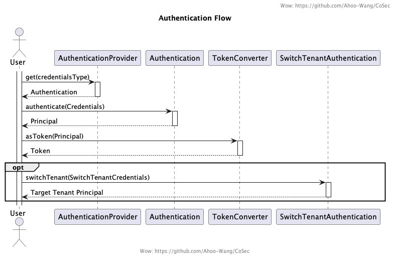
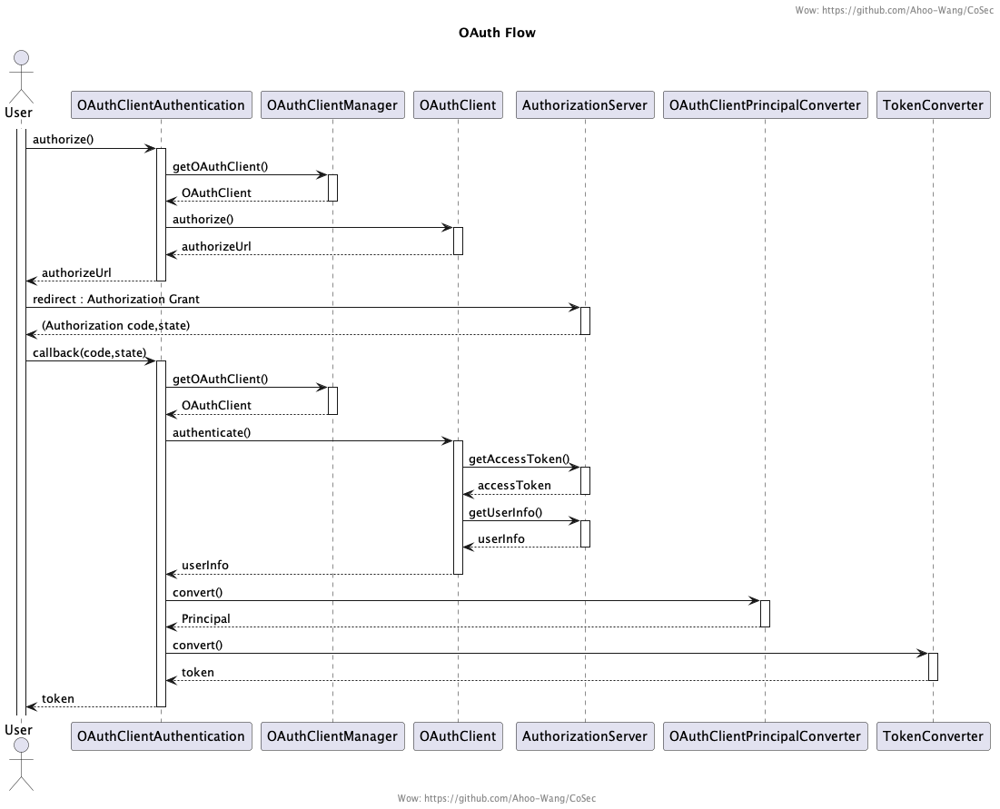
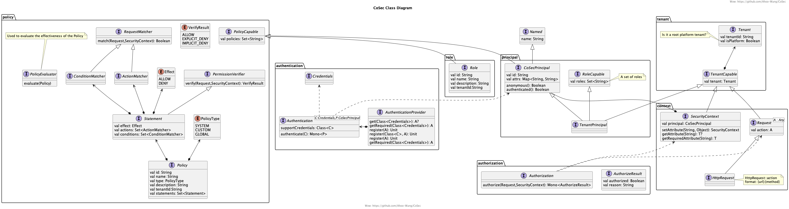

# CoSec

RBAC-based And Policy-based Multi-Tenant Security Framework

## Authentication

## Authorization

## OAuth

## Modeling

## Thanks

CoSec permission policy design refers to [AWS IAM](https://docs.aws.amazon.com/IAM/latest/UserGuide/introduction.html) .
