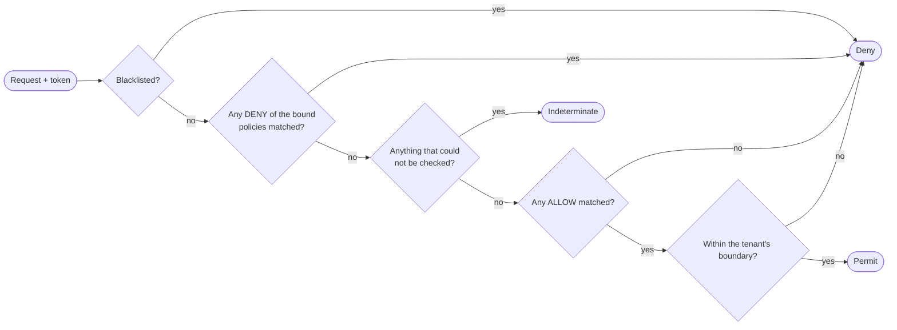

# CoSec

Multi-tenant, non-blocking authorization for Spring: IAM-style policy documents and role-based permissions,
evaluated deny-first for every request.

[](https://www.apache.org/licenses/LICENSE-2.0.html)
[](https://github.com/Ahoo-Wang/CoSec/releases)
[](https://central.sonatype.com/artifact/me.ahoo.cosec/cosec-api)
[](https://www.codacy.com/gh/Ahoo-Wang/CoSec/dashboard?utm_source=github.com&amp;utm_medium=referral&amp;utm_content=Ahoo-Wang/CoSec&amp;utm_campaign=Badge_Grade)
[](https://codecov.io/gh/Ahoo-Wang/CoSec)
[](https://github.com/Ahoo-Wang/CoSec/actions/workflows/ci.yml)
[](https://github.com/Ahoo-Wang/CoSec/actions/workflows/codeql.yml)
[](https://github.com/KotlinBy/awesome-kotlin)
[](https://deepwiki.com/Ahoo-Wang/CoSec)

> [Documentation](https://cosec.ahoo.me/) | [中文文档](https://cosec.ahoo.me/zh/)

## Why CoSec

- **Policies as data.** Platform, app and tenant documents in JSON: statements on actions and resources, typed
  conditions (roles, tenant, app and space, IP ranges, time windows, external attributes), and bindings that say
  who each policy applies to. Every instance compiles them into a snapshot read from Redis and picks up published
  changes without a restart.
- **Deny wins, everywhere.** Any matching DENY overrides every ALLOW, in any document; unmatched requests are
  denied; a request that cannot be decided fails closed with `503`, with two documented exceptions: while the revocation store cannot be read a request's token is accepted unless `cosec.authentication.revocation.fail-closed` is `true`, and past the bounded snapshot lag only the tenants in `cosec.authorization.snapshot.fail-closed.tenants` answer `503` ([Security model](https://cosec.ahoo.me/guide/security-model#the-two-documented-exceptions)).
- **Multi-tenant and role-based.** Tenants own their documents, each app publishes its permission catalog and
  grants permissions to roles per space, and platform boundaries cap what any tenant can allow.
- **Reviewed changes.** A control plane validates, simulates and shadow-tests a change on live traffic before it
  is published, keeps its revisions, and rolls back.
- **Rate limits.** Per-IP, per-user or shared quotas as document rules, spent only by permitted requests, counted
  cluster-wide in Redis, with `RateLimit-*` and `Retry-After` headers.
- **One pipeline, three stacks.** Spring WebFlux, Spring MVC and Spring Cloud Gateway share one pipeline and answer
  identically, with `application/problem+json` errors.
- **Fast and non-blocking.** About 2 µs of pipeline overhead per request, with no blocking on the event loop.
- **Auditable.** A decision event for every request (audit log, Kafka, Micrometer, OpenTelemetry), naming the
  statement and binding that decided it.

## How a decision is made


```mermaid
flowchart LR
    R([Request + token]) --> BL{Blacklisted?}
    BL -->|yes| DENY([Deny])
    BL -->|no| D{"Any DENY of the bound<br>policies matched?"}
    D -->|yes| DENY
    D -->|no| U{"Anything that could<br>not be checked?"}
    U -->|yes| IND([Indeterminate])
    U -->|no| A{Any ALLOW matched?}
    A -->|no| DENY
    A -->|yes| B{Within the tenant's boundary?}
    B -->|no| DENY
    B -->|yes| P([Permit])
```

Denied anonymous callers get `401`, authenticated callers `403`, undecidable requests `503`, and permitted requests
over a rate limit `429`.

## Quick start

Needs JDK 21, Spring Boot 4.1 and, for `cosec-cocache`, CoCache 8: see
[what CoSec needs from your build](https://cosec.ahoo.me/guide/introduction#what-cosec-needs-from-your-build).

```kotlin
dependencies {
    implementation(platform("me.ahoo.cosec:cosec-bom:<version>"))
    implementation("me.ahoo.cosec:cosec-spring-boot")
    implementation("me.ahoo.cosec:cosec-webflux")                      // or cosec-webmvc / cosec-gateway
    implementation("me.ahoo.cosec:cosec-cocache")                      // Redis: snapshot, revocation, rate limits
    implementation("org.springframework.boot:spring-boot-data-redis")
    implementation("me.ahoo.cocache:cocache-spring-boot-starter")
}
```

```yaml
cosec:
  jwt:
    secret: ${COSEC_JWT_SECRET}
  authorization:
    routes:
      location: ""   # no route map yet: requests are authorized as http:<METHOD> on http:path:<path>
```

Redis must run with `maxmemory-policy noeviction`. Publish a platform document (here with
`cosec-migrate publish`); until one exists, every request is answered `503`:

<!-- sample: wiki/examples/first-document/documents/platform.json -->
```json
{
  "schema": 2, "revision": 1, "publishedAt": "2026-11-01T08:00:00Z",
  "policies": [
    { "id": "public", "statements": [
      { "name": "login", "effect": "allow", "action": "http:POST", "resource": "http:path:/auth/login" },
      { "name": "health", "effect": "allow", "action": "http:GET", "resource": "http:path:/actuator/health" } ] },
    { "id": "members", "statements": [
      { "name": "read-the-api", "effect": "allow", "action": "http:GET", "resource": "http:path:/api/**",
        "condition": { "eq": ["subject.authenticated", true] } } ] },
    { "id": "admins-only", "statements": [
      { "name": "admin-api-needs-the-admin-role", "effect": "deny", "action": "http:*", "resource": "http:path:/api/admin/**",
        "condition": { "not": { "in": ["admin", "scope.roles"] } } } ] },
    { "id": "control-api", "statements": [
      { "name": "reach-the-control-api", "effect": "allow", "action": ["http:GET", "http:POST", "http:DELETE"],
        "resource": "http:path:/cosec/control/v1/**", "condition": { "eq": ["subject.authenticated", true] } } ] }
  ],
  "bindings": [
    { "id": "public", "subject": "*", "app": "*", "space": "*", "policy": "public" },
    { "id": "members", "subject": "*", "app": "*", "space": "*", "policy": "members" },
    { "id": "admins-only", "subject": "*", "app": "*", "space": "*", "policy": "admins-only" },
    { "id": "control-api", "subject": "*", "app": "*", "space": "*", "policy": "control-api" }
  ]
}
```

This document permits: anyone `POST /auth/login` and `GET /actuator/health`; a signed-in caller of **any tenant** `GET`
under `/api/` (under `/api/admin/` only with the role `admin`); and a signed-in caller the control API's paths, which is
what lets you change this document later through the control plane (`cosec-migrate publish` never overwrites, and each
control-plane step is authorized again as the caller). Everything else, every write included, is denied. Narrow
`/api/**` to your own routes before real use. The Quick Start's document differs (it has a demo token endpoint) and
can be changed the same way.

Continue with the [Quick Start](https://cosec.ahoo.me/guide/quick-start) to issue tokens, then the
[policy language](https://cosec.ahoo.me/policies/language).

## Modules

`cosec-spring-boot` brings the request pipeline, login, JWT support and auto-configuration; each integration
(WebFlux, MVC, Gateway, Redis, control plane, OAuth, OpenTelemetry, Micrometer, OpenAPI, ip2region, Kafka) is a module
you add next to it, and the starter wires what it finds on the classpath. `cosec-migrate` converts 7.x data and publishes documents. A browser or Node client is the npm packages `@ahoo-wang/cosec-fetcher` and `@ahoo-wang/cosec-react`, released with CoSec ([Building a client](https://cosec.ahoo.me/integration/clients)). See
[Modules](https://cosec.ahoo.me/guide/introduction#modules) for the full list. A ready-to-run gateway is
published as the container image `ahoowang/cosec-gateway`.

## Documentation

- **Getting started**: [Introduction](https://cosec.ahoo.me/guide/introduction) · [Quick Start](https://cosec.ahoo.me/guide/quick-start) ·
  [Concepts](https://cosec.ahoo.me/guide/concepts) · [Security Model](https://cosec.ahoo.me/guide/security-model)
- **Integration**: [Web Integration](https://cosec.ahoo.me/integration/web) · [Authentication](https://cosec.ahoo.me/integration/authentication) ·
  [Checks in Code](https://cosec.ahoo.me/integration/checks)
- **Policies**: [Policy Language](https://cosec.ahoo.me/policies/language) · [Role Permissions](https://cosec.ahoo.me/policies/role-permissions) ·
  [Rate Limiting](https://cosec.ahoo.me/policies/rate-limiting) · [Testing Policies](https://cosec.ahoo.me/policies/testing)
- **Operations**: [Configuration](https://cosec.ahoo.me/operations/configuration) · [Storage and Caching](https://cosec.ahoo.me/operations/storage) ·
  [Upgrading](https://cosec.ahoo.me/operations/upgrading) · [Observability](https://cosec.ahoo.me/operations/observability) ·
  [Troubleshooting](https://cosec.ahoo.me/operations/troubleshooting)
- **Architecture**: [Overview](https://cosec.ahoo.me/architecture/overview) · [Extending CoSec](https://cosec.ahoo.me/architecture/extending)
- **Releases**: [GitHub Releases](https://github.com/Ahoo-Wang/CoSec/releases)

## Contributing

Contributions are welcome. Read [CONTRIBUTING.md](CONTRIBUTING.md) for the workflow, quality gates and
release process. This project follows a [Code of Conduct](CODE_OF_CONDUCT.md).

## Security

Report vulnerabilities privately as described in [SECURITY.md](SECURITY.md); do not open public issues for them.

## License

CoSec is released under the [Apache License 2.0](LICENSE). Its policy model is inspired by
[AWS IAM](https://docs.aws.amazon.com/IAM/latest/UserGuide/introduction.html).
