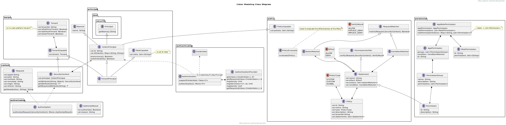

# CoSec

RBAC-based And Policy-based Multi-Tenant Reactive Security Framework.

[](https://www.apache.org/licenses/LICENSE-2.0.html)
[](https://github.com/Ahoo-Wang/CoSec/releases)
[](https://maven-badges.herokuapp.com/maven-central/me.ahoo.cosec/cosec-core)
[](https://www.codacy.com/gh/Ahoo-Wang/CoSec/dashboard?utm_source=github.com&amp;utm_medium=referral&amp;utm_content=Ahoo-Wang/CoSec&amp;utm_campaign=Badge_Grade)
[](https://codecov.io/gh/Ahoo-Wang/CoSec)


## Authentication


## Authorization


## OAuth


## Modeling



## Gateway


## Build In Policy

### ActionMatcher


### ConditionMatcher


## Policy Schema

[Policy Schema](document/cosec-policy.schema.json)

```json
{
  "id": "2",
  "name": "auth",
  "category": "auth",
  "description": "",
  "type": "global",
  "tenantId": "1",
  "statements": [
    {
      "effect": "allow",
      "actions": [
        {
          "type": "all"
        },
        {
          "type": "none"
        },
        {
          "type": "path",
          "methods": [
            "GET",
            "POST",
            "PUT",
            "DELETE"
          ],
          "pattern": "/user/{userId}/*"
        }
      ],
      "conditions": [
        {
          "type": "authenticated"
        },
        {
          "type": "in",
          "part": "context.principal.id",
          "in": [
            "userId"
          ]
        }
      ]
    },
    {
      "effect": "deny",
      "actions": [
        {
          "type": "all",
          "methods": [
            "GET"
          ]
        },
        {
          "type": "none"
        },
        {
          "type": "path",
          "pattern": ".*"
        },
        {
          "type": "path",
          "pattern": "#{principal.id}.*"
        },
        {
          "type": "reg",
          "pattern": ".*"
        },
        {
          "type": "reg",
          "pattern": "#{principal.id}.*"
        }
      ],
      "conditions": [
        {
          "type": "all"
        },
        {
          "type": "none"
        },
        {
          "type": "spel",
          "pattern": "context.principal.id=='1'"
        },
        {
          "type": "ognl",
          "pattern": "path == \"auth/login\""
        }
      ]
    }
  ]
}

```

## Thanks

CoSec permission policy design refers to [AWS IAM](https://docs.aws.amazon.com/IAM/latest/UserGuide/introduction.html) .
