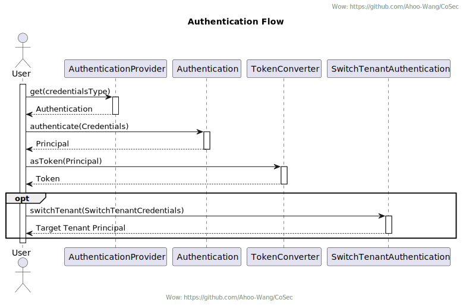
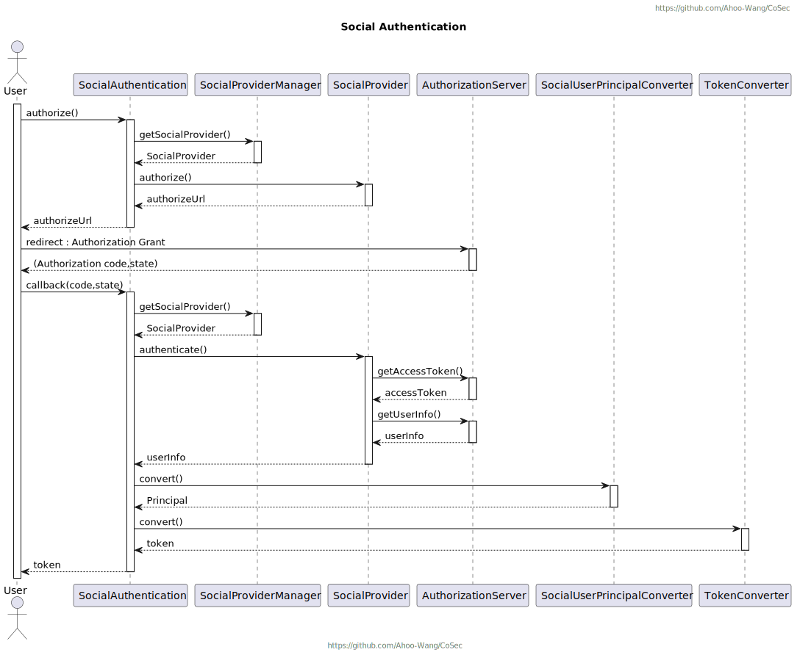
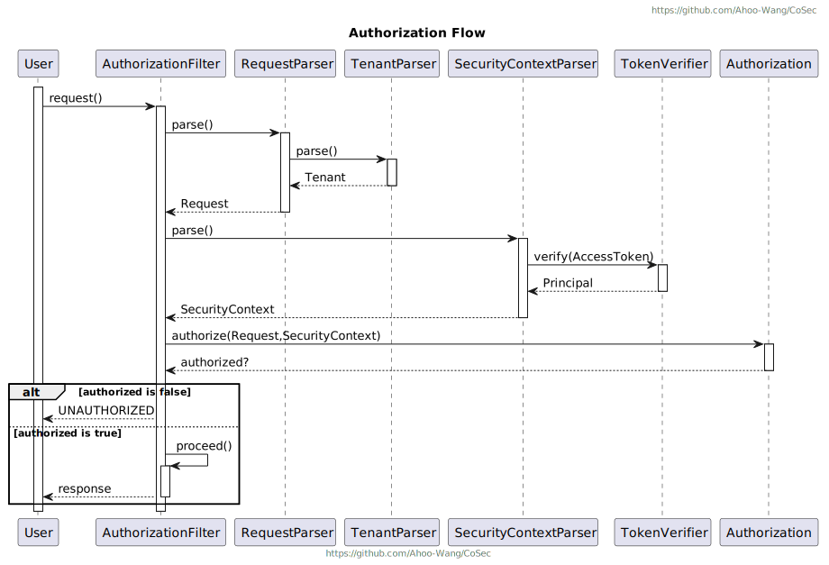
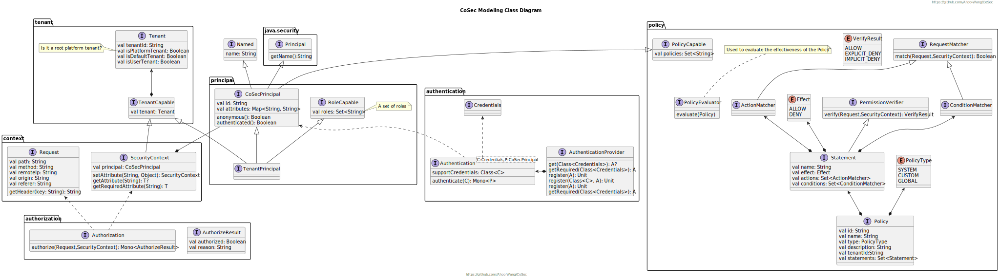
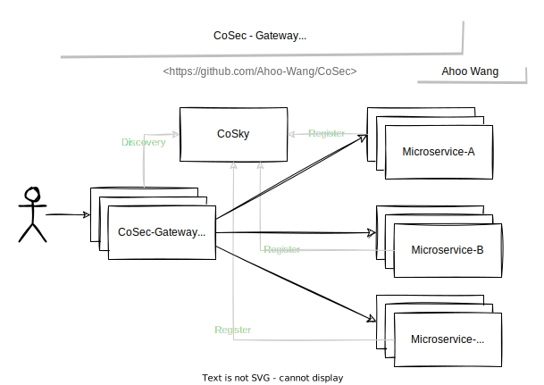
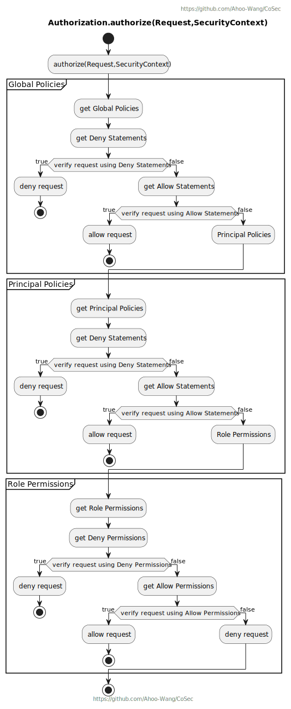
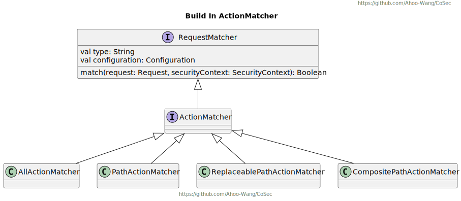
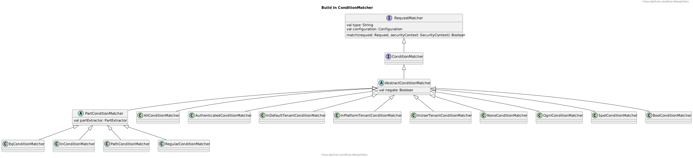
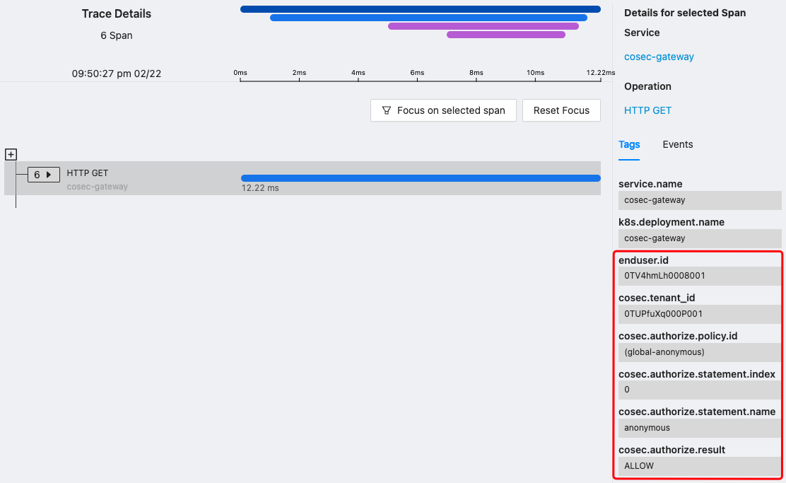

# CoSec

基于 RBAC 和策略的多租户响应式安全框架。

[](https://www.apache.org/licenses/LICENSE-2.0.html)
[](https://github.com/Ahoo-Wang/CoSec/releases)
[](https://maven-badges.herokuapp.com/maven-central/me.ahoo.cosec/cosec-core)
[](https://www.codacy.com/gh/Ahoo-Wang/CoSec/dashboard?utm_source=github.com&amp;utm_medium=referral&amp;utm_content=Ahoo-Wang/CoSec&amp;utm_campaign=Badge_Grade)
[](https://codecov.io/gh/Ahoo-Wang/CoSec)
[](https://github.com/Ahoo-Wang/CoSec)
[](https://github.com/KotlinBy/awesome-kotlin)

## 认证



### 社会化认证



## 授权



## 建模类图



## 安全网关服务



## 授权策略流程



## 内置策略匹配器

### ActionMatcher



#### 如何自定义 `ActionMatcher` (SPI)

> 参考 [PathActionMatcher](cosec-core/src/main/kotlin/me/ahoo/cosec/policy/action/PathActionMatcher.kt)

```kotlin
class CustomActionMatcherFactory : ActionMatcherFactory {
    companion object {
        const val TYPE = "[CustomActionType]"
    }

    override val type: String
        get() = TYPE

    override fun create(configuration: Configuration): ConditionMatcher {
        return CustomActionMatcher(configuration)
    }
}
class CustomActionMatcher(override val configuration: Configuration) : ActionMatcher {

    override val type: String
        get() = CustomActionMatcherFactory.TYPE

    override fun match(request: Request, securityContext: SecurityContext): Boolean {
        //Custom matching logic
    }
}
```

> META-INF/services/me.ahoo.cosec.policy.action.ActionMatcherFactory

```properties
# CustomActionMatcherFactory fully qualified name
```

### ConditionMatcher



#### 如何自定义 `ConditionMatcher` (SPI)

> 参考 [ContainsConditionMatcher](cosec-core/src/main/kotlin/me/ahoo/cosec/policy/condition/part/ContainsConditionMatcher.kt)

```kotlin
class CustomConditionMatcherFactory : ConditionMatcherFactory {
    companion object {
        const val TYPE = "[CustomConditionType]"
    }

    override val type: String
        get() = TYPE

    override fun create(configuration: Configuration): ConditionMatcher {
        return CustomConditionMatcher(configuration)
    }
}
class CustomConditionMatcher(configuration: Configuration) :
    AbstractConditionMatcher(CustomConditionMatcherFactory.TYPE, configuration) {

    override fun internalMatch(request: Request, securityContext: SecurityContext): Boolean {
        //Custom matching logic
    }
}
```

> META-INF/services/me.ahoo.cosec.policy.condition.ConditionMatcherFactory

```properties
# CustomConditionMatcherFactory fully qualified name
```

## 策略 Schema

配置 [Policy Schema](schema/cosec-policy.schema.json) 以支持 IDE ([IntelliJ IDEA](https://www.jetbrains.com/help/idea/json.html#ws_json_using_schemas)) 输入自动完成。


> 策略 Demo

```json
{
  "id": "id",
  "name": "name",
  "category": "category",
  "description": "description",
  "type": "global",
  "tenantId": "tenantId",
  "condition": {
    "bool": {
      "and": [
        {
          "authenticated": {}
        },
        {
          "rateLimiter": {
            "permitsPerSecond": 10
          }
        }
      ]
    }
  },
  "statements": [
    {
      "action": {
        "path": {
          "pattern": "/user/#{principal.id}/*",
          "options": {
            "caseSensitive": false,
            "separator": "/",
            "decodeAndParseSegments": false
          }
        }
      }
    },
    {
      "name": "Anonymous",
      "action": [
        "/auth/register",
        "/auth/login"
      ]
    },
    {
      "name": "UserScope",
      "action": "/user/#{principal.id}/*",
      "condition": {
        "authenticated": {}
      }
    },
    {
      "name": "Developer",
      "action": "*",
      "condition": {
        "in": {
          "part": "context.principal.id",
          "value": [
            "developerId"
          ]
        }
      }
    },
    {
      "name": "RequestOriginDeny",
      "effect": "deny",
      "action": "*",
      "condition": {
        "regular": {
          "negate": true,
          "part": "request.origin",
          "pattern": "^(http|https)://github.com"
        }
      }
    },
    {
      "name": "IpBlacklist",
      "effect": "deny",
      "action": "*",
      "condition": {
        "path": {
          "part": "request.remoteIp",
          "pattern": "192.168.0.*",
          "options": {
            "caseSensitive": false,
            "separator": ".",
            "decodeAndParseSegments": false
          }
        }
      }
    },
    {
      "name": "RegionWhitelist",
      "effect": "deny",
      "action": "*",
      "condition": {
        "regular": {
          "negate": true,
          "part": "request.attributes.ipRegion",
          "pattern": "^中国\\|0\\|(上海|广东省)\\|.*"
        }
      }
    },
    {
      "name": "AllowDeveloperOrIpRange",
      "action": "*",
      "condition": {
        "bool": {
          "and": [
            {
              "authenticated": {}
            }
          ],
          "or": [
            {
              "in": {
                "part": "context.principal.id",
                "value": [
                  "developerId"
                ]
              }
            },
            {
              "path": {
                "part": "request.remoteIp",
                "pattern": "192.168.0.*",
                "options": {
                  "caseSensitive": false,
                  "separator": ".",
                  "decodeAndParseSegments": false
                }
              }
            }
          ]
        }
      }
    },
    {
      "name": "TestContains",
      "effect": "allow",
      "action": "*",
      "condition": {
        "contains": {
          "part": "request.attributes.ipRegion",
          "value": "上海"
        }
      }
    },
    {
      "name": "TestStartsWith",
      "effect": "allow",
      "action": "*",
      "condition": {
        "startsWith": {
          "part": "request.attributes.ipRegion",
          "value": "中国"
        }
      }
    },
    {
      "name": "TestEndsWith",
      "effect": "allow",
      "action": "*",
      "condition": {
        "endsWith": {
          "part": "request.attributes.remoteIp",
          "value": ".168.0.1"
        }
      }
    }
  ]
}

```
## 应用权限元数据 Schema

配置 [App Permission Schema](schema/cosec-app-permission.schema.json) 以支持 IDE ([IntelliJ IDEA](https://www.jetbrains.com/help/idea/json.html#ws_json_using_schemas)) 输入自动完成。

> 应用权限元数据 Demo

```json
{
  "id": "manage",
  "condition": {
    "bool": {
      "and": [
        {
          "authenticated": {}
        },
        {
          "groupedRateLimiter": {
            "part": "request.remoteIp",
            "permitsPerSecond": 10,
            "expireAfterAccessSecond": 1000
          }
        },
        {
          "inTenant": {
            "value": "default"
          }
        }
      ]
    }
  },
  "groups": [
    {
      "name": "order",
      "description": "order management",
      "permissions": [
        {
          "id": "manage.order.ship",
          "name": "Ship",
          "description": "Ship",
          "action": "/order/ship"
        },
        {
          "id": "manage.order.issueInvoice",
          "name": "Issue an invoice",
          "description": "Issue an invoice",
          "action": "/order/issueInvoice"
        }
      ]
    }
  ]
}

```

## OpenTelemetry

[CoSec-OpenTelemetry](cosec-opentelemetry)

> CoSec 遵循 OpenTelemetry [General identity attributes](https://opentelemetry.io/docs/reference/specification/trace/semantic_conventions/span-general/#general-identity-attributes) 规范。



## 感谢

CoSec 权限策略设计参考 [AWS IAM](https://docs.aws.amazon.com/IAM/latest/UserGuide/introduction.html) 。
