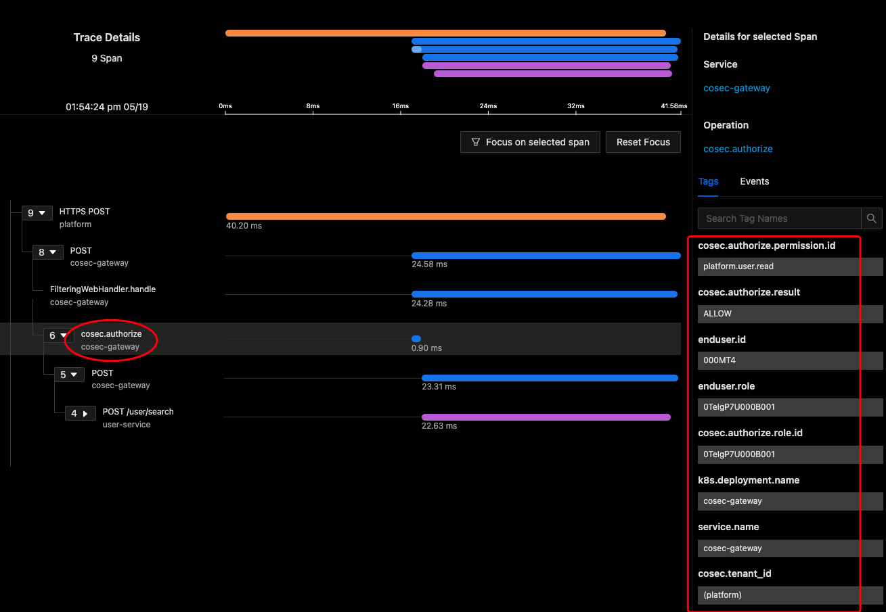

# CoSec

基于 RBAC 和策略的多租户响应式安全框架。

[](https://www.apache.org/licenses/LICENSE-2.0.html)
[](https://github.com/Ahoo-Wang/CoSec/releases)
[](https://maven-badges.herokuapp.com/maven-central/me.ahoo.cosec/cosec-core)
[](https://www.codacy.com/gh/Ahoo-Wang/CoSec/dashboard?utm_source=github.com&amp;utm_medium=referral&amp;utm_content=Ahoo-Wang/CoSec&amp;utm_campaign=Badge_Grade)
[](https://codecov.io/gh/Ahoo-Wang/CoSec)


## 认证


## 授权


## OAuth


## 建模类图


## 安全网关服务


## 授权策略流程


## 内置策略匹配器

### ActionMatcher


#### 如何自定义 `ActionMatcher` (SPI)

> 参考 [RegularActionMatcher](cosec-core/src/main/kotlin/me/ahoo/cosec/policy/action/RegularActionMatcher.kt)

```kotlin
class CustomActionMatcherFactory : ActionMatcherFactory {
    companion object {
        const val TYPE = "[CustomActionType]"
    }

    override val type: String
        get() = TYPE

    override fun create(onfiguration: Configuration): ActionMatcher {
        return CustomActionMatcher(onfiguration)
    }
}
class CustomActionMatcher(configuration: Configuration) :
    AbstractActionMatcher(CustomActionMatcherFactory.TYPE, configuration) {

    override fun internalMatch(request: Request, securityContext: SecurityContext): Boolean {
        //Custom matching logic
    }
}
```

> META-INF/services/me.ahoo.cosec.policy.action.ActionMatcherFactory

```properties
# CustomActionMatcherFactory fully qualified name
```

### ConditionMatcher


#### 如何自定义 `ConditionMatcher` (SPI)

> 参考 [ContainsConditionMatcher](cosec-core/src/main/kotlin/me/ahoo/cosec/policy/condition/part/ContainsConditionMatcher.kt)

```kotlin
class CustomConditionMatcherFactory : ConditionMatcherFactory {
    companion object {
        const val TYPE = "[CustomConditionType]"
    }

    override val type: String
        get() = TYPE

    override fun create(configuration: Configuration): ConditionMatcher {
        return CustomConditionMatcher(configuration)
    }
}
class CustomConditionMatcher(configuration: Configuration) :
    AbstractActionMatcher(CustomActionMatcherFactory.TYPE, configuration) {

    override fun internalMatch(request: Request, securityContext: SecurityContext): Boolean {
        //Custom matching logic
    }
}
```

> META-INF/services/me.ahoo.cosec.policy.condition.ConditionMatcherFactory

```properties
# CustomConditionMatcherFactory fully qualified name
```

## 策略 Schema

配置 [Policy Schema](document/cosec-policy.schema.json) 以支持 IDE ([IntelliJ IDEA](https://www.jetbrains.com/help/idea/json.html#ws_json_using_schemas)) 输入自动完成。


> 策略 Demo

```json
{
  "id": "id",
  "name": "name",
  "category": "category",
  "description": "description",
  "type": "global",
  "tenantId": "tenantId",
  "statements": [
    {
      "name": "Anonymous",
      "effect": "allow",
      "actions": [
        {
          "type": "path",
          "pattern": "/auth/register"
        },
        {
          "type": "path",
          "pattern": "/auth/login"
        }
      ]
    },
    {
      "name": "UserScope",
      "effect": "allow",
      "actions": [
        {
          "type": "path",
          "pattern": "/user/#{principal.id}/*"
        }
      ],
      "condition": {
        "type": "authenticated"
      }
    },
    {
      "name": "Developer",
      "effect": "allow",
      "actions": [
        {
          "type": "all"
        }
      ],
      "condition": {
        "type": "in",
        "part": "context.principal.id",
        "in": [
          "developerId"
        ]
      }
    },
    {
      "name": "RequestOriginDeny",
      "effect": "deny",
      "actions": [
        {
          "type": "all"
        }
      ],
      "condition": {
        "type": "reg",
        "negate": true,
        "part": "request.origin",
        "pattern": "^(http|https)://github.com"
      }
    },
    {
      "name": "IpBlacklist",
      "effect": "deny",
      "actions": [
        {
          "type": "all"
        }
      ],
      "condition": {
        "type": "path",
        "part": "request.remoteIp",
        "path": {
          "caseSensitive": false,
          "separator": ".",
          "decodeAndParseSegments": false
        },
        "pattern": "192.168.0.*"
      }
    },
    {
      "name": "RegionWhitelist",
      "effect": "deny",
      "actions": [
        {
          "type": "all"
        }
      ],
      "condition": {
        "negate": true,
        "type": "reg",
        "part": "request.attributes.ipRegion",
        "pattern": "^中国\\|0\\|(上海|广东省)\\|.*"
      }
    },
    {
      "name": "AllowDeveloperOrIpRange",
      "effect": "allow",
      "actions": [
        {
          "type": "all"
        }
      ],
      "condition": {
        "type": "bool",
        "bool": {
          "and": [
            {
              "type": "authenticated"
            }
          ],
          "or": [
            {
              "type": "in",
              "part": "context.principal.id",
              "in": [
                "developerId"
              ]
            },
            {
              "type": "path",
              "part": "request.remoteIp",
              "path": {
                "caseSensitive": false,
                "separator": ".",
                "decodeAndParseSegments": false
              },
              "pattern": "192.168.0.*"
            }
          ]
        }
      }
    }
  ]
}

```

## OpenTelemetry

[CoSec-OpenTelemetry](cosec-opentelemetry)

> CoSec 遵循 OpenTelemetry [General identity attributes](https://opentelemetry.io/docs/reference/specification/trace/semantic_conventions/span-general/#general-identity-attributes) 规范。



## 感谢

CoSec 权限策略设计参考 [AWS IAM](https://docs.aws.amazon.com/IAM/latest/UserGuide/introduction.html) 。
