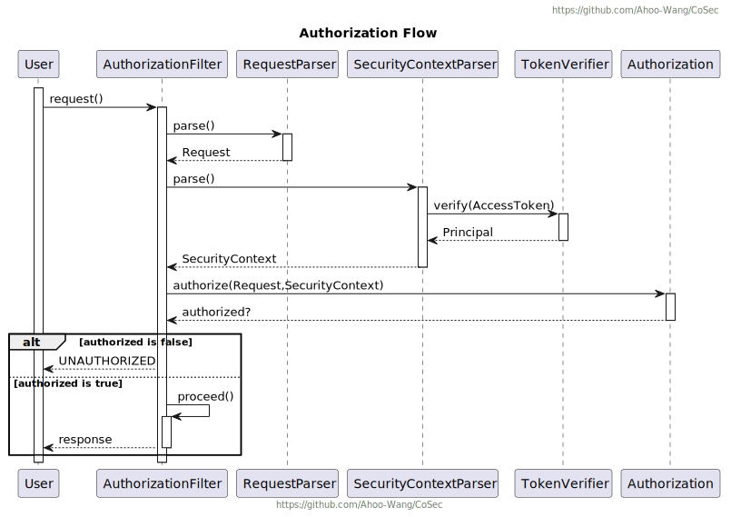

# CoSec

基于 RBAC 和策略的多租户响应式安全框架。

[](https://www.apache.org/licenses/LICENSE-2.0.html)
[](https://github.com/Ahoo-Wang/CoSec/releases)
[](https://maven-badges.herokuapp.com/maven-central/me.ahoo.cosec/cosec-core)
[](https://www.codacy.com/gh/Ahoo-Wang/CoSec/dashboard?utm_source=github.com&amp;utm_medium=referral&amp;utm_content=Ahoo-Wang/CoSec&amp;utm_campaign=Badge_Grade)
[](https://codecov.io/gh/Ahoo-Wang/CoSec)


## 认证


## 授权



## OAuth


## 建模类图


## 安全网关服务


## 授权策略流程


## 内置策略匹配器

### ActionMatcher


### ConditionMatcher


## 策略 Schema

[Policy Schema](document/cosec-policy.schema.json)

```json
{
  "id": "id",
  "name": "name",
  "category": "category",
  "description": "description",
  "type": "global",
  "tenantId": "tenantId",
  "statements": [
    {
      "name": "Anonymous",
      "effect": "allow",
      "actions": [
        {
          "type": "path",
          "pattern": "/auth/register"
        },
        {
          "type": "path",
          "pattern": "/auth/login"
        }
      ]
    },
    {
      "name": "UserScope",
      "effect": "allow",
      "actions": [
        {
          "type": "path",
          "pattern": "/user/#{principal.id}/*"
        }
      ],
      "conditions": [
        {
          "type": "authenticated"
        }
      ]
    },
    {
      "name": "Developer",
      "effect": "allow",
      "actions": [
        {
          "type": "all"
        }
      ],
      "conditions": [
        {
          "type": "in",
          "part": "context.principal.id",
          "in": [
            "developerId"
          ]
        }
      ]
    },
    {
      "name": "RequestOriginDeny",
      "effect": "deny",
      "actions": [
        {
          "type": "all"
        }
      ],
      "conditions": [
        {
          "type": "reg",
          "negate": true,
          "part": "request.origin",
          "pattern": "^(http|https)://github.com"
        }
      ]
    },
    {
      "name": "IpBlacklist",
      "effect": "deny",
      "actions": [
        {
          "type": "all"
        }
      ],
      "conditions": [
        {
          "type": "path",
          "part": "request.remoteIp",
          "path": {
            "caseSensitive": false,
            "separator": ".",
            "decodeAndParseSegments": false
          },
          "pattern": "192.168.0.*"
        }
      ]
    }
  ]
}
```

## 感谢

CoSec 权限策略设计参考 [AWS IAM](https://docs.aws.amazon.com/IAM/latest/UserGuide/introduction.html) 。
