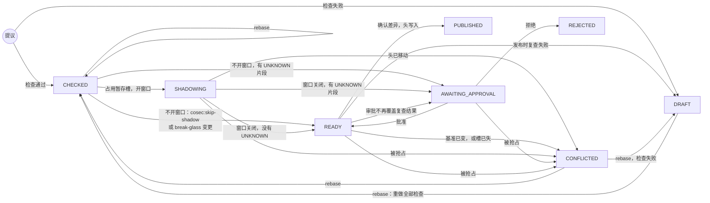
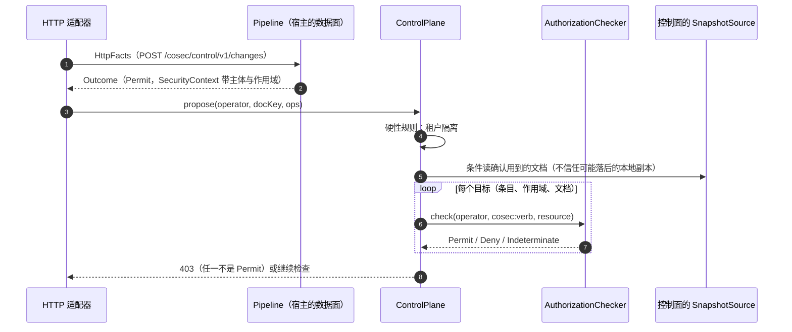

# RFC 0007：控制面——修订、发布流程与控制面自身的授权（RFC 0001 迁移第 6 阶段）

> 状态：已确认（第 2 版，§17 的决定已于 2026-10-26 由维护者确认）；已实施 · 上位文档：[RFC 0001](0001-target-architecture.md) P9、P12、§3.2、§3.7、§5、§6 第 6 阶段、§7.1 ·
> 前置：[RFC 0002](0002-pure-engine.md)（第 2 阶段）、[RFC 0003](0003-policy-snapshot.md)（第 3 阶段）、[RFC 0004](0004-unified-model.md) 与
> [RFC 0005](0005-condition-ast.md)（第 4 阶段）、[RFC 0006](0006-coroutine-pipeline.md)（第 5 阶段）·
> 范围：`cosec-control`（`core/control/`）；控制面的门面 `cosec-control-sdk` 与它经 HTTP 的实现 `cosec-control-http`；`cosec-cocache` 的控制存储；
> `engine` 的平台边界；`cosec-document` 的格式描述与 `schema/`；starter 的控制面装配；控制面宿主镜像 `cosec-control-server`（`platform/control-server`）
>
> **合订（2026-11-23）**：本文把它的修订说明与实现说明并回了正文，只陈述现状：被取代的说法删去，理由保留为理由；章节号与被引用的编号
> （M、N、V、X、Q、P-B、A5–A8、PR-1–PR-11）不变。合订前的全文：`git show 69b94a2b:docs/rfc/0007-control-plane.md`。

## 0. 结论先行

第 5 阶段结束时，数据面已经是"读快照 → 纯函数决策 → 义务与监听器"，但写入一侧还停在第 3 阶段：任何拿到 `SnapshotPublisher` 的代码都能改策略，
写入不经授权，没有修订链，也没有发布前的影子比较。本阶段把写入一侧补成控制面，它是快照文档唯一的写入者：

```
变更请求 = 基准修订 + 条目级操作
    → 授权（谁能写这里）→ 校验 → 编译（与数据面同一个编译器）→ 授出分析（不能越权授权）
    → 影子窗口（数据面在真实流量上比较基准与候选）→ 必要时审批 → 发布（一次 putIfMatch）→ 修订记录
```

- **已发布的快照文档就是存储的权威**（§5）。不另设"策略库"：控制面的存储由已发布的快照文档（头）、只建不改的**修订记录**（按摘要寻址，经文档头里的
  `parent` 指针连成链）、**变更请求**以及它们的索引组成，都在 CoCache 8 的 `Store` 上，写入一律是条件写；发布只对一个 key 做比较并交换，
  数据面看到的永远是某一个完整修订（P7）。回滚就是把一条旧记录作为新修订重新发布，同样走完整流程。
- **编译失败保留旧版本，在源头上成立**（§6.3）。控制面用数据面的编译器、对完整的组合快照编译候选文档，有任何 `Broken` 条目就拒绝发布；
  头没有被写，每个实例都继续用上一个修订。数据面自己的 F5（RFC 0003 §4.4）仍是失败即拒绝：在数据面回退到旧版本会让一条已发布的 DENY 被静默忽略（§3 M2）。
- **影子窗口默认强制**（§6.4）。候选文档写进单独的命名空间，数据面在采样请求上用它再评估一次，按实例汇总差异；窗口达到最短时长和最少样本后关闭，
  发布者必须按数字确认差异。跳过窗口需要单独的权限，并记入审计（§3 M1）。
- **控制面用同一个引擎保护自己**（§7）。控制面的动作是 `cosec:*` 命名空间的 `service:verb`，资源是文档、条目和作用域；检查经 `AuthorizationChecker`
  在刚确认过的快照上进行，另有一条不经策略的硬性规则：租户的主体只能写自己租户的文档。
- **不能越权授权**（§7.4）是 RFC 0001 §7.1 那条决定的可执行版本：把一次变更拆成"授出的语句片段"，每一片必须被授权者自己的**某一条** ALLOW 包含——
  适用范围覆盖、动作与资源模式包含（RFC 0005 §5.5）、条件蕴含（RFC 0005 §4.2 的 `implies`，先把授权者自身的属性代换成常量），并且不与授权者
  受到的非 `Anyone` DENY 重叠。判断不了的进入审批，从不按"大概包含"放行。语义定义和可靠性论证都写出来，由性质测试 A5–A8 守护。
- **信任根与审批**（§7.3、§7.5）：信任根是平台租户中持有 `cosec:approve` 的人；工作负载的凭据（API key、服务自己的身份）从不是信任根，也从不批准；
  经服务配置（服务端口与门面）没有人是信任根。审批是另一个人对候选摘要的批准，发布时再核实一次。
- **平台边界**（§7.6）：租户文档的 `boundary` 字段（只有平台能写）或平台的默认边界指向一条平台策略；引擎在得到 Permit 之后检查请求是否落在边界之内。
  没有边界数据时这一步是恒等的。
- **break-glass**（§8）只能经控制面创建：主体是平台租户的主体，双人（申请人与批准人不同），有上限的有效期（默认 4 小时，至多 24 小时），创建前必须有一个
  `REQUIRED` 的控制面审计监听器写入成功；使用仍按 RFC 0006 §9.4.3 写 `REQUIRED` 审计。
- **租户自助**（§9）：租户写自己的 `Tenant(T)` 文档，可以引用平台策略和应用目录里的权限策略；平台层、边界、break-glass 不可写。
  DENY 上的 `onMissing: nomatch` 经显式确认后可以写在任何文档里。
- **API**（§10）：一个挂起函数的库 `ControlPlane`；starter 在类路径上有 `cosec-control` 时提供 HTTP 路由，并可以另开一个只服务服务配置的端口；
  控制面宿主镜像 `cosec-control-server` 是只做这件事的应用。应用经门面 `ControlService` 调用控制面：进程内的 `LocalControlService`，或经 HTTP 调控制面宿主
  服务端口的 `HttpControlService`，两者走同一条路由的代码路径；其上是类型化的 `ControlClient`。控制请求没有自己的期限：期限是调用方的，经取消到达（§10.2）。
  `schema/<line>/*.schema.json` 从 `cosec-document` 里的文档格式描述生成，`check` 校验提交的文件没有过期。
- **门槛 D**（§12）已由 [RFC 0008](0008-conformance-and-direct-build.md) 的规范一致性套件取代；本阶段的性质（P-B1–P-B3、发布往返）作为规范性质保留。
- 实现按 §16 的 PR 划分合入，都已完成；29 项决定见 §17（2026-10-26 全部按推荐确认），其后的决定写在它们所改的章节里。

---

## 1. 范围与非目标

### 1.1 本阶段要做的

1. `cosec-control`（§5.1）：`ControlPlane`、变更请求、发布流程、授出分析、审批、break-glass、回滚、声明式 `apply`、`simulate`/`explain`/`analyze`。
2. `ControlStore` 端口与基于 CoCache 的实现（`cosec-cocache`）：修订记录、修订索引、变更请求、候选文档、反向引用索引（§5.2）。
3. 发布前的校验与编译（§6.2、§6.3），包括 RFC 0005 推迟到这里的成本上限与 `Catalog` 校验。
4. 影子窗口（§6.4）：候选文档的分发、数据面读取候选、影子报告与汇总、窗口判定与确认。
5. 控制面写操作的授权（§7.1–§7.3）与不能越权授权（§7.4）、审批（§7.5）。
6. 平台边界与 `withinBoundary`（§7.6），涉及 `engine` 与文档编译。
7. break-glass（§8）、租户自助的规则与隔离检查（§9）、DENY 上 `onMissing: nomatch` 的确认（§9.5）。
8. 控制面审计事件与变更监听器（§10.5），Kafka 实现。
9. 从文档格式描述生成 JSON schema（§10.4）。
10. `cosec-migrate bootstrap`、`restore`（§5.9）；`cosec-migrate publish` 经控制面的存储写入。
11. 控制面的 HTTP 路由、服务端口与门面 `ControlService`（§10.2），控制面宿主镜像。
12. JMH 与控制面延迟测量（§14）。
13. 删除 `SnapshotPublisher`、`RedisSnapshotPublisher`、`LocalPolicyInitializer` 的写库模式、`PolicyHistory` 与两个 `PolicyRevisionStore`、
    `ShadowPolicyProvider` 与本地影子文件、`cosecExplain` actuator 端点（随 RFC 0008 的切换完成）。

### 1.2 非目标

| 内容 | 处理 | 留到 |
|---|---|---|
| 管理界面（UI） | 不做。HTTP API 是 UI 的后端，UI 由应用自建 | — |
| 文档签名（防止拿到 Redis 写权限的人伪造文档） | 不做。拥有 Redis 写权限的一方在威胁模型之外，与 7.x 相同；靠 Redis ACL 限制写入方（§11） | 8.0 之后，单独的 RFC |
| 修订记录的长期归档（对象存储、数据库） | 不做。只在 Redis 中按数量与时间保留（§5.7） | 有需求时加一个 `RevisionArchive` SPI |
| 跨租户的数据面访问（平台人员以某租户的身份调用业务接口） | 不做。与 RFC 0004 §4.3 相同：主体只读自己租户的文档 | — |
| GraalVM native image | 不支持（RFC 0001 §3.10） | 8.0 之后，只针对 `cosec-gateway-server` |
| 发布 8.0 | 不在本文。RC 与 GA 的条件见 RFC 0008 §3.9，由维护者决定 | — |

控制面可以嵌入管理服务（库），也可以作为独立的控制面宿主运行（`cosec-control-server`，维护者 2026-11-21 决定；§3 M9 下的说明、§10.2）。

**本阶段不改变任何数据面决策**（Permit / Deny / Indeterminate 的划分、状态码、做出决策的语句）。改变的是写入一侧、可观测性输出（§15）和 API。
没有边界数据时平台边界是恒等的（P-B1，§7.6）。

---

## 2. 前面各阶段推迟到本阶段的事项

> **2026-11-23 压缩时删去**：本节是前面各阶段推迟到本阶段的事项与各自在本文的去处，都已实现。原文见 `git show 3cd4dca9:docs/rfc/0007-control-plane.md`。

## 3. RFC 0001 中与第 6 阶段有关的不一致

与 RFC 0003 §2、RFC 0004 §3、RFC 0006 §3 一样，不悄悄选边，逐条列出，每条对应 §17 的一个决定。

| # | 合订前的 RFC 0001（`git show b164f273:docs/rfc/0001-target-architecture.md`） | 问题 | 本文的处理 |
|---|---|---|---|
| M1 | §3.7："发布前强制：Schema 校验 → 编译 → 引用完整性检查 → **可选的**影子窗口"；§6 第 6 阶段："发布流程**强制**校验 + 编译 + 影子窗口" | 影子窗口是可选还是强制，两处相反。完全强制又有两个问题：低流量的租户可能永远攒不够样本；紧急的 DENY 和 break-glass 不能等十几分钟 | 默认强制。跳过需要 `cosec:skip-shadow` 权限并写明原因（记入修订记录与审计）；break-glass 的创建与撤销按种类免除；达不到样本数的窗口在最长时长后关闭，发布者必须确认"证据不足"（§6.4）。Q1 |
| M2 | §3.4（数据面）："数据面……编译失败就保留旧版本并告警" | RFC 0003 Q8 已说明：在数据面回退意味着请求按比已发布的头更旧的修订决策，一条刚发布的 DENY（例如紧急封禁）会被静默忽略。RFC 0003 把它推迟到第 6 阶段，理由是"控制面在发布前编译之后再引入"——但发布前编译之后，数据面的编译失败只剩一种来源：实例与控制面的版本或配置不一致（缺 hint、缺属性提供者、代码版本不同），这时回退同样不安全 | "保留旧版本"在源头上实现：编译失败的候选不发布，头不变，所有实例照常使用上一个修订（§6.3）。数据面的 F5 保持失败即拒绝，告警指明"控制面接受、本实例拒绝"（`cosec.snapshot.loads{result=incompatible}`）。Q2 |
| M3 | §3.7："`PolicyStore`：……修订历史、回滚——现有 `policy/history` 搬过来" | 现有历史按**策略**记录，写在策略**之后**、与策略分属不同的 Redis key（`PolicyHistory` 的 `VersionedPolicyRepository`）：写入成功而追加历史失败时历史缺一条；绑定、目录、应用权限的变化根本没有历史；也无法回答"某次决策时三份文档各是什么"（RFC 0001 §3.3 的解释要求）。快照模型里发布的单位是文档 | 修订按**文档**记录，记录先于头写入、按摘要寻址，头里带 `parent` 指针（§5.3、§5.4）。按策略的历史是相邻修订的差异视图。现有代码不搬，删除。Q3 |
| M4 | §3.7："子集检查**在编译期**对策略做静态包含判断；判断不了的（**例如带条件的语句**）一律拒绝" | 与 §7.1 的决定不一致：§7.1 允许"授权者的条件 AND 额外条件"，并把"其余"送去审批而不是拒绝。另外，包含判断需要知道授权者是谁、有什么权限，快照编译器不知道这些 | 以 §7.1 为准（它是后来确认的决定）。检查在控制面的发布流程中进行，不在快照编译器里（§7.4） |
| M5 | §3.7："被授出的动作和资源必须是授权者本人**在同一作用域内拥有的权限**的子集" | 没有定义：① 授权者的权限按哪个快照、成员关系从哪里来；② 授权者受到的 DENY 算不算；③ 修改一条已被绑定的策略、或把策略设为可附加，是不是"授出"；④ 条件中引用主体自身属性（`subject.id`）时，"同一条件"对授权者和被授权者含义不同 | 给出语义定义（§7.4.2）：被授权者能做的每个请求，换成授权者本人发出时必须在当前快照下被允许。①当前发布的快照、授权者本次请求的成员关系；②非 `Anyone` 绑定的 DENY 计入（Q8 的备选：全部计入）；③是授出（§7.4.1）；④先把授权者自身的属性代换成常量（§7.4.3） |
| M6 | §7.1："DENY 在授权者有写权限的作用域内一律允许；其余拒绝并进入平台管理员审批" | 没说**删除或放宽 DENY**（这是放宽访问）与**删除 ALLOW、绑定**（这是收窄）。按字面，前者属于"其余"，每删一条租户自己写的 DENY 都要平台审批；后者也是"其余"，连撤销一个角色绑定都要审批 | 收窄（删除绑定、删除或收窄 ALLOW、新增 DENY）在有写权限的作用域内一律允许。删除或放宽 DENY 在有写权限的作用域内允许，除非该条目标为 `protected`（需要 `cosec:unprotect`）；租户层删掉自己的 DENY，结果仍受平台层的 DENY 与边界约束（§7.4.4）。Q9 |
| M7 | §3.2、§3.7：break-glass 绑定"**只能由控制面创建**"、"只能由平台管理员创建" | 数据面编译器读到一份文档时不知道是谁写的，这条约束无法在数据面上检查；RFC 0004 §8.4 的转换工具也会生成 root 绑定 | 约束由"控制面是快照文档唯一的写入者"（PR-11 删除其他写入路径，ArchUnit 守护）加上 Redis ACL 实现；绑定带 `grantedBy`/`approvedBy`/`change` 元数据，编译器检查它们存在且两人不同；转换工具生成的 root 绑定在 `publish` 时受同样的期限上限（§8）。Q12 |
| M8 | §3.7："平台层可以给**每个租户**设一条边界策略，租户内的任何 Permit 都必须同时落在边界之内" | 没说：存在哪里（逐租户写进 `Platform` 文档会让它随租户数增长，RFC 0004 的平台文档常驻每个实例）；是否约束平台层授出的 Permit 与 break-glass；边界策略里能不能有 DENY | 平台文档放一条默认边界，租户文档的 `boundary` 字段（只有平台能写）覆盖它；约束该租户主体的**全部** Permit（包括平台层授出的）；平台租户不能有边界，break-glass 的主体只能是平台租户的主体，所以不受边界影响；边界策略只能有 ALLOW（§7.6）。Q11 |
| M9 | §4：`cosec-control` 依赖 "engine, runtime"，"自身的写操作经 Pipeline 授权"，来自"`policy/history`、生成器 endpoint" | ① Pipeline 按 HTTP 路径授权，而控制面写的是请求体里点名的文档、条目和作用域，路径级的授权表达不了；② 控制面还要文档编解码与编译器，它们在 `cosec-core`（RFC 0004 Q10、RFC 0006 Q5）；③ 生成器端点读宿主自己的 OpenAPI，放进控制面就要求控制面与业务服务同进程 | Pipeline 负责认证和粗粒度的路径授权，细粒度的授权在控制面内部经 `AuthorizationChecker`（RFC 0006 §7.6）逐个目标检查（§7.2）；`cosec-control` 依赖 `cosec-core`、`runtime/`、`engine/`、`model/`；生成器端点留在 starter，它们的输出是 `apply` 的输入（§6.7）。Q7 |
| M10 | §3.1 图："`STORE`（PolicyStore 版本化, CAS）-- CoCache 失效广播 --> `SnapshotSource`" | 读起来像有一个独立的策略库，再由它生成快照。RFC 0003/0004 已经让快照文档成为 Redis 中的权威存储（`PolicySnapshotCache`，`ttl = null`、读失败抛出）。再加一份权威数据，就要在两者之间同步，正是 D4 的形状 | 已发布的快照文档就是头；修订记录和变更请求是辅助数据，丢了也不影响数据面（§5.2）。Q4 |
| M11 | §3.7："`schema/*.schema.json` 由**模型代码**生成" | `model/` 只依赖标准库（RFC 0002、RFC 0004 Q10），文档用 `cosec-core` 里手写的 Jackson 流式代码编解码，没有可供反射的数据类，模型类的形状也不等于 JSON 的形状 | 在 `cosec-core` 中增加一份声明式的**文档格式描述**，生成 schema 并用一致性测试把它和编解码器绑在一起（§10.4）。Q19 |
| M12 | §4："除 WebFlux/Gateway 适配器外，任何模块都不得依赖 Reactor"；RFC 0006 Q6 把类路径检查推迟到第 6 阶段之后 | 第 6 阶段删除 `SnapshotPublisher` 之后，类路径仍然有 Reactor：`lettuce-core` 依赖 `reactor-core`，`cosec-cocache` 的 Redis 后端、Spring Data Redis 都经过它；starter 的 WebFlux 适配也需要它 | 不做类路径检查。规则定为：除三个适配器与 starter 的 WebFlux 装配外，任何模块的**公开签名**不出现 `reactor.*` 类型；`model/`、`engine/`、`runtime/`、`control/` 的类不引用 `reactor.*`（ArchUnit）。Q20 |
| M13 | §3.4 规模假设（单租户万级语句，可以全量驻留内存）；§3.7 修订历史 | 没有考虑历史的体积：RFC 0003 Q14 允许文档到 8 MB，按文档保留 50 个修订就是 400 MB 一份文档 | 保留按数量与最短时间，体积只告警；修订记录是整份文档，保留数默认 50、最短 7 天（§5.7）。Q6 |
| M14 | §3.7："提供 `simulate(request, candidateDocument)`、`explain(request)`、`analyze()`" | `explain(request)` 没有版本参数，与 §3.3"解释一次历史决策时，必须针对该决策记录的快照版本重新评估"矛盾。`analyze` 的"谁能访问"在 P11 之后无法列出用户：成员关系不在快照里 | `explain` 带可选的 `SnapshotVersion`；`analyze` 的答案以绑定的主体（角色、主体绑定、`Anyone`、可附加策略）表达（§10.3）。Q22 |
| M15 | P12、§3.7："控制面……用同一个引擎来保护自己" | 自举问题：存储为空时没有任何主体有权写入，包括写入第一个管理员 | `cosec-migrate bootstrap` 离线写入第一个平台管理员绑定（§5.9）。Q26 |

上表照录合订前的 RFC 0001 与当时的处理；之后变了的几项，今天的处理以正文为准：

- **M2**：本实例编译失败今天记为 `cosec.snapshot.compile.duration{result=failure}`（`cosec-micrometer`），没有名为 `cosec.snapshot.loads{result=incompatible}` 的指标值。
- **M7**：数据面编译器检查 break-glass 绑定的 `grantedBy`/`approvedBy`/`change` 元数据的规定已取消（RC1-27）：两人原则由控制面对每种变更强制（`BRK-5`），
  修订的出处记录作者与批准人；`cosec-migrate` 不写任何 break-glass 绑定（§8）。
- **M9**：控制面的依赖今天是 `runtime`、`document`、`spi`、`engine`、`model`（`cosec-core` 已拆分，RFC 0011）；除了嵌入应用，控制面也作为独立的
  控制面宿主运行（`cosec-control-server`，§1.2、§10.2）。
- **M11**：文档格式描述在 `cosec-document`（§10.4）。
- **M12**：今天的规则是 `test/architecture` 的 `RuntimeBoundaryTest`、`ControlBoundaryTest` 与 `SourceRulesTest`：Reactor 只在边缘适配器与宿主中
  （以及 `cosec-cocache` 的响应式 Redis 客户端，从不出现在它的公开签名里），`model`、`engine`、`spi`、`document`、`runtime`、`control` 不引用 `reactor.*`。

### 3.1 前面各 RFC 之间、以及与现有代码之间的不一致

| # | 文档或代码的说法 | 问题 | 本文的处理 |
|---|---|---|---|
| N1 | RFC 0004 §7.2：`Tenant` 文档的绑定不能指向 `App` 文档的权限策略（"否则 `App` 文档删除一个权限就会让某个租户文档的引用悬空"） | 租户自助需要把应用目录里的权限授给自己的角色；不能引用就只能复制语句，复制之后应用改权限时租户这边不会跟着改。RFC 0004 的理由是跨文档悬空引用，而 `Tenant → Platform` 引用有同样的问题，已经由"悬空即 `unresolved`、失败即拒绝"加上控制面的反向检查解决 | 允许 `Tenant(T)` 的绑定指向 `App(a)` 的权限策略，绑定的作用域必须是 `app = Exactly(a)`；悬空按 `MissingPolicies` 处理；控制面的反向引用索引覆盖它（§5.8、§9.3）。一次评估本来就在 `scope.roles` 非空时加载 `App(scope.app)`，I/O 不变。Q14 |
| N2 | RFC 0004 §4.4："主体只能附加本租户文档里或平台层里 `attachable == true` 的策略" | 同一个 id 同时出现在两层时没有规则。如果租户层优先，租户管理员就能定义一条同名的空策略，让 token 签发方附加的平台 DENY 失效；如果平台层优先，`--partition by-owner` 就无法把策略从平台层挪到租户层 | 控制面拒绝在租户文档中使用平台层已有的策略 id（反之，平台发布时报告冲突）；数据面遇到两层同名：两边编译结果相同则正常解析，否则 `Indeterminate(AmbiguousPolicy)`。分区流程利用"内容相同"这个窗口（§9.4）。内容逐项按值比较，不拼成一段文本（模式里可以含任何分隔符，两条不同的策略可能拼出同一段文本）；内容相同时求值平台的那条，比较只决定 id 能否解析，不决定适用哪些规则（`BND-7`）。Q15 |
| N3 | RFC 0005 §3.5：成本上限是"快照级的配置（`cosec.policy.limits.*`）"；RFC 0006 §5.4.1：外部属性目录 = 内置目录 + **本实例**注册的提供者 | 两者都是实例配置。控制面编译时用的值与数据面实例的值不同，同一份文档就会在控制面通过、在数据面编译成 `Broken`（失败即拒绝） | 两者作为数据写进 `Platform` 文档（`limits`、`attributes` 两节），控制面与数据面读同一份；数据面在安装 `Platform` 时检查本实例注册的提供者覆盖了目录中声明的每个属性，缺少的提供者让引用它的语句 `Broken` 并告警（行为与 RFC 0006 相同，只是依据变成文档）。没有 `cosec.policy.limits.*` 属性。Q16 |
| N4 | RFC 0004 §7.1 的文档格式；现有的 `PolicySnapshotCompiler` 对未知的顶层字段报 `unknown field` | 本文给文档头增加 `provenance`，给 `Tenant` 增加 `boundary`，给 `Platform` 增加 `boundaries`、`limits`、`attributes`。旧的编译器读到它们会把整份文档当作格式错误 | 这些字段都是 8.0 文档格式的一部分，格式是 `schema: 2`；8.0 发布之前的格式调整不再加号（RFC 0008 §6 Q5），7.x 的 schema 标记已删除（RFC 0008 L1）。Q28 |
| N5 | RFC 0003 §4.6："`VersionedPolicyRepository` 现在包装 `PolicyRepository.setPolicy`……改为包装 `SnapshotPublisher.setPolicy`" | `main` 上它仍包装 `PolicyRepository`；`RedisPolicyRevisionStore` 用阻塞的 `StringRedisTemplate`，修订号是独立的计数器 | 不再改写它，连同 `PolicyRevisionStore` 一起删除（§3 M3） |
| N6 | RFC 0006 Q13：DENY 上的 `onMissing: nomatch` 只允许 `Platform` 文档 | 这是没有控制面时的过渡限制；限制在平台层并不能让依赖故障时的 DENY 失效变得不危险，只是让写它的人更少 | 经 §9.5 的显式确认后，任何文档都可以这样写；确认写进语句元数据，编译器在任何文档里都要求它。Q13 |
| N7 | RFC 0005 §5.5："（动作与资源的包含）供第 6 阶段使用" | RFC 0005 §10 的 PR 列表中没有任何 PR 实现它（PR-3 只写 §5.1、§5.2） | 在 `engine` 中实现（`PatternContainment`），由性质测试 A7 守护（`PatternContainmentPropertyTest`，§7.4.5） |
| N8 | `CoSecExplainEndpoint` 可以解释任意描述出来的主体 | 它回答"某个主体能做什么"，只受 actuator 的暴露配置保护，没有按租户的授权 | 已删除；解释经控制面，需要 `cosec:explain`（§10.3，§15 X3） |
| N9 | `LocalPolicyInitializer`（`init-repository`）在**每个实例启动时**把本地策略写进存储 | 这是一条不经任何授权、不留修订、不经影子的写入路径，而且每个实例都是写入方（RFC 0003 §4.6 的并发问题就来自它） | 写库模式已删除；本地策略文件只服务内存存储（开发、测试、单实例）；需要"代码即策略"的部署用声明式 `apply`（§6.7）。Q17 |

---

## 4. 现状（`main` @ `95cc3252`）

> **2026-11-23 压缩时删去**：本节是写作时 7.x 写入路径的现状，这些代码已删除。原文见 `git show 3cd4dca9:docs/rfc/0007-control-plane.md`。

## 5. 模型：`PolicyStore`、修订与回滚

### 5.1 模块与依赖

```
model ← engine ← spi ← document ← runtime ← control（cosec-control）
                                    ↑            ↑
cosec-cocache（CoCacheControlStore，经 compileOnlyApi 实现 control 的端口）    cosec-spring-boot（类路径上有 cosec-control 时装配）
control-sdk（ControlService 门面，只依赖 api、spi、document）← control-http（HttpControlService）
```

| 模块 | 内容 | 理由 |
|---|---|---|
| `model` | `implies`（RFC 0005 §4.2）被控制面调用 | 纯函数 |
| `engine` | `withinBoundary`（§7.6）；动作与资源模式的包含判断（RFC 0005 §5.5，§3.1 N7，`PatternContainment`） | 都是纯函数，模式实现（`HttpPathPattern`）在这里 |
| `document` | 文档格式：`provenance`、`boundary`、`boundaries`、`limits`、`attributes`（§5.3、§7.6、§3.1 N3）；编译器的规则（N1、N2、§9.5）；文档格式描述与 schema 生成（§10.4） | 编解码与编译器在这里；数据面和控制面必须用同一个编译器 |
| `spi` | 影子候选与报告的端口（`CandidateStore`、`ShadowReportSink`、`ShadowReportReader`） | 数据面与控制面都用，签名只需要模型 |
| `runtime` | 数据面读取候选文档、记录影子比较（§6.4） | 影子在数据面的请求路径上 |
| `control` | `ControlPlane`、变更请求、发布流程、授出分析、审批、break-glass、`apply`、`simulate`/`explain`/`analyze`、`ControlStore` 端口、`ChangeListener` 端口、HTTP 路由的处理（`ControlHttp`）、进程内的门面实现 `LocalControlService` | 只有控制面用到的东西；不引用 Spring、Reactor、Redis 客户端（`ControlBoundaryTest`） |
| `control-sdk` | 门面 `ControlService`、`ControlCaller`、类型化的 `ControlClient`（§10.2） | 应用调用控制面的接口；不依赖 `runtime` 与 `control`，只调用控制面宿主的应用两者都不用带 |
| `control-http` | `HttpControlService`：经 HTTP 调控制面宿主的服务端口（§10.2） | 一种技术一个模块 |
| `cosec-cocache` | `CoCacheControlStore`、影子报告与候选的存储 | CoCache 的实现都在这里；不依赖 `runtime`，只经列出的端口触及 `control` |
| `cosec-kafka` | `KafkaChangeListener` | 与 `KafkaAuditListener` 同一模块 |
| `cosec-spring-boot` | 类路径上有 `cosec-control` 时装配 `ControlPlane`、HTTP 路由与服务端口（§10.2） | 应用只在需要时引入控制面 |
| `cosec-migrate` | `bootstrap`、`restore`、`repair-references`；`publish` 经控制面的存储写入（§5.9） | 唯一在控制面之外写存储的工具 |
| `cosec-control-server` | 控制面宿主镜像（`platform/control-server`）：starter 加控制面，别无他物 | 不嵌入应用的部署（§10.2） |

### 5.2 数据

`ControlStore` 的 Redis 实现是 `cosec-cocache` 的 `CoCacheControlStore`，建在 CoCache 8 的 `Store` 上。条件写（`putIfMatch`）只对一个 key 做比较并交换；
条件删除（`deleteIfMatch`）让候选的撤回与租约的释放只删自己写的那一个（`CTL-26`）。摘要是 SHA-256，写作 `SHA-256:<64 位十六进制>`：修订记录的 key、
修订索引、`provenance.parent.digest`、变更的 `base.digest` 与 `checkedWith` 都用它。

| 数据 | CoCache 缓存 | Redis key（`<p>` 是 key 前缀） | 写入 | 读者 | 丢失的后果 |
|---|---|---|---|---|---|
| **头**：已发布的快照文档 | `PolicySnapshotCache`（RFC 0003 §4.1） | `<p>:snapshot:platform`、`…:app:<a>`、`…:tenant:<t>` | 只有控制面（以及 `cosec-migrate`）；条件写（期望 = 基准摘要） | 数据面、控制面 | 失败即拒绝 |
| **修订记录** | `RevisionRecordCache` | `<p>:control:revision:<docKey>:SHA-256:<hex>` | 控制面；只建不改 | 控制面 | 历史、回滚、按版本解释不可用；数据面不受影响 |
| 修订索引 | `RevisionIndexCache` | `<p>:control:revisions:<docKey>` | 控制面；条件写 | 控制面 | 可从头沿 `parent` 链重建（§5.4） |
| 变更请求 | `ChangeRequestCache` | `<p>:control:change:<changeId>` | 控制面；条件写的状态转换 | 控制面 | 进行中的变更丢失，已发布的不受影响 |
| 未结束变更的集合 | `ControlChangeSetCache` | `<p>:control:changes:doc:<docKey>`、`…:state:<状态>` | 控制面；逐个加入与摘除成员 | 控制面 | 见 §5.7 |
| 文档集合 | `ControlDocumentSetCache` | `<p>:control:documents:all` | 控制面 | 控制面 | 可从各个头重建 |
| app 列表 | `ControlAppListCache` | `<p>:control:apps:all` | 控制面 | 控制面的授出分析（§7.4.3） | 授出分析把所有 app 当作未读（UNKNOWN），fail closed |
| 暂存槽 | `StageCache` | `<p>:control:stage:<docKey>` | 控制面；条件写占用 | 控制面 | 见 §5.5 |
| 候选文档 | `CandidateCache` | `<p>:candidate:<docKey>` | 控制面 | 数据面 | 影子窗口没有样本；决策不受影响 |
| 已暂存候选的清单 | `CandidateStagedCache` | `<p>:candidate-staged:all` | 控制面 | 数据面 | 见 §6.4 |
| 影子报告与实例状态 | `ShadowReportCache` 等（有 TTL） | `<p>:shadow:report:<window>:<instance>`、`…:reporters:<window>`、`…:status:<instance>`、`…:resident:<instance>`、`…:instances:all` | 数据面实例，各写各的 key | 控制面 | 窗口证据不足，需要重跑 |
| 反向引用索引 | `ReferenceIndexCache` | `<p>:control:refs:<docKey>:<policyId>`（集合） | 控制面；逐个加入与摘除成员 | 控制面 | 可从各个头重建（§5.8） |
| 租约 | `ControlLeaseCache` | `<p>:control:lease:<name>` | 控制面；条件写，带期限 | 控制面 | 一次维护任务可能由两个实例做 |

- **头是唯一的权威**（§3 M10，Q4）。数据面只读头；其余数据都可以丢失而不影响任何决策。
- 除影子报告与实例状态外，这些缓存都是"记录"：永不过期、读失败抛出、删除失败抛出，由 `CoSecCacheSpecs.locks` 在任何 customizer 与属性之后固定
  （`CacheTtlPolicyTest`、`StrictCacheFailureTest`）。修订记录与变更请求不是数据面的策略数据，但读失败当作"不存在"会让控制面在错误的基准上发布，所以同样抛出。
- **存储失败绝不读成空答案**（`CTL-52`）：控制存储答不上来时（`ControlStoreException`），每条控制路由对有权调用的人回答不带细节的 503，两遍维护在那一遍
  什么都不做；存下的值解不出来是 500，绝不是 400，也不是"不存在"。
- **每条记录都带格式号，按一条规则读**（`StoredFormat`，`CTL-53`）：没有格式号的记录是格式 1；已知格式里本版本不认识的成员忽略；更晚的格式拒绝，算格式错误，
  绝不读成不存在。策略文档、API key 与反向引用的成员是判定的输入，保持严格。跨格式升级时先停控制面，登录宿主一起滚动。
- 影子报告与实例状态有 TTL：它们是可以重跑的观测结果；读失败同样抛出，存储故障从不读成"没有样本"或"没有实例"（§6.4）。
- `docKey` 沿用 `SnapshotKey` 的显式编码（`platform`、`app:<a>`、`tenant:<t>`，拒绝含 `:` 的 id）。所有 key 都经 CoCache 写入，没有绕过 CoCache 的
  Redis 命令。早期版本写下的非法 app id 一律跳过（反向引用、检查、授出分析、收窄、app 列表），反向引用集合里的这种成员记一条转义后的 WARN；
  变更记录与实例状态里的这种值是该条记录的格式错误。
- Redis 的键与 ACL 的建议写在 [`wiki/operations/storage.md`](../../wiki/operations/storage.md)。

### 5.3 文档头

```jsonc
{
  "schema": 2,
  "revision": 43,
  "publishedAt": "2027-01-10T08:00:00Z",
  "provenance": {
    "parent": { "revision": 42, "digest": "SHA-256:9f2c…" },  // 上一个头的摘要；第一个修订为 null
    "change": "0QH8K3…",                               // 变更请求 id（`IdGenerator`）
    "kind": "PUBLISH",                                 // PUBLISH / ROLLBACK / BREAK_GLASS / EXPIRE / MIGRATE / BOOTSTRAP
    "publishedBy": { "tenant": "acme", "principal": "alice" },
    "approvedBy": [ { "tenant": "(platform)", "principal": "ops-1" } ],   // 没有审批时为空
    "shadow": { "window": "0QH8M1…", "skipped": false }
  },
  "policies": [ … ], "bindings": [ … ]                 // 正文
}
```

- 数据面编译器只检查 `provenance` 的结构（字段齐全、类型正确），不用它的内容做任何决策。编译结果因此与 `provenance` 无关：同一份正文、不同的
  `provenance` 编译出结构相同的快照（发布往返的性质，§12）。
- 摘要是编码后字节的 SHA-256。修订记录按这个摘要寻址，所以 `parent.digest` 直接就是上一条记录的 key。

### 5.4 发布：写入顺序

```
publish(change c, 基准摘要 b, 候选文档 d):     // d 的 provenance.parent = (b 的修订号, b)
  1. ChangeEvent(PUBLISHING) 投递给全部 REQUIRED 监听器（§10.5）        任一失败 → 不发布，c 保持 READY
  2. revision:<key>:<digest(d)> ← d          条件写（期望 = 不存在）；已存在且字节相同 = 成功
  3. 对 d 新增的跨文档引用，先记入 d 的修订索引，再在反向索引中加上（§5.8）   索引只会多，不会少
  4. head:<key>：条件写（期望 = b, d）
       Applied     → 继续
       Conflict    → 先读头：头（或修订链）是本变更在其基准上的修订，说明另一次调用已发布了它，按当前状态返回；
                     否则 c 进入 CONFLICTED（不自动重做，§5.5）；第 2、3 步留下的记录与引用由回收任务清理（§5.7）
       结果未知     → 读回摘要：未变即已写入，否则按 Conflict 处理
  5. revisions:<key> 加入 (修订号, digest(d), d 的 parent 摘要)；失败只记告警，索引可以重建；同号而摘要不同的项不替换
  6. 从反向索引中删除 b 有而 d 没有的引用，除非更晚的修订又索引了它
  7. c → PUBLISHED（条件写）；ChangeEvent(PUBLISHED) 给全部监听器（BEST_EFFORT 语义）；写后检测（见下）
```

| 在第几步之后中断 | 头 | 数据面看到 | 修复 |
|---|---|---|---|
| 1 | b | b | 无；审计里有一条没有下文的 PUBLISHING，事件带 `change` id，可以对上 |
| 2、3 | b | b | 孤儿记录与多余的引用，回收任务处理；多余的引用最多让平台的一次删除被误拦（§5.8 的修复命令） |
| 4 | d | d（广播到达后，最迟 RFC 0003 §4.5 的落后上界） | 索引缺一项，`revisions` 读取时发现索引的最上一项不是头，沿 `parent` 链补齐（见下，`CTL-35`）；再发布一次该变更即可结算，不增加修订 |
| 5、6 | d | d | 同上；多余的引用同第 2、3 行 |

- **头写入是发布的提交点**（`CTL-2`）。第 4 步及其后各步在 `NonCancellable` 中执行；头写入成功之后的收尾（索引、引用、完成判定、结算、审计、写后检测）里，
  存储自己的超时与非致命错误只记日志，已写入的修订照常算发布，从不把它报告为失败；`afterWrite` 在头写入后恰好执行一次。重试时按头的出处认出这个变更已发布，
  结算为 `PUBLISHED`，不增加修订。
- **调用方的取消只在写头之前生效**（`CTL-82`）。写头之前被取消，与在第 1 步或第 2、3 步之后中断相同：不发布任何东西，变更保持 `READY` 并持有自己的槽位
  （槽位属于变更，不属于请求），再发布一次即可发布。写头之后被取消，后续各步照常走完；在那里失败的，再发布一次即可结算，不增加修订。
- **数据面只会看到 b 或 d**：头是一个 key，条件写是一个 Lua 脚本。其余几步的失败都只影响控制面自己的辅助数据，方向都是"多保留"而不是"少检查"。
- **写后检测**（RC1-33）。发布只对目标头比较并交换。检查与分析读过的其他头（记在变更的 `checkedWith` 里，连同 app 列表的摘要）是没有共同 hash tag 的
  独立键，而 Redis Cluster 受支持，所以多键原子写不可行（全部快照键共用一个 hash tag 会把所有文档压到一个分片上，否决）。所以写入之后重读 `checkedWith` 中的
  每个头：有变化就以当前的头重新分析，写一条 BEST_EFFORT 的变更事件 `HEADS_MOVED`（找不到发布时没批准的东西）或 `REVIEW_NEEDED`（找到了，或分析做不了；
  检测超时为 `DETECTION_TIMED_OUT`），不回滚。窗口可以接受：限制授出者不撤销它已做的授出，并发结果等于"先授出、后限制"的串行顺序；唯一例外是两个变更
  各自移除对方授出所依赖的权利且在同一窗口内落地，事件让人看到并复核。由别人结算的发布（重试、取槽的变更）不以他们的权限重新分析，记为需要复核。
- **不加 `WAIT`**（Q27），理由与 RFC 0003 §4.6 相同。修订链让主从切换丢写变得可以诊断：丢了头，数据面按 F11 报回退；丢了记录，头的 `parent`
  指向一条不存在的记录，`verify-chain`（控制面的只读检查）报告断链。`storage.md` 建议需要更强保证的部署配置 `min-replicas-to-write`。
- **历史是头的链，索引自己可以被验证（`CTL-35`）。** 一个文档的修订历史是它的头沿 `parent` 走出的链；修订索引只是这条链的缓存，头才是权威。
  索引的每一项带着它那份记录的 `parent` 摘要：记录按摘要寻址、不可变，所以不论谁在什么先后顺序下写，同一个摘要的项内容都相同。读索引时（先去掉头的修订号之上的项）
  **只有当最上一项的摘要是头的摘要、并且每一项的 `parent` 都是它下面那一项的摘要时，才把它当作历史返回**：只比较摘要，不读记录、不解码。否则从头沿链走到索引里第一个
  "摘要相符且自它以下各环都成立"的项，用链上的项替换不同的、补上缺的；被替换的摘要交给回收（仍受"未结束的变更持有的基准"保护），并记一条 WARN。走到一条缺失的记录就停：
  它以下无法证明在链上的项不返回，也不删除。写的一侧只追加：同一个修订号已有另一个摘要的项时不替换，替换只由走过链的修复来做。
  - **为什么需要它。** 头被移回（部分恢复存储）之后修订号会被重用。只按修订号比较的索引会让按修订读文档、解释、比较差异、挑选回滚的目标与回收读到旧分支上同号的那一份。
  - **为什么不是"只比最上一项，写的时候保证其余"。** 那样的设计被两个序列推翻：一次发布追加在一个没有列出的父项之上，最上一项与头相符而下面仍是旧分支；
    旧分支迟到的一次索引写入把正确的项换了回去。两个不变式分放在读与写两处、再与"迟到的结算不得截断后来的修订"合在一起，推理不下来；一项事实自带它的父摘要，读的一侧就能独自判定。
- **为什么记录先于头**：反过来，头写成功而记录失败时，修订的内容只存在于头里；下一次发布覆盖头之后它就永远丢了。先写记录的代价只是偶尔的孤儿。
- 冲突后**不**在新内容上重做修改：控制面的检查（授出分析、影子窗口）是针对基准 b 做的，换一个基准就要重做检查（§5.5）。

### 5.5 并发：基准、暂存槽与变基

- **乐观并发**：变更请求创建时记下基准 `(修订号, 摘要)`；发布时条件写（期望 = 基准摘要）。中间有别人发布，这次发布就是 `Conflict`。
  这正是 RFC 0001 §3.7 的"CAS on version"，由 CoCache 的条件写提供，控制面不自己实现比较。
- **不自动变基**：控制面的变更带着针对基准得出的授出分析、影子报告和审批，自动换基准会让它们失效而不被察觉。变更进入 `CONFLICTED`，由作者调用 `rebase`：
  在新的头上重放条目级操作（每个操作可以带条目摘要作为前置条件，前置条件不满足即失败），得到新的候选，**全部检查重做**，审批与影子报告作废。
- **每份文档一个暂存槽**（`CTL-6`）：一份文档同一时间至多一个变更持有它（`stage:<docKey>`，条件写占用）。槽从影子窗口开始一直持有到 `READY`：一个已就绪而尚未发布的
  变更仍占着槽；发布、放弃、过期、拒绝、发布时落回 `CONFLICTED` 或 `DRAFT`，以及被抢占时释放。否则两个各自影子通过的变更依次发布，第二个的影子比较的是
  一个已经不存在的基准。别的变更可以照常起草和检查，但要排队进入窗口。暂存时变更先离开 `CHECKED` 再占槽，一次条件写决定两个调用的胜负；
  候选只写在自己读到的那份之上，且写前确认仍持有槽，所以写候选时被抢占的变更从不替换取走槽的变更的候选。
- **收窄的紧急变更在占槽的那一刻抢占**（`CTL-22`，RC1-12）：只包含收窄操作、由持有 `cosec:skip-shadow` 的人暂存（`:shadow` 或 `:skip-shadow`）、且基准等于当前头的变更，
  在槽被占用时照常经过自己的那一步拿到槽；原持有者先从 `SHADOWING`、`AWAITING_APPROVAL` 或 `READY` 置为 `CONFLICTED`，撤回候选并记 `FAILED`（`preempted by <id>`），
  做不到就放弃抢占（409、503）。"只收窄"按白名单判断（`Narrowing`），变更的每个操作须属于其一：删除只含 ALLOW 的策略的绑定；把可附加、只含 ALLOW 的策略改为
  不可附加，语句不变；以新 id 新增只含 DENY 的策略（不是边界），或新增绑定候选中只含 DENY 的策略的绑定（不是 break-glass）。删除含 DENY 的绑定、删除黑名单绑定、
  把含 DENY 的策略改为不可附加、替换基准中已有的条目、操作平台也定义的同 id 租户策略，都不算收窄。封禁主体不改文档（黑名单来自属性提供者的
  `environment.blocked`），不等槽。紧急封禁不必等别人的窗口结束。
- **break-glass 撤销**：撤销仍在生效的 break-glass 绑定的变更总能抢占；它持槽时，只有另一个这样的撤销能取走槽（`BRK-9`）。撤销已过期绑定的变更像普通变更一样排队，
  持槽时也不受保护；对同一绑定再撤销一次，会发布停住的 `READY` 撤销（§8）。
- **抢占与发布的剩余窗口**：持槽者的修订若已写在修订链上，来取槽的变更先把它结算为 `PUBLISHED` 再取槽。发布在写 `PUBLISHING` 之前与写头之前各查一次槽，
  写头仍只以基准摘要为条件，所以剩余窗口是一次存储往返加上发布实例在两步之间的停顿：窗口内被抢占的持槽者仍会发布，取走槽的变更随后 `CONFLICTED`
  并记下先发布的修订。
- 基准在一个变更等待审批期间移动，不会当即把它变成 `CONFLICTED`：它仍可以被批准，在发布时冲突，或在别的变更占槽时被抢占。方向是拒绝，不需要为此监视文档头。
- **代价**：标准路径上，一份文档每小时最多发布约 4 次（窗口默认 15 分钟，§6.4）。一个变更可以包含任意多个操作；租户之间互不影响；平台文档是
  唯一会排队的地方（Q5）。

### 5.6 回滚

`rollback(docKey, toRevision)` 创建一个 `kind = ROLLBACK` 的普通变更：候选的正文取自那条修订记录，头部重写（`revision` = 当前 + 1，`parent` = 当前头）。
回滚者先要对该文档有 `cosec:read`，否则与不存在的修订一样答 404，不透露历史（`CTL-18`）。它走完整的流程：

- **编译**针对**当前**的其他文档：回到第 40 修订时，那时引用的平台策略可能已经删除，编译失败即不能回滚，必须先处理引用。这正是 7.x 按策略回滚做不到的检查。
- **授出分析**照常：回滚可以恢复一个已经被撤销的高权限绑定，回滚者没有这个权限就要审批。回滚不是绕过不能越权授权的后门。
- **影子窗口**照常；需要快速回滚时由有 `cosec:skip-shadow` 的人发布（Q1）。
- **break-glass**：回滚若放入、恢复 break-glass 绑定或改动生效中的 break-glass 绑定授出的策略，就是 break-glass 变更，需要 `cosec:breakglass` 并受 V5 约束，
  回滚永远不会带回 break-glass（`BRK-7`）；只移除 break-glass 绑定的回滚立即发布。
- 只提供"回到某个修订的整份文档"，不提供"撤销某一次变更"：后者是条目级的逆操作，留给 UI 用 `propose` 自己组合。

### 5.7 保留与回收

| 对象 | 保留规则（默认） | 属性 |
|---|---|---|
| 修订记录 | 从头沿链的最近 50 个，**并且**任何不到 7 天的；被未结束的变更（基准、回滚目标）引用的一律保留 | `cosec.control.revisions.max-count`、`min-age` |
| 孤儿记录（不在链上，也不被变更引用）、列出却从未写成的变更 | 满一个回收周期（1 小时）后删除 | 算出，不配置（`CTL-72`） |
| 变更请求 | 终态的记录不删除 | — |
| 影子报告 | 最后一次写入后 8 天（TTL）；实例状态 2 分钟 | — |

- 体积不作为删除条件：按体积删除会让最近几天的修订突然不可解释。M13 的问题由数量和时间约束，大文档的部署调小 `max-count`。
- 回收由每个运行控制面的实例每小时执行一次（常量，`CTL-72`；要回收什么由 `min-age` 与 `max-count` 决定）；同一份文档同时只有一个实例回收：
  以条件写占用一个租约 key（`<p>:control:lease:reclaim:<docKey>`），用完以条件删除释放。删除用 CoCache 的 `delete`、`deleteIfMatch`；
  从索引取出的内容先记入 `RevisionIndex.reclaiming`，删除失败的下一轮重试。
- **未结束的变更是集合**（`CTL-54`）：按文档一个集合（`doc:<文档键>`），按状态一个集合（`state:<状态>`），成员是 `<文档键>#<变更 id>@<那次写入所写记录的摘要>`。
  每次写变更之前先加入它的文档集合与状态集合，写完之后从不再适用的集合里摘除，且只摘除自己那次写入放进去的那个成员：变更重新进入同一状态时，
  迟到的摘除因此拿不走后一次写入的成员。集合是未结束变更的超集。只有在集合已有人维护、并且 8.0.0-beta.5 之前格式的清单（`list:open-changes`）不存在时
  才信任集合；在那之前不回收任何修订，列表请求被拒绝。`cosec-migrate repair-references` 运行一次完成转换。
- 数据面的 `explain` 需要的是决策时的修订：审计保留期比 7 天长的部署要么调大 `min-age`，要么接受较早的决策只能在当前快照上解释（`explain` 返回 410，§10.2）。

### 5.8 跨文档引用：反向引用索引

被引用的一方删除策略、或把它改成另一种东西时，引用方不会自己知道（RFC 0004 §7.2）。控制面维护一个反向索引，按被引用的策略分片：

```
refs:<被引用文档>:<policyId> = { (引用方 docKey, 索引它的修订, 标志)… }   // 例：refs:platform:shared-read = { (tenant:acme, 7, …), (app:order, 3, …) }
```

- **覆盖的引用**：`App`/`Tenant` 的绑定 → `Platform` 的策略；`Tenant` 的绑定 → `App` 的权限策略（N1）；`Tenant` 的 `boundary` → `Platform` 的边界策略（§7.6）。
  租户自有的策略 id 也记为 `(platform, id)` 的引用方，读者按引用方的头区分"定义"与"引用"（RC1-9）。
- **按策略分片**：一条共享策略可能被十万个租户引用，所以 key 带 `policyId`，不是每份文档一个大集合。
- **维护**（`CTL-25`、`CTL-44`）：一次发布把它新增的引用先记入自己的修订索引（正向记录），再为每条引用加入一个成员；发布后只删除正向记录中不高于自身修订、
  新修订已不再有的成员，不读集合。所以索引是真实引用的**超集**：它可能误拦一次删除，不会漏拦；一次租户发布读写的东西不随引用同一策略的其他文档的数量增长。
- **修复**：`cosec-migrate repair-references`（`--to-redis` 或 `--cluster`）只读每个文档的头与它自己的正向记录，不读任何反向引用集合，代价跟着文档持有的引用走；
  可在控制面运行时执行，两次运行共用一个租约。它依赖一条不变量：**记录里有的引用，要么在它的集合里，要么不在文档头里**——发布守住它（先记录、再加成员、全部加完才移动头），
  删除守住它（头里已没有它删的东西），修复自己则反过来先加成员、后写记录。它双向修复：补上头引用而索引缺少的，并删除索引有而任何头都没有的，
  且只在引用方的头已不低于写入该引用的修订、头里也没有这条引用时才删除，所以仍在进行中的发布保留自己的引用。它也把 8.0.0-beta.5 之前格式的存储转换过来
  （`MIG-4`）。
- **检查**：发布 `Platform`/`App` 时，候选删除了某个策略 id，而索引里仍有引用方 → 拒绝发布（422），错误列出引用方。只定义该 id（且边界不指向它）的租户
  不阻止平台删除自己的同名策略；读不到的引用方头按引用处理。被引用的策略在普通策略与边界策略之间改变种类，检查时与写头时都拒绝（`CTL-30`）：绑定只到达策略，
  租户的边界只到达边界，另一种对它们就是缺失；没有引用的策略可以改种类。修改被引用策略的**内容**不拦：它对每个引用方生效，影子窗口在所有租户的流量上比较（§6.4）。
- **token 附加不在索引中**：主体附加哪个策略由 token 签发方决定，控制面看不到。删除一条可附加的平台策略会让附加它的主体得到
  `Indeterminate(MissingPolicies)`（失败即拒绝）；影子窗口把这些请求报告为 `BECAME_INDETERMINATE`，发布者在确认时看到数字。

### 5.9 自举与 `cosec-migrate`

控制面用快照里的策略授权自己，存储为空时没有任何人能写（§3 M15）。在控制面之外写存储的路径都在 `cosec-migrate` 里，都需要 Redis 凭据，都经控制面的存储写入，
所以都留下修订记录：

| 命令 | 写什么 | 约束 |
|---|---|---|
| `bootstrap --platform-admin <principal>` | 在 `Tenant((platform))` 中加一条 `Principal((platform), <principal>) → cosec:platform-admin` 绑定（id `platform-admin-<principal>`），作用域 `(*, *)`，`kind = BOOTSTRAP` | 只有当该文档里没有任何指向 `cosec:platform-admin` 的绑定时才执行；否则拒绝，除非 `--force`（用于"管理员全部失效"的恢复） |
| `publish --in ./converted` | RFC 0004 §8.2 的转换结果，`kind = MIGRATE`，期望 = 不存在 | 拒绝含 break-glass 绑定的输入（§8）；遇到未完成的 CoCache 8 升级留下的 `<p>:meta:cocache8` 标记时拒绝写入 |
| `restore` | 把一个保留的修订或一个文件写成下一个修订，只覆盖调用者确认的那个头修订 | 从锁死中回来的路，不是发布的途径；变更监听器听不到它（控制面发现不是自己写的头并通知监听器，列入 8.1） |
| `repair-references` | 反向引用索引与 app 列表（§5.8、§7.4.3） | 只增补与按条件删除，可在控制面运行时执行 |

拥有 Redis 写凭据的人本来就能改写任何文档，这些命令没有扩大谁能做什么；它们只是让这类写入也留下修订记录。

---

## 6. 发布流程

### 6.1 状态机


```mermaid
flowchart LR
    N((提议)) -->|检查通过| C[CHECKED]
    N -->|检查失败| D[DRAFT]
    D -->|rebase：重做全部检查| C
    C -->|rebase| C
    C -->|占用暂存槽，开窗口| S[SHADOWING]
    C -->|不开窗口：cosec:skip-shadow<br>或 break-glass 变更| R[READY]
    C -->|不开窗口，有 UNKNOWN 片段| A[AWAITING_APPROVAL]
    S -->|窗口关闭，没有 UNKNOWN| R
    S -->|窗口关闭，有 UNKNOWN 片段| A
    S -->|头已移动| X[CONFLICTED]
    A -->|批准| R
    A -->|拒绝| J[REJECTED]
    R -->|确认差异，头写入| P[PUBLISHED]
    R -->|发布时复查失败| D
    R -->|审批不再覆盖复查结果| A
    R -->|基准已变，或槽已失| X
    S -->|被抢占| X
    A -->|被抢占| X
    R -->|被抢占| X
    X -->|rebase| C
    X -->|rebase，检查失败| D
```

所有状态转换都是对 `change:<id>` 的条件写，并发的两个操作（例如同时批准和放弃）只有一个成功。任何非终态都可以 `abandon`；变更超过
`cosec.control.changes.expire-after`（默认 7 天）未发布即 `EXPIRED`。`REJECTED`、`ABANDONED`、`EXPIRED`、`PUBLISHED` 是终态。

**转换表是规范**（`CTL-33`）。准确的定义是下面这张表：它是代码里的 `ChangeStep`，由 `core/control/src/test/resources/change-transitions.md` 提交，
测试把枚举渲染出来与那个文件逐字比较，所以改动任何一格都会出现在评审的 diff 里。提议直接生成 `CHECKED` 或 `DRAFT`，检查是命令的一部分而不是一次转换；
`rebase` 一步到 `CHECKED` 或 `DRAFT`，并且也接受 `DRAFT` 与 `CHECKED`；发布可以把变更退回 `DRAFT` 或 `AWAITING_APPROVAL`。

| 步骤 | 起始状态 | 结果状态 |
|---|---|---|
| REBASE | DRAFT、CHECKED、CONFLICTED | DRAFT、CHECKED |
| STAGE | CHECKED | SHADOWING、AWAITING_APPROVAL、READY |
| SKIP_SHADOW | CHECKED | AWAITING_APPROVAL、READY |
| SHADOWED | SHADOWING | SHADOWING、AWAITING_APPROVAL、READY、CONFLICTED |
| APPROVE | AWAITING_APPROVAL | READY |
| REJECT | AWAITING_APPROVAL | REJECTED |
| ABANDON | DRAFT、CHECKED、SHADOWING、AWAITING_APPROVAL、READY、CONFLICTED | ABANDONED |
| PUBLISH | READY | DRAFT、AWAITING_APPROVAL、CONFLICTED |
| UNRESERVE | SHADOWING、AWAITING_APPROVAL、READY | CHECKED |
| PREEMPT | SHADOWING、AWAITING_APPROVAL、READY | CONFLICTED |
| UNWRITTEN | READY、CONFLICTED | DRAFT、CONFLICTED |
| WRITTEN | 除 PUBLISHED 外的每一个状态 | PUBLISHED |
| EXPIRE | DRAFT、CHECKED、SHADOWING、AWAITING_APPROVAL、READY、CONFLICTED | EXPIRED |

前八行是命令（STAGE 在 API 上是 `:shadow`，内部入口是 `startShadow`）；其余是命令途中的步骤：UNRESERVE 是没有拿到槽的 `:shadow` 或 `:skip-shadow` 退回，
以及窗口开始一分钟后仍没有候选的变更退回（§6.4）；PREEMPT 是槽被别的变更占走；UNWRITTEN 是没有写入头的发布；WRITTEN 是头已经写入的发布；
EXPIRE 是每次读取都会施加的过期。规则有三条：

- 一行的结果状态恰好是该步骤会写入的状态。`PUBLISHED` 只在 WRITTEN 一行里：只有本变更自己的发布写入了头，才到得了这一步。
- 命令对起始状态之外的变更答 409。内部步骤不是命令，从不答 409；一个步骤要写入表外的状态是实现的错误，什么都不写入，控制面 API 答服务端错误
  （500；发生在抢占或头写入之后的收尾里时，那里原有的兜底把它报成 503）。
- WRITTEN 的起始状态包含终态 `REJECTED`、`ABANDONED`、`EXPIRED`：发布是在变更处于 `READY` 时写入头的，如果在它记下这一点之前另一条命令
  （拒绝、放弃、过期）先改了状态，头照样已经写入，修订已经生效，记录必须如实写成 `PUBLISHED`。

**没有 `SHADOWED` 状态。** 窗口一关闭，下一个状态立刻可以算出（没有 UNKNOWN 片段就是 `READY`，有就是 `AWAITING_APPROVAL`），中间没有可以停留的地方。
窗口怎样关闭记在变更的影子摘要里，不是状态：样本足够；到最长时长仍不足（`insufficient`，发布必须确认）；任一实例报告候选出错（`blocked`，
任何发布都答 409，`CTL-12`）。审计事件 `SHADOWED`（窗口关闭这件事）保留。

"检查"按顺序是：授权（§7.2）→ 校验（§6.2）→ 编译（§6.3）→ 授出分析（§7.4）。授出分析得到 UNKNOWN 不阻止进入影子窗口：
影子只是观测，审批人需要看到影子报告再做决定。同一组检查也可以不建变更单独运行（`:check`，§10.2）。

### 6.2 校验

| # | 检查 | 失败时 |
|---|---|---|
| V1 | **格式**：按生成的 JSON schema（§10.4）给出带 JSON 路径的错误；真正的判定是编译器（V1 只为更好的错误信息） | 400 |
| V2 | **规模与结构**：文档 ≤ 8 MB（RFC 0003 Q14）；每文档主体绑定 ≤ 1,000（RFC 0004 Q2）；条目预算（`CTL-40`，见下）；保留前缀（`cosec:`、`perm:`、`g:`、`r:`）只能由内置策略和 `cosec-migrate` 使用；租户文档里的策略 id 不能与平台层重名，除非是平台策略的精确副本（N2，`CTL-14`）；命名非法 app 的绑定（不符合 `ScopeResolver.isValidAppId`） | 400 / 422 |
| V3 | **语言**：类型、属性目录（`Platform` 文档的 `attributes` 节加内置目录，N3）、成本上限（`Platform` 文档的 `limits` 节，RFC 0005 §3.5）；不可满足的条件给警告 | 422 |
| V4 | **锁死检查**（`CTL-38`）：对平台文档、平台租户文档、控制应用文档的变更，由引擎在候选上判定操作者在候选生效后是否仍能到达控制面（当前这次请求按 Pipeline 的判定，加上控制应用中该文档上的 `cosec:publish`）；只检查操作者自己的回路，用的是当前请求的事实 | 提议时警告；发布时 422，除非发布者确认（`"lockout": true`） |
| V5 | **语义规则**：DENY 上的 `onMissing: nomatch` 必须带确认（§9.5）；break-glass 的规则（§8）；边界策略只含 ALLOW、只在 `Platform`（§7.6）；修改 `protected` 条目需要 `cosec:unprotect`（§7.4.4） | 428 / 422 / 403 |

- **条目预算**（`CTL-40`）：平台 `limits` 里为每份文档设策略、语句、对角色的绑定、对所有人的绑定的上限（默认 10,000、20,000、10,000、1,000）。对每一项，
  候选的数量不得超过限值与它所替换的头的数量中较大的那个：已超出的文档继续被服务，可以改小，不能再增。控制面在提议、`apply`、回滚、变基与发布时检查，
  编译器与宿主不检查。
- **命名非法 app 的绑定**检查的是整个候选文档，所以头上还留着这种绑定的租户，下一次变更必须删掉它；只删掉它的变更是合法的。数据面不拒绝这类绑定：它们永远匹配不到请求，存着无害。
- **动作名不对照目录校验**：编译器只检查动作与资源的语法；目录声明的是权限 id（RFC 0012），控制面不按目录核对动作名或资源类型（RFC 0005 §5.1）。
- **路由映射**：给出各服务的路由映射（`cosec.control.analysis.route-maps`）时，变更带一条 `ROUTES` 警告，列出候选中被已映射路由绕开的 `http:` DENY 语句与限流规则；
  没有给出时，含这类语句的候选说明未提供路由映射。宿主一侧，配置了路由映射的宿主在快照源的维护线程上（绝不在加载路径上）审查它安装的每个文档修订，
  各记一条 WARN；被维护线程拒绝的审查计数（`install-review`），在一次读取确认该修订仍在生效时重新提交；之后的任何安装都会替换或丢弃它。审查从不延迟、
  失败或改变一次安装（`SNP-19`）。

警告记在变更请求上，不阻止发布；发布者在 `publish` 时看得到。

### 6.3 编译：发布前编译，失败保留旧版本

- **同一个编译器**：控制面调用 `cosec-document` 中数据面使用的那个编译器（`PolicyDocumentCompiler`），不另写一份。候选文档与它要组合的其他文档的**当前头**一起编译：
  `Tenant(T)` 的候选与当前的 `Platform` 和它引用到的 `App`；`App(a)` 的候选与当前的 `Platform`；`Platform` 的候选单独编译，另加 §5.8 的反向检查。
- **严格**：数据面编译时，一条编译失败的策略只是 `Broken`，读到它的请求失败即拒绝（RFC 0003 F4）。控制面不发布含任何 `Broken` 的文档（`CTL-1`）：候选的每一个
  条目都必须编译成功，悬空引用、跨租户引用、主体绑定超限、break-glass 缺少期限这些编译错误都在这里拦住。
- **为什么"保留旧版本"是安全的**：被拒绝的候选从未写进头，没有任何实例见过它，"旧版本"就是当前的头，每个请求仍然按已发布的头决策。
  RFC 0003 Q8 拒绝的是另一件事：数据面在**已发布**的新修订编译失败时退回旧修订。那仍然不做（§3 M2）。
- **数据面仍可能编译失败**：控制面接受、某个实例拒绝，只可能是两者不一致——代码版本不同（升级顺序错误，§3.1 N4）、实例缺少 `Platform` 文档声明的
  属性提供者（N3）、实例的栈更小（RC1-43）。这时该实例按 F5 失败即拒绝，记为失败的编译。控制面在影子窗口里也能看到它：实例第一次在暂存清单里见到
  一个窗口时就读取并编译它的候选，不等第一个被采样的请求；编不过的候选在同一个周期记为 `CANDIDATE_ERROR`，窗口因此立刻关闭并且不能发布，不取决于该实例
  有没有流量（`CTL-12`）。这种编译在上报协程上逐个进行，绝不占用快照源的编译池与队列；每个周期至多花一个上报间隔（在两个候选之间检查，不打断正在编译的那个），
  其余留给后面的周期，等得最久的先做。

### 6.4 影子窗口

**候选的分发**：

- 进入 `SHADOWING` 时，控制面先在 `<p>:candidate-staged:all` 中登记该文档与窗口，再把候选文档写进 `candidate:<docKey>`，附带窗口与基准修订。
- **暂存清单**（`CTL-46`）是已暂存候选的超集：窗口先登记、候选后写入；候选撤回之后才摘除，撤回失败则保持登记。登记是无条件加入一个成员，所以其他文档的并发暂存
  从不让它失败；登记失败则暂存失败，什么也不写。成员 `.kept` 表示清单有人维护，没有它即"无人维护"，读取方按键读。读取方不认识的成员跳过，代价至多是少了样本、
  窗口按证据不足关闭，绝不会让窗口通过。每个影子轮在租约之下对账：补登记漏掉的窗口；连续两轮都该清理的窗口才清理；候选在而没有影子中的变更认领它的，
  只有读全了所有未结束变更的一轮才撤回。
- **缺候选的窗口**：处于 `SHADOWING` 的变更，窗口开始一分钟后它的文档仍没有该窗口的候选，则退回 `CHECKED`、释放槽、记一条失败事件，由作者重新发起；
  窗口不在缺口上继续，维护任务也不代写候选。
- 数据面读候选经 `CandidateSource`（`CachingCandidateSource`）：它与执行用的文档分开，至多 1,024 份文档（最久未用的先出），每份 10 秒后重读，不参与就绪检查，
  读取失败只计数、不给候选。它在请求路径之外读暂存清单（`CTL-47`）：有清单时只为清单列出的文档读候选，只采样视图会读到清单所列文档的请求；清单为空时不采样，
  也不读候选；没有人维护清单时，照旧按键读每个候选并采样；读不了的清单算没有清单，绝不算"没有暂存"。清单只做门：候选仍按键读、按窗口核对，
  所以读晚了的清单只损失样本，绝不产生错误候选的样本，也不产生通过。只读自己采样的事件的 BEST_EFFORT 监听器（影子监听器）只拿到点它名的事件（`OBS-8`）。
- 对一个被采样的请求，若它的 `SnapshotView` 用到的某份文档 K 有候选，**且候选的基准修订等于本实例已安装的 K 的修订**，就用候选替换 K 组成候选视图，
  再调用一次引擎。基准不一致（本实例落后，或头已经变了）时不比较，计为 `BASE_MISMATCH`。
- 采样只针对用到 K 的请求：租户文档的候选只在该租户的请求上评估；`Platform` 的候选在全部请求上评估。
- 候选只为比较而编译，绝不改变本实例执行所用的编译输入：平台候选按它自己的限制与属性声明编译，其余候选按已安装的平台编译（`SNP-10`）。

**汇总**：每个实例按窗口在内存中累计，每个上报间隔（由状态的存活期与 `cosec.control.shadow.min-duration` 算出，不是属性，见
[`configuration.md`](../../wiki/operations/configuration.md#computed-not-configured)）经 `ShadowReportSink` 写一次自己的累计报告：

| 字段 | 内容 |
|---|---|
| 计数 | `SAME`、`WIDENED`（基准不是 Permit、候选是）、`NARROWED`（基准 Permit、候选不是）、`BECAME_INDETERMINATE`、`CANDIDATE_INDETERMINATE`（候选读到请求没有取的外部属性，RFC 0006 §9.5.4）、`CANDIDATE_ERROR`、`BY_CHANGED`（结果相同、决策语句不同）、`BECAME_DENIED`（基准 Indeterminate、候选 Deny）、`OBLIGATIONS_CHANGED`（同一语句的 Permit、限流义务不同）、`BASE_MISMATCH` |
| 样本 | 每类最多 20 条，字段与 `DecisionEvent` 相同的那部分（主体、作用域、动作、资源摘要、两边的 `by`），不含请求头、token 和外部属性的值（RFC 0006 §9.2） |
| 实例 | 实例 id、看到的基准修订、首末时间 |

- **报告按实例分 key**（`CTL-16`）：`<p>:shadow:report:<window>:<instance>`，加上只增的索引 `<p>:shadow:reporters:<window>`；实例 id 只允许 `[A-Za-z0-9._-]`。
  每个实例只写自己的 key，所以一个实例永远替换不了另一个的数字，ACL 可以把每个实例限制在自己的 key 上。窗口的数字是每个实例最新一份累计报告之和；
  同一实例的第二份报告、别的窗口的报告、负的计数，或在窗口上报告过的实例没有报告，都让窗口保持打开而不计入；任何一个实例的 `CANDIDATE_ERROR` 单独就阻止窗口。
  控制面把见过的实例记入变更的影子状态，之后被删出索引也照样要求它的报告。
- **进程 id 每次启动都新**（`CTL-45`）：一个进程的报告与状态写在此前没有任何进程用过的 id 之下，不论 `cosec.authorization.shadow.instance-id` 设成什么
  （配置值是前缀，每次启动加一个新的后缀）。否则重启后沿用旧 id 的进程会覆盖前一个进程的累计报告，并抹掉它记录的 `CANDIDATE_ERROR`。
- **绝不因缺少证据而通过**（`CTL-56`）：在某个窗口上报告过、现在读不到报告的实例要等；到最长时长时，窗口以"证据不足"关闭并说出是哪个实例，绝不凭其余实例的报告通过
  （`ShadowReportReader.readings(window)` 说出登记了报告却读不出的实例）。影子巡检跳过读不了的变更并计数，从最旧的开始。

**窗口何时关闭**（默认值可以配置，`cosec.control.shadow.*`）：

| 条件 | 默认 | 结果 |
|---|---|---|
| 已过最短时长，有效样本（不含 `BASE_MISMATCH`）达到最少样本数，**并且**参与影子的在线实例都已确认该窗口 | 15 分钟；1,000 条 | 窗口关闭 |
| 到达最长时长仍未满足上一行 | 24 小时 | 窗口关闭，标记 `insufficient`：发布时必须确认"证据不足" |
| 任一实例报告 `CANDIDATE_ERROR` | — | 立即关闭，**不能发布**：候选在某个实例上无法编译或评估，先修正（§6.3） |
| 头在窗口期间变化 | — | `CONFLICTED`（§5.5） |

- **确认**（`CTL-10`）：在最近一分钟有状态、并且参与影子的每个实例都在自己的状态里确认了该窗口，窗口才可能通过。不发确认的实例（旧版本，或没有读到暂存清单）
  什么也没确认；状态里说自己不做影子的实例（候选来源不是 CoSec 自己的）不等它，但 `propagation` 仍然数它。暂存这一步本身让清单开始被维护，所以在没有启动任务或
  影子周期跑过的存储上暂存的窗口同样能被确认。确认不增加样本；读不了状态时窗口保持打开。窗口打开期间，变更的应答说出多少在线实例已确认、哪些没有
  （`waitingFor`：至多二十个 id 与其余的个数）。
- **解不出的状态**（`CTL-73`）：一条列出来却解不出的实例状态不让整次读取失败：该实例算在线、什么窗口也没确认，所以没有窗口因它通过，变更的应答在 `waitingFor` 里
  点它的名，其余状态照读。它在自己的值过期时不再计数：每条状态写入时带恰好两分钟的存活期，不带抖动。每条这样的状态按实例至多每分钟记一次日志并计数
  （`cosec.control.shadow.status.unreadable`）。写在别的实例的键下的状态、不应答的存储，仍然让读取失败。

**发布时的确认**（`CTL-11`）：`publish` 带上 `ack = { window, counts }`，计数必须与窗口关闭时冻结的汇总一致（防止确认过期的数字）。`WIDENED`、`NARROWED`、
`BECAME_INDETERMINATE`、`BECAME_DENIED`、`OBLIGATIONS_CHANGED` 任一不为零，或者 `insufficient`，都必须确认；全部为零且样本充足时可以不带 `ack`。确认记入修订记录的
`provenance.shadow` 和审计。窗口关闭时冻结汇总并撤下候选文档；实例在候选撤回且最后一份报告写入后停止上报。

**影子窗口对数据面的约束**：沿用 RFC 0006 的监听器规则——`BEST_EFFORT`、有界队列、采样、绝不影响决策。样本包含主体 id 与路径，与审计事件同级；
读取影子报告需要 `cosec:shadow-read`（§7.1）。

**跳过窗口**（`CTL-13`）：创建或撤销 break-glass 绑定没有影子窗口；其他变更只有持有 `cosec:skip-shadow` 并写明原因才能跳过窗口。

**为什么默认强制**（Q1）：不能越权授权回答"这个人有没有资格这样改"，影子窗口回答"这样改了，真实流量会怎样"。前者挡不住"有资格但写错了"——
例如租户管理员把一条 DENY 的资源模式写宽了，把自己的整个应用锁死。没有影子窗口，这类错误只能在发布后被用户发现。

### 6.5 发布与传播

发布按 §5.4 写入。之后各实例在失效通知到达时重新加载（RFC 0003 §4.4），陈旧度有 RFC 0003 §4.5 的上界。`ControlPlane.publish` 在头写入成功后返回
新的修订号，不等待传播。

每个实例在写影子报告的同一个周期里写两条自己的记录（`CTL-74`、`CTL-75`）：

- **状态** `<p>:shadow:status:<instance>`：每个上报间隔写，恰好活两分钟、不带抖动；只有实例、时间、格式级别、是否做影子与已确认的窗口，不带文档，
  所以存活、确认与关窗路径每个实例读的东西不随它持有的文档增长。
- **驻留记录** `<p>:shadow:resident:<instance>`：实例持有的文档到修订号，先于状态写，只在与上一次写成功的内容不同时写，且至少每半小时写一次（恰好活一小时、
  不带抖动）；写失败不妨碍写状态，记为欠着，每个周期重试。

控制面据此提供只读的 `propagation(docKey, revision)`（`CTL-62`），应答 `{revision, installed, holding, recent, unknown, asOf}`：`recent` 是最近一分钟有状态的实例，
`holding` 是其中持有该文档（任意修订）的，`installed` 是其中已安装该修订或更新修订的，`unknown` 是在线但驻留记录缺失或解不出的。`installed == holding` 且
`unknown == 0` 时没有实例落后；`holding: 0` 表示没有实例持有该文档，第一个需要它的请求直接加载已发布的修订。状态与驻留记录每个控制面宿主至多五秒读一次
（`asOf` 说出何时读的），并发调用共用一次读；读失败不缓存、不用旧数据回答，按 `CTL-52` 答 503。它只用于观测，发布不等待它（Q29）。

影子报告与状态的端口（`ShadowReportSink`、`ShadowReportReader`）是实验性的。升级顺序：先控制面，后数据面。

### 6.6 什么会阻止发布

| 阶段 | 条件 | HTTP 状态（§10.2） |
|---|---|---|
| 授权 | 操作者没有目标上的动作；跨租户的硬性规则（§7.2） | 403 |
| 校验 | V1–V5 任一失败；锁死检查未经确认（V4） | 400 / 422 / 428 |
| 编译 | 候选或组合有任何编译错误；反向引用检查失败 | 422 |
| 授出分析 | 有 UNKNOWN 片段且没有有效的批准（§7.5） | 428 |
| 暂存槽 | 槽被别的变更占用（收窄的紧急变更与 break-glass 撤销除外，§5.5） | 409 |
| 影子窗口 | 窗口未关闭（且未经许可跳过）；`CANDIDATE_ERROR`；`ack` 缺失或与汇总不符 | 409 / 428 |
| 并发 | 基准已变化（条件写冲突） | 409 |
| 审计 | 任一 `REQUIRED` 的 `ChangeListener` 失败（§10.5）；break-glass 时没有配置 `REQUIRED` 监听器 | 503 |
| 存储 | `ControlStore` 读写失败；判断不了调用者能否读这个变更（`CTL-17`） | 503 |

每一种失败，头都没有变化：失败即不发布。每个 409 都在 problem 的 `conflict` 成员里说出是哪一种冲突（`CTL-80`，§10.2）。

### 6.7 声明式 `apply`

`apply(docKey, desired, mode)` 把"期望的文档内容"与当前头比较，算出条目级操作，创建一个普通的变更请求。`mode = MERGE` 只增改、不删除未提到的条目；
`REPLACE` 让文档与期望内容完全一致。它取代两样东西（N9，Q17）：

- `LocalPolicyInitializer` 的 `init-repository`：每个实例启动时写库的做法已删除。需要"策略随代码发布"的部署，在 CI 中用一个服务主体调用 `apply`，变更照常经过授权、
  影子与审批。本地策略文件仍然可以直接装进内存存储（`InMemorySnapshotDocumentStore`），供开发、测试和不用 Redis 的单实例部署。
- 生成器端点 `cosecServiceGenerator` 留在 starter，它只读宿主的 OpenAPI 并返回路由映射与 app 文档的 JSON；这些 JSON 是 `apply` 的输入。

- **`REPLACE` 基于文件所写的修订**（`CTL-36`）：对已有头的文档，`REPLACE` 的 `:apply` 按文档头所写的修订（读到它的那个修订）提出，不按当前头；那个修订不是头时
  以 409 拒绝，与 `POST /changes` 的基准过期相同，消息说明要重新读头、把变化带进文件、把修订设为头的修订后再 apply。尚未发布的文档不比较。
- **`MERGE` 保留略去的条目**（`CTL-37`）：文件略去了头的条目时保留它们，变更每一节（`$.policies`、`$.bindings`、`$.roles`、`$.rateLimits`）带一条 `WARNING` 发现
  （检查 `OPERATION`），点名保留的 id，并说明 `REPLACE` 会删除它们。`REPLACE` 不带：它删除的就是它的操作。
- **变更的 `kind` 不属于 API**：`POST /changes` 带 `kind` 字段为 400，提议只接受 `PUBLISH` 与 `BREAK_GLASS`，`ROLLBACK` 只由 `rollback()` 设置，`MIGRATE`、`BOOTSTRAP`
  只存在于 `cosec-migrate` 直接写修订的路径；break-glass 请求走 `/break-glass`（§8）。

---

## 7. 控制面写操作的授权

### 7.1 动作与资源

控制面的动作是 RFC 0005 §5.1 的 `service:verb`，`service = cosec`；资源是带类型的段模式：

| 资源 | 例子 | 含义 |
|---|---|---|
| `doc/<layer>[/<id>]` | `doc/platform`、`doc/app/order`、`doc/tenant/acme` | 一份文档 |
| `doc/<layer>[/<id>]/<kind>/<entryId>` | `doc/tenant/acme/policy/editor-read`、`doc/tenant/acme/binding/b-17` | 文档里的一个条目，`kind` ∈ `policy`、`binding`、`catalog`、`boundary` |
| `scope/<tenant>/<app>/<space>` | `scope/acme/order/team-a`、`scope/acme/order/*` | 绑定授出到的作用域；通配维度写成字面量段 `*` |

| 动作 | 资源 | 用途 |
|---|---|---|
| `cosec:read` | `doc/…` | 读头、历史、变更请求 |
| `cosec:write` | 条目 | 起草对条目的修改 |
| `cosec:grant` | `scope/…` | 创建或修改指向该作用域的绑定（与 `cosec:write` 都要有） |
| `cosec:publish` | `doc/…` | 发布这份文档的变更（含回滚） |
| `cosec:skip-shadow` | `doc/…` | 不经影子窗口发布；抢占暂存槽（§5.5） |
| `cosec:approve` | `doc/…` | 批准含 UNKNOWN 片段的变更（§7.5） |
| `cosec:unprotect` | 条目 | 修改或删除 `protected` 条目 |
| `cosec:boundary` | `doc/tenant/<t>/boundary`、`doc/platform` | 设置租户边界或默认边界 |
| `cosec:breakglass` | `doc/platform` | 申请、撤销 break-glass（§8） |
| `cosec:simulate`、`cosec:explain`、`cosec:analyze`、`cosec:shadow-read` | `doc/…` | 只读工具（§10.3） |

资源模式的段 `*` 匹配任意一段，包括字面量段 `*`：能在 `order` 的任何一个空间写绑定的人，也能写 `space = *` 的绑定。两者能授出的范围相同（后者还覆盖
将来的空间）；需要区分时写一条 DENY：`{"eq": ["resource.var.space", "*"]}`。`wiki` 的控制面页面写明这一点。

> **实现说明（2026-10-27，#1075）**：`cosec:boundary` 只在平台持有，内置的 `cosec:tenant-admin` 不持有，租户不能改自己的边界；`doc/tenant/<t>/boundary` 指租户的边界，`doc/platform` 指默认边界。

### 7.2 授权怎么执行


```mermaid
sequenceDiagram
    autonumber
    participant H as HTTP 适配器
    participant P as Pipeline（宿主的数据面）
    participant C as ControlPlane
    participant K as AuthorizationChecker
    participant S as 控制面的 SnapshotSource
    H->>P: HttpFacts（POST /cosec/control/v1/changes）
    P-->>H: Outcome（Permit，SecurityContext 带主体与作用域）
    H->>C: propose(operator, docKey, ops)
    C->>C: 硬性规则：租户隔离
    C->>S: 条件读确认用到的文档（不信任可能落后的本地副本）
    loop 每个目标（条目、作用域、文档）
        C->>K: check(operator, cosec:verb, resource)
        K-->>C: Permit / Deny / Indeterminate
    end
    C-->>H: 403（任一不是 Permit）或继续检查
```

- **两层**：宿主的 Pipeline 认证请求、按路径做粗粒度授权（例如"控制面 API 只对已认证主体开放"）；细粒度的授权在 `ControlPlane` 内对每个目标调用
  `AuthorizationChecker`（RFC 0006 §7.6 的挂起形式），评估用的是宿主自己的引擎和快照。作用域：租户是操作者的租户，应用是 `cosec.control.app-id`
  （默认 `cosec-control`），空间是默认空间。
- **先确认再授权**：控制面用一个独立的 `SnapshotSource`，每次检查前对用到的文档做一次条件读（RFC 0003 §4.5，几十字节的往返）。数据面接受有界的陈旧，
  控制面不接受：一个刚被撤销的租户管理员不能在落后窗口里继续改策略。
- **硬性规则**（不经策略，ArchUnit 与单元测试守护，作为策略写错时的最后一道线）：租户 T 的主体只能读写 `doc/tenant/T` 及其条目；`doc/platform`、`doc/app/*`
  只有平台租户 `(platform)` 的主体能写；break-glass 只有平台租户的主体能申请和批准。
- **失败即拒绝**：任何一个目标不是 Permit（包括 `Indeterminate`）就整个拒绝；`Indeterminate` 给 503，其余 403。
- 平台边界也约束控制面动作（它们是普通的 Permit）：平台不给某个租户的边界里放 `cosec:*`，就等于关闭了这个租户的自助。

### 7.3 内置的控制面策略与信任根

| 策略 | 语句 | 由谁绑定 |
|---|---|---|
| `cosec:platform-admin` | ALLOW `cosec:*` 于 `doc/**`、`scope/**` | `bootstrap`（§5.9），之后由平台管理员 |
| `cosec:tenant-admin` | ALLOW `cosec:read`、`write`、`grant`、`publish`、`simulate`、`explain`、`analyze`、`shadow-read` 于 `doc/tenant/{t}/**` 与 `scope/{t}/**`，条件 `{"eq": ["resource.var.t", {"attr": "subject.tenant"}]}` | 平台管理员在 `Tenant(T)` 中绑定给 T 的某个角色 |
| `cosec:tenant-viewer` | 同上，只有 `read`、`simulate`、`explain`、`analyze`、`shadow-read` | 租户管理员（被 `tenant-admin` 包含，§7.4 允许） |

- 三条都是编译时注入的平台策略（与 RFC 0004 §4.7 的 `cosec:blacklist`、§4.8 的 `cosec:root` 同样的做法），不存进 Redis，不能被修改或删除。
- 指向它们的绑定用作用域 `(cosec.control.app-id, 默认空间)`：控制面只在这个作用域里检查自己的动作（§7.2）。写成 `(*, *)` 也能工作，但授出分析会要求授权者
  在 `*` 上拥有它（§7.4.3 的 `covers`），经角色得到的权限做不到。
- **信任根是持有 `cosec:approve` 的平台管理员**：他们本来就能批准任何越权的变更，所以他们自己的变更不做授出分析（§7.4.3 第 0 步），但照常校验、编译、
  影子和审计。break-glass 例外：总是双人（§8）。

### 7.4 不能越权授权

#### 7.4.1 什么算"授出"

一次变更的操作先归一成"授出的语句片段"。不产生片段的变更只需要 §7.2 的写权限。

| 变更 | 授出的片段 | 授出到 |
|---|---|---|
| 新增或修改绑定 `b → P` | `P` 的每条 ALLOW | `b.subject`，作用域 `b.scope` |
| 修改策略 `P`：新增 ALLOW，或把 ALLOW 改得不再被原语句包含（§7.4.4 的收窄判定不成立） | 新的或改过的那条 ALLOW（整条，不是差量） | 当前指向 `P` 的每条绑定（同一文档内的，以及经反向索引找到的）各自的主体与作用域 |
| 把 `P` 设为 `attachable`，或修改可附加策略的 ALLOW | `P` 的每条 ALLOW（或改过的那条） | T 的任何已认证主体，作用域 `(*, *)`（附加的作用域，RFC 0004 §4.4） |
| 删除或放宽 DENY | 不产生片段，见 §7.4.4 | — |
| 删除绑定、删除 ALLOW、收窄 ALLOW、新增 DENY、修改 `Catalog` | 不产生片段（收窄，或不参与评估） | — |

一条 ALLOW 的动作列表与资源列表按笛卡儿积拆开：语句"`[order:read, order:list]` 于 `[order/*, invoice/*]`"是四个片段，每个片段单独判断。

#### 7.4.2 语义

设授权者为 g（控制面请求的主体，带本次请求的成员关系），片段 G 授出到主体集合 S_G（T 中满足绑定主体的那些主体）与作用域集合 σ_G。

> **定义**：G 被 g 包含，当且仅当对任意请求 r——其主体 s ∈ S_G、作用域的 `(app, space)` ∈ σ_G、G 匹配 r——把 r 的主体换成 g（成员关系换成 g 的，其余
> 动作、资源、环境、`scope.tenant/app/space` 不变）得到的请求 r[s := g]，在当前发布的快照下对 g 是 Permit。

这就是 RFC 0001 §3.7"授权者本人在同一作用域内拥有的权限的子集"的精确含义：被授权者经 G 能做的每一件事，授权者本人在同一个资源、同一个作用域上也能做。
这里的 Permit 只指策略求值，不含 RFC 0004 §4.6 的空间成员门：附加、主体绑定与 `Anyone` 绑定对 g 按 `(*, *)` 适用，g 在没有角色的 Space 里也算持有它们
（RFC 0012 §7.3 的租户 Owner 写法依赖这一点）。被授权者仍受同一道门约束。
下面的算法是这个定义的**可靠的**（不会误判为包含）但不完备的近似，判断不了就是 UNKNOWN。

#### 7.4.3 算法

```
analyze(g, change) : List<(piece, YES | UNKNOWN(reason))>
  0. g 在目标文档上有 cosec:approve → 全部 YES（信任根，§7.3），记入审计
  1. pieces = §7.4.1 的拆分
  2. Allow(g) = g 的适用 ALLOW 语句，每条带 applicability：g 在哪些 (app, space) 上能用到它
        Anyone / Principal 绑定：绑定的 (app, space)
        附加（attachment）：(*, *)
        Role 绑定 (app_b, space_b)：app_b × (space_b ∩ { s | 绑定的角色 ∈ g.memberships.roles[s] })
  3. Deny(g) = g 的适用 DENY 语句中，**不是**经 Anyone 绑定得到的那些（Anyone 的 DENY 对被授权者同样生效，见下）
  for piece G = (action a, resource ρ, condition C_G, σ_G, S_G) in pieces:
      if g.tenant != T:                                         UNKNOWN(CROSS_TENANT)
      σ' = refine(σ_G, keys(C_G, scope.app), keys(C_G, scope.space))       // RFC 0005 §4.1：条件里对作用域的约束收窄 σ_G
      C_G' = C_G 中 subject.tenant、scope.tenant 代换为 T                   // 对 g 和被授权者都等于 T
      found = false
      for H in Allow(g):
          if not covers(H.applicability, σ'):        continue    // σ' 的每个 (app, space) 都在 H 的适用范围内；σ' 含 * 时 H 必须在该维也是 *
          if not (a ⊑ H.actions):                    continue    // RFC 0005 §5.5
          if not (ρ ⊑ H.resources with vars):        continue    // 见下"捕获变量"
          C_H' = specialize(H.condition, g)                       // 见下
          if C_H' == FALSE:                          continue
          if C_H' 含 ext.* 原子:                      continue    // 外部属性可能与主体有关，无法比较
          if C_H' == TRUE or implies(C_G', C_H') == YES:  found = true; break   // H 无条件（或代换后恒真）；否则 RFC 0005 §4.2
      if not found:                                  UNKNOWN(NOT_COVERED，附最接近的 H 与未满足的一项)
      else if ∃ D ∈ Deny(g) overlapping G on σ' and not disjoint(D, G):   UNKNOWN(DENY_OVERLAP, D)
      else YES
```

- **`specialize(C_H, g)`**：把 C_H 中只与授权者有关的属性代换成 g 的值并做常量折叠：`subject.id`、`subject.authenticated`（真）、`subject.tenant`（T）、
  `subject.roles`、`subject.scopedRoles`、`subject.attributes.*`（来自 g 的 token），以及 `scope.roles`（σ' 只有一个空间时代换为 g 在该空间的角色；多个空间时
  各空间的值不同就保留为原子，于是这条 H 只有在 C_G' 里有同样的原子时才能用上——而 C_G' 中的 `scope.roles` 指的是被授权者，所以实际上用不上，结果是
  UNKNOWN，可靠）。折叠后为真的原子从 `and` 中去掉，为假的让整个 `and` 为假。代换之后 C_H' 只剩与请求有关的属性（动作、资源、环境、`http.*`、
  `request.*`、`scope.app/space`），它们在 r 与 r[s := g] 上取值相同，这是可靠性论证的关键（§7.4.5）。
- **捕获变量**：C_H 引用 `resource.var.x` 时，ρ 必须在同一个段位置捕获变量（名字可以不同，比较前按位置重命名 C_G' 中的引用）；做不到就把这条 H 当作不包含。
- **`disjoint(D, G)`**：动作没有公共元素（`service:verb` 集合在通配展开后不相交），或资源模式在某个前导字面量段上不同。只做这两种语法判断，其余视为重叠。
- **为什么排除 `Anyone` 的 DENY**（Q8）：经 `Anyone` 绑定（平台层，或 `Tenant(T)`）的 DENY 对每个被授权者按他们自己的属性同样生效，被授权者经 G 得到的访问
  仍受它约束。把它们计入，就会出现"平台规定没有安全许可的人不能导出；授权者没有许可，于是不能把导出授给有许可的人"这类误报，而这正是最常见的平台 DENY 形态。
  只与 g 个人有关的 DENY（主体绑定、角色绑定、附加）计入：g 被单独拒绝的事，不能转手授给别人。严格按 §7.4.2 定义的备选是全部计入（Q8）。
- **只用一条 H**：一个片段必须被**某一条** H 整个包含，不做"被 H1 与 H2 的并集包含"的推理。拆片段（§7.4.1）已经覆盖了最常见的并集：多个动作、多个资源。
- **复杂度**：片段数 × |Allow(g)| 次 `implies`；条件节点数 ≤ 64（RFC 0005 §3.5），每次是多项式时间。§14 给出预算。

#### 7.4.4 收窄与 DENY

- **收窄的判定**（语法）：新语句 S' 相对旧语句 S 是收窄，当且仅当 `effect` 相同、S'.actions ⊑ S.actions、S'.resources ⊑ S.resources、`implies(S'.condition, S.condition) = YES`。
  一次修改不满足它，就按"新语句"处理（ALLOW 产生片段；DENY 是新增 DENY）。
- **新增 DENY**：在有 `cosec:write` 的范围内一律允许（RFC 0001 §7.1）。
- **删除或放宽 DENY**（§3 M6，Q9）：**租户文档**在有 `cosec:write` 的范围内允许，除非该条目带 `protected` 标志。理由：租户层只能在平台层允许的范围内放宽——删掉租户自己的
  DENY 之后，访问仍要经过某条 ALLOW（它在写入时已经过授出分析，或者由平台写入）、平台层的全部 DENY 与边界。真正需要"租户内的低级管理员不能删"的 DENY，
  由写它的人标为 `protected`，修改需要 `cosec:unprotect`。字面执行 §7.1（每次都审批）是备选。
  **平台与 App 文档**（2026-11-09 决定，`CTL-31`）之上没有更高一层的 DENY 或边界，删掉一条就放宽了每个租户能做的事，所以需要第二个人：删除含 DENY 的策略、
  删除所绑策略含 DENY（或读不到）的绑定，各记一条 `NOT_ANALYZED`；信任根可以单人完成，`four-eyes` 时信任根也要第二个人。按展开后的文档判断（RFC 0012 §6），
  所以删除角色、或用 `putRole` 去掉这样的权限，按它不再派生的每条绑定计算。撤销 break-glass 绑定不在此列（§8，单人）。文档读不到是 503，不跳过审批。
- **删除绑定、删除 ALLOW**：收窄，一律允许。撤销访问不应该比授予访问更难。

#### 7.4.5 可靠性与性质测试

**论证**（`implies` 与 `⊑` 可靠的前提下）：设算法对 G 给出 YES，取任意满足定义前提的 r。G 匹配 r，所以 C_G' 在 r 上为真；由 `implies(C_G', C_H') = YES`，C_H' 在 r 上为真。
C_H' 只含与请求有关的属性，它们在 r[s := g] 上取值相同，而 C_H' 是 C_H 对 g 的代换，所以 C_H 在 r[s := g] 上为真。a ⊑ H.actions、ρ ⊑ H.resources，所以 H 的动作与资源匹配
r[s := g]；r 的作用域在 σ' 中，`covers` 保证 H 在该作用域按策略求值适用于 g（不含成员门，见 §7.4.2）。于是 H 对 g 命中。g 的 DENY 中，`Anyone` 的那些对 r 与 r[s := g] 的取舍按各自的属性进行，不在定义的
保证之内（这是 Q8 的有意取舍）；其余的与 G 不相交，不命中。边界对 g 与被授权者同样适用。所以 r[s := g] 对 g 是 Permit（除去 `Anyone` DENY 的情形）。

| 性质 | 内容 | 位置 |
|---|---|---|
| A5 **授出分析可靠** | 随机快照、随机授权者与成员关系、随机片段；算法给出 YES 时，随机生成大量满足前提的请求 r，断言 r[s := g] 对 g 不是 Deny（`Anyone` DENY 命中的样本除外）。生成器偏向"授权者语句 AND 额外条件"、子模式、子集作用域，以测到 YES 分支 | `control/` 测试 |
| A6 **收窄判定可靠** | 判为收窄的修改，修改后语句匹配的请求集合 ⊆ 修改前的（随机请求） | `control/` 测试 |
| A7 **模式包含可靠**（N7） | `a ⊑ b` 为真时，随机动作与路径中不存在匹配 a 而不匹配 b 的 | `engine/` 测试 |
| A8 **不越权的端到端形式** | 随机生成一串由非平台管理员发起、全部得到 YES 的变更并依次发布，任何主体的 Permit 集合都 ⊆ 初始时"某个授权者的 Permit 集合"的并集（按 §7.4.2 换主体） | `control/` 测试 |

#### 7.4.6 例子

| 授权者 g 的权限 | 变更 | 结果 |
|---|---|---|
| `tenant-admin` 于 acme；ALLOW `order:*` 于 `order/**`（经角色 `ops` 的绑定，绑定空间 `*`；g 在 `team-a` 中有 `ops`） | 在 `Tenant(acme)` 中把 ALLOW `order:read` 于 `order/{id}` 绑定给 `Role(acme, viewer)`，`(order, team-a)` | YES |
| 同上 | 同样的绑定，作用域 `(order, *)` | UNKNOWN(NOT_COVERED：作用域)：g 只在它有 `ops` 的空间里拥有这条 ALLOW |
| 同上 | 同样的绑定，条件 `{"eq": ["resource.var.id", {"attr": "subject.id"}]}`（只能读自己的） | YES：C_H' 恒真，任何 C_G' 都蕴含它 |
| ALLOW `order:read` 于 `order/*`，条件 `cidr(environment.ip, 10.0.0.0/8)` | 授出同一语句，条件为该 `cidr` AND `eq(scope.space, team-a)` | YES（"授权者的条件 AND 额外条件"） |
| 同上 | 授出同一语句，不带条件 | UNKNOWN(NOT_COVERED：条件) → 审批 |
| ALLOW `order:read` 于 `order/*`，只经 `team-a` 空间的角色 | 授出到 `space = *` | UNKNOWN(NOT_COVERED：作用域) |
| ALLOW `order:*`；主体绑定的 DENY `order:delete` | 授出 `order:delete` | UNKNOWN(DENY_OVERLAP) |
| ALLOW `order:*`；平台 `Anyone` DENY "`order:export` 需要 `subject.attributes.clearance = high`" | 授出 `order:export` | YES：被授权者同样受这条 DENY 约束 |
| g 经默认空间的角色绑定得到 `cosec:tenant-admin`，绑定作用域 `(cosec-control, 默认空间)` | 在 `Tenant(acme)` 中把 `cosec:tenant-admin` 绑定给 `Role(acme, ops2)`，同一作用域 | YES：`subject.tenant` 代换为 acme 之后两边的条件相同 |
| 把 `cosec:*` 于 `doc/**` 授给自己 | — | UNKNOWN（g 的 `doc/tenant/{t}/**` 不包含 `doc/**`）；另外硬性规则不允许租户写 `Platform` |

### 7.5 审批

- 含 UNKNOWN 片段的变更在影子窗口关闭后进入 `AWAITING_APPROVAL`。审批人看到：每个 UNKNOWN 片段、原因、最接近的授权者语句、影子报告。
- **谁能批准**：在目标文档上有 `cosec:approve` 的主体（默认只有平台管理员），并且**不是**变更的作者。
- **批准绑定到内容**：批准记录候选摘要与 UNKNOWN 片段列表的摘要；变基、改动候选都让批准作废。批准 72 小时内有效（`cosec.control.approval.expire-after`）。
- **四眼原则**：平台管理员自己的变更不做授出分析（§7.3），默认不需要第二个人；`cosec.control.approval.four-eyes=true` 时，平台管理员的变更中会被判为
  UNKNOWN 的片段也需要另一位平台管理员批准。break-glass 总是四眼（§8）。Q10。
- 批准、拒绝都是 `ChangeEvent`，按 §10.5 投递。

> **实现说明（2026-10-27，#1095）**：批准只在批准人仍有权批准时才算数。`Approval` 记录批准人的成员关系与属性（旧记录没有这些，不计入）；`publish` 对当前文档重新检查批准人的 `cosec:approve`，失败或无法判定则回到 `AWAITING_APPROVAL` 并附 finding。已知限制：成员关系取批准时的快照，IdP 中撤销的角色要等批准过期（`approvalExpireAfter`）才被发现。

> **实现说明（2026-10-27，#1075）**：信任根以外的任何边界改动（设置、替换、移除）都是 escalation（`NOT_ANALYZED`），要第二个人批准，因为它可能放宽租户的所有 Permit，而 §7.4 的分析看不到这一点；四眼模式下的信任根同样处理。

### 7.6 平台边界 `withinBoundary`

**数据**：

```jsonc
// Platform 文档
"boundaries": { "default": "boundary-standard" },          // 可省略：没有默认边界
"policies": [ { "id": "boundary-standard", "boundary": true, "statements": [ /* 只有 ALLOW */ ] }, … ]
// Tenant(acme) 文档：只有 cosec:boundary 能写这个字段
"boundary": "boundary-restricted"                            // 可省略：用默认边界
```

- 有效边界 = `Tenant(T).boundary ?: Platform.boundaries.default ?: 无`。租户文档不存在（`Absent`）时用默认边界；租户文档不可用时本来就是 `unresolved`（RFC 0004 §6.1），
  不会走到边界。
- 边界策略只能在 `Platform`，标 `boundary: true`，只含 ALLOW 语句，至多 64 条；不能被绑定或附加（编译错误）。平台租户 `(platform)` 不能设边界。
- 边界约束租户 T 的主体的**全部** Permit，包括经平台层绑定得到的（M8）。平台层要给某个租户更多，就换一个更宽的边界。

**引擎**（`engine/`，扁平算法唯一的改动）：

```
    for (s, via) in candidates(applicable) where s.effect == ALLOW:
        when matchWithGuard(s, req):
            MATCH -> return withinBoundary(Permit(ref(s, via)), req, view)
            …
withinBoundary(p, req, view):
    B = view.boundary ?: return p                       // 没有边界：恒等，不分配
    when matchAny(B.statements, req):                   // 与普通 ALLOW 相同的匹配，含 onMissing（RFC 0006 §5.4.3）
        MATCH    -> p
        NO_MATCH -> Deny(StatementRef.Boundary(B.id))   // trace 与审计的 by；via = BindingRef.Boundary(T)
        ERROR    -> Indeterminate(BoundaryUnavailable(B.id))
```

- 边界是请求的性质，与哪一条 ALLOW 命中无关，所以只检查一次。`matchAny`：任一语句 MATCH 即 MATCH；否则任一 ERROR 即 ERROR；否则 NO_MATCH。
- 结果只可能把 Permit 改成 Deny 或 Indeterminate，从不产生 Permit：deny-first 与失败即拒绝不受影响（P-B2）。
- 状态码沿用 RFC 0006 §6.1：`Deny` 401/403，`Indeterminate` 503。审计原因码新增 `BOUNDARY`（2026-10-26 修订：响应体不带它，边界拒绝的 problem 是 `unauthorized`/`forbidden`，
  边界不可用是 `unavailable`，RFC 0006 Q27）；指标 `cosec.authorization` 的 `source` 新增 `boundary`。
- break-glass 的主体只能是平台租户的主体（§8），平台租户没有边界，所以 break-glass 不受边界约束，也不需要特例。

> **实现说明（2026-10-27，#1075）**：边界语句缺少外部属性且写了 `onMissing nomatch` 时按普通的未命中处理，其他失败为 `Indeterminate(BoundaryUnavailable)`；没有任何边界数据（租户没有边界、也没有默认边界）时引擎整段跳过检查（`SnapshotView.bounded`）；租户的 `boundary` 若指向的不是平台的边界策略，是 `$.boundary` 处的 REFERENCES 错误，并进入反向引用索引。公开的 `cosec-api` `AuditReasonCode` 新增 `BOUNDARY`，审计的原因里带边界 id，指标的 `source` 与 `cause` 标签为 `boundary`；响应不变（边界拒绝是 `forbidden`/`unauthorized`，不可用是 `unavailable`）。Q24 的结果见 Q24 的实现说明。

> **实现说明（2026-11-07，#1231，审计 issue #1208）**：边界的语句条件与策略条件读的外部属性进入属性计划，由提供者照常取得，按取到的值判断边界（`ATR-8`，见 [RFC 0006](0006-coroutine-pipeline.md) §5.4.2 的说明）。此前它们不在计划里，读外部属性的边界让合法请求得到 `BoundaryUnavailable`。

> **实现说明（2026-10-27，#1095）**：所有 break-glass 规则按内容判定，而不是按变更的 kind：`BreakGlassRules.touches` 为真，即变更放入 break-glass 绑定、或在其上放入另一个绑定。`cosec:breakglass`、REQUIRED 变更监听器与 `BREAK_GLASS_REQUESTED` 事件、V5（含新规则：把 break-glass 绑定改成普通绑定也是 break-glass 变更）、期限上限、保留名检查都由它触发，没有 kind 可以豁免。移除 break-glass 绑定仍只缩小范围，只需 `cosec:write`。

---

## 8. break-glass

| 方面 | 规则 |
|---|---|
| 谁能申请 | 平台租户中有 `cosec:breakglass` 的主体 |
| 谁能批准 | 平台租户中有 `cosec:approve` 的另一个主体（总是四眼，不受 `four-eyes` 配置影响） |
| 绑定的主体 | `Principal((platform), <id>)`，可以是申请人自己 |
| 指向 | 任一平台策略，默认 `cosec:root`；鼓励授出比 root 窄的应急策略 |
| 期限 | 必须有 `expiresAt`；`expiresAt - 发布时刻` ≤ `cosec.control.break-glass.max-duration`（默认 4 小时，最多 24 小时） |
| 流程 | `kind = BREAK_GLASS` 的变更：授权 → 校验 → 编译 → 批准 → 发布；**免影子窗口**（按种类） |
| 审计 | 发布前，`ChangeEvent(BREAK_GLASS_REQUESTED/APPROVED/PUBLISHING)` 必须被至少一个 `REQUIRED` 的 `ChangeListener` 写入成功；没有配置 `REQUIRED` 监听器时拒绝（503），与 RFC 0006 Q20 对使用的要求对称 |
| 元数据 | 绑定带 `grantedBy`、`approvedBy`、`change`、`reason`；数据面编译器要求它们存在且 `grantedBy ≠ approvedBy` |
| 使用 | 不变：经 break-glass 的 Permit 至少要有一个 `REQUIRED` 的 `DecisionListener` 成功（RFC 0006 §9.4.3）；事件的 `via` 是这条绑定，可与 `change` 对上 |
| 撤销 | `revoke(bindingId)`：有 `cosec:breakglass` 的任何平台主体，单人，免影子（收窄） |
| 过期 | 由引擎按 `environment.time` 判定（RFC 0004 §4.2），不需要发布；控制面的回收任务定期发布一个 `kind = EXPIRE` 的变更删除已过期的绑定，只为整洁 |
| 续期 | 不提供；重新申请，重新批准 |

- **"只能由控制面创建"怎么成立**（§3 M7，Q12）：PR-11 之后，快照文档的写入方只有 `ControlStore`（控制面与 `cosec-migrate`），ArchUnit 规则守护
  "只有 `CoCacheControlStore` 对 `PolicySnapshotCache` 调用 `putIfMatch`"；剩下的写入方是拿到 Redis 凭据的人，`storage.md` 给出只允许控制面账号写
  `<p>:snapshot:*` 的 ACL 示例。编译器对元数据的检查挡住的是"手工编辑文档时忘了流程"，不是恶意的 Redis 写入者（§1.2）。
- **`cosec-migrate` 生成的 root 绑定**（RFC 0004 §4.8）：`convert` 不变（门槛 A 的回放需要它）；`publish` 对其中的 break-glass 绑定执行同样的期限上限，
  超过即拒绝，并在报告中提示"切换后经控制面申请 break-glass"。一个长期有效的 root 正是 break-glass 要取代的东西。

---

> **实现说明（2026-10-27，#1087）**：经控制面的 break-glass 已实现（`BreakGlass`、`cosec:breakglass`、期限上限默认 4 小时、最长 24 小时，发布时再查）。
> break-glass 绑定的元数据检查推迟到 PR-3 之后。

> **实现说明（2026-10-27，#1110）**：live break-glass 绑定（未过期，或没有期限）所授出的策略被冻结，直到绑定被撤销或过期；改动它即为 break-glass 变更（`BRK-6`）。过期的 break-glass 绑定所授出的策略按普通策略处理。

## 9. 租户自助

### 9.1 租户能写什么

| 对象 | 租户主体（经 `cosec:tenant-admin`） | 约束 |
|---|---|---|
| `Tenant(T)` 的策略 | 能 | id 不与平台层重名（N2）；不用保留前缀；设为可附加或修改可附加策略的 ALLOW 要经授出分析（§7.4.1） |
| `Tenant(T)` 的绑定，主体 `Principal(T, ·)`、`Role(T, ·)`、`Anyone` | 能 | 主体必须属于 T（RFC 0004 的编译检查）；授出分析 |
| 绑定指向 `Platform` 的策略 | 能 | 被引用的策略存在且不是边界策略（`CTL-32`）；进入反向索引 |
| 绑定指向 `App(a)` 的权限策略 | 能（N1，Q14） | 绑定的作用域 `app = Exactly(a)`；进入反向索引 |
| `boundary` 字段 | 不能 | `cosec:boundary`，平台 |
| `protected` 条目 | 不能，除非有 `cosec:unprotect` | — |
| break-glass 绑定 | 不能 | RFC 0004：只在 `Platform`；§8 |
| `Platform`、`App` 文档（含 `Catalog`） | 不能 | 硬性规则（§7.2） |

### 9.2 隔离检查

在 RFC 0004 已有的编译检查（租户文档只引用本租户或平台层、主体属于本租户、主体绑定上限、break-glass 只在平台）之上：

| 检查 | 在哪里 | 违反时 |
|---|---|---|
| 文档绑定到它的 key：`Tenant(T)` 文档里出现的租户 id 都是 T（与 RFC 0003 PR-3 对 `App` 文档的要求相同） | 数据面编译器 | 编译错误 |
| 允许的跨文档引用只有 `Tenant → Platform`、`Tenant → App 权限策略`（N1）、`App → Platform` | 数据面编译器 | 编译错误 |
| 租户策略 id 不与平台层重名 | 控制面 V2；数据面遇到同名按 N2 处理 | 422；数据面 `Indeterminate(AmbiguousPolicy)`（内容相同除外） |
| 租户主体只能写自己的文档 | 控制面硬性规则 | 403 |
| 影子报告、历史、解释按租户隔离 | 控制面授权（`cosec:read`、`cosec:shadow-read`、`cosec:explain` 的资源是文档） | 403 |

性质测试 P12（RFC 0004 §9.5，"修改 U 的租户文档不改变 T 的主体的任何决策"）扩展为经控制面发布：随机的租户管理员对 U 的任意一串变更，T 的主体的决策不变。

> **实现说明（2026-10-27，#1095）**：对任何以变更 id 为参数的步骤（`get`、`approve`、`reject`、`publish`、`stage`、`skipShadow`、`rebase`、`abandon`），`Changes.visible` 先于一切运行；调用者不能读的变更与不存在的变更同为 `404 "no change <id>"`，在读取状态、把过期变更写回 EXPIRED 之前就返回。可读 = 租户隔离加该文档的 `cosec:read`，或是变更的作者。隔离拒绝不再点名文档；没有 `cosec:read` 的人对该文档的变更得到 404 而不是 403。

### 9.3 租户引用应用目录（N1）

`App(a)` 的权限策略（`perm:a/<permissionId>`）是应用提供的"可以授出的东西"。租户在自己的文档里写 `Role(T, editor) → perm:a/order.read`，作用域 `(a, team-a)`：

- 评估时，`scope.roles` 非空且 `scope.app = a` 时本来就加载 `App(a)`（RFC 0004 §7.4），I/O 不变；查找按 RFC 0004 §6.4 在 `Tenant` 的 `byRole` 中进行，被指向的策略从
  同一视图的 `App(a)` 中解析。
- 悬空（应用删除了这个权限）：`unresolved`（`MissingPolicies`），失败即拒绝。控制面的反向索引让应用删除被租户引用的权限之前就被拦住（§5.8）。
- 授出分析把它当作普通的授出：租户管理员要拥有 `perm:a/order.read` 的语句所授的东西（通常经 `cosec:tenant-admin` 之外的数据面角色）。
- 候选顺序：这类绑定排在 RFC 0004 §6.3 的第 5 组（角色绑定），在平台层的 `App(a)` 角色绑定之后、同组内按租户文档中的顺序。

### 9.4 `--partition by-owner` 与同名角色

RFC 0004 §5.2 方案 A 把 7.x 的数据全部放进平台层；控制面让运维逐步收窄它，而不需要停机或重新签发 token：

| 步骤 | 变更 | 影子窗口预期 |
|---|---|---|
| 1 | 对每个租户 T：在 `Tenant(T)` 中加入 `owner = T` 的可附加策略的**完全相同**的副本（`cosec-migrate partition plan` 生成这些变更，经 `apply` 提交） | 零差异：两层同名且内容相同，N2 规则正常解析 |
| 2 | 冻结：这些策略在两层都标为 `protected`，直到第 3 步完成（防止两边内容分叉，那会让附加变成 `AmbiguousPolicy`） | — |
| 3 | 在 `Platform` 中删除它们（平台管理员） | 别的租户的主体附加了它们：`BECAME_INDETERMINATE`。这就是 RFC 0004 C5 描述的语义变化，发布者按数字确认 |
| 4 | 解除租户副本的 `protected`；租户此后自己维护 | — |

同名角色跨租户（RFC 0004 §5.4）用同一套方法：在 `Tenant(T)` 中加 `Role(T, admin) → perm:a/…`（N1），再从 `App(a)` 中删除 `Role(null, admin)`。每一步都是普通发布，
都有影子窗口和修订，回滚就是回滚。`cosec-migrate partition plan` 只生成变更请求，不写头。

> **决定（2026-11-07，维护者"按你推荐"，审计 issue #1224）**：N2 与本节的第 1 步原先互相矛盾：N2 让控制面拒绝租户文档使用平台已有的策略 id（V2 照此实现），第 1 步却要经 `apply` 在租户文档里放入平台策略的完全相同的副本，于是 `partition plan → apply` 第一步就被 V2 拒绝。按本节原本的设计解决（选项 A）：V2 只接受与平台策略**编译结果完全相同**的副本；平台的那条还在时，拒绝对这份副本的任何修改，所以控制面进不了"两层同名但内容不同"的 fail closed 状态；平台删除自己那条时，租户里的副本就是绑定重新解析到的目标，按新授予分析（内容相同即没有新授予）。其他情形下 N2 不变。另一个选项（8.0 不提供分区流程，迁移一开始就用 `--partition by-owner`）没有采用：它收回一项已文档化的迁移路径。由审计批次 E3 实现。

### 9.5 DENY 上的 `onMissing: nomatch`

- 写这样一条 DENY，变更必须带确认：`confirmations: [{ "policy": "...", "statement": 3, "kind": "deny-nomatch", "digest": "<语句的摘要>" }]`。语句内容变了，确认就不再匹配。
- 发布时控制面把确认写进语句的元数据：`"onMissingConfirmed": { "by": {…}, "change": "…" }`。数据面编译器在**任何**文档里都要求 DENY + `nomatch` 带这个元数据，
  否则编译错误；RFC 0006 的"只允许 `Platform`、编译时 WARN"在 PR-11 删除（N6，Q13）。
- 确认记入 `ChangeEvent`。`wiki/guide/security-model.md` 的失败即拒绝一节写明：这是策略作者显式选择的降级，不是运行时默认。

---

> **实现说明（2026-10-27，#1087）**：确认的 JSON 是 `onMissingConfirmed: { by: { tenant, principal }, change }`；语句摘要不含确认本身。确认只由控制面写入，
> 作者写进文档的确认被丢弃。只限平台的过渡规则在 PR-8 中删除（原定 PR-11）。

> **实现说明（2026-10-27，#1095）**：`nomatch` 确认的语句摘要包含策略的条件（`StatementDigest.of(statement, policyCondition)`），改变条件即丢弃确认；没有策略条件时摘要不变，已有的确认仍然匹配。

## 10. API

### 10.1 库

```kotlin
/** cosec-control。全部挂起，不阻塞调用线程；operator 来自宿主 Pipeline 的认证结果（含成员关系）。 */
interface ControlPlane {
    suspend fun read(operator: Operator, key: SnapshotKey, revision: Long? = null): DocumentView
    suspend fun history(operator: Operator, key: SnapshotKey, before: Long? = null, limit: Int = 20): List<RevisionSummary>
    suspend fun diff(operator: Operator, key: SnapshotKey, from: Long, to: Long): DocumentDiff        // 按条目；按策略的历史由它得到

    suspend fun propose(operator: Operator, key: SnapshotKey, base: Long, operations: List<Operation>, note: String,
                        confirmations: List<Confirmation> = emptyList()): ChangeRequest   // DRAFT → 检查 → CHECKED 或带错误的 DRAFT
    suspend fun apply(operator: Operator, key: SnapshotKey, desired: DesiredDocument, mode: ApplyMode): ChangeRequest
    suspend fun rollback(operator: Operator, key: SnapshotKey, toRevision: Long, note: String): ChangeRequest
    suspend fun rebase(operator: Operator, change: ChangeId): ChangeRequest
    suspend fun startShadow(operator: Operator, change: ChangeId): ChangeRequest
    suspend fun approve(operator: Operator, change: ChangeId, candidate: Digest): ChangeRequest
    suspend fun reject(operator: Operator, change: ChangeId, reason: String): ChangeRequest
    suspend fun abandon(operator: Operator, change: ChangeId): ChangeRequest
    suspend fun publish(operator: Operator, change: ChangeId, ack: ShadowAck? = null, skipShadow: String? = null): PublishResult
    suspend fun get(operator: Operator, change: ChangeId): ChangeRequest

    val breakGlass: BreakGlass                       // request / approve / revoke（§8）
    suspend fun simulate(operator: Operator, request: SimulatedRequest, candidate: ChangeId? = null): Simulation
    suspend fun explain(operator: Operator, request: SimulatedRequest, at: SnapshotVersion? = null): Explanation
    suspend fun analyze(operator: Operator, query: AccessQuery): AccessReport
    suspend fun propagation(operator: Operator, key: SnapshotKey, revision: Long): Propagation
}

sealed interface Operation {                         // 条目级；ifMatch 是条目当前内容的摘要，可选
    class PutPolicy(val policy: PolicyJson, val ifMatch: Digest?) : Operation
    class RemovePolicy(val id: String, val ifMatch: Digest?) : Operation
    class PutBinding(val binding: BindingJson, val ifMatch: Digest?) : Operation
    class RemoveBinding(val id: String, val ifMatch: Digest?) : Operation
    class PutCatalog(val catalog: CatalogJson) : Operation                       // 只在 App
    class SetBoundary(val policy: String?) : Operation                           // Tenant 的字段；Platform 的默认边界
    class SetLimits(val limits: LimitsJson) : Operation                          // 只在 Platform（N3）
    class SetAttributes(val attributes: AttributeCatalogJson) : Operation        // 只在 Platform（N3）
    class Protect(val entry: EntryRef, val protected: Boolean) : Operation
}
```

`ControlStore`（SPI，`control/` 定义，`cosec-cocache` 实现）只有读写上面 §5.2 那几类数据的挂起方法，没有业务规则；内存实现供测试与单实例使用。

> **实现说明（2026-10-27，#1091）**：`ControlPlane` 与 `DefaultControlPlane` 实现这些操作；每次调用都经 `ChangeAuthority`，硬性规则在先。读操作（`read`、`history`、`diff`、`propagation`）需要目标文档的 `cosec:read`，`apply` 与 `rollback` 也先读头；`simulate`、`explain`、`analyze` 各需模拟租户文档上自己的动词。`cosec:shadow-read` 已在 `ControlActions` 中定义，但没有路由读影子报告（窗口汇总在变更上，`cosec:read` 已覆盖）。
>
> **实现说明（2026-11-19，#1704，`CTL-39`）**：`diff` 的 `sections` 列出策略、绑定与角色之外有差别的部分的名称（`catalog`、`boundary`、`limits`、`attributes`、`rateLimits`，按此顺序），每个部分按它的全部内容比较；都相同时是空列表（到 beta.4 为止是一个布尔值）。文档的每个成员必须恰好属于“头部”“按 id 列出的条目”“有名字的部分”三者之一，否则测试失败：此后给文档格式加成员的人不会漏掉差异。

### 10.2 HTTP

starter 的 feature variant `controlSupport` 在宿主上注册函数式路由（WebFlux 或 WebMvc，按宿主），前缀 `cosec.control.http.base-path`（默认 `/cosec/control/v1`）。
JSON 结构与上面的类型一一对应；`docKey` 在路径中写作 `platform`、`app:order`、`tenant:acme`。

| 方法与路径 | 对应 |
|---|---|
| `GET /documents/{key}`、`GET /documents/{key}/revisions`、`GET /documents/{key}/revisions/{rev}`、`GET /documents/{key}/diff?from=&to=` | `read`、`history`、`diff` |
| `POST /changes`、`GET /changes/{id}` | `propose`、`get` |
| `POST /changes/{id}:rebase`、`:shadow`、`:approve`、`:reject`、`:abandon`、`:publish` | 状态转换 |
| `POST /documents/{key}:apply`、`POST /documents/{key}:rollback` | `apply`、`rollback` |
| `POST /break-glass`、`POST /break-glass/{change}:approve`、`DELETE /break-glass/{bindingId}` | §8 |
| `POST /simulate`、`POST /explain`、`POST /analyze`、`GET /documents/{key}/revisions/{rev}/propagation` | §10.3、§6.5 |

| 状态 | 含义 |
|---|---|
| 200 / 201 | 成功；201 表示创建了变更请求 |
| 400 | 请求或文档格式错误（V1、V2） |
| 401 / 403 | 宿主 Pipeline 拒绝；或控制面的授权、硬性规则拒绝 |
| 404 / 410 | 不存在；修订已被回收（`explain` 的历史版本） |
| 409 | 基准已变化；暂存槽被占用；窗口未关闭；`CANDIDATE_ERROR` |
| 412 | 条目级 `ifMatch` 不满足 |
| 422 | 编译错误、语义规则、反向引用 |
| 428 | 缺少确认（`ack`、`nomatch` 确认）或缺少批准 |
| 503 | 存储、审计、授权的 `Indeterminate` |

这是控制面 API 自己的状态表，与数据面的 `StatusMapping`（RFC 0006 §6）无关；"一条决策路径"的不变量只约束数据面。

**不提供**独立的控制面服务进程、gRPC 或 CLI 写入工具（`cosec-migrate` 的 `bootstrap`、`publish`、`partition plan` 除外）：管理服务嵌入库即可，CI 调 HTTP（Q18）。

> **实现说明（2026-10-27，#1091）**：`ControlHttp` 不依赖 Web 框架（`ControlBoundaryTest`），starter 在 WebFlux 或 WebMvc 上把它注册成函数式路由；每个路由要求宿主 Pipeline 放行的 `RequestSecurity`，没有就是 401，什么也不做。控制面自己的问题类型沿用 RFC 0006 的词汇（`invalid-request`、`unauthorized`、`forbidden`、`unavailable`、`internal-error`），另有 `not-found`、`conflict`、`gone`、`precondition-failed`、`unprocessable`、`precondition-required`；**401、403、404、500、503 不带 `detail`**，拒绝不会泄露文档、变更或 DENY 是否存在，400、409、410、412、422、428 只解释调用者自己的请求。

> **实现说明（2026-10-27，#1095）**：HTTP 的 401/403/404 响应体不带 `detail`；`POST /changes` 带 `kind` 字段为 400；以变更 id 为参数的所有 POST 动词，对别的租户的变更与不存在的变更给出相同的响应体。

> **实现说明（2026-10-27，#1097）**：starter 的 `controlSupport` 变体在 `cosec.control.http.base-path` 下注册 WebFlux 与 WebMvc 的函数式路由（未登记，S1b 登记）。控制面的授权用 `PipelineControlAuthorizer`，它读**单独的快照源**，每次检查前以强制读取确认文档是当前的（§7.2）；`RequestSecurity.of(SecurityContext)` 只对管道自己构造的上下文返回放行的安全信息，其他一律 401。`cosec.control.*` 包括 `app-id`、`http.base-path`、`revisions.{max-count,min-age,orphan-age}`、`changes.expire-after`、`approval.{expire-after,four-eyes}`、`break-glass.max-duration`、`shadow.{min-duration,min-samples,max-duration}`。

> **2026-11-23 修订（#1893，`CTL-82`；维护者：“按建议办”）**：控制请求没有自己的期限：期限是调用方的，经取消到达。进程内（`LocalControlService`）由调用方的协程执行请求，
> 调用方用 `withTimeout` 限定。经网络时，`HttpControlService` 在调用方被取消或调用超时时中止交换（对 `sendAsync` 返回的 future 调 `cancel(true)`：HTTP/1.1 关闭连接，HTTP/2 重置流；
> 此前用的 `await` 以 `cancel(false)` 取消，被取消的调用方把请求留在宿主上直到调用自己的超时）；WebFlux 宿主（运维端口与服务端口）在连接结束时取消处理该请求的协程。
> Servlet 宿主只在运维端口上提供控制 API，容器不告诉处理方客户端已经离开，请求在那里走完，其中每个等待各自有界（§14.2）。

### 10.3 `simulate`、`explain`、`analyze`

| 操作 | 做什么 | 权限 |
|---|---|---|
| `simulate(request, candidate?)` | 在当前头与（可选的）某个变更的候选上各评估一次，`TraceLevel.FULL`，返回两边的决策、trace 与差异。请求里描述主体与成员关系，所以可以模拟任意主体 | `cosec:simulate` |
| `explain(request, at?)` | `at` 为空时等于在当前头上 `simulate`；给出 `SnapshotVersion(platform, app, tenant)`（审计事件里的那个，RFC 0006 §9.2）时，从修订记录装载这三个修订、编译（控制面按版本缓存）、评估。任一修订已被回收 → 410 | `cosec:explain` |
| `analyze(query)` | `AccessAnalyzer` 在编译后的快照上重写：给定动作、资源与作用域，列出能放行它的绑定（以角色、主体绑定、`Anyone`、可附加策略表达，带条件），以及能拒绝它的 DENY；给定角色或策略，列出它在各作用域授出的东西 | `cosec:analyze` |

- 三者都调用同一个 `Engine.evaluate`（P3），不另写决策逻辑。
- `analyze` 不列出用户：成员关系不在快照里（P11），"哪些用户有角色 editor"要问身份源（§3 M14）。
- 现在的 `cosecExplain` actuator 端点删除（N8）：它能解释任意主体，却只受 actuator 暴露配置保护。

> **实现说明（2026-10-27，#1091）**：`Simulator` 用执法流程自己的部件（`ScopeResolver`、数据面的 `PolicyDocumentCompiler` 配平台的 `limits` 与 `attributes`、`CoSecFlatEngine.evaluate` 的 `FULL` trace），没有第二个求值器（`CTL-3`）。`explain` 在 `SnapshotVersion` 上决策，已不保留的修订为 410；`analyze` 列出在作用域内有语句匹配动作与资源的绑定，分 ALLOW 与 DENY，条件只标记不求值。**脱敏**：决策与 trace 只在调用者能读该文档时点名语句，否则决策为 `redacted`，trace 条目被略去并计数；`analyze` 只列可读文档，并统计隐藏的文档数，以及策略位于隐藏文档中的绑定数（不透明）。`simulate` 只看到调用者给出的属性：请求不带外部属性，读外部属性的语句在模拟中是 Indeterminate，与影子窗口相同。

> **实现说明（2026-11-07，#1240，RC 修复批次 D2）**：
> - **授权在决定所用的租户上（`CTL-23`，RC1-40）。** `simulate` 与 `explain` 的 `cosec:simulate`、`cosec:explain` 在被模拟的作用域实际解析到的租户上授权，即其文档决定这个请求的租户，不在请求只是点名的租户上；当前头、带候选的模拟与 explain 旧修订都如此。没有主体的请求按执法在 `(0)` 上判定，所以点名其他租户的匿名请求在 `(0)` 上授权之后答 400。
> - **与执法一致（`CTL-3` 修订）。** 被模拟、explain 或分析的 `http` 资源经同一个 `PathNormalizer.normalize`，执法答 400 的路径这里也答 400；带类型的 id 受同样的长度上限。请求把视图中某份文档读的头以不同的值重复发送时答 400（`PIP-12`）。
> - **编译缓存（RC1-41）。** 编译后的文档按 key 与存储摘要缓存，每个编译形态再按平台文档的摘要区分：至多 64 份、64 MB 的估计堆（存储字节 × 4 为解码、每个编译形态 × 8），`simulate`、`explain` 与 `analyze` 共用；候选在一次调用里只编译一次。explain 在保留修订上的文档、以及超过上界一半的文档，每次调用按需编译，不进缓存。平台文档的任何改动都产生新的编译形态，与 `SNP-4` 的语义相同。
> - **错误体（`CTL-24`，RC1-39）。** 400 的 `detail` 只带控制面自己的请求校验消息，或点名解析失败的字段，从不带异常消息或类名；解析失败的时间（含超出毫秒范围的）是 400。存储的文档或记录解码失败（含分析读不懂的存储模式）是不带 detail 的 500，按 key 记 ERROR。
> - **路由。** 控制路由只服务确切的路径：末尾的 `/`、空段、叶子路由之后多出的段都答 404，所以按精确路径写的限流规则成立（`rate-limiting.md` 的控制 API 一节：平台规则按 `scope.tenant` 分桶，break-glass 的撤销路径不在其中）。没有放行主体的请求在读请求体之前答 401。

### 10.4 从格式描述生成 JSON schema

- **格式描述**：`cosec-core` 中的 `me.ahoo.cosec.snapshot.format`，一个很小的 Kotlin DSL，逐个声明文档、策略、语句、条件运算符、属性目录类型、绑定、目录、
  限流规则、`provenance` 等的字段、类型、枚举、必填项，以及与编译器一致的"不允许未知字段"。它是纯数据，不用反射。
- **生成**：Gradle 任务 `:core:generateSchemas` 把描述写成 `schema/*.schema.json`（键排序、确定性输出）；`:core:verifySchemas` 挂在 `check` 上，
  提交的文件与生成结果不同即失败。AGENTS.md 中"`schema/*.schema.json`（no test checks it）"一行随之改为"改格式描述，运行 `generateSchemas`"。
- **与编解码器绑定**：`SchemaConformanceTest`：① 由描述随机生成合法文档，编译器必须接受（语义规则除外，如悬空引用——生成器只生成自洽的引用）；② 对合法文档做
  单点变异（删必填字段、加未知字段、改类型），schema 校验与编译器必须同时拒绝；③ 仓库里全部示例与测试资源文件两边结论一致。编解码器仍是手写的流式代码
  （热路径与 AOT 的理由不变，RFC 0004 Q10），描述只用于生成和测试。
- **生成哪些文件**：`cosec-snapshot-document`（三种文档）、`cosec-policy`、`cosec-binding`、`condition`、`action`（含 `resource`）、`cosec-catalog`、`rate-limit-rule`、
  `cosec-change-request`（控制面 API 的请求体）。`cosec-app-permission.schema.json` 删除（RFC 0004 已改为目录），`definitions.schema.json` 由生成器按需产生。
- **为什么不反射模型类**（M11，Q19）：`model/` 不能有反射，也没有与 JSON 一一对应的数据类；用 KSP 或注解处理器要给每个类型加注解、加构建步骤，生成的仍然不是
  编解码器实际接受的东西。一份声明式描述加一致性测试，两者的偏差会被测试发现。

### 10.5 控制面审计

```kotlin
/** control/ 的 SPI。投递语义沿用 RFC 0006 的 Delivery。 */
interface ChangeListener {
    val name: String
    val delivery: Delivery                       // REQUIRED 或 BEST_EFFORT（默认）
    suspend fun onChange(event: ChangeEvent)
}
class ChangeEvent(
    val id: String, val time: Long, val kind: Kind,            // PROPOSED / CHECKED / SHADOW_STARTED / SHADOWED / APPROVED / REJECTED / PUBLISHING / PUBLISHED / FAILED
                                                               // / BREAK_GLASS_REQUESTED / BREAK_GLASS_APPROVED / REVOKED / BOOTSTRAP / MIGRATE
    val operator: SubjectSummary, val change: ChangeId, val document: SnapshotKey,
    val base: RevisionRef?, val candidate: RevisionRef?,       // 修订号 + 摘要
    val escalations: List<EscalationSummary>,                  // UNKNOWN 片段及原因
    val confirmations: List<Confirmation>, val shadow: ShadowSummary?, val note: String,
)
```

- `PUBLISHING`、break-glass 的三个事件：`REQUIRED` 监听器全部成功之后才写头（§5.4 第 1 步）。其余事件按各监听器的 `delivery`。
- 默认没有 `REQUIRED` 监听器：修订记录本身就是"发布了什么、谁发布、谁批准"的持久记录，普通发布不强求外部审计。break-glass 必须有（§8）。Q21。
- 实现：`LoggingChangeListener`（BEST_EFFORT）、`KafkaChangeListener`（`cosec-kafka`，主题 `cosec-control-audit`，可配置为 REQUIRED，与 `KafkaAuditListener` 相同的做法）。
  **2026-11-14 修订（#1322）**：两个 Kafka 监听器共用一个有界发送器，关机时在 `cosec.observability.listener.drain-timeout` 内排空已排队的发送；此前变更监听器不排空。
  控制面复核审批人时，吊销表读不到即 503，不发布（#1321）。

---

## 11. 不变量

| 不变量 | 本阶段如何成立 | 守护 |
|---|---|---|
| **Deny-first** | 引擎只多了 `withinBoundary`，它只能把 Permit 改成 Deny 或 Indeterminate | P1′（RFC 0004）不变；P-B2（§12） |
| **Fail closed** | 数据面：边界出错 → `Indeterminate`；F5 不变（§6.3）。控制面：任何检查失败、UNKNOWN 未获批准、存储或 REQUIRED 审计失败 → 不发布，头不变；授权中的 `Indeterminate` → 拒绝 | `ControlFailClosedTest`（逐阶段注入失败，断言头不变）；`PipelineFailClosedTest` 增加边界出错 |
| **One decision path** | 数据面的 `StatusMapping` 不变；控制面 API 有自己的状态表（§10.2），不构造 `Outcome` | `WebAdapterParityTest` 增加边界拒绝的场景 |
| **No blocking on the event loop** | 控制面不在请求路径上；`ControlStore` 用 CoCache 的异步与挂起 API；需要 JDBC 的自定义实现可以用 `Dispatchers.IO`（RFC 0001 §3.8）。数据面的候选加载在 `SnapshotSource` 的编译线程上 | `PipelineBlockHoundTest` 扩展到影子候选；`control/` 的 ArchUnit：不依赖阻塞的 Redis 客户端 |
| **Authorization is a pure decision** | `withinBoundary` 是引擎内的纯函数 | `EnginePurityTest` |
| **策略缓存 `ttl = null`、读失败抛出** | `PolicySnapshotCache` 不变；新增的控制面缓存除影子报告外同样 `storeOfRecord()` | `CacheTtlPolicyTest`、`StrictCacheFailureTest` 扩展 |
| **Hot-path changes come with a JMH before/after** | §14 | `EngineBenchmark`、`PipelineBenchmark` 的 `boundary` 参数 |
| （新）**快照只有一个写入者** | PR-11 删除 `SnapshotPublisher` 与 `LocalPolicyInitializer` 的写库模式；只有 `CoCacheControlStore` 写 `PolicySnapshotCache` | ArchUnit：只有 `CoCacheControlStore` 调用该缓存的 `putIfMatch`/`put` |
| （新）**发布的文档都能编译** | 控制面严格编译（§6.3） | `PublishCompileTest`：含任何 `Broken` 条目的候选不会被写入 |
| （新）**不能越权授权** | §7.4 | A5–A8；`GrantAnalyzerTest` 的正例与反例（§7.4.6 的每一行） |
| （新）**控制面的租户隔离** | 硬性规则（§7.2）与编译检查（§9.2） | `ControlTenantIsolationTest`；P12 的控制面形式 |
| （新）**修订可追溯** | 记录先于头写入；头带 `parent` | `RevisionChainTest`（逐步注入崩溃，断言链可以重建、头总有记录） |
| （新）**break-glass 双人且有期限** | §8 | `BreakGlassControlTest`；`BreakGlassBindingTest`（RFC 0004）扩展到元数据 |
| （新）**观察不改变决策**（RFC 0006） | 影子候选来源的任何故障只影响影子 | `ListenerIsolationTest` 扩展 |

AGENTS.md 在 PR-11 更新：Mental model 的 "Layers" 加上 `control/`，新增一条 "Control plane"；Invariants 表加上述新行；"Where a change has to land" 增加
"控制面、发布、不能越权授权"一行（落点见 §16.3），schema 一行改为"格式描述 + `generateSchemas`"。

---

## 12. 门槛 D：本阶段不改变数据面的决策

> **2026-10-26：本节由 [RFC 0008](0008-conformance-and-direct-build.md) 取代。** 发布往返（随 PR-8）与 P-B1–P-B3（随 PR-3）作为规范性质保留；离线回放与"与第 5 阶段零差异"取消。以下原文保留，仅供追溯。

### 12.1 要证明什么

对同一份数据和同一批请求，第 5 阶段结束时的数据面（RFC 0006 PR-10 之后，下称**基准**）与本阶段的数据面（下称**候选**）给出**完全相同**的结果元组：状态、原因码、
`by`、`via`、限流结果、是否 proceed、快照版本三元组。本阶段没有改动目录，所以判据是"差异为零"，不是 RFC 0004 Q20 的"未归类差异为零"。

### 12.2 为什么应当为零

数据面的改动逐条列出，每一条说明它在现有数据上为什么是恒等的：

| # | 改动 | 在现有数据上 |
|---|---|---|
| E1 | `withinBoundary` | 现有数据（`cosec-migrate convert` 的输出）没有 `boundaries` 与 `boundary`，`view.boundary == null`，函数第一行返回 `p` |
| E2 | 文档格式：`provenance`、`limits`、`attributes`、`boundary`（N3、N4） | 编译结果与 `provenance` 无关（§5.3）；`limits` 缺省时等于 RFC 0005 Q9 的默认值，`attributes` 缺省时等于本实例注册的提供者——与基准读属性得到的相同；转换工具写入同样的值 |
| E3 | 编译规则：`Tenant → App` 引用（N1）、两层同名（N2）、`nomatch` 需要确认元数据（N6） | N1 只让以前的编译错误变为合法，现有数据里没有这种引用；N2 只在两层同名时起作用，两种转换模式都不产生；现有数据没有外部属性，也就没有 `nomatch` |
| E4 | 影子候选来源 | 只影响影子监听器；"观察不改变决策"（RFC 0006 §10.2） |
| E5 | 删除 `SnapshotPublisher`、`LocalPolicyInitializer` 写库模式、`PolicyHistory` | 写入一侧，不在评估路径上 |

### 12.3 怎么检查

| 检查 | 内容 | 何时 |
|---|---|---|
| 离线回放 | RFC 0002 §8.2.1 的同一批导出，经 `cosec-migrate convert` 后两边各装一次；比较器是 RFC 0006 的 `PipelineParity`，比较完整的结果元组；判据：差异为 0 | PR-10 合入之后、PR-11 合入之前，维护者本地 |
| 发布往返 | 对转换后的文档 D，经控制面 `apply`（`REPLACE`，空存储）发布得到 D′；断言 D 与 D′ 编译出**结构相同**的快照（RFC 0003 P5 的结构比较），并在随机请求上决策相同 | 每次 `check` |
| P-B1 边界恒等 | 随机快照与请求：边界为"一条 ALLOW `*`"时，决策与没有边界完全相同 | 每次 `check` |
| P-B2 边界只收窄 | 随机快照与请求：加上任意边界，结果不会从 Deny / Indeterminate 变成 Permit | 每次 `check` |
| P-B3 边界与候选顺序无关 | P8（RFC 0004）加上边界仍成立 | 每次 `check` |
| 随机生成 | RFC 0006 的生成器（含边界为空），两边比较，固定种子 2,000 例；`-PparityIterations=1000000` 手动跑百万例，PR-11 前必须跑过一次 | 每次 `check`；PR-11 前 |

**判定**：离线回放每个部署至少 100 万条、至少 7 天（RFC 0001 §7.1），差异为 0，`candidate_error` 为 0。任何一条差异都是缺陷：修候选，或者证明是基准的缺陷并登记附录 A。
不允许通过修订本 RFC 增加改动类别——本阶段承诺不改变决策。

---

## 13. AOT 与 JDK

| 约束 | 本阶段的做法 |
|---|---|
| `model/`、`engine/` 不用反射 | `withinBoundary`、模式包含都是普通函数；`EnginePurityTest` 守护 |
| `control/` 不用反射 | 普通类、sealed 接口和挂起函数；SPI 实现以 Spring bean 注入，没有 `ServiceLoader` 或类路径扫描 |
| 文档编解码 | 新的头字段与各节用现有的 Jackson 流式代码读写（RFC 0004 Q10），不需要 hint |
| 控制面 API 的 JSON | 请求体与响应体用 Jackson 数据绑定（不在热路径上，代码简单）；`cosec-control` 自带 `RuntimeHintsRegistrar`（`META-INF/spring/aot.factories`），用 `RuntimeHintsPredicates` 测试每个 DTO 已注册 |
| HTTP 路由 | 函数式路由（`RouterFunction`），不用基于注解扫描的控制器 |
| schema 生成 | 构建期任务，不进运行时类路径 |
| 缺少 hint 必须导致失败和拒绝 | 控制面：DTO 反序列化失败 → 400，不发布；数据面：不变（RFC 0006 §12） |
| JDK 17 | 没有用到 17 以后的 API |
| JDK 25 AOT cache | 管理服务的部署问题，不在本文；`cosec-gateway-server` 不嵌入控制面 |

---

## 14. 性能与延迟预算

### 14.1 数据面（硬性要求）

> **2026-10-26**：`boundary = none` 的对照改为同一构建中去掉边界检查的对照实现（[RFC 0008](0008-conformance-and-direct-build.md) §3.8）；整体吞吐按 7.0 的绝对预算判定。

| 基准 | 比较 | 目标 |
|---|---|---|
| `EngineBenchmark`、`PipelineBenchmark`（RFC 0006）增加参数 `boundary` ∈ {`none`, `1`, `8`}（边界语句数） | `none` 与第 5 阶段结束时比较 | `none`：吞吐不低于 100 %（交替三轮的平均，任一轮不低于 97 %），B/op 不高于；`1`、`8` 只记录。达不到时 PR-3 停止，交回维护者 |
| 影子候选评估 | `sample-rate` ∈ {0.01, 1.0}，有一个候选 | 只记录 BEST_EFFORT 队列的每请求开销与 CPU；它不在请求延迟里（RFC 0006 §9.3） |
| 内存 | 候选来源的 LRU（16 份） | 只记录；写进 `storage.md` 的容量估算 |

测量方法沿用 RFC 0002 §7.2：JDK 25、`-PjmhWarmupIterations=5 -PjmhIterations=10 -PjmhFork=3 -PjmhProfilers=gc`、空闲机器、交替三轮。

### 14.2 控制面（预算）

控制面不在请求路径上，预算的目的是让 CI 与人工操作的体验可预期。数字是 p99，文档 1 MB / 8 MB（RFC 0003 Q14 的上限）：

| 步骤 | 预算 | 依据 |
|---|---|---|
| 授权（每个目标一次 `check`，含一次条件读） | ≤ 5 ms | 引擎微秒级；条件读是几十字节的往返 |
| 校验 + 编译（候选与组合） | ≤ 300 ms / ≤ 1 s | RFC 0003 Q14：编译 p99 ≤ 200 ms |
| 授出分析 | ≤ 100 ms（≤ 1,000 个片段 × ≤ 1,000 条授权者语句） | `implies` 在 ≤ 64 个节点上是多项式时间 |
| 写入（记录 + 头 + 索引） | ≤ 50 ms / ≤ 300 ms | 两次整份文档的写入 |
| `publish` 端到端（不含影子窗口与审批） | ≤ 1 s / ≤ 3 s | 上面几项之和 |
| 传播到数据面 | 通知送达时毫秒级；最迟 RFC 0003 §4.5 的落后上界（默认约 10 秒） | RFC 0003 |
| `history`、`read` | ≤ 100 ms | 一次索引读 + 按需读记录 |

`ControlPlaneBenchmark`（`control/` 的 `jmh` 源码集）测量授出分析与编译；端到端数字在 PR-9 用内存与真实 Redis 各测一次，记在 `docs/perf/rfc-0007-control/README.md`。
超出预算不阻止合入，但必须在 PR 中说明原因并交维护者判断。

> **实现说明（2026-10-27，#1091）**：`ControlPlaneBenchmark`（`control/` 的 `jmh` 源码集）与 `ControlPlaneLatencyTest`（真实 Redis，`cosec-cocache`）的数字记在 `docs/perf/rfc-0007-control/README.md`，都在预算内：内存、13 KB 租户文档 `propose` p99 0.63 ms、`publish` 端到端 p99 40.6 ms；内存、0.95 MB 为 41.3 ms 与 104.6 ms；Redis、0.95 MB 为 125 ms 与 313 ms。Redis 测试断言 p99 低于 3 s（8 MB 的预算），以免拥挤的 CI 主机误报；8 MB 的文档没有测。

> **实现说明（2026-10-27，#1091）**：AOT：控制面读写 JSON 用 Jackson 树与手写的编解码，不按名字加载任何类，不需要提示。`ControlBoundaryTest` 新增一条规则：反射式 Jackson 绑定（`readValue`、`treeToValue`、`convertValue` 等）、`Class.forName`、`ServiceLoader`、`kotlin.reflect.full` 都会使它失败，因为它们需要没人注册的提示，且只在原生镜像里才出错。

> **运维要求（2026-10-27，#1095）**：影子报告的 key 是 `{prefix}:shadow:report:{changeId}@{ms}` 与 `{prefix}:shadow:status:instances`（2026-10-27 第 2 轮审查更正：此前写成 `cosec:…:shadow-report`，按那个写的 ACL 什么也保护不了）。报告按原样被信任：`ShadowWindows` 直接对报告求和。只有数据面实例可以写这些 key，要用 Redis ACL 强制；能写的人可以用零差异提前关闭窗口。由于同一窗口所有实例的报告在同一个 key 里、每次整体改写，任何一个数据面实例都能抬高样本数或抹掉别的实例的 `CANDIDATE_ERROR`；按实例分 key 的修复见第 2 轮审查的跟进 PR。数据面的凭据对 `snapshot:*`、`candidate:*`、`control:*` 也必须只读。

> **2026-11-23 修订（#1893，`CTL-82`）**：上表是预算，不是期限：8.0 不为控制请求设期限属性（§10.2）。每个等待各自有界：鉴权与必达变更监听器的合计各由 `cosec.pipeline.timeout`；
> 确认检查所用文档由快照源的存储读超时；`MovedHeads` 1 秒；每个比较并设置的循环由尝试次数（16）；Redis 控制存储的每条命令由 CoCache 的命令超时（`cocache.redis.command-timeout`，
> 默认 2 秒；CoSec 不设置也不锁定它，这是部署的选择），连接断开时立即拒绝。没有哪个等待要等别的请求释放锁、槽位或租约：被占的槽位答 409，租约是尝试加锁。
> 一条请求最长能跑多久是这些有界步骤之和，只有调用方能说它愿意等多久。逐项的出处见 #1893 的说明。

---

## 15. 已知的非决策差异

| # | 差异 | 谁能观察到 | 处理 |
|---|---|---|---|
| X1 | **写 API**：`SnapshotPublisher`、`RedisSnapshotPublisher`、`LocalPolicyInitializer` 的写库模式（`init-repository`、`force-refresh`）、`PolicyHistory`、`VersionedPolicyRepository`、`PolicyRevisionStore` 及两个实现删除；7.x 的历史 key（`<p>:policy:history:*`）不转换、不删除 | 写策略的应用代码、运维 | 破坏性变更，写进 `upgrading.md`：改用控制面（库或 HTTP）；历史需要保留的先自行导出 |
| X2 | **影子**：`cosec.shadow.locations`、`app-permission-locations`、`ShadowPolicyProvider` 删除；候选来自控制面；差异种类新增 `BECAME_INDETERMINATE`、`BASE_MISMATCH`；报告写进 Redis 而不只是日志 | 用本地影子文件的部署 | 写进 `testing.md`、`upgrading.md`、`configuration.md` |
| X3 | **解释**：`cosecExplain` actuator 端点删除，改为控制面的 `explain`（带权限、可按版本） | 用 actuator 解释的运维 | 写进 `testing.md`、`upgrading.md` |
| X4 | **文档格式**：`schema` 加一；新的头与各节；schema 标记更新 | 直接读写 Redis 文档的工具 | 写进 `storage.md`、`upgrading.md`（升级顺序：先数据面后控制面） |
| X5 | **配置**：新增 `cosec.control.*`；`cosec.policy.limits.*` 删除（移进 `Platform` 文档，N3）；`cosec.authorization.local-policy.init-repository`、`force-refresh` 删除 | 部署配置 | 写进 `configuration.md`、`upgrading.md` |
| X6 | **schema 文件**：改为生成；文件名与内容变化（§10.4） | 用 schema 做编辑器校验的用户 | 写进 `language.md` |
| X7 | **审计**：新增控制面事件（`ChangeEvent`）与 Kafka 主题；数据面审计新增原因码 `BOUNDARY`、指标 `source=boundary` | 审计消费方、仪表盘 | 写进 `observability.md` |
| X8 | **Redis**：新的 key 命名空间 `<p>:control:*`、`<p>:candidate:*`；建议只让控制面账号写 `<p>:snapshot:*` | 运维、Redis ACL | 写进 `storage.md` |

---

## 16. 实现拆分

> **2026-11-23 压缩时删去**：本节是实现的 PR 划分，都已合入。原文见 `git show 3cd4dca9:docs/rfc/0007-control-plane.md`。

## 17. 决定

以下各项已于 **2026-10-26** 由维护者确认，全部按本文的推荐决定（含 Q25 的 SPI 变更：新增 `ControlStore`、`ChangeListener`、`ShadowReportSink`，删除 `SnapshotPublisher`、`ShadowPolicyProvider`、`PolicyRevisionStore`）。标注"测量后确认"的，PR 按这里的值实现，数字由测量结果校准。

| # | 问题 | 决定 | 理由 |
|---|---|---|---|
| Q1 | **影子窗口强制还是可选**（§3 M1、§6.4） | **已决定**：默认强制；`cosec:skip-shadow` 可以跳过并记录原因；break-glass 的创建与撤销免除；样本不足时最长 24 小时后关闭并要求确认。默认最短 15 分钟、1,000 条样本（测量后确认） | 授出分析挡不住"有资格但写错了"；紧急情况需要一条有记录的快速通道；低流量文档不能永远卡住 |
| Q2 | **编译失败与旧版本**（§3 M2、§6.3） | **已决定**：控制面严格编译，失败即不发布（头不变）；数据面 F5 不变，失败即拒绝，加载结果记为 `incompatible` | 发布前编译之后，数据面的失败只来自版本或配置不一致，那时退回旧版本同样会忽略已发布的 DENY |
| Q3 | **修订的单位与历史**（§3 M3、§5.3） | **已决定**：按文档；记录按摘要寻址、先于头写入、头带 `parent`；按策略的历史是差异视图；删除 `PolicyHistory` 与两个修订存储；7.x 的历史不转换 | 发布的单位就是文档；按版本解释需要整份文档；先写记录才不会丢内容 |
| Q4 | **权威存储**（§3 M10） | **已决定**：已发布的快照文档就是头，是唯一的权威；修订、变更、索引都是可以重建或丢弃的辅助数据 | 两份权威数据就要同步，正是 D4 的形状；不变量只需覆盖一个缓存 |
| Q5 | **并发**（§5.5） | **已决定**：`putIfMatch(expected = 基准摘要)`；冲突不自动重做，`rebase` 后重做全部检查；每份文档一个暂存槽；只含收窄操作且有 `cosec:skip-shadow` 的变更可以抢占 | 检查结果绑定基准；两个都通过影子的变更依次发布会让第二个的影子失真；紧急封禁不能排队 |
| Q6 | **保留**（§3 M13、§5.7）（测量后确认） | **已决定**：最近 50 个**且**不少于 7 天；孤儿 1 小时；体积只告警（256 MB）；不提供归档 SPI | 按体积删除会让最近的决策不可解释；归档等有需求再加 |
| Q7 | **控制面怎样授权自己**（§3 M9、§7.2） | **已决定**：宿主 Pipeline 认证并做路径级授权；控制面内对每个目标调用 `AuthorizationChecker`，检查前对文档做条件读；另加不经策略的租户隔离硬性规则；三条内置控制面策略 | 路径表达不了请求体里的目标；控制面不接受数据面那样的有界陈旧；硬性规则是策略写错时的最后一道线 |
| Q8 | **包含的语义与算法**（§3 M4、M5、§7.4） | **已决定**：§7.4.2 的定义；单条 H 包含；先把授权者自身属性代换为常量；含 `ext.*` 的授权者条件视为不可比较；不计入经 `Anyone` 绑定的 DENY。备选：计入全部 DENY（严格按定义，误报多） | 可判定、可靠；`Anyone` DENY 对被授权者同样生效，计入它会拦住最常见的平台规则形态 |
| Q9 | **删除或放宽 DENY**（§3 M6、§7.4.4） | **已决定**：在有写权限的范围内允许，`protected` 条目除外；收窄一律允许。备选：按 §7.1 字面，删除 DENY 一律审批 | 租户放宽后仍受平台层的 DENY 与边界约束；撤销访问不应比授予更难；`protected` 给需要的人一个开关 |
| Q10 | **审批**（§7.5） | **已决定**：有 `cosec:approve` 的另一个人批准；批准绑定候选摘要，72 小时有效；平台管理员自己的变更默认不需要第二人（`four-eyes` 可开启）；break-glass 总是双人 | 平台管理员是信任根，强制双人会让平台日常运维依赖两个人在线；break-glass 是例外 |
| Q11 | **平台边界**（§3 M8、§7.6） | **已决定**：`Platform` 放默认边界，`Tenant(T).boundary`（只有平台能写）覆盖；约束租户主体的全部 Permit；只含 ALLOW、只在 `Platform`；平台租户没有边界 | 平台文档不随租户数增长；边界是平台给租户的总包络，平台层自己的授出也应在其中 |
| Q12 | **break-glass**（§3 M7、§8） | **已决定**：主体只能是平台租户的主体；双人；期限上限默认 4 小时、最多 24 小时；免影子；发布前必须有 REQUIRED 的控制面审计；元数据由编译器检查；`cosec-migrate publish` 对 root 绑定执行同样的期限上限 | "只能由控制面创建"靠唯一写入者与 ACL 实现；长期 root 正是 break-glass 要取代的 |
| Q13 | **DENY 上的 `nomatch`**（§3.1 N6、§9.5） | **已决定**：按语句确认（带语句摘要），确认写进元数据，编译器在任何文档里要求它；删除"只允许 `Platform`"的过渡规则 | 风险在于"依赖故障时 DENY 失效"，而不在于谁写；显式、可审计的确认才是 RFC 0001 §3.3 要的 |
| Q14 | **租户引用应用目录**（§3.1 N1、§9.3） | **已决定**：允许 `Tenant(T)` 的绑定指向 `App(a)` 的权限策略，作用域必须是 `app = a`；反向索引保护 | 没有它租户自助只能复制语句；悬空引用已有失败即拒绝与控制面检查；I/O 不变 |
| Q15 | **跨层同名**（§3.1 N2、§9.4） | **已决定**：控制面拒绝租户使用平台已有的 id；数据面两层同名时内容相同则解析，否则 `Indeterminate(AmbiguousPolicy)`；分区按 §9.4 的四步 | 租户层优先会让租户使平台 DENY 失效；平台层优先则无法分区；"内容相同"给迁移留出安全的过渡 |
| Q16 | **必须一致的配置**（§3.1 N3） | **已决定**：外部属性目录与成本上限写进 `Platform` 文档；删除 `cosec.policy.limits.*`；实例在安装 `Platform` 时检查提供者覆盖 | 控制面与数据面必须用同一份依据编译，否则"控制面接受、数据面拒绝"成为常态 |
| Q17 | **本地策略与本地影子文件**（§3.1 N9、§6.7） | **已决定**：删除 `init-repository`/`force-refresh` 与本地影子文件；本地策略文件只装进内存存储；提供声明式 `apply` | 每实例启动时写库是一条不经授权、不留修订的写入路径 |
| Q18 | **API 形态**（§10） | **已决定**：库 + starter 中可选的 HTTP 适配；不提供独立服务、gRPC 或写入用的 CLI | RFC 0001 §4 的"可以嵌入管理服务的库"；最小的表面就是一个挂起接口加它的 HTTP 映射 |
| Q19 | **schema 生成**（§3 M11、§10.4） | **已决定**：`cosec-core` 中的声明式格式描述 → `generateSchemas`；`verifySchemas` 进 `check`；一致性测试绑定描述与编解码器 | 模型类不能反射，也不等于 JSON 形状；描述 + 测试让偏差可见 |
| Q20 | **"不依赖 Reactor"的最终形式**（§3 M12） | **已决定**：公开签名规则 + `model/`、`engine/`、`runtime/`、`control/` 不引用 `reactor.*`；不做类路径检查 | Lettuce 依赖 `reactor-core`，类路径检查永远无法通过；签名规则守住的是下游真正受影响的东西 |
| Q21 | **控制面审计**（§10.5） | **已决定**：`ChangeListener`，投递语义沿用 RFC 0006；`PUBLISHING` 与 break-glass 事件先于头写入投递给 REQUIRED 监听器；默认没有 REQUIRED，break-glass 必须有 | 修订记录本身是持久的发布记录；break-glass 与 RFC 0006 Q20 对使用的要求对称 |
| Q22 | **`simulate`/`explain`/`analyze`**（§3 M14、§10.3） | **已决定**：三者都调用同一个 `Engine.evaluate`；`explain` 可以指定 `SnapshotVersion`；`analyze` 以绑定的主体表达；删除 `cosecExplain` 端点 | P3；RFC 0001 §3.3 要求按版本解释；P11 之后无法列出用户；actuator 端点没有按租户的授权 |
| Q23 | ~~**门槛 D 的标准**（§12）~~（2026-10-26 由 [RFC 0008](0008-conformance-and-direct-build.md) 取代） | **已决定**：差异为零，没有改动目录；任何差异都是缺陷 | 本阶段承诺不改变决策；数据面的改动在现有数据上都是恒等的 |
| Q24 | **性能**（§14；**2026-10-26 修订**：数据面按 [RFC 0008](0008-conformance-and-direct-build.md) §3.8 的绝对预算） | **已决定**：数据面：`boundary = none` 吞吐不低于第 5 阶段的 100 %，B/op 不高于，达不到时 PR-3 停止；控制面：§14.2 的预算，超出须在 PR 中说明 | 没有边界时不应有任何代价；控制面不在请求路径上，预算是体验目标而不是门槛 |
| Q25 | **SPI 与 API 变更**（AGENTS.md 要求先问） | **已决定**：新增 SPI `ControlStore`、`ChangeListener`、`ShadowReportSink`；删除 `SnapshotPublisher`、`ShadowPolicyProvider`、`PolicyRevisionStore`；`cosec-api` 不变 | 8.0 没有发布过，删除的接口没有外部使用者；写入只剩一条路径 |
| Q26 | **自举**（§3 M15、§5.9） | **已决定**：`cosec-migrate bootstrap`，只在没有平台管理员绑定时执行，`--force` 用于恢复；写修订记录 | 存储为空时没有人有权写；拿到 Redis 凭据的人本来就能写，命令只让这类写入留下记录 |
| Q27 | **复制与确认**（§5.4） | **已决定**：不加 `WAIT`；修订链让丢写可诊断；`storage.md` 建议 `min-replicas-to-write` | RFC 0003 §4.6 的理由不变；控制面没有让 `WAIT` 变得更有效 |
| Q28 | **文档格式与升级顺序**（§3.1 N4） | **已决定**：`schema` 加一，schema 标记按 RFC 0004 §8.5 更新；先升级数据面，再让控制面发布新格式 | 现有编译器拒绝未知字段；顺序错误会让实例失败即拒绝，告警指出原因 |
| Q29 | **传播的可见性**（§6.5） | **已决定**：实例在影子报告的周期里写已安装的修订，控制面提供只读的 `propagation`；发布不等待它 | 运维需要知道"新策略生效了没有"；等待所有实例会让一个失联实例卡住发布 |

> **实现说明（2026-10-27，#1075，Q24）**：CI 的 JMH A/B（[run 40477072342](https://github.com/Ahoo-Wang/CoSec/actions/runs/40477072342)，三轮，JDK 25，同一作业内交替跑基准与候选），`boundary = none` 相对 `main`：`global` 100.9 %、`none` 101.0 %、`role` 99.2 %（最低 98.4 %）、`role-heavy` 100.5 %，B/op 没有增加。维护者接受：没有边界适用时引擎跳过整段检查（`SnapshotView.bounded`），`role` 低于 100 % 线但在共享机器的误差内，由 S1 的空闲机器测量复核。有边界时的代价（`global`：1 条语句 97.2 %，8 条语句 83.4 %）和原始 JSON 在 `docs/perf/rfc-0007-boundary/`。

---

## 附录 A：已确认差异

门槛 D 期间发现、并经维护者确认属于基准缺陷的差异登记在这里（初始为空）。

| 编号 | 类别 | 计数 | 结论 | 确认人 / 日期 |
|---|---|---|---|---|

## 附录 B：涉及的现有代码

> **2026-11-23 压缩时删去**：本节是7.x 里与本文有关的文件清单，这些代码已删除。原文见 `git show 3cd4dca9:docs/rfc/0007-control-plane.md`。
