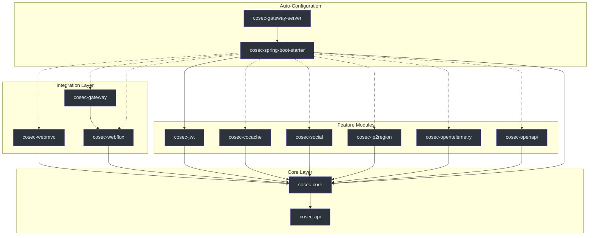
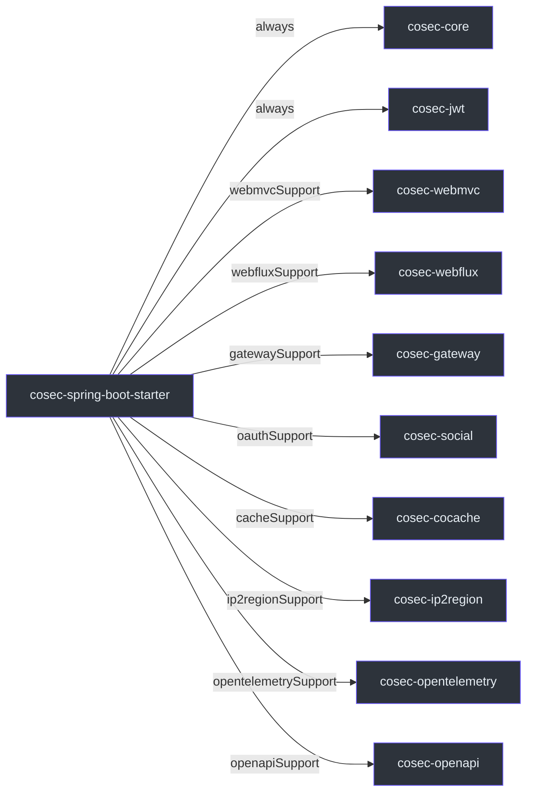
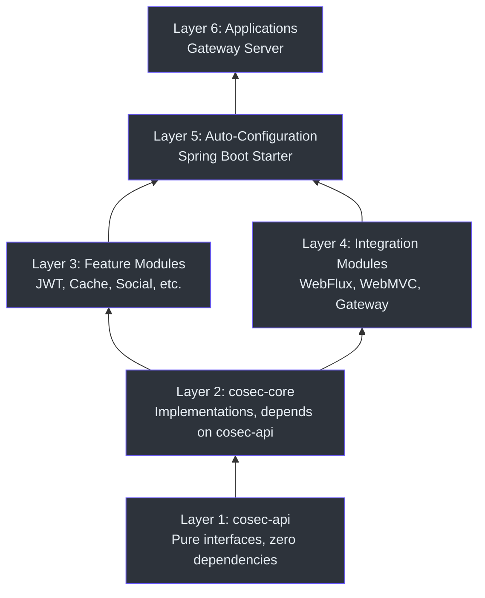

# Module Dependency Graph

CoSec is organized as a multi-module Gradle Kotlin DSL project with a clear separation of concerns. Each module has a well-defined responsibility and dependency boundary, enabling flexible composition and minimal coupling.

## High-Level Module Architecture

The project is declared in [settings.gradle.kts](https://github.com/Ahoo-Wang/CoSec/blob/main/settings.gradle.kts), which lists all 15 included modules. The architecture follows a layered approach where the API module defines contracts, the core module provides implementations, and integration modules adapt to various runtime environments.



## Module Reference Table

| Module | Responsibility | Key Classes | Dependencies |
|--------|---------------|-------------|--------------|
| `cosec-api` | Core interfaces, no framework deps | [CoSecPrincipal](https://github.com/Ahoo-Wang/CoSec/blob/main/cosec-api/src/main/kotlin/me/ahoo/cosec/api/principal/CoSecPrincipal.kt#L35), [Authorization](https://github.com/Ahoo-Wang/CoSec/blob/main/cosec-api/src/main/kotlin/me/ahoo/cosec/api/authorization/Authorization.kt#L35), [Policy](https://github.com/Ahoo-Wang/CoSec/blob/main/cosec-api/src/main/kotlin/me/ahoo/cosec/api/policy/Policy.kt#L45), [Tenant](https://github.com/Ahoo-Wang/CoSec/blob/main/cosec-api/src/main/kotlin/me/ahoo/cosec/api/tenant/Tenant.kt#L22) | None (pure API) |
| `cosec-core` | Policy evaluation, authentication, authorization | [SimpleAuthorization](https://github.com/Ahoo-Wang/CoSec/blob/main/cosec-core/src/main/kotlin/me/ahoo/cosec/authorization/SimpleAuthorization.kt#L48), PolicyRepository, BlacklistChecker | `cosec-api` |
| `cosec-jwt` | JWT token creation and verification | JwtTokenVerifier, TokenConverter | `cosec-core` |
| `cosec-cocache` | Redis-backed distributed caching for policies/permissions | CachedPolicyRepository, CachedAppRolePermissionRepository | `cosec-core` |
| `cosec-social` | OAuth social authentication via JustAuth | SocialAuthentication, OAuthService | `cosec-core` |
| `cosec-ip2region` | IP geolocation for condition matching | Ip2RegionConditionMatcher | `cosec-core` |
| `cosec-opentelemetry` | OpenTelemetry tracing for security operations | SecurityTracingFilter | `cosec-core` |
| `cosec-openapi` | Swagger/OpenAPI integration for security endpoints | CoSecOpenApiCustomizer | `cosec-core` |
| `cosec-webflux` | Reactive WebFilter for Spring WebFlux | [ReactiveSecurityFilter](https://github.com/Ahoo-Wang/CoSec/blob/main/cosec-webflux/src/main/kotlin/me/ahoo/cosec/webflux/ReactiveSecurityFilter.kt#L57), [ReactiveAuthorizationFilter](https://github.com/Ahoo-Wang/CoSec/blob/main/cosec-webflux/src/main/kotlin/me/ahoo/cosec/webflux/ReactiveAuthorizationFilter.kt#L36) | `cosec-core` |
| `cosec-webmvc` | Servlet filter for Spring WebMVC | ServletAuthorizationFilter, ServletSecurityFilter | `cosec-core` |
| `cosec-gateway` | Spring Cloud Gateway GlobalFilter | [AuthorizationGatewayFilter](https://github.com/Ahoo-Wang/CoSec/blob/main/cosec-gateway/src/main/kotlin/me/ahoo/cosec/gateway/AuthorizationGatewayFilter.kt#L31) | `cosec-webflux` |
| `cosec-spring-boot-starter` | Auto-configuration, aggregates all modules | CoSecAutoConfiguration, conditional features | `cosec-core`, `cosec-jwt`, optional modules |
| `cosec-gateway-server` | Standalone gateway application (not published) | GatewayApplication | `cosec-spring-boot-starter` |
| `cosec-dependencies` | Version catalog for dependency management | libs.versions.toml | None |
| `cosec-bom` | Bill of Materials for consistent versioning | BOM definition | `cosec-dependencies` |

## Feature Capabilities in the Starter

The `cosec-spring-boot-starter` module uses Gradle feature variants to provide optional capabilities. As declared in [cosec-spring-boot-starter/build.gradle.kts](https://github.com/Ahoo-Wang/CoSec/blob/main/cosec-spring-boot-starter/build.gradle.kts#L18), each feature is registered as a separate capability:



Consumers of the starter can opt in to specific features by declaring the corresponding dependency:

```kotlin
// Only WebFlux support
implementation("me.ahoo.cosec:cosec-spring-boot-starter-webflux-support")

// Only Gateway support (pulls in WebFlux transitively)
implementation("me.ahoo.cosec:cosec-spring-boot-starter-gateway-support")
```

## Dependency Layering Principles



Key architectural principles:

1. **API Isolation** -- `cosec-api` has zero framework dependencies. All security contracts are pure Kotlin interfaces using `Mono<T>` from Project Reactor. This ensures the API layer can be implemented by any runtime.

2. **Core as Single Implementation** -- `cosec-core` is the sole provider of concrete implementations. As seen in [SimpleAuthorization](https://github.com/Ahoo-Wang/CoSec/blob/main/cosec-core/src/main/kotlin/me/ahoo/cosec/authorization/SimpleAuthorization.kt#L48), the core authorization logic delegates to `PolicyRepository` and `AppRolePermissionRepository` interfaces, which are wired by higher layers.

3. **Integration Unawareness** -- Integration modules (`cosec-webflux`, `cosec-webmvc`, `cosec-gateway`) depend only on `cosec-core`, not on each other. The gateway module is a special case that extends the WebFlux filter since both operate in a reactive context.

4. **Optional Feature Composition** -- The starter module uses Gradle's `registerFeature` mechanism (see [build.gradle.kts:18-49](https://github.com/Ahoo-Wang/CoSec/blob/main/cosec-spring-boot-starter/build.gradle.kts#L18)) to provide optional modules without forcing transitive dependencies on consumers.

5. **BOM for Version Alignment** -- `cosec-dependencies` and `cosec-bom` ensure all modules use consistent versions of external dependencies, managed through the Gradle version catalog at `gradle/libs.versions.toml`.

## References

- [settings.gradle.kts](https://github.com/Ahoo-Wang/CoSec/blob/main/settings.gradle.kts#L14) -- All module declarations
- [cosec-spring-boot-starter/build.gradle.kts](https://github.com/Ahoo-Wang/CoSec/blob/main/cosec-spring-boot-starter/build.gradle.kts#L18) -- Feature variant registration
- [SimpleAuthorization.kt](https://github.com/Ahoo-Wang/CoSec/blob/main/cosec-core/src/main/kotlin/me/ahoo/cosec/authorization/SimpleAuthorization.kt#L48) -- Core authorization implementation
- [CoSecPrincipal.kt](https://github.com/Ahoo-Wang/CoSec/blob/main/cosec-api/src/main/kotlin/me/ahoo/cosec/api/principal/CoSecPrincipal.kt#L35) -- Principal interface (API layer)
- [Authorization.kt](https://github.com/Ahoo-Wang/CoSec/blob/main/cosec-api/src/main/kotlin/me/ahoo/cosec/api/authorization/Authorization.kt#L35) -- Authorization fun interface (API layer)
- [Policy.kt](https://github.com/Ahoo-Wang/CoSec/blob/main/cosec-api/src/main/kotlin/me/ahoo/cosec/api/policy/Policy.kt#L45) -- Policy interface (API layer)

## Related Pages

- [Security Model](./security-model.md) -- Detailed policy and principal model
- [Reactive Design](./reactive-design.md) -- How Reactor is used across modules
- [Multi-Tenancy](./multi-tenancy.md) -- Tenant model and TenantCapable interfaces
