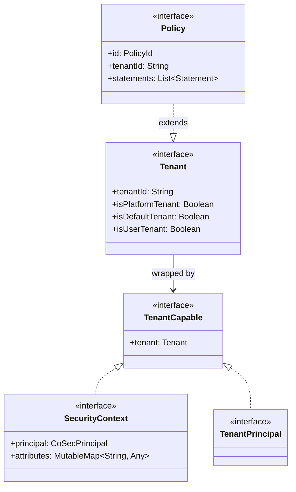
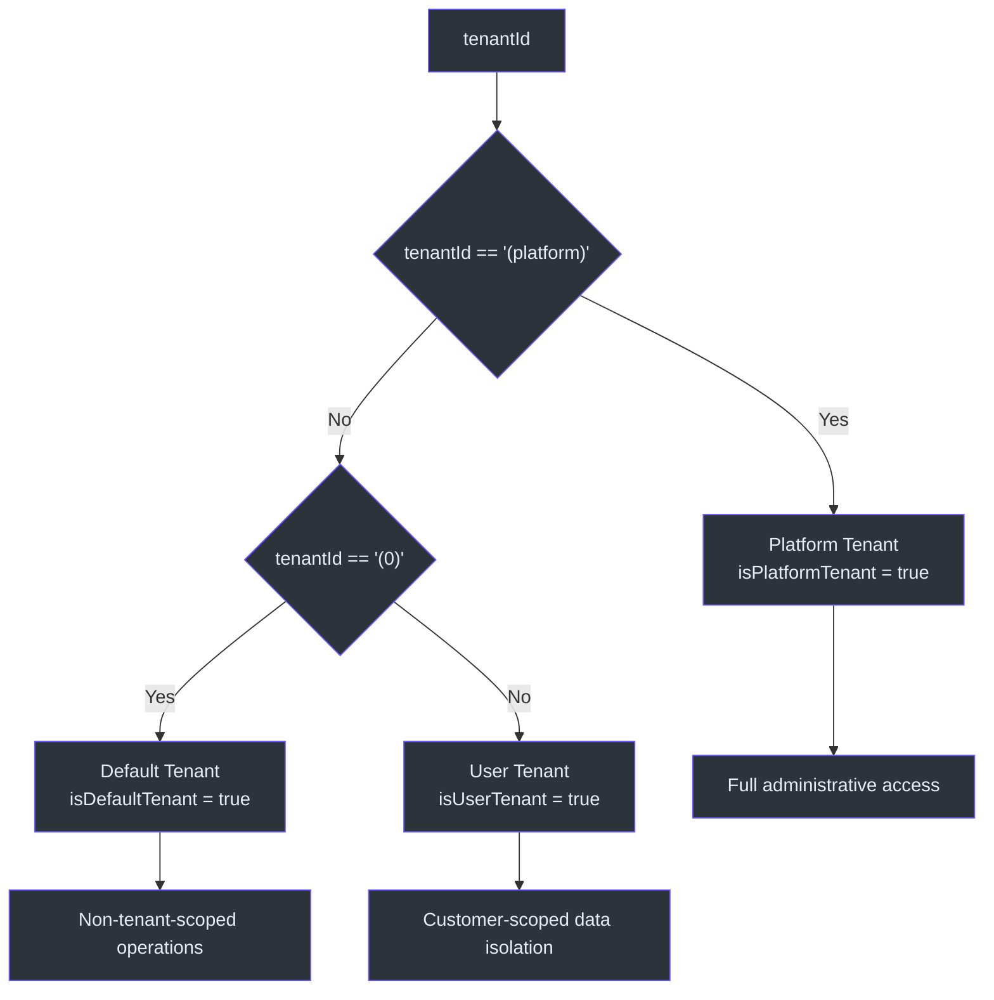
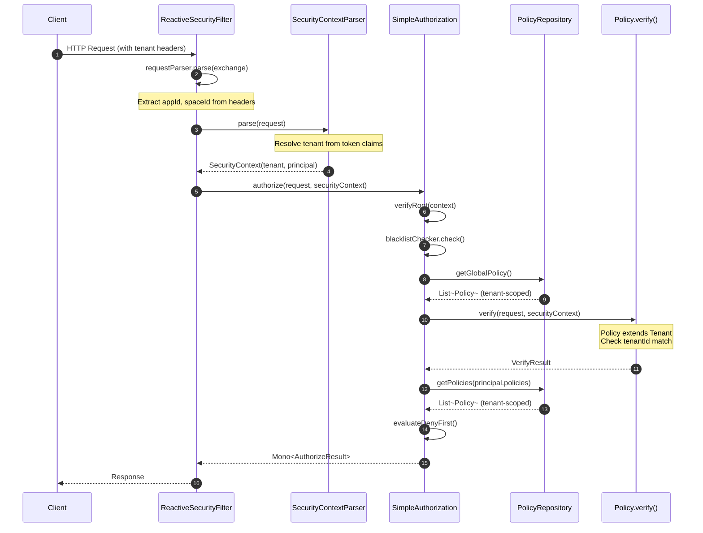
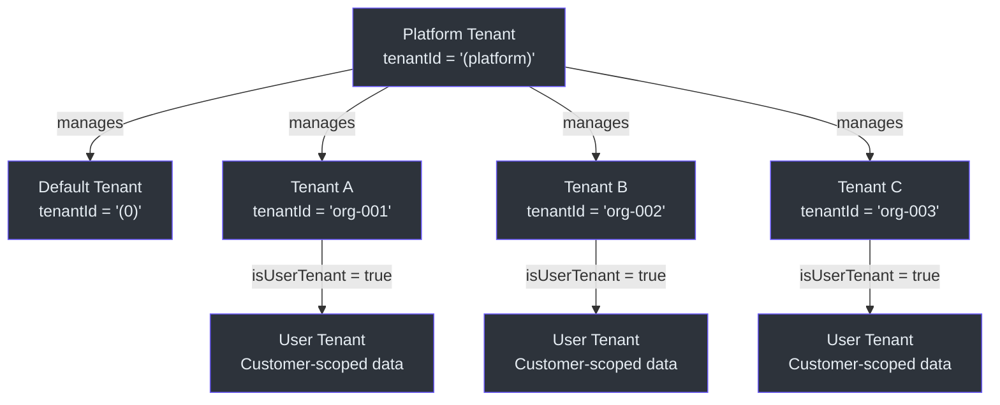

# Multi-Tenancy

CoSec treats multi-tenancy as a first-class concept in its security model. Tenants define horizontal boundaries between customers, and every authorization decision can be scoped to a specific tenant. This page covers the tenant model, tenant-aware principals, tenant-scoped policy evaluation, and how tenant context flows through the security pipeline.

## Tenant Model

The `Tenant` interface ([Tenant.kt:22](https://github.com/Ahoo-Wang/CoSec/blob/main/cosec-api/src/main/kotlin/me/ahoo/cosec/api/tenant/Tenant.kt#L22)) defines three tenant types using a simple ID-based classification:



### Tenant Types and Constants

The `Tenant` companion object ([Tenant.kt:50-68](https://github.com/Ahoo-Wang/CoSec/blob/main/cosec-api/src/main/kotlin/me/ahoo/cosec/api/tenant/Tenant.kt#L50)) defines the classification:

| Constant | Value | Meaning |
|----------|-------|---------|
| `PLATFORM_TENANT_ID` | `"(platform)"` | The root platform tenant with full administrative access |
| `DEFAULT_TENANT_ID` | `"(0)"` | The default tenant for non-tenant-scoped operations |

Derived boolean properties provide convenient classification:

- **`isPlatformTenant`** ([line 35](https://github.com/Ahoo-Wang/CoSec/blob/main/cosec-api/src/main/kotlin/me/ahoo/cosec/api/tenant/Tenant.kt#L35)) -- True when `tenantId` equals `PLATFORM_TENANT_ID`. Platform tenants typically manage all other tenants.
- **`isDefaultTenant`** ([line 41](https://github.com/Ahoo-Wang/CoSec/blob/main/cosec-api/src/main/kotlin/me/ahoo/cosec/api/tenant/Tenant.kt#L41)) -- True when `tenantId` equals `DEFAULT_TENANT_ID`. The default tenant is used when no explicit tenant is specified.
- **`isUserTenant`** ([line 47](https://github.com/Ahoo-Wang/CoSec/blob/main/cosec-api/src/main/kotlin/me/ahoo/cosec/api/tenant/Tenant.kt#L47)) -- True when the tenant is neither platform nor default. This represents actual customer tenants.



## TenantCapable and TenantPrincipal

`TenantCapable` ([TenantCapable.kt:23](https://github.com/Ahoo-Wang/CoSec/blob/main/cosec-api/src/main/kotlin/me/ahoo/cosec/api/tenant/TenantCapable.kt#L23)) is a simple interface that exposes a `tenant` property. It is implemented by two key abstractions:

1. **`SecurityContext`** ([SecurityContext.kt:34](https://github.com/Ahoo-Wang/CoSec/blob/main/cosec-api/src/main/kotlin/me/ahoo/cosec/api/context/SecurityContext.kt#L34)) -- The security context extends `TenantCapable`, ensuring tenant information is available during authorization.

2. **`TenantPrincipal`** ([TenantPrincipal.kt:26](https://github.com/Ahoo-Wang/CoSec/blob/main/cosec-api/src/main/kotlin/me/ahoo/cosec/api/principal/TenantPrincipal.kt#L26)) -- Extends both `CoSecPrincipal` and `TenantCapable`, carrying tenant identity with the user's principal.

This design means tenant context is accessible through two paths during authorization:
- `context.tenant.tenantId` -- from the security context
- `context.principal.tenant.tenantId` -- from the tenant-aware principal (when available)

## Tenant Context Flow

The tenant context flows through the entire security pipeline, from the incoming request to policy evaluation.



### Request-Level Tenant Identification

The `Request` interface ([Request.kt:36](https://github.com/Ahoo-Wang/CoSec/blob/main/cosec-api/src/main/kotlin/me/ahoo/cosec/api/context/request/Request.kt#L36)) carries `appId` and `spaceId` properties that help identify the application and space (tenant partition) for the request. These are resolved from headers or query parameters:

```kotlin
override val appId: AppId
    get() = getHeader(APP_ID_KEY).ifBlank { getQuery(APP_ID_KEY) }

override val spaceId: SpaceId
    get() = getHeader(SPACE_ID_KEY).ifBlank { getQuery(SPACE_ID_KEY) }
```

The `spaceId` often maps to a tenant identifier, allowing the authorization layer to scope role permissions to the correct tenant partition.

### Policy-Level Tenant Scoping

The `Policy` interface ([Policy.kt:45](https://github.com/Ahoo-Wang/CoSec/blob/main/cosec-api/src/main/kotlin/me/ahoo/cosec/api/policy/Policy.kt#L45)) extends `Tenant`, meaning every policy has a `tenantId`. This allows the `PolicyRepository` to fetch only policies relevant to the current tenant, and enables condition matchers to enforce tenant boundaries.

During authorization, `SimpleAuthorization` ([SimpleAuthorization.kt:82-113](https://github.com/Ahoo-Wang/CoSec/blob/main/cosec-core/src/main/kotlin/me/ahoo/cosec/authorization/SimpleAuthorization.kt#L82)) filters policies by their condition matchers, which can include tenant-aware checks like `InTenant` conditions.

## Tenant Hierarchy



The platform tenant is the administrative root. Platform administrators can define global policies that apply across all tenants, or create tenant-specific policies for individual customers. The `SimpleAuthorization` evaluation order ensures global policies (which may be platform-tenant-scoped) are evaluated before principal-specific policies ([SimpleAuthorization.kt:156-178](https://github.com/Ahoo-Wang/CoSec/blob/main/cosec-core/src/main/kotlin/me/ahoo/cosec/authorization/SimpleAuthorization.kt#L156)).

## SPI Extension Points for Tenant Conditions

CoSec provides built-in `ConditionMatcher` implementations that enforce tenant boundaries:

- **`InTenant`** -- Matches when the current security context belongs to a specified tenant. Used in policies that should only apply within a particular tenant scope.
- **`Authenticated`** -- Can be combined with tenant checks to enforce that only authenticated users within a specific tenant can access resources.

These condition matchers are registered via Java SPI (`META-INF/services/me.ahoo.cosec.policy.condition.ConditionMatcherFactory`), allowing custom tenant-aware conditions to be added without modifying the core framework.

## References

- [Tenant.kt](https://github.com/Ahoo-Wang/CoSec/blob/main/cosec-api/src/main/kotlin/me/ahoo/cosec/api/tenant/Tenant.kt#L22) -- Tenant interface with platform/default/user classification
- [TenantCapable.kt](https://github.com/Ahoo-Wang/CoSec/blob/main/cosec-api/src/main/kotlin/me/ahoo/cosec/api/tenant/TenantCapable.kt#L23) -- TenantCapable interface
- [TenantPrincipal.kt](https://github.com/Ahoo-Wang/CoSec/blob/main/cosec-api/src/main/kotlin/me/ahoo/cosec/api/principal/TenantPrincipal.kt#L26) -- Principal with tenant awareness
- [SecurityContext.kt](https://github.com/Ahoo-Wang/CoSec/blob/main/cosec-api/src/main/kotlin/me/ahoo/cosec/api/context/SecurityContext.kt#L34) -- Security context extending TenantCapable
- [Policy.kt](https://github.com/Ahoo-Wang/CoSec/blob/main/cosec-api/src/main/kotlin/me/ahoo/cosec/api/policy/Policy.kt#L45) -- Policy extending Tenant
- [Request.kt](https://github.com/Ahoo-Wang/CoSec/blob/main/cosec-api/src/main/kotlin/me/ahoo/cosec/api/context/request/Request.kt#L36) -- Request with appId and spaceId
- [SimpleAuthorization.kt](https://github.com/Ahoo-Wang/CoSec/blob/main/cosec-core/src/main/kotlin/me/ahoo/cosec/authorization/SimpleAuthorization.kt#L48) -- Authorization with tenant-scoped policy evaluation

## Related Pages

- [Security Model](./security-model.md) -- How policies and conditions are evaluated
- [Reactive Design](./reactive-design.md) -- How tenant context flows through the reactive pipeline
- [Module Dependency Graph](./module-dependency.md) -- Module structure overview
