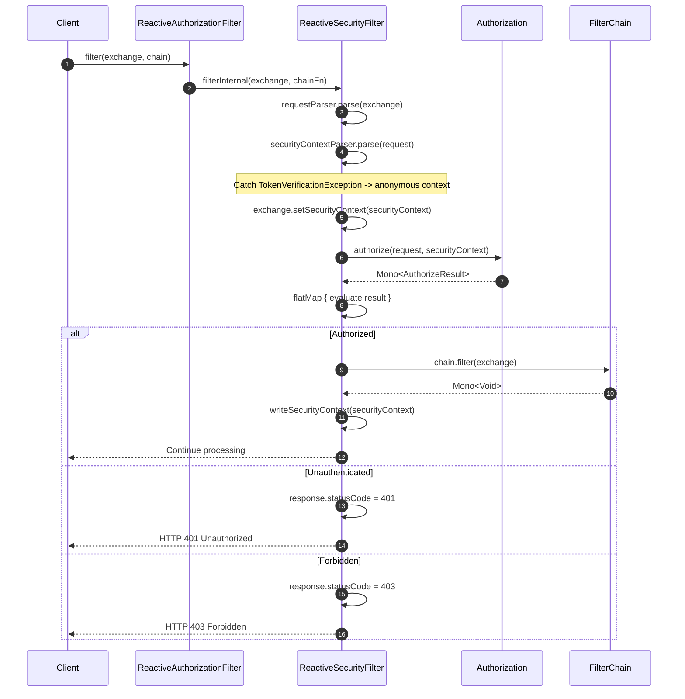
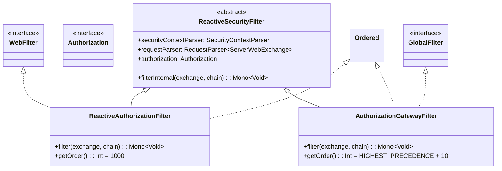
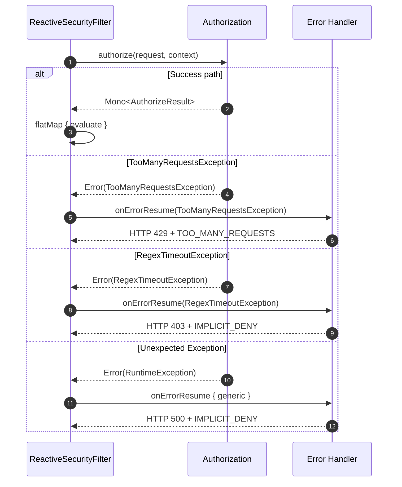

# Reactive Design

CoSec is built from the ground up on Project Reactor. Every authorization and authentication operation returns `Mono<T>`, enabling fully non-blocking security evaluation. This page traces the reactive data flow from the incoming HTTP request through the filter chain, authorization pipeline, and error handling.

## Core Reactive Contracts

The foundation of CoSec's reactive design is the `Authorization` fun interface ([Authorization.kt:35](https://github.com/Ahoo-Wang/CoSec/blob/main/cosec-api/src/main/kotlin/me/ahoo/cosec/api/authorization/Authorization.kt#L35)), which returns `Mono<AuthorizeResult>`:

```kotlin
fun interface Authorization {
    fun authorize(
        request: Request,
        context: SecurityContext
    ): Mono<AuthorizeResult>
}
```

Similarly, the `Authentication` interface ([Authentication.kt:32](https://github.com/Ahoo-Wang/CoSec/blob/main/cosec-api/src/main/kotlin/me/ahoo/cosec/api/authentication/Authentication.kt#L32)) returns `Mono<out P>`:

```kotlin
interface Authentication<C : Credentials, out P : CoSecPrincipal> {
    fun authenticate(credentials: C): Mono<out P>
}
```

Both contracts ensure the caller never blocks. The reactive types propagate through the entire filter chain, from Spring's `WebFilter` or `GlobalFilter` down to repository lookups.

## Reactive Filter Chain

The central reactive integration point is `ReactiveSecurityFilter` ([ReactiveSecurityFilter.kt:59](https://github.com/Ahoo-Wang/CoSec/blob/main/cosec-webflux/src/main/kotlin/me/ahoo/cosec/webflux/ReactiveSecurityFilter.kt#L59)), which is extended by both `ReactiveAuthorizationFilter` (WebFlux) and `AuthorizationGatewayFilter` (Spring Cloud Gateway).


```mermaid
sequenceDiagram
    autonumber
    participant Client
    participant WebFilter as ReactiveAuthorizationFilter
    participant RSF as ReactiveSecurityFilter
    participant Authz as Authorization
    participant Chain as FilterChain

    Client->>WebFilter: filter(exchange, chain)
    WebFilter->>RSF: filterInternal(exchange, chainFn)
    RSF->>RSF: requestParser.parse(exchange)
    RSF->>RSF: securityContextParser.parse(request)
    Note over RSF: Catch TokenVerificationException -> anonymous context
    RSF->>RSF: exchange.setSecurityContext(securityContext)
    RSF->>Authz: authorize(request, securityContext)
    Authz-->>RSF: Mono<AuthorizeResult>
    RSF->>RSF: flatMap { evaluate result }
    alt Authorized
        RSF->>Chain: chain.filter(exchange)
        Chain-->>RSF: Mono<Void>
        RSF->>RSF: writeSecurityContext(securityContext)
        RSF-->>Client: Continue processing
    else Unauthenticated
        RSF->>RSF: response.statusCode = 401
        RSF-->>Client: HTTP 401 Unauthorized
    else Forbidden
        RSF->>RSF: response.statusCode = 403
        RSF-->>Client: HTTP 403 Forbidden
    end

```

### The filterInternal Method

The `filterInternal` method ([ReactiveSecurityFilter.kt:68-115](https://github.com/Ahoo-Wang/CoSec/blob/main/cosec-webflux/src/main/kotlin/me/ahoo/cosec/webflux/ReactiveSecurityFilter.kt#L68)) is the reactive pipeline entry point. Its structure is:

1. **Parse the request** from the `ServerWebExchange` using the injected `RequestParser` ([line 73](https://github.com/Ahoo-Wang/CoSec/blob/main/cosec-webflux/src/main/kotlin/me/ahoo/cosec/webflux/ReactiveSecurityFilter.kt#L73)).
2. **Parse the security context** using the injected `SecurityContextParser`. If a `TokenVerificationException` occurs, catch it and fall back to an anonymous context ([line 78-88](https://github.com/Ahoo-Wang/CoSec/blob/main/cosec-webflux/src/main/kotlin/me/ahoo/cosec/webflux/ReactiveSecurityFilter.kt#L78)).
3. **Authorize** by calling `authorization.authorize(request, securityContext)` ([line 92-93](https://github.com/Ahoo-Wang/CoSec/blob/main/cosec-webflux/src/main/kotlin/me/ahoo/cosec/webflux/ReactiveSecurityFilter.kt#L92)).
4. **FlatMap** on the result: if authorized, mutate the exchange with the principal and invoke the filter chain; otherwise set 401 or 403 ([line 94-111](https://github.com/Ahoo-Wang/CoSec/blob/main/cosec-webflux/src/main/kotlin/me/ahoo/cosec/webflux/ReactiveSecurityFilter.kt#L94)).
5. **onErrorResume** for `TooManyRequestsException` returns HTTP 429 ([line 121-124](https://github.com/Ahoo-Wang/CoSec/blob/main/cosec-webflux/src/main/kotlin/me/ahoo/cosec/webflux/ReactiveSecurityFilter.kt#L121)).
6. **onErrorResume** for unexpected errors returns HTTP 500 with `IMPLICIT_DENY` ([line 131-137](https://github.com/Ahoo-Wang/CoSec/blob/main/cosec-webflux/src/main/kotlin/me/ahoo/cosec/webflux/ReactiveSecurityFilter.kt#L131)).

## Mono Chain in Authorization

The `SimpleAuthorization` class ([SimpleAuthorization.kt:48](https://github.com/Ahoo-Wang/CoSec/blob/main/cosec-core/src/main/kotlin/me/ahoo/cosec/authorization/SimpleAuthorization.kt#L48)) builds a reactive chain using `Mono.switchIfEmpty` to cascade through authorization stages:


```mermaid
flowchart LR
    VERIFY["verify(request, context)"]
    GLOBAL["verifyGlobalPolicies()"]
    PRINCIPAL["verifyPrincipalPolicies()"]
    ROLE["verifyAppRolePermission()"]
    MAP["map to AuthorizeResult"]
    DENY["IMPLICIT_DENY"]

    VERIFY --> GLOBAL
    GLOBAL -->|"switchIfEmpty"| PRINCIPAL
    PRINCIPAL -->|"switchIfEmpty"| ROLE
    ROLE --> MAP
    MAP -->|"switchIfEmpty"| DENY

    style VERIFY fill:#2d333b,stroke:#6d5dfc,color:#e6edf3
    style GLOBAL fill:#2d333b,stroke:#6d5dfc,color:#e6edf3
    style PRINCIPAL fill:#2d333b,stroke:#6d5dfc,color:#e6edf3
    style ROLE fill:#2d333b,stroke:#6d5dfc,color:#e6edf3
    style MAP fill:#2d333b,stroke:#6d5dfc,color:#e6edf3
    style DENY fill:#2d333b,stroke:#6d5dfc,color:#e6edf3

```

The `verify` method ([SimpleAuthorization.kt:202-219](https://github.com/Ahoo-Wang/CoSec/blob/main/cosec-core/src/main/kotlin/me/ahoo/cosec/authorization/SimpleAuthorization.kt#L202)) constructs this chain:

```kotlin
verifyGlobalPolicies(request, context)
    .switchIfEmpty { verifyPrincipalPolicies(request, context) }
    .switchIfEmpty { verifyAppRolePermission(request, context) }
    .map { context.setVerifyContext(it); it.result.toAuthorizeResult() }
    .switchIfEmpty { AuthorizeResult.IMPLICIT_DENY.toMono() }
```

Each `verifyXxx` method returns `Mono<VerifyContext>`. If a method produces an empty `Mono` (no matching policy), `switchIfEmpty` triggers the next stage. This is semantically equivalent to a series of `orElse` calls but in a non-blocking reactive style.

The outer `authorize` method ([SimpleAuthorization.kt:221-240](https://github.com/Ahoo-Wang/CoSec/blob/main/cosec-core/src/main/kotlin/me/ahoo/cosec/authorization/SimpleAuthorization.kt#L221)) wraps the verify chain with synchronous root user check and an asynchronous blacklist check:

```kotlin
override fun authorize(request: Request, context: SecurityContext): Mono<AuthorizeResult> {
    val verifyResult = verifyRoot(context)          // synchronous
    if (verifyResult == VerifyResult.ALLOW) {
        return AuthorizeResult.ALLOW.toMono()       // short-circuit
    }
    return blacklistChecker.check(request, context)  // Mono<Boolean>
        .flatMap { allowed ->
            if (!allowed) return@flatMap AuthorizeResult.EXPLICIT_DENY.toMono()
            verify(request, context)                // cascade chain
        }
}
```

## Integration Variants

Three integration modules consume the reactive authorization pipeline, each adapting to a different Spring runtime.


```mermaid
classDiagram
    class ReactiveSecurityFilter {
        <<abstract>>
        +securityContextParser: SecurityContextParser
        +requestParser: RequestParser~ServerWebExchange~
        +authorization: Authorization
        +filterInternal(exchange, chain): Mono~Void~
    }
    class ReactiveAuthorizationFilter {
        +filter(exchange, chain): Mono~Void~
        +getOrder(): Int = 1000
    }
    class AuthorizationGatewayFilter {
        +filter(exchange, chain): Mono~Void~
        +getOrder(): Int = HIGHEST_PRECEDENCE + 10
    }
    class Authorization {
        <<interface>>
    }
    class WebFilter {
        <<interface>>
    }
    class GlobalFilter {
        <<interface>>
    }

    ReactiveSecurityFilter <|-- ReactiveAuthorizationFilter
    ReactiveSecurityFilter <|-- AuthorizationGatewayFilter
    WebFilter <|.. ReactiveAuthorizationFilter
    GlobalFilter <|.. AuthorizationGatewayFilter
    Ordered <|.. ReactiveAuthorizationFilter
    Ordered <|.. AuthorizationGatewayFilter


```

### ReactiveAuthorizationFilter (WebFlux)

The WebFlux variant ([ReactiveAuthorizationFilter.kt:36](https://github.com/Ahoo-Wang/CoSec/blob/main/cosec-webflux/src/main/kotlin/me/ahoo/cosec/webflux/ReactiveAuthorizationFilter.kt#L36)) implements `WebFilter` and delegates to `filterInternal`. It runs at order `1000` to execute after framework filters (CORS, etc.) but before application filters.

### AuthorizationGatewayFilter (Spring Cloud Gateway)

The Gateway variant ([AuthorizationGatewayFilter.kt:31](https://github.com/Ahoo-Wang/CoSec/blob/main/cosec-gateway/src/main/kotlin/me/ahoo/cosec/gateway/AuthorizationGatewayFilter.kt#L31)) implements Spring Cloud Gateway's `GlobalFilter`. It runs at `HIGHEST_PRECEDENCE + 10` to authorize very early in the gateway filter chain. After successful authorization, it mutates the request to propagate the `requestId` header downstream ([line 47-50](https://github.com/Ahoo-Wang/CoSec/blob/main/cosec-gateway/src/main/kotlin/me/ahoo/cosec/gateway/AuthorizationGatewayFilter.kt#L47)).

## Error Handling Strategy

The reactive pipeline uses `onErrorResume` operators at multiple levels to ensure graceful degradation:


```mermaid
sequenceDiagram
    autonumber
    participant RSF as ReactiveSecurityFilter
    participant Authz as Authorization
    participant Error as Error Handler

    RSF->>Authz: authorize(request, context)
    alt Success path
        Authz-->>RSF: Mono<AuthorizeResult>
        RSF->>RSF: flatMap { evaluate }
    else TooManyRequestsException
        Authz-->>RSF: Error(TooManyRequestsException)
        RSF->>Error: onErrorResume(TooManyRequestsException)
        Error-->>RSF: HTTP 429 + TOO_MANY_REQUESTS
    else RegexTimeoutException
        Authz-->>RSF: Error(RegexTimeoutException)
        RSF->>Error: onErrorResume(RegexTimeoutException)
        Error-->>RSF: HTTP 403 + IMPLICIT_DENY
    else Unexpected Exception
        Authz-->>RSF: Error(RuntimeException)
        RSF->>Error: onErrorResume { generic }
        Error-->>RSF: HTTP 500 + IMPLICIT_DENY
    end

```

The error handling is layered in `filterInternal` ([ReactiveSecurityFilter.kt:121-138](https://github.com/Ahoo-Wang/CoSec/blob/main/cosec-webflux/src/main/kotlin/me/ahoo/cosec/webflux/ReactiveSecurityFilter.kt#L121)):

1. **TokenVerificationException** -- Caught synchronously during context parsing ([line 82](https://github.com/Ahoo-Wang/CoSec/blob/main/cosec-webflux/src/main/kotlin/me/ahoo/cosec/webflux/ReactiveSecurityFilter.kt#L82)). The request proceeds as anonymous. If the anonymous user is later denied, the response is 401 (not 403).

2. **TooManyRequestsException** -- Caught via `onErrorResume(TooManyRequestsException::class.java)` ([line 121](https://github.com/Ahoo-Wang/CoSec/blob/main/cosec-webflux/src/main/kotlin/me/ahoo/cosec/webflux/ReactiveSecurityFilter.kt#L121)). Returns HTTP 429 with a `TOO_MANY_REQUESTS` result body. This is typically raised by rate-limiting `ConditionMatcher` implementations.

3. **RegexTimeoutException** -- Caught via `onErrorResume(RegexTimeoutException::class.java)` ([line 125-130](https://github.com/Ahoo-Wang/CoSec/blob/main/cosec-webflux/src/main/kotlin/me/ahoo/cosec/webflux/ReactiveSecurityFilter.kt#L125)). A regex condition exceeding its time budget (the ReDoS guard) is an expected, fail-closed authorization outcome, so it returns HTTP 403 with `IMPLICIT_DENY` rather than a 5xx server error (which would invite client retries).

4. **Generic Exception** -- Caught by the final `onErrorResume` block ([line 131](https://github.com/Ahoo-Wang/CoSec/blob/main/cosec-webflux/src/main/kotlin/me/ahoo/cosec/webflux/ReactiveSecurityFilter.kt#L131)). Logged at ERROR level and returns HTTP 500 with `IMPLICIT_DENY`. This ensures the security framework never crashes the application; it defaults to deny access on unexpected failures.

All error responses are serialized as JSON using `CoSecJsonSerializer` and written as a `Mono<Void>` via `writeWithAuthorizeResult` ([line 141](https://github.com/Ahoo-Wang/CoSec/blob/main/cosec-webflux/src/main/kotlin/me/ahoo/cosec/webflux/ReactiveSecurityFilter.kt#L141)).

## References

- [Authorization.kt](https://github.com/Ahoo-Wang/CoSec/blob/main/cosec-api/src/main/kotlin/me/ahoo/cosec/api/authorization/Authorization.kt#L35) -- `Mono<AuthorizeResult>` contract
- [Authentication.kt](https://github.com/Ahoo-Wang/CoSec/blob/main/cosec-api/src/main/kotlin/me/ahoo/cosec/api/authentication/Authentication.kt#L32) -- `Mono<out P>` contract
- [ReactiveSecurityFilter.kt](https://github.com/Ahoo-Wang/CoSec/blob/main/cosec-webflux/src/main/kotlin/me/ahoo/cosec/webflux/ReactiveSecurityFilter.kt#L59) -- Base reactive filter with error handling
- [ReactiveAuthorizationFilter.kt](https://github.com/Ahoo-Wang/CoSec/blob/main/cosec-webflux/src/main/kotlin/me/ahoo/cosec/webflux/ReactiveAuthorizationFilter.kt#L36) -- WebFlux WebFilter adapter
- [AuthorizationGatewayFilter.kt](https://github.com/Ahoo-Wang/CoSec/blob/main/cosec-gateway/src/main/kotlin/me/ahoo/cosec/gateway/AuthorizationGatewayFilter.kt#L31) -- Gateway GlobalFilter adapter
- [SimpleAuthorization.kt](https://github.com/Ahoo-Wang/CoSec/blob/main/cosec-core/src/main/kotlin/me/ahoo/cosec/authorization/SimpleAuthorization.kt#L48) -- `Mono.switchIfEmpty` authorization cascade

## Related Pages

- [Security Model](./security-model.md) -- The policy evaluation algorithm behind the reactive chain
- [Module Dependency Graph](./module-dependency.md) -- How WebFlux, Gateway, and WebMVC modules are structured
- [Multi-Tenancy](./multi-tenancy.md) -- How tenant context flows through the reactive pipeline
