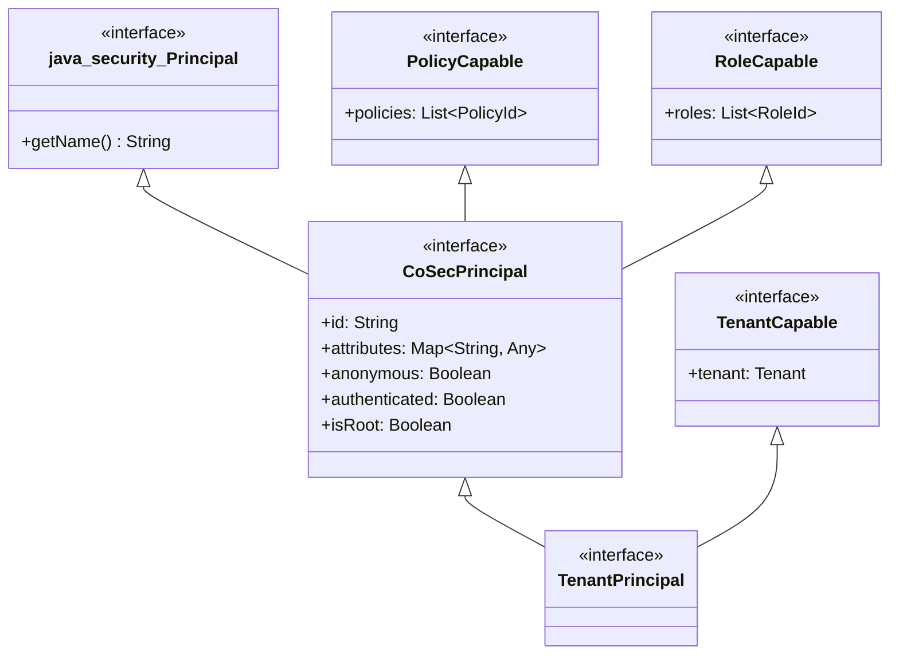
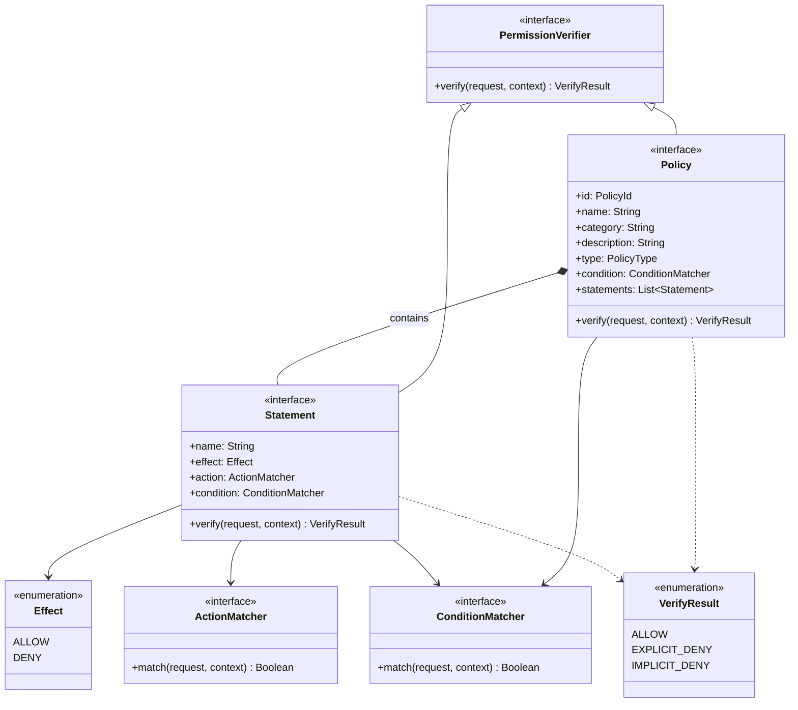
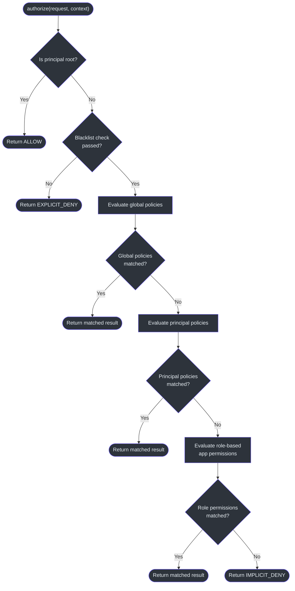

# Security Model

CoSec implements an AWS IAM-inspired security model that combines Role-Based Access Control (RBAC) with policy-based authorization. The model evaluates requests through a deny-first algorithm, ensuring that access is explicitly granted rather than implicitly allowed.

## Principal Hierarchy

The principal system defines the identity layer. All principals extend `java.security.Principal` through the `CoSecPrincipal` interface, gaining id, roles, policies, and attributes. Specialized principals add tenant and token awareness.



As defined in [CoSecPrincipal.kt:35](https://github.com/Ahoo-Wang/CoSec/blob/main/cosec-api/src/main/kotlin/me/ahoo/cosec/api/principal/CoSecPrincipal.kt#L35), every principal carries:

- **id** -- unique identifier; the root user id defaults to `"cosec"` (configurable via system property `cosec.root`)
- **roles** -- list of role identifiers used for RBAC permission lookups
- **policies** -- list of policy identifiers attached directly to the principal
- **attributes** -- arbitrary key-value pairs for custom user metadata

The `isRoot` extension property ([line 94](https://github.com/Ahoo-Wang/CoSec/blob/main/cosec-api/src/main/kotlin/me/ahoo/cosec/api/principal/CoSecPrincipal.kt#L94)) checks if the principal's id matches `ROOT_ID`. Root users bypass all authorization checks entirely.

`TenantPrincipal` ([TenantPrincipal.kt:26](https://github.com/Ahoo-Wang/CoSec/blob/main/cosec-api/src/main/kotlin/me/ahoo/cosec/api/principal/TenantPrincipal.kt#L26)) extends `CoSecPrincipal` with `TenantCapable`, adding a `tenant` property that carries the tenant identity through the security context.

## Policy Model

The policy system mirrors AWS IAM's structure: a **Policy** contains **Statements**, each with an **Effect** (ALLOW or DENY), an **ActionMatcher**, and a **ConditionMatcher**.



### Statement Evaluation

Each `Statement` ([Statement.kt:37](https://github.com/Ahoo-Wang/CoSec/blob/main/cosec-api/src/main/kotlin/me/ahoo/cosec/api/policy/Statement.kt#L37)) evaluates a request in two steps:

1. **Action matching** -- The `ActionMatcher` determines whether the statement applies to the request's path, method, or other attributes.
2. **Condition matching** -- The `ConditionMatcher` evaluates contextual predicates (authentication state, tenant membership, rate limits, etc.).

If both match, the statement returns `ALLOW` for `Effect.ALLOW` or `EXPLICIT_DENY` for `Effect.DENY`. If either fails, it returns `IMPLICIT_DENY`.

### Policy-Level Deny-First Algorithm

The `Policy.verify()` default implementation ([Policy.kt:76-103](https://github.com/Ahoo-Wang/CoSec/blob/main/cosec-api/src/main/kotlin/me/ahoo/cosec/api/policy/Policy.kt#L76)) enforces a strict evaluation order:

1. Check the policy-level `condition` against the request. If it does not match, return `IMPLICIT_DENY`.
2. Iterate all **DENY** statements first. If any returns `EXPLICIT_DENY`, short-circuit with `EXPLICIT_DENY`.
3. Iterate all **ALLOW** statements. If any returns `ALLOW`, short-circuit with `ALLOW`.
4. Default to `IMPLICIT_DENY`.

This deny-first approach ensures that explicit denials always take precedence over allows, matching the AWS IAM evaluation logic.

## Authorization Flow

`SimpleAuthorization` ([SimpleAuthorization.kt:48](https://github.com/Ahoo-Wang/CoSec/blob/main/cosec-core/src/main/kotlin/me/ahoo/cosec/authorization/SimpleAuthorization.kt#L48)) orchestrates the full authorization pipeline. It evaluates multiple sources of authority in a defined precedence order.



The `authorize` method ([SimpleAuthorization.kt:213-232](https://github.com/Ahoo-Wang/CoSec/blob/main/cosec-core/src/main/kotlin/me/ahoo/cosec/authorization/SimpleAuthorization.kt#L213)) follows this sequence:

1. **Root bypass** ([line 146](https://github.com/Ahoo-Wang/CoSec/blob/main/cosec-core/src/main/kotlin/me/ahoo/cosec/authorization/SimpleAuthorization.kt#L146)) -- If `context.principal.isRoot` is true, return `ALLOW` immediately.
2. **Blacklist check** ([line 221](https://github.com/Ahoo-Wang/CoSec/blob/main/cosec-core/src/main/kotlin/me/ahoo/cosec/authorization/SimpleAuthorization.kt#L221)) -- The `BlacklistChecker` verifies the request is not blocked. If blocked, return `EXPLICIT_DENY`.
3. **Global policies** ([line 156](https://github.com/Ahoo-Wang/CoSec/blob/main/cosec-core/src/main/kotlin/me/ahoo/cosec/authorization/SimpleAuthorization.kt#L156)) -- Fetch and evaluate global policies via `PolicyRepository.getGlobalPolicy()`.
4. **Principal policies** ([line 166](https://github.com/Ahoo-Wang/CoSec/blob/main/cosec-core/src/main/kotlin/me/ahoo/cosec/authorization/SimpleAuthorization.kt#L166)) -- Fetch and evaluate policies attached to the principal via `PolicyRepository.getPolicies()`.
5. **Role permissions** ([line 180](https://github.com/Ahoo-Wang/CoSec/blob/main/cosec-core/src/main/kotlin/me/ahoo/cosec/authorization/SimpleAuthorization.kt#L180)) -- Fetch and evaluate app-specific role permissions via `AppRolePermissionRepository.getAppRolePermission()`.
6. **Implicit deny** ([line 206](https://github.com/Ahoo-Wang/CoSec/blob/main/cosec-core/src/main/kotlin/me/ahoo/cosec/authorization/SimpleAuthorization.kt#L206)) -- If no policy matched, return `IMPLICIT_DENY`.

Each stage uses `Mono.switchIfEmpty` to fall through to the next stage, forming a reactive chain.

## Deny-First Evaluation at Scale

The `evaluateDenyFirst` method ([SimpleAuthorization.kt:61-80](https://github.com/Ahoo-Wang/CoSec/blob/main/cosec-core/src/main/kotlin/me/ahoo/cosec/authorization/SimpleAuthorization.kt#L61)) is a generic helper used for both policy statements and role permissions. It processes items as a `Sequence` for lazy evaluation, filtering first by `Effect.DENY`, then by `Effect.ALLOW`:

```
1. Filter all items where effect == DENY
2. For each DENY item, call verifyItem()
3. If any returns EXPLICIT_DENY, short-circuit and return
4. Filter all items where effect == ALLOW
5. For each ALLOW item, call verifyItem()
6. If any returns ALLOW, short-circuit and return
7. Return null (no match)
```

This algorithm is applied to both `PolicyStatementEntry` objects (global and principal policies) and `RolePermissionEntry` objects (role-based app permissions), ensuring consistent deny-first semantics across all authorization sources.

## AWS IAM Inspiration

CoSec's design draws direct parallels to AWS IAM:

| AWS IAM Concept | CoSec Equivalent |
|----------------|-----------------|
| IAM Policy | `Policy` interface |
| Statement | `Statement` interface |
| Effect (Allow/Deny) | `Effect` enum |
| Action | `ActionMatcher` (via SPI factories) |
| Resource | `ConditionMatcher` (path-based matchers) |
| Condition | `ConditionMatcher` (context-based matchers) |
| Explicit Deny > Allow | Deny-first in `evaluateDenyFirst` |
| Implicit Deny | `IMPLICIT_DENY` default |
| Root user | `CoSecPrincipal.isRoot` bypass |
| Service Control Policy | Global policies via `PolicyRepository.getGlobalPolicy()` |
| Identity Policy | Principal-specific policies via `principal.policies` |

## References

- [CoSecPrincipal.kt](https://github.com/Ahoo-Wang/CoSec/blob/main/cosec-api/src/main/kotlin/me/ahoo/cosec/api/principal/CoSecPrincipal.kt#L35) -- Principal interface definition
- [TenantPrincipal.kt](https://github.com/Ahoo-Wang/CoSec/blob/main/cosec-api/src/main/kotlin/me/ahoo/cosec/api/principal/TenantPrincipal.kt#L26) -- Tenant-aware principal
- [Policy.kt](https://github.com/Ahoo-Wang/CoSec/blob/main/cosec-api/src/main/kotlin/me/ahoo/cosec/api/policy/Policy.kt#L45) -- Policy interface with deny-first verify()
- [Statement.kt](https://github.com/Ahoo-Wang/CoSec/blob/main/cosec-api/src/main/kotlin/me/ahoo/cosec/api/policy/Statement.kt#L37) -- Statement with effect, action, condition
- [SimpleAuthorization.kt](https://github.com/Ahoo-Wang/CoSec/blob/main/cosec-core/src/main/kotlin/me/ahoo/cosec/authorization/SimpleAuthorization.kt#L48) -- Full authorization pipeline
- [Authorization.kt](https://github.com/Ahoo-Wang/CoSec/blob/main/cosec-api/src/main/kotlin/me/ahoo/cosec/api/authorization/Authorization.kt#L35) -- Authorization fun interface
- [SecurityContext.kt](https://github.com/Ahoo-Wang/CoSec/blob/main/cosec-api/src/main/kotlin/me/ahoo/cosec/api/context/SecurityContext.kt#L34) -- Security context holding principal and tenant

## Related Pages

- [Module Dependency Graph](./module-dependency.md) -- How security modules are structured
- [Reactive Design](./reactive-design.md) -- How authorization integrates with Project Reactor
- [Multi-Tenancy](./multi-tenancy.md) -- Tenant-scoped policy evaluation
