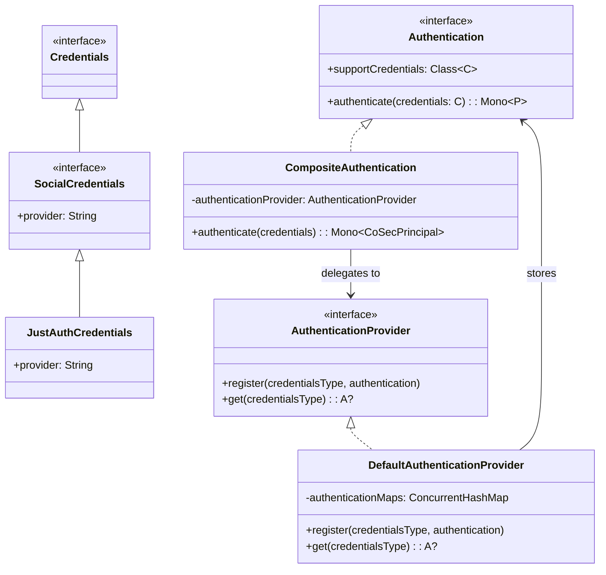
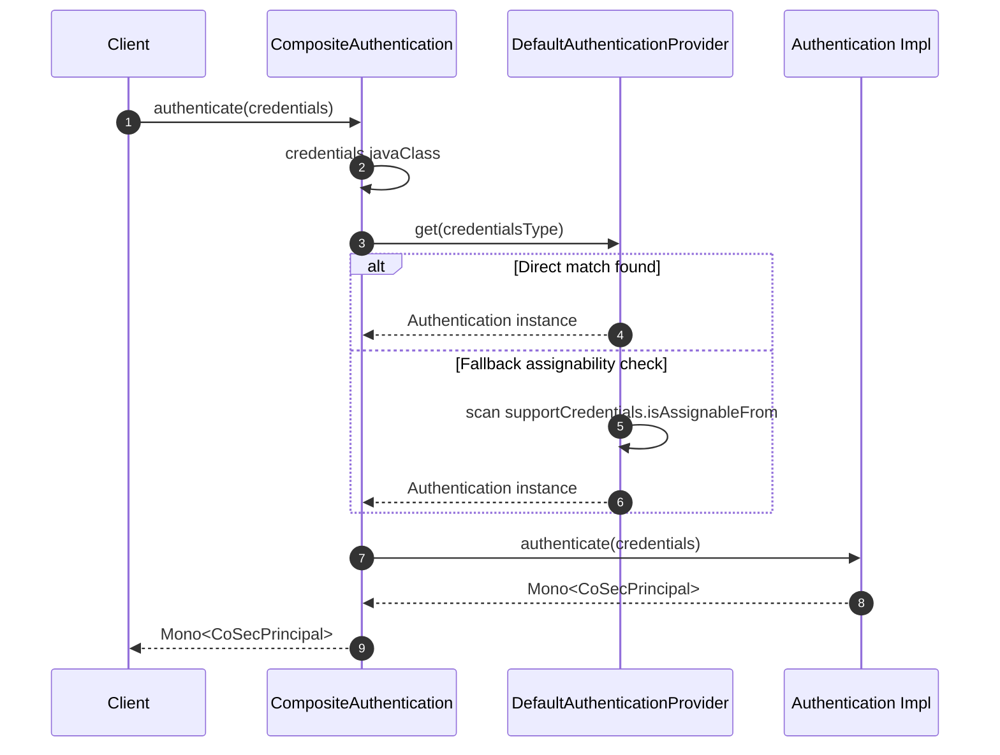
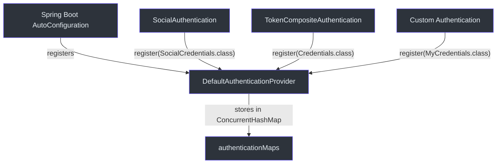

# Authentication System

CoSec's authentication layer follows a **Provider/Registry** pattern built on Project Reactor. Every authentication mechanism (tokens, social OAuth, username/password) plugs into the same generic interface, and a composite dispatcher routes credentials to the correct handler at runtime.

## Core Interfaces

### Authentication<C, P>

The top-level contract is [Authentication<C, P>](cosec-api/src/main/kotlin/me/ahoo/cosec/api/authentication/Authentication.kt), a generic reactive interface:

```kotlin
interface Authentication<C : Credentials, out P : CoSecPrincipal> {
    val supportCredentials: Class<C>
    fun authenticate(credentials: C): Mono<out P>
}
```

Each implementation declares the concrete `Credentials` subclass it handles via `supportCredentials`. The `authenticate` method returns a `Mono`, keeping the entire flow non-blocking.

### Credentials Hierarchy

[Credentials](cosec-api/src/main/kotlin/me/ahoo/cosec/api/authentication/Credentials.kt) is a marker interface at the root of a type hierarchy. Concrete implementations include `SocialCredentials`, `JustAuthCredentials`, `RefreshTokenCredentials`, and others. The dispatcher uses `credentials.javaClass` to look up the correct `Authentication` instance.

### AuthenticationProvider Registry

[AuthenticationProvider](cosec-api/src/main/kotlin/me/ahoo/cosec/api/authentication/AuthenticationProvider.kt) is a type-safe registry that maps credential classes to `Authentication` instances:

```kotlin
interface AuthenticationProvider {
    fun <C : Credentials, P : CoSecPrincipal, A : Authentication<C, P>> register(
        credentialsType: Class<C>, authentication: A)
    operator fun <C : Credentials, P : CoSecPrincipal, A : Authentication<C, P>> get(
        credentialsType: Class<out Credentials>): A?
}
```

### CompositeAuthentication Dispatcher

[CompositeAuthentication](cosec-core/src/main/kotlin/me/ahoo/cosec/authentication/CompositeAuthentication.kt) implements `Authentication<Credentials, CoSecPrincipal>` and acts as a front controller. On every call to `authenticate`, it resolves the runtime credential type and delegates to the provider:

```kotlin
override fun authenticate(credentials: Credentials): Mono<out CoSecPrincipal> {
    val credentialsType = credentials.javaClass
    return authenticate(credentialsType, credentials)
}
```

### DefaultAuthenticationProvider

[DefaultAuthenticationProvider](cosec-core/src/main/kotlin/me/ahoo/cosec/authentication/DefaultAuthenticationProvider.kt) is a singleton object backed by a `ConcurrentHashMap`. When a direct lookup fails, it falls back to an assignability check -- scanning all registered authentications for one whose `supportCredentials.isAssignableFrom(credentialsType)` returns true.

## Architecture Diagrams

### Class Hierarchy



### Composite Authentication Sequence



### Provider Registration Flow



## Key Design Decisions

1. **Type-safe dispatch**: The registry keys on `Class<C>` so there is no string-based routing or casting ambiguity at runtime.
2. **Assignability fallback**: `DefaultAuthenticationProvider.get()` first tries an exact match, then iterates all entries checking `isAssignableFrom`. This lets a single `Authentication` handle a credential supertype.
3. **Reactive throughout**: Every `authenticate` call returns `Mono`, enabling non-blocking composition with policy evaluation and token conversion downstream.
4. **Singleton provider**: `DefaultAuthenticationProvider` is a Kotlin `object` (singleton), ensuring a single source of truth for the authentication registry.

## References

- [Authentication.kt:32](https://github.com/Ahoo-Wang/CoSec/blob/main/cosec-api/src/main/kotlin/me/ahoo/cosec/api/authentication/Authentication.kt#L32) - Core `Authentication<C, P>` interface
- [AuthenticationProvider.kt:27](https://github.com/Ahoo-Wang/CoSec/blob/main/cosec-api/src/main/kotlin/me/ahoo/cosec/api/authentication/AuthenticationProvider.kt#L27) - Provider registry interface
- [Credentials.kt:24](https://github.com/Ahoo-Wang/CoSec/blob/main/cosec-api/src/main/kotlin/me/ahoo/cosec/api/authentication/Credentials.kt#L24) - Base credentials marker interface
- [CompositeAuthentication.kt:24](https://github.com/Ahoo-Wang/CoSec/blob/main/cosec-core/src/main/kotlin/me/ahoo/cosec/authentication/CompositeAuthentication.kt#L24) - Front-controller dispatcher
- [DefaultAuthenticationProvider.kt:27](https://github.com/Ahoo-Wang/CoSec/blob/main/cosec-core/src/main/kotlin/me/ahoo/cosec/authentication/DefaultAuthenticationProvider.kt#L27) - ConcurrentHashMap-backed registry

## Related Pages

- [JWT Integration](./jwt-integration.md) - How JWT tokens plug into the authentication system
- [Social Authentication](./social-authentication.md) - OAuth social login via JustAuth
- [Token Management](./token-management.md) - Token hierarchy and lifecycle
- [Authorization Flow](../authorization/authorization-flow.md) - What happens after authentication succeeds
