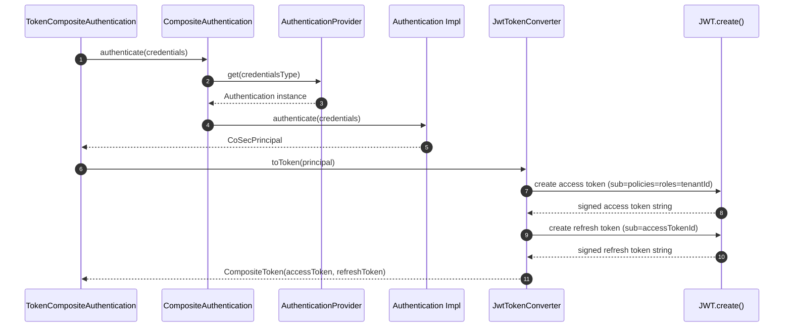
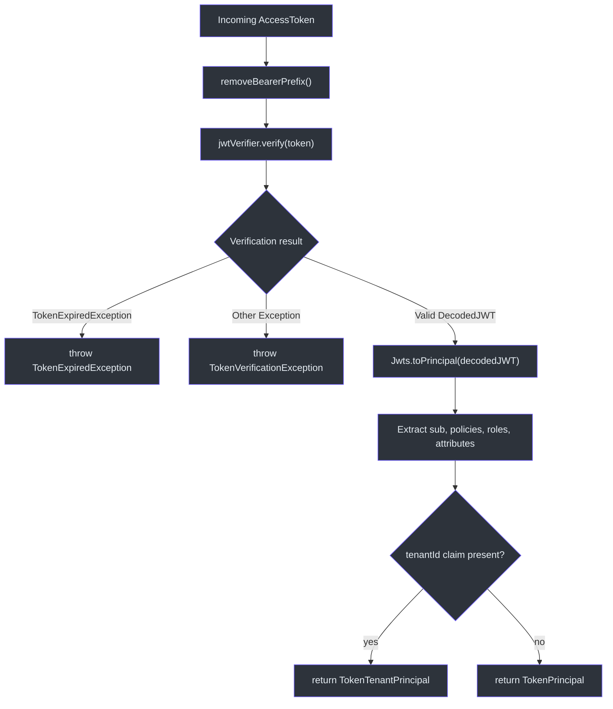
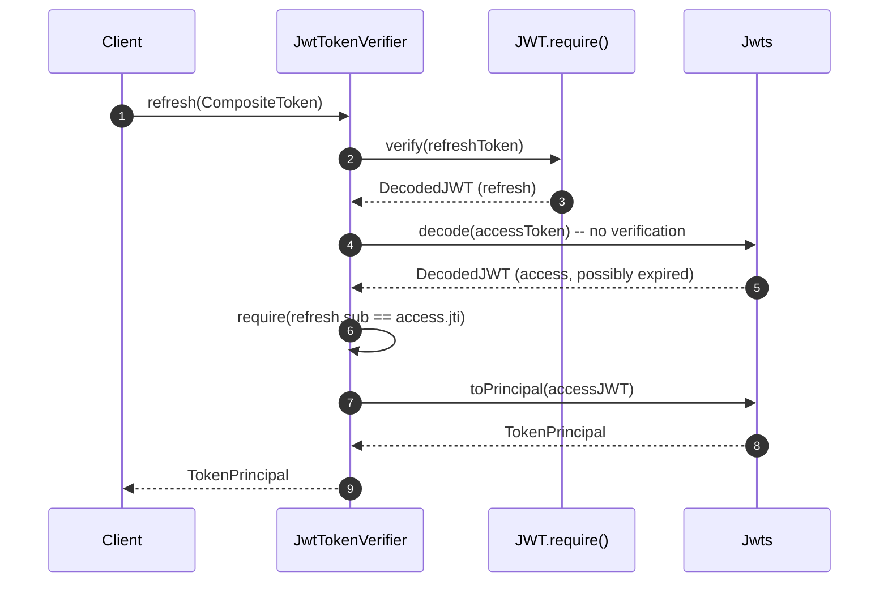

# JWT Integration

CoSec uses the [Auth0 java-jwt](https://github.com/auth0/java-jwt) library to create and verify JSON Web Tokens. The integration is encapsulated in the `cosec-jwt` module, which provides `JwtTokenConverter` (issue tokens) and `JwtTokenVerifier` (verify and extract principals). Spring Boot auto-configuration wires everything together.

## Token Lifecycle

### Token Validity Defaults

| Token Type | Default Validity | Configurable Via |
|------------|-----------------|------------------|
| Access Token | 10 minutes | `cosec.jwt.token-validity.access` |
| Refresh Token | 7 days | `cosec.jwt.token-validity.refresh` |

These defaults are defined in [JwtProperties](cosec-spring-boot-starter/src/main/kotlin/me/ahoo/cosec/spring/boot/starter/jwt/JwtProperties.kt):

```kotlin
data class TokenValidity(
    var access: Duration = Duration.ofMinutes(10),
    var refresh: Duration = Duration.ofDays(7)
)
```

### Supported Algorithms

The auto-configuration supports three HMAC algorithms, selected via `cosec.jwt.algorithm`:

| Value | Algorithm | Javadoc |
|-------|-----------|---------|
| `HMAC256` (default) | HS256 | `Algorithm.HMAC256(secret)` |
| `HMAC384` | HS384 | `Algorithm.HMAC384(secret)` |
| `HMAC512` | HS512 | `Algorithm.HMAC512(secret)` |

## JWT Claims Structure

[JwtTokenConverter](cosec-jwt/src/main/kotlin/me/ahoo/cosec/jwt/JwtTokenConverter.kt) builds a JWT with the following claims structure for access tokens:

```json
{
  "jti": "<generated-unique-id>",
  "sub": "<principal.id>",
  "iat": 1684000000000,
  "exp": 1684000600000,
  "policies": ["policy-id-1", "policy-id-2"],
  "roles": ["admin", "user"],
  "attributes": {"key": "value"},
  "tenantId": "tenant-123"
}
```

Key mappings:

- **`sub`** (Subject): Set to `principal.id` -- the unique user identifier
- **`jti`** (JWT ID): Generated by an `IdGenerator` (default: UUID). Used for token revocation and refresh token binding
- **`policies`**: `PolicyCapable.POLICY_KEY` claim -- list of policy IDs assigned to the principal
- **`roles`**: `RoleCapable.ROLE_KEY` claim -- list of role IDs
- **`attributes`**: `CoSecPrincipal::attributes.name` claim -- arbitrary key-value metadata
- **`tenantId`**: `Tenant.TENANT_ID_KEY` claim -- present only when the principal implements `TenantCapable`

Refresh tokens have a simpler structure:

```json
{
  "jti": "<refresh-token-id>",
  "sub": "<access-token-id>",
  "iat": 1684000000000,
  "exp": 1685209600000
}
```

The refresh token's `sub` claim is set to the **access token's `jti`**, creating a binding between the two tokens.

## Key Classes

### JwtTokenConverter

[JwtTokenConverter](cosec-jwt/src/main/kotlin/me/ahoo/cosec/jwt/JwtTokenConverter.kt) implements `TokenConverter` and converts a `CoSecPrincipal` into a `CompositeToken`:

```kotlin
class JwtTokenConverter(
    private val idGenerator: IdGenerator,
    private val algorithm: Algorithm,
    private val accessTokenValidity: Duration = Duration.ofMinutes(10),
    private val refreshTokenValidity: Duration = Duration.ofDays(7)
) : TokenConverter
```

### JwtTokenVerifier

[JwtTokenVerifier](cosec-jwt/src/main/kotlin/me/ahoo/cosec/jwt/JwtTokenVerifier.kt) implements `TokenVerifier` and provides:

- **`verify(AccessToken)`**: Validates signature, checks expiry, extracts `TokenPrincipal`
- **`refresh(CompositeToken)`**: Verifies the refresh token, ensures its `sub` matches the access token's `jti`, then extracts the principal from the (possibly expired) access token

### Jwts Utility

[Jwts](cosec-jwt/src/main/kotlin/me/ahoo/cosec/jwt/Jwts.kt) provides helper functions:

- **`decode(token)`**: Strips `Bearer ` prefix and decodes the JWT without verification
- **`toPrincipal(decodedJWT)`**: Extracts all claims and constructs a `TokenPrincipal` (or `TokenTenantPrincipal` when `tenantId` is present)
- **`removeBearerPrefix()`**: String extension that removes the `"Bearer "` prefix if present

## Architecture Diagrams

### Token Creation Flow



### Token Verification Flow



### Refresh Token Flow



## Spring Boot Auto-Configuration

[CoSecJwtAutoConfiguration](cosec-spring-boot-starter/src/main/kotlin/me/ahoo/cosec/spring/boot/starter/jwt/CoSecJwtAutoConfiguration.kt) is activated when:

1. `cosec.enabled=true` (default)
2. `cosec.jwt.enabled=true` (default)
3. `JwtTokenConverter` is on the classpath

It registers three beans:

| Bean | Type | Purpose |
|------|------|---------|
| `cosecTokenAlgorithm` | `Algorithm` | HMAC algorithm from config |
| `cosecTokenConverter` | `TokenConverter` | Creates JWT tokens |
| `cosecJwtTokenVerifier` | `TokenVerifier` | Verifies JWT tokens |

When authentication is also enabled, it additionally registers `TokenCompositeAuthentication` which chains credential-based authentication with token issuance.

## Configuration Example

```yaml
cosec:
  jwt:
    enabled: true
    algorithm: HMAC256
    secret: your-secret-key-must-be-long-enough
    token-validity:
      access: 10m
      refresh: 7d
```

## References

- [JwtTokenConverter.kt:42](https://github.com/Ahoo-Wang/CoSec/blob/main/cosec-jwt/src/main/kotlin/me/ahoo/cosec/jwt/JwtTokenConverter.kt#L42) - JWT token creation with claims
- [JwtTokenVerifier.kt:37](https://github.com/Ahoo-Wang/CoSec/blob/main/cosec-jwt/src/main/kotlin/me/ahoo/cosec/jwt/JwtTokenVerifier.kt#L37) - JWT verification and principal extraction
- [Jwts.kt:41](https://github.com/Ahoo-Wang/CoSec/blob/main/cosec-jwt/src/main/kotlin/me/ahoo/cosec/jwt/Jwts.kt#L41) - JWT utility functions (decode, toPrincipal, removeBearerPrefix)
- [CoSecJwtAutoConfiguration.kt:47](https://github.com/Ahoo-Wang/CoSec/blob/main/cosec-spring-boot-starter/src/main/kotlin/me/ahoo/cosec/spring/boot/starter/jwt/CoSecJwtAutoConfiguration.kt#L47) - Spring Boot auto-configuration
- [JwtProperties.kt:28](https://github.com/Ahoo-Wang/CoSec/blob/main/cosec-spring-boot-starter/src/main/kotlin/me/ahoo/cosec/spring/boot/starter/jwt/JwtProperties.kt#L28) - Configuration properties

## Related Pages

- [Authentication System](./authentication-system.md) - How JWT plugs into the provider registry
- [Token Management](./token-management.md) - Token hierarchy and principal types
- [Social Authentication](./social-authentication.md) - OAuth-based authentication alternative
- [Authorization Flow](../authorization/authorization-flow.md) - How token claims drive authorization decisions
