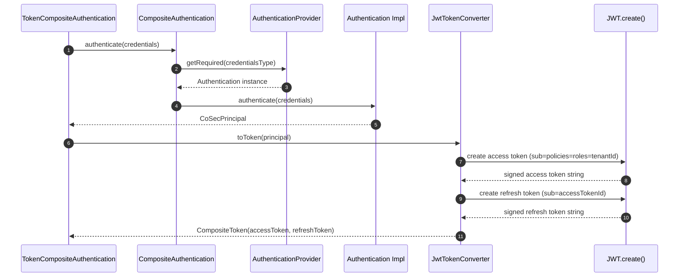
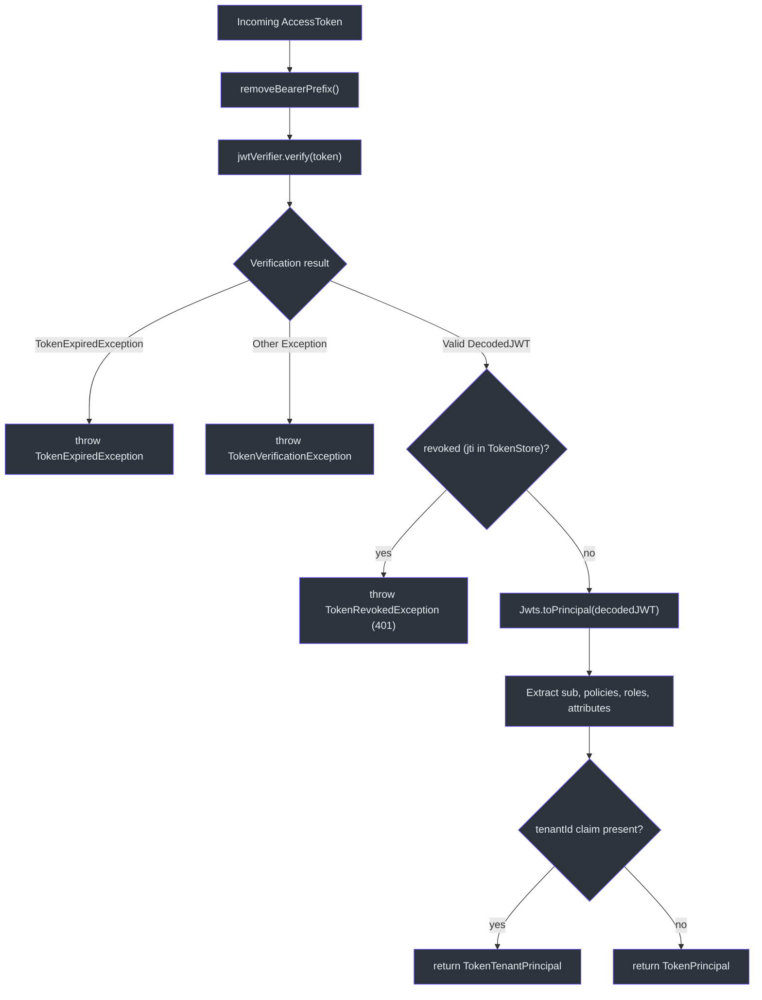
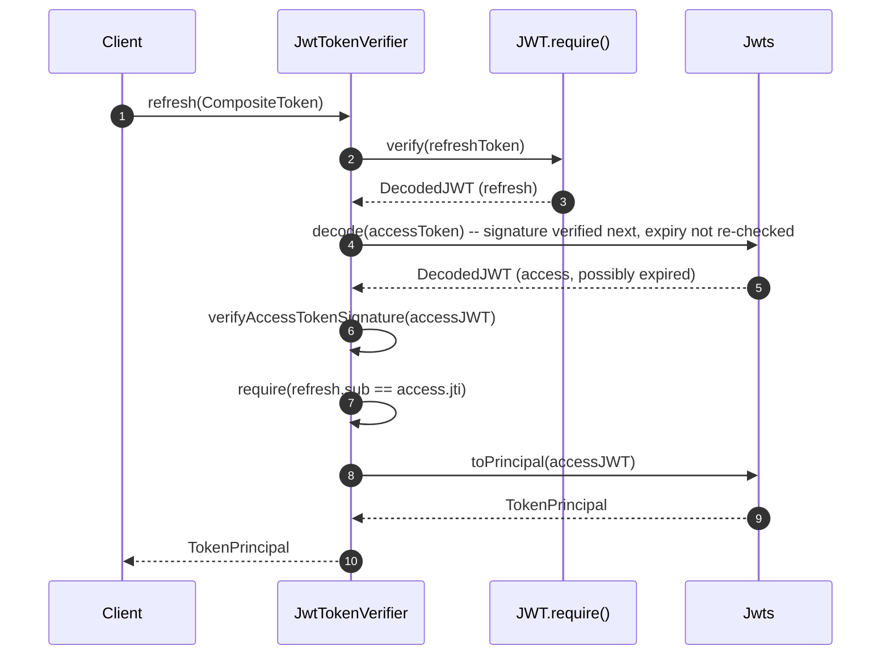

# JWT Integration

CoSec uses the [Auth0 java-jwt](https://github.com/auth0/java-jwt) library to create and verify JSON Web Tokens. The integration is encapsulated in the `cosec-jwt` module, which provides `JwtTokenConverter` (issue tokens) and `JwtTokenVerifier` (verify and extract principals). Spring Boot auto-configuration wires everything together.

## Token Lifecycle

### Token Validity Defaults

| Token Type | Default Validity | Configurable Via |
|------------|-----------------|------------------|
| Access Token | 10 minutes | `cosec.jwt.token-validity.access` |
| Refresh Token | 7 days | `cosec.jwt.token-validity.refresh` |

These defaults are defined in [JwtProperties](cosec-spring-boot-starter/src/main/kotlin/me/ahoo/cosec/spring/boot/starter/jwt/JwtProperties.kt):

```kotlin
data class TokenValidity(
    var access: Duration = Duration.ofMinutes(10),
    var refresh: Duration = Duration.ofDays(7)
)
```

### Supported Algorithms

The auto-configuration supports three HMAC algorithms, selected via `cosec.jwt.algorithm`:

| Value | Algorithm | Javadoc |
|-------|-----------|---------|
| `HMAC256` (default) | HS256 | `Algorithm.HMAC256(secret)` |
| `HMAC384` | HS384 | `Algorithm.HMAC384(secret)` |
| `HMAC512` | HS512 | `Algorithm.HMAC512(secret)` |

## JWT Claims Structure

[JwtTokenConverter](cosec-jwt/src/main/kotlin/me/ahoo/cosec/jwt/JwtTokenConverter.kt) builds a JWT with the following claims structure for access tokens:

```json
{
  "jti": "<generated-unique-id>",
  "sub": "<principal.id>",
  "iat": 1684000000,
  "exp": 1684000600,
  "policies": ["policy-id-1", "policy-id-2"],
  "roles": ["admin", "user"],
  "attributes": {"key": "value"},
  "tenantId": "tenant-123"
}
```

Key mappings:

- **`sub`** (Subject): Set to `principal.id` -- the unique user identifier
- **`jti`** (JWT ID): Generated by an `IdGenerator` (default: UUID). Used for token revocation (see [Token Revocation (Logout)](#token-revocation-logout)) and refresh token binding
- **`policies`**: `PolicyCapable.POLICY_KEY` claim -- list of policy IDs assigned to the principal (written only when non-empty)
- **`roles`**: `RoleCapable.ROLE_KEY` claim -- list of role IDs (written only when non-empty)
- **`attributes`**: `CoSecPrincipal::attributes.name` claim -- arbitrary key-value metadata (written only when non-empty)
- **`tenantId`**: `Tenant.TENANT_ID_KEY` claim -- present only when the principal implements `TenantCapable`

Refresh tokens have a simpler structure:

```json
{
  "jti": "<refresh-token-id>",
  "sub": "<access-token-id>",
  "iat": 1684000000,
  "exp": 1685209600
}
```

The refresh token's `sub` claim is set to the **access token's `jti`**, creating a binding between the two tokens.

## Key Classes

### JwtTokenConverter

[JwtTokenConverter](cosec-jwt/src/main/kotlin/me/ahoo/cosec/jwt/JwtTokenConverter.kt) implements `TokenConverter` and converts a `CoSecPrincipal` into a `CompositeToken`:

```kotlin
class JwtTokenConverter(
    private val idGenerator: IdGenerator,
    private val algorithm: Algorithm,
    private val accessTokenValidity: Duration = Duration.ofMinutes(10),
    private val refreshTokenValidity: Duration = Duration.ofDays(7)
) : TokenConverter
```

### JwtTokenVerifier

[JwtTokenVerifier](cosec-jwt/src/main/kotlin/me/ahoo/cosec/jwt/JwtTokenVerifier.kt) implements `TokenVerifier` and provides:

- **`verify(AccessToken)`**: Validates signature, checks expiry, extracts `TokenPrincipal`
- **`refresh(CompositeToken)`**: Verifies the refresh token, verifies the access token's signature (its expiry may have passed), ensures its `sub` matches the access token's `jti`, then extracts the principal from the (possibly expired) access token

### Jwts Utility

[Jwts](cosec-jwt/src/main/kotlin/me/ahoo/cosec/jwt/Jwts.kt) provides helper functions:

- **`decode(token)`**: Strips `Bearer ` prefix and decodes the JWT without verification
- **`toPrincipal(decodedJWT)`**: Extracts all claims and constructs a `TokenPrincipal` (or `TokenTenantPrincipal` when `tenantId` is present)
- **`removeBearerPrefix()`**: String extension that removes the `"Bearer "` prefix if present

## Architecture Diagrams

### Token Creation Flow


```mermaid
sequenceDiagram
    autonumber
    participant Auth as TokenCompositeAuthentication
    participant CA as CompositeAuthentication
    participant AP as AuthenticationProvider
    participant Impl as Authentication Impl
    participant Conv as JwtTokenConverter
    participant JWT as JWT.create()

    Auth->>CA: authenticate(credentials)
    CA->>AP: getRequired(credentialsType)
    AP-->>CA: Authentication instance
    CA->>Impl: authenticate(credentials)
    Impl-->>Auth: CoSecPrincipal
    Auth->>Conv: toToken(principal)
    Conv->>JWT: create access token (sub=policies=roles=tenantId)
    JWT-->>Conv: signed access token string
    Conv->>JWT: create refresh token (sub=accessTokenId)
    JWT-->>Conv: signed refresh token string
    Conv-->>Auth: CompositeToken(accessToken, refreshToken)

```

### Token Verification Flow


```mermaid
flowchart TD
    A["Incoming AccessToken"] --> B["removeBearerPrefix()"]
    B --> C["jwtVerifier.verify(token)"]
    C --> D{"Verification result"}
    D -->|"TokenExpiredException"| E["throw TokenExpiredException"]
    D -->|"Other Exception"| F["throw TokenVerificationException"]
    D -->|"Valid DecodedJWT"| N{"revoked (jti in TokenStore)?"}
    N -->|"yes"| R["throw TokenRevokedException (401)"]
    N -->|"no"| G["Jwts.toPrincipal(decodedJWT)"]
    G --> H["Extract sub, policies, roles, attributes"]
    H --> I{"tenantId claim present?"}
    I -->|"yes"| J["return TokenTenantPrincipal"]
    I -->|"no"| K["return TokenPrincipal"]

    style A fill:#2d333b,stroke:#6d5dfc,color:#e6edf3
    style B fill:#2d333b,stroke:#6d5dfc,color:#e6edf3
    style C fill:#2d333b,stroke:#6d5dfc,color:#e6edf3
    style D fill:#2d333b,stroke:#6d5dfc,color:#e6edf3
    style E fill:#2d333b,stroke:#6d5dfc,color:#e6edf3
    style F fill:#2d333b,stroke:#6d5dfc,color:#e6edf3
    style G fill:#2d333b,stroke:#6d5dfc,color:#e6edf3
    style H fill:#2d333b,stroke:#6d5dfc,color:#e6edf3
    style I fill:#2d333b,stroke:#6d5dfc,color:#e6edf3
    style J fill:#2d333b,stroke:#6d5dfc,color:#e6edf3
    style K fill:#2d333b,stroke:#6d5dfc,color:#e6edf3
    style N fill:#2d333b,stroke:#6d5dfc,color:#e6edf3
    style R fill:#2d333b,stroke:#6d5dfc,color:#e6edf3

```

### Refresh Token Flow


```mermaid
sequenceDiagram
    autonumber
    participant Client
    participant Verifier as JwtTokenVerifier
    participant JWT as JWT.require()
    participant Jwts as Jwts

    Client->>Verifier: refresh(CompositeToken)
    Verifier->>JWT: verify(refreshToken)
    JWT-->>Verifier: DecodedJWT (refresh)
    Verifier->>Jwts: decode(accessToken) -- signature verified next, expiry not re-checked
    Jwts-->>Verifier: DecodedJWT (access, possibly expired)
    Verifier->>Verifier: verifyAccessTokenSignature(accessJWT)
    Verifier->>Verifier: require(refresh.sub == access.jti)
    Verifier->>Jwts: toPrincipal(accessJWT)
    Jwts-->>Verifier: TokenPrincipal
    Verifier-->>Client: TokenPrincipal

```

## Token Revocation (Logout)

JWTs are stateless by default -- deleting the token on the client does not invalidate it on the server. CoSec closes this gap with an opt-in revocation mechanism keyed by the token's `jti` claim.

### What It Does

- `TokenRevoker.revoke(accessToken)` verifies the token and records its `jti` in a revocation store. Call it from your own logout endpoint.
- A revoked access token is rejected immediately with a `401` -- every verification goes through `RevocableTokenVerifier`, which checks the store before accepting the token.
- The refresh token is bound to the access token's `jti` (its `sub` claim), so refreshing a revoked token is rejected as well.
- The revocation entry is kept for the refresh token validity (`cosec.jwt.token-validity.refresh`), so it never expires before the bound refresh token does.

Logout stays idempotent when the token is already invalid -- catch and ignore the verification failure:

```kotlin
@PostMapping("/logout")
fun logout(@RequestHeader(HttpHeaders.AUTHORIZATION) authorization: String): ResponseEntity<Void> {
    try {
        tokenRevoker.revoke(SimpleAccessToken(authorization)) // the verifier strips the Bearer prefix
    } catch (ignored: TokenVerificationException) {
        // token already invalid or expired -- nothing left to revoke
    }
    return ResponseEntity.noContent().build()
}
```

Note: revoke before the access token expires. An already-expired access token fails verification, and its still-valid bound refresh token can then no longer be killed through `TokenRevoker`.

### How to Enable

```yaml
cosec:
  jwt:
    token-revocation:
      enabled: true
```

This wires the Redis-backed `CoCacheTokenStore`, which requires the `cosec-cocache` dependency (the starter's `cacheSupport` Gradle feature) and a Redis connection:

```kotlin
dependencies {
    implementation("me.ahoo.cosec:cosec-spring-boot-starter") {
        capabilities {
            requireCapability("me.ahoo.cosec:cosec-spring-boot-starter-cache-support")
        }
    }
}
```

### TokenStore SPI

Revocation storage is pluggable through the `TokenStore` SPI:

- **Default `NoOp`** -- stateless and a no-op. Upgrading CoSec changes nothing until you opt in, so the stateless default behavior is preserved.
- **`CoCacheTokenStore`** -- the ready-made Redis-backed implementation (two-level CoCache: local + Redis), wired automatically when the property is enabled and cosec-cocache is on the classpath.
- **Custom** -- provide your own `TokenStore` bean to store revocations anywhere else.

### Operational Notes

- **Inject mode**: downstream services that inject the security context from gateway headers do not verify the JWT signature, so they cannot check revocation either. Enforcement happens at the verifying edge (the gateway).
- **Propagation**: CoCache evicts local entries via Redis pub/sub, so revocation takes effect on all instances near-instantly when the cluster is healthy. In the worst case, propagation is bounded by the local cache TTL (default 30 seconds, configurable via `cosec.authorization.cache.token.*`).
- **Fail-open on Redis outage**: with CoCache's default `strictFailure=false`, an unreachable Redis makes `isRevoked` fall back to `false` (revoked tokens may authenticate again) and revoke writes are dropped. Deployments that prefer fail-closed behavior can set `cocache.redis.strict-failure=true`.

## Spring Boot Auto-Configuration

[CoSecJwtAutoConfiguration](cosec-spring-boot-starter/src/main/kotlin/me/ahoo/cosec/spring/boot/starter/jwt/CoSecJwtAutoConfiguration.kt) is activated when:

1. `cosec.enabled=true` (default)
2. `cosec.jwt.enabled=true` (default)
3. `JwtTokenConverter` is on the classpath

It registers five beans:

| Bean | Type | Purpose |
|------|------|---------|
| `cosecTokenAlgorithm` | `Algorithm` | HMAC algorithm from config |
| `cosecTokenConverter` | `TokenConverter` | Creates JWT tokens |
| `cosecTokenStore` | `TokenStore` | Revocation store (`NoOp` unless the cache-backed one is wired, see [Token Revocation (Logout)](#token-revocation-logout)) |
| `cosecJwtTokenVerifier` | `TokenVerifier` | Verifies JWT tokens and rejects revoked ones |
| `cosecTokenRevoker` | `TokenRevoker` | Revokes tokens for logout |

When authentication is also enabled, it additionally registers `TokenCompositeAuthentication` which chains credential-based authentication with token issuance.

## Configuration Example

```yaml
cosec:
  jwt:
    enabled: true
    algorithm: HMAC256
    secret: your-secret-key-must-be-long-enough
    token-validity:
      access: 10m
      refresh: 7d
    token-revocation:
      enabled: false # opt-in logout; true wires the Redis-backed CoCacheTokenStore
```

The revocation local cache is tuned under `cosec.authorization.cache.token.*` (default: 30s expire-after-write, 100k entries -- also the worst-case logout propagation window across instances).

## References

- [JwtTokenConverter.kt:42](https://github.com/Ahoo-Wang/CoSec/blob/main/cosec-jwt/src/main/kotlin/me/ahoo/cosec/jwt/JwtTokenConverter.kt#L42) - JWT token creation with claims
- [JwtTokenVerifier.kt:37](https://github.com/Ahoo-Wang/CoSec/blob/main/cosec-jwt/src/main/kotlin/me/ahoo/cosec/jwt/JwtTokenVerifier.kt#L37) - JWT verification and principal extraction
- [Jwts.kt:44](https://github.com/Ahoo-Wang/CoSec/blob/main/cosec-jwt/src/main/kotlin/me/ahoo/cosec/jwt/Jwts.kt#L44) - JWT utility functions (decode, toPrincipal, removeBearerPrefix)
- [CoSecJwtAutoConfiguration.kt:52](https://github.com/Ahoo-Wang/CoSec/blob/main/cosec-spring-boot-starter/src/main/kotlin/me/ahoo/cosec/spring/boot/starter/jwt/CoSecJwtAutoConfiguration.kt#L52) - Spring Boot auto-configuration
- [JwtProperties.kt:28](https://github.com/Ahoo-Wang/CoSec/blob/main/cosec-spring-boot-starter/src/main/kotlin/me/ahoo/cosec/spring/boot/starter/jwt/JwtProperties.kt#L28) - Configuration properties
- [TokenStore.kt:33](https://github.com/Ahoo-Wang/CoSec/blob/main/cosec-core/src/main/kotlin/me/ahoo/cosec/token/TokenStore.kt#L33) - Token revocation store SPI
- [CoCacheTokenStore.kt:29](https://github.com/Ahoo-Wang/CoSec/blob/main/cosec-cocache/src/main/kotlin/me/ahoo/cosec/cache/CoCacheTokenStore.kt#L29) - Redis-backed revocation store

## Related Pages

- [Authentication System](./authentication-system.md) - How JWT plugs into the provider registry
- [Token Management](./token-management.md) - Token hierarchy and principal types
- [Social Authentication](./social-authentication.md) - OAuth-based authentication alternative
- [Authorization Flow](../authorization/authorization-flow.md) - How token claims drive authorization decisions
