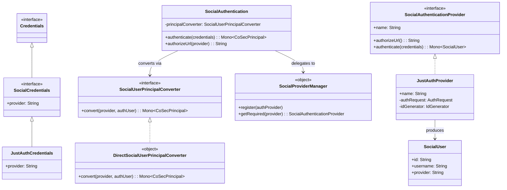
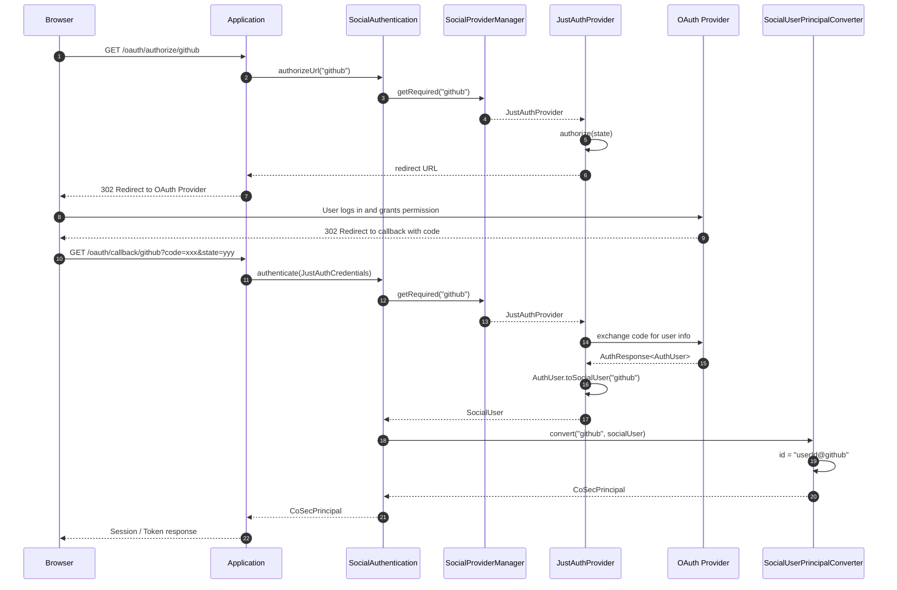
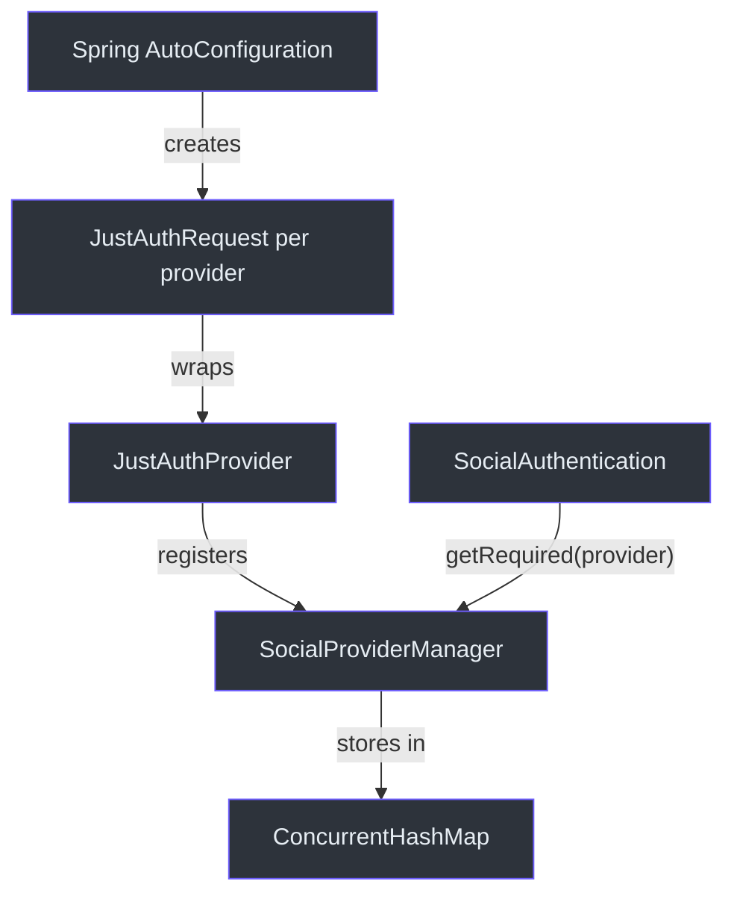

# Social Authentication

CoSec provides OAuth-based social login through the `cosec-social` module. It uses the [JustAuth](https://github.com/justauth/JustAuth) library to support dozens of OAuth providers (GitHub, Google, WeChat, DingTalk, etc.) behind a unified authentication interface.

## Architecture Overview

Social authentication follows the standard CoSec `Authentication<C, P>` pattern but specializes it for OAuth flows. The key abstractions are:

- **`SocialCredentials`** -- carries the OAuth callback data plus a `provider` identifier
- **`SocialAuthenticationProvider`** -- per-provider logic for generating authorize URLs and exchanging codes for user data
- **`SocialAuthentication`** -- the top-level `Authentication` implementation that routes to the correct provider
- **`SocialUserPrincipalConverter`** -- converts the provider's user profile into a `CoSecPrincipal`

## Key Interfaces

### SocialCredentials

[SocialCredentials](cosec-social/src/main/kotlin/me/ahoo/cosec/social/SocialCredentials.kt) extends `Credentials` with a `provider` field:

```kotlin
interface SocialCredentials : Credentials {
    val provider: String
}
```

The concrete implementation is [JustAuthCredentials](cosec-social/src/main/kotlin/me/ahoo/cosec/social/justauth/JustAuthCredentials.kt), which also extends JustAuth's `AuthCallback` to carry the OAuth authorization code and state.

### SocialAuthenticationProvider

[SocialAuthenticationProvider](cosec-social/src/main/kotlin/me/ahoo/cosec/social/SocialAuthenticationProvider.kt) defines per-provider behavior:

```kotlin
interface SocialAuthenticationProvider : Named {
    fun authorizeUrl(): String
    fun authenticate(credentials: SocialCredentials): Mono<SocialUser>
}
```

- `authorizeUrl()` generates the OAuth authorization redirect URL
- `authenticate()` exchanges the authorization code for a `SocialUser`

### SocialProviderManager

[SocialProviderManager](cosec-social/src/main/kotlin/me/ahoo/cosec/social/SocialProviderManager.kt) is a singleton registry that maps provider names (e.g., "github", "google") to `SocialAuthenticationProvider` instances:

```kotlin
object SocialProviderManager {
    fun register(authProvider: SocialAuthenticationProvider)
    fun getRequired(provider: String): SocialAuthenticationProvider
}
```

### SocialUser

[SocialUser](cosec-social/src/main/kotlin/me/ahoo/cosec/social/SocialUser.kt) is a data class holding the provider's user profile:

```kotlin
data class SocialUser(
    val id: String,
    val username: String,
    val nickname: String? = null,
    val avatar: String? = null,
    val email: String? = null,
    val location: String? = null,
    val gender: Gender = Gender.UNKNOWN,
    val rawInfo: MutableMap<String, Any> = mutableMapOf(),
    val provider: String
)
```

### SocialUserPrincipalConverter

[SocialUserPrincipalConverter](cosec-social/src/main/kotlin/me/ahoo/cosec/social/SocialUserPrincipalConverter.kt) converts a `SocialUser` into a `CoSecPrincipal`:

```kotlin
fun interface SocialUserPrincipalConverter {
    fun convert(provider: String, authUser: SocialUser): Mono<CoSecPrincipal>
}
```

### DirectSocialUserPrincipalConverter

[DirectSocialUserPrincipalConverter](cosec-social/src/main/kotlin/me/ahoo/cosec/social/DirectSocialUserPrincipalConverter.kt) is the default implementation. It creates a `SimplePrincipal` with a composite ID format:

```kotlin
// ID format: "userId@provider" (e.g., "12345@github")
private fun asProviderUserId(provider: String, authUser: SocialUser): String {
    return authUser.id + "@" + provider
}
```

The principal starts with empty policies and roles -- these must be assigned separately after account creation/linking.

## JustAuth Integration

### JustAuthProvider

[JustAuthProvider](cosec-social/src/main/kotlin/me/ahoo/cosec/social/justauth/JustAuthProvider.kt) wraps a JustAuth `AuthRequest` to implement `SocialAuthenticationProvider`:

```kotlin
class JustAuthProvider(
    override val name: String,
    private val authRequest: AuthRequest,
    private val idGenerator: IdGenerator
) : SocialAuthenticationProvider
```

- `authorizeUrl()` calls `authRequest.authorize(state)` using a generated state token
- `authenticate()` calls `authRequest.login(credentials)` and converts the `AuthUser` response to a `SocialUser`

### RedisAuthStateCache

[RedisAuthStateCache](cosec-social/src/main/kotlin/me/ahoo/cosec/social/justauth/RedisAuthStateCache.kt) implements JustAuth's `AuthStateCache` interface using Redis to store OAuth state tokens across distributed instances. States expire after 3 minutes. Keys are prefixed with `cosec:oauth:state:`.

## Architecture Diagrams

### Social Authentication Class Diagram



### Social OAuth Flow Sequence Diagram



### Provider Registration Flow



## Design Decisions

1. **Pluggable providers**: The `SocialAuthenticationProvider` abstraction allows swapping JustAuth for another OAuth library without changing application code.
2. **Composite user ID**: `userId@provider` format ensures globally unique principal IDs across all OAuth providers.
3. **Distributed state**: `RedisAuthStateCache` ensures OAuth state tokens work across multiple application instances.
4. **Customizable conversion**: The `SocialUserPrincipalConverter` interface allows applications to implement custom logic for creating principals (e.g., linking to existing accounts, assigning default roles).

## References

- [SocialAuthentication.kt:24](https://github.com/Ahoo-Wang/CoSec/blob/main/cosec-social/src/main/kotlin/me/ahoo/cosec/social/SocialAuthentication.kt#L24) - Top-level social authentication
- [SocialAuthenticationProvider.kt:23](https://github.com/Ahoo-Wang/CoSec/blob/main/cosec-social/src/main/kotlin/me/ahoo/cosec/social/SocialAuthenticationProvider.kt#L23) - Per-provider interface
- [SocialProviderManager.kt:22](https://github.com/Ahoo-Wang/CoSec/blob/main/cosec-social/src/main/kotlin/me/ahoo/cosec/social/SocialProviderManager.kt#L22) - Provider registry singleton
- [JustAuthProvider.kt:33](https://github.com/Ahoo-Wang/CoSec/blob/main/cosec-social/src/main/kotlin/me/ahoo/cosec/social/justauth/JustAuthProvider.kt#L33) - JustAuth wrapper implementation
- [DirectSocialUserPrincipalConverter.kt:25](https://github.com/Ahoo-Wang/CoSec/blob/main/cosec-social/src/main/kotlin/me/ahoo/cosec/social/DirectSocialUserPrincipalConverter.kt#L25) - Default principal converter with "userId@provider" format

## Related Pages

- [Authentication System](./authentication-system.md) - How social auth plugs into the provider registry
- [Token Management](./token-management.md) - Converting social auth principals to tokens
- [JWT Integration](./jwt-integration.md) - JWT token creation after social login
- [Authorization Flow](../authorization/authorization-flow.md) - How social principals are authorized
