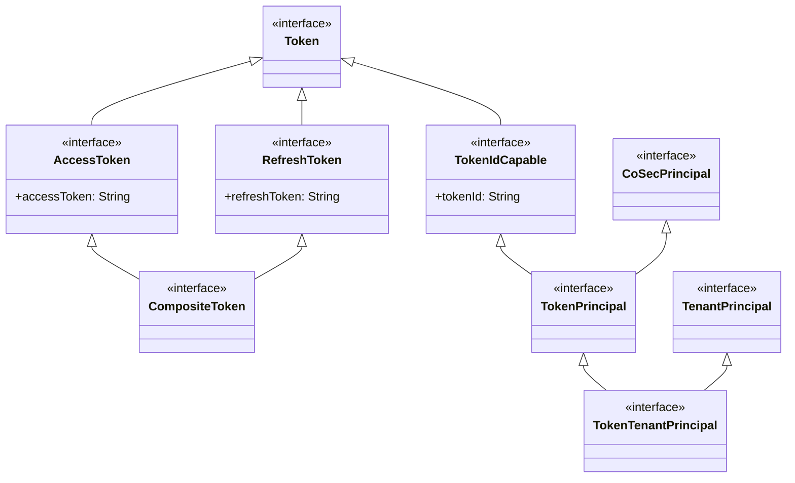
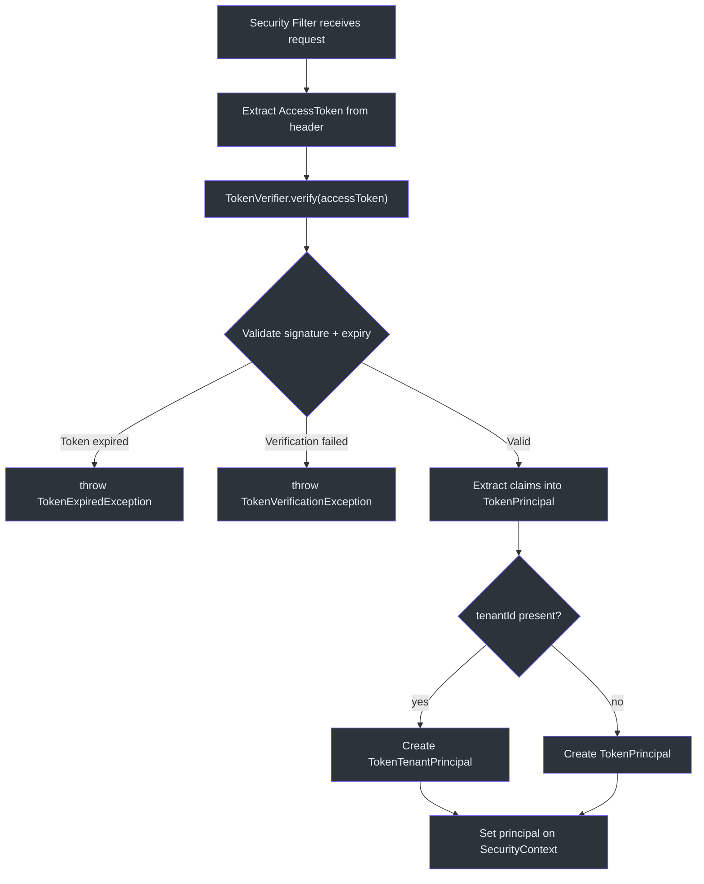
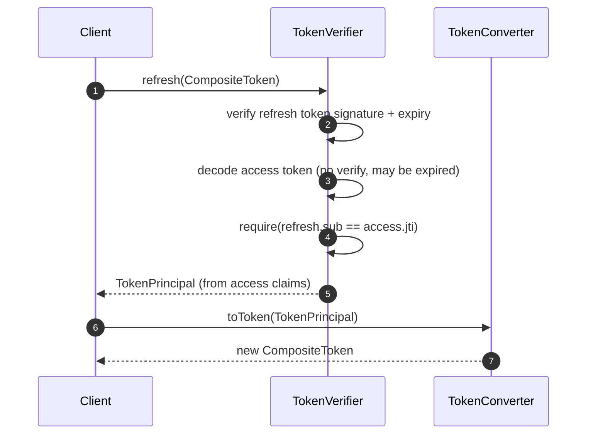

# Token Management

CoSec's token management layer provides a clean type hierarchy for representing and manipulating authentication tokens. The design separates the abstract token model (in `cosec-api`) from the concrete implementations (in `cosec-core` and `cosec-jwt`), following the project's convention of API-implementation separation.

## Token Type Hierarchy

The token type hierarchy lives in the `cosec-api` module and forms a compositional lattice:

### Token (base)

[Token](cosec-api/src/main/kotlin/me/ahoo/cosec/api/token/Token.kt) is the root marker interface:

```kotlin
interface Token
```

### AccessToken

[AccessToken](cosec-api/src/main/kotlin/me/ahoo/cosec/api/token/AccessToken.kt) extends `Token` with the access token string:

```kotlin
interface AccessToken : Token {
    val accessToken: String
}
```

### RefreshToken

[RefreshToken](cosec-api/src/main/kotlin/me/ahoo/cosec/api/token/RefreshToken.kt) extends `Token` with the refresh token string:

```kotlin
interface RefreshToken : Token {
    val refreshToken: String
}
```

### CompositeToken

[CompositeToken](cosec-api/src/main/kotlin/me/ahoo/cosec/api/token/CompositeToken.kt) combines both interfaces:

```kotlin
interface CompositeToken : AccessToken, RefreshToken
```

This allows a single object to carry both tokens while remaining type-safe -- a method accepting `AccessToken` can receive a `CompositeToken`.

## Principal Types

### TokenIdCapable

[TokenIdCapable](cosec-api/src/main/kotlin/me/ahoo/cosec/api/token/TokenIdCapable.kt) mixes token identity into any type:

```kotlin
interface TokenIdCapable : Token {
    val tokenId: String
}
```

### TokenPrincipal

[TokenPrincipal](cosec-api/src/main/kotlin/me/ahoo/cosec/api/token/TokenPrincipal.kt) extends `CoSecPrincipal` with token awareness:

```kotlin
interface TokenPrincipal : TokenIdCapable, CoSecPrincipal
```

A `TokenPrincipal` represents an authenticated user along with the token ID used for authentication. This enables downstream code to reference the specific token (e.g., for audit logging or token revocation).

### TokenTenantPrincipal

[TokenTenantPrincipal](cosec-api/src/main/kotlin/me/ahoo/cosec/api/token/TokenTenantPrincipal.kt) adds tenant context:

```kotlin
interface TokenTenantPrincipal : TenantPrincipal, TokenPrincipal
```

This combines all three dimensions -- identity, token, and tenant -- into a single principal type for multi-tenant token-authenticated applications.

## Converter and Verifier Interfaces

### PrincipalConverter

[PrincipalConverter](cosec-core/src/main/kotlin/me/ahoo/cosec/token/PrincipalConverter.kt) is a `fun interface` that converts an `AccessToken` to a `CoSecPrincipal`:

```kotlin
fun interface PrincipalConverter {
    fun toPrincipal(accessToken: AccessToken): CoSecPrincipal
}
```

### TokenConverter

[TokenConverter](cosec-core/src/main/kotlin/me/ahoo/cosec/token/TokenConverter.kt) converts a `CoSecPrincipal` into a `CompositeToken`:

```kotlin
interface TokenConverter {
    fun toToken(principal: CoSecPrincipal): CompositeToken
    fun toToken(
        principal: CoSecPrincipal,
        accessTokenValidity: Duration,
        refreshTokenValidity: Duration
    ): CompositeToken
}
```

The overload with custom durations enables per-request token validity control (e.g., shorter tokens for sensitive operations).

### TokenVerifier

[TokenVerifier](cosec-core/src/main/kotlin/me/ahoo/cosec/token/TokenVerifier.kt) extends `PrincipalConverter` with verification and refresh capabilities:

```kotlin
interface TokenVerifier : PrincipalConverter {
    fun <T : TokenPrincipal> verify(accessToken: AccessToken): T
    override fun toPrincipal(accessToken: AccessToken): CoSecPrincipal = verify(accessToken)
    fun <T : TokenPrincipal> refresh(token: CompositeToken): T
}
```

The default `toPrincipal` implementation delegates to `verify`, so any `TokenVerifier` is automatically a `PrincipalConverter`.

## Architecture Diagrams

### Token Type Hierarchy



### Token Verification Flow



### Token Refresh Sequence



## Concrete Implementations (cosec-core)

| Class | Implements | Description |
|-------|-----------|-------------|
| `SimpleCompositeToken` | `CompositeToken` | Data class holding two strings |
| `SimpleAccessToken` | `AccessToken` | Single access token wrapper |
| `SimpleTokenPrincipal` | `TokenPrincipal` | Wraps a `CoSecPrincipal` with a token ID |
| `SimpleTokenTenantPrincipal` | `TokenTenantPrincipal` | Wraps `TokenPrincipal` with `Tenant` context |
| `TokenCompositeAuthentication` | `Authentication` | Chains `CompositeAuthentication` with `TokenConverter` for `authenticateAsToken()` |

## TokenCompositeAuthentication

[TokenCompositeAuthentication](cosec-core/src/main/kotlin/me/ahoo/cosec/token/TokenCompositeAuthentication.kt) bridges authentication and token issuance:

```kotlin
class TokenCompositeAuthentication(
    private val compositeAuthentication: CompositeAuthentication,
    private val tokenConverter: TokenConverter
) : Authentication<Credentials, CoSecPrincipal>
```

It provides an additional `authenticateAsToken()` method that authenticates credentials and immediately converts the resulting principal to a `CompositeToken`:

```kotlin
fun authenticateAsToken(credentials: Credentials): Mono<out CompositeToken>
```

This is the primary entry point for login endpoints that need to return tokens directly.

## References

- [Token.kt:25](https://github.com/Ahoo-Wang/CoSec/blob/main/cosec-api/src/main/kotlin/me/ahoo/cosec/api/token/Token.kt#L25) - Base token interface
- [AccessToken.kt:25](https://github.com/Ahoo-Wang/CoSec/blob/main/cosec-api/src/main/kotlin/me/ahoo/cosec/api/token/AccessToken.kt#L25) - Access token interface
- [RefreshToken.kt:25](https://github.com/Ahoo-Wang/CoSec/blob/main/cosec-api/src/main/kotlin/me/ahoo/cosec/api/token/RefreshToken.kt#L25) - Refresh token interface
- [CompositeToken.kt:24](https://github.com/Ahoo-Wang/CoSec/blob/main/cosec-api/src/main/kotlin/me/ahoo/cosec/api/token/CompositeToken.kt#L24) - Combined access + refresh token
- [TokenPrincipal.kt:27](https://github.com/Ahoo-Wang/CoSec/blob/main/cosec-api/src/main/kotlin/me/ahoo/cosec/api/token/TokenPrincipal.kt#L27) - Token-aware principal
- [TokenConverter.kt:27](https://github.com/Ahoo-Wang/CoSec/blob/main/cosec-core/src/main/kotlin/me/ahoo/cosec/token/TokenConverter.kt#L27) - Principal-to-token converter

## Related Pages

- [JWT Integration](./jwt-integration.md) - JWT-specific token implementation
- [Authentication System](./authentication-system.md) - How tokens are produced during authentication
- [Social Authentication](./social-authentication.md) - Social login producing token-bearing principals
- [Authorization Flow](../authorization/authorization-flow.md) - How token claims are used in authorization
