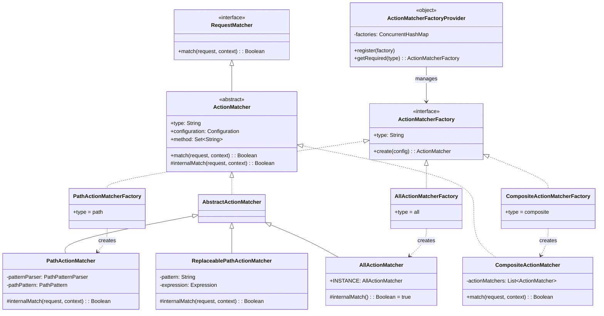
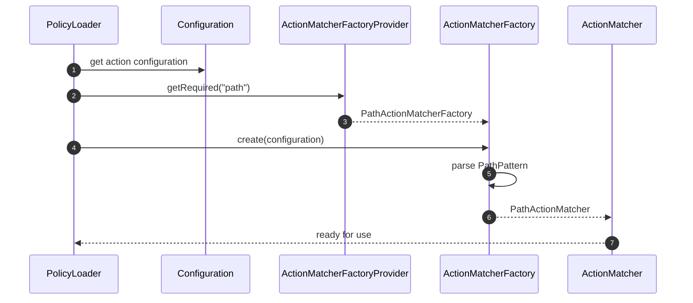
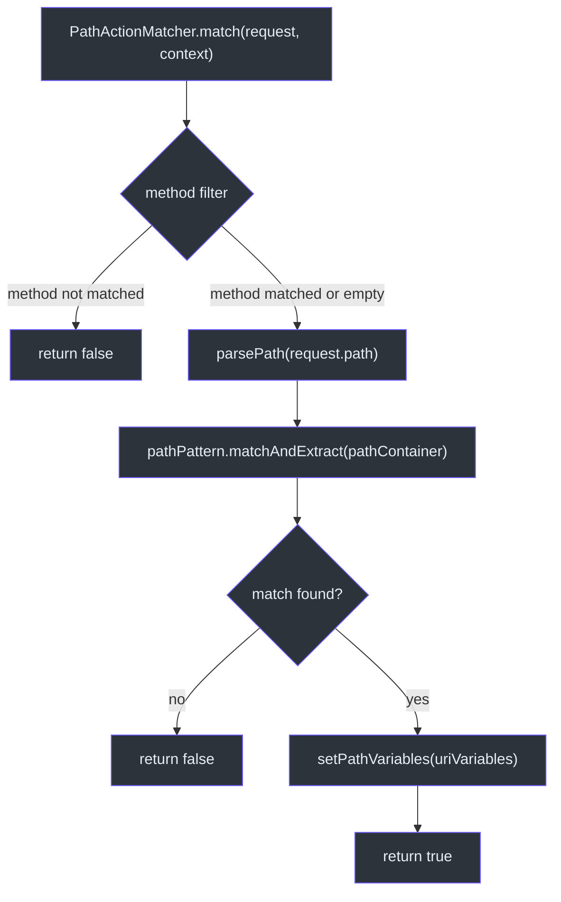

# Action Matchers

Action matchers determine whether an incoming request matches the action pattern defined in a policy statement. CoSec provides three built-in matcher types and an SPI (Service Provider Interface) for custom implementations. All action matchers are resolved at policy load time via the `ActionMatcherFactory` SPI.

## ActionMatcher Interface

[ActionMatcher](cosec-api/src/main/kotlin/me/ahoo/cosec/api/policy/ActionMatcher.kt) extends `RequestMatcher`:

```kotlin
interface ActionMatcher : RequestMatcher
```

The `RequestMatcher` interface defines:

```kotlin
fun match(request: Request, securityContext: SecurityContext): Boolean
```

## Built-In Action Matchers

### PathActionMatcher

[PathActionMatcher](cosec-core/src/main/kotlin/me/ahoo/cosec/policy/action/PathActionMatcher.kt) uses Spring's `PathPattern` for URL pattern matching with path variable extraction:

```kotlin
class PathActionMatcher(
    private val patternParser: PathPatternParser,
    private val pathPattern: PathPattern,
    configuration: Configuration
) : AbstractActionMatcher(PathActionMatcherFactory.TYPE, configuration)
```

When a match succeeds, extracted path variables are automatically stored in the `SecurityContext`:

```kotlin
val pathMatchInfo = pathPattern.matchAndExtract(pathContainer) ?: return false
securityContext.setPathVariables(pathMatchInfo.uriVariables)
```

This makes path variables available to condition matchers via the `request.path.var.xxx` part extractor.

#### AbstractActionMatcher

[AbstractActionMatcher](cosec-core/src/main/kotlin/me/ahoo/cosec/policy/action/AbstractActionMatcher.kt) adds HTTP method filtering:

```kotlin
abstract class AbstractActionMatcher(
    override val type: String,
    final override val configuration: Configuration
) : ActionMatcher {
    val method: Set<String> = configuration.asMethod()
    override fun match(request, securityContext): Boolean {
        if (method.isNotEmpty() && !method.contains(request.method.uppercase())) return false
        return internalMatch(request, securityContext)
    }
}
```

The `method` configuration key accepts a single method (`"GET"`) or a list (`["GET", "POST"]`).

### AllActionMatcher

[AllActionMatcher](cosec-core/src/main/kotlin/me/ahoo/cosec/policy/action/AllActionMatcher.kt) matches every request:

```kotlin
override fun internalMatch(request: Request, securityContext: SecurityContext): Boolean = true
```

Triggered by the wildcard `"*"` pattern.

### CompositeActionMatcher

[CompositeActionMatcher](cosec-core/src/main/kotlin/me/ahoo/cosec/policy/action/CompositeActionMatcher.kt) combines multiple matchers using OR logic:

```kotlin
override fun match(request: Request, securityContext: SecurityContext): Boolean =
    actionMatchers.any { it.match(request, securityContext) }
```

Created automatically when a policy action defines multiple path patterns.

### ReplaceablePathActionMatcher

[ReplaceablePathActionMatcher](cosec-core/src/main/kotlin/me/ahoo/cosec/policy/action/PathActionMatcher.kt) supports SpEL template expressions in path patterns:

```kotlin
class ReplaceablePathActionMatcher(
    private val patternParser: PathPatternParser,
    private val pattern: String,
    configuration: Configuration
) : AbstractActionMatcher(PathActionMatcherFactory.TYPE, configuration)
```

When the pattern contains SpEL templates (e.g., `"#{context.principal.attributes.customPath}"`), the pattern is resolved at runtime from the security context, enabling dynamic path patterns per user or tenant.

## SPI: ActionMatcherFactory

[ActionMatcherFactory](cosec-core/src/main/kotlin/me/ahoo/cosec/policy/action/ActionMatcherFactory.kt) is the SPI interface for creating matchers:

```kotlin
interface ActionMatcherFactory {
    val type: String
    fun create(configuration: Configuration): ActionMatcher
}
```

### ActionMatcherFactoryProvider

[ActionMatcherFactoryProvider](cosec-core/src/main/kotlin/me/ahoo/cosec/policy/action/ActionMatcherFactoryProvider.kt) discovers factories via Java SPI (`ServiceLoader`):

```kotlin
object ActionMatcherFactoryProvider {
    init {
        ServiceLoader.load(ActionMatcherFactory::class.java)
            .forEach { register(it) }
    }
}
```

Built-in factories are registered in `META-INF/services/me.ahoo.cosec.policy.action.ActionMatcherFactory`:

| Factory | Type | Matcher |
|---------|------|---------|
| `PathActionMatcherFactory` | `"path"` | URL pattern matching |
| `AllActionMatcherFactory` | `"all"` | Wildcard matching |
| `CompositeActionMatcherFactory` | `"composite"` | OR combination |

### Registering Custom Matchers

1. Implement `ActionMatcherFactory` with a unique `type` string
2. Create the file `META-INF/services/me.ahoo.cosec.policy.action.ActionMatcherFactory`
3. Add the fully qualified class name of your factory

## Architecture Diagrams

### Action Matcher Class Hierarchy



### Factory SPI Resolution Sequence



### Path Matching with Variable Extraction



## Policy JSON Examples

### Single path pattern

```json
{
  "action": {
    "path": {
      "pattern": "/api/users/**",
      "method": ["GET", "POST"]
    }
  }
}
```

### Multiple path patterns (CompositeActionMatcher)

```json
{
  "action": {
    "path": {
      "pattern": ["/api/users/**", "/api/admin/**"]
    }
  }
}
```

### Wildcard (AllActionMatcher)

```json
{
  "action": "*"
}
```

## References

- [PathActionMatcher.kt:42](https://github.com/Ahoo-Wang/CoSec/blob/main/cosec-core/src/main/kotlin/me/ahoo/cosec/policy/action/PathActionMatcher.kt#L42) - Path-based action matching with variable extraction
- [AllActionMatcher.kt:30](https://github.com/Ahoo-Wang/CoSec/blob/main/cosec-core/src/main/kotlin/me/ahoo/cosec/policy/action/AllActionMatcher.kt#L30) - Wildcard matcher
- [CompositeActionMatcher.kt:32](https://github.com/Ahoo-Wang/CoSec/blob/main/cosec-core/src/main/kotlin/me/ahoo/cosec/policy/action/CompositeActionMatcher.kt#L32) - OR-combined matcher
- [ActionMatcherFactory.kt:30](https://github.com/Ahoo-Wang/CoSec/blob/main/cosec-core/src/main/kotlin/me/ahoo/cosec/policy/action/ActionMatcherFactory.kt#L30) - Factory SPI interface
- [ActionMatcherFactoryProvider.kt:20](https://github.com/Ahoo-Wang/CoSec/blob/main/cosec-core/src/main/kotlin/me/ahoo/cosec/policy/action/ActionMatcherFactoryProvider.kt#L20) - SPI provider with ServiceLoader

## Related Pages

- [Policy Evaluation](./policy-evaluation.md) - How action matchers are used in statement verification
- [Condition Matchers](./condition-matchers.md) - Condition evaluation after action matching
- [Authorization Flow](./authorization-flow.md) - Full authorization pipeline
- [Permissions and Roles](./permissions-roles.md) - Permission-level action matching
