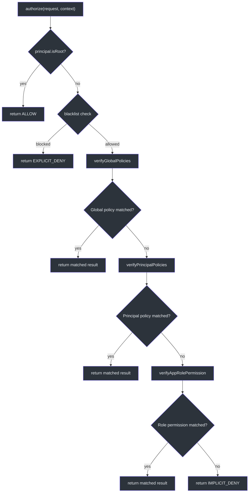
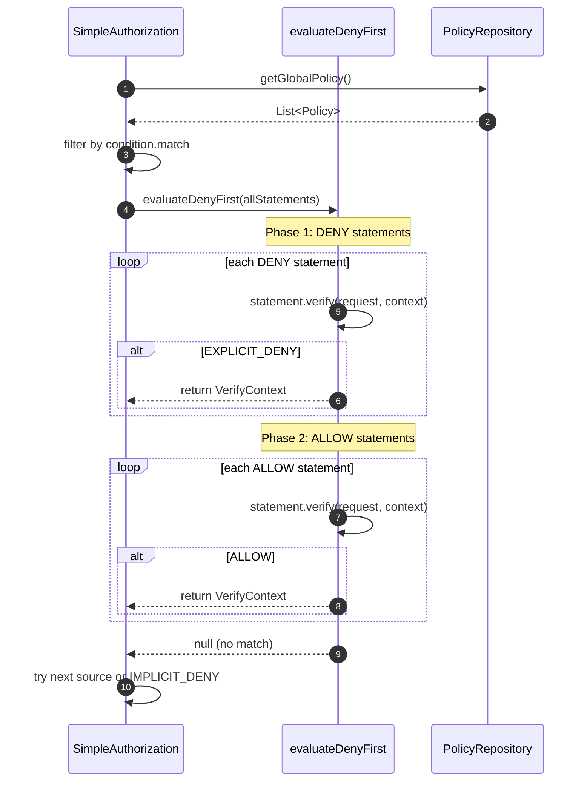
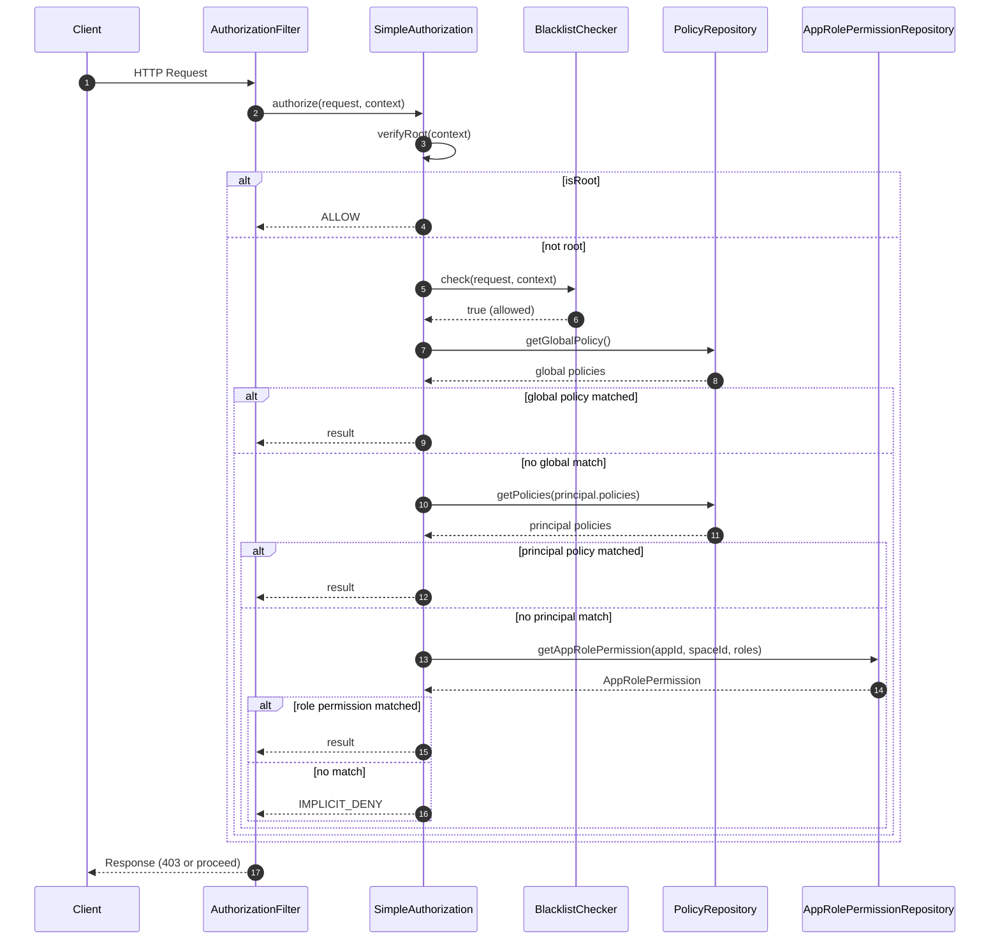

# Authorization Flow

CoSec's authorization is implemented by [SimpleAuthorization](cosec-core/src/main/kotlin/me/ahoo/cosec/authorization/SimpleAuthorization.kt), which follows an AWS IAM-inspired **deny-first** evaluation strategy. The pipeline checks multiple authorization sources in a defined priority order, returning the first decisive result or falling back to implicit deny.

## Authorization Algorithm

The full authorization algorithm proceeds through these steps:

### Step 1: Root User Check

If the principal has `isRoot == true`, authorization immediately returns `ALLOW`. Root users bypass all policy and permission checks.

### Step 2: Blacklist Check

[BlacklistChecker](cosec-core/src/main/kotlin/me/ahoo/cosec/blacklist/BlacklistChecker.kt) checks whether the request is blocked (e.g., by IP or user ID). If blocked, returns `EXPLICIT_DENY` immediately. The default `NoOp` implementation always allows.

### Step 3: Global Policies

Global policies (type `GLOBAL`) are fetched from the `PolicyRepository`. These apply to all applications and all principals. Policies are evaluated using the deny-first strategy.

### Step 4: Principal-Specific Policies

Policies explicitly assigned to the principal (via `principal.policies`) are evaluated next. These allow individual users to carry custom policy grants.

### Step 5: Role-Based App Permissions

App-specific permissions are evaluated using the principal's roles. The `AppRolePermissionRepository` fetches role-permission mappings for the requested `appId` and `spaceId`.

### Step 6: Implicit Deny

If no policy or permission matches, the result is `IMPLICIT_DENY` -- the default behavior for unmatched requests.

## Deny-First Evaluation

The `evaluateDenyFirst` algorithm is the core of CoSec's authorization logic:

```kotlin
private inline fun <T> evaluateDenyFirst(
    items: Sequence<T>,
    crossinline effectExtractor: (T) -> Effect,
    crossinline verifyItem: (T) -> VerifyResult,
    crossinline onMatch: (T, VerifyResult) -> VerifyContext
): VerifyContext? {
    // Phase 1: Check ALL DENY statements first
    items.filter { effectExtractor(it) == Effect.DENY }.forEach { item ->
        val result = verifyItem(item)
        if (result == VerifyResult.EXPLICIT_DENY) {
            return onMatch(item, result)
        }
    }
    // Phase 2: Then check ALLOW statements
    items.filter { effectExtractor(it) == Effect.ALLOW }.forEach { item ->
        val result = verifyItem(item)
        if (result == VerifyResult.ALLOW) {
            return onMatch(item, result)
        }
    }
    return null
}
```

This ensures that **explicit deny always takes precedence over allow**, matching the AWS IAM evaluation model.

## AuthorizeResult Types

[AuthorizeResult](cosec-api/src/main/kotlin/me/ahoo/cosec/api/authorization/AuthorizeResult.kt) defines the possible outcomes:

| Result | `authorized` | Description |
|--------|-------------|-------------|
| `ALLOW` | `true` | Request is permitted |
| `EXPLICIT_DENY` | `false` | Blocked by an explicit deny statement or blacklist |
| `IMPLICIT_DENY` | `false` | No matching policy -- default deny |
| `TOKEN_EXPIRED` | `false` | JWT token has expired |
| `TOO_MANY_REQUESTS` | `false` | Rate limit exceeded |

## VerifyContext

When a policy or permission matches, a [VerifyContext](cosec-core/src/main/kotlin/me/ahoo/cosec/authorization/PolicyVerifyContext.kt) is stored in the `SecurityContext` attributes. This provides audit information:

- **`PolicyVerifyContext`**: Which policy, statement index, and statement matched
- **`RoleVerifyContext`**: Which role and permission matched

## Architecture Diagrams

### Authorization Pipeline Flowchart



### Deny-First Evaluation Sequence



### Full Authorization Request Sequence



## Reactive Chain

The authorization pipeline uses Reactor's `switchIfEmpty` to chain sources:

```kotlin
verifyGlobalPolicies(request, context)
    .switchIfEmpty { verifyPrincipalPolicies(request, context) }
    .switchIfEmpty { verifyAppRolePermission(request, context) }
    .map { context.setVerifyContext(it); it.result.toAuthorizeResult() }
    .switchIfEmpty { AuthorizeResult.IMPLICIT_DENY.toMono() }
```

Each source returns `Mono.empty()` when no match is found, causing the chain to proceed to the next source. This keeps the entire flow non-blocking.

## References

- [SimpleAuthorization.kt:48](https://github.com/Ahoo-Wang/CoSec/blob/main/cosec-core/src/main/kotlin/me/ahoo/cosec/authorization/SimpleAuthorization.kt#L48) - Full authorization implementation
- [Authorization.kt:35](https://github.com/Ahoo-Wang/CoSec/blob/main/cosec-api/src/main/kotlin/me/ahoo/cosec/api/authorization/Authorization.kt#L35) - Authorization interface
- [AuthorizeResult.kt:25](https://github.com/Ahoo-Wang/CoSec/blob/main/cosec-api/src/main/kotlin/me/ahoo/cosec/api/authorization/AuthorizeResult.kt#L25) - Result types (ALLOW, EXPLICIT_DENY, IMPLICIT_DENY)
- [BlacklistChecker.kt:29](https://github.com/Ahoo-Wang/CoSec/blob/main/cosec-core/src/main/kotlin/me/ahoo/cosec/blacklist/BlacklistChecker.kt#L29) - Blacklist checking interface
- [PolicyVerifyContext.kt:31](https://github.com/Ahoo-Wang/CoSec/blob/main/cosec-core/src/main/kotlin/me/ahoo/cosec/authorization/PolicyVerifyContext.kt#L31) - Verification context types

## Related Pages

- [Policy Evaluation](./policy-evaluation.md) - How individual policies and statements are verified
- [Action Matchers](./action-matchers.md) - How request actions are matched
- [Condition Matchers](./condition-matchers.md) - How request conditions are evaluated
- [Permissions and Roles](./permissions-roles.md) - Role-based permission evaluation
