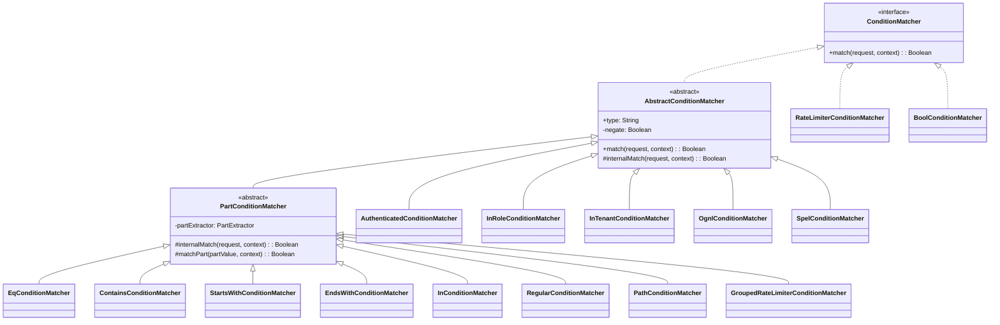
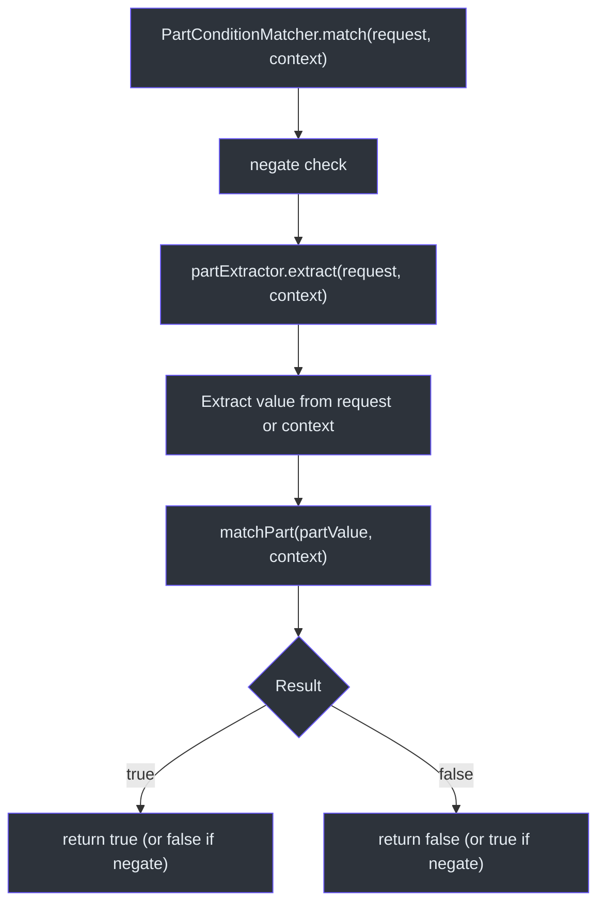
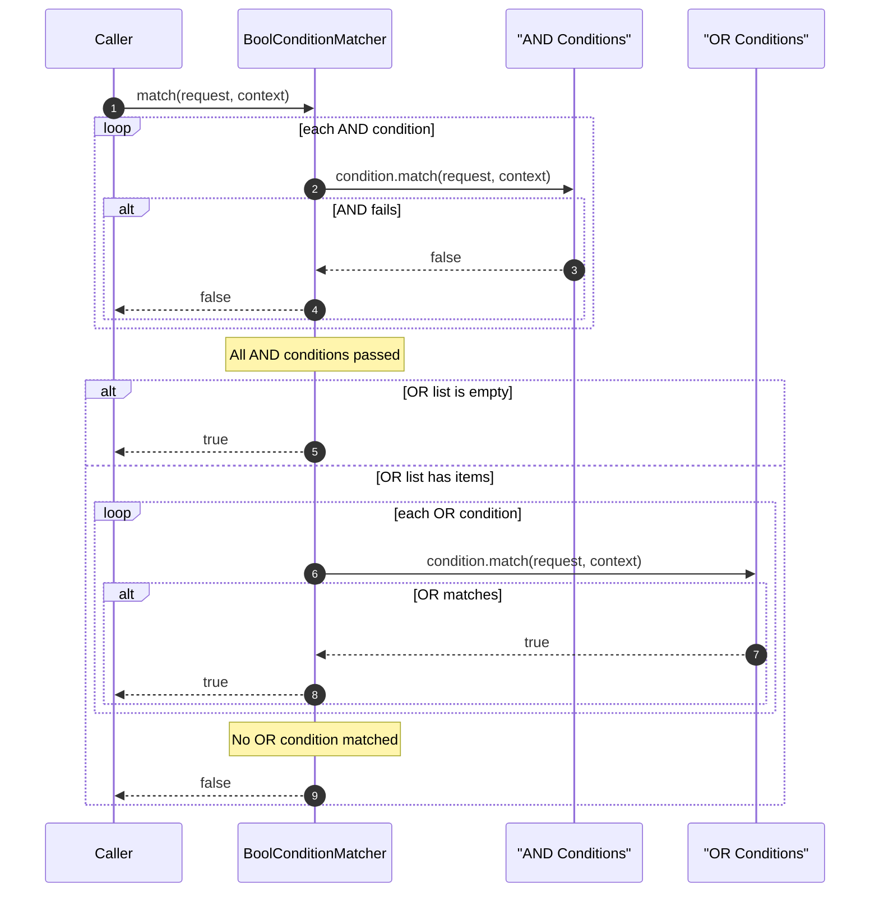

# Condition Matchers

Condition matchers add fine-grained control to policy and statement evaluation. While action matchers determine *what* request is being made, condition matchers determine *when* a rule should apply based on request properties, security context, rate limits, or custom expressions.

## ConditionMatcher Interface

[ConditionMatcher](cosec-api/src/main/kotlin/me/ahoo/cosec/api/policy/ConditionMatcher.kt) extends `RequestMatcher`:

```kotlin
interface ConditionMatcher : RequestMatcher
```

## AbstractConditionMatcher

[AbstractConditionMatcher](cosec-core/src/main/kotlin/me/ahoo/cosec/policy/condition/AbstractConditionMatcher.kt) provides a `negate` option and template method pattern:

```kotlin
abstract class AbstractConditionMatcher(
    final override val type: String,
    final override val configuration: Configuration
) : ConditionMatcher {
    private val negate: Boolean = configuration.get("negate")?.asBoolean() ?: false

    override fun match(request, securityContext): Boolean {
        val match = internalMatch(request, securityContext)
        return if (negate) !match else match
    }
}
```

Any condition can be inverted by setting `"negate": true` in its configuration.

## PartExtractor Framework

Many condition matchers share a common pattern: extract a value from the request or security context, then compare it. The [PartExtractor](cosec-core/src/main/kotlin/me/ahoo/cosec/policy/condition/part/PartExtractor.kt) framework formalizes this:

```kotlin
fun interface PartExtractor {
    fun extract(request: Request, securityContext: SecurityContext): String
}
```

### Part Identifiers

`DefaultPartExtractor` supports these part identifiers:

**Request Parts** (prefix `request.`):

| Part | Description |
|------|-------------|
| `request.path` | Request URL path |
| `request.method` | HTTP method |
| `request.appId` | Application ID |
| `request.spaceId` | Space ID |
| `request.deviceId` | Device ID |
| `request.remoteIp` | Client IP address |
| `request.origin` | Origin header URI |
| `request.origin.host` | Origin host |
| `request.referer` | Referer header URI |
| `request.referer.host` | Referer host |
| `request.header.{key}` | Request header value |
| `request.attributes.{key}` | Request attribute |
| `request.path.var.{key}` | Path variable (set by PathActionMatcher) |

**Security Context Parts** (prefix `context.`):

| Part | Description |
|------|-------------|
| `context.tenantId` | Current tenant ID |
| `context.principal.id` | Principal user ID |
| `context.principal.attributes.{key}` | Principal attribute value |

## Condition Matcher Types

### Path-Based Matchers

All path-based matchers extend [PartConditionMatcher](cosec-core/src/main/kotlin/me/ahoo/cosec/policy/condition/part/PartConditionMatcher.kt) and operate on an extracted string value:

| Matcher | Type Key | Description |
|---------|----------|-------------|
| [EqConditionMatcher](cosec-core/src/main/kotlin/me/ahoo/cosec/policy/condition/part/EqConditionMatcher.kt) | `eq` | Equality check (supports template expressions and `ignoreCase`) |
| [ContainsConditionMatcher](cosec-core/src/main/kotlin/me/ahoo/cosec/policy/condition/part/ContainsConditionMatcher.kt) | `contains` | Substring containment check |
| [StartsWithConditionMatcher](cosec-core/src/main/kotlin/me/ahoo/cosec/policy/condition/part/StartsWithConditionMatcher.kt) | `startsWith` | Prefix check |
| [EndsWithConditionMatcher](cosec-core/src/main/kotlin/me/ahoo/cosec/policy/condition/part/EndsWithConditionMatcher.kt) | `endsWith` | Suffix check |
| [InConditionMatcher](cosec-core/src/main/kotlin/me/ahoo/cosec/policy/condition/part/InConditionMatcher.kt) | `in` | Set membership check |
| [RegularConditionMatcher](cosec-core/src/main/kotlin/me/ahoo/cosec/policy/condition/part/RegularConditionMatcher.kt) | `regular` | Regex pattern match |
| [PathConditionMatcher](cosec-core/src/main/kotlin/me/ahoo/cosec/policy/condition/part/PathConditionMatcher.kt) | `path` | Spring PathPattern match |

### Context-Based Matchers

These inspect the security context directly:

| Matcher | Type Key | Description |
|---------|----------|-------------|
| [AuthenticatedConditionMatcher](cosec-core/src/main/kotlin/me/ahoo/cosec/policy/condition/context/AuthenticatedConditionMatcher.kt) | `authenticated` | Checks `securityContext.principal.authenticated` |
| [InRoleConditionMatcher](cosec-core/src/main/kotlin/me/ahoo/cosec/policy/condition/context/InRoleConditionMatcher.kt) | `inRole` | Checks if principal has a specific role |
| [InTenantConditionMatcher](cosec-core/src/main/kotlin/me/ahoo/cosec/policy/condition/context/InTenantConditionMatcher.kt) | `inTenant` | Checks tenant type (DEFAULT, USER, PLATFORM) |

### Rate Limiters

| Matcher | Type Key | Description |
|---------|----------|-------------|
| [RateLimiterConditionMatcher](cosec-core/src/main/kotlin/me/ahoo/cosec/policy/condition/limiter/RateLimiterConditionMatcher.kt) | `rateLimiter` | Global rate limiting using Guava `RateLimiter` |
| [GroupedRateLimiterConditionMatcher](cosec-core/src/main/kotlin/me/ahoo/cosec/policy/condition/limiter/GroupedRateLimiterConditionMatcher.kt) | `groupedRateLimiter` | Per-group rate limiting (e.g., per-user, per-IP) |

`RateLimiterConditionMatcher` creates a single rate limiter shared across all requests. `GroupedRateLimiterConditionMatcher` creates a `LoadingCache` of rate limiters keyed by the extracted part value, with automatic expiration after access.

When a rate limit is exceeded, `TooManyRequestsException` is thrown, which the authorization layer catches and converts to `AuthorizeResult.TOO_MANY_REQUESTS`.

### Expression-Based Matchers

| Matcher | Type Key | Description |
|---------|----------|-------------|
| [OgnlConditionMatcher](cosec-core/src/main/kotlin/me/ahoo/cosec/policy/condition/OgnlConditionMatcher.kt) | `ognl` | OGNL expression evaluation |
| [SpelConditionMatcher](cosec-core/src/main/kotlin/me/ahoo/cosec/policy/condition/SpelConditionMatcher.kt) | `spel` | Spring Expression Language evaluation |

Both provide access to `request` and `context` objects in their expression root, enabling arbitrarily complex conditions.

### Boolean Combinators

[BoolConditionMatcher](cosec-core/src/main/kotlin/me/ahoo/cosec/policy/condition/BoolConditionMatcher.kt) combines multiple conditions with AND/OR logic:

```kotlin
class BoolConditionMatcher(configuration: Configuration) {
    val and: List<ConditionMatcher>
    val or: List<ConditionMatcher>
}
```

- **AND**: All conditions in the `and` list must match. If any fails, the result is false.
- **OR**: At least one condition in the `or` list must match. If none match, the result is false.
- When only `and` is present (no `or`), returns true after all AND conditions pass.

## SPI: ConditionMatcherFactory

[ConditionMatcherFactory](cosec-core/src/main/kotlin/me/ahoo/cosec/policy/condition/ConditionMatcherFactory.kt) is the SPI interface:

```kotlin
interface ConditionMatcherFactory {
    val type: String
    fun create(configuration: Configuration): ConditionMatcher
}
```

Custom condition matchers are registered via `META-INF/services/me.ahoo.cosec.policy.condition.ConditionMatcherFactory`.

## Architecture Diagrams

### Condition Matcher Class Hierarchy



### Part-Based Condition Evaluation Flow



### Boolean Combinator Evaluation



## Policy JSON Examples

### Path-based condition

```json
{
  "condition": {
    "eq": {
      "part": "request.path",
      "value": "/api/admin"
    }
  }
}
```

### Rate limiter (per-user)

```json
{
  "condition": {
    "groupedRateLimiter": {
      "part": "context.principal.id",
      "permitsPerSecond": 10.0,
      "expireAfterAccessSecond": 60
    }
  }
}
```

### Boolean combination

```json
{
  "condition": {
    "bool": {
      "and": [
        { "authenticated": {} },
        { "inRole": { "value": "admin" } }
      ],
      "or": [
        { "eq": { "part": "request.method", "value": "GET" } },
        { "startsWith": { "part": "request.path", "value": "/api/public" } }
      ]
    }
  }
}
```

## References

- [ConditionMatcherFactory.kt:30](https://github.com/Ahoo-Wang/CoSec/blob/main/cosec-core/src/main/kotlin/me/ahoo/cosec/policy/condition/ConditionMatcherFactory.kt#L30) - Factory SPI interface
- [PartExtractor.kt:22](https://github.com/Ahoo-Wang/CoSec/blob/main/cosec-core/src/main/kotlin/me/ahoo/cosec/policy/condition/part/PartExtractor.kt#L22) - Part extraction framework
- [PartConditionMatcher.kt:21](https://github.com/Ahoo-Wang/CoSec/blob/main/cosec-core/src/main/kotlin/me/ahoo/cosec/policy/condition/part/PartConditionMatcher.kt#L21) - Abstract part-based matcher
- [BoolConditionMatcher.kt:35](https://github.com/Ahoo-Wang/CoSec/blob/main/cosec-core/src/main/kotlin/me/ahoo/cosec/policy/condition/BoolConditionMatcher.kt#L35) - AND/OR combinator
- [AbstractConditionMatcher.kt:23](https://github.com/Ahoo-Wang/CoSec/blob/main/cosec-core/src/main/kotlin/me/ahoo/cosec/policy/condition/AbstractConditionMatcher.kt#L23) - Base class with negate support

## Related Pages

- [Action Matchers](./action-matchers.md) - Action pattern matching in statements
- [Policy Evaluation](./policy-evaluation.md) - How conditions gate policy verification
- [Authorization Flow](./authorization-flow.md) - Full authorization pipeline
- [Permissions and Roles](./permissions-roles.md) - Role-based permission conditions
