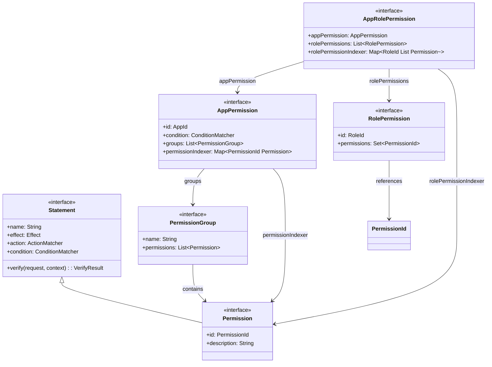
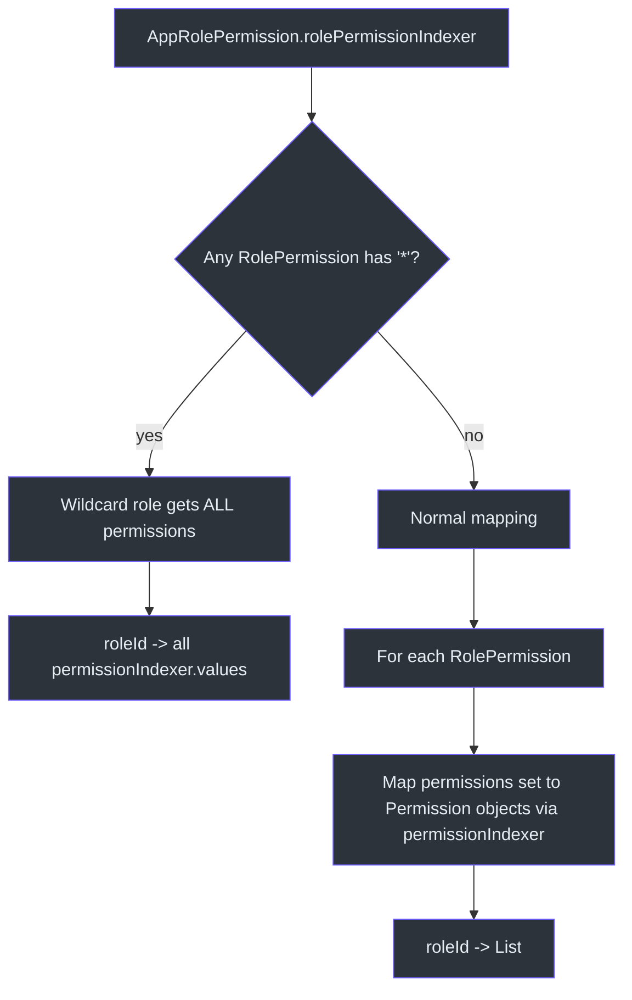
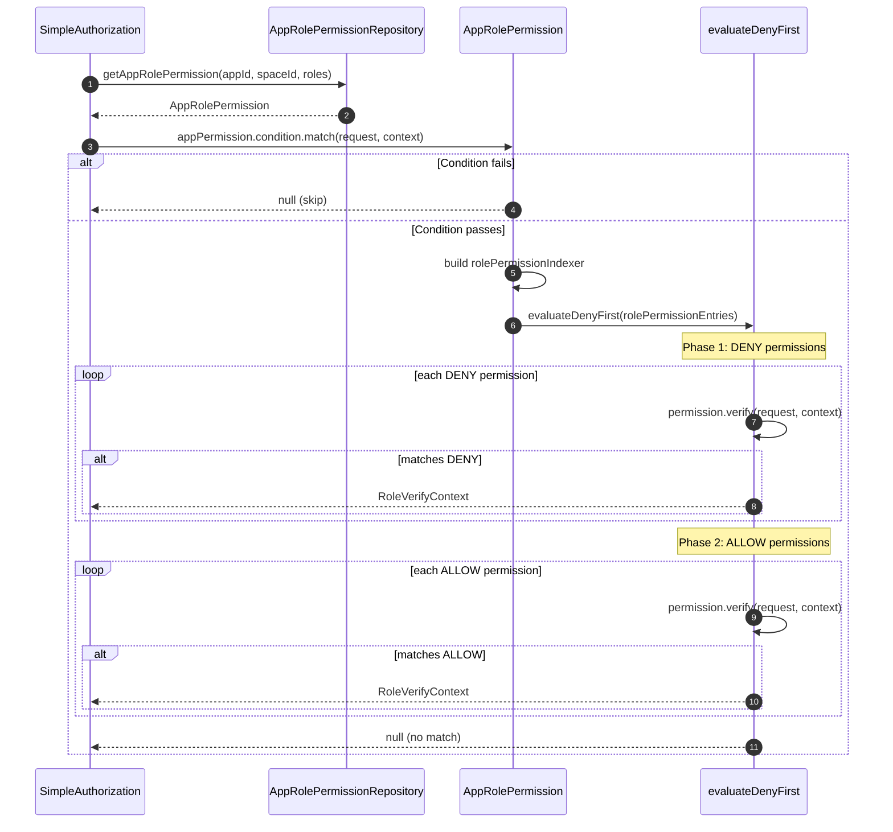

# Permissions and Roles

CoSec implements role-based access control (RBAC) through a layered permission model. Permissions are app-scoped, organized into groups, and assigned to roles. The `AppRolePermission` interface ties it all together by mapping roles to their permitted actions within an application.

## Permission Model

### Permission

[Permission](cosec-api/src/main/kotlin/me/ahoo/cosec/api/permission/Permission.kt) extends `Statement` with identity and description:

```kotlin
interface Permission : Statement {
    val id: PermissionId       // format: "appId.group.permission"
    val description: String
}
```

Because `Permission` extends `Statement`, each permission carries its own `effect` (ALLOW/DENY), `action` matcher, and `condition` matcher. This means individual permissions can target specific API endpoints with their own conditions.

### PermissionGroup

Permissions are organized into groups (e.g., "read", "write", "admin") via `PermissionGroup`, which holds a list of `Permission` instances.

### AppPermission

[AppPermission](cosec-api/src/main/kotlin/me/ahoo/cosec/api/permission/AppPermission.kt) represents the full permission set for a single application:

```kotlin
interface AppPermission {
    val id: AppId                              // application identifier
    val condition: ConditionMatcher            // app-level condition gate
    val groups: List<PermissionGroup>          // grouped permissions
    val permissionIndexer: Map<PermissionId, Permission>  // computed index
}
```

The `permissionIndexer` is a computed property that flattens all groups into a single map keyed by permission ID, enabling O(1) lookup.

## Role-Based Permissions

### RolePermission

[RolePermission](cosec-api/src/main/kotlin/me/ahoo/cosec/api/permission/RolePermission.kt) maps a role to a set of permission IDs:

```kotlin
interface RolePermission {
    val id: RoleId                // role identifier
    val permissions: Set<PermissionId>  // assigned permission IDs
}
```

### AppRolePermission

[AppRolePermission](cosec-api/src/main/kotlin/me/ahoo/cosec/api/permission/AppRolePermission.kt) combines an `AppPermission` with role assignments:

```kotlin
interface AppRolePermission {
    val appPermission: AppPermission
    val rolePermissions: List<RolePermission>
    val rolePermissionIndexer: Map<RoleId, List<Permission>>
}
```

The `rolePermissionIndexer` performs the join between roles and permissions:

```kotlin
val rolePermissionIndexer: Map<RoleId, List<Permission>>
    get() {
        // Check for wildcard first
        rolePermissions.forEach {
            if (it.permissions.contains(ALL_PERMISSION_ID)) {
                return mapOf(it.id to appPermission.permissionIndexer.values.toList())
            }
        }
        // Normal mapping
        return rolePermissions.associate {
            it.id to it.permissions.mapNotNull { permId ->
                appPermission.permissionIndexer[permId]
            }
        }
    }
```

### Wildcard Permission

The constant `ALL_PERMISSION_ID = "*"` grants **all permissions** in the application to a role. When any `RolePermission` has `"*"` in its permissions set, that role's indexer entry includes every permission from the `AppPermission`.

## Role-Based Evaluation in Authorization

During authorization (see [Authorization Flow](./authorization-flow.md)), `SimpleAuthorization.verifyAppRolePermission`:

1. Checks `appRolePermission.appPermission.condition.match(request, context)` -- app-level gate
2. Flattens all role-permission entries into a sequence
3. Applies the deny-first algorithm to evaluate permissions

Each role maps to its set of resolved `Permission` objects, which are themselves `Statement` instances with their own action and condition matchers.

## Load-Time Validation

### DefaultAppPermissionEvaluator

[DefaultAppPermissionEvaluator](cosec-core/src/main/kotlin/me/ahoo/cosec/permission/DefaultAppPermissionEvaluator.kt) validates `AppPermission` at load time:

```kotlin
object DefaultAppPermissionEvaluator : AppPermissionEvaluator {
    override fun evaluate(appPermission: AppPermission) {
        val evaluateRequest = EvaluateRequest()
        val mockContext = SimpleSecurityContext(SimpleTenantPrincipal.ANONYMOUS)
        // Validate app-level condition
        safeEvaluate { appPermission.condition.match(evaluateRequest, mockContext) }
        // Validate each permission
        appPermission.permissionIndexer.values.forEach { permission ->
            safeEvaluate { permission.condition.match(evaluateRequest, mockContext) }
            safeEvaluate { permission.action.match(evaluateRequest, mockContext) }
            safeEvaluate { permission.verify(evaluateRequest, mockContext) }
        }
    }
}
```

This mirrors the `DefaultPolicyEvaluator` pattern for policies, catching misconfigurations at deployment time.

## Architecture Diagrams

### Permission Model Class Diagram



### Role-Permission Indexing



### Role-Based Authorization Sequence



## Permission ID Convention

Permission IDs follow the format `appId.group.permission`:

| Example | Description |
|---------|-------------|
| `order.read` | Read orders |
| `order.write` | Create/update orders |
| `admin.users.delete` | Delete users in admin app |
| `*` | Wildcard - all permissions |

This naming convention enables hierarchical organization and readable audit logs.

## References

- [Permission.kt:33](https://github.com/Ahoo-Wang/CoSec/blob/main/cosec-api/src/main/kotlin/me/ahoo/cosec/api/permission/Permission.kt#L33) - Permission interface extending Statement
- [AppPermission.kt:19](https://github.com/Ahoo-Wang/CoSec/blob/main/cosec-api/src/main/kotlin/me/ahoo/cosec/api/permission/AppPermission.kt#L19) - Application-level permission container
- [RolePermission.kt:28](https://github.com/Ahoo-Wang/CoSec/blob/main/cosec-api/src/main/kotlin/me/ahoo/cosec/api/permission/RolePermission.kt#L28) - Role-to-permission mapping
- [AppRolePermission.kt:16](https://github.com/Ahoo-Wang/CoSec/blob/main/cosec-api/src/main/kotlin/me/ahoo/cosec/api/permission/AppRolePermission.kt#L16) - Combined app + role permission with indexer
- [DefaultAppPermissionEvaluator.kt:23](https://github.com/Ahoo-Wang/CoSec/blob/main/cosec-core/src/main/kotlin/me/ahoo/cosec/permission/DefaultAppPermissionEvaluator.kt#L23) - Load-time validation

## Related Pages

- [Authorization Flow](./authorization-flow.md) - How role-based permissions fit in the authorization pipeline
- [Policy Evaluation](./policy-evaluation.md) - Policy-level evaluation (parallel to permission evaluation)
- [Action Matchers](./action-matchers.md) - Action patterns used in permissions
- [Condition Matchers](./condition-matchers.md) - Conditions used in permissions
