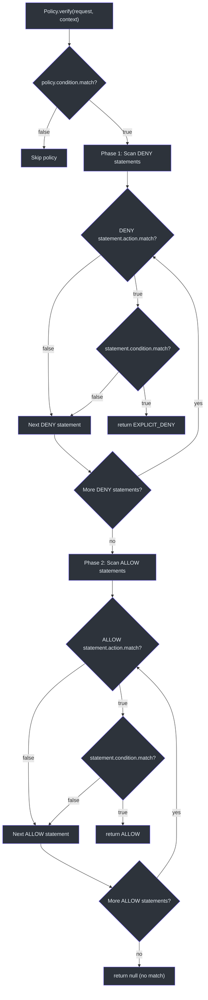
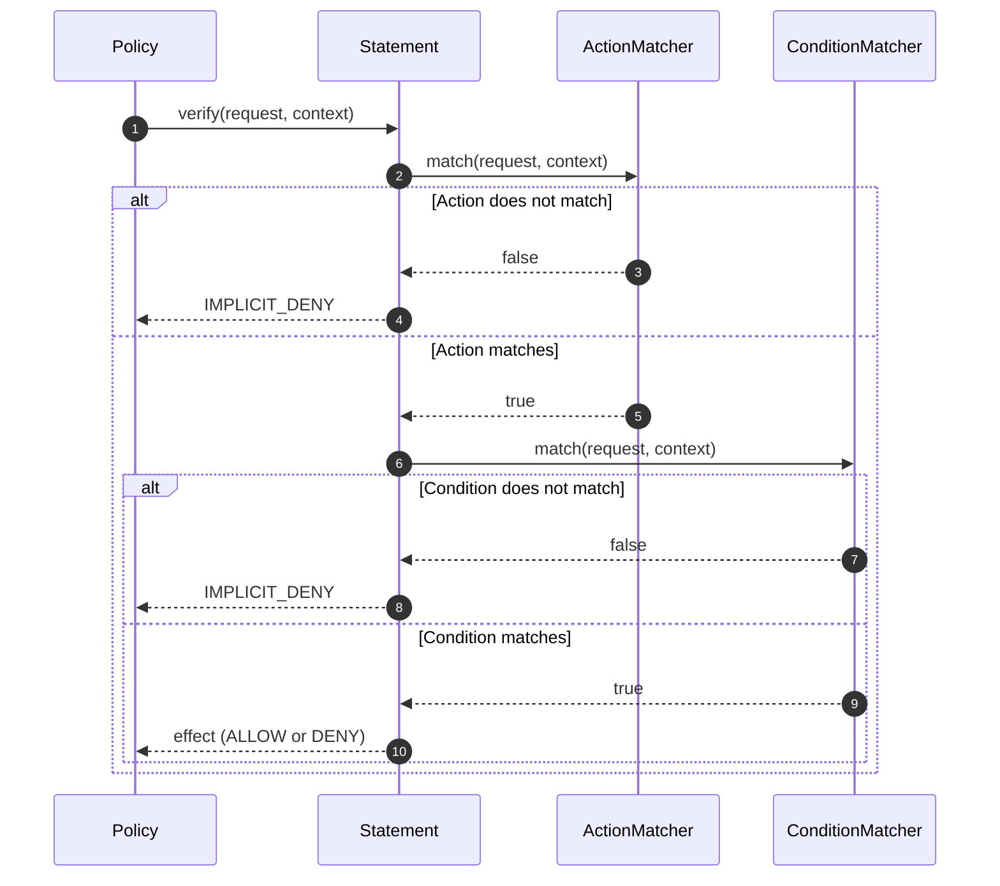
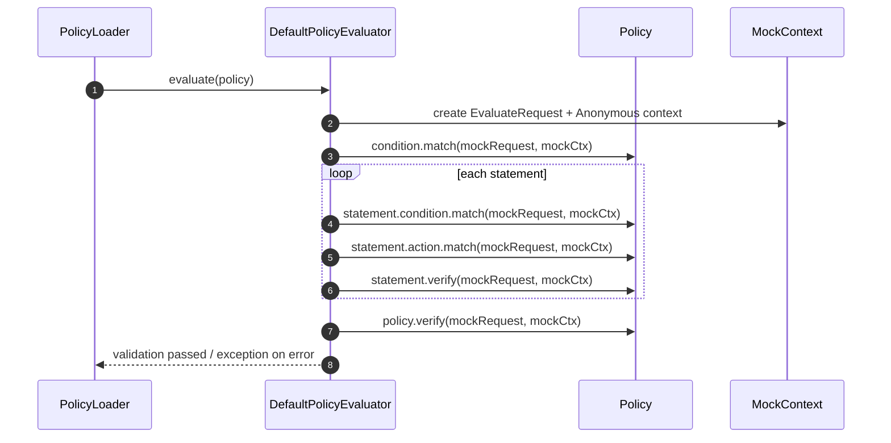

# Policy Evaluation

Policies are the core abstraction for defining authorization rules in CoSec. A policy contains a collection of statements, each with an action matcher and optional condition. The evaluation follows a strict order: condition check first, then deny-first across all matching statements.

## Policy Structure

### PolicyData

[PolicyData](cosec-core/src/main/kotlin/me/ahoo/cosec/policy/PolicyData.kt) is the concrete implementation of the `Policy` interface:

```kotlin
class PolicyData(
    override val id: String,
    override val category: String,
    override val name: String,
    override val description: String,
    override val type: PolicyType,       // GLOBAL or APP
    override val tenantId: String,
    override val condition: ConditionMatcher = AllConditionMatcher.INSTANCE,
    override val statements: List<Statement> = listOf()
) : Policy
```

Key properties:

- **`id`**: Unique policy identifier
- **`type`**: `GLOBAL` (applies to all apps) or `APP` (app-scoped)
- **`tenantId`**: Tenant scope -- policies are tenant-scoped
- **`condition`**: A top-level condition that must match before any statement is evaluated
- **`statements`**: Ordered list of permission rules

### StatementData

[StatementData](cosec-core/src/main/kotlin/me/ahoo/cosec/policy/StatementData.kt) represents a single rule:

```kotlin
data class StatementData(
    override val name: String = "",
    override val effect: Effect = Effect.ALLOW,
    override val action: ActionMatcher,
    override val condition: ConditionMatcher = AllConditionMatcher.INSTANCE
) : Statement
```

- **`effect`**: `ALLOW` or `DENY` -- determines the outcome when this statement matches
- **`action`**: Matches the request (e.g., path pattern). See [Action Matchers](./action-matchers.md)
- **`condition`**: Additional condition that must be met. Defaults to `AllConditionMatcher` (always matches)

## Policy Verification Algorithm

### Policy-Level Verification

When a policy is evaluated against a request, the process follows this sequence:

1. **Policy condition check**: `policy.condition.match(request, securityContext)` -- if false, the entire policy is skipped
2. **Deny-first statement scan**: All `DENY` statements are checked first; if any matches, the result is `EXPLICIT_DENY`
3. **Allow statement scan**: `ALLOW` statements are checked next; if any matches, the result is `ALLOW`
4. **No match**: Returns `null` (falls through to the next authorization source)

### Statement-Level Verification

Each statement is verified in two steps:

1. **Action match**: `statement.action.match(request, securityContext)` -- does the request match the action pattern?
2. **Condition match**: `statement.condition.match(request, securityContext)` -- do additional conditions hold?

Both must return true for the statement to match.

## Load-Time Validation

### DefaultPolicyEvaluator

[DefaultPolicyEvaluator](cosec-core/src/main/kotlin/me/ahoo/cosec/policy/DefaultPolicyEvaluator.kt) validates policies at load time using a mock request and context:

```kotlin
object DefaultPolicyEvaluator : PolicyEvaluator {
    override fun evaluate(policy: Policy) {
        val evaluateRequest = EvaluateRequest()
        val mockContext = SimpleSecurityContext(SimpleTenantPrincipal.ANONYMOUS)
        // Verify policy condition
        safeEvaluate { policy.condition.match(evaluateRequest, mockContext) }
        // Verify each statement
        policy.statements.forEach { statement ->
            safeEvaluate { statement.condition.match(evaluateRequest, mockContext) }
            statement.action.match(evaluateRequest, mockContext)
            safeEvaluate { statement.verify(evaluateRequest, mockContext) }
        }
        // Verify full policy
        safeEvaluate { policy.verify(evaluateRequest, mockContext) }
    }
}
```

The `safeEvaluate` wrapper catches `TooManyRequestsException` (from rate limiter conditions) and continues, since rate limits cannot be meaningfully evaluated with mock data.

### EvaluateRequest

[EvaluateRequest](cosec-core/src/main/kotlin/me/ahoo/cosec/policy/DefaultPolicyEvaluator.kt) provides sensible defaults for validation:

```kotlin
data class EvaluateRequest(
    override val path: String = "/policies/test",
    override val method: String = "POST",
    override val remoteIp: String = "127.0.0.1",
    override val origin: URI = URI.create("http://mockOrigin"),
    override val referer: URI = URI.create("http://mockReferer"),
) : Request
```

## Architecture Diagrams

### Policy Verification Flow



### Statement Verification Sequence



### Load-Time Validation Sequence



## PolicyVerifyContext

When a policy or statement matches during authorization, a [PolicyVerifyContext](cosec-core/src/main/kotlin/me/ahoo/cosec/authorization/PolicyVerifyContext.kt) is created and attached to the `SecurityContext`:

```kotlin
data class PolicyVerifyContext(
    val policy: Policy,
    val statementIndex: Int,
    val statement: Statement,
    override val result: VerifyResult
) : VerifyContext
```

This enables downstream code (audit logging, debugging, OpenTelemetry tracing) to know exactly which policy and statement produced the authorization decision.

## Performance: Sequence-Based Evaluation

The `evaluateDenyFirst` function operates on Kotlin `Sequence<T>` rather than `List<T>`. This means:

- Statement filtering and iteration is **lazy** -- only evaluated as needed
- If a DENY statement matches early, remaining statements are never evaluated
- Memory overhead is minimal since no intermediate collections are created

## References

- [DefaultPolicyEvaluator.kt:25](https://github.com/Ahoo-Wang/CoSec/blob/main/cosec-core/src/main/kotlin/me/ahoo/cosec/policy/DefaultPolicyEvaluator.kt#L25) - Load-time policy validation
- [PolicyVerifyContext.kt:60](https://github.com/Ahoo-Wang/CoSec/blob/main/cosec-core/src/main/kotlin/me/ahoo/cosec/authorization/PolicyVerifyContext.kt#L60) - Verification context data classes
- [PolicyData.kt:35](https://github.com/Ahoo-Wang/CoSec/blob/main/cosec-core/src/main/kotlin/me/ahoo/cosec/policy/PolicyData.kt#L35) - Policy data implementation
- [StatementData.kt:31](https://github.com/Ahoo-Wang/CoSec/blob/main/cosec-core/src/main/kotlin/me/ahoo/cosec/policy/StatementData.kt#L31) - Statement data implementation
- [SimpleAuthorization.kt:86](https://github.com/Ahoo-Wang/CoSec/blob/main/cosec-core/src/main/kotlin/me/ahoo/cosec/authorization/SimpleAuthorization.kt#L86) - Policy verification in authorization

## Related Pages

- [Authorization Flow](./authorization-flow.md) - Full authorization pipeline using policies
- [Action Matchers](./action-matchers.md) - How action patterns are matched
- [Condition Matchers](./condition-matchers.md) - How conditions are evaluated
- [Permissions and Roles](./permissions-roles.md) - Role-based permission structure
