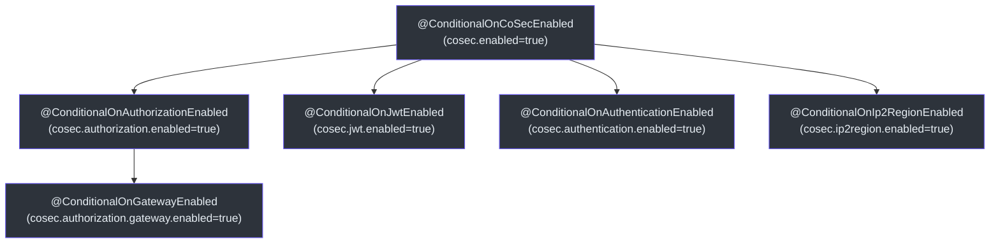
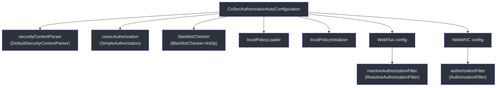
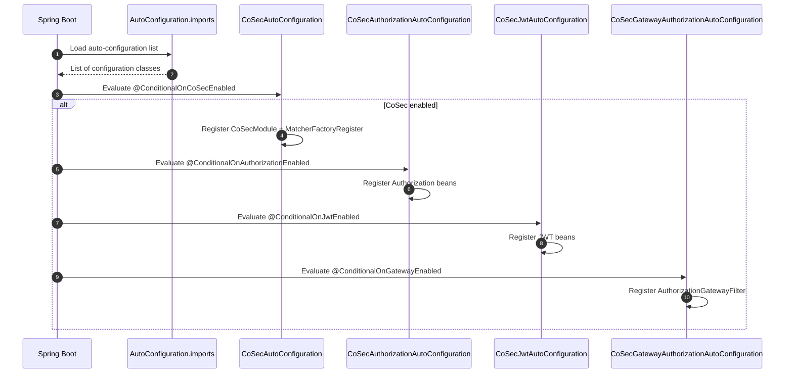

# Auto-Configuration

CoSec uses Spring Boot's auto-configuration mechanism to automatically wire up all security components based on classpath presence and property configuration. This allows applications to add CoSec by simply including the dependency with minimal configuration.

## Configuration Hierarchy

```mermaid
graph TD
    A["CoSecAutoConfiguration<br>(root)"] --> B["CoSecAuthorizationAutoConfiguration"]
    A --> C["CoSecJwtAutoConfiguration"]
    A --> D["CoSecGatewayAuthorizationAutoConfiguration"]
    A --> E["CoSecPolicyCacheAutoConfiguration"]
    A --> F["Ip2RegionAutoConfiguration"]
    A --> G["CoSecSocialAutoConfiguration"]
    A --> H["CoSecOpenTelemetryAutoConfiguration"]
    B --> I["WebFlux (ReactiveAuthorizationFilter)"]
    B --> J["WebMVC (AuthorizationFilter)"]
    B --> K["InjectSecurityContext"]
    C --> L["JwtTokenConverter"]
    C --> M["JwtTokenVerifier"]
    C --> N["TokenCompositeAuthentication"]
    D --> O["AuthorizationGatewayFilter"]

    style A fill:#2d333b,stroke:#6d5dfc,color:#e6edf3
    style B fill:#2d333b,stroke:#6d5dfc,color:#e6edf3
    style C fill:#2d333b,stroke:#6d5dfc,color:#e6edf3
    style D fill:#2d333b,stroke:#6d5dfc,color:#e6edf3
    style E fill:#2d333b,stroke:#6d5dfc,color:#e6edf3
    style F fill:#2d333b,stroke:#6d5dfc,color:#e6edf3
    style G fill:#2d333b,stroke:#6d5dfc,color:#e6edf3
    style H fill:#2d333b,stroke:#6d5dfc,color:#e6edf3
    style I fill:#2d333b,stroke:#6d5dfc,color:#e6edf3
    style J fill:#2d333b,stroke:#6d5dfc,color:#e6edf3
    style K fill:#2d333b,stroke:#6d5dfc,color:#e6edf3
    style L fill:#2d333b,stroke:#6d5dfc,color:#e6edf3
    style M fill:#2d333b,stroke:#6d5dfc,color:#e6edf3
    style N fill:#2d333b,stroke:#6d5dfc,color:#e6edf3
    style O fill:#2d333b,stroke:#6d5dfc,color:#e6edf3

```



## CoSecAutoConfiguration

The root auto-configuration class. It runs before `JacksonAutoConfiguration` to ensure the CoSec JSON module is registered early.

```kotlin
@ConditionalOnCoSecEnabled
@AutoConfiguration(before = [JacksonAutoConfiguration::class])
@EnableConfigurationProperties(CoSecProperties::class)
class CoSecAutoConfiguration {
    @Bean
    fun coSecModule(): CoSecModule = CoSecModule()

    @Bean
    fun matcherFactoryRegister(
        applicationContext: ApplicationContext
    ): MatcherFactoryRegister = MatcherFactoryRegister(applicationContext)
}
```

Registers two beans:
1. **`CoSecModule`** -- Jackson module for serializing CoSec types (policies, statements, matchers).
2. **`MatcherFactoryRegister`** -- Spring `SmartLifecycle` that registers all `ActionMatcherFactory` and `ConditionMatcherFactory` beans from the application context.

## Conditional Annotations

CoSec defines a hierarchy of conditional annotations that control which auto-configuration classes are activated:



All annotations are built on Spring's `@ConditionalOnProperty`. The root `@ConditionalOnCoSecEnabled` uses `matchIfMissing = true`, so CoSec is enabled by default.

| Annotation | Property | Default |
|-----------|----------|---------|
| `@ConditionalOnCoSecEnabled` | `cosec.enabled` | `true` |
| `@ConditionalOnAuthorizationEnabled` | `cosec.authorization.enabled` | `true` |
| `@ConditionalOnJwtEnabled` | `cosec.jwt.enabled` | `true` |
| `@ConditionalOnAuthenticationEnabled` | `cosec.authentication.enabled` | `true` |
| `@ConditionalOnIp2RegionEnabled` | `cosec.ip2region.enabled` | `true` |
| `@ConditionalOnGatewayEnabled` | `cosec.authorization.gateway.enabled` | `true` |

## CoSecAuthorizationAutoConfiguration

Wires up the core authorization components:



The nested `WebFlux` and `WebMVC` configurations are conditionally activated based on classpath presence:
- **WebFlux**: activated when `ReactiveAuthorizationFilter` is on the classpath AND Spring Cloud Gateway is NOT.
- **WebMVC**: activated when `AuthorizationFilter` is on the classpath.
- **Gateway**: handled by the separate `CoSecGatewayAuthorizationAutoConfiguration` which takes precedence over the plain WebFlux filter (via `@ConditionalOnMissingClass`).

## CoSecJwtAutoConfiguration

Configures JWT token handling:

- **Algorithm**: Supports `HMAC256`, `HMAC384`, `HMAC512` via `JwtProperties`.
- **TokenConverter**: Creates JWT access and refresh tokens with configurable validity periods.
- **TokenVerifier**: Verifies JWT signatures.
- **TokenCompositeAuthentication**: Wraps `CompositeAuthentication` with token generation (when authentication is enabled).

## CoSecProperties

Root configuration properties:

```yaml
cosec:
  enabled: true          # Master switch for all CoSec features
  # Sub-properties follow the same pattern:
  # cosec.authorization.enabled
  # cosec.jwt.enabled
  # cosec.authentication.enabled
  # cosec.ip2region.enabled
```

## Spring Auto-Configuration Registration

CoSec uses Spring Boot's `META-INF/spring/org.springframework.boot.autoconfigure.AutoConfiguration.imports` file to register all auto-configuration classes. This is the modern replacement for `spring.factories`.



## References

- [cosec-spring-boot-starter/src/main/kotlin/.../CoSecAutoConfiguration.kt:37](https://github.com/Ahoo-Wang/CoSec/blob/main/cosec-spring-boot-starter/src/main/kotlin/me/ahoo/cosec/spring/boot/starter/CoSecAutoConfiguration.kt#L37) -- Root auto-configuration
- [cosec-spring-boot-starter/src/main/kotlin/.../CoSecProperties.kt:30](https://github.com/Ahoo-Wang/CoSec/blob/main/cosec-spring-boot-starter/src/main/kotlin/me/ahoo/cosec/spring/boot/starter/CoSecProperties.kt#L30) -- Configuration properties
- [cosec-spring-boot-starter/src/main/kotlin/.../ConditionalOnCoSecEnabled.kt:23](https://github.com/Ahoo-Wang/CoSec/blob/main/cosec-spring-boot-starter/src/main/kotlin/me/ahoo/cosec/spring/boot/starter/ConditionalOnCoSecEnabled.kt#L23) -- Conditional annotation
- [cosec-spring-boot-starter/src/main/kotlin/.../CoSecAuthorizationAutoConfiguration.kt:48](https://github.com/Ahoo-Wang/CoSec/blob/main/cosec-spring-boot-starter/src/main/kotlin/me/ahoo/cosec/spring/boot/starter/authorization/CoSecAuthorizationAutoConfiguration.kt#L48) -- Authorization auto-configuration
- [cosec-spring-boot-starter/src/main/kotlin/.../CoSecJwtAutoConfiguration.kt:47](https://github.com/Ahoo-Wang/CoSec/blob/main/cosec-spring-boot-starter/src/main/kotlin/me/ahoo/cosec/spring/boot/starter/jwt/CoSecJwtAutoConfiguration.kt#L47) -- JWT auto-configuration

## Related Pages

- [Custom Matchers](./custom-matchers.md)
- [Spring WebFlux Integration](../integrations/spring-webflux.md)
- [Spring Cloud Gateway Integration](../integrations/spring-cloud-gateway.md)
- [Deployment](../operations/deployment.md)
