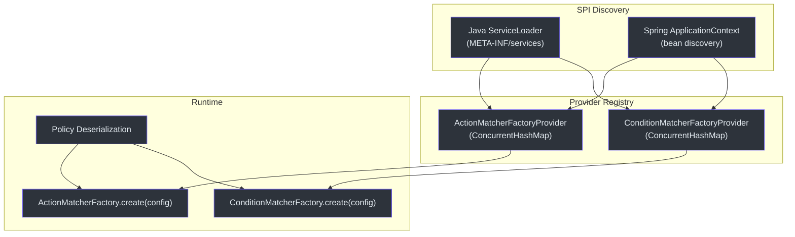
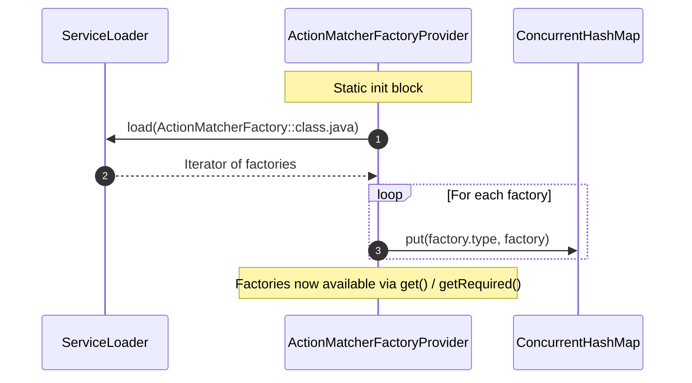
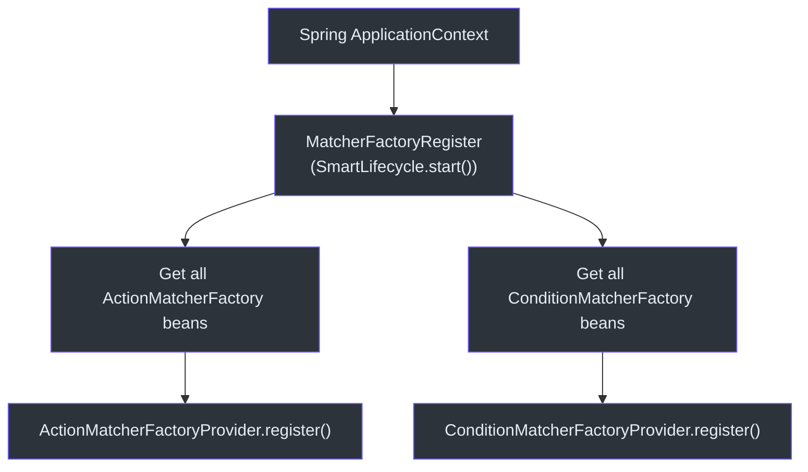

# Custom Matchers (SPI)

CoSec's policy system is fully extensible through two SPI (Service Provider Interface) extension points: `ActionMatcherFactory` for defining how requests match actions, and `ConditionMatcherFactory` for defining additional conditions on policy statements. Custom matchers are discovered automatically via Java's `ServiceLoader` and Spring's `ApplicationContext`.

## Extension Architecture



## ActionMatcherFactory

Factory interface for creating `ActionMatcher` instances. Each factory is identified by a unique `type` string that is used in policy JSON to reference the matcher.

```kotlin
interface ActionMatcherFactory {
    val type: String
    fun create(configuration: Configuration): ActionMatcher
}
```

### Built-in Action Matchers

| Factory Class | Type | Description |
|--------------|------|-------------|
| `AllActionMatcherFactory` | `all` | Matches all actions unconditionally |
| `PathActionMatcherFactory` | `path` | Matches by URL path pattern and HTTP method |
| `CompositeActionMatcherFactory` | `composite` | Combines multiple matchers with AND/OR logic |

## ConditionMatcherFactory

Factory interface for creating `ConditionMatcher` instances. Condition matchers add additional constraints beyond action matching.

```kotlin
interface ConditionMatcherFactory {
    val type: String
    fun create(configuration: Configuration): ConditionMatcher
}
```

### Built-in Condition Matchers

| Category | Matchers | Description |
|----------|----------|-------------|
| Path-based | `Eq`, `Contains`, `StartsWith`, `EndsWith`, `In`, `Regular` | Match request properties against values |
| Context-based | `Authenticated`, `InRole`, `InTenant` | Match security context properties |
| Rate limiting | Rate limiter matchers | Enforce request rate limits |
| Expression | `OGNL`, `SpEL` | Evaluate custom expressions |

## Registration Flow

### Step 1: Java ServiceLoader (META-INF/services)

For non-Spring contexts, factories are discovered via `ServiceLoader` at class loading time.

**File**: `META-INF/services/me.ahoo.cosec.policy.action.ActionMatcherFactory`

```
me.ahoo.cosec.policy.action.AllActionMatcherFactory
me.ahoo.cosec.policy.action.PathActionMatcherFactory
me.ahoo.cosec.policy.action.CompositeActionMatcherFactory
```

**File**: `META-INF/services/me.ahoo.cosec.policy.condition.ConditionMatcherFactory`

```
me.ahoo.cosec.policy.condition.AllConditionMatcherFactory
me.ahoo.cosec.policy.condition.authenticated.AuthenticatedConditionMatcherFactory
me.ahoo.cosec.policy.condition.eq.EqConditionMatcherFactory
...
```

### Step 2: Provider Registry

The `ActionMatcherFactoryProvider` and `ConditionMatcherFactoryProvider` singletons maintain a `ConcurrentHashMap` of all registered factories.



### Step 3: Spring SmartLifecycle (MatcherFactoryRegister)

When running in a Spring context, `MatcherFactoryRegister` implements `SmartLifecycle` to register all Spring-managed factory beans with the provider singletons. This runs at startup and ensures that custom factories defined as `@Bean` are available for policy evaluation.

```kotlin
class MatcherFactoryRegister(
    private val applicationContext: ApplicationContext
) : SmartLifecycle {
    override fun start() {
        applicationContext.getBeansOfType<ConditionMatcherFactory>().values.forEach {
            ConditionMatcherFactoryProvider.register(it)
        }
        applicationContext.getBeansOfType<ActionMatcherFactory>().values.forEach {
            ActionMatcherFactoryProvider.register(it)
        }
    }
}
```



## Creating a Custom Action Matcher

### Step 1: Implement the Matcher

```kotlin
class HttpMethodActionMatcher(private val method: String) : ActionMatcher {
    override fun match(request: Request): Boolean {
        return request.method.equals(method, ignoreCase = true)
    }
}
```

### Step 2: Implement the Factory

```kotlin
class HttpMethodActionMatcherFactory : ActionMatcherFactory {
    override val type = "httpMethod"
    override fun create(configuration: Configuration): ActionMatcher {
        val method = configuration.getConfigValue("method", String::class.java)
        return HttpMethodActionMatcher(method)
    }
}
```

### Step 3: Register via META-INF/services

**File**: `META-INF/services/me.ahoo.cosec.policy.action.ActionMatcherFactory`

```
com.example.HttpMethodActionMatcherFactory
```

### Step 4: Use in Policy JSON

```json
{
  "effect": "ALLOW",
  "action": {
    "type": "httpMethod",
    "method": "GET"
  }
}
```

## Creating a Custom Condition Matcher

The same pattern applies for `ConditionMatcherFactory`. Implement the `ConditionMatcher` interface, create a factory, and register it.

## References

- [cosec-core/src/main/kotlin/me/ahoo/cosec/policy/action/ActionMatcherFactory.kt:30](https://github.com/Ahoo-Wang/CoSec/blob/main/cosec-core/src/main/kotlin/me/ahoo/cosec/policy/action/ActionMatcherFactory.kt#L30) -- ActionMatcherFactory interface
- [cosec-core/src/main/kotlin/me/ahoo/cosec/policy/condition/ConditionMatcherFactory.kt:30](https://github.com/Ahoo-Wang/CoSec/blob/main/cosec-core/src/main/kotlin/me/ahoo/cosec/policy/condition/ConditionMatcherFactory.kt#L30) -- ConditionMatcherFactory interface
- [cosec-spring-boot-starter/src/main/kotlin/.../MatcherFactoryRegister.kt:24](https://github.com/Ahoo-Wang/CoSec/blob/main/cosec-spring-boot-starter/src/main/kotlin/me/ahoo/cosec/spring/boot/starter/policy/MatcherFactoryRegister.kt#L24) -- Spring SmartLifecycle registration
- [cosec-core/src/main/kotlin/me/ahoo/cosec/policy/action/ActionMatcherFactoryProvider.kt:20](https://github.com/Ahoo-Wang/CoSec/blob/main/cosec-core/src/main/kotlin/me/ahoo/cosec/policy/action/ActionMatcherFactoryProvider.kt#L20) -- Provider singleton
- [cosec-core/src/main/kotlin/me/ahoo/cosec/policy/condition/ConditionMatcherFactoryProvider.kt:20](https://github.com/Ahoo-Wang/CoSec/blob/main/cosec-core/src/main/kotlin/me/ahoo/cosec/policy/condition/ConditionMatcherFactoryProvider.kt#L20) -- Provider singleton
- [cosec-core/src/main/resources/META-INF/services/me.ahoo.cosec.policy.action.ActionMatcherFactory](https://github.com/Ahoo-Wang/CoSec/blob/main/cosec-core/src/main/resources/META-INF/services/me.ahoo.cosec.policy.action.ActionMatcherFactory) -- Built-in service registrations

## Related Pages

- [Auto-Configuration](./auto-configuration.md)
- [OpenAPI Integration](../integrations/openapi.md)
- [IP Geolocation](../integrations/ip-geolocation.md)
- [Testing](../operations/testing.md)
