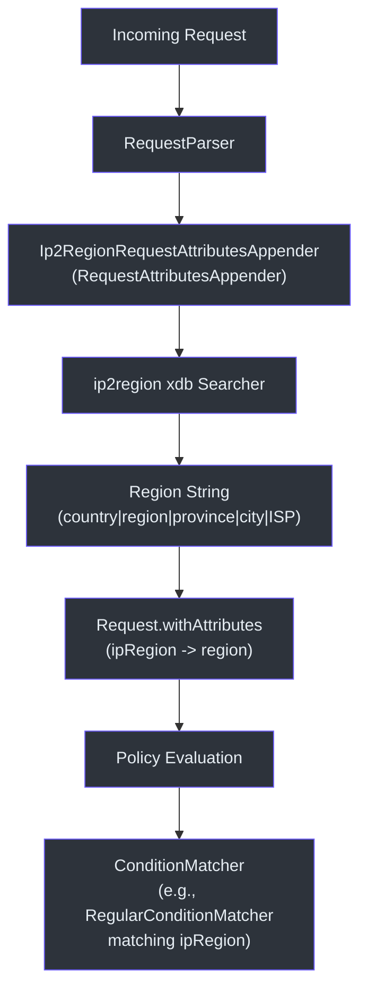
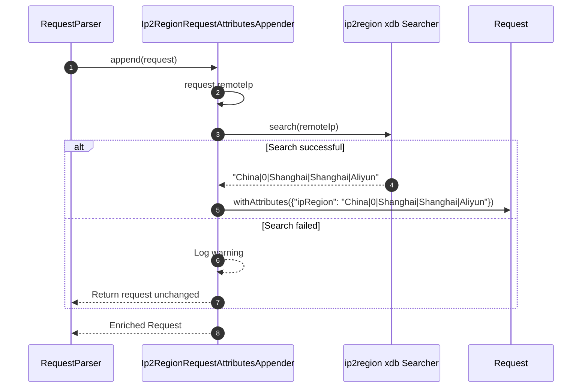
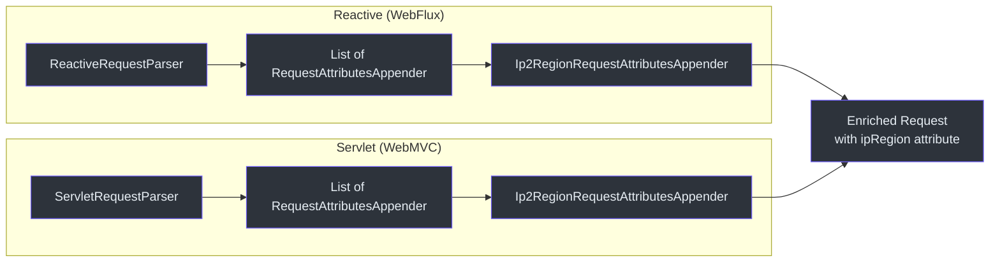

# IP Geolocation

CoSec integrates with the ip2region library to resolve client IP addresses into geographic region data. This information is attached as a request attribute (`ipRegion`) and can be used in policy condition matchers to create geo-based access rules.

## Architecture Overview



## Core Components

### Ip2RegionRequestAttributesAppender

Implements `RequestAttributesAppender` and uses the ip2region `xdb` format database to resolve IP addresses to region strings.

```kotlin
class Ip2RegionRequestAttributesAppender(
    ip2regionFile: File = LOCAL_IP2REGION_FILE,
    version: Version = Version.IPv4
) : RequestAttributesAppender
```

Key characteristics:

- **Database**: Loads the `ip2region.xdb` file from the classpath by default. The xdb format provides memory-mapped lookups with no external dependencies.
- **Lazy initialization**: The `Searcher` is created lazily on first use.
- **Attribute key**: `ipRegion` -- this is the constant `REQUEST_ATTRIBUTES_IP_REGION_KEY`.
- **Error handling**: If the search fails (e.g., for an IPv6 address when IPv4 mode is selected), the request is returned unchanged without the `ipRegion` attribute.



### How IP Data Reaches the Request

The `Ip2RegionRequestAttributesAppender` is registered as a `RequestAttributesAppender` bean. Both `ReactiveRequestParser` (WebFlux) and `ServletRequestParser` (WebMVC) iterate over all registered appenders during request parsing:



### Using ipRegion in Policy Conditions

The `ipRegion` attribute can be used with CoSec's built-in `RegularConditionMatcher` (regex-based) to create geo-based access rules. For example, a condition matcher can verify that the IP region matches a specific pattern.

## Auto-Configuration

### Ip2RegionAutoConfiguration

Registers the `Ip2RegionRequestAttributesAppender` as a Spring bean. It is conditionally activated by:

- `@ConditionalOnCoSecEnabled` -- `cosec.enabled=true` (default)
- `@ConditionalOnIp2RegionEnabled` -- `cosec.ip2region.enabled=true`
- `@ConditionalOnClass(Ip2RegionRequestAttributesAppender::class)` -- the ip2region module is on the classpath

### Configuration Properties

```yaml
cosec:
  ip2region:
    enabled: true   # Enable/disable (default: enabled when module is present)
```

When `cosec.ip2region.enabled=false` is set (as in the gateway deployment), the `Ip2RegionRequestAttributesAppender` bean is not created and no IP lookup is performed.

## References

- [cosec-ip2region/src/main/kotlin/me/ahoo/cosec/ip2region/Ip2RegionRequestAttributesAppender.kt:25](https://github.com/Ahoo-Wang/CoSec/blob/main/cosec-ip2region/src/main/kotlin/me/ahoo/cosec/ip2region/Ip2RegionRequestAttributesAppender.kt#L25) -- Core IP resolution logic
- [cosec-spring-boot-starter/src/main/kotlin/.../Ip2RegionAutoConfiguration.kt:33](https://github.com/Ahoo-Wang/CoSec/blob/main/cosec-spring-boot-starter/src/main/kotlin/me/ahoo/cosec/spring/boot/starter/ip2region/Ip2RegionAutoConfiguration.kt#L33) -- Auto-configuration
- [cosec-webflux/src/main/kotlin/me/ahoo/cosec/webflux/ReactiveRequestParser.kt:27](https://github.com/Ahoo-Wang/CoSec/blob/main/cosec-webflux/src/main/kotlin/me/ahoo/cosec/webflux/ReactiveRequestParser.kt#L27) -- WebFlux request parser (uses appenders)
- [cosec-webmvc/src/main/kotlin/me/ahoo/cosec/servlet/ServletRequestParser.kt:31](https://github.com/Ahoo-Wang/CoSec/blob/main/cosec-webmvc/src/main/kotlin/me/ahoo/cosec/servlet/ServletRequestParser.kt#L31) -- Servlet request parser (uses appenders)
- [k8s/cosec-gateway-config.yaml](https://github.com/Ahoo-Wang/CoSec/blob/main/k8s/cosec-gateway-config.yaml) -- Example config with ip2region disabled

## Related Pages

- [Custom Matchers](../extending/custom-matchers.md)
- [Auto-Configuration](../extending/auto-configuration.md)
- [Spring WebFlux Integration](./spring-webflux.md)
- [Spring WebMVC Integration](./spring-webmvc.md)
