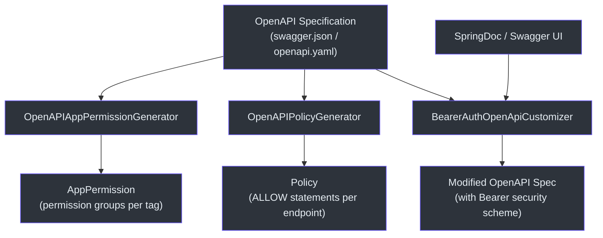
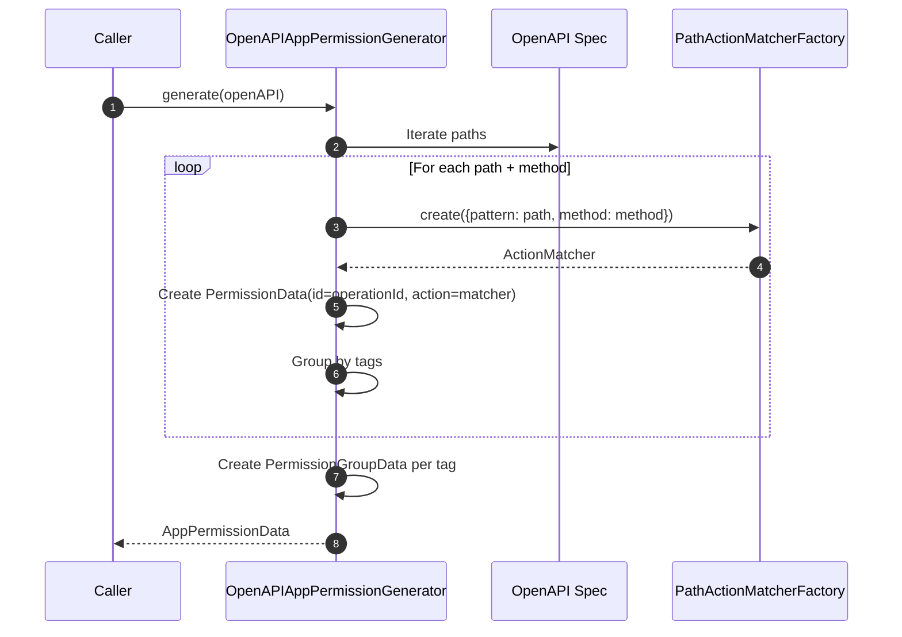
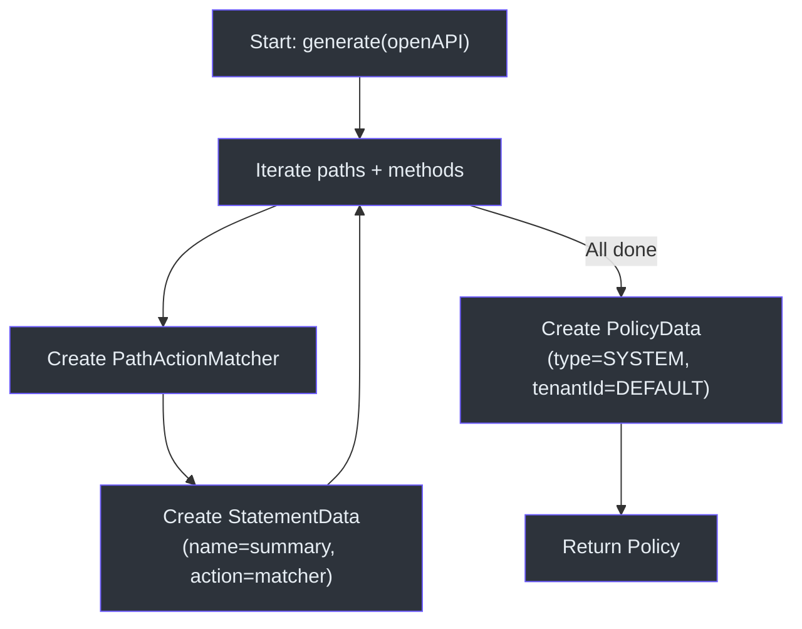
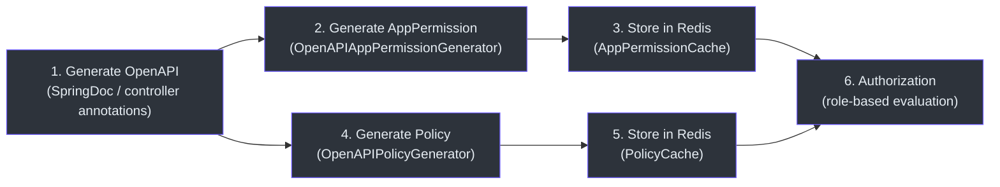

# OpenAPI Integration

CoSec provides OpenAPI integration that automatically generates application permissions and security policies from OpenAPI 3.0 specifications. This eliminates the manual effort of keeping permission definitions in sync with API documentation.

## Architecture Overview



## Core Components

### OpenAPIAppPermissionGenerator

Generates an `AppPermission` from an OpenAPI spec. It iterates over all paths and operations, creating `Permission` objects for each, then groups them by their OpenAPI tags.



Each generated permission has:
- **ID**: the `operationId` from the OpenAPI spec
- **Name**: the `summary` of the operation
- **Description**: the `description` of the operation
- **Action**: a `PathActionMatcher` configured with the endpoint path and HTTP method

Operations are grouped into `PermissionGroupData` objects using the OpenAPI `tags` field. This means Swagger UI tag names become permission group names.

### OpenAPIPolicyGenerator

Generates a `Policy` from an OpenAPI spec. Unlike the permission generator, it produces a flat list of `Statement` objects, one per endpoint, all with `Effect.ALLOW`.



The generated policy has these defaults:
- **Policy ID**: `"PolicyId"` (customizable)
- **Policy Type**: `PolicyType.SYSTEM`
- **Tenant ID**: `Tenant.DEFAULT_TENANT_ID`
- **Effect**: all statements are `ALLOW` by default

### BearerAuthOpenApiCustomizer

A `Consumer<OpenAPI>` that adds a global Bearer authentication security scheme to the OpenAPI specification. This makes Swagger UI display an "Authorize" button with Bearer token input.

```kotlin
object BearerAuthOpenApiCustomizer : Consumer<OpenAPI> {
    override fun accept(openAPI: OpenAPI) {
        openAPI.addSecurityItem(SecurityRequirement().addList(BEARER_AUTH_NAME))
        openAPI.components.addSecuritySchemes(
            BEARER_AUTH_NAME,
            SecurityScheme()
                .type(SecurityScheme.Type.HTTP)
                .scheme("bearer")
        )
    }
}
```

The security scheme name is `cosec.BearerAuth`, prefixed with `cosec.` to avoid conflicts with other security schemes in the spec.

## Workflow: From OpenAPI to Permissions



## References

- [cosec-openapi/src/main/kotlin/me/ahoo/cosec/openapi/generator/OpenAPIAppPermissionGenerator.kt:27](https://github.com/Ahoo-Wang/CoSec/blob/main/cosec-openapi/src/main/kotlin/me/ahoo/cosec/openapi/generator/OpenAPIAppPermissionGenerator.kt#L27) -- Permission generator
- [cosec-openapi/src/main/kotlin/me/ahoo/cosec/openapi/generator/OpenAPIPolicyGenerator.kt:28](https://github.com/Ahoo-Wang/CoSec/blob/main/cosec-openapi/src/main/kotlin/me/ahoo/cosec/openapi/generator/OpenAPIPolicyGenerator.kt#L28) -- Policy generator
- [cosec-openapi/src/main/kotlin/me/ahoo/cosec/openapi/security/BearerAuthOpenApiCustomizer.kt:23](https://github.com/Ahoo-Wang/CoSec/blob/main/cosec-openapi/src/main/kotlin/me/ahoo/cosec/openapi/security/BearerAuthOpenApiCustomizer.kt#L23) -- Bearer auth customizer
- [cosec-cocache/src/main/kotlin/me/ahoo/cosec/cache/AppPermissionCache.kt:20](https://github.com/Ahoo-Wang/CoSec/blob/main/cosec-cocache/src/main/kotlin/me/ahoo/cosec/cache/AppPermissionCache.kt#L20) -- App permission cache
- [cosec-core/src/main/kotlin/me/ahoo/cosec/policy/action/PathActionMatcherFactory.kt](https://github.com/Ahoo-Wang/CoSec/blob/main/cosec-core/src/main/kotlin/me/ahoo/cosec/policy/action/PathActionMatcherFactory.kt) -- Path action matcher factory

## Related Pages

- [Redis Caching](./redis-caching.md)
- [Custom Matchers](../extending/custom-matchers.md)
- [Auto-Configuration](../extending/auto-configuration.md)
