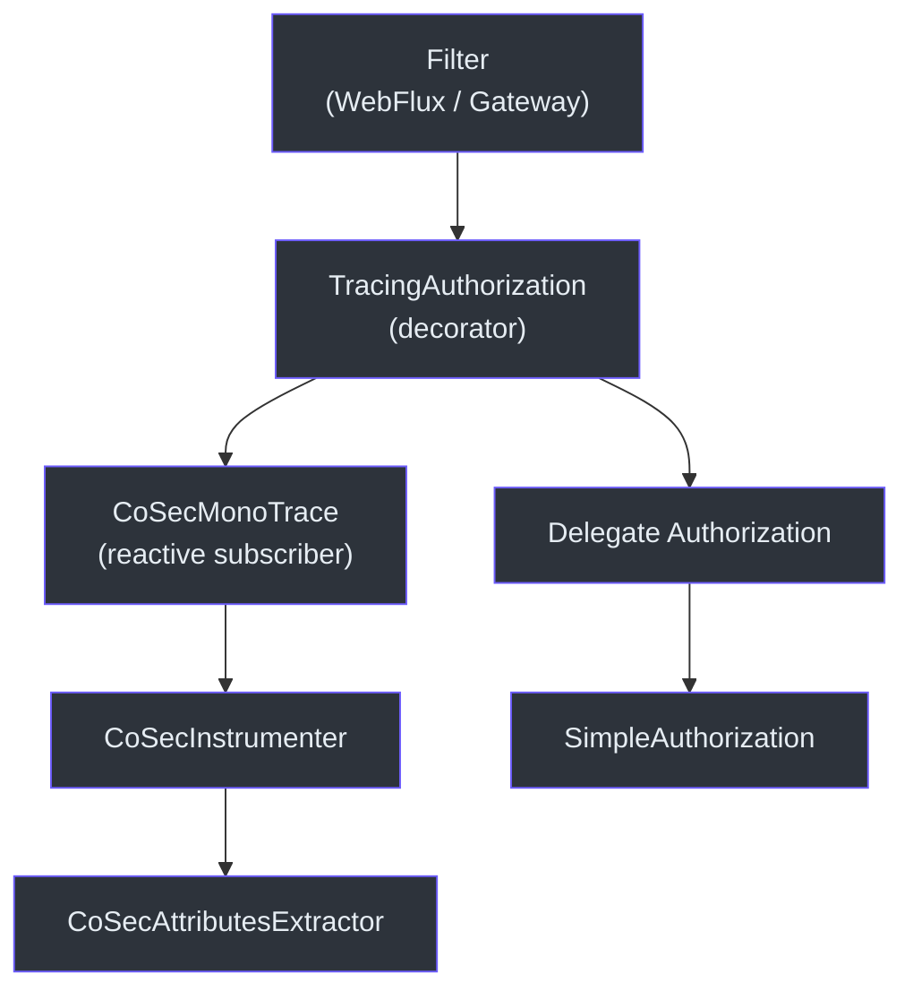
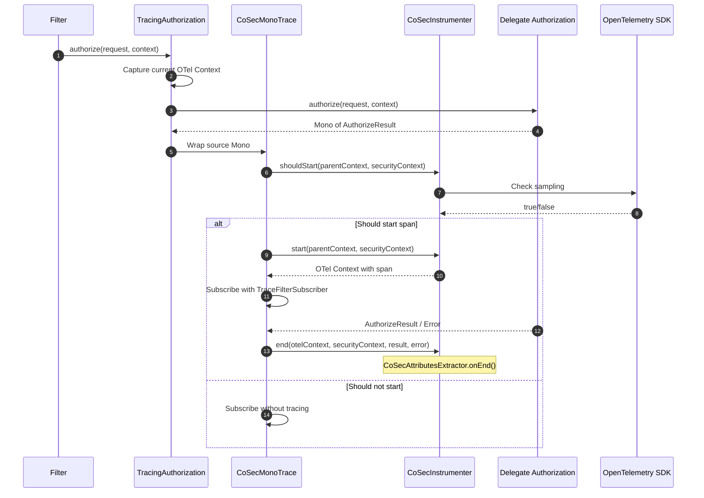
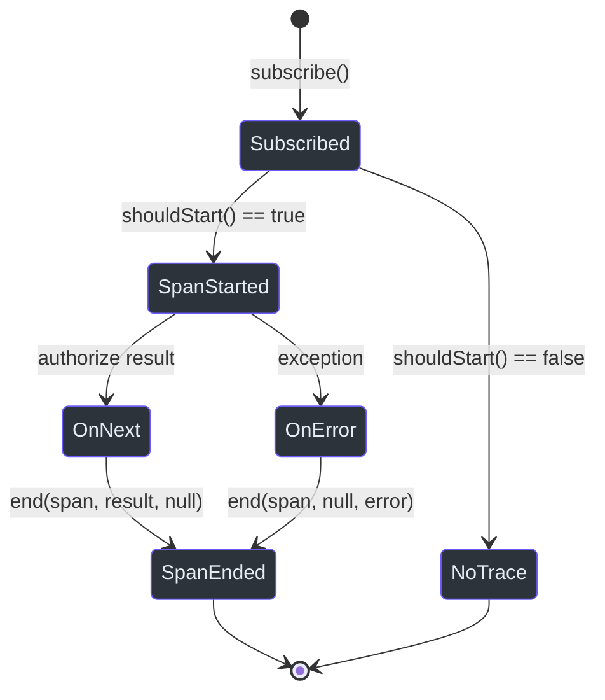

# OpenTelemetry Integration

CoSec provides deep OpenTelemetry integration via the decorator pattern, wrapping the `Authorization` interface with tracing instrumentation. Every authorization decision produces a span with rich attributes capturing the principal, policy, statement, and result.

## Architecture Overview



## Core Components

### TracingAuthorization

A decorator that wraps any `Authorization` implementation with OpenTelemetry tracing. It implements both `Authorization` and `Delegated<Authorization>`.

```kotlin
class TracingAuthorization(override val delegate: Authorization) :
    Authorization,
    Delegated<Authorization>
```

When `authorize()` is called, it:

1. Captures the current OpenTelemetry `Context`.
2. Creates a `CoSecMonoTrace` that wraps the delegate's `Mono<AuthorizeResult>`.
3. The trace subscriber manages span lifecycle (start, end, error).

### CoSecInstrumenter

Central instrumentation configuration. It creates an OpenTelemetry `Instrumenter` with:

- **Instrumentation name**: `me.ahoo.cosec`
- **Span name**: always `cosec.authorize` (via `CoSecSpanNameExtractor`)
- **Attributes extractor**: `CoSecAttributesExtractor`
- **Version**: read from the package implementation version



### CoSecAttributesExtractor

Extracts detailed attributes from the security context and authorization result. Attributes are populated in `onEnd()` (after the authorization decision completes), capturing the full decision context.

#### Span Attributes

| Attribute Key | Type | Source | Description |
|--------------|------|--------|-------------|
| `user.id` | string | `principal.id` | Authenticated user ID |
| `user.roles` | string array | `principal.roles` | User's assigned roles |
| `cosec.tenant_id` | string | `securityContext.tenant.tenantId` | Current tenant |
| `cosec.space_id` | string | `request.spaceId` | Current space |
| `cosec.app_id` | string | `request.appId` | Target application ID |
| `device.id` | string | `request.deviceId` | Requesting device ID |
| `cosec.request_id` | string | `request.requestId` | Correlation request ID |
| `cosec.policy` | string array | `principal.policies` | Principal's policy IDs |
| `cosec.authorize.policy.id` | string | `PolicyVerifyContext` | Matched policy ID |
| `cosec.authorize.statement.index` | long | `PolicyVerifyContext` | Matched statement index |
| `cosec.authorize.statement.name` | string | `PolicyVerifyContext` | Matched statement name |
| `cosec.authorize.role.id` | string | `RoleVerifyContext` | Matched role ID |
| `cosec.authorize.permission.id` | string | `RoleVerifyContext` | Matched permission ID |
| `cosec.authorize.result` | string | `VerifyContext.result` | ALLOW / EXPLICIT_DENY / IMPLICIT_DENY |

### CoSecMonoTrace and TraceFilterSubscriber

These classes implement the reactive tracing contract by wrapping a `Mono<AuthorizeResult>`:

- `CoSecMonoTrace` extends `Mono<AuthorizeResult>` and handles span creation on subscribe.
- `TraceFilterSubscriber` extends `CoreSubscriber<AuthorizeResult>` and ends the span on `onComplete()` or `onError()`.



## Usage in Jaeger / Grafana

The span name `cosec.authorize` can be used to filter traces in your observability backend. The `cosec.authorize.result` attribute lets you quickly find denied requests, while `cosec.authorize.policy.id` and `cosec.authorize.statement.name` pinpoint exactly which policy rule triggered the decision.

## References

- [cosec-opentelemetry/src/main/kotlin/me/ahoo/cosec/opentelemetry/TracingAuthorization.kt:24](https://github.com/Ahoo-Wang/CoSec/blob/main/cosec-opentelemetry/src/main/kotlin/me/ahoo/cosec/opentelemetry/TracingAuthorization.kt#L24) -- Decorator wrapping Authorization
- [cosec-opentelemetry/src/main/kotlin/me/ahoo/cosec/opentelemetry/CoSecInstrumenter.kt:36](https://github.com/Ahoo-Wang/CoSec/blob/main/cosec-opentelemetry/src/main/kotlin/me/ahoo/cosec/opentelemetry/CoSecInstrumenter.kt#L36) -- Instrumenter and attributes extractor
- [cosec-opentelemetry/src/main/kotlin/me/ahoo/cosec/opentelemetry/AuthorizationMono.kt:23](https://github.com/Ahoo-Wang/CoSec/blob/main/cosec-opentelemetry/src/main/kotlin/me/ahoo/cosec/opentelemetry/AuthorizationMono.kt#L23) -- Reactive tracing subscriber
- [cosec-core/src/main/kotlin/me/ahoo/cosec/authorization/SimpleAuthorization.kt:48](https://github.com/Ahoo-Wang/CoSec/blob/main/cosec-core/src/main/kotlin/me/ahoo/cosec/authorization/SimpleAuthorization.kt#L48) -- Delegate authorization
- [cosec-spring-boot-starter/src/main/kotlin/.../CoSecAutoConfiguration.kt:37](https://github.com/Ahoo-Wang/CoSec/blob/main/cosec-spring-boot-starter/src/main/kotlin/me/ahoo/cosec/spring/boot/starter/CoSecAutoConfiguration.kt#L37) -- Auto-configuration

## Related Pages

- [Spring Cloud Gateway Integration](./spring-cloud-gateway.md)
- [Redis Caching](./redis-caching.md)
- [Performance](../operations/performance.md)
- [Deployment](../operations/deployment.md)
