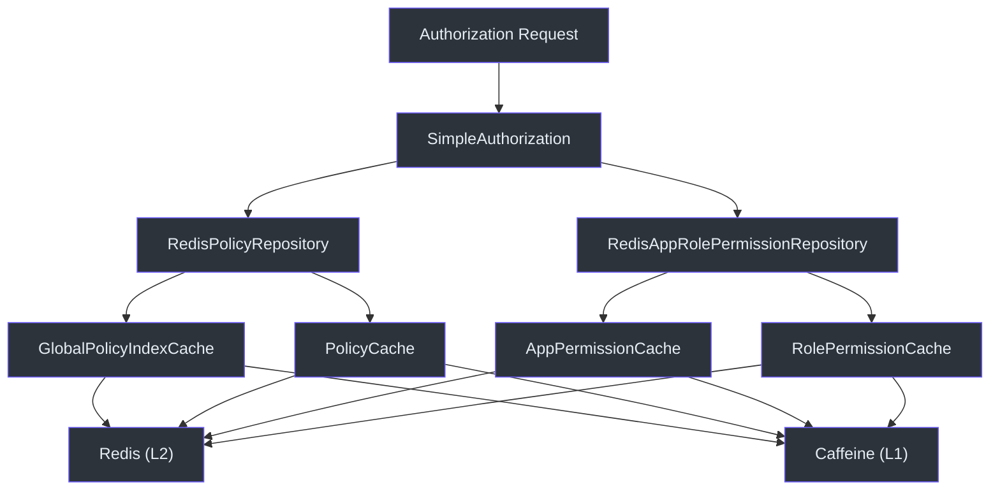
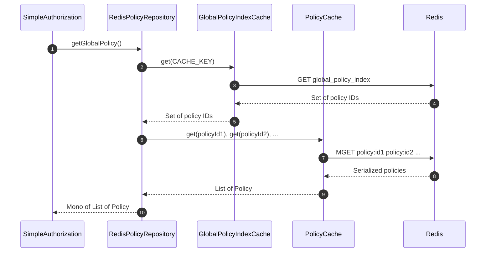
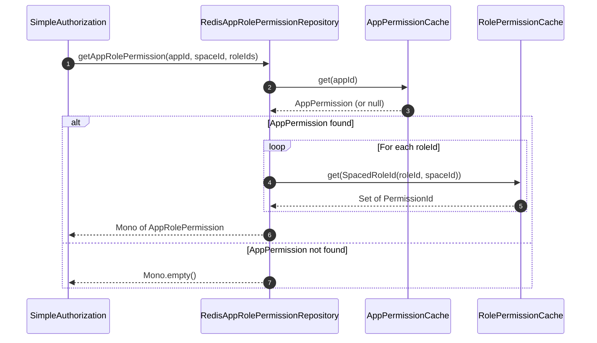
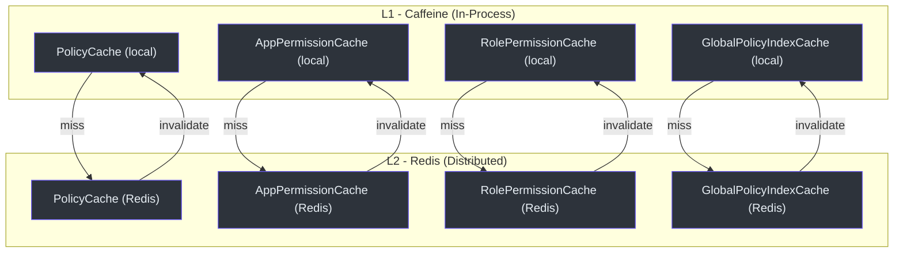

# Redis Caching with CoCache

CoSec leverages CoCache to provide a two-level distributed caching layer (local Caffeine + Redis) for policies and role permissions. This ensures fast authorization decisions while maintaining consistency across multiple gateway instances.

## Architecture Overview



## Core Components

### RedisPolicyRepository

Implements `PolicyRepository` backed by Redis caches. Provides three operations:

1. **`getGlobalPolicy()`** -- retrieves all global policies by first fetching the global policy index from `GlobalPolicyIndexCache`, then batch-fetching each policy from `PolicyCache`.
2. **`getPolicies(policyIds)`** -- fetches specific policies by ID from `PolicyCache`.
3. **`setPolicy(policy)`** -- stores a policy in `PolicyCache`. If the policy is `PolicyType.GLOBAL`, it also adds the policy ID to the `GlobalPolicyIndexCache`.



When `setPolicy()` is called, the policy is first validated via `DefaultPolicyEvaluator.evaluate(policy)` to ensure it is well-formed before caching. If the policy is a global policy, the global index is updated atomically.

### RedisAppRolePermissionRepository

Implements `AppRolePermissionRepository` by combining data from two caches:

1. **`AppPermissionCache`** -- maps `AppId` to `AppPermission` (the application's permission definitions).
2. **`RolePermissionCache`** -- maps `SpacedRoleId` to a `Set<PermissionId>` (permissions granted to each role within a space).



### Cache Interfaces

All cache interfaces extend CoCache's `Cache<K, V>` interface, providing a unified API with L1 (Caffeine) and L2 (Redis) caching:

| Cache Interface | Key Type | Value Type | Purpose |
|----------------|----------|------------|---------|
| `PolicyCache` | `String` (policy ID) | `Policy` | Individual policy documents |
| `GlobalPolicyIndexCache` | `String` (fixed key) | `Set<String>` (policy IDs) | Index of all global policy IDs |
| `AppPermissionCache` | `AppId` | `AppPermission` | Application permission definitions |
| `RolePermissionCache` | `SpacedRoleId` | `Set<PermissionId>` | Role-to-permission mappings |

### GlobalPolicyIndexKeyConverter

A CoCache `KeyConverter` that maps all cache keys to a single fixed key. This ensures the `GlobalPolicyIndexCache` always reads and writes to the same Redis key, maintaining a single global index entry.

## Cache Configuration

The gateway's `application.yaml` configures cache maximum sizes:

```yaml
cosec:
  authorization:
    cache:
      policy:
        maximum-size: 100000
      role:
        maximum-size: 100000
```

## Cache Hierarchy



## References

- [cosec-cocache/src/main/kotlin/me/ahoo/cosec/cache/RedisPolicyRepository.kt:26](https://github.com/Ahoo-Wang/CoSec/blob/main/cosec-cocache/src/main/kotlin/me/ahoo/cosec/cache/RedisPolicyRepository.kt#L26) -- Policy repository
- [cosec-cocache/src/main/kotlin/me/ahoo/cosec/cache/RedisAppRolePermissionRepository.kt:27](https://github.com/Ahoo-Wang/CoSec/blob/main/cosec-cocache/src/main/kotlin/me/ahoo/cosec/cache/RedisAppRolePermissionRepository.kt#L27) -- Role permission repository
- [cosec-cocache/src/main/kotlin/me/ahoo/cosec/cache/PolicyCache.kt:23](https://github.com/Ahoo-Wang/CoSec/blob/main/cosec-cocache/src/main/kotlin/me/ahoo/cosec/cache/PolicyCache.kt#L23) -- Policy cache interface
- [cosec-cocache/src/main/kotlin/me/ahoo/cosec/cache/AppPermissionCache.kt:20](https://github.com/Ahoo-Wang/CoSec/blob/main/cosec-cocache/src/main/kotlin/me/ahoo/cosec/cache/AppPermissionCache.kt#L20) -- App permission cache interface
- [cosec-cocache/src/main/kotlin/me/ahoo/cosec/cache/GlobalPolicyIndexCache.kt:22](https://github.com/Ahoo-Wang/CoSec/blob/main/cosec-cocache/src/main/kotlin/me/ahoo/cosec/cache/GlobalPolicyIndexCache.kt#L22) -- Global policy index cache
- [cosec-cocache/src/main/kotlin/me/ahoo/cosec/cache/GlobalPolicyIndexKeyConverter.kt:18](https://github.com/Ahoo-Wang/CoSec/blob/main/cosec-cocache/src/main/kotlin/me/ahoo/cosec/cache/GlobalPolicyIndexKeyConverter.kt#L18) -- Key converter

## Related Pages

- [Spring Cloud Gateway Integration](./spring-cloud-gateway.md)
- [OpenTelemetry Integration](./opentelemetry.md)
- [Performance](../operations/performance.md)
- [Deployment](../operations/deployment.md)
