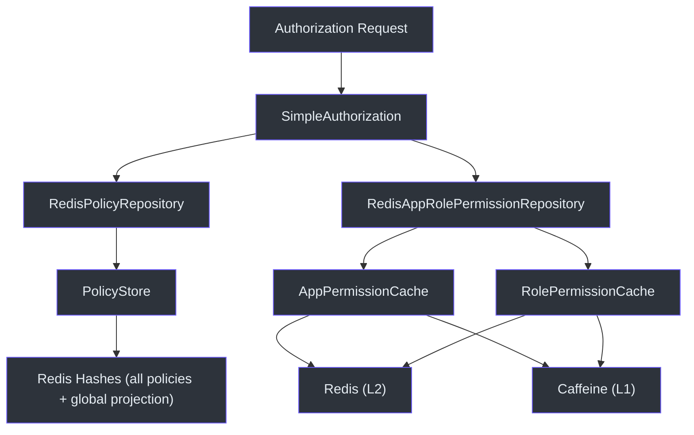
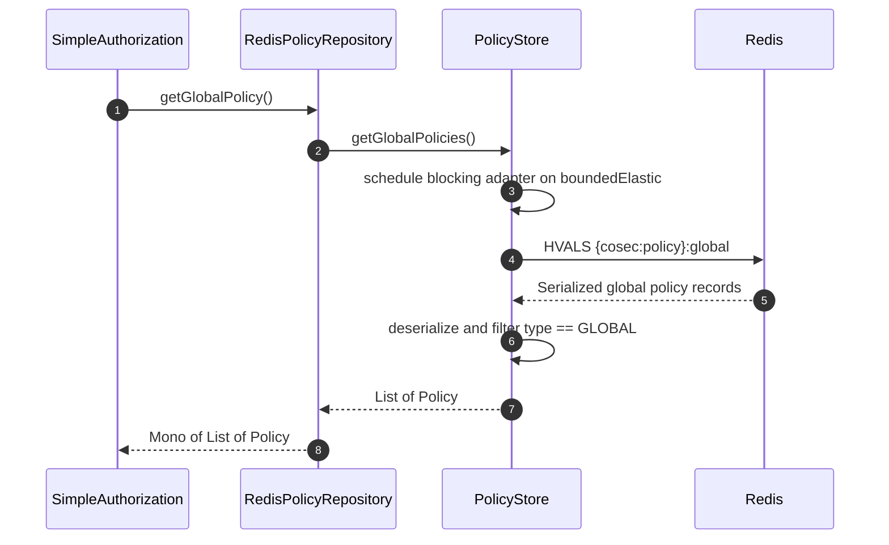
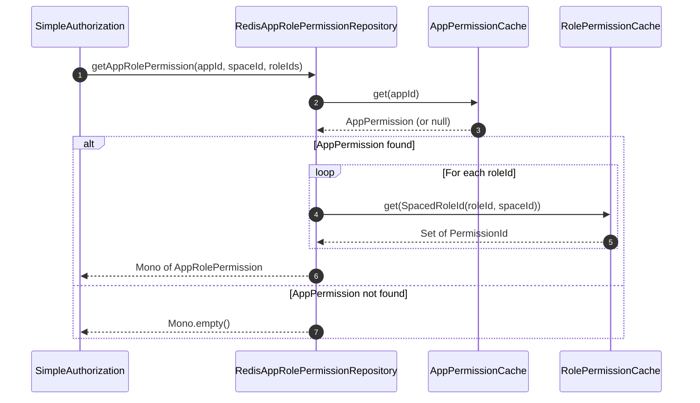
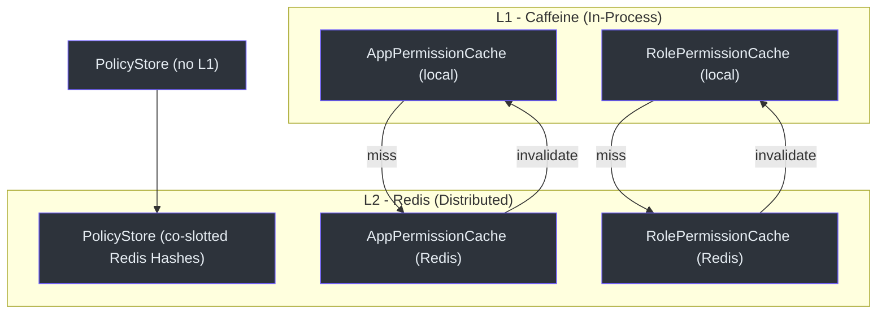

# Redis Policy Storage and CoCache

CoSec uses a reactive `PolicyStore` backed by two co-slotted Redis Hashes: one authoritative all-policy Hash and one full-document global-policy projection. A Lua script updates both Hashes atomically, so changing `GLOBAL` to another type cannot expose a stale global policy. Role permissions continue to use CoCache's two-level layer (local Caffeine + Redis). Blocking Redis operations are deferred to Reactor's bounded-elastic scheduler.

## Architecture Overview


```mermaid
graph TD
    A["Authorization Request"] --> B["SimpleAuthorization"]
    B --> C["RedisPolicyRepository"]
    B --> D["RedisAppRolePermissionRepository"]
    C --> E["PolicyStore"]
    D --> G["AppPermissionCache"]
    D --> H["RolePermissionCache"]
    E --> K["Redis Hashes (all policies + global projection)"]
    I["Redis (L2)"]
    J["Caffeine (L1)"]
    G --> I
    H --> I
    G --> J
    H --> J

    style A fill:#2d333b,stroke:#6d5dfc,color:#e6edf3
    style B fill:#2d333b,stroke:#6d5dfc,color:#e6edf3
    style C fill:#2d333b,stroke:#6d5dfc,color:#e6edf3
    style D fill:#2d333b,stroke:#6d5dfc,color:#e6edf3
    style E fill:#2d333b,stroke:#6d5dfc,color:#e6edf3
    style G fill:#2d333b,stroke:#6d5dfc,color:#e6edf3
    style H fill:#2d333b,stroke:#6d5dfc,color:#e6edf3
    style I fill:#2d333b,stroke:#6d5dfc,color:#e6edf3
    style J fill:#2d333b,stroke:#6d5dfc,color:#e6edf3
    style K fill:#2d333b,stroke:#6d5dfc,color:#e6edf3

```

## Core Components

### RedisPolicyRepository

Implements `PolicyRepository` backed by Redis caches. Provides three operations:

1. **`getGlobalPolicy()`** -- delegates to the reactive `PolicyStore`, which reads only the global projection and defensively filters documents by their current `PolicyType.GLOBAL` value.
2. **`getPolicies(policyIds)`** -- batch-reads the requested Hash fields.
3. **`setPolicy(policy)`** -- validates the policy and atomically updates the authoritative field and global projection.


```mermaid
sequenceDiagram
    autonumber
    participant Auth as SimpleAuthorization
    participant Repo as RedisPolicyRepository
    participant Store as PolicyStore
    participant Redis

    Auth->>Repo: getGlobalPolicy()
    Repo->>Store: getGlobalPolicies()
    Store->>Store: schedule blocking adapter on boundedElastic
    Store->>Redis: HVALS {cosec:policy}:global
    Redis-->>Store: Serialized global policy records
    Store->>Store: deserialize and filter type == GLOBAL
    Store-->>Repo: List of Policy
    Repo-->>Auth: Mono of List of Policy


```

Each policy ID maps to a field in the authoritative Hash. A Lua script writes that field and adds or removes the same full document in the global projection as one Redis operation. Both keys use the same Redis Cluster hash tag, so the script supplies one linearization point without a renewable lease or stale lock owner. Global reads are O(G), where G is the number of global policies, instead of scanning all policies. `RedisPolicyStore` also exposes the existing synchronous `PolicyCache` facade and lazily migrates legacy per-policy keys after old writers have stopped.

### RedisAppRolePermissionRepository

Implements `AppRolePermissionRepository` by combining data from two caches:

1. **`AppPermissionCache`** -- maps `AppId` to `AppPermission` (the application's permission definitions).
2. **`RolePermissionCache`** -- maps `SpacedRoleId` to a `Set<PermissionId>` (permissions granted to each role within a space).


```mermaid
sequenceDiagram
    autonumber
    participant Auth as SimpleAuthorization
    participant Repo as RedisAppRolePermissionRepository
    participant AppCache as AppPermissionCache
    participant RoleCache as RolePermissionCache

    Auth->>Repo: getAppRolePermission(appId, spaceId, roleIds)
    Repo->>AppCache: get(appId)
    AppCache-->>Repo: AppPermission (or null)
    alt AppPermission found
        loop For each roleId
            Repo->>RoleCache: get(SpacedRoleId(roleId, spaceId))
            RoleCache-->>Repo: Set of PermissionId
        end
        Repo-->>Auth: Mono of AppRolePermission
    else AppPermission not found
        Repo-->>Auth: Mono.empty()
    end


```

### Cache Interfaces

The cache interfaces retain the existing `Cache<K, V>` API. Policy access is backed directly by the Redis Hashes; permission caches retain CoCache L1 and L2 caching:

| Cache Interface | Key Type | Value Type | Purpose |
|----------------|----------|------------|---------|
| `PolicyCache` | `String` (policy ID) | `Policy` | Compatibility facade over `PolicyStore` records |
| `AppPermissionCache` | `AppId` | `AppPermission` | Application permission definitions |
| `RolePermissionCache` | `SpacedRoleId` | `Set<PermissionId>` | Role-to-permission mappings |

### PolicyStore

`PolicyStore` is a reactive public port in `cosec-api`. Its default adapter uses `{<key-prefix>:policy}:store` for all policies and `{<key-prefix>:policy}:global` for the global projection. Custom adapters must atomically publish a policy document and its global visibility, and must not execute blocking I/O on the subscribing event-loop thread.

The migration is a maintenance-window cutover, not a rolling mixed-version upgrade. Legacy policy records have no revision that can safely order old and new writes. Stop every old writer before deploying this version; the new adapter then drains legacy global-index entries and lazily imports legacy documents without overwriting an authoritative new record. Rolling back after new writes requires exporting or migrating the new Hash data first; simply restarting an old node can lose those writes.

## Cache Configuration

The gateway's `application.yaml` configures cache maximum sizes:

```yaml
cosec:
  authorization:
    cache:
      role:
        maximum-size: 100000
```

## Cache Hierarchy


```mermaid
graph TD
    subgraph "L1 - Caffeine (In-Process)"
        B["AppPermissionCache (local)"]
        C["RolePermissionCache (local)"]
    end
    subgraph "L2 - Redis (Distributed)"
        E["PolicyStore (co-slotted Redis Hashes)"]
        F["AppPermissionCache (Redis)"]
        G["RolePermissionCache (Redis)"]
    end
    D["PolicyStore (no L1)"] --> E
    B -->|miss| F
    C -->|miss| G
    F -->|invalidate| B
    G -->|invalidate| C

    style B fill:#2d333b,stroke:#6d5dfc,color:#e6edf3
    style C fill:#2d333b,stroke:#6d5dfc,color:#e6edf3
    style D fill:#2d333b,stroke:#6d5dfc,color:#e6edf3
    style E fill:#2d333b,stroke:#6d5dfc,color:#e6edf3
    style F fill:#2d333b,stroke:#6d5dfc,color:#e6edf3
    style G fill:#2d333b,stroke:#6d5dfc,color:#e6edf3

```

## References

- [cosec-cocache/src/main/kotlin/me/ahoo/cosec/cache/RedisPolicyRepository.kt:26](https://github.com/Ahoo-Wang/CoSec/blob/main/cosec-cocache/src/main/kotlin/me/ahoo/cosec/cache/RedisPolicyRepository.kt#L26) -- Policy repository
- [cosec-cocache/src/main/kotlin/me/ahoo/cosec/cache/RedisAppRolePermissionRepository.kt:27](https://github.com/Ahoo-Wang/CoSec/blob/main/cosec-cocache/src/main/kotlin/me/ahoo/cosec/cache/RedisAppRolePermissionRepository.kt#L27) -- Role permission repository
- [cosec-cocache/src/main/kotlin/me/ahoo/cosec/cache/PolicyCache.kt:23](https://github.com/Ahoo-Wang/CoSec/blob/main/cosec-cocache/src/main/kotlin/me/ahoo/cosec/cache/PolicyCache.kt#L23) -- Policy cache interface
- [cosec-cocache/src/main/kotlin/me/ahoo/cosec/cache/AppPermissionCache.kt:20](https://github.com/Ahoo-Wang/CoSec/blob/main/cosec-cocache/src/main/kotlin/me/ahoo/cosec/cache/AppPermissionCache.kt#L20) -- App permission cache interface
- [cosec-api/src/main/kotlin/me/ahoo/cosec/api/policy/PolicyStore.kt:23](https://github.com/Ahoo-Wang/CoSec/blob/main/cosec-api/src/main/kotlin/me/ahoo/cosec/api/policy/PolicyStore.kt#L23) -- Reactive policy-store port
- [cosec-spring-boot-starter/src/main/kotlin/me/ahoo/cosec/spring/boot/starter/authorization/cache/RedisPolicyStore.kt:29](https://github.com/Ahoo-Wang/CoSec/blob/main/cosec-spring-boot-starter/src/main/kotlin/me/ahoo/cosec/spring/boot/starter/authorization/cache/RedisPolicyStore.kt#L29) -- Atomic Redis Hash adapter

## Related Pages

- [Spring Cloud Gateway Integration](./spring-cloud-gateway.md)
- [OpenTelemetry Integration](./opentelemetry.md)
- [Performance](../operations/performance.md)
- [Deployment](../operations/deployment.md)
