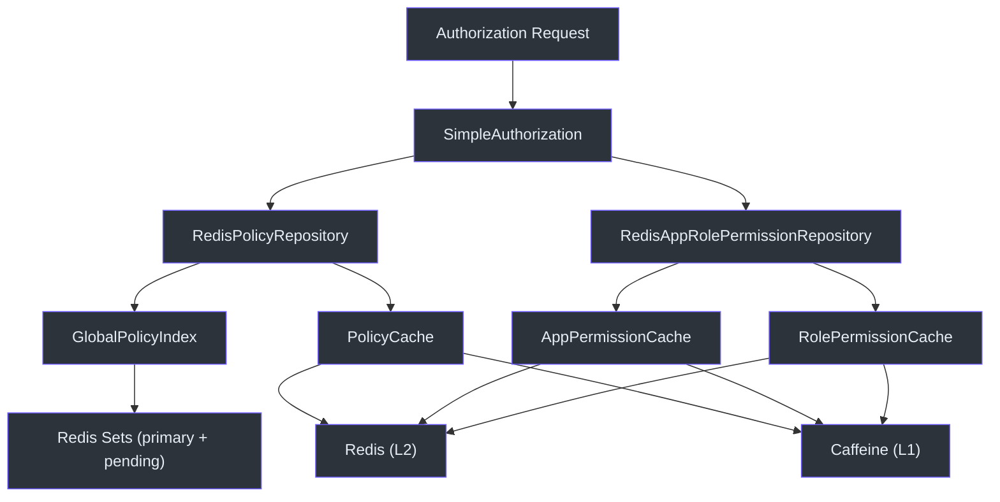
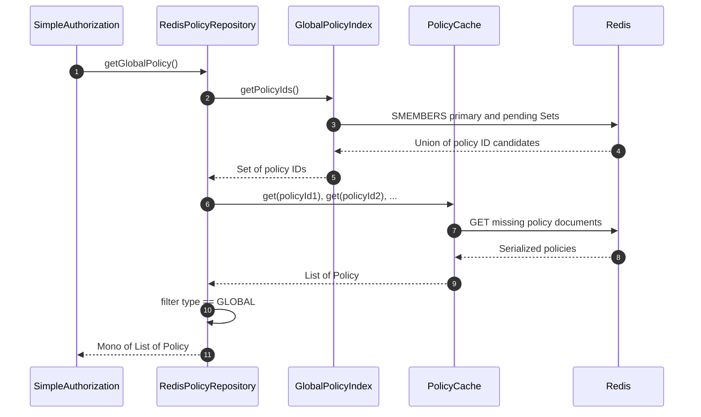
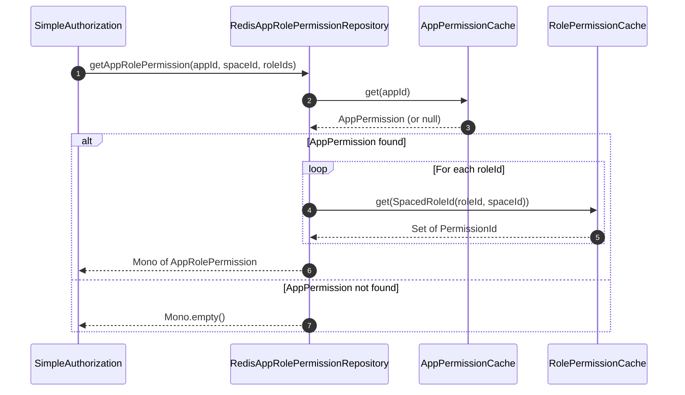
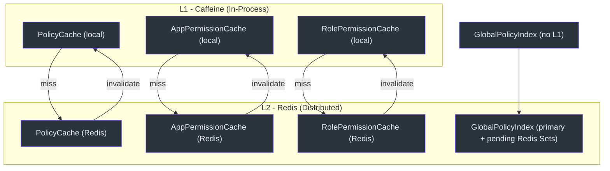

# Redis Caching with CoCache

CoSec uses CoCache's two-level layer (local Caffeine + Redis) for policy documents and role permissions. The global-policy index is deliberately separate: `GlobalPolicyIndex` reads and updates two Redis Sets directly so no process can serve a stale L1 snapshot of membership. The primary Set stores confirmed membership and the pending Set preserves fail-safe candidates while write ownership is uncertain.

## Architecture Overview


```mermaid
graph TD
    A["Authorization Request"] --> B["SimpleAuthorization"]
    B --> C["RedisPolicyRepository"]
    B --> D["RedisAppRolePermissionRepository"]
    C --> E["GlobalPolicyIndex"]
    C --> F["PolicyCache"]
    D --> G["AppPermissionCache"]
    D --> H["RolePermissionCache"]
    E --> K["Redis Sets (primary + pending)"]
    I["Redis (L2)"]
    J["Caffeine (L1)"]
    F --> I
    G --> I
    H --> I
    F --> J
    G --> J
    H --> J

    style A fill:#2d333b,stroke:#6d5dfc,color:#e6edf3
    style B fill:#2d333b,stroke:#6d5dfc,color:#e6edf3
    style C fill:#2d333b,stroke:#6d5dfc,color:#e6edf3
    style D fill:#2d333b,stroke:#6d5dfc,color:#e6edf3
    style E fill:#2d333b,stroke:#6d5dfc,color:#e6edf3
    style F fill:#2d333b,stroke:#6d5dfc,color:#e6edf3
    style G fill:#2d333b,stroke:#6d5dfc,color:#e6edf3
    style H fill:#2d333b,stroke:#6d5dfc,color:#e6edf3
    style I fill:#2d333b,stroke:#6d5dfc,color:#e6edf3
    style J fill:#2d333b,stroke:#6d5dfc,color:#e6edf3
    style K fill:#2d333b,stroke:#6d5dfc,color:#e6edf3

```

## Core Components

### RedisPolicyRepository

Implements `PolicyRepository` backed by Redis caches. Provides three operations:

1. **`getGlobalPolicy()`** -- reads IDs from `GlobalPolicyIndex`, fetches their documents from `PolicyCache`, and filters out documents whose current type is not `PolicyType.GLOBAL`.
2. **`getPolicies(policyIds)`** -- fetches specific policies by ID from `PolicyCache`.
3. **`setPolicy(policy)`** -- validates the policy, then delegates the idempotent cache overwrite to `GlobalPolicyIndex.update()` so the document and index membership are serialized per policy ID.


```mermaid
sequenceDiagram
    autonumber
    participant Auth as SimpleAuthorization
    participant Repo as RedisPolicyRepository
    participant Index as GlobalPolicyIndex
    participant PolicyCache as PolicyCache
    participant Redis

    Auth->>Repo: getGlobalPolicy()
    Repo->>Index: getPolicyIds()
    Index->>Redis: SMEMBERS primary and pending Sets
    Redis-->>Index: Union of policy ID candidates
    Index-->>Repo: Set of policy IDs
    Repo->>PolicyCache: get(policyId1), get(policyId2), ...
    PolicyCache->>Redis: GET missing policy documents
    Redis-->>PolicyCache: Serialized policies
    PolicyCache-->>Repo: List of Policy
    Repo->>Repo: filter type == GLOBAL
    Repo-->>Auth: Mono of List of Policy


```

`GlobalPolicyIndex.update()` acquires a renewable Redis lock scoped by policy ID. A GLOBAL update first records the ID in the pending Set, then executes `SADD` on the primary Set before the policy overwrite; a non-GLOBAL update overwrites the policy before `SREM`. The pending marker is removed only after lock ownership is confirmed. If ownership confirmation returns false or fails, the idempotent overwrite is retried. After all attempts are uncertain, the adapter retains the pending candidate, performs a fail-safe primary `SADD`, and returns an explicit error. `getPolicyIds()` unions both Sets. This may produce an extra candidate, which the read-side policy-type filter removes, but it does not silently omit a GLOBAL policy.

### RedisAppRolePermissionRepository

Implements `AppRolePermissionRepository` by combining data from two caches:

1. **`AppPermissionCache`** -- maps `AppId` to `AppPermission` (the application's permission definitions).
2. **`RolePermissionCache`** -- maps `SpacedRoleId` to a `Set<PermissionId>` (permissions granted to each role within a space).


```mermaid
sequenceDiagram
    autonumber
    participant Auth as SimpleAuthorization
    participant Repo as RedisAppRolePermissionRepository
    participant AppCache as AppPermissionCache
    participant RoleCache as RolePermissionCache

    Auth->>Repo: getAppRolePermission(appId, spaceId, roleIds)
    Repo->>AppCache: get(appId)
    AppCache-->>Repo: AppPermission (or null)
    alt AppPermission found
        loop For each roleId
            Repo->>RoleCache: get(SpacedRoleId(roleId, spaceId))
            RoleCache-->>Repo: Set of PermissionId
        end
        Repo-->>Auth: Mono of AppRolePermission
    else AppPermission not found
        Repo-->>Auth: Mono.empty()
    end


```

### Cache Interfaces

The document cache interfaces extend CoCache's `Cache<K, V>` interface, providing a unified API with L1 (Caffeine) and L2 (Redis) caching:

| Cache Interface | Key Type | Value Type | Purpose |
|----------------|----------|------------|---------|
| `PolicyCache` | `String` (policy ID) | `Policy` | Individual policy documents |
| `AppPermissionCache` | `AppId` | `AppPermission` | Application permission definitions |
| `RolePermissionCache` | `SpacedRoleId` | `Set<PermissionId>` | Role-to-permission mappings |

### GlobalPolicyIndex

`GlobalPolicyIndex` is a public port in `cosec-api`, not a CoCache cache. Its Redis adapter uses `SMEMBERS`, `SADD`, and `SREM` against the primary key `cosec.authorization.cache.key-prefix + ":global:policy"` and the pending key with an additional `":pending"` suffix. Custom adapters must implement the complete fail-safe `update` contract; the callback may be replayed and must therefore remain idempotent.

## Cache Configuration

The gateway's `application.yaml` configures cache maximum sizes:

```yaml
cosec:
  authorization:
    cache:
      policy:
        maximum-size: 100000
      role:
        maximum-size: 100000
```

## Cache Hierarchy


```mermaid
graph TD
    subgraph "L1 - Caffeine (In-Process)"
        A["PolicyCache (local)"]
        B["AppPermissionCache (local)"]
        C["RolePermissionCache (local)"]
    end
    subgraph "L2 - Redis (Distributed)"
        E["PolicyCache (Redis)"]
        F["AppPermissionCache (Redis)"]
        G["RolePermissionCache (Redis)"]
        H["GlobalPolicyIndex (primary + pending Redis Sets)"]
    end
    D["GlobalPolicyIndex (no L1)"] --> H
    A -->|miss| E
    B -->|miss| F
    C -->|miss| G
    E -->|invalidate| A
    F -->|invalidate| B
    G -->|invalidate| C

    style A fill:#2d333b,stroke:#6d5dfc,color:#e6edf3
    style B fill:#2d333b,stroke:#6d5dfc,color:#e6edf3
    style C fill:#2d333b,stroke:#6d5dfc,color:#e6edf3
    style D fill:#2d333b,stroke:#6d5dfc,color:#e6edf3
    style E fill:#2d333b,stroke:#6d5dfc,color:#e6edf3
    style F fill:#2d333b,stroke:#6d5dfc,color:#e6edf3
    style G fill:#2d333b,stroke:#6d5dfc,color:#e6edf3
    style H fill:#2d333b,stroke:#6d5dfc,color:#e6edf3

```

## References

- [cosec-cocache/src/main/kotlin/me/ahoo/cosec/cache/RedisPolicyRepository.kt:26](https://github.com/Ahoo-Wang/CoSec/blob/main/cosec-cocache/src/main/kotlin/me/ahoo/cosec/cache/RedisPolicyRepository.kt#L26) -- Policy repository
- [cosec-cocache/src/main/kotlin/me/ahoo/cosec/cache/RedisAppRolePermissionRepository.kt:27](https://github.com/Ahoo-Wang/CoSec/blob/main/cosec-cocache/src/main/kotlin/me/ahoo/cosec/cache/RedisAppRolePermissionRepository.kt#L27) -- Role permission repository
- [cosec-cocache/src/main/kotlin/me/ahoo/cosec/cache/PolicyCache.kt:23](https://github.com/Ahoo-Wang/CoSec/blob/main/cosec-cocache/src/main/kotlin/me/ahoo/cosec/cache/PolicyCache.kt#L23) -- Policy cache interface
- [cosec-cocache/src/main/kotlin/me/ahoo/cosec/cache/AppPermissionCache.kt:20](https://github.com/Ahoo-Wang/CoSec/blob/main/cosec-cocache/src/main/kotlin/me/ahoo/cosec/cache/AppPermissionCache.kt#L20) -- App permission cache interface
- [cosec-api/src/main/kotlin/me/ahoo/cosec/api/policy/GlobalPolicyIndex.kt](https://github.com/Ahoo-Wang/CoSec/blob/main/cosec-api/src/main/kotlin/me/ahoo/cosec/api/policy/GlobalPolicyIndex.kt) -- Fail-safe index port
- [cosec-spring-boot-starter/src/main/kotlin/me/ahoo/cosec/spring/boot/starter/authorization/cache/RedisGlobalPolicyIndex.kt](https://github.com/Ahoo-Wang/CoSec/blob/main/cosec-spring-boot-starter/src/main/kotlin/me/ahoo/cosec/spring/boot/starter/authorization/cache/RedisGlobalPolicyIndex.kt) -- Redis adapter

## Related Pages

- [Spring Cloud Gateway Integration](./spring-cloud-gateway.md)
- [OpenTelemetry Integration](./opentelemetry.md)
- [Performance](../operations/performance.md)
- [Deployment](../operations/deployment.md)
