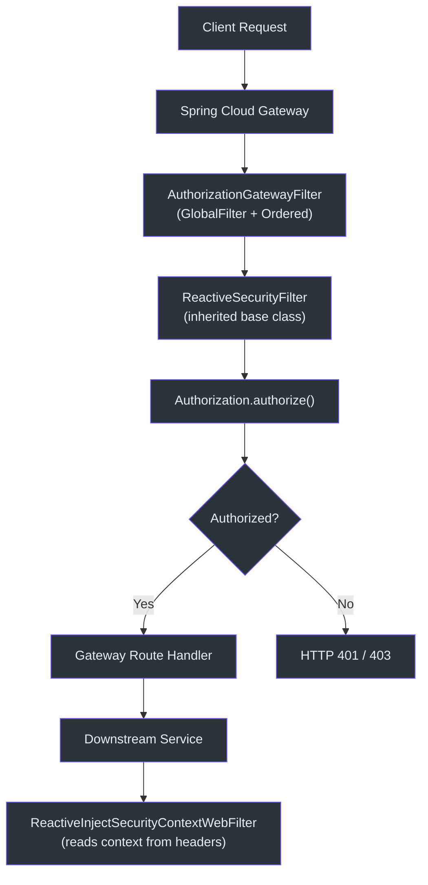
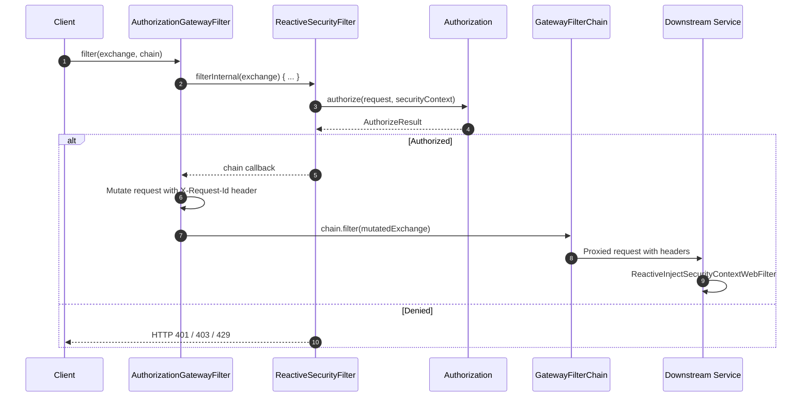
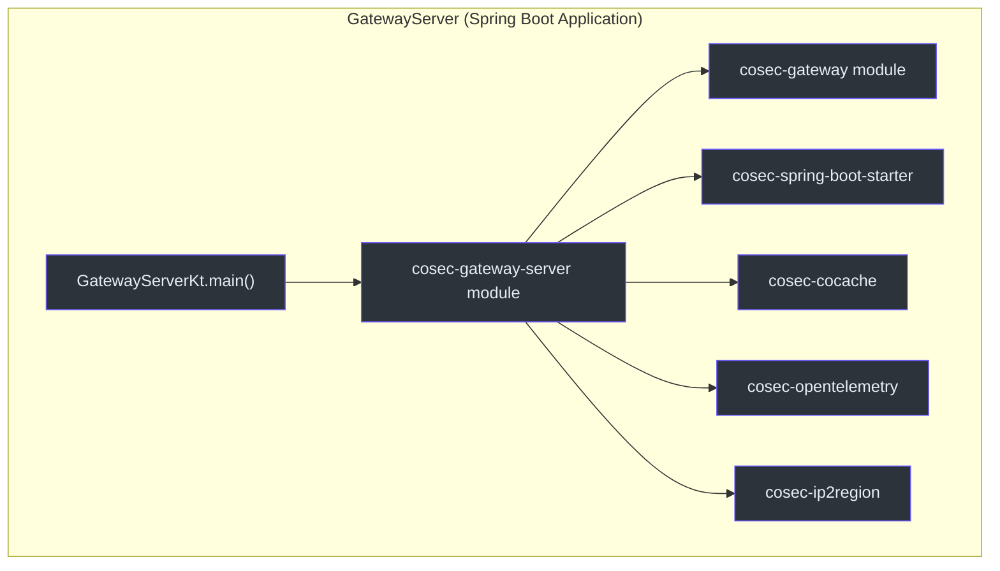
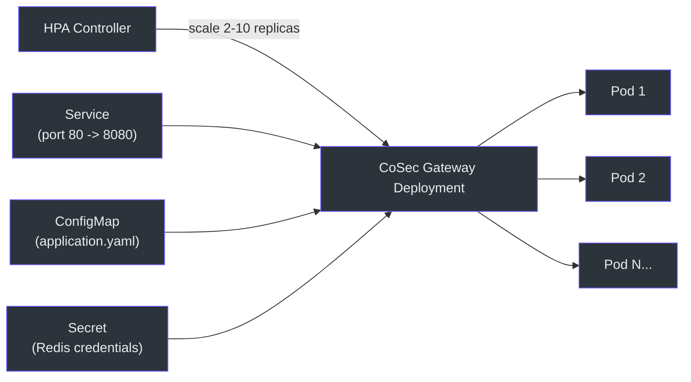

# Spring Cloud Gateway Integration

CoSec provides centralized authorization at the API gateway layer through a `GlobalFilter` implementation. Every request passing through the gateway is authorized before being routed to downstream services, which then use inject-only filters to pick up the security context.

## Architecture Overview



## Core Components

### AuthorizationGatewayFilter

The central filter that performs authorization at the gateway. It implements `GlobalFilter` and `Ordered`, and extends `ReactiveSecurityFilter`.

```kotlin
class AuthorizationGatewayFilter(
    securityContextParser: SecurityContextParser,
    requestParser: RequestParser<ServerWebExchange>,
    authorization: Authorization
) : GlobalFilter, Ordered,
    ReactiveSecurityFilter(securityContextParser, requestParser, authorization)
```

Key characteristics:

- **Filter order**: `Ordered.HIGHEST_PRECEDENCE + 10` -- runs very early in the gateway filter chain, ensuring authorization is checked before route-specific filters.
- **Request ID propagation**: After successful authorization, it mutates the exchange to add the `X-Request-Id` header so downstream services can correlate requests.
- Inherits all authorization logic from `ReactiveSecurityFilter.filterInternal()`.



### CoSecGatewayAuthorizationAutoConfiguration

Auto-configuration that registers the `AuthorizationGatewayFilter` as a Spring bean. It is conditionally activated when:

- `@ConditionalOnCoSecEnabled` -- `cosec.enabled=true` (default)
- `@ConditionalOnAuthorizationEnabled` -- `cosec.authorization.enabled=true`
- `@ConditionalOnGatewayEnabled` -- `cosec.authorization.gateway.enabled=true`
- `@ConditionalOnClass(AuthorizationGatewayFilter::class)` -- the gateway module is on the classpath

### GatewayServer

The standalone gateway application entry point. It is a standard `@SpringBootApplication` that pulls in all CoSec modules.



## Kubernetes Deployment

The gateway is deployed as a containerized application on Kubernetes with health probes, resource limits, and horizontal pod autoscaling.

### Gateway Configuration (ConfigMap)

The `application.yaml` ConfigMap configures routes, CORS, and CoSec-specific settings:

```yaml
cosec:
  authentication:
    enabled: false
  jwt:
    algorithm: hmac256
    secret: FyN0Igd80Gas8stTavArGKOYnS9uLWGA_
  ip2region:
    enabled: false
  authorization:
    local-policy:
      enabled: true
      init-repository: true
    cache:
      policy:
        maximum-size: 100000
      role:
        maximum-size: 100000
```

### Health Probes

The deployment uses three levels of probes:

| Probe Type | Endpoint | Purpose |
|------------|----------|---------|
| `startupProbe` | `/actuator/health` | Confirm the application has started |
| `readinessProbe` | `/actuator/health/readiness` | Ready to receive traffic |
| `livenessProbe` | `/actuator/health/liveness` | Application is still alive |

### Horizontal Pod Autoscaler

The HPA scales between 2 and 10 replicas based on CPU utilization.



## References

- [cosec-gateway/src/main/kotlin/me/ahoo/cosec/gateway/AuthorizationGatewayFilter.kt:31](https://github.com/Ahoo-Wang/CoSec/blob/main/cosec-gateway/src/main/kotlin/me/ahoo/cosec/gateway/AuthorizationGatewayFilter.kt#L31) -- Gateway filter implementation
- [cosec-spring-boot-starter/src/main/kotlin/.../CoSecGatewayAuthorizationAutoConfiguration.kt:43](https://github.com/Ahoo-Wang/CoSec/blob/main/cosec-spring-boot-starter/src/main/kotlin/me/ahoo/cosec/spring/boot/starter/authorization/gateway/CoSecGatewayAuthorizationAutoConfiguration.kt#L43) -- Auto-configuration
- [cosec-gateway-server/src/main/kotlin/.../GatewayServer.kt:24](https://github.com/Ahoo-Wang/CoSec/blob/main/cosec-gateway-server/src/main/kotlin/me/ahoo/cosec/gateway/server/GatewayServer.kt#L24) -- Application entry point
- [k8s/cosec-gateway-deployment.yml](https://github.com/Ahoo-Wang/CoSec/blob/main/k8s/cosec-gateway-deployment.yml) -- Kubernetes deployment
- [k8s/cosec-gateway-config.yaml](https://github.com/Ahoo-Wang/CoSec/blob/main/k8s/cosec-gateway-config.yaml) -- Gateway configuration

## Related Pages

- [Spring WebFlux Integration](./spring-webflux.md)
- [Redis Caching](./redis-caching.md)
- [OpenTelemetry Integration](./opentelemetry.md)
- [Deployment](../operations/deployment.md)
