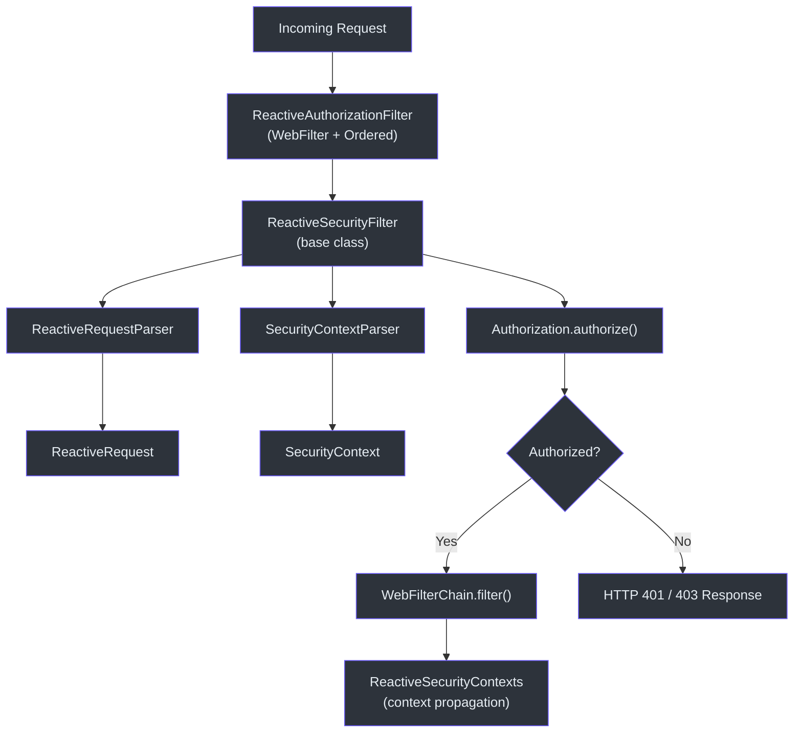
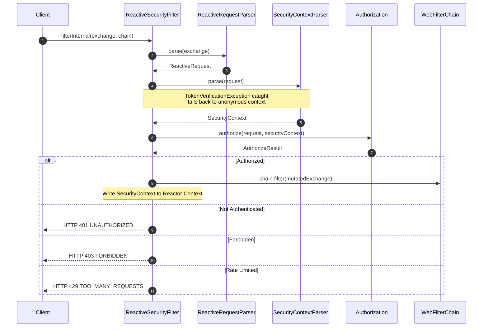
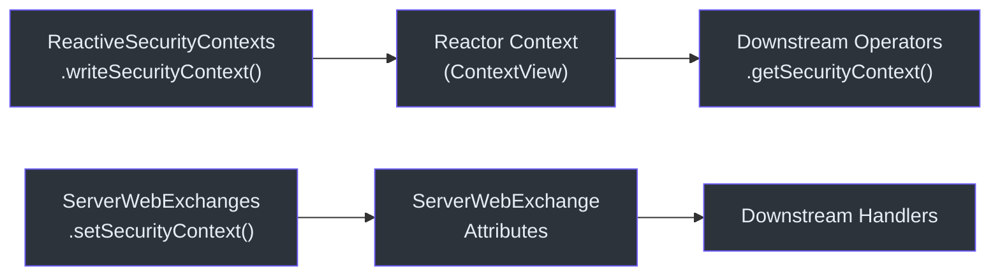
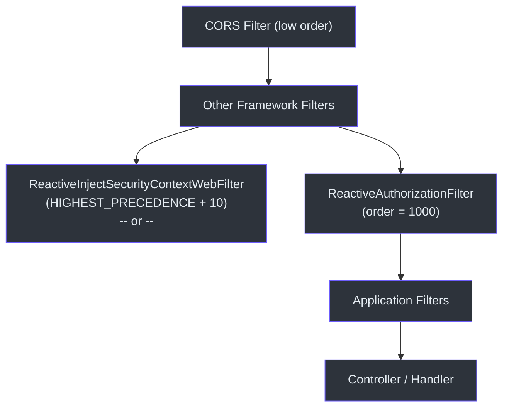

# Spring WebFlux Integration

CoSec provides first-class reactive integration with Spring WebFlux through a suite of filters and context-propagation utilities built on Project Reactor. Every request passes through a non-blocking authorization pipeline that preserves the reactive contract end to end.

## Architecture Overview



## Core Components

### ReactiveAuthorizationFilter

The entry point for WebFlux security. It implements both `WebFilter` and `Ordered` with an order of `1000`, placing it after framework filters (CORS, etc.) but before most application logic.

```kotlin
class ReactiveAuthorizationFilter(
    securityContextParser: SecurityContextParser,
    requestParser: RequestParser<ServerWebExchange>,
    authorization: Authorization
) : ReactiveSecurityFilter(securityContextParser, requestParser, authorization),
    WebFilter,
    Ordered
```

- **Order**: `REACTIVE_AUTHORIZATION_FILTER_ORDER = 1000` -- runs after CORS and other infrastructure filters.
- Delegates the real work to [ReactiveSecurityFilter.filterInternal](#reactivesecurityfilter).
- On success, calls `chain.filter(exchange)` so downstream handlers receive an enriched exchange with the principal set.

### ReactiveSecurityFilter

The shared base class that contains all authorization logic. It is also extended by the Spring Cloud Gateway integration.



The `filterInternal` method handles:

1. **Request parsing** -- converts the `ServerWebExchange` into a CoSec `Request`.
2. **Token verification** -- catches `TokenVerificationException` and falls back to an anonymous `SimpleSecurityContext`.
3. **Authorization decision** -- calls `Authorization.authorize()` and maps the result to HTTP status codes.
4. **Error handling** -- maps `TooManyRequestsException` to 429 and unexpected errors to 500.

### ReactiveRequestParser

Converts a `ServerWebExchange` into a `ReactiveRequest`, extracting path, method, remote IP, origin, referer, and request ID. It also applies any registered `RequestAttributesAppender` instances (e.g., IP geolocation).

### ReactiveRequest

An immutable data class that wraps a `ServerWebExchange` and implements CoSec's `Request` interface. It provides lazy access to headers, query parameters, and cookies from the underlying exchange.

### ReactiveSecurityContexts

Utility object for propagating the `SecurityContext` through Reactor's `Context`:



Two propagation channels are used in parallel:

| Channel | Mechanism | Use Case |
|---------|-----------|----------|
| Reactor `Context` | `contextWrite { it.setSecurityContext(ctx) }` | Reactive operators within the same chain |
| `ServerWebExchange` attributes | `exchange.setSecurityContext(ctx)` | Direct access in downstream handlers |

### ReactiveInjectSecurityContextWebFilter

Designed for downstream services behind an API gateway. Instead of performing authorization, it injects the security context from request headers (set by the upstream gateway) without token verification. This avoids redundant JWT verification in microservice-to-microservice calls.

## Filter Chain Order



Choose between `ReactiveAuthorizationFilter` and `ReactiveInjectSecurityContextWebFilter` based on whether the service is a front-line service or a downstream microservice.

## References

- [cosec-webflux/src/main/kotlin/me/ahoo/cosec/webflux/ReactiveAuthorizationFilter.kt:36](https://github.com/Ahoo-Wang/CoSec/blob/main/cosec-webflux/src/main/kotlin/me/ahoo/cosec/webflux/ReactiveAuthorizationFilter.kt#L36) -- Filter entry point
- [cosec-webflux/src/main/kotlin/me/ahoo/cosec/webflux/ReactiveSecurityFilter.kt:57](https://github.com/Ahoo-Wang/CoSec/blob/main/cosec-webflux/src/main/kotlin/me/ahoo/cosec/webflux/ReactiveSecurityFilter.kt#L57) -- Base class with `filterInternal`
- [cosec-webflux/src/main/kotlin/me/ahoo/cosec/webflux/ReactiveRequestParser.kt:27](https://github.com/Ahoo-Wang/CoSec/blob/main/cosec-webflux/src/main/kotlin/me/ahoo/cosec/webflux/ReactiveRequestParser.kt#L27) -- Request parsing
- [cosec-webflux/src/main/kotlin/me/ahoo/cosec/webflux/ReactiveRequest.kt:22](https://github.com/Ahoo-Wang/CoSec/blob/main/cosec-webflux/src/main/kotlin/me/ahoo/cosec/webflux/ReactiveRequest.kt#L22) -- Request data class
- [cosec-webflux/src/main/kotlin/me/ahoo/cosec/webflux/ReactiveSecurityContexts.kt:21](https://github.com/Ahoo-Wang/CoSec/blob/main/cosec-webflux/src/main/kotlin/me/ahoo/cosec/webflux/ReactiveSecurityContexts.kt#L21) -- Context propagation

## Related Pages

- [Spring WebMVC Integration](./spring-webmvc.md)
- [Spring Cloud Gateway Integration](./spring-cloud-gateway.md)
- [Auto-Configuration](../extending/auto-configuration.md)
- [Testing](../operations/testing.md)
