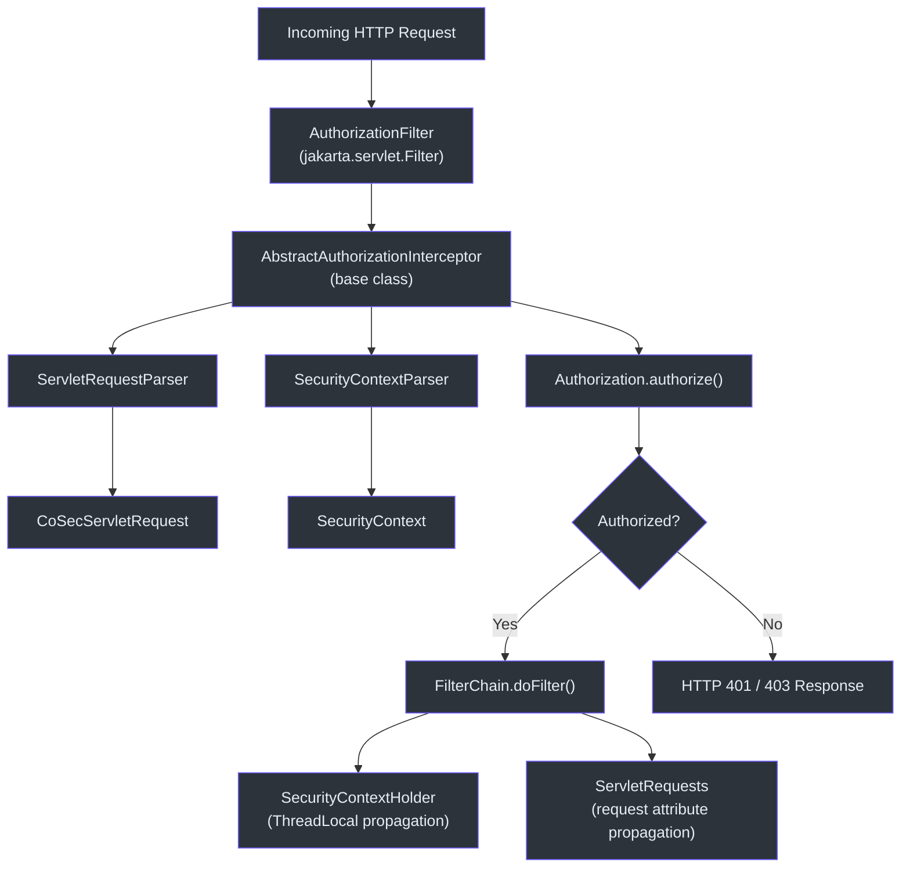
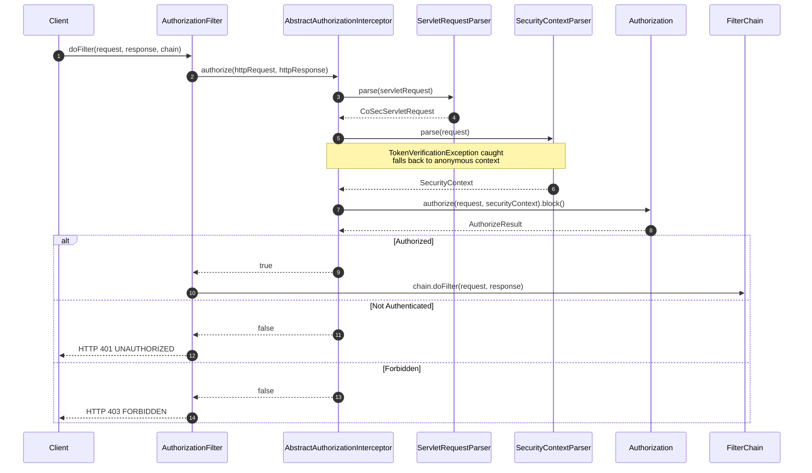
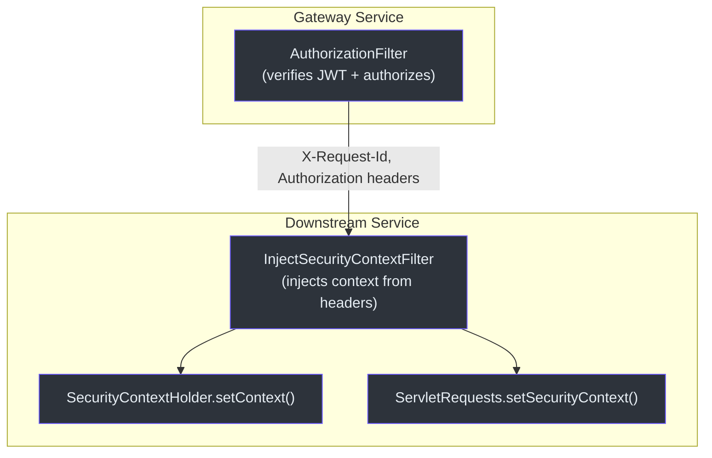

# Spring WebMVC Integration

CoSec provides a servlet-based integration path for traditional Spring MVC applications through `jakarta.servlet.Filter` implementations. The servlet integration mirrors the reactive WebFlux integration but uses thread-local context propagation instead of Reactor Context.

## Architecture Overview

## Core Components

### AuthorizationFilter

The servlet filter entry point. It implements `jakarta.servlet.Filter` and extends `AbstractAuthorizationInterceptor` to perform authorization checks on every incoming request.

Key behaviors of `AuthorizationFilter.doFilter`:

1. **Delegates** to `AbstractAuthorizationInterceptor.authorize()`.
2. **Catches** `TooManyRequestsException` and returns HTTP 429.
3. **Catches** unexpected exceptions, logs an error, and returns HTTP 500.
4. On successful authorization, calls `chain.doFilter(request, response)`.

### AbstractAuthorizationInterceptor

The base class containing the authorization algorithm. It mirrors the logic in `ReactiveSecurityFilter` -- any changes here should be reflected in the reactive counterpart.

The `authorize()` method:

1. Parses the servlet request into a CoSec `Request` via `ServletRequestParser`.
2. Parses the `SecurityContext` via `SecurityContextParser`, catching `TokenVerificationException`.
3. Stores the context in both `SecurityContextHolder` (thread-local) and as a request attribute.
4. Sets the `X-Request-Id` response header.
5. Calls `authorization.authorize()` and blocks on the result (`.block()`).
6. Returns `false` if denied, `true` if allowed.

### ServletRequestParser

Converts a `jakarta.servlet.http.HttpServletRequest` into a `CoSecServletRequest`, extracting path (via `servletPath`), method, remote IP, origin, referer, and request ID. It also applies registered `RequestAttributesAppender` instances.

### CoSecServletRequest

An immutable data class wrapping an `HttpServletRequest`. Implements CoSec's `Request` interface and `Delegated<HttpServletRequest>`, providing access to headers, query parameters, and cookies from the underlying servlet request.

### InjectSecurityContextFilter

The servlet counterpart of `ReactiveInjectSecurityContextWebFilter`. Designed for downstream services behind an API gateway that have already performed authorization. It uses `SecurityContextParser.ensureParse()` to extract the security context from request headers without token verification.

### SecurityContextHolder

A thread-local holder for the current security context. Uses `InheritableThreadLocal` so child threads inherit the parent's context. Provides static methods `setContext()`, `context`, `requiredContext`, and `remove()`.

## Context Propagation

Unlike the reactive integration which uses Reactor's `Context`, the servlet integration uses two parallel channels:

| Channel | Mechanism | Scope |
|---------|-----------|-------|
| `SecurityContextHolder` | `InheritableThreadLocal` | Current thread and child threads |
| `HttpServletRequest` attributes | `request.setAttribute()` | Current request lifecycle |

Both are set in `AbstractAuthorizationInterceptor.authorize()` so downstream code can access the security context via either mechanism.

## References

- [cosec-webmvc/src/main/kotlin/me/ahoo/cosec/servlet/AuthorizationFilter.kt:42](https://github.com/Ahoo-Wang/CoSec/blob/main/cosec-webmvc/src/main/kotlin/me/ahoo/cosec/servlet/AuthorizationFilter.kt#L42) -- Servlet filter entry point
- [cosec-webmvc/src/main/kotlin/me/ahoo/cosec/servlet/AbstractAuthorizationInterceptor.kt:51](https://github.com/Ahoo-Wang/CoSec/blob/main/cosec-webmvc/src/main/kotlin/me/ahoo/cosec/servlet/AbstractAuthorizationInterceptor.kt#L51) -- Base interceptor with authorization logic
- [cosec-webmvc/src/main/kotlin/me/ahoo/cosec/servlet/ServletRequestParser.kt:31](https://github.com/Ahoo-Wang/CoSec/blob/main/cosec-webmvc/src/main/kotlin/me/ahoo/cosec/servlet/ServletRequestParser.kt#L31) -- Request parsing
- [cosec-webmvc/src/main/kotlin/me/ahoo/cosec/servlet/CoSecServletRequest.kt:22](https://github.com/Ahoo-Wang/CoSec/blob/main/cosec-webmvc/src/main/kotlin/me/ahoo/cosec/servlet/CoSecServletRequest.kt#L22) -- Request data class
- [cosec-webmvc/src/main/kotlin/me/ahoo/cosec/servlet/InjectSecurityContextFilter.kt:40](https://github.com/Ahoo-Wang/CoSec/blob/main/cosec-webmvc/src/main/kotlin/me/ahoo/cosec/servlet/InjectSecurityContextFilter.kt#L40) -- Downstream context injection
- [cosec-core/src/main/kotlin/me/ahoo/cosec/context/SecurityContextHolder.kt:26](https://github.com/Ahoo-Wang/CoSec/blob/main/cosec-core/src/main/kotlin/me/ahoo/cosec/context/SecurityContextHolder.kt#L26) -- Thread-local context holder

## Related Pages

- [Spring WebFlux Integration](./spring-webflux.md)
- [Spring Cloud Gateway Integration](./spring-cloud-gateway.md)
- [Auto-Configuration](../extending/auto-configuration.md)
- [Testing](../operations/testing.md)
