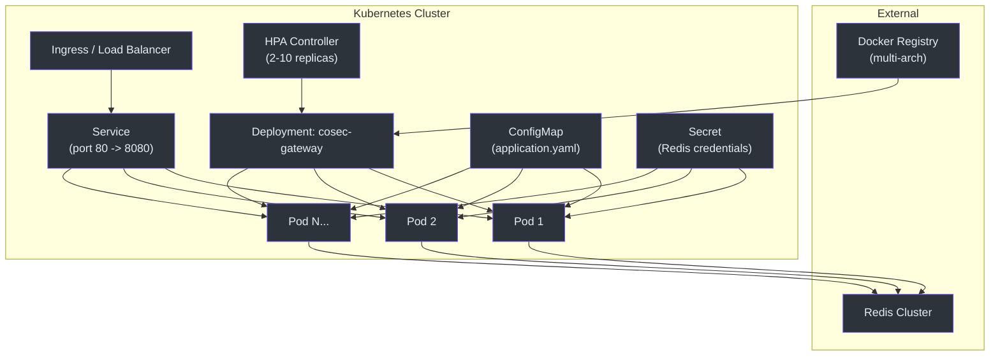
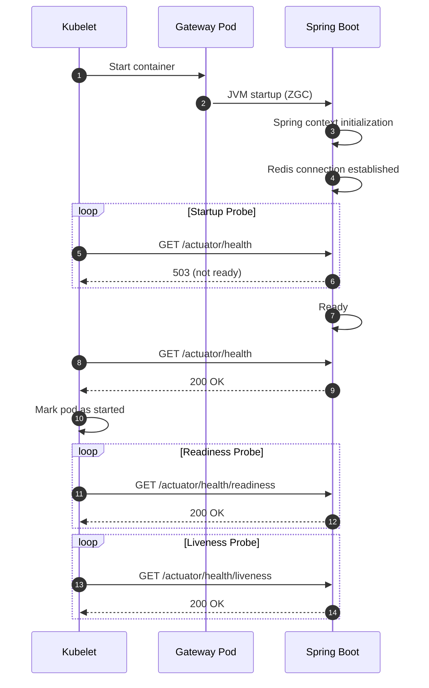
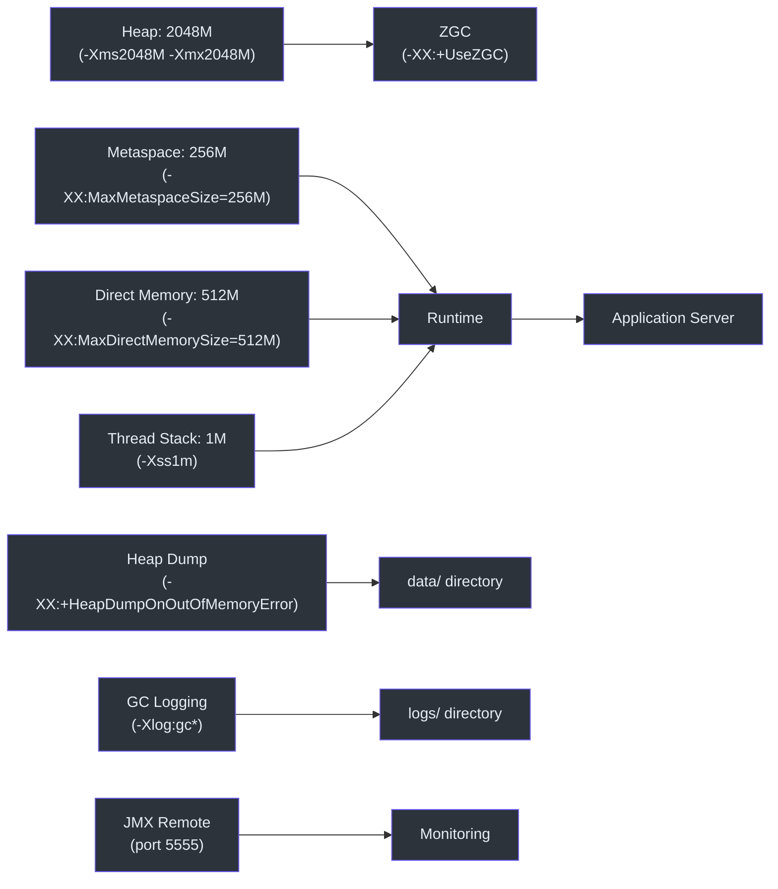
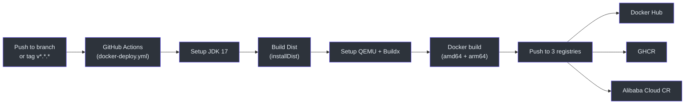

# Deployment

CoSec Gateway is deployed as a containerized Spring Boot application on Kubernetes. The deployment includes multi-architecture Docker images, health probes, horizontal pod autoscaling, and externalized configuration.

## Deployment Architecture



## Docker Images

CoSec Gateway publishes multi-architecture Docker images supporting both `linux/amd64` and `linux/arm64`:

| Registry | Image |
|----------|-------|
| Docker Hub | `ahoowang/cosec-gateway` |
| GitHub Container Registry | `ghcr.io/ahoo-wang/cosec-gateway` |
| Alibaba Cloud CR | `registry.cn-shanghai.aliyuncs.com/ahoo/cosec-gateway` |

Tags follow semver patterns: `{{version}}`, `{{major}}.{{minor}}`, branch names, and PR numbers.

## Kubernetes Resources

### Deployment

The gateway deployment specifies resource limits, health probes, and volume mounts:

```yaml
spec:
  containers:
    - image: registry.cn-shanghai.aliyuncs.com/ahoo/cosec-gateway:2.0.1
      startupProbe:
        httpGet: { port: http, path: /actuator/health }
      readinessProbe:
        httpGet: { port: http, path: /actuator/health/readiness }
      livenessProbe:
        httpGet: { port: http, path: /actuator/health/liveness }
      resources:
        limits: { cpu: "4", memory: 2816Mi }
        requests: { cpu: 500m, memory: 2048Mi }
```



### Service

A Kubernetes Service exposing port 80 mapped to container port 8080:

```yaml
spec:
  ports:
    - name: http
      port: 80
      targetPort: 8080
```

### Horizontal Pod Autoscaler

Scales between 2 and 10 replicas based on CPU utilization:

```yaml
spec:
  minReplicas: 2
  maxReplicas: 10
  metrics:
    - type: Resource
      resource:
        name: cpu
        target:
          type: Utilization
          averageUtilization: 600
```

### ConfigMap

Externalized configuration mounted at `/opt/cosec-gateway-server/config/`:

```yaml
data:
  application.yaml: |
    server:
      port: 8080
    cosec:
      jwt:
        algorithm: hmac256
        secret: FyN0Igd80Gas8stTavArGKOYnS9uLWGA_
      authorization:
        cache:
          policy:
            maximum-size: 100000
          role:
            maximum-size: 100000
```

## JVM Configuration

The gateway uses ZGC (Z Garbage Collector) with the following JVM options:



ZGC is chosen for its low-latency pause times, which is critical for an authorization gateway that must respond in microseconds.

## CI/CD Pipeline



The pipeline triggers on:
- Push to any branch
- Tags matching `v*.*.*`
- Pull requests to `main`
- Scheduled daily build (10:00 UTC)

## References

- [k8s/cosec-gateway-deployment.yml](https://github.com/Ahoo-Wang/CoSec/blob/main/k8s/cosec-gateway-deployment.yml) -- Kubernetes deployment
- [k8s/cosec-gateway-config.yaml](https://github.com/Ahoo-Wang/CoSec/blob/main/k8s/cosec-gateway-config.yaml) -- Gateway configuration
- [k8s/cosec-gateway-hpa.yaml](https://github.com/Ahoo-Wang/CoSec/blob/main/k8s/cosec-gateway-hpa.yaml) -- Horizontal pod autoscaler
- [k8s/cosec-gateway-service.yaml](https://github.com/Ahoo-Wang/CoSec/blob/main/k8s/cosec-gateway-service.yaml) -- Kubernetes service
- [.github/workflows/docker-deploy.yml](https://github.com/Ahoo-Wang/CoSec/blob/main/.github/workflows/docker-deploy.yml) -- CI/CD pipeline
- [cosec-gateway-server/build.gradle.kts:35](https://github.com/Ahoo-Wang/CoSec/blob/main/cosec-gateway-server/build.gradle.kts#L35) -- JVM options

## Related Pages

- [Spring Cloud Gateway Integration](../integrations/spring-cloud-gateway.md)
- [Redis Caching](../integrations/redis-caching.md)
- [OpenTelemetry Integration](../integrations/opentelemetry.md)
- [Performance](./performance.md)
