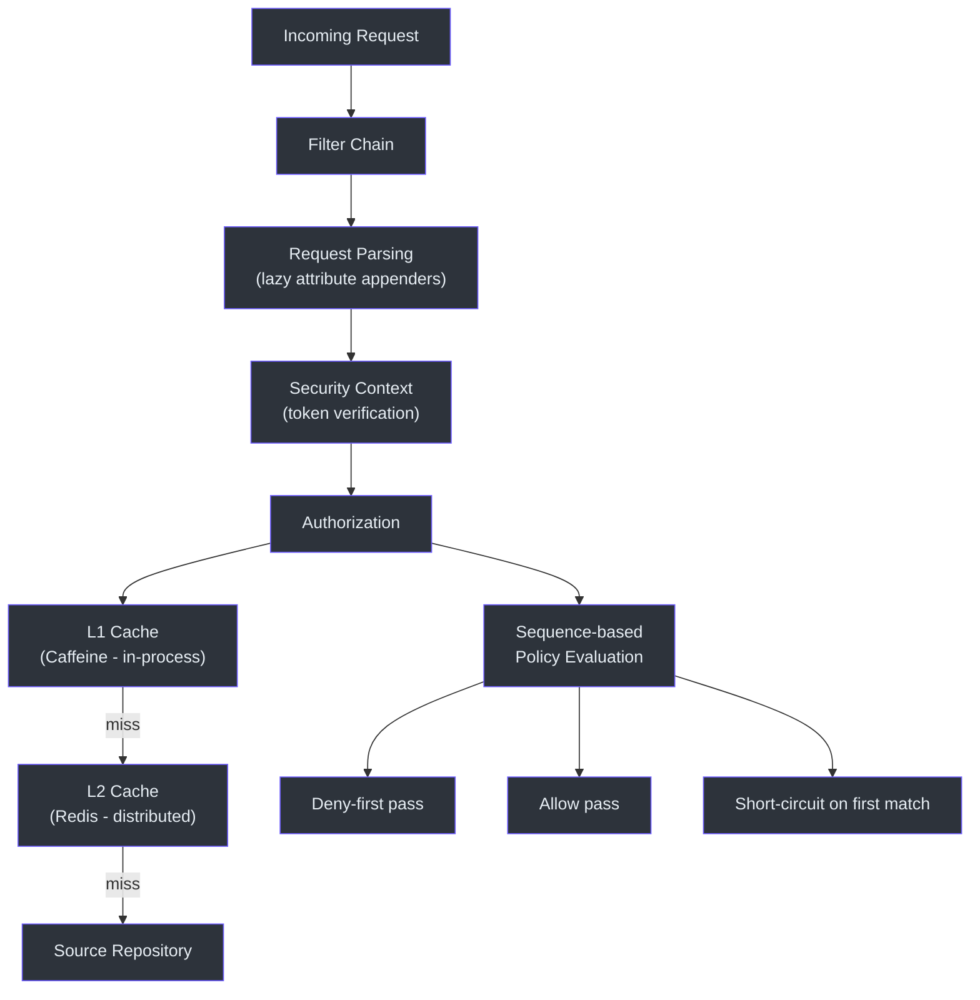
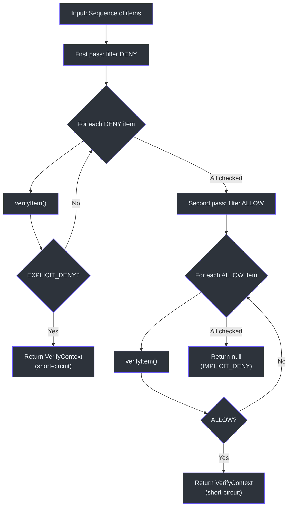
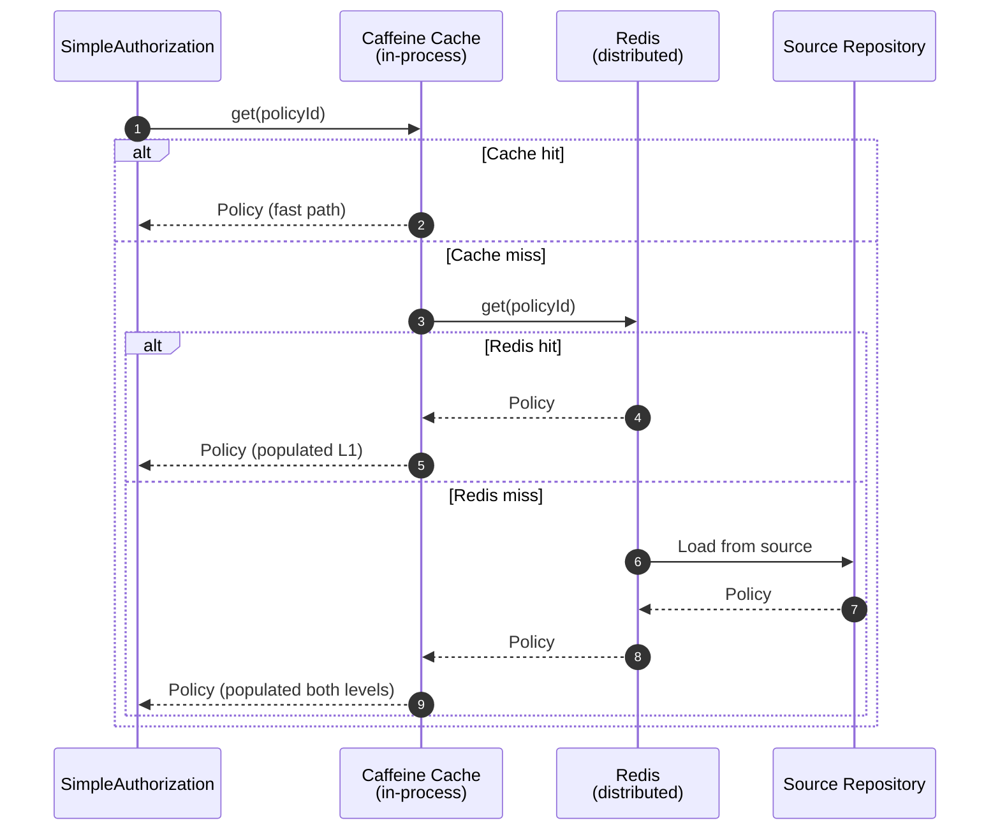

# Performance

CoSec is designed for high-throughput, low-latency authorization decisions at the API gateway layer. Performance is achieved through sequence-based lazy evaluation, multi-level caching, and efficient path matching using Spring's `PathPattern` parser.

## Performance Architecture



## Sequence-Based Evaluation

A key performance optimization (commit `de927e6`) replaced `List`-based policy evaluation with Kotlin `Sequence`-based evaluation. This change eliminates intermediate collection allocations during the deny-first algorithm.

### Before vs. After

```mermaid
flowchart TD
    subgraph "Before: List-based (eager)"
        A1["List of all policies"] --> B1["flatMap to List of statements"]
        B1 --> C1["filter DENY statements -> new List"]
        C1 --> D1["forEach DENY -> verify"]
        B1 --> E1["filter ALLOW statements -> new List"]
        E1 --> F1["forEach ALLOW -> verify"]
    end
    subgraph "After: Sequence-based (lazy)"
        A2["Sequence of matched policies"] --> B2["flatMap to Sequence of statements"]
        B2 --> C2["filter DENY (lazy)"]
        C2 --> D2["forEach DENY -> verify (short-circuit)"]
        B2 --> E2["filter ALLOW (lazy)"]
        E2 --> F2["forEach ALLOW -> verify (short-circuit)"]
    end

    style A1 fill:#2d333b,stroke:#6d5dfc,color:#e6edf3
    style B1 fill:#2d333b,stroke:#6d5dfc,color:#e6edf3
    style C1 fill:#2d333b,stroke:#6d5dfc,color:#e6edf3
    style D1 fill:#2d333b,stroke:#6d5dfc,color:#e6edf3
    style E1 fill:#2d333b,stroke:#6d5dfc,color:#e6edf3
    style F1 fill:#2d333b,stroke:#6d5dfc,color:#e6edf3
    style A2 fill:#2d333b,stroke:#6d5dfc,color:#e6edf3
    style B2 fill:#2d333b,stroke:#6d5dfc,color:#e6edf3
    style C2 fill:#2d333b,stroke:#6d5dfc,color:#e6edf3
    style D2 fill:#2d333b,stroke:#6d5dfc,color:#e6edf3
    style E2 fill:#2d333b,stroke:#6d5dfc,color:#e6edf3
    style F2 fill:#2d333b,stroke:#6d5dfc,color:#e6edf3

```



The `evaluateDenyFirst` function in `SimpleAuthorization` operates on a `Sequence<T>`, which means:

1. **No intermediate collections** -- `filter` and `flatMap` return lazy sequences.
2. **Short-circuit evaluation** -- the first DENY match stops iteration immediately.
3. **Two-pass design** -- DENY statements are evaluated first, then ALLOW statements, guaranteeing that deny rules always take precedence.

### The evaluateDenyFirst Algorithm



## JMH Benchmarks

CoSec includes JMH (Java Microbenchmark Harness) benchmarks in every module via the `me.champeau.jmh` Gradle plugin.

### PathPatternBenchmark

Benchmarks the performance of Spring `PathPattern` matching, which is the core operation in `PathActionMatcher`:

```kotlin
open class PathPatternBenchmark {
    @Benchmark
    fun matches(): Boolean {
        return PathPatternTest.matches()
    }

    @Benchmark
    fun matchAndExtract(): PathPattern.PathMatchInfo? {
        return PathPatternTest.matchAndExtract()
    }
}
```

Two benchmark methods measure:
- **`matches()`** -- pure boolean match check (fast path for deny evaluation).
- **`matchAndExtract()`** -- match with path variable extraction (used when path parameters are needed for conditions).

### Running Benchmarks

```bash
# Run all benchmarks in cosec-core
./gradlew :cosec-core:jmh

# Run a specific benchmark
./gradlew :cosec-core:jmh -PjmhIncludes=*.PathPatternBenchmark

# Run with custom JMH options
./gradlew :cosec-core:jmh -PjmhIncludes="*" -PjmhParams="mode=avgt"
```

## Caching Strategies

### Multi-Level Cache (CoCache + Redis)



Cache configuration supports up to 100,000 entries per cache:

```yaml
cosec:
  authorization:
    cache:
      policy:
        maximum-size: 100000
      role:
        maximum-size: 100000
```

### Cache Sizing

| Cache | Max Size | Key | Value |
|-------|----------|-----|-------|
| PolicyCache | 100,000 | Policy ID | Serialized Policy |
| GlobalPolicyIndexCache | 1 (fixed key) | `""` | Set of global policy IDs |
| AppPermissionCache | 100,000 | AppId | AppPermission |
| RolePermissionCache | 100,000 | SpacedRoleId | Set of PermissionId |

## Performance-Related Commits

Recent performance optimizations in the codebase:

- `de927e6` -- `refactor(authorization): optimize performance by using sequences instead of lists`
- `7e9bf7d` -- `perf(cosec-opentelemetry): optimize attribute population in CoSecInstrumenter`
- `62c672e` -- `feat(cosec-gateway-server): add cache configuration for policy and role`
- `ba7db16` -- `Refactor: Enhance Statement.verify performance`

## References

- [cosec-core/src/jmh/kotlin/me/ahoo/cosec/policy/action/PathPatternBenchmark.kt:19](https://github.com/Ahoo-Wang/CoSec/blob/main/cosec-core/src/jmh/kotlin/me/ahoo/cosec/policy/action/PathPatternBenchmark.kt#L19) -- JMH benchmark
- [cosec-core/src/main/kotlin/me/ahoo/cosec/authorization/SimpleAuthorization.kt:61](https://github.com/Ahoo-Wang/CoSec/blob/main/cosec-core/src/main/kotlin/me/ahoo/cosec/authorization/SimpleAuthorization.kt#L61) -- Sequence-based evaluateDenyFirst
- [cosec-cocache/src/main/kotlin/me/ahoo/cosec/cache/RedisPolicyRepository.kt:26](https://github.com/Ahoo-Wang/CoSec/blob/main/cosec-cocache/src/main/kotlin/me/ahoo/cosec/cache/RedisPolicyRepository.kt#L26) -- Cached policy repository
- [k8s/cosec-gateway-config.yaml](https://github.com/Ahoo-Wang/CoSec/blob/main/k8s/cosec-gateway-config.yaml) -- Cache configuration
- [cosec-gateway-server/build.gradle.kts:35](https://github.com/Ahoo-Wang/CoSec/blob/main/cosec-gateway-server/build.gradle.kts#L35) -- JVM performance options

## Related Pages

- [Redis Caching](../integrations/redis-caching.md)
- [OpenTelemetry Integration](../integrations/opentelemetry.md)
- [Deployment](./deployment.md)
- [Testing](./testing.md)
