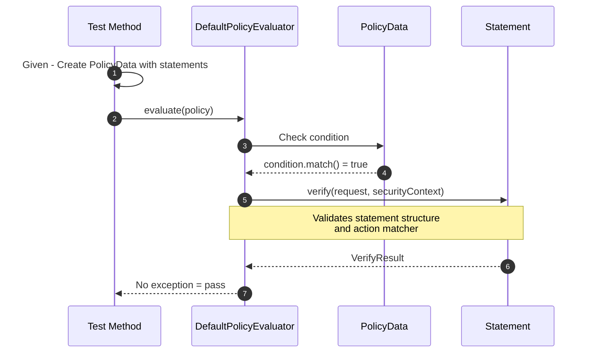
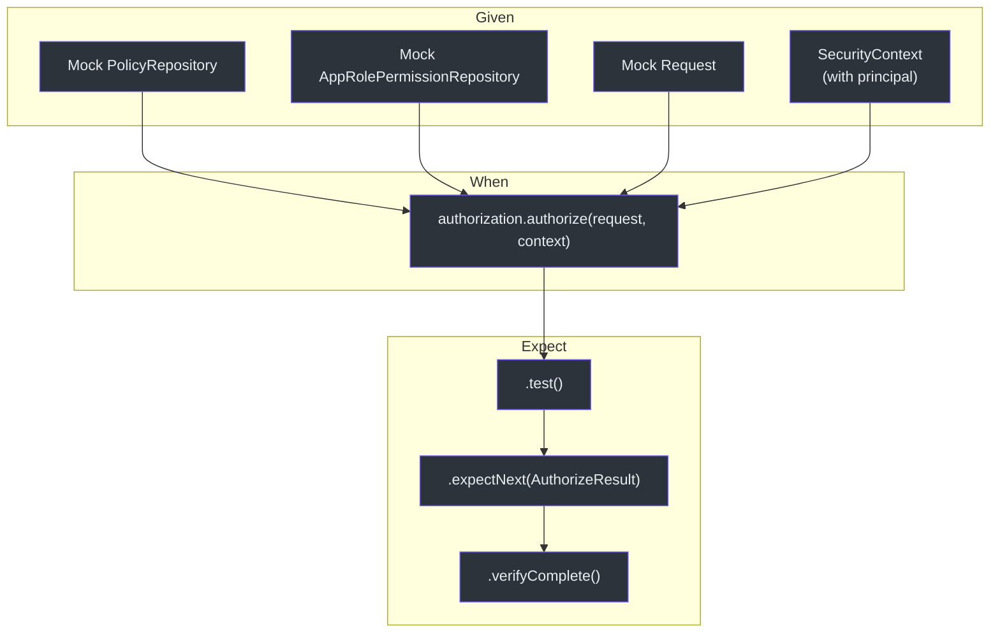
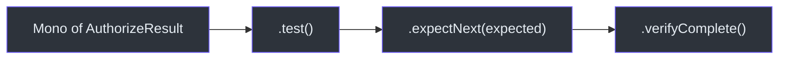

# Testing

CoSec uses a comprehensive testing stack built on JUnit 5, MockK, FluentAssert, Hamcrest, and Reactor Test. Tests follow a clear Given-When-Expect pattern and leverage type-safe fluent assertions.

## Testing Stack

| Library | Purpose |
|---------|---------|
| JUnit 5 | Test framework (`@Test`, `@ParameterizedTest`) |
| MockK | Kotlin-native mocking (`mockk`, `every`) |
| FluentAssert | Fluent assertions (`me.ahoo.test.asserts.assert`) |
| Hamcrest | Matcher assertions (`assertThat`, `instanceOf`, `equalTo`) |
| Reactor Test | Reactive step verification (`.test()`, `expectNext`, `verifyComplete`) |

## Testing Policy Evaluation

### DefaultPolicyEvaluatorTest

Tests that policies can be evaluated without errors. Uses `EvaluateRequest` fixtures to simulate requests.



Key test patterns:

```kotlin
@Test
fun evaluateDefaultRequest() {
    var evaluateRequest: Request = EvaluateRequest()
    evaluateRequest.method.assert().isEqualTo("POST")
    evaluateRequest.remoteIp.assert().isEqualTo("127.0.0.1")
    evaluateRequest.attributes.assert().isEmpty()
}

@Test
fun safeEvaluateSwallowsTooManyRequestsException() {
    var executed = false
    DefaultPolicyEvaluator.safeEvaluate {
        executed = true
        throw TooManyRequestsException()
    }
    assertThat(executed, equalTo(true))
}
```

## Testing Authorization

### SimpleAuthorizationTest

Tests the complete authorization flow with mocked dependencies. Uses `reactor.kotlin.test.test()` for reactive verification.



### Root User Test

```kotlin
@Test
fun authorizeWhenPrincipalIsRoot() {
    val authorization = SimpleAuthorization(policyRepository, permissionRepository)
    val securityContext = mockk<SecurityContext> {
        every { principal.id } returns CoSecPrincipal.ROOT_ID
    }
    authorization.authorize(request, securityContext)
        .test()
        .expectNext(AuthorizeResult.ALLOW)
        .verifyComplete()
}
```

### Empty Policy Test

```kotlin
@Test
fun authorizeWhenPolicyIsEmpty() {
    val policyRepository = mockk<PolicyRepository> {
        every { getGlobalPolicy() } returns Mono.empty()
        every { getPolicies(any()) } returns Mono.empty()
    }
    val authorization = SimpleAuthorization(policyRepository, permissionRepository)
    authorization.authorize(request, SimpleSecurityContext.anonymous())
        .test()
        .expectNext(AuthorizeResult.IMPLICIT_DENY)
        .verifyComplete()
}
```

### Global Policy Allow Test

```kotlin
@Test
fun authorizeWhenGlobalPolicyIsAllowAll() {
    val globalPolicy = mockk<Policy> {
        every { id } returns "globalPolicy"
        every { condition } returns AllConditionMatcher.INSTANCE
        every { statements } returns listOf(
            StatementData(effect = Effect.ALLOW, action = AllActionMatcher.INSTANCE)
        )
    }
    val policyRepository = mockk<PolicyRepository> {
        every { getGlobalPolicy() } returns Mono.just(listOf(globalPolicy))
        every { getPolicies(any()) } returns Mono.empty()
    }
    authorization.authorize(request, SimpleSecurityContext.anonymous())
        .test()
        .expectNext(AuthorizeResult.ALLOW)
        .verifyComplete()
}
```

## Testing with JWT Fixtures

The `JwtFixture` object provides a shared test algorithm for JWT-based tests:

```kotlin
object JwtFixture {
    var ALGORITHM = Algorithm.HMAC256("FyN0Igd80Gas8stTavArGKOYnS9uLWGA_")
}
```

This fixture is used across JWT token converter and verifier tests to ensure consistent signing behavior.

## Reactor Test Pattern

All reactive tests follow the `.test().expectNext().verifyComplete()` pattern:



## Running Tests

```bash
# Run all tests
./gradlew test

# Run tests for a single module
./gradlew :cosec-core:test
./gradlew :cosec-api:test

# Run a single test class
./gradlew :cosec-core:test --tests "me.ahoo.cosec.policy.DefaultPolicyEvaluatorTest"

# Run a single test method
./gradlew :cosec-core:test --tests "me.ahoo.cosec.authorization.SimpleAuthorizationTest.authorizeWhenPrincipalIsRoot"

# Generate code coverage report
./gradlew :code-coverage-report:codeCoverageReport
```

## References

- [cosec-core/src/test/kotlin/me/ahoo/cosec/policy/DefaultPolicyEvaluatorTest.kt:35](https://github.com/Ahoo-Wang/CoSec/blob/main/cosec-core/src/test/kotlin/me/ahoo/cosec/policy/DefaultPolicyEvaluatorTest.kt#L35) -- Policy evaluator tests
- [cosec-core/src/test/kotlin/me/ahoo/cosec/authorization/SimpleAuthorizationTest.kt:41](https://github.com/Ahoo-Wang/CoSec/blob/main/cosec-core/src/test/kotlin/me/ahoo/cosec/authorization/SimpleAuthorizationTest.kt#L41) -- Authorization tests
- [cosec-jwt/src/test/kotlin/me/ahoo/cosec/jwt/JwtFixture.kt:18](https://github.com/Ahoo-Wang/CoSec/blob/main/cosec-jwt/src/test/kotlin/me/ahoo/cosec/jwt/JwtFixture.kt#L18) -- JWT test fixture
- [cosec-core/src/main/kotlin/me/ahoo/cosec/authorization/SimpleAuthorization.kt:48](https://github.com/Ahoo-Wang/CoSec/blob/main/cosec-core/src/main/kotlin/me/ahoo/cosec/authorization/SimpleAuthorization.kt#L48) -- SimpleAuthorization (under test)
- [cosec-core/src/main/kotlin/me/ahoo/cosec/policy/DefaultPolicyEvaluator.kt](https://github.com/Ahoo-Wang/CoSec/blob/main/cosec-core/src/main/kotlin/me/ahoo/cosec/policy/DefaultPolicyEvaluator.kt) -- Policy evaluator (under test)

## Related Pages

- [Custom Matchers](../extending/custom-matchers.md)
- [Auto-Configuration](../extending/auto-configuration.md)
- [Performance](./performance.md)
- [Spring WebFlux Integration](../integrations/spring-webflux.md)
