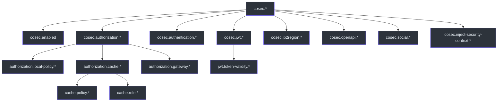
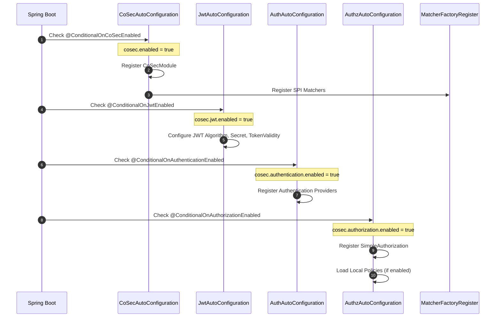
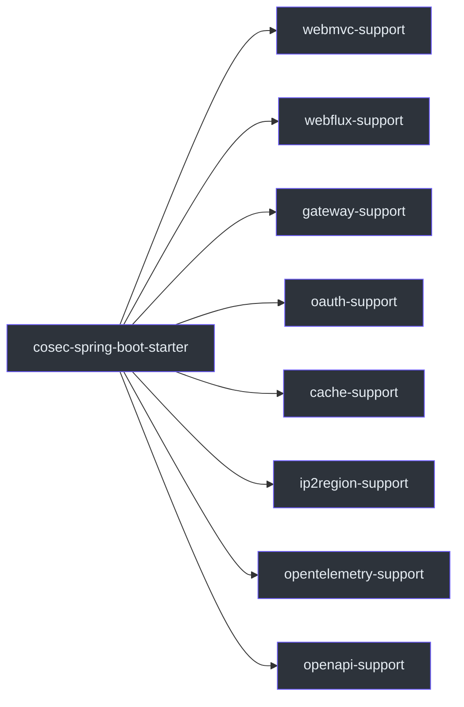

# Configuration Reference

CoSec uses Spring Boot's `@ConfigurationProperties` mechanism for type-safe configuration. All properties are prefixed with `cosec.` as defined by the `CoSec.COSEC_PREFIX` constant ([cosec-api/src/main/kotlin/me/ahoo/cosec/api/CoSec.kt:22](https://github.com/Ahoo-Wang/CoSec/blob/main/cosec-api/src/main/kotlin/me/ahoo/cosec/api/CoSec.kt#L22)).

## Configuration Hierarchy

The following diagram shows the configuration structure and the relationships between property groups:



## Core Properties

### `cosec.enabled`

Master switch for the entire CoSec framework. When set to `false`, all auto-configuration is skipped.

| Property | Type | Default |
|----------|------|---------|
| `cosec.enabled` | `Boolean` | `true` |

Defined in `CoSecProperties` ([cosec-spring-boot-starter/src/main/kotlin/me/ahoo/cosec/spring/boot/starter/CoSecProperties.kt:31](https://github.com/Ahoo-Wang/CoSec/blob/main/cosec-spring-boot-starter/src/main/kotlin/me/ahoo/cosec/spring/boot/starter/CoSecProperties.kt#L31)).

## JWT Properties (`cosec.jwt.*`)

Controls JWT token creation and verification.

| Property | Type | Default | Description |
|----------|------|---------|-------------|
| `cosec.jwt.enabled` | `Boolean` | `true` | Enable JWT authentication |
| `cosec.jwt.algorithm` | `Enum` | `hmac256` | Signing algorithm: `hmac256`, `hmac384`, `hmac512` |
| `cosec.jwt.secret` | `String` | *required* | Secret key for HMAC signing |
| `cosec.jwt.token-validity.access` | `Duration` | `PT10M` | Access token time-to-live (10 minutes) |
| `cosec.jwt.token-validity.refresh` | `Duration` | `P7D` | Refresh token time-to-live (7 days) |

Defined in `JwtProperties` ([cosec-spring-boot-starter/src/main/kotlin/me/ahoo/cosec/spring/boot/starter/jwt/JwtProperties.kt:28](https://github.com/Ahoo-Wang/CoSec/blob/main/cosec-spring-boot-starter/src/main/kotlin/me/ahoo/cosec/spring/boot/starter/jwt/JwtProperties.kt#L28)). Conditional activation is controlled by `@ConditionalOnJwtEnabled` ([cosec-spring-boot-starter/src/main/kotlin/me/ahoo/cosec/spring/boot/starter/jwt/ConditionalOnJwtEnabled.kt](https://github.com/Ahoo-Wang/CoSec/blob/main/cosec-spring-boot-starter/src/main/kotlin/me/ahoo/cosec/spring/boot/starter/jwt/ConditionalOnJwtEnabled.kt)).

## Authentication Properties (`cosec.authentication.*`)

| Property | Type | Default | Description |
|----------|------|---------|-------------|
| `cosec.authentication.enabled` | `Boolean` | `true` | Enable authentication |

Defined in `AuthenticationProperties` ([cosec-spring-boot-starter/src/main/kotlin/me/ahoo/cosec/spring/boot/starter/authentication/AuthenticationProperties.kt:26](https://github.com/Ahoo-Wang/CoSec/blob/main/cosec-spring-boot-starter/src/main/kotlin/me/ahoo/cosec/spring/boot/starter/authentication/AuthenticationProperties.kt#L26)).

## Authorization Properties (`cosec.authorization.*`)

Controls the authorization engine and policy loading behavior.

| Property | Type | Default | Description |
|----------|------|---------|-------------|
| `cosec.authorization.enabled` | `Boolean` | `true` | Enable authorization |
| `cosec.authorization.local-policy.enabled` | `Boolean` | `false` | Load policies from local JSON files |
| `cosec.authorization.local-policy.locations` | `Set<String>` | `classpath:cosec-policy/*-policy.json` | Glob patterns for policy file locations |
| `cosec.authorization.local-policy.init-repository` | `Boolean` | `false` | Initialize the policy repository with local files on startup |
| `cosec.authorization.local-policy.force-refresh` | `Boolean` | `false` | Force refresh of local policies on startup |

Defined in `AuthorizationProperties` ([cosec-spring-boot-starter/src/main/kotlin/me/ahoo/cosec/spring/boot/starter/authorization/AuthorizationProperties.kt:27](https://github.com/Ahoo-Wang/CoSec/blob/main/cosec-spring-boot-starter/src/main/kotlin/me/ahoo/cosec/spring/boot/starter/authorization/AuthorizationProperties.kt#L27)).

### Authorization Cache Properties (`cosec.authorization.cache.*`)

Controls Redis-based caching for policies and role permissions via CoCache.

| Property | Type | Default | Description |
|----------|------|---------|-------------|
| `cosec.authorization.cache.enabled` | `Boolean` | `true` | Enable caching |
| `cosec.authorization.cache.key-prefix` | `String` | `cosec` | Redis key prefix |
| `cosec.authorization.cache.policy.initialCapacity` | `Int` | *unset* | Guava cache initial capacity (policy cache) |
| `cosec.authorization.cache.policy.maximumSize` | `Long` | *unset* | Guava cache maximum size (policy cache) |
| `cosec.authorization.cache.policy.expireAfterWrite` | `Long` | *unset* | Expire after write in seconds (policy cache) |
| `cosec.authorization.cache.policy.expireAfterAccess` | `Long` | *unset* | Expire after access in seconds (policy cache) |
| `cosec.authorization.cache.role.initialCapacity` | `Int` | *unset* | Guava cache initial capacity (role cache) |
| `cosec.authorization.cache.role.maximumSize` | `Long` | *unset* | Guava cache maximum size (role cache) |
| `cosec.authorization.cache.role.expireAfterWrite` | `Long` | *unset* | Expire after write in seconds (role cache) |
| `cosec.authorization.cache.role.expireAfterAccess` | `Long` | *unset* | Expire after access in seconds (role cache) |

Defined in `CacheProperties` ([cosec-spring-boot-starter/src/main/kotlin/me/ahoo/cosec/spring/boot/starter/authorization/cache/CacheProperties.kt:34](https://github.com/Ahoo-Wang/CoSec/blob/main/cosec-spring-boot-starter/src/main/kotlin/me/ahoo/cosec/spring/boot/starter/authorization/cache/CacheProperties.kt#L34)).

### Gateway Properties (`cosec.authorization.gateway.*`)

| Property | Type | Default | Description |
|----------|------|---------|-------------|
| `cosec.authorization.gateway.enabled` | `Boolean` | `true` | Enable Spring Cloud Gateway integration |

Defined in `GatewayProperties` ([cosec-spring-boot-starter/src/main/kotlin/me/ahoo/cosec/spring/boot/starter/authorization/gateway/GatewayProperties.kt:26](https://github.com/Ahoo-Wang/CoSec/blob/main/cosec-spring-boot-starter/src/main/kotlin/me/ahoo/cosec/spring/boot/starter/authorization/gateway/GatewayProperties.kt#L26)).

## IP2Region Properties (`cosec.ip2region.*`)

Controls IP geolocation for region-based access control.

| Property | Type | Default | Description |
|----------|------|---------|-------------|
| `cosec.ip2region.enabled` | `Boolean` | `true` | Enable IP geolocation |

Defined in `Ip2RegionProperties` ([cosec-spring-boot-starter/src/main/kotlin/me/ahoo/cosec/spring/boot/starter/ip2region/Ip2RegionProperties.kt:26](https://github.com/Ahoo-Wang/CoSec/blob/main/cosec-spring-boot-starter/src/main/kotlin/me/ahoo/cosec/spring/boot/starter/ip2region/Ip2RegionProperties.kt#L26)).

## OpenAPI Properties (`cosec.openapi.*`)

Controls Swagger/OpenAPI integration and policy generation endpoints.

| Property | Type | Default | Description |
|----------|------|---------|-------------|
| `cosec.openapi.enabled` | `Boolean` | `true` | Enable OpenAPI integration |

Defined in `OpenAPIProperties` ([cosec-spring-boot-starter/src/main/kotlin/me/ahoo/cosec/spring/boot/starter/openapi/OpenAPIProperties.kt:26](https://github.com/Ahoo-Wang/CoSec/blob/main/cosec-spring-boot-starter/src/main/kotlin/me/ahoo/cosec/spring/boot/starter/openapi/OpenAPIProperties.kt#L26)).

## Auto-Configuration Activation Flow

The following diagram shows how CoSec auto-configuration activates based on properties:



## Example Application.yaml

```yaml
cosec:
  # Master switch
  enabled: true

  # JWT Configuration
  jwt:
    enabled: true
    algorithm: hmac256           # hmac256 | hmac384 | hmac512
    secret: "my-super-secret-key-at-least-256-bits-long"
    token-validity:
      access: PT30M              # 30 minutes
      refresh: P14D              # 14 days

  # Authentication
  authentication:
    enabled: true

  # Authorization
  authorization:
    enabled: true
    local-policy:
      enabled: true
      locations:
        - "classpath:cosec-policy/*-policy.json"
      init-repository: true
      force-refresh: false

    # Redis Caching
    cache:
      enabled: true
      key-prefix: "cosec"
      policy:
        maximumSize: 1000
        expireAfterWrite: 300    # 5 minutes
      role:
        maximumSize: 500
        expireAfterWrite: 300

    # Spring Cloud Gateway
    gateway:
      enabled: true

  # IP Geolocation
  ip2region:
    enabled: true

  # OpenAPI
  openapi:
    enabled: true
```

## Feature Variants

The `cosec-spring-boot-starter` module exposes Gradle feature variants that determine which integration modules are included:



| Feature Variant | Included Module | Required Dependency |
|----------------|-----------------|-------------------|
| `webmvc-support` | `cosec-webmvc` | Spring WebMvc |
| `webflux-support` | `cosec-webflux` | Spring WebFlux |
| `gateway-support` | `cosec-gateway` | Spring Cloud Gateway |
| `oauth-support` | `cosec-social` | JustAuth |
| `cache-support` | `cosec-cocache` | Spring Data Redis + CoCache |
| `ip2region-support` | `cosec-ip2region` | ip2region library |
| `opentelemetry-support` | `cosec-opentelemetry` | OpenTelemetry |
| `openapi-support` | `cosec-openapi` | SpringDoc OpenAPI |

Feature variants are declared in `build.gradle.kts` ([cosec-spring-boot-starter/build.gradle.kts:18](https://github.com/Ahoo-Wang/CoSec/blob/main/cosec-spring-boot-starter/build.gradle.kts#L18)).

## Related Pages

- [CoSec Overview](./overview.md) — Architecture and key concepts
- [Quick Start](./quick-start.md) — Get CoSec running in minutes
- [Policy Authoring Guide](./policy-authoring.md) — Write JSON policies

## References

- [cosec-api/src/main/kotlin/me/ahoo/cosec/api/CoSec.kt](https://github.com/Ahoo-Wang/CoSec/blob/main/cosec-api/src/main/kotlin/me/ahoo/cosec/api/CoSec.kt)
- [cosec-spring-boot-starter/src/main/kotlin/me/ahoo/cosec/spring/boot/starter/CoSecProperties.kt](https://github.com/Ahoo-Wang/CoSec/blob/main/cosec-spring-boot-starter/src/main/kotlin/me/ahoo/cosec/spring/boot/starter/CoSecProperties.kt)
- [cosec-spring-boot-starter/src/main/kotlin/me/ahoo/cosec/spring/boot/starter/jwt/JwtProperties.kt](https://github.com/Ahoo-Wang/CoSec/blob/main/cosec-spring-boot-starter/src/main/kotlin/me/ahoo/cosec/spring/boot/starter/jwt/JwtProperties.kt)
- [cosec-spring-boot-starter/src/main/kotlin/me/ahoo/cosec/spring/boot/starter/authorization/AuthorizationProperties.kt](https://github.com/Ahoo-Wang/CoSec/blob/main/cosec-spring-boot-starter/src/main/kotlin/me/ahoo/cosec/spring/boot/starter/authorization/AuthorizationProperties.kt)
- [cosec-spring-boot-starter/src/main/kotlin/me/ahoo/cosec/spring/boot/starter/authorization/cache/CacheProperties.kt](https://github.com/Ahoo-Wang/CoSec/blob/main/cosec-spring-boot-starter/src/main/kotlin/me/ahoo/cosec/spring/boot/starter/authorization/cache/CacheProperties.kt)
- [cosec-spring-boot-starter/src/main/kotlin/me/ahoo/cosec/spring/boot/starter/authorization/gateway/GatewayProperties.kt](https://github.com/Ahoo-Wang/CoSec/blob/main/cosec-spring-boot-starter/src/main/kotlin/me/ahoo/cosec/spring/boot/starter/authorization/gateway/GatewayProperties.kt)
- [cosec-spring-boot-starter/src/main/kotlin/me/ahoo/cosec/spring/boot/starter/ip2region/Ip2RegionProperties.kt](https://github.com/Ahoo-Wang/CoSec/blob/main/cosec-spring-boot-starter/src/main/kotlin/me/ahoo/cosec/spring/boot/starter/ip2region/Ip2RegionProperties.kt)
- [cosec-spring-boot-starter/src/main/kotlin/me/ahoo/cosec/spring/boot/starter/openapi/OpenAPIProperties.kt](https://github.com/Ahoo-Wang/CoSec/blob/main/cosec-spring-boot-starter/src/main/kotlin/me/ahoo/cosec/spring/boot/starter/openapi/OpenAPIProperties.kt)
- [cosec-spring-boot-starter/build.gradle.kts](https://github.com/Ahoo-Wang/CoSec/blob/main/cosec-spring-boot-starter/build.gradle.kts)
- [cosec-spring-boot-starter/src/main/kotlin/me/ahoo/cosec/spring/boot/starter/authentication/AuthenticationProperties.kt](https://github.com/Ahoo-Wang/CoSec/blob/main/cosec-spring-boot-starter/src/main/kotlin/me/ahoo/cosec/spring/boot/starter/authentication/AuthenticationProperties.kt)
