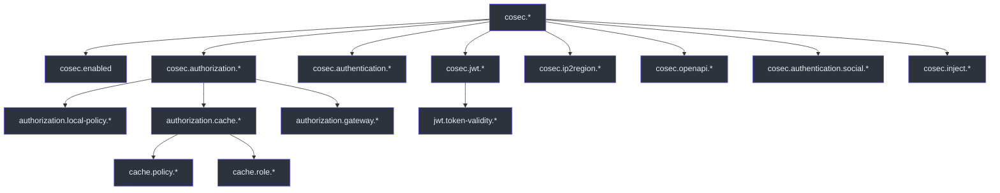
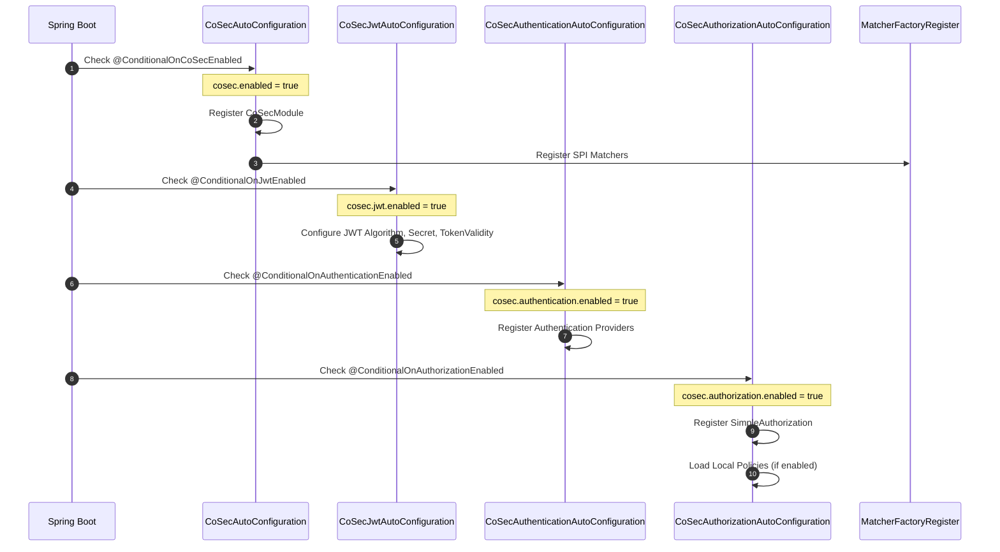
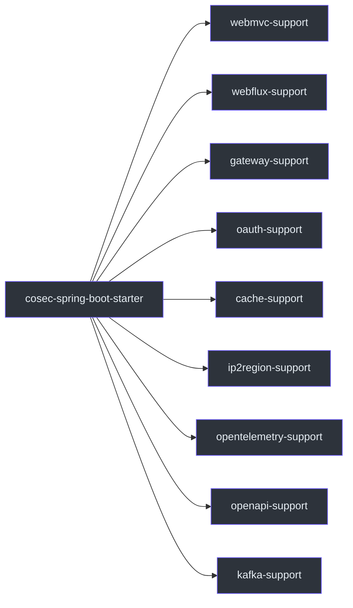

# Configuration Reference

CoSec uses Spring Boot's `@ConfigurationProperties` mechanism for type-safe configuration. All properties are prefixed with `cosec.` as defined by the `CoSec.COSEC_PREFIX` constant ([cosec-api/src/main/kotlin/me/ahoo/cosec/api/CoSec.kt:22](https://github.com/Ahoo-Wang/CoSec/blob/main/cosec-api/src/main/kotlin/me/ahoo/cosec/api/CoSec.kt#L22)).

## Configuration Hierarchy

The following diagram shows the configuration structure and the relationships between property groups:


```mermaid
flowchart TD
    ROOT["cosec.*"] --> MAIN["cosec.enabled"]
    ROOT --> JWT["cosec.jwt.*"]
    ROOT --> AUTHN["cosec.authentication.*"]
    ROOT --> AUTHZ["cosec.authorization.*"]
    ROOT --> IP2R["cosec.ip2region.*"]
    ROOT --> OPENAPI["cosec.openapi.*"]
    ROOT --> SOCIAL["cosec.authentication.social.*"]
    ROOT --> INJECT["cosec.inject.*"]

    AUTHZ --> LP["authorization.local-policy.*"]
    AUTHZ --> CACHE["authorization.cache.*"]
    AUTHZ --> GW["authorization.gateway.*"]

    JWT --> TV["jwt.token-validity.*"]
    CACHE --> CP["cache.policy.*"]
    CACHE --> CR["cache.role.*"]

    style ROOT fill:#2d333b,stroke:#6d5dfc,color:#e6edf3
    style MAIN fill:#2d333b,stroke:#6d5dfc,color:#e6edf3
    style JWT fill:#2d333b,stroke:#6d5dfc,color:#e6edf3
    style AUTHN fill:#2d333b,stroke:#6d5dfc,color:#e6edf3
    style AUTHZ fill:#2d333b,stroke:#6d5dfc,color:#e6edf3
    style IP2R fill:#2d333b,stroke:#6d5dfc,color:#e6edf3
    style OPENAPI fill:#2d333b,stroke:#6d5dfc,color:#e6edf3
    style SOCIAL fill:#2d333b,stroke:#6d5dfc,color:#e6edf3
    style INJECT fill:#2d333b,stroke:#6d5dfc,color:#e6edf3
    style LP fill:#2d333b,stroke:#6d5dfc,color:#e6edf3
    style CACHE fill:#2d333b,stroke:#6d5dfc,color:#e6edf3
    style GW fill:#2d333b,stroke:#6d5dfc,color:#e6edf3
    style TV fill:#2d333b,stroke:#6d5dfc,color:#e6edf3
    style CP fill:#2d333b,stroke:#6d5dfc,color:#e6edf3
    style CR fill:#2d333b,stroke:#6d5dfc,color:#e6edf3

```

## Core Properties

### `cosec.enabled`

Master switch for the entire CoSec framework. When set to `false`, all auto-configuration is skipped.

| Property | Type | Default |
|----------|------|---------|
| `cosec.enabled` | `Boolean` | `true` |

Defined in `CoSecProperties` ([cosec-spring-boot-starter/src/main/kotlin/me/ahoo/cosec/spring/boot/starter/CoSecProperties.kt:31](https://github.com/Ahoo-Wang/CoSec/blob/main/cosec-spring-boot-starter/src/main/kotlin/me/ahoo/cosec/spring/boot/starter/CoSecProperties.kt#L31)).

## JWT Properties (`cosec.jwt.*`)

Controls JWT token creation and verification.

| Property | Type | Default | Description |
|----------|------|---------|-------------|
| `cosec.jwt.enabled` | `Boolean` | `true` | Enable JWT authentication |
| `cosec.jwt.algorithm` | `Enum` | `hmac256` | Signing algorithm: `hmac256`, `hmac384`, `hmac512` |
| `cosec.jwt.secret` | `String` | *required* | Secret key for HMAC signing |
| `cosec.jwt.token-validity.access` | `Duration` | `PT10M` | Access token time-to-live (10 minutes) |
| `cosec.jwt.token-validity.refresh` | `Duration` | `P7D` | Refresh token time-to-live (7 days) |
| `cosec.jwt.token-revocation.enabled` | `Boolean` | `false` | Enable token revocation for logout; revoked tokens are tracked in the authorization token cache |

Defined in `JwtProperties` ([cosec-spring-boot-starter/src/main/kotlin/me/ahoo/cosec/spring/boot/starter/jwt/JwtProperties.kt:28](https://github.com/Ahoo-Wang/CoSec/blob/main/cosec-spring-boot-starter/src/main/kotlin/me/ahoo/cosec/spring/boot/starter/jwt/JwtProperties.kt#L28)). Conditional activation is controlled by `@ConditionalOnJwtEnabled` ([cosec-spring-boot-starter/src/main/kotlin/me/ahoo/cosec/spring/boot/starter/jwt/ConditionalOnJwtEnabled.kt](https://github.com/Ahoo-Wang/CoSec/blob/main/cosec-spring-boot-starter/src/main/kotlin/me/ahoo/cosec/spring/boot/starter/jwt/ConditionalOnJwtEnabled.kt)).

## Authentication Properties (`cosec.authentication.*`)

| Property | Type | Default | Description |
|----------|------|---------|-------------|
| `cosec.authentication.enabled` | `Boolean` | `true` | Enable authentication |

Defined in `AuthenticationProperties` ([cosec-spring-boot-starter/src/main/kotlin/me/ahoo/cosec/spring/boot/starter/authentication/AuthenticationProperties.kt:26](https://github.com/Ahoo-Wang/CoSec/blob/main/cosec-spring-boot-starter/src/main/kotlin/me/ahoo/cosec/spring/boot/starter/authentication/AuthenticationProperties.kt#L26)).

## Authorization Properties (`cosec.authorization.*`)

Controls the authorization engine and policy loading behavior.

| Property | Type | Default | Description |
|----------|------|---------|-------------|
| `cosec.authorization.enabled` | `Boolean` | `true` | Enable authorization |
| `cosec.authorization.local-policy.enabled` | `Boolean` | `false` | Load policies from local JSON files |
| `cosec.authorization.local-policy.locations` | `Set<String>` | `classpath:cosec-policy/*-policy.json` | Glob patterns for policy file locations |
| `cosec.authorization.local-policy.init-repository` | `Boolean` | `false` | Initialize the policy repository with local files on startup |
| `cosec.authorization.local-policy.force-refresh` | `Boolean` | `false` | Force refresh of local policies on startup |
| `cosec.authorization.remote-ip.max-trusted-index` | `Int` | `1` | X-Forwarded-For trust depth: `0` ignores the header entirely (directly exposed deployments); `N` trusts N proxy hops and takes the rightmost entry appended by the closest trusted proxy |

Defined in `AuthorizationProperties` ([cosec-spring-boot-starter/src/main/kotlin/me/ahoo/cosec/spring/boot/starter/authorization/AuthorizationProperties.kt:27](https://github.com/Ahoo-Wang/CoSec/blob/main/cosec-spring-boot-starter/src/main/kotlin/me/ahoo/cosec/spring/boot/starter/authorization/AuthorizationProperties.kt#L27)).

### Authorization Cache Properties (`cosec.authorization.cache.*`)

Controls Redis-based caching for policies and role permissions via CoCache.

| Property | Type | Default | Description |
|----------|------|---------|-------------|
| `cosec.authorization.cache.enabled` | `Boolean` | `true` | Enable caching |
| `cosec.authorization.cache.key-prefix` | `String` | `cosec` | Redis key prefix |
| `cosec.authorization.cache.policy.initialCapacity` | `Int` | *unset* | Guava cache initial capacity (policy cache) |
| `cosec.authorization.cache.policy.concurrencyLevel` | `Int` | *unset* | Guava cache concurrency level (policy cache) |
| `cosec.authorization.cache.policy.maximumSize` | `Long` | *unset* | Guava cache maximum size (policy cache) |
| `cosec.authorization.cache.policy.expireUnit` | `TimeUnit` | `SECONDS` | Time unit for expireAfterWrite/expireAfterAccess (policy cache) |
| `cosec.authorization.cache.policy.expireAfterWrite` | `Long` | *unset* | Expire after write (policy cache) |
| `cosec.authorization.cache.policy.expireAfterAccess` | `Long` | *unset* | Expire after access (policy cache) |
| `cosec.authorization.cache.role.initialCapacity` | `Int` | *unset* | Guava cache initial capacity (role cache) |
| `cosec.authorization.cache.role.concurrencyLevel` | `Int` | *unset* | Guava cache concurrency level (role cache) |
| `cosec.authorization.cache.role.maximumSize` | `Long` | *unset* | Guava cache maximum size (role cache) |
| `cosec.authorization.cache.role.expireUnit` | `TimeUnit` | `SECONDS` | Time unit for expireAfterWrite/expireAfterAccess (role cache) |
| `cosec.authorization.cache.role.expireAfterWrite` | `Long` | *unset* | Expire after write (role cache) |
| `cosec.authorization.cache.role.expireAfterAccess` | `Long` | *unset* | Expire after access (role cache) |
| `cosec.authorization.cache.token.initialCapacity` | `Int` | *unset* | Guava cache initial capacity (revoked-token cache) |
| `cosec.authorization.cache.token.concurrencyLevel` | `Int` | *unset* | Guava cache concurrency level (revoked-token cache) |
| `cosec.authorization.cache.token.maximumSize` | `Long` | `100000` | Guava cache maximum size (revoked-token cache) |
| `cosec.authorization.cache.token.expireUnit` | `TimeUnit` | `SECONDS` | Time unit for expireAfterWrite/expireAfterAccess (revoked-token cache) |
| `cosec.authorization.cache.token.expireAfterWrite` | `Long` | `30` | Expire after write (revoked-token cache); bounds cross-instance revocation propagation |
| `cosec.authorization.cache.token.expireAfterAccess` | `Long` | *unset* | Expire after access (revoked-token cache) |

The derived Redis key prefix for revoked tokens is `cosec:token:revoked:` (i.e. `${key-prefix}:token:revoked:`). It backs token revocation (`cosec.jwt.token-revocation.enabled`) for logout.

Defined in `CacheProperties` ([cosec-spring-boot-starter/src/main/kotlin/me/ahoo/cosec/spring/boot/starter/authorization/cache/CacheProperties.kt:34](https://github.com/Ahoo-Wang/CoSec/blob/main/cosec-spring-boot-starter/src/main/kotlin/me/ahoo/cosec/spring/boot/starter/authorization/cache/CacheProperties.kt#L34)).

### Redis Rate Limiter Properties (`cosec.limiter.*`)

Controls the Redis-backed distributed rate limiter matchers (`redisRateLimiter`, `redisGroupedRateLimiter`).

| Property | Type | Default | Description |
|----------|------|---------|-------------|
| `cosec.limiter.enabled` | `Boolean` | `true` | Enable the Redis rate limiter matcher factories (registered only when a `StringRedisTemplate` bean exists) |
| `cosec.limiter.key-prefix` | `String` | `cosec:rate-limiter` | Redis key prefix for limiter counters; **must be unique per application** — identical prefixes on one Redis share a single quota |

Defined in `LimiterProperties` ([cosec-spring-boot-starter/src/main/kotlin/me/ahoo/cosec/spring/boot/starter/authorization/limiter/LimiterProperties.kt:26](https://github.com/Ahoo-Wang/CoSec/blob/main/cosec-spring-boot-starter/src/main/kotlin/me/ahoo/cosec/spring/boot/starter/authorization/limiter/LimiterProperties.kt#L26)).

### Audit Log (`cosec.audit.*`)

Controls audit logging of authorization decisions.

| Property | Type | Default | Description |
|----------|------|---------|-------------|
| `cosec.audit.enabled` | `Boolean` | `true` | Whether to audit authorization decisions. |
| `cosec.audit.kafka.enabled` | `Boolean` | `true` | Use Kafka instead of the logging sink when `kafka-support` is present. |
| `cosec.audit.kafka.topic` | `String` | `cosec-audit` | Kafka topic for audit events. |

Defined in `AuditProperties` ([cosec-spring-boot-starter/src/main/kotlin/me/ahoo/cosec/spring/boot/starter/audit/AuditProperties.kt:26](https://github.com/Ahoo-Wang/CoSec/blob/main/cosec-spring-boot-starter/src/main/kotlin/me/ahoo/cosec/spring/boot/starter/audit/AuditProperties.kt#L26)).

Every authorization decision is published as a structured `AuditEvent` to the
`AuditEventSink` SPI. The default `LoggingAuditEventSink` writes single-line JSON
to the logger `me.ahoo.cosec.audit` — denials at `WARN`, unexpected errors at
`ERROR`, allows at `DEBUG` (so the default `INFO` level only surfaces denials).
Set `logging.level.me.ahoo.cosec.audit=DEBUG` for full auditing, or register your
own `AuditEventSink` bean to ship events to Kafka/Elasticsearch/your database.
If you replace the default `Authorization` bean with your own, audit wiring steps
aside automatically (the decorator only wraps the auto-configured
`cosecAuthorization` bean).

The `kafka-support` feature replaces the logging sink with an asynchronous
`KafkaAuditEventSink`. Each record uses a JSON `[tenantId, principalId]` tuple
as its key and a single-line `AuditEvent` JSON value. Configure the broker with
`spring.kafka.*`; CoSec does not create the topic. To keep authorization
non-blocking during an outage, the sink queues at most 1024 events and drops
new events with a warning when that queue is full. During shutdown it waits up
to 10 seconds for accepted events to drain before forcing the scheduler closed.

### Gateway Properties (`cosec.authorization.gateway.*`)

| Property | Type | Default | Description |
|----------|------|---------|-------------|
| `cosec.authorization.gateway.enabled` | `Boolean` | `true` | Enable Spring Cloud Gateway integration |

Defined in `GatewayProperties` ([cosec-spring-boot-starter/src/main/kotlin/me/ahoo/cosec/spring/boot/starter/authorization/gateway/GatewayProperties.kt:26](https://github.com/Ahoo-Wang/CoSec/blob/main/cosec-spring-boot-starter/src/main/kotlin/me/ahoo/cosec/spring/boot/starter/authorization/gateway/GatewayProperties.kt#L26)).

## IP2Region Properties (`cosec.ip2region.*`)

Controls IP geolocation for region-based access control.

| Property | Type | Default | Description |
|----------|------|---------|-------------|
| `cosec.ip2region.enabled` | `Boolean` | `true` | Enable IP geolocation |

Defined in `Ip2RegionProperties` ([cosec-spring-boot-starter/src/main/kotlin/me/ahoo/cosec/spring/boot/starter/ip2region/Ip2RegionProperties.kt:26](https://github.com/Ahoo-Wang/CoSec/blob/main/cosec-spring-boot-starter/src/main/kotlin/me/ahoo/cosec/spring/boot/starter/ip2region/Ip2RegionProperties.kt#L26)).

## OpenAPI Properties (`cosec.openapi.*`)

Controls Swagger/OpenAPI integration and policy generation endpoints.

| Property | Type | Default | Description |
|----------|------|---------|-------------|
| `cosec.openapi.enabled` | `Boolean` | `true` | Enable OpenAPI integration |

Defined in `OpenAPIProperties` ([cosec-spring-boot-starter/src/main/kotlin/me/ahoo/cosec/spring/boot/starter/openapi/OpenAPIProperties.kt:26](https://github.com/Ahoo-Wang/CoSec/blob/main/cosec-spring-boot-starter/src/main/kotlin/me/ahoo/cosec/spring/boot/starter/openapi/OpenAPIProperties.kt#L26)).

## Auto-Configuration Activation Flow

The following diagram shows how CoSec auto-configuration activates based on properties:


```mermaid
sequenceDiagram
    autonumber
    participant SB as Spring Boot
    participant CA as CoSecAutoConfiguration
    participant JA as CoSecJwtAutoConfiguration
    participant AA as CoSecAuthenticationAutoConfiguration
    participant AZ as CoSecAuthorizationAutoConfiguration
    participant MA as MatcherFactoryRegister

    SB->>CA: Check @ConditionalOnCoSecEnabled
    Note over CA: cosec.enabled = true
    CA->>CA: Register CoSecModule
    CA->>MA: Register SPI Matchers

    SB->>JA: Check @ConditionalOnJwtEnabled
    Note over JA: cosec.jwt.enabled = true
    JA->>JA: Configure JWT Algorithm, Secret, TokenValidity

    SB->>AA: Check @ConditionalOnAuthenticationEnabled
    Note over AA: cosec.authentication.enabled = true
    AA->>AA: Register Authentication Providers

    SB->>AZ: Check @ConditionalOnAuthorizationEnabled
    Note over AZ: cosec.authorization.enabled = true
    AZ->>AZ: Register SimpleAuthorization
    AZ->>AZ: Load Local Policies (if enabled)


```

## Example Application.yaml

```yaml
spring:
  kafka:
    bootstrap-servers: "localhost:9092"

cosec:
  # Master switch
  enabled: true

  # JWT Configuration
  jwt:
    enabled: true
    algorithm: hmac256           # hmac256 | hmac384 | hmac512
    secret: "my-super-secret-key-at-least-256-bits-long"
    token-validity:
      access: PT30M              # 30 minutes
      refresh: P14D              # 14 days

  # Authentication
  authentication:
    enabled: true

  # Authorization
  authorization:
    enabled: true
    local-policy:
      enabled: true
      locations:
        - "classpath:cosec-policy/*-policy.json"
      init-repository: true
      force-refresh: false

    # Redis Caching
    cache:
      enabled: true
      key-prefix: "cosec"
      policy:
        maximumSize: 1000
        expireAfterWrite: 300    # 5 minutes
      role:
        maximumSize: 500
        expireAfterWrite: 300

    # Spring Cloud Gateway
    gateway:
      enabled: true

  # Audit
  audit:
    enabled: true
    kafka:
      enabled: true
      topic: "cosec-audit"

  # IP Geolocation
  ip2region:
    enabled: true

  # OpenAPI
  openapi:
    enabled: true
```

## Feature Variants

The `cosec-spring-boot-starter` module exposes Gradle feature variants that determine which integration modules are included:


```mermaid
flowchart LR
    STARTER["cosec-spring-boot-starter"] --> W["webmvc-support"]
    STARTER --> WF["webflux-support"]
    STARTER --> GW["gateway-support"]
    STARTER --> OA["oauth-support"]
    STARTER --> CS["cache-support"]
    STARTER --> IP["ip2region-support"]
    STARTER --> OT["opentelemetry-support"]
    STARTER --> OAPI["openapi-support"]
    STARTER --> K["kafka-support"]

    style STARTER fill:#2d333b,stroke:#6d5dfc,color:#e6edf3
    style W fill:#2d333b,stroke:#6d5dfc,color:#e6edf3
    style WF fill:#2d333b,stroke:#6d5dfc,color:#e6edf3
    style GW fill:#2d333b,stroke:#6d5dfc,color:#e6edf3
    style OA fill:#2d333b,stroke:#6d5dfc,color:#e6edf3
    style CS fill:#2d333b,stroke:#6d5dfc,color:#e6edf3
    style IP fill:#2d333b,stroke:#6d5dfc,color:#e6edf3
    style OT fill:#2d333b,stroke:#6d5dfc,color:#e6edf3
    style OAPI fill:#2d333b,stroke:#6d5dfc,color:#e6edf3
    style K fill:#2d333b,stroke:#6d5dfc,color:#e6edf3

```

| Feature Variant | Included Module | Required Dependency |
|----------------|-----------------|-------------------|
| `webmvc-support` | `cosec-webmvc` | Spring WebMvc |
| `webflux-support` | `cosec-webflux` | Spring WebFlux |
| `gateway-support` | `cosec-gateway` | Spring Cloud Gateway |
| `oauth-support` | `cosec-social` | JustAuth |
| `cache-support` | `cosec-cocache` | Spring Data Redis + CoCache |
| `ip2region-support` | `cosec-ip2region` | ip2region library |
| `opentelemetry-support` | `cosec-opentelemetry` | OpenTelemetry |
| `openapi-support` | `cosec-openapi` | SpringDoc OpenAPI |
| `kafka-support` | `cosec-kafka` | Spring for Apache Kafka |

Feature variants are declared in `build.gradle.kts` ([cosec-spring-boot-starter/build.gradle.kts:18](https://github.com/Ahoo-Wang/CoSec/blob/main/cosec-spring-boot-starter/build.gradle.kts#L18)).

## Related Pages

- [CoSec Overview](./overview.md) — Architecture and key concepts
- [Quick Start](./quick-start.md) — Get CoSec running in minutes
- [Policy Authoring Guide](./policy-authoring.md) — Write JSON policies

## References

- [cosec-api/src/main/kotlin/me/ahoo/cosec/api/CoSec.kt](https://github.com/Ahoo-Wang/CoSec/blob/main/cosec-api/src/main/kotlin/me/ahoo/cosec/api/CoSec.kt)
- [cosec-spring-boot-starter/src/main/kotlin/me/ahoo/cosec/spring/boot/starter/CoSecProperties.kt](https://github.com/Ahoo-Wang/CoSec/blob/main/cosec-spring-boot-starter/src/main/kotlin/me/ahoo/cosec/spring/boot/starter/CoSecProperties.kt)
- [cosec-spring-boot-starter/src/main/kotlin/me/ahoo/cosec/spring/boot/starter/jwt/JwtProperties.kt](https://github.com/Ahoo-Wang/CoSec/blob/main/cosec-spring-boot-starter/src/main/kotlin/me/ahoo/cosec/spring/boot/starter/jwt/JwtProperties.kt)
- [cosec-spring-boot-starter/src/main/kotlin/me/ahoo/cosec/spring/boot/starter/authorization/AuthorizationProperties.kt](https://github.com/Ahoo-Wang/CoSec/blob/main/cosec-spring-boot-starter/src/main/kotlin/me/ahoo/cosec/spring/boot/starter/authorization/AuthorizationProperties.kt)
- [cosec-spring-boot-starter/src/main/kotlin/me/ahoo/cosec/spring/boot/starter/authorization/cache/CacheProperties.kt](https://github.com/Ahoo-Wang/CoSec/blob/main/cosec-spring-boot-starter/src/main/kotlin/me/ahoo/cosec/spring/boot/starter/authorization/cache/CacheProperties.kt)
- [cosec-spring-boot-starter/src/main/kotlin/me/ahoo/cosec/spring/boot/starter/authorization/gateway/GatewayProperties.kt](https://github.com/Ahoo-Wang/CoSec/blob/main/cosec-spring-boot-starter/src/main/kotlin/me/ahoo/cosec/spring/boot/starter/authorization/gateway/GatewayProperties.kt)
- [cosec-spring-boot-starter/src/main/kotlin/me/ahoo/cosec/spring/boot/starter/ip2region/Ip2RegionProperties.kt](https://github.com/Ahoo-Wang/CoSec/blob/main/cosec-spring-boot-starter/src/main/kotlin/me/ahoo/cosec/spring/boot/starter/ip2region/Ip2RegionProperties.kt)
- [cosec-spring-boot-starter/src/main/kotlin/me/ahoo/cosec/spring/boot/starter/openapi/OpenAPIProperties.kt](https://github.com/Ahoo-Wang/CoSec/blob/main/cosec-spring-boot-starter/src/main/kotlin/me/ahoo/cosec/spring/boot/starter/openapi/OpenAPIProperties.kt)
- [cosec-spring-boot-starter/build.gradle.kts](https://github.com/Ahoo-Wang/CoSec/blob/main/cosec-spring-boot-starter/build.gradle.kts)
- [cosec-spring-boot-starter/src/main/kotlin/me/ahoo/cosec/spring/boot/starter/authentication/AuthenticationProperties.kt](https://github.com/Ahoo-Wang/CoSec/blob/main/cosec-spring-boot-starter/src/main/kotlin/me/ahoo/cosec/spring/boot/starter/authentication/AuthenticationProperties.kt)
