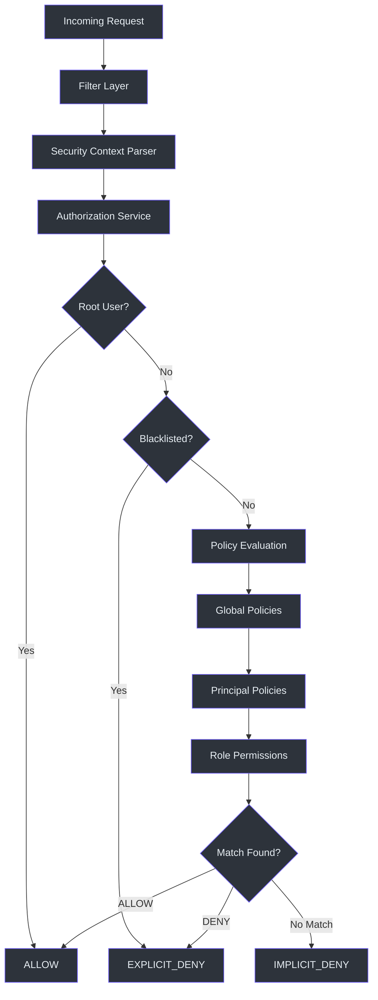
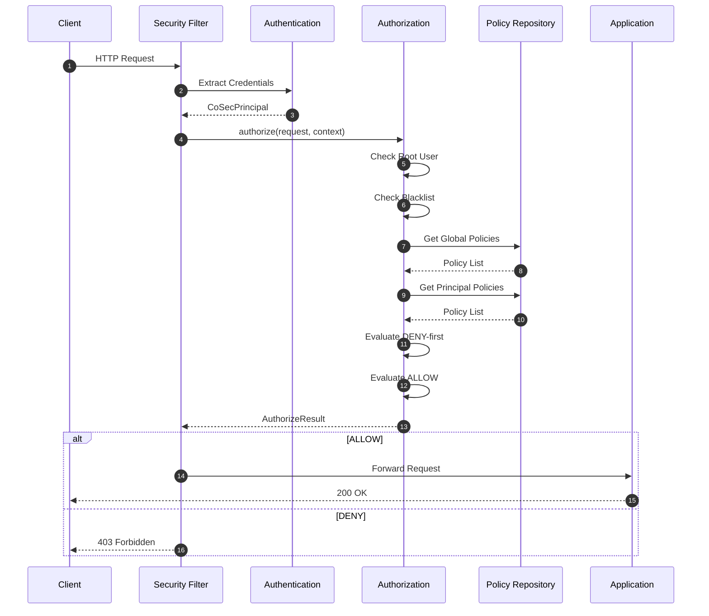
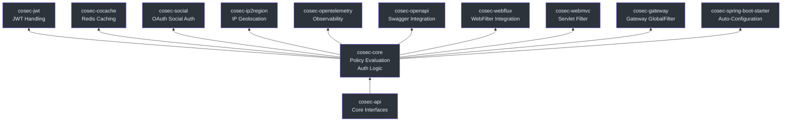

# CoSec Overview

CoSec is an **RBAC-based and Policy-based Multi-Tenant Reactive Security Framework** for the JVM. It brings an AWS IAM-like policy model to the Java/Kotlin ecosystem, built on top of Spring Boot 4 and Project Reactor. CoSec provides a declarative, JSON-based policy language for fine-grained authorization with first-class support for multi-tenancy, reactive programming, and extensibility via Java SPI.

## Why CoSec?

Existing JVM security frameworks like Spring Security and Apache Shiro were designed primarily around servlet-based, imperative programming models and lack native support for policy-based authorization patterns common in cloud-native environments.

CoSec exists to fill this gap:

- **AWS IAM-like policy model** — Declarative JSON policies with DENY-first evaluation, action matchers, and condition matchers — the same mental model used by cloud providers.
- **Reactive from the ground up** — Core interfaces return `Mono<T>` (Project Reactor). No blocking, no thread-local hacks.
- **Multi-tenant by default** — Tenants are first-class entities in the security model, not an afterthought.
- **SPI-extensible** — Custom action matchers and condition matchers via Java SPI, without modifying framework code.

## Key Features

| Feature | Description |
|---------|-------------|
| RBAC + Policy-based Auth | Combines role-based access control with fine-grained policy evaluation |
| Multi-Tenancy | Tenant-scoped policies and principals |
| Reactive | Core interfaces built on Project Reactor (`Mono<T>`) |
| SPI Extensibility | Custom matchers via `ActionMatcherFactory` and `ConditionMatcherFactory` |
| Multiple Integrations | WebFlux, WebMvc, Spring Cloud Gateway |
| JSON Policy Language | Declarative policies with path patterns, conditions, and rate limiting |
| JWT Authentication | Built-in JWT token management with configurable algorithms |
| Redis Caching | Policy and permission caching via CoCache |

## Architecture Overview

The following diagram shows the high-level architecture of CoSec and how requests flow through the security pipeline:

## Request Lifecycle

Every HTTP request passes through a well-defined security pipeline. The filter layer depends on the integration (WebFlux, WebMvc, or Gateway), but the core authorization logic is shared:

## Module Overview

CoSec is organized as a multi-module Gradle project. Each module has a clear responsibility:

| Module | Description |
|--------|-------------|
| `cosec-api` | Core interfaces — `CoSecPrincipal`, `Authorization`, `Authentication`, `Policy`, `Statement`. No framework dependencies. |
| `cosec-core` | Policy evaluation engine, authentication/authorization implementations, condition and action matchers. |
| `cosec-jwt` | JWT token creation and verification using the `java-jwt` library. |
| `cosec-cocache` | Redis-backed caching for policies and permissions via CoCache. |
| `cosec-social` | OAuth social login integration via JustAuth. |
| `cosec-ip2region` | IP geolocation for region-based access control. |
| `cosec-opentelemetry` | OpenTelemetry integration for distributed tracing. |
| `cosec-openapi` | Swagger/OpenAPI integration and policy generation endpoints. |
| `cosec-webflux` | Reactive WebFilter integration for Spring WebFlux applications. |
| `cosec-webmvc` | Servlet filter integration for Spring WebMvc applications. |
| `cosec-gateway` | GlobalFilter integration for Spring Cloud Gateway. |
| `cosec-spring-boot-starter` | Auto-configuration that aggregates all modules. |
| `cosec-gateway-server` | Standalone gateway application (not published to Maven Central). |

## Comparison with Alternatives

| Aspect | CoSec | Spring Security | Apache Shiro |
|--------|-------|-----------------|--------------|
| Authorization Model | Policy-based (AWS IAM-like) | Filter chain + `@PreAuthorize` | Permission-based (`WildcardPermission`) |
| Reactive Support | Native (`Mono`-based) | Added in 5.x (`WebFlux`) | Not supported |
| Multi-Tenancy | First-class (`TenantPrincipal`) | Requires custom implementation | Requires custom implementation |
| Policy Language | JSON with conditions and matchers | SpEL expressions | INI / programmatic |
| SPI Extensibility | Java SPI for matchers | `SecurityFilterChain` | `Realm` SPI |
| Spring Boot Integration | `cosec-spring-boot-starter` | `spring-boot-starter-security` | `shiro-spring-boot-starter` |
| Rate Limiting | Built-in (`rateLimiter` condition) | Separate library needed | Separate library needed |
| Minimum Java Version | 17 | 17 | 11 |

## Core Security Model

The security model is defined in `cosec-api` and follows these key abstractions:

- **`CoSecPrincipal`** — Represents a user/agent with `id`, `roles`, `policies`, and `attributes`. Root users bypass all checks ([cosec-api/src/main/kotlin/me/ahoo/cosec/api/principal/CoSecPrincipal.kt:35](https://github.com/Ahoo-Wang/CoSec/blob/main/cosec-api/src/main/kotlin/me/ahoo/cosec/api/principal/CoSecPrincipal.kt#L35)).
- **`Authentication<C, P>`** — Reactive interface that verifies credentials and returns a `CoSecPrincipal` ([cosec-api/src/main/kotlin/me/ahoo/cosec/api/authentication/Authentication.kt:32](https://github.com/Ahoo-Wang/CoSec/blob/main/cosec-api/src/main/kotlin/me/ahoo/cosec/api/authentication/Authentication.kt#L32)).
- **`Authorization`** — Reactive interface that evaluates a request against a `SecurityContext` and returns `AuthorizeResult` ([cosec-api/src/main/kotlin/me/ahoo/cosec/api/authorization/Authorization.kt:35](https://github.com/Ahoo-Wang/CoSec/blob/main/cosec-api/src/main/kotlin/me/ahoo/cosec/api/authorization/Authorization.kt#L35)).
- **`Policy`** — Collection of `Statement`s with an optional `ConditionMatcher`. Evaluation: check condition, then DENY-first, then ALLOW ([cosec-api/src/main/kotlin/me/ahoo/cosec/api/policy/Policy.kt:45](https://github.com/Ahoo-Wang/CoSec/blob/main/cosec-api/src/main/kotlin/me/ahoo/cosec/api/policy/Policy.kt#L45)).
- **`Statement`** — Single permission rule with `Effect`, `ActionMatcher`, and `ConditionMatcher` ([cosec-api/src/main/kotlin/me/ahoo/cosec/api/policy/Statement.kt:37](https://github.com/Ahoo-Wang/CoSec/blob/main/cosec-api/src/main/kotlin/me/ahoo/cosec/api/policy/Statement.kt#L37)).

## Related Pages

- [Quick Start](./quick-start.md) — Get CoSec running in minutes
- [Configuration Reference](./configuration.md) — Complete properties reference
- [Policy Authoring Guide](./policy-authoring.md) — Write JSON policies

## References

- [cosec-api/src/main/kotlin/me/ahoo/cosec/api/principal/CoSecPrincipal.kt](https://github.com/Ahoo-Wang/CoSec/blob/main/cosec-api/src/main/kotlin/me/ahoo/cosec/api/principal/CoSecPrincipal.kt)
- [cosec-api/src/main/kotlin/me/ahoo/cosec/api/authorization/Authorization.kt](https://github.com/Ahoo-Wang/CoSec/blob/main/cosec-api/src/main/kotlin/me/ahoo/cosec/api/authorization/Authorization.kt)
- [cosec-api/src/main/kotlin/me/ahoo/cosec/api/authentication/Authentication.kt](https://github.com/Ahoo-Wang/CoSec/blob/main/cosec-api/src/main/kotlin/me/ahoo/cosec/api/authentication/Authentication.kt)
- [cosec-api/src/main/kotlin/me/ahoo/cosec/api/policy/Policy.kt](https://github.com/Ahoo-Wang/CoSec/blob/main/cosec-api/src/main/kotlin/me/ahoo/cosec/api/policy/Policy.kt)
- [cosec-api/src/main/kotlin/me/ahoo/cosec/api/policy/Statement.kt](https://github.com/Ahoo-Wang/CoSec/blob/main/cosec-api/src/main/kotlin/me/ahoo/cosec/api/policy/Statement.kt)
- [cosec-api/src/main/kotlin/me/ahoo/cosec/api/policy/Effect.kt](https://github.com/Ahoo-Wang/CoSec/blob/main/cosec-api/src/main/kotlin/me/ahoo/cosec/api/policy/Effect.kt)
- [cosec-core/src/main/kotlin/me/ahoo/cosec/authorization/SimpleAuthorization.kt](https://github.com/Ahoo-Wang/CoSec/blob/main/cosec-core/src/main/kotlin/me/ahoo/cosec/authorization/SimpleAuthorization.kt)
- [cosec-webflux/src/main/kotlin/me/ahoo/cosec/webflux/ReactiveAuthorizationFilter.kt](https://github.com/Ahoo-Wang/CoSec/blob/main/cosec-webflux/src/main/kotlin/me/ahoo/cosec/webflux/ReactiveAuthorizationFilter.kt)
- [cosec-gateway/src/main/kotlin/me/ahoo/cosec/gateway/AuthorizationGatewayFilter.kt](https://github.com/Ahoo-Wang/CoSec/blob/main/cosec-gateway/src/main/kotlin/me/ahoo/cosec/gateway/AuthorizationGatewayFilter.kt)
- [settings.gradle.kts](https://github.com/Ahoo-Wang/CoSec/blob/main/settings.gradle.kts)
