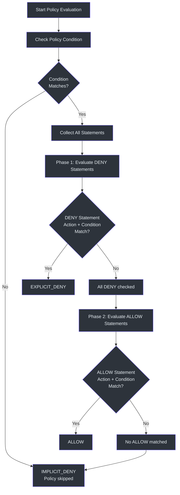
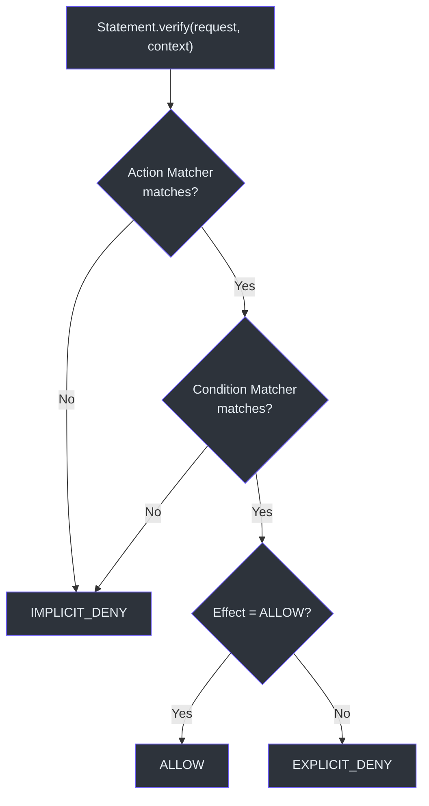
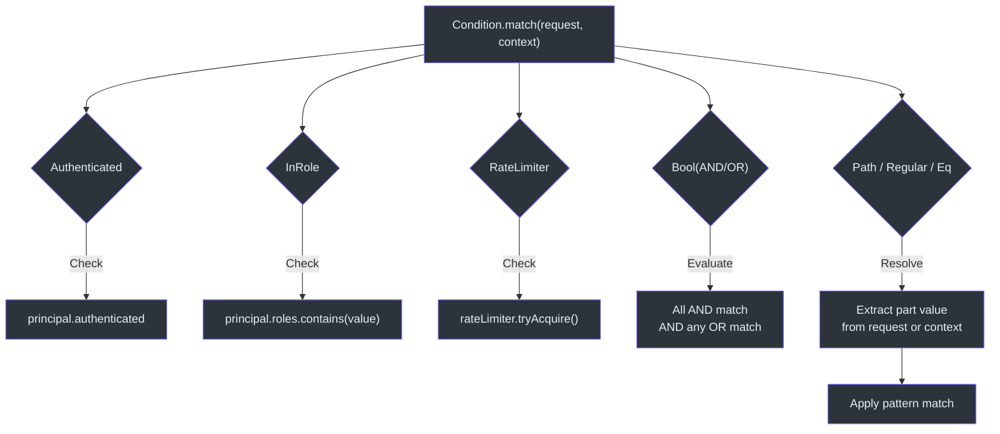

# Policy Authoring Guide

CoSec policies are JSON documents that define access control rules using an AWS IAM-like model. This guide covers the policy structure, available matchers, and practical examples for common authorization patterns.

## Policy Structure

Every policy is a JSON object with the following fields, validated against the schema at [schema/cosec-policy.schema.json](https://github.com/Ahoo-Wang/CoSec/blob/main/schema/cosec-policy.schema.json):

```json
{
  "id": "my-policy-id",
  "name": "Human-Readable Name",
  "category": "grouping-category",
  "description": "What this policy controls",
  "type": "global",
  "tenantId": "(platform)",
  "condition": { },
  "statements": [ ]
}
```

| Field | Required | Type | Description |
|-------|----------|------|-------------|
| `id` | No | `String` | Unique policy identifier |
| `name` | Yes | `String` | Human-readable policy name |
| `category` | Yes | `String` | Grouping category (e.g., `"admin"`, `"user"`) |
| `description` | Yes | `String` | What this policy controls |
| `type` | Yes | `Enum` | `"global"`, `"system"`, or `"custom"` |
| `tenantId` | Yes | `String` | Tenant this policy belongs to |
| `condition` | No | `Object` | Condition that must be met for the entire policy to apply |
| `statements` | Yes | `Array` | List of permission statements |

The policy type enum is defined in `PolicyType` ([cosec-api/src/main/kotlin/me/ahoo/cosec/api/policy/PolicyType.kt:25](https://github.com/Ahoo-Wang/CoSec/blob/main/cosec-api/src/main/kotlin/me/ahoo/cosec/api/policy/PolicyType.kt#L25)):
- **`global`** — Policies that apply to all applications
- **`system`** — Platform-managed policies; users cannot delete them
- **`custom`** — User-defined policies

## Statement Structure

Each statement defines a single permission rule:

```json
{
  "name": "StatementName",
  "effect": "allow",
  "action": { },
  "condition": { }
}
```

| Field | Required | Type | Default | Description |
|-------|----------|------|---------|-------------|
| `name` | No | `String` | *unnamed* | Identifier for this statement |
| `effect` | No | `String` | `"allow"` | Either `"allow"` or `"deny"` |
| `action` | Yes | `Object/String/Array` | *required* | What requests this statement applies to |
| `condition` | No | `Object` | *always matches* | Additional conditions for this statement |

The `Effect` enum ([cosec-api/src/main/kotlin/me/ahoo/cosec/api/policy/Effect.kt:28](https://github.com/Ahoo-Wang/CoSec/blob/main/cosec-api/src/main/kotlin/me/ahoo/cosec/api/policy/Effect.kt#L28)) determines the outcome when a statement matches.

## Policy Evaluation Order

CoSec uses a DENY-first evaluation strategy. When evaluating statements within a policy or across policies, DENY statements are checked before ALLOW statements:



This logic is implemented in the `Policy.verify` method ([cosec-api/src/main/kotlin/me/ahoo/cosec/api/policy/Policy.kt:76](https://github.com/Ahoo-Wang/CoSec/blob/main/cosec-api/src/main/kotlin/me/ahoo/cosec/api/policy/Policy.kt#L76)) and `SimpleAuthorization.evaluateDenyFirst` ([cosec-core/src/main/kotlin/me/ahoo/cosec/authorization/SimpleAuthorization.kt:61](https://github.com/Ahoo-Wang/CoSec/blob/main/cosec-core/src/main/kotlin/me/ahoo/cosec/authorization/SimpleAuthorization.kt#L61)).

## Statement Matching Flow

Each statement is verified by checking the action matcher first, then the condition matcher:



This is implemented in `Statement.verify` ([cosec-api/src/main/kotlin/me/ahoo/cosec/api/policy/Statement.kt:60](https://github.com/Ahoo-Wang/CoSec/blob/main/cosec-api/src/main/kotlin/me/ahoo/cosec/api/policy/Statement.kt#L60)).

## Action Matchers

Action matchers determine which HTTP requests a statement applies to. The `ActionMatcher` interface is defined at ([cosec-api/src/main/kotlin/me/ahoo/cosec/api/policy/ActionMatcher.kt:31](https://github.com/Ahoo-Wang/CoSec/blob/main/cosec-api/src/main/kotlin/me/ahoo/cosec/api/policy/ActionMatcher.kt#L31)).

### Path Matcher (`path`)

The most common action matcher. Uses Spring `PathPattern` syntax for URL matching. The factory is `PathActionMatcherFactory` ([cosec-core/src/main/kotlin/me/ahoo/cosec/policy/action/PathActionMatcher.kt:82](https://github.com/Ahoo-Wang/CoSec/blob/main/cosec-core/src/main/kotlin/me/ahoo/cosec/policy/action/PathActionMatcher.kt#L82)).

**String shorthand** — match a single path pattern:

```json
{
  "action": "/api/users/{id}"
}
```

**Array shorthand** — match multiple path patterns (implicit composite):

```json
{
  "action": [
    "/auth/login",
    "/auth/register",
    "/auth/refresh"
  ]
}
```

**Object form with method filter** — restrict to specific HTTP methods:

```json
{
  "action": {
    "path": {
      "method": "GET",
      "pattern": "/api/users/{id}"
    }
  }
}
```

**Multiple methods and patterns**:

```json
{
  "action": {
    "path": {
      "method": ["GET", "POST"],
      "pattern": [
        "/api/users/#{principal.id}/*",
        "/api/users/#{principal.id}/orders/*"
      ],
      "options": {
        "caseSensitive": false,
        "separator": "/",
        "decodeAndParseSegments": false
      }
    }
  }
}
```

### All Matcher (`all`)

Matches all requests regardless of path or method:

```json
{
  "action": {
    "all": {
      "method": "GET"
    }
  }
}
```

The wildcard string `"*"` also matches all actions:

```json
{
  "action": "*"
}
```

### Composite Matcher (`composite`)

Combines multiple action matchers with OR logic:

```json
{
  "action": {
    "composite": [
      "/api/users/#{principal.id}/*",
      {
        "path": {
          "method": "POST",
          "pattern": ["/api/orders/*"]
        }
      }
    ]
  }
}
```

## Condition Matchers

Condition matchers add constraints beyond action matching. The `ConditionMatcher` interface ([cosec-api/src/main/kotlin/me/ahoo/cosec/api/policy/ConditionMatcher.kt:29](https://github.com/Ahoo-Wang/CoSec/blob/main/cosec-api/src/main/kotlin/me/ahoo/cosec/api/policy/ConditionMatcher.kt#L29)) is the base for all conditions.

### Authenticated Condition

Checks if the user is authenticated (not anonymous). Defined in `AuthenticatedConditionMatcher` ([cosec-core/src/main/kotlin/me/ahoo/cosec/policy/condition/context/AuthenticatedConditionMatcher.kt:23](https://github.com/Ahoo-Wang/CoSec/blob/main/cosec-core/src/main/kotlin/me/ahoo/cosec/policy/condition/context/AuthenticatedConditionMatcher.kt#L23)).

```json
{
  "condition": {
    "authenticated": {}
  }
}
```

### InRole Condition

Checks if the principal has a specific role. Defined in `InRoleConditionMatcher` ([cosec-core/src/main/kotlin/me/ahoo/cosec/policy/condition/context/InRoleConditionMatcher.kt:23](https://github.com/Ahoo-Wang/CoSec/blob/main/cosec-core/src/main/kotlin/me/ahoo/cosec/policy/condition/context/InRoleConditionMatcher.kt#L23)).

```json
{
  "condition": {
    "inRole": {
      "value": "admin"
    }
  }
}
```

### InTenant Condition

Checks if the principal belongs to a specific tenant. Defined in `InTenantConditionMatcher` ([cosec-core/src/main/kotlin/me/ahoo/cosec/policy/condition/context/InTenantConditionMatcher.kt](https://github.com/Ahoo-Wang/CoSec/blob/main/cosec-core/src/main/kotlin/me/ahoo/cosec/policy/condition/context/InTenantConditionMatcher.kt)).

```json
{
  "condition": {
    "inTenant": {
      "value": "tenant-123"
    }
  }
}
```

### Rate Limiter Condition

Applies rate limiting to requests. Throws `TooManyRequestsException` when the limit is exceeded, resulting in a deny. Defined in `RateLimiterConditionMatcher` ([cosec-core/src/main/kotlin/me/ahoo/cosec/policy/condition/limiter/RateLimiterConditionMatcher.kt:34](https://github.com/Ahoo-Wang/CoSec/blob/main/cosec-core/src/main/kotlin/me/ahoo/cosec/policy/condition/limiter/RateLimiterConditionMatcher.kt#L34)).

```json
{
  "condition": {
    "rateLimiter": {
      "permitsPerSecond": 100
    }
  }
}
```

### Path Condition

Matches a path pattern against a request attribute (e.g., `request.remoteIp`). Uses `PathPattern` syntax with configurable separator. Defined in `PathConditionMatcher` ([cosec-core/src/main/kotlin/me/ahoo/cosec/policy/condition/part/PathConditionMatcher.kt:24](https://github.com/Ahoo-Wang/CoSec/blob/main/cosec-core/src/main/kotlin/me/ahoo/cosec/policy/condition/part/PathConditionMatcher.kt#L24)).

```json
{
  "condition": {
    "path": {
      "part": "request.remoteIp",
      "pattern": "192.168.0.*",
      "options": {
        "caseSensitive": false,
        "separator": ".",
        "decodeAndParseSegments": false
      }
    }
  }
}
```

### Regular Expression Condition

Matches a regex against a request or context attribute. Supports `negate` for whitelist patterns. Defined in `RegularConditionMatcher` ([cosec-core/src/main/kotlin/me/ahoo/cosec/policy/condition/part/RegularConditionMatcher.kt](https://github.com/Ahoo-Wang/CoSec/blob/main/cosec-core/src/main/kotlin/me/ahoo/cosec/policy/condition/part/RegularConditionMatcher.kt)).

```json
{
  "condition": {
    "regular": {
      "part": "request.origin",
      "pattern": "^(http|https)://github.com"
    }
  }
}
```

With negation (block all origins NOT matching the pattern):

```json
{
  "condition": {
    "regular": {
      "negate": true,
      "part": "request.origin",
      "pattern": "^(http|https)://github.com"
    }
  }
}
```

### Boolean Condition (AND/OR)

Combines multiple conditions with boolean logic. Defined in `BoolConditionMatcher` ([cosec-core/src/main/kotlin/me/ahoo/cosec/policy/condition/BoolConditionMatcher.kt:35](https://github.com/Ahoo-Wang/CoSec/blob/main/cosec-core/src/main/kotlin/me/ahoo/cosec/policy/condition/BoolConditionMatcher.kt#L35)).

```json
{
  "condition": {
    "bool": {
      "and": [
        { "authenticated": {} }
      ],
      "or": [
        {
          "in": {
            "part": "context.principal.id",
            "value": ["developerId"]
          }
        },
        {
          "path": {
            "part": "request.remoteIp",
            "pattern": "192.168.0.*"
          }
        }
      ]
    }
  }
}
```

### Other Part Conditions

| Matcher | Key | Description |
|---------|-----|-------------|
| Equals | `eq` | Exact string match of a part value |
| Contains | `contains` | Substring match |
| Starts With | `startsWith` | Prefix match |
| Ends With | `endsWith` | Suffix match |
| In | `in` | Value is in a list |

```json
{
  "condition": {
    "eq": {
      "part": "request.path.var.id",
      "value": "#{principal.id}"
    }
  }
}
```

```json
{
  "condition": {
    "in": {
      "part": "context.principal.id",
      "value": ["admin-1", "admin-2", "admin-3"]
    }
  }
}
```

## Condition Matcher Evaluation



## Complete Policy Examples

### Anonymous Access

Allow unauthenticated access to public endpoints (auth and health checks):

```json
{
  "id": "anonymous-access",
  "name": "Anonymous Access",
  "category": "access",
  "description": "Allow anonymous access to auth endpoints and health checks",
  "type": "global",
  "tenantId": "(platform)",
  "statements": [
    {
      "name": "AuthEndpoints",
      "action": [
        "/auth/login",
        "/auth/register",
        "/auth/refresh"
      ]
    },
    {
      "name": "HealthCheck",
      "action": [
        "/actuator/health",
        "/actuator/health/readiness",
        "/actuator/health/liveness"
      ]
    }
  ]
}
```

This follows the same pattern as the health-probe policy in the gateway server ([cosec-gateway-server/src/main/resources/cosec-policy/health-probe-policy.json](https://github.com/Ahoo-Wang/CoSec/blob/main/cosec-gateway-server/src/main/resources/cosec-policy/health-probe-policy.json)). Statements without an `effect` field default to `"allow"`.

### User-Scoped Access

Allow authenticated users to access their own resources only:

```json
{
  "id": "user-scope",
  "name": "User Scope Access",
  "category": "access",
  "description": "Allow users to access their own resources",
  "type": "global",
  "tenantId": "(platform)",
  "statements": [
    {
      "name": "OwnResources",
      "action": "/api/users/#{principal.id}/*",
      "condition": {
        "authenticated": {}
      }
    }
  ]
}
```

The `#{principal.id}` SpEL template expression is resolved at evaluation time against the security context, allowing per-user path patterns.

### IP Blacklist

Deny requests from specific IP ranges:

```json
{
  "id": "ip-blacklist",
  "name": "IP Blacklist",
  "category": "security",
  "description": "Block requests from blacklisted IP ranges",
  "type": "global",
  "tenantId": "(platform)",
  "statements": [
    {
      "name": "IpBlacklist",
      "effect": "deny",
      "action": "*",
      "condition": {
        "path": {
          "part": "request.remoteIp",
          "pattern": "192.168.0.*",
          "options": {
            "caseSensitive": false,
            "separator": ".",
            "decodeAndParseSegments": false
          }
        }
      }
    }
  ]
}
```

The `path` condition matcher uses a dot separator to match IP addresses as path-like patterns.

### Rate Limiting

Limit request rate with an authenticated check:

```json
{
  "id": "rate-limited-access",
  "name": "Rate Limited Access",
  "category": "access",
  "description": "Allow authenticated access with rate limiting",
  "type": "global",
  "tenantId": "(platform)",
  "condition": {
    "bool": {
      "and": [
        { "authenticated": {} }
      ],
      "or": [
        {
          "rateLimiter": {
            "permitsPerSecond": 10
          }
        }
      ]
    }
  },
  "statements": [
    {
      "name": "AllEndpoints",
      "action": "/api/*"
    }
  ]
}
```

Rate limiting uses Guava's `RateLimiter` as shown in `RateLimiterConditionMatcher` ([cosec-core/src/main/kotlin/me/ahoo/cosec/policy/condition/limiter/RateLimiterConditionMatcher.kt:34](https://github.com/Ahoo-Wang/CoSec/blob/main/cosec-core/src/main/kotlin/me/ahoo/cosec/policy/condition/limiter/RateLimiterConditionMatcher.kt#L34)). When the limit is exceeded, a `TooManyRequestsException` is thrown.

### Role-Based Access

Allow only users with the `admin` role to access admin endpoints:

```json
{
  "id": "admin-access",
  "name": "Admin Access",
  "category": "access",
  "description": "Allow admin role access to admin endpoints",
  "type": "system",
  "tenantId": "(platform)",
  "statements": [
    {
      "name": "AdminEndpoints",
      "action": [
        "/api/admin/*",
        "/api/system/*"
      ],
      "condition": {
        "inRole": {
          "value": "admin"
        }
      }
    },
    {
      "name": "DeveloperOverride",
      "action": "*",
      "condition": {
        "in": {
          "part": "context.principal.id",
          "value": ["developerId"]
        }
      }
    }
  ]
}
```

## SpEL Template Expressions

Action patterns and condition values support SpEL template expressions using the `#{expression}` syntax. Commonly used variables:

| Expression | Description |
|------------|-------------|
| `#{principal.id}` | The current user's ID |
| `#{principal.tenantId}` | The current user's tenant ID |
| `#{request.path.var.variableName}` | Path variable extracted from the action pattern |

## SPI: Custom Matchers

CoSec uses Java SPI for extensible matchers. To add a custom matcher:

1. Implement the factory interface (`ActionMatcherFactory` or `ConditionMatcherFactory`)
2. Register it in `META-INF/services/`

Example `ActionMatcherFactory`:

```kotlin
class MyCustomActionMatcherFactory : ActionMatcherFactory {
    companion object {
        const val TYPE = "myCustom"
    }
    override val type: String = TYPE
    override fun create(configuration: Configuration): ActionMatcher {
        return MyCustomActionMatcher(configuration)
    }
}
```

Register in `META-INF/services/me.ahoo.cosec.policy.action.ActionMatcherFactory`:

```
com.example.MyCustomActionMatcherFactory
```

## Related Pages

- [CoSec Overview](./overview.md) — Architecture and key concepts
- [Quick Start](./quick-start.md) — Get CoSec running in minutes
- [Configuration Reference](./configuration.md) — All properties and their defaults

## References

- [schema/cosec-policy.schema.json](https://github.com/Ahoo-Wang/CoSec/blob/main/schema/cosec-policy.schema.json)
- [cosec-api/src/main/kotlin/me/ahoo/cosec/api/policy/Policy.kt](https://github.com/Ahoo-Wang/CoSec/blob/main/cosec-api/src/main/kotlin/me/ahoo/cosec/api/policy/Policy.kt)
- [cosec-api/src/main/kotlin/me/ahoo/cosec/api/policy/Statement.kt](https://github.com/Ahoo-Wang/CoSec/blob/main/cosec-api/src/main/kotlin/me/ahoo/cosec/api/policy/Statement.kt)
- [cosec-api/src/main/kotlin/me/ahoo/cosec/api/policy/Effect.kt](https://github.com/Ahoo-Wang/CoSec/blob/main/cosec-api/src/main/kotlin/me/ahoo/cosec/api/policy/Effect.kt)
- [cosec-api/src/main/kotlin/me/ahoo/cosec/api/policy/PolicyType.kt](https://github.com/Ahoo-Wang/CoSec/blob/main/cosec-api/src/main/kotlin/me/ahoo/cosec/api/policy/PolicyType.kt)
- [cosec-core/src/main/kotlin/me/ahoo/cosec/authorization/SimpleAuthorization.kt](https://github.com/Ahoo-Wang/CoSec/blob/main/cosec-core/src/main/kotlin/me/ahoo/cosec/authorization/SimpleAuthorization.kt)
- [cosec-core/src/main/kotlin/me/ahoo/cosec/policy/action/PathActionMatcher.kt](https://github.com/Ahoo-Wang/CoSec/blob/main/cosec-core/src/main/kotlin/me/ahoo/cosec/policy/action/PathActionMatcher.kt)
- [cosec-core/src/main/kotlin/me/ahoo/cosec/policy/condition/BoolConditionMatcher.kt](https://github.com/Ahoo-Wang/CoSec/blob/main/cosec-core/src/main/kotlin/me/ahoo/cosec/policy/condition/BoolConditionMatcher.kt)
- [cosec-core/src/main/kotlin/me/ahoo/cosec/policy/condition/context/AuthenticatedConditionMatcher.kt](https://github.com/Ahoo-Wang/CoSec/blob/main/cosec-core/src/main/kotlin/me/ahoo/cosec/policy/condition/context/AuthenticatedConditionMatcher.kt)
- [cosec-core/src/main/kotlin/me/ahoo/cosec/policy/condition/context/InRoleConditionMatcher.kt](https://github.com/Ahoo-Wang/CoSec/blob/main/cosec-core/src/main/kotlin/me/ahoo/cosec/policy/condition/context/InRoleConditionMatcher.kt)
- [cosec-core/src/main/kotlin/me/ahoo/cosec/policy/condition/limiter/RateLimiterConditionMatcher.kt](https://github.com/Ahoo-Wang/CoSec/blob/main/cosec-core/src/main/kotlin/me/ahoo/cosec/policy/condition/limiter/RateLimiterConditionMatcher.kt)
- [cosec-core/src/main/kotlin/me/ahoo/cosec/policy/condition/part/PathConditionMatcher.kt](https://github.com/Ahoo-Wang/CoSec/blob/main/cosec-core/src/main/kotlin/me/ahoo/cosec/policy/condition/part/PathConditionMatcher.kt)
- [cosec-core/src/test/resources/cosec-policy/test-policy.json](https://github.com/Ahoo-Wang/CoSec/blob/main/cosec-core/src/test/resources/cosec-policy/test-policy.json)
- [cosec-gateway-server/src/main/resources/cosec-policy/health-probe-policy.json](https://github.com/Ahoo-Wang/CoSec/blob/main/cosec-gateway-server/src/main/resources/cosec-policy/health-probe-policy.json)
