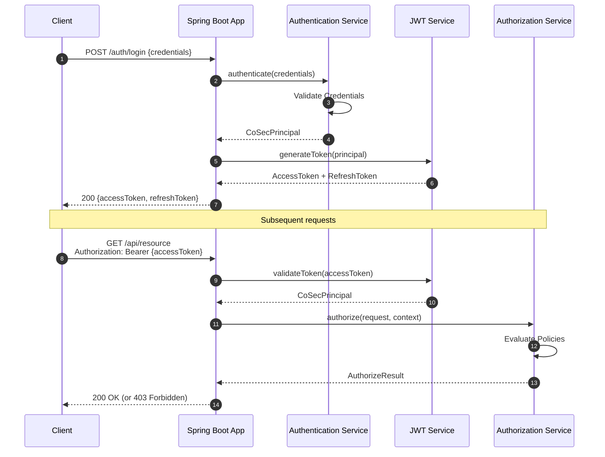
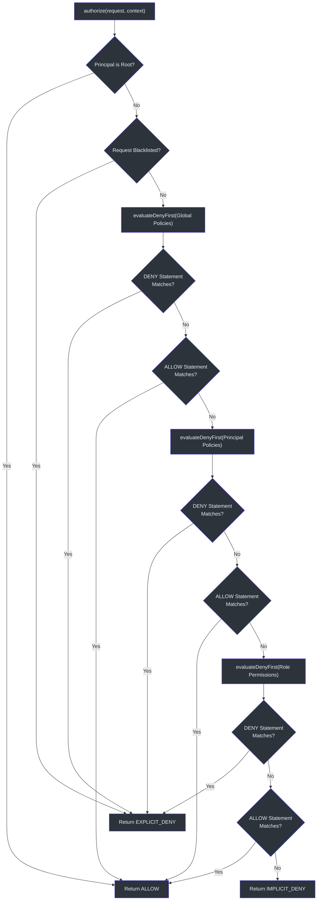

# Quick Start

This guide walks you through adding CoSec to a Spring Boot application, configuring JWT authentication, creating your first policy, and verifying access control with curl.

## Prerequisites

- Java 17+
- Kotlin 2.x or Java 17 project
- Spring Boot 4.x
- Gradle (Kotlin DSL recommended)

## Step 1: Add the Dependency

Add the CoSec Spring Boot starter to your `build.gradle.kts`:

```kotlin
dependencies {
    implementation("me.ahoo.cosec:cosec-spring-boot-starter")
}
```

The starter transitively pulls in `cosec-core`, `cosec-api`, and `cosec-jwt`. Additional integrations (WebFlux, Gateway, caching) are available as Gradle feature variants:

```kotlin
dependencies {
    implementation("me.ahoo.cosec:cosec-spring-boot-starter") {
        capabilities {
            requireCapability("me.ahoo.cosec:cosec-spring-boot-starter:webflux-support")
        }
    }
    // Or for Gateway:
    // requireCapability("me.ahoo.cosec:cosec-spring-boot-starter:gateway-support")
    // Or for caching (Redis):
    // requireCapability("me.ahoo.cosec:cosec-spring-boot-starter:cache-support")
}
```

The starter auto-configures security components based on detected dependencies. The auto-configuration is gated by `@ConditionalOnCoSecEnabled` ([cosec-spring-boot-starter/src/main/kotlin/me/ahoo/cosec/spring/boot/starter/ConditionalOnCoSecEnabled.kt](https://github.com/Ahoo-Wang/CoSec/blob/main/cosec-spring-boot-starter/src/main/kotlin/me/ahoo/cosec/spring/boot/starter/ConditionalOnCoSecEnabled.kt)).

## Step 2: Configure Application Properties

Create or edit your `application.yaml`:

```yaml
cosec:
  enabled: true
  jwt:
    algorithm: hmac256
    secret: "your-256-bit-secret-key-here-change-me"
    token-validity:
      access: PT10M     # 10 minutes
      refresh: P7D      # 7 days
  authorization:
    enabled: true
    local-policy:
      enabled: true
      locations:
        - "classpath:cosec-policy/*-policy.json"
```

| Property | Type | Default | Description |
|----------|------|---------|-------------|
| `cosec.enabled` | `Boolean` | `true` | Master switch for CoSec |
| `cosec.jwt.algorithm` | `Enum` | `hmac256` | JWT signing algorithm (`hmac256`, `hmac384`, `hmac512`) |
| `cosec.jwt.secret` | `String` | *required* | Secret key for JWT signing |
| `cosec.jwt.token-validity.access` | `Duration` | `PT10M` | Access token TTL |
| `cosec.jwt.token-validity.refresh` | `Duration` | `P7D` | Refresh token TTL |
| `cosec.authorization.enabled` | `Boolean` | `true` | Enable authorization |
| `cosec.authorization.local-policy.enabled` | `Boolean` | `false` | Load policies from local JSON files |
| `cosec.authorization.local-policy.locations` | `Set<String>` | `classpath:cosec-policy/*-policy.json` | Glob patterns for policy files |

JWT properties are defined in `JwtProperties` ([cosec-spring-boot-starter/src/main/kotlin/me/ahoo/cosec/spring/boot/starter/jwt/JwtProperties.kt:28](https://github.com/Ahoo-Wang/CoSec/blob/main/cosec-spring-boot-starter/src/main/kotlin/me/ahoo/cosec/spring/boot/starter/jwt/JwtProperties.kt#L28)) and authorization properties in `AuthorizationProperties` ([cosec-spring-boot-starter/src/main/kotlin/me/ahoo/cosec/spring/boot/starter/authorization/AuthorizationProperties.kt:27](https://github.com/Ahoo-Wang/CoSec/blob/main/cosec-spring-boot-starter/src/main/kotlin/me/ahoo/cosec/spring/boot/starter/authorization/AuthorizationProperties.kt#L27)).

## Step 3: Create Your First Policy

Create a file at `src/main/resources/cosec-policy/anonymous-access-policy.json`:

```json
{
  "id": "anonymous-access",
  "name": "Anonymous Access",
  "category": "access",
  "description": "Allow anonymous access to auth endpoints and health checks",
  "type": "global",
  "tenantId": "(platform)",
  "statements": [
    {
      "name": "AuthEndpoints",
      "action": [
        "/auth/login",
        "/auth/register",
        "/auth/refresh"
      ]
    },
    {
      "name": "HealthCheck",
      "action": [
        "/actuator/health",
        "/actuator/health/readiness",
        "/actuator/health/liveness"
      ]
    }
  ]
}
```

This policy uses the default ALLOW effect (no `effect` field defaults to `"allow"`) and matches requests by path pattern. Statements without a `condition` apply to all requests, including anonymous ones.

The policy JSON format follows the schema at [schema/cosec-policy.schema.json](https://github.com/Ahoo-Wang/CoSec/blob/main/schema/cosec-policy.schema.json).

## Step 4: Start the Application

```bash
./gradlew bootRun
```

On startup, CoSec will:

1. Auto-configure the security filter chain
2. Load local policy files from the configured locations
3. Register `ActionMatcherFactory` and `ConditionMatcherFactory` implementations via SPI
4. Initialize the JWT token service with the configured algorithm and secret

The auto-configuration entry point is `CoSecAutoConfiguration` ([cosec-spring-boot-starter/src/main/kotlin/me/ahoo/cosec/spring/boot/starter/CoSecAutoConfiguration.kt:37](https://github.com/Ahoo-Wang/CoSec/blob/main/cosec-spring-boot-starter/src/main/kotlin/me/ahoo/cosec/spring/boot/starter/CoSecAutoConfiguration.kt#L37)).

## Step 5: Test with curl

**Access a public endpoint (allowed by policy):**

```bash
curl -v http://localhost:8080/actuator/health
# Expected: 200 OK
```

**Access a protected endpoint without a token:**

```bash
curl -v http://localhost:8080/api/users
# Expected: 401 Unauthorized (no credentials)
# or 403 Forbidden (anonymous, no matching ALLOW policy)
```

## Authentication Flow

When a client authenticates, the following sequence occurs:



The `Authentication` interface is generic over credential type `C` and principal type `P` ([cosec-api/src/main/kotlin/me/ahoo/cosec/api/authentication/Authentication.kt:32](https://github.com/Ahoo-Wang/CoSec/blob/main/cosec-api/src/main/kotlin/me/ahoo/cosec/api/authentication/Authentication.kt#L32)):

```kotlin
interface Authentication<C : Credentials, out P : CoSecPrincipal> {
    val supportCredentials: Class<C>
    fun authenticate(credentials: C): Mono<out P>
}
```

## Creating a Custom Authentication (Kotlin)

To add your own authentication mechanism, implement the `Authentication` interface:

```kotlin
@Component
class UsernamePasswordAuthentication(
    private val userRepository: UserRepository
) : Authentication<UsernamePasswordCredentials, TenantPrincipal> {

    override val supportCredentials = UsernamePasswordCredentials::class.java

    override fun authenticate(
        credentials: UsernamePasswordCredentials
    ): Mono<TenantPrincipal> {
        return userRepository.findByUsername(credentials.username)
            .filter { passwordEncoder.matches(credentials.password, it.hashedPassword) }
            .map { user ->
                SimpleTenantPrincipal(
                    id = user.id,
                    roles = user.roles,
                    policies = user.policies,
                    tenantId = user.tenantId
                )
            }
    }
}
```

## Project Structure

After following this guide, your project should look like this:

```
src/main/
  resources/
    application.yaml
    cosec-policy/
      anonymous-access-policy.json
```

## Authorization Evaluation Order

Understanding the evaluation order is critical when designing policies:



This logic is implemented in `SimpleAuthorization` ([cosec-core/src/main/kotlin/me/ahoo/cosec/authorization/SimpleAuthorization.kt:48](https://github.com/Ahoo-Wang/CoSec/blob/main/cosec-core/src/main/kotlin/me/ahoo/cosec/authorization/SimpleAuthorization.kt#L48)). The DENY-first approach ensures explicit deny always takes precedence over any allow.

## Related Pages

- [CoSec Overview](./overview.md) — Architecture and key concepts
- [Configuration Reference](./configuration.md) — All properties and their defaults
- [Policy Authoring Guide](./policy-authoring.md) — Writing JSON policies

## References

- [cosec-spring-boot-starter/build.gradle.kts](https://github.com/Ahoo-Wang/CoSec/blob/main/cosec-spring-boot-starter/build.gradle.kts)
- [cosec-spring-boot-starter/src/main/kotlin/me/ahoo/cosec/spring/boot/starter/CoSecAutoConfiguration.kt](https://github.com/Ahoo-Wang/CoSec/blob/main/cosec-spring-boot-starter/src/main/kotlin/me/ahoo/cosec/spring/boot/starter/CoSecAutoConfiguration.kt)
- [cosec-spring-boot-starter/src/main/kotlin/me/ahoo/cosec/spring/boot/starter/CoSecProperties.kt](https://github.com/Ahoo-Wang/CoSec/blob/main/cosec-spring-boot-starter/src/main/kotlin/me/ahoo/cosec/spring/boot/starter/CoSecProperties.kt)
- [cosec-spring-boot-starter/src/main/kotlin/me/ahoo/cosec/spring/boot/starter/jwt/JwtProperties.kt](https://github.com/Ahoo-Wang/CoSec/blob/main/cosec-spring-boot-starter/src/main/kotlin/me/ahoo/cosec/spring/boot/starter/jwt/JwtProperties.kt)
- [cosec-spring-boot-starter/src/main/kotlin/me/ahoo/cosec/spring/boot/starter/authorization/AuthorizationProperties.kt](https://github.com/Ahoo-Wang/CoSec/blob/main/cosec-spring-boot-starter/src/main/kotlin/me/ahoo/cosec/spring/boot/starter/authorization/AuthorizationProperties.kt)
- [cosec-api/src/main/kotlin/me/ahoo/cosec/api/authentication/Authentication.kt](https://github.com/Ahoo-Wang/CoSec/blob/main/cosec-api/src/main/kotlin/me/ahoo/cosec/api/authentication/Authentication.kt)
- [cosec-core/src/main/kotlin/me/ahoo/cosec/authorization/SimpleAuthorization.kt](https://github.com/Ahoo-Wang/CoSec/blob/main/cosec-core/src/main/kotlin/me/ahoo/cosec/authorization/SimpleAuthorization.kt)
- [cosec-gateway-server/src/main/resources/cosec-policy/health-probe-policy.json](https://github.com/Ahoo-Wang/CoSec/blob/main/cosec-gateway-server/src/main/resources/cosec-policy/health-probe-policy.json)
