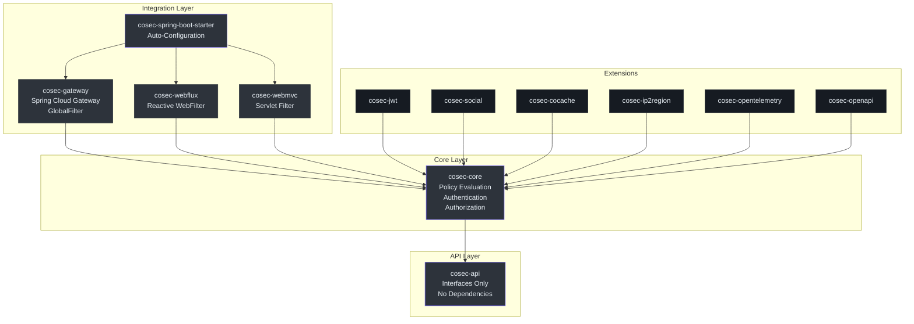
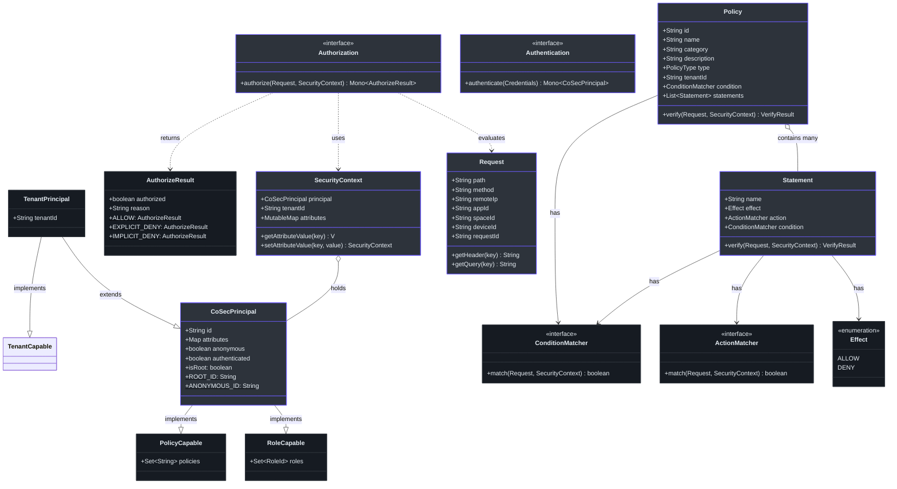
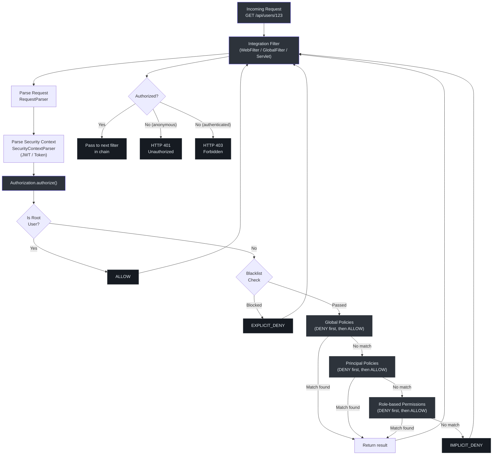
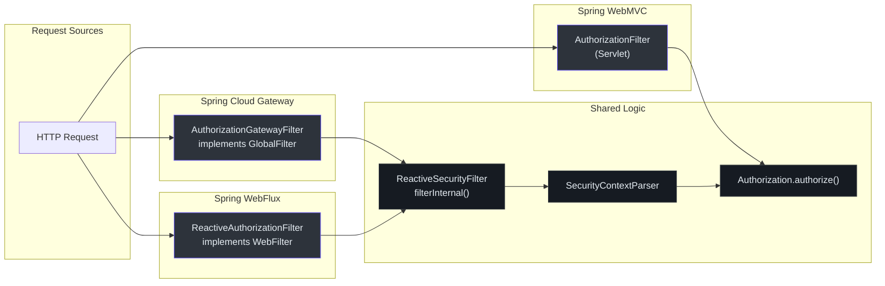
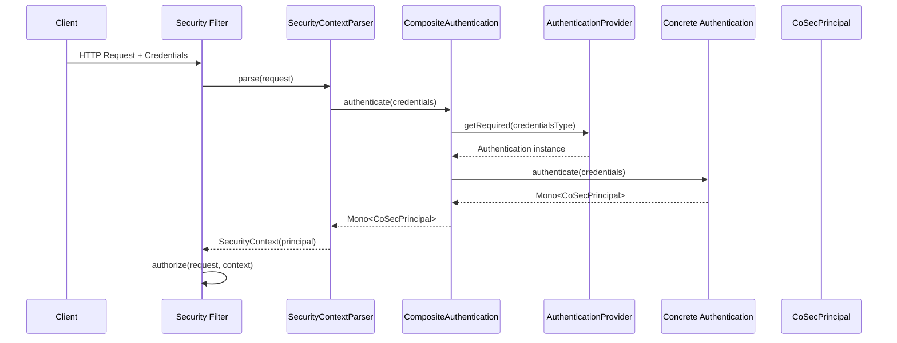

# Contributor Guide

Welcome to CoSec -- an RBAC-based and Policy-based Multi-Tenant Reactive Security Framework for the JVM. This guide is designed to get you from zero to productive contributor as quickly as possible, whether you are coming from Python, JavaScript, or another JVM language.

---

## Part I: Foundations

### Kotlin for Python and JavaScript Engineers

Kotlin is a statically typed language that runs on the JVM. If you have written Python or JavaScript, many Kotlin concepts will feel familiar, but the type system and null safety require some adjustment. This section gives you a side-by-side reference so you can read CoSec code fluently.

#### Variables and Types

| Concept | Python | JavaScript | Kotlin |
|---|---|---|---|
| Immutable variable | `x = 1` (convention: uppercase) | `const x = 1` | `val x = 1` |
| Mutable variable | `x = 1` | `let x = 1` | `var x = 1` |
| Type annotation | `x: int = 1` | `x: number = 1` (TS) | `val x: Int = 1` |
| String template | `f"Hello {name}"` | `` `Hello ${name}` `` | `"Hello $name"` |
| Null type | `Optional[str]` | `string \| null` (TS) | `String?` |
| Non-null assertion | `x!` (TS) | `x!` (TS) | `x!!` |
| Safe call | N/A | `x?.method()` (TS) | `x?.method()` |
| Elvis (default) | `x or default` | `x ?? default` | `x ?: default` |

#### Functions and Lambdas

| Concept | Python | JavaScript | Kotlin |
|---|---|---|---|
| Function | `def add(a, b):` | `function add(a, b) {` | `fun add(a: Int, b: Int): Int` |
| Lambda | `lambda x: x + 1` | `(x) => x + 1` | `{ x -> x + 1 }` |
| Single-expression | `def double(x): return x * 2` | `const double = (x) => x * 2` | `fun double(x: Int) = x * 2` |
| Default parameter | `def f(x=1):` | `function f(x=1) {` | `fun f(x: Int = 1)` |
| Named args | `f(name="alice")` | `f({ name: "alice" })` | `f(name = "alice")` |

#### Classes and Interfaces

| Concept | Python | JavaScript | Kotlin |
|---|---|---|---|
| Class | `class Foo:` | `class Foo { }` | `class Foo { }` |
| Interface | (abstract base class) | (not standard) | `interface Foo { }` |
| Data class | `@dataclass` | (manual) | `data class Foo(val x: Int)` |
| Implement interface | `class Bar(Foo):` | `class Bar extends Foo` | `class Bar : Foo` |
| Enum | `Enum` module | `enum` (TS) | `enum class Foo { A, B }` |
| Companion object | `@classmethod` | `static` | `companion object { }` |
| Extension function | (monkey-patch) | `prototype.method` | `fun String.first() = this[0]` |

#### Collections

| Concept | Python | JavaScript | Kotlin |
|---|---|---|---|
| List | `[1, 2, 3]` | `[1, 2, 3]` | `listOf(1, 2, 3)` |
| Mutable list | `[]` | `[]` | `mutableListOf<Int>()` |
| Map / dict | `{"a": 1}` | `{ a: 1 }` | `mapOf("a" to 1)` |
| Set | `{1, 2}` | `new Set([1, 2])` | `setOf(1, 2)` |
| Filter | `[x for x in l if x > 0]` | `l.filter(x => x > 0)` | `l.filter { it > 0 }` |
| Map (transform) | `[f(x) for x in l]` | `l.map(x => f(x))` | `l.map { f(it) }` |
| Flat map | `[y for x in l for y in f(x)]` | `l.flatMap(x => f(x))` | `l.flatMap { f(it) }` |
| Fold / reduce | `functools.reduce(op, l, init)` | `l.reduce((a, b) => a + b)` | `l.fold(0) { acc, x -> acc + x }` |
| `it` keyword | N/A | N/A | Implicit single lambda param |

#### Nullable Types and Smart Casts

Kotlin enforces null safety at the compiler level. A `String` cannot hold `null`; only `String?` can.

```kotlin
val name: String = "Alice"   // cannot be null
val maybe: String? = null    // can be null

// Smart cast after null check
if (maybe != null) {
    println(maybe.length)    // compiler knows maybe is non-null here
}
```

You will see `?.` (safe call), `?:` (elvis), and `!!` (non-null assertion) throughout CoSec. The `requireNotNull()` function is also common -- it throws `IllegalArgumentException` if the value is null ([PermissionVerifier.kt:69](https://github.com/Ahoo-Wang/CoSec/blob/main/cosec-api/src/main/kotlin/me/ahoo/cosec/api/policy/PermissionVerifier.kt#L69)).

#### Key Kotlin Idioms in CoSec

1. **`fun interface`** (SAM interfaces): CoSec uses `fun interface` to define single-abstract-method interfaces that can be instantiated with lambdas. For example, `PermissionVerifier` is a `fun interface` ([PermissionVerifier.kt:29](https://github.com/Ahoo-Wang/CoSec/blob/main/cosec-api/src/main/kotlin/me/ahoo/cosec/api/policy/PermissionVerifier.kt#L29)).

2. **`companion object`**: Kotlin's replacement for `static` members. Used extensively for constants and factory methods (e.g., `CoSecPrincipal.ROOT_ID` at [CoSecPrincipal.kt:80](https://github.com/Ahoo-Wang/CoSec/blob/main/cosec-api/src/main/kotlin/me/ahoo/cosec/api/principal/CoSecPrincipal.kt#L80)).

3. **Extension functions**: Functions added to existing types without modifying them. For example, `CoSecPrincipal.isRoot` is an extension property ([CoSecPrincipal.kt:94](https://github.com/Ahoo-Wang/CoSec/blob/main/cosec-api/src/main/kotlin/me/ahoo/cosec/api/principal/CoSecPrincipal.kt#L94)).

4. **Type aliases**: Shorthand for complex types. `typealias PolicyId = String` at [Policy.kt:22](https://github.com/Ahoo-Wang/CoSec/blob/main/cosec-api/src/main/kotlin/me/ahoo/cosec/api/policy/Policy.kt#L22) and `typealias RoleId = String` at [RoleCapable.kt:19](https://github.com/Ahoo-Wang/CoSec/blob/main/cosec-api/src/main/kotlin/me/ahoo/cosec/api/principal/RoleCapable.kt#L19).

5. **Delegation (`by`)**: Kotlin supports class and property delegation. The `Delegated.kt` file in cosec-core provides delegation utilities ([Delegated.kt](https://github.com/Ahoo-Wang/CoSec/blob/main/cosec-core/src/main/kotlin/me/ahoo/cosec/Delegated.kt)).

6. **Sealed classes and enums**: Used for fixed sets of values. `Effect` is an enum with `ALLOW` and `DENY` values ([Effect.kt:28](https://github.com/Ahoo-Wang/CoSec/blob/main/cosec-api/src/main/kotlin/me/ahoo/cosec/api/policy/Effect.kt#L28)).

### Spring Boot and Project Reactor from First Principles

CoSec is built on Spring Boot 4 and Project Reactor. Understanding the reactive paradigm is essential for contributing.

#### What is Reactive Programming?

Reactive programming is an asynchronous, event-driven paradigm where data flows through streams. Instead of blocking a thread while waiting for a result, you declare *what* should happen when data arrives.

In Python terms, think of generators (`yield`) plus `asyncio`. In JavaScript terms, think of `Promises` and `Observable` (RxJS).

#### Mono and Flux

Project Reactor provides two core types:

- **`Mono<T>`**: A stream that emits at most one item, then completes. Equivalent to a `Promise<T>` in JavaScript or `Future<T>` in Python.
- **`Flux<T>`**: A stream that emits zero or more items, then completes. Equivalent to an `Observable<T>` in RxJS.

CoSec uses `Mono` extensively because authentication and authorization typically produce a single result:

```kotlin
// Authentication returns Mono<CoSecPrincipal> (one result or empty)
fun authenticate(credentials: Credentials): Mono<out CoSecPrincipal>
// Source: cosec-api/.../Authentication.kt:44

// Authorization returns Mono<AuthorizeResult> (one result)
fun authorize(request: Request, context: SecurityContext): Mono<AuthorizeResult>
// Source: cosec-api/.../Authorization.kt:43
```

#### The Reactive Pipeline

Reactive streams form pipelines using operators. Here are the most common operators you will see in CoSec:

| Operator | Python equivalent | JavaScript equivalent | Purpose |
|---|---|---|---|
| `map` | `map(fn, iterable)` | `promise.then(fn)` | Transform the value |
| `flatMap` | `async for x in gen: yield x` | `promise.then(asyncFn)` | Async transform |
| `filter` | `filter(fn, iterable)` | N/A (use `if` in `.then`) | Keep matching items |
| `switchIfEmpty` | `if not result: fallback()` | `promise.catch(fallback)` | Provide alternative when empty |
| `onErrorResume` | `try/except` | `promise.catch(handler)` | Handle errors reactively |
| `toMono()` | `Future(result)` | `Promise.resolve(result)` | Wrap value in Mono |

A real example from `SimpleAuthorization.authorize()` at [SimpleAuthorization.kt:213](https://github.com/Ahoo-Wang/CoSec/blob/main/cosec-core/src/main/kotlin/me/ahoo/cosec/authorization/SimpleAuthorization.kt#L213):

```kotlin
override fun authorize(request: Request, context: SecurityContext): Mono<AuthorizeResult> {
    val verifyResult = verifyRoot(context)
    if (verifyResult == VerifyResult.ALLOW) {
        return AuthorizeResult.ALLOW.toMono()        // wrap value in Mono
    }
    return blacklistChecker
        .check(request, context)                      // Mono<Boolean>
        .flatMap { allowed ->                         // async transform
            if (!allowed) {
                return@flatMap AuthorizeResult.EXPLICIT_DENY.toMono()
            }
            verify(request, context)                  // chain to next step
        }
}
```

#### Testing Reactive Code with StepVerifier

Reactor provides `StepVerifier` to test reactive streams declaratively. You will see this pattern in every test:

```kotlin
authorization.authorize(request, securityContext)
    .test()                                        // convert Mono to StepVerifier
    .expectNext(AuthorizeResult.ALLOW)             // assert the emitted value
    .verifyComplete()                              // assert stream completes
// Source: cosec-core/.../SimpleAuthorizationTest.kt:52-54
```

#### Spring Boot Auto-Configuration

Spring Boot auto-configuration is a convention-over-configuration mechanism. Classes annotated with `@AutoConfiguration` register beans (Spring-managed objects) automatically when certain conditions are met.

In CoSec, `CoSecAutoConfiguration` is the entry point ([CoSecAutoConfiguration.kt:37](https://github.com/Ahoo-Wang/CoSec/blob/main/cosec-spring-boot-starter/src/main/kotlin/me/ahoo/cosec/spring/boot/starter/CoSecAutoConfiguration.kt#L37)):

```kotlin
@ConditionalOnCoSecEnabled                    // only active when cosec.enabled=true
@AutoConfiguration(before = [JacksonAutoConfiguration::class])
@EnableConfigurationProperties(CoSecProperties::class)
class CoSecAutoConfiguration {
    @Bean
    @ConditionalOnMissingBean
    fun coSecModule(): CoSecModule = CoSecModule()
    // ...
}
```

Conditional annotations control when features are activated:

- `@ConditionalOnCoSecEnabled` -- checks `cosec.enabled` property ([ConditionalOnCoSecEnabled.kt:23](https://github.com/Ahoo-Wang/CoSec/blob/main/cosec-spring-boot-starter/src/main/kotlin/me/ahoo/cosec/spring/boot/starter/ConditionalOnCoSecEnabled.kt#L23))
- `@ConditionalOnJwtEnabled` -- activates JWT support
- `@ConditionalOnAuthorizationEnabled` -- activates authorization
- `@ConditionalOnGatewayEnabled` -- activates Spring Cloud Gateway integration

The `MatcherFactoryRegister` bean ([MatcherFactoryRegister.kt:24](https://github.com/Ahoo-Wang/CoSec/blob/main/cosec-spring-boot-starter/src/main/kotlin/me/ahoo/cosec/spring/boot/starter/policy/MatcherFactoryRegister.kt#L24)) is a `SmartLifecycle` that discovers all `ActionMatcherFactory` and `ConditionMatcherFactory` beans from the Spring context and registers them with the SPI providers.

---

## Part II: Architecture and Domain Model

### Big Picture

CoSec is a multi-module Gradle project. Every public API is defined as an interface in `cosec-api`; all implementations live in `cosec-core` or integration modules. This separation means you can understand the contract by reading `cosec-api` alone.



<!-- Sources:
  settings.gradle.kts - module definitions
  build.gradle.kts - dependency and plugin configuration
-->

### Module Dependency Graph

The module dependency order is defined in `settings.gradle.kts` ([settings.gradle.kts](https://github.com/Ahoo-Wang/CoSec/blob/main/settings.gradle.kts)) and the build logic in `build.gradle.kts` ([build.gradle.kts](https://github.com/Ahoo-Wang/CoSec/blob/main/build.gradle.kts)):

| Module | Depends On | Published | Purpose |
|---|---|---|---|
| `cosec-api` | Nothing | Yes | Core interfaces, zero framework deps |
| `cosec-core` | `cosec-api` | Yes | Policy evaluation, authN/authZ implementations |
| `cosec-jwt` | `cosec-core` | Yes | JWT token handling |
| `cosec-social` | `cosec-core` | Yes | OAuth social login via JustAuth |
| `cosec-cocache` | `cosec-core` | Yes | Redis caching for policies/permissions |
| `cosec-ip2region` | `cosec-core` | Yes | IP geolocation enrichment |
| `cosec-opentelemetry` | `cosec-core` | Yes | OpenTelemetry tracing |
| `cosec-openapi` | `cosec-core` | Yes | Swagger/OpenAPI integration |
| `cosec-webflux` | `cosec-core` | Yes | Reactive WebFilter integration |
| `cosec-webmvc` | `cosec-core` | Yes | Servlet filter integration |
| `cosec-gateway` | `cosec-webflux` | Yes | Spring Cloud Gateway GlobalFilter |
| `cosec-spring-boot-starter` | all above | Yes | Auto-configuration aggregator |
| `cosec-gateway-server` | `cosec-spring-boot-starter` | **No** | Standalone gateway application |
| `cosec-dependencies` | Nothing | Yes (BOM) | Version management |
| `cosec-bom` | Nothing | Yes (BOM) | Bill of Materials |

The `cosec-gateway-server` module is the only non-publishable module, as configured in `build.gradle.kts` at [build.gradle.kts:33](https://github.com/Ahoo-Wang/CoSec/blob/main/build.gradle.kts#L33):

```kotlin
val serverProjects = setOf(
    project(":cosec-gateway-server"),
)
```

### Domain Model

The CoSec domain model is inspired by AWS IAM. Understanding the relationships between the core types is essential.



<!-- Sources:
  cosec-api/src/main/kotlin/me/ahoo/cosec/api/principal/CoSecPrincipal.kt
  cosec-api/src/main/kotlin/me/ahoo/cosec/api/policy/Policy.kt
  cosec-api/src/main/kotlin/me/ahoo/cosec/api/policy/Statement.kt
  cosec-api/src/main/kotlin/me/ahoo/cosec/api/context/SecurityContext.kt
  cosec-api/src/main/kotlin/me/ahoo/cosec/api/authorization/Authorization.kt
  cosec-api/src/main/kotlin/me/ahoo/cosec/api/authentication/Authentication.kt
  cosec-api/src/main/kotlin/me/ahoo/cosec/api/context/request/Request.kt
-->

#### Core Interfaces in Detail

**CoSecPrincipal** ([CoSecPrincipal.kt:35](https://github.com/Ahoo-Wang/CoSec/blob/main/cosec-api/src/main/kotlin/me/ahoo/cosec/api/principal/CoSecPrincipal.kt#L35)) -- The central identity type. Extends `java.security.Principal`, `PolicyCapable`, and `RoleCapable`. Key properties:

- `id` -- unique identifier ([line 42](https://github.com/Ahoo-Wang/CoSec/blob/main/cosec-api/src/main/kotlin/me/ahoo/cosec/api/principal/CoSecPrincipal.kt#L42))
- `anonymous` -- true when `id == ANONYMOUS_ID` (`"(0)"`) ([line 61](https://github.com/Ahoo-Wang/CoSec/blob/main/cosec-api/src/main/kotlin/me/ahoo/cosec/api/principal/CoSecPrincipal.kt#L61))
- `authenticated` -- inverse of `anonymous` ([line 68](https://github.com/Ahoo-Wang/CoSec/blob/main/cosec-api/src/main/kotlin/me/ahoo/cosec/api/principal/CoSecPrincipal.kt#L68))
- `ROOT_ID` -- defaults to `"cosec"`, configurable via system property `cosec.root` ([line 80](https://github.com/Ahoo-Wang/CoSec/blob/main/cosec-api/src/main/kotlin/me/ahoo/cosec/api/principal/CoSecPrincipal.kt#L80))
- `ANONYMOUS_ID` -- `"(0)"` ([line 87](https://github.com/Ahoo-Wang/CoSec/blob/main/cosec-api/src/main/kotlin/me/ahoo/cosec/api/principal/CoSecPrincipal.kt#L87))
- `isRoot` -- extension property checking `ROOT_ID == id` ([line 94](https://github.com/Ahoo-Wang/CoSec/blob/main/cosec-api/src/main/kotlin/me/ahoo/cosec/api/principal/CoSecPrincipal.kt#L94))

**TenantPrincipal** ([TenantPrincipal.kt:26](https://github.com/Ahoo-Wang/CoSec/blob/main/cosec-api/src/main/kotlin/me/ahoo/cosec/api/principal/TenantPrincipal.kt#L26)) -- Extends `CoSecPrincipal` with `TenantCapable`, adding `tenantId`. Policies are tenant-scoped.

**Policy** ([Policy.kt:45](https://github.com/Ahoo-Wang/CoSec/blob/main/cosec-api/src/main/kotlin/me/ahoo/cosec/api/policy/Policy.kt#L45)) -- A named collection of `Statement`s with an optional `ConditionMatcher`. The `verify()` method at [line 76](https://github.com/Ahoo-Wang/CoSec/blob/main/cosec-api/src/main/kotlin/me/ahoo/cosec/api/policy/Policy.kt#L76) implements the deny-first evaluation algorithm:
1. Check policy-level condition. If it fails, return `IMPLICIT_DENY`.
2. Evaluate all DENY statements. If any matches, return `EXPLICIT_DENY`.
3. Evaluate all ALLOW statements. If any matches, return `ALLOW`.
4. Return `IMPLICIT_DENY`.

**Statement** ([Statement.kt:37](https://github.com/Ahoo-Wang/CoSec/blob/main/cosec-api/src/main/kotlin/me/ahoo/cosec/api/policy/Statement.kt#L37)) -- A single permission rule with `Effect`, `ActionMatcher`, and `ConditionMatcher`. Its `verify()` method at [line 60](https://github.com/Ahoo-Wang/CoSec/blob/main/cosec-api/src/main/kotlin/me/ahoo/cosec/api/policy/Statement.kt#L60) checks the action matcher first, then the condition matcher, then maps the effect to a `VerifyResult`.

**Authentication** ([Authentication.kt:32](https://github.com/Ahoo-Wang/CoSec/blob/main/cosec-api/src/main/kotlin/me/ahoo/cosec/api/authentication/Authentication.kt#L32)) -- Generic interface parameterized by credential type `C` and principal type `P`. Returns `Mono<out P>`.

**Authorization** ([Authorization.kt:35](https://github.com/Ahoo-Wang/CoSec/blob/main/cosec-api/src/main/kotlin/me/ahoo/cosec/api/authorization/Authorization.kt#L35)) -- A `fun interface` (SAM) that takes a `Request` and `SecurityContext` and returns `Mono<AuthorizeResult>`.

**Request** ([Request.kt:36](https://github.com/Ahoo-Wang/CoSec/blob/main/cosec-api/src/main/kotlin/me/ahoo/cosec/api/context/request/Request.kt#L36)) -- Represents an incoming HTTP request with `path`, `method`, `remoteIp`, `appId`, `spaceId`, `deviceId`, and `requestId`.

**SecurityContext** ([SecurityContext.kt:34](https://github.com/Ahoo-Wang/CoSec/blob/main/cosec-api/src/main/kotlin/me/ahoo/cosec/api/context/SecurityContext.kt#L34)) -- Holds the `CoSecPrincipal`, tenant info, and mutable `attributes` for passing data between components during authorization.

#### Tenant Types

CoSec supports three tenant types, defined in the `Tenant` interface ([Tenant.kt:22](https://github.com/Ahoo-Wang/CoSec/blob/main/cosec-api/src/main/kotlin/me/ahoo/cosec/api/tenant/Tenant.kt#L22)):

| Tenant Type | ID Constant | Description |
|---|---|---|
| Platform | `"(platform)"` | Root platform tenant, manages all other tenants |
| Default | `"(0)"` | Default tenant for non-multi-tenant scenarios |
| User | any other ID | Customer-specific tenant |

### Authorization Data Flow

The following diagram shows how a request flows through the CoSec authorization pipeline:



<!-- Sources:
  cosec-core/src/main/kotlin/me/ahoo/cosec/authorization/SimpleAuthorization.kt:213-232
  cosec-webflux/src/main/kotlin/me/ahoo/cosec/webflux/ReactiveSecurityFilter.kt:66-116
-->

#### Authorization Flow Detail (SimpleAuthorization)

`SimpleAuthorization` at [SimpleAuthorization.kt:48](https://github.com/Ahoo-Wang/CoSec/blob/main/cosec-core/src/main/kotlin/me/ahoo/cosec/authorization/SimpleAuthorization.kt#L48) is the core authorization implementation. The `authorize()` method at [line 213](https://github.com/Ahoo-Wang/CoSec/blob/main/cosec-core/src/main/kotlin/me/ahoo/cosec/authorization/SimpleAuthorization.kt#L213) follows this exact order:

1. **Root user check** ([line 217](https://github.com/Ahoo-Wang/CoSec/blob/main/cosec-core/src/main/kotlin/me/ahoo/cosec/authorization/SimpleAuthorization.kt#L217)) -- If `context.principal.isRoot`, return `ALLOW` immediately. Root bypasses everything.

2. **Blacklist check** ([line 221](https://github.com/Ahoo-Wang/CoSec/blob/main/cosec-core/src/main/kotlin/me/ahoo/cosec/authorization/SimpleAuthorization.kt#L221)) -- If the `BlacklistChecker` ([BlacklistChecker.kt:29](https://github.com/Ahoo-Wang/CoSec/blob/main/cosec-core/src/main/kotlin/me/ahoo/cosec/blacklist/BlacklistChecker.kt#L29)) blocks the request, return `EXPLICIT_DENY`. Default is `NoOp` which passes everything.

3. **Verify pipeline** ([line 194](https://github.com/Ahoo-Wang/CoSec/blob/main/cosec-core/src/main/kotlin/me/ahoo/cosec/authorization/SimpleAuthorization.kt#L194)) -- A reactive chain using `switchIfEmpty`:
   - `verifyGlobalPolicies` ([line 156](https://github.com/Ahoo-Wang/CoSec/blob/main/cosec-core/src/main/kotlin/me/ahoo/cosec/authorization/SimpleAuthorization.kt#L156)) -- Evaluate global policies from `PolicyRepository.getGlobalPolicy()`.
   - `verifyPrincipalPolicies` ([line 166](https://github.com/Ahoo-Wang/CoSec/blob/main/cosec-core/src/main/kotlin/me/ahoo/cosec/authorization/SimpleAuthorization.kt#L166)) -- Evaluate policies assigned to the principal.
   - `verifyAppRolePermission` ([line 180](https://github.com/Ahoo-Wang/CoSec/blob/main/cosec-core/src/main/kotlin/me/ahoo/cosec/authorization/SimpleAuthorization.kt#L180)) -- Evaluate role-based permissions.
   - If none matches, return `IMPLICIT_DENY`.

Each policy verification uses the `evaluateDenyFirst` helper ([line 61](https://github.com/Ahoo-Wang/CoSec/blob/main/cosec-core/src/main/kotlin/me/ahoo/cosec/authorization/SimpleAuthorization.kt#L61)) which always processes DENY statements before ALLOW statements.

### Integration Layer: How Requests Enter CoSec

CoSec integrates with three Spring request handling models. All three follow the same pattern: parse the request, extract the security context, run authorization, and either pass the request along or reject it.



<!-- Sources:
  cosec-gateway/src/main/kotlin/me/ahoo/cosec/gateway/AuthorizationGatewayFilter.kt
  cosec-webflux/src/main/kotlin/me/ahoo/cosec/webflux/ReactiveAuthorizationFilter.kt
  cosec-webflux/src/main/kotlin/me/ahoo/cosec/webflux/ReactiveSecurityFilter.kt
-->

**WebFlux** (`cosec-webflux`): `ReactiveAuthorizationFilter` at [ReactiveAuthorizationFilter.kt:36](https://github.com/Ahoo-Wang/CoSec/blob/main/cosec-webflux/src/main/kotlin/me/ahoo/cosec/webflux/ReactiveAuthorizationFilter.kt#L36) implements `WebFilter` and `Ordered`. It extends `ReactiveSecurityFilter` which contains the shared filtering logic at [ReactiveSecurityFilter.kt:57](https://github.com/Ahoo-Wang/CoSec/blob/main/cosec-webflux/src/main/kotlin/me/ahoo/cosec/webflux/ReactiveSecurityFilter.kt#L57). The filter order is `1000`, set at [line 49](https://github.com/Ahoo-Wang/CoSec/blob/main/cosec-webflux/src/main/kotlin/me/ahoo/cosec/webflux/ReactiveAuthorizationFilter.kt#L49).

**Gateway** (`cosec-gateway`): `AuthorizationGatewayFilter` at [AuthorizationGatewayFilter.kt:31](https://github.com/Ahoo-Wang/CoSec/blob/main/cosec-gateway/src/main/kotlin/me/ahoo/cosec/gateway/AuthorizationGatewayFilter.kt#L31) implements Spring Cloud Gateway's `GlobalFilter`. It also extends `ReactiveSecurityFilter`. The filter order is `HIGHEST_PRECEDENCE + 10` at [line 42](https://github.com/Ahoo-Wang/CoSec/blob/main/cosec-gateway/src/main/kotlin/me/ahoo/cosec/gateway/AuthorizationGatewayFilter.kt#L42).

**Security Filter Logic**: The `ReactiveSecurityFilter.filterInternal()` method at [ReactiveSecurityFilter.kt:66](https://github.com/Ahoo-Wang/CoSec/blob/main/cosec-webflux/src/main/kotlin/me/ahoo/cosec/webflux/ReactiveSecurityFilter.kt#L66) handles the full request lifecycle:
- Parse the request using `RequestParser` ([line 70](https://github.com/Ahoo-Wang/CoSec/blob/main/cosec-webflux/src/main/kotlin/me/ahoo/cosec/webflux/ReactiveSecurityFilter.kt#L70))
- Extract security context using `SecurityContextParser` ([line 73](https://github.com/Ahoo-Wang/CoSec/blob/main/cosec-webflux/src/main/kotlin/me/ahoo/cosec/webflux/ReactiveSecurityFilter.kt#L73))
- On `TokenVerificationException`, fall back to anonymous context ([line 75](https://github.com/Ahoo-Wang/CoSec/blob/main/cosec-webflux/src/main/kotlin/me/ahoo/cosec/webflux/ReactiveSecurityFilter.kt#L75))
- Call `authorization.authorize()` ([line 85](https://github.com/Ahoo-Wang/CoSec/blob/main/cosec-webflux/src/main/kotlin/me/ahoo/cosec/webflux/ReactiveSecurityFilter.kt#L85))
- If authorized, set principal on exchange and continue filter chain ([line 89](https://github.com/Ahoo-Wang/CoSec/blob/main/cosec-webflux/src/main/kotlin/me/ahoo/cosec/webflux/ReactiveSecurityFilter.kt#L89))
- If unauthorized and anonymous: HTTP 401 ([line 99](https://github.com/Ahoo-Wang/CoSec/blob/main/cosec-webflux/src/main/kotlin/me/ahoo/cosec/webflux/ReactiveSecurityFilter.kt#L99))
- If unauthorized and authenticated: HTTP 403 ([line 101](https://github.com/Ahoo-Wang/CoSec/blob/main/cosec-webflux/src/main/kotlin/me/ahoo/cosec/webflux/ReactiveSecurityFilter.kt#L101))
- Handle `TooManyRequestsException`: HTTP 429 ([line 106](https://github.com/Ahoo-Wang/CoSec/blob/main/cosec-webflux/src/main/kotlin/me/ahoo/cosec/webflux/ReactiveSecurityFilter.kt#L106))

### SPI Extension Points

CoSec uses Java's Service Provider Interface (SPI) for extensibility. Custom matchers are discovered at runtime via `ServiceLoader`.

```mermaid
flowchart TD
    subgraph "ServiceLoader Discovery"
        SPI1["META-INF/services/<br>me.ahoo.cosec.policy.action<br>.ActionMatcherFactory"]
        SPI2["META-INF/services/<br>me.ahoo.cosec.policy.condition<br>.ConditionMatcherFactory"]
    end

    subgraph "ActionMatcherFactories"
        A1["AllActionMatcherFactory<br>type: all"]
        A2["PathActionMatcherFactory<br>type: path"]
        A3["CompositeActionMatcherFactory<br>type: composite"]
    end

    subgraph "ConditionMatcherFactories"
        C1["AllConditionMatcherFactory"]
        C2["AuthenticatedConditionMatcherFactory"]
        C3["InRoleConditionMatcherFactory"]
        C4["InTenantConditionMatcherFactory"]
        C5["SpelConditionMatcherFactory"]
        C6["OgnlConditionMatcherFactory"]
        C7["PathConditionMatcherFactory"]
        C8["RateLimiterConditionMatcherFactory"]
        C9["Eq / Contains / StartsWith<br>/ EndsWith / In / Regular"]
        C10["BoolConditionMatcherFactory"]
        C11["GroupedRateLimiterConditionMatcherFactory"]
    end

    subgraph "Registration"
        PROV["ActionMatcherFactoryProvider<br>(SPI + Spring beans)"]
        CPRV["ConditionMatcherFactoryProvider<br>(SPI + Spring beans)"]
    end

    SPI1 --> A1
    SPI1 --> A2
    SPI1 --> A3
    SPI2 --> C1
    SPI2 --> C2
    SPI2 --> C3
    SPI2 --> C4
    SPI2 --> C5
    SPI2 --> C6
    SPI2 --> C7
    SPI2 --> C8
    SPI2 --> C9
    SPI2 --> C10
    SPI2 --> C11

    A1 --> PROV
    A2 --> PROV
    A3 --> PROV
    C1 --> CPRV
    C2 --> CPRV
    C3 --> CPRV
    C4 --> CPRV
    C5 --> CPRV
    C6 --> CPRV
    C7 --> CPRV
    C8 --> CPRV
    C9 --> CPRV
    C10 --> CPRV
    C11 --> CPRV

    style SPI1 fill:#161b22,stroke:#30363d,color:#e6edf3
    style SPI2 fill:#161b22,stroke:#30363d,color:#e6edf3
    style PROV fill:#2d333b,stroke:#6d5dfc,color:#e6edf3
    style CPRV fill:#2d333b,stroke:#6d5dfc,color:#e6edf3
```



<!-- Sources:
  cosec-core/src/main/resources/META-INF/services/me.ahoo.cosec.policy.action.ActionMatcherFactory
  cosec-core/src/main/resources/META-INF/services/me.ahoo.cosec.policy.condition.ConditionMatcherFactory
  cosec-core/src/main/kotlin/me/ahoo/cosec/policy/action/ActionMatcherFactoryProvider.kt
  cosec-spring-boot-starter/src/main/kotlin/me/ahoo/cosec/spring/boot/starter/policy/MatcherFactoryRegister.kt
-->

#### How SPI Works

1. **SPI files** declare the built-in factory implementations. The action matcher SPI file ([ActionMatcherFactory](https://github.com/Ahoo-Wang/CoSec/blob/main/cosec-core/src/main/resources/META-INF/services/me.ahoo.cosec.policy.action.ActionMatcherFactory)) lists:
   - `me.ahoo.cosec.policy.action.AllActionMatcherFactory`
   - `me.ahoo.cosec.policy.action.PathActionMatcherFactory`
   - `me.ahoo.cosec.policy.action.CompositeActionMatcherFactory`

   The condition matcher SPI file ([ConditionMatcherFactory](https://github.com/Ahoo-Wang/CoSec/blob/main/cosec-core/src/main/resources/META-INF/services/me.ahoo.cosec.policy.condition.ConditionMatcherFactory)) lists 16 factories.

2. **Provider classes** load SPI factories at startup. `ActionMatcherFactoryProvider` at [ActionMatcherFactoryProvider.kt:20](https://github.com/Ahoo-Wang/CoSec/blob/main/cosec-core/src/main/kotlin/me/ahoo/cosec/policy/action/ActionMatcherFactoryProvider.kt#L20) uses `ServiceLoader.load()` in its `init` block to discover and register factories by type name.

3. **Spring integration** also registers factories via `MatcherFactoryRegister` at [MatcherFactoryRegister.kt:24](https://github.com/Ahoo-Wang/CoSec/blob/main/cosec-spring-boot-starter/src/main/kotlin/me/ahoo/cosec/spring/boot/starter/policy/MatcherFactoryRegister.kt#L24), which discovers all `ActionMatcherFactory` and `ConditionMatcherFactory` beans from the Spring `ApplicationContext`.

#### Adding a Custom Matcher

To add a new action or condition matcher:

1. Implement the factory interface (`ActionMatcherFactory` or `ConditionMatcherFactory`) -- e.g., [ActionMatcherFactory.kt:30](https://github.com/Ahoo-Wang/CoSec/blob/main/cosec-core/src/main/kotlin/me/ahoo/cosec/policy/action/ActionMatcherFactory.kt#L30).
2. If standalone, create a SPI file at `META-INF/services/me.ahoo.cosec.policy.action.ActionMatcherFactory` listing your class.
3. If using Spring Boot, register your factory as a `@Bean` and `MatcherFactoryRegister` will pick it up automatically.

### Policy Evaluation Flow

The `DefaultPolicyEvaluator` at [DefaultPolicyEvaluator.kt:25](https://github.com/Ahoo-Wang/CoSec/blob/main/cosec-core/src/main/kotlin/me/ahoo/cosec/policy/DefaultPolicyEvaluator.kt#L25) provides policy validation (not authorization). It creates a mock `EvaluateRequest` ([line 64](https://github.com/Ahoo-Wang/CoSec/blob/main/cosec-core/src/main/kotlin/me/ahoo/cosec/policy/DefaultPolicyEvaluator.kt#L64)) and runs through all conditions, actions, and statements to catch configuration errors before the policy is used in production.

### Authentication Pipeline



<!-- Sources:
  cosec-core/src/main/kotlin/me/ahoo/cosec/authentication/CompositeAuthentication.kt
  cosec-core/src/main/kotlin/me/ahoo/cosec/context/DefaultSecurityContextParser.kt
  cosec-webflux/src/main/kotlin/me/ahoo/cosec/webflux/ReactiveSecurityFilter.kt
-->

`CompositeAuthentication` at [CompositeAuthentication.kt:22](https://github.com/Ahoo-Wang/CoSec/blob/main/cosec-core/src/main/kotlin/me/ahoo/cosec/authentication/CompositeAuthentication.kt#L22) delegates to the appropriate `Authentication` implementation based on the credential type, using the `AuthenticationProvider` registry.

### Serialization

CoSec uses Jackson for JSON serialization of policies, permissions, and configuration. The `CoSecModule` ([CoSecModule](https://github.com/Ahoo-Wang/CoSec/blob/main/cosec-core/src/main/kotlin/me/ahoo/cosec/serialization/CoSecModule.kt)) registers custom serializers for domain types including:
- `JsonPolicySerializer` -- serializes `Policy` objects
- `JsonStatementSerializer` -- serializes `Statement` objects
- `JsonActionMatcherSerializer` -- serializes `ActionMatcher` objects
- `JsonConditionMatcherSerializer` -- serializes `ConditionMatcher` objects
- `JsonEffectSerializer` -- serializes `Effect` enum
- `JsonAppPermissionSerializer` -- serializes `AppPermission` objects

The SPI-registered `tools.jackson.databind.JacksonModule` file ensures the module is auto-discovered ([JacksonModule SPI](https://github.com/Ahoo-Wang/CoSec/blob/main/cosec-core/src/main/resources/META-INF/services/tools.jackson.databind.JacksonModule)).

---

## Part III: Development Workflow

### Development Environment Setup

#### Prerequisites

| Tool | Version | Why |
|---|---|---|
| JDK | 17+ | Required by `jvmToolchain(17)` in [build.gradle.kts:83](https://github.com/Ahoo-Wang/CoSec/blob/main/build.gradle.kts#L83) |
| Gradle | Wrapper included (`./gradlew`) | No separate install needed |
| Git | Any recent version | Version control |
| IDE | IntelliJ IDEA recommended | Best Kotlin support, Gradle integration |

#### Clone and Build

```bash
# Clone the repository
git clone https://github.com/Ahoo-Wang/CoSec.git
cd CoSec

# Build all modules (compile + test)
./gradlew build

# Build without tests (faster for initial setup)
./gradlew build -x test
```

The first build will download dependencies, which may take a few minutes. All dependency versions are centralized in `gradle/libs.versions.toml` ([libs.versions.toml](https://github.com/Ahoo-Wang/CoSec/blob/main/gradle/libs.versions.toml)).

#### Verify Your Setup

```bash
# Run all tests (should pass on a clean checkout)
./gradlew test

# Run Detekt static analysis
./gradlew detekt

# Generate code coverage report
./gradlew :code-coverage-report:codeCoverageReport
```

### Key Build Commands Reference

| Command | What It Does |
|---|---|
| `./gradlew build` | Compile, run tests, run Detekt, build JARs |
| `./gradlew test` | Run all tests across all modules |
| `./gradlew :cosec-core:test` | Run tests for a single module |
| `./gradlew :cosec-core:test --tests "me.ahoo.cosec.policy.DefaultPolicyEvaluatorTest"` | Run a single test class |
| `./gradlew :cosec-core:test --tests "me.ahoo.cosec.authorization.SimpleAuthorizationTest.authorizeWhenPrincipalIsRoot"` | Run a single test method |
| `./gradlew detekt` | Run static analysis on all modules |
| `./gradlew :cosec-core:jmh` | Run JMH benchmarks |
| `./gradlew :cosec-core:jmh -PjmhIncludes=*.SomeBenchmark` | Run specific JMH benchmark |

### Project Structure Conventions

Every library module follows this structure:

```
cosec-<module>/
  build.gradle.kts           # Module build configuration
  src/
    main/
      kotlin/me/ahoo/cosec/  # Production code
        <feature>/
          *.kt
      resources/
        META-INF/services/    # SPI registration files
    test/
      kotlin/me/ahoo/cosec/  # Test code (mirrors main structure)
        <feature>/
          *Test.kt
      resources/              # Test fixtures
```

#### Package Naming

The base package is `me.ahoo.cosec`. Subpackages map to domain concepts:

| Package | Purpose |
|---|---|
| `me.ahoo.cosec.api` | Public interfaces (in `cosec-api`) |
| `me.ahoo.cosec.api.principal` | Principal, role, policy capability interfaces |
| `me.ahoo.cosec.api.policy` | Policy, Statement, Effect, matchers |
| `me.ahoo.cosec.api.authorization` | Authorization, AuthorizeResult |
| `me.ahoo.cosec.api.authentication` | Authentication, Credentials |
| `me.ahoo.cosec.api.context` | SecurityContext, Attributes |
| `me.ahoo.cosec.api.context.request` | Request, AppIdCapable, DeviceIdCapable |
| `me.ahoo.cosec.api.tenant` | Tenant, TenantCapable |
| `me.ahoo.cosec.api.permission` | Permission, AppPermission, RolePermission |
| `me.ahoo.cosec.api.token` | Token, AccessToken, CompositeToken |
| `me.ahoo.cosec.policy` | Policy evaluation, data classes |
| `me.ahoo.cosec.policy.action` | ActionMatcher implementations |
| `me.ahoo.cosec.policy.condition` | ConditionMatcher implementations |
| `me.ahoo.cosec.policy.condition.part` | Path-based condition matchers |
| `me.ahoo.cosec.policy.condition.context` | Context-based condition matchers |
| `me.ahoo.cosec.policy.condition.limiter` | Rate limiter conditions |
| `me.ahoo.cosec.authorization` | Authorization implementations |
| `me.ahoo.cosec.authentication` | Authentication implementations |
| `me.ahoo.cosec.context` | SecurityContext implementations |
| `me.ahoo.cosec.principal` | Principal implementations |
| `me.ahoo.cosec.serialization` | Jackson serializers |
| `me.ahoo.cosec.token` | Token handling |
| `me.ahoo.cosec.blacklist` | Blacklist checking |
| `me.ahoo.cosec.tenant` | Tenant implementations |
| `me.ahoo.cosec.permission` | Permission data classes |
| `me.ahoo.cosec.webflux` | WebFlux integration |
| `me.ahoo.cosec.gateway` | Spring Cloud Gateway integration |

### Your First Contribution

#### Finding Something to Work On

1. Check the [GitHub Issues](https://github.com/Ahoo-Wang/CoSec/issues) for issues labeled `good first issue` or `help wanted`.
2. Look for TODO comments in the codebase.
3. Review the test coverage report for untested code paths.

#### Typical Workflow

1. **Fork and branch**: Fork the repository on GitHub, then create a feature branch:
   ```bash
   git checkout -b feature/my-new-feature
   ```

2. **Write the code**: Follow the conventions described below.

3. **Write tests**: Every new feature or bug fix must include tests.

4. **Run checks locally**:
   ```bash
   ./gradlew build        # compile + test + detekt
   ./gradlew detekt       # static analysis only
   ./gradlew test         # tests only
   ```

5. **Commit and push**: Use clear commit messages following the [Conventional Commits](https://www.conventionalcommits.org/) format:
   ```
   feat(policy): add regex action matcher
   fix(authorization): handle empty policy list correctly
   test(core): add tests for RateLimiterConditionMatcher
   ```

6. **Open a Pull Request**: Push your branch to your fork and open a PR against the `main` branch.

#### Adding a New Condition Matcher: Step-by-Step Example

Let's say you want to add a `TimeRangeConditionMatcher` that only allows access during specific hours.

**Step 1: Create the matcher class** in `cosec-core/src/main/kotlin/me/ahoo/cosec/policy/condition/part/TimeRangeConditionMatcher.kt`:

```kotlin
package me.ahoo.cosec.policy.condition.part

import me.ahoo.cosec.api.configuration.Configuration
import me.ahoo.cosec.api.context.SecurityContext
import me.ahoo.cosec.api.context.request.Request
import me.ahoo.cosec.api.policy.ConditionMatcher
import me.ahoo.cosec.policy.condition.AbstractConditionMatcher

class TimeRangeConditionMatcher(configuration: Configuration) :
    AbstractConditionMatcher(TYPE, configuration) {

    private val startHour: Int = configuration.get("startHour")?.asInt() ?: 0
    private val endHour: Int = configuration.get("endHour")?.asInt() ?: 23

    override fun internalMatch(request: Request, securityContext: SecurityContext): Boolean {
        val currentHour = java.time.LocalTime.now().hour
        return currentHour in startHour..endHour
    }

    companion object {
        const val TYPE = "timeRange"
    }
}
```

**Step 2: Create the factory class**:

```kotlin
class TimeRangeConditionMatcherFactory : ConditionMatcherFactory {
    override val type: String = TimeRangeConditionMatcher.TYPE

    override fun create(configuration: Configuration): ConditionMatcher =
        TimeRangeConditionMatcher(configuration)
}
```

**Step 3: Register via SPI** -- add to `cosec-core/src/main/resources/META-INF/services/me.ahoo.cosec.policy.condition.ConditionMatcherFactory`:

```
me.ahoo.cosec.policy.condition.part.TimeRangeConditionMatcherFactory
```

**Step 4: Write tests** in `cosec-core/src/test/kotlin/me/ahoo/cosec/policy/condition/part/TimeRangeConditionMatcherTest.kt`:

```kotlin
package me.ahoo.cosec.policy.condition.part

import me.ahoo.cosec.configuration.JsonConfiguration
import me.ahoo.cosec.context.SimpleSecurityContext
import me.ahoo.cosec.policy.EvaluateRequest
import org.junit.jupiter.api.Test
import org.junit.jupiter.api.assertDoesNotThrow

class TimeRangeConditionMatcherTest {
    @Test
    fun `match within range`() {
        val config = """{"type":"timeRange","startHour":0,"endHour":23}"""
            .let { JsonConfiguration.Companion.asConfiguration(it) }
        val matcher = TimeRangeConditionMatcher(config)
        val request = EvaluateRequest()
        val context = SimpleSecurityContext.anonymous()
        assertDoesNotThrow { matcher.match(request, context) }
    }
}
```

**Step 5: Register the Jackson serializer** if the matcher has a custom serialization format. Add a serializer class in `me.ahoo.cosec.serialization` and register it in `CoSecModule`.

### Testing Guide

CoSec uses a layered testing approach with specific libraries at each level.

#### Test Libraries

| Library | Purpose | Coordinates |
|---|---|---|
| JUnit 5 | Test framework | `org.junit.jupiter` (version from [libs.versions.toml:18](https://github.com/Ahoo-Wang/CoSec/blob/main/gradle/libs.versions.toml#L18)) |
| MockK | Kotlin mocking | `io.mockk:mockk` ([libs.versions.toml:47](https://github.com/Ahoo-Wang/CoSec/blob/main/gradle/libs.versions.toml#L47)) |
| FluentAssert | Fluent assertions | `me.ahoo.test:fluent-assert-core` ([libs.versions.toml:45](https://github.com/Ahoo-Wang/CoSec/blob/main/gradle/libs.versions.toml#L45)) |
| Hamcrest | Matcher library | `org.hamcrest:hamcrest` ([libs.versions.toml:46](https://github.com/Ahoo-Wang/CoSec/blob/main/gradle/libs.versions.toml#L46)) |
| Reactor Test | StepVerifier for Mono/Flux | Included via Spring BOM |

#### Writing Tests for Authorization Logic

The test for `SimpleAuthorization` at [SimpleAuthorizationTest.kt:41](https://github.com/Ahoo-Wang/CoSec/blob/main/cosec-core/src/test/kotlin/me/ahoo/cosec/authorization/SimpleAuthorizationTest.kt#L41) is a good reference. Key patterns:

**1. Mocking with MockK**:

```kotlin
val policyRepository = mockk<PolicyRepository>()
val permissionRepository = mockk<AppRolePermissionRepository>()
val request = mockk<Request>()
val securityContext = mockk<SecurityContext> {
    every { principal.id } returns CoSecPrincipal.ROOT_ID
}
```

**2. Testing Reactive Streams with StepVerifier**:

```kotlin
authorization.authorize(request, securityContext)
    .test()                                    // convert Mono to StepVerifier
    .expectNext(AuthorizeResult.ALLOW)         // assert the emitted value
    .verifyComplete()                          // assert stream completes
```

**3. Using Data Classes for Test Fixtures**:

```kotlin
val statement = StatementData(
    effect = Effect.ALLOW,
    action = AllActionMatcher.INSTANCE,
)
val policy = PolicyData(
    id = "test-policy",
    category = "test",
    name = "Test Policy",
    description = "A test policy",
    type = PolicyType.GLOBAL,
    tenantId = Tenant.DEFAULT_TENANT_ID,
    statements = listOf(statement),
)
```

`StatementData` ([StatementData.kt:31](https://github.com/Ahoo-Wang/CoSec/blob/main/cosec-core/src/main/kotlin/me/ahoo/cosec/policy/StatementData.kt#L31)) and `PolicyData` ([PolicyData.kt:35](https://github.com/Ahoo-Wang/CoSec/blob/main/cosec-core/src/main/kotlin/me/ahoo/cosec/policy/PolicyData.kt#L35)) are the data class implementations used for constructing test objects.

#### Testing Auto-Configuration

Tests in `cosec-spring-boot-starter` use Spring Boot's test context framework. See `CoSecAutoConfigurationTest` for examples ([CoSecAutoConfigurationTest.kt](https://github.com/Ahoo-Wang/CoSec/blob/main/cosec-spring-boot-starter/src/test/kotlin/me/ahoo/cosec/spring/boot/starter/CoSecAutoConfigurationTest.kt)).

#### Testing Policy Evaluation

The `DefaultPolicyEvaluatorTest` at [DefaultPolicyEvaluatorTest.kt](https://github.com/Ahoo-Wang/CoSec/blob/main/cosec-core/src/test/kotlin/me/ahoo/cosec/policy/DefaultPolicyEvaluatorTest.kt) demonstrates how to test policy evaluation. You can construct policies using the data classes and verify they evaluate correctly.

### Debugging Tips

#### Enable Debug Logging

CoSec uses `io.github.oshai:kotlin-logging-jvm` for logging ([libs.versions.toml:37](https://github.com/Ahoo-Wang/CoSec/blob/main/gradle/libs.versions.toml#L37)). `SimpleAuthorization` logs detailed decision reasoning at DEBUG level:

```
Verify [Request(...)] [Context(...)] matched Policy[policyId] Statement[0][statementName] - [ALLOW].
```

To enable debug logging, configure Logback in `config/logback.xml`:

```xml
<logger name="me.ahoo.cosec" level="DEBUG"/>
```

#### Common Debugging Scenarios

**1. "ActionMatcherFactory[type] not found"**: This means you referenced a matcher type in a policy JSON that is not registered. Check that the factory is listed in the SPI file and that `ActionMatcherFactoryProvider` loaded it ([ActionMatcherFactoryProvider.kt:46](https://github.com/Ahoo-Wang/CoSec/blob/main/cosec-core/src/main/kotlin/me/ahoo/cosec/policy/action/ActionMatcherFactoryProvider.kt#L46)).

**2. Unexpected IMPLICIT_DENY**: The most common cause is a policy condition that does not match. Use debug logging to trace which policies and statements are being evaluated. Check that the policy's top-level `condition` is `AllConditionMatcher` (matches everything) or that it matches your request context.

**3. TokenVerificationException swallowed**: The `ReactiveSecurityFilter` catches `TokenVerificationException` and falls back to an anonymous context ([ReactiveSecurityFilter.kt:75](https://github.com/Ahoo-Wang/CoSec/blob/main/cosec-webflux/src/main/kotlin/me/ahoo/cosec/webflux/ReactiveSecurityFilter.kt#L75)). If you see unexpected 403 responses, check whether the token parsing is failing silently.

**4. StepVerifier timeouts**: If a `Mono` never completes, `StepVerifier.verifyComplete()` will hang. Use `.verify(Duration)` to set a timeout and check that all reactive chains produce a value.

**5. Detekt failures**: Run `./gradlew detekt` before pushing. The config is at `config/detekt/detekt.yml` ([detekt.yml](https://github.com/Ahoo-Wang/CoSec/blob/main/config/detekt/detekt.yml)). Auto-correct is enabled by default in the build ([build.gradle.kts:51](https://github.com/Ahoo-Wang/CoSec/blob/main/build.gradle.kts#L51)).

### Code Style and Conventions

#### Kotlin Conventions

- **Interfaces in cosec-api, implementations in cosec-core**: This is the most important convention. Never put an implementation class in `cosec-api`.
- **Reactive throughout**: Core interfaces return `Mono<T>`. Never block on a `Mono` in production code.
- **`-Xjsr305=strict` and `-Xjvm-default=all-compatibility`**: These compiler flags are set in [build.gradle.kts:86](https://github.com/Ahoo-Wang/CoSec/blob/main/build.gradle.kts#L86). The `all-compatibility` flag generates default method bodies in interfaces for Java interoperability.
- **Data classes for DTOs**: Use `data class` for objects that represent data (e.g., `PolicyData`, `StatementData`). Use regular classes for objects with behavior.
- **Null safety**: Prefer non-null types. Use `?` only when null is a valid value. Use `requireNotNull()` for required values.

#### Naming Conventions

| Element | Convention | Example |
|---|---|---|
| Interface | PascalCase, no prefix/suffix | `Policy`, `ActionMatcher` |
| Implementation | `Simple` or descriptive prefix | `SimpleAuthorization`, `PathActionMatcher` |
| Data class | Noun + `Data` suffix | `PolicyData`, `StatementData` |
| Factory | Noun + `Factory` suffix | `PathActionMatcherFactory` |
| Provider | Noun + `Provider` suffix | `ActionMatcherFactoryProvider` |
| Test class | Class name + `Test` | `SimpleAuthorizationTest` |
| Test method | camelCase, descriptive | `authorizeWhenPrincipalIsRoot` |
| Constant | SCREAMING_SNAKE_CASE | `ROOT_ID`, `ANONYMOUS_ID` |

#### Detekt Configuration

Detekt rules are configured in `config/detekt/detekt.yml` ([detekt.yml](https://github.com/Ahoo-Wang/CoSec/blob/main/config/detekt/detekt.yml)). Notable relaxations:

- `LongParameterList`, `NestedBlockDepth`, `TooManyFunctions` are disabled
- `MaxLineLength` is set to 200
- `ReturnCount` is disabled
- `MagicNumber` is disabled
- `WildcardImport` excludes common test imports (`java.util.*`, `org.hamcrest.*`, `org.junit.jupiter.api.*`)

### Common Pitfalls

#### 1. Blocking on Mono in Production

Never call `.block()` on a `Mono` in code that runs on a reactive thread (Netty event loop). It will deadlock. Use the reactive operators (`map`, `flatMap`, `switchIfEmpty`) instead.

#### 2. Missing SPI Registration

If you add a new `ActionMatcherFactory` or `ConditionMatcherFactory` but forget to add it to the SPI file, it will not be discovered. Always update the corresponding `META-INF/services/` file.

#### 3. Wrong Test Imports

The project uses FluentAssert (`me.ahoo.test:fluent-assert-core`) for assertions. Import `me.ahoo.test.asserts.assert` -- not AssertJ's `assertThat()`, which is verbose and not null-safe in Kotlin. This is enforced by convention.

#### 4. Forgetting JVM Toolchain

All library modules must target Java 17. This is configured in the root `build.gradle.kts` at [build.gradle.kts:83](https://github.com/Ahoo-Wang/CoSec/blob/main/build.gradle.kts#L83). Do not override this in module-specific build files.

#### 5. Adding Dependencies to cosec-api

The `cosec-api` module has no framework dependencies by design. Never add Spring, Reactor, or other framework dependencies to `cosec-api`. If you need a framework type in an interface, it belongs in `cosec-core` or an integration module.

#### 6. Not Testing the Deny-First Logic

When writing policy evaluation tests, always test both the ALLOW and DENY paths. The deny-first evaluation order means that a DENY statement will override an ALLOW statement even if the ALLOW comes first in the list. This is a critical security property.

#### 7. RateLimiter Exceptions in Policy Evaluation

`DefaultPolicyEvaluator` catches `TooManyRequestsException` during evaluation ([DefaultPolicyEvaluator.kt:48](https://github.com/Ahoo-Wang/CoSec/blob/main/cosec-core/src/main/kotlin/me/ahoo/cosec/policy/DefaultPolicyEvaluator.kt#L48)). If your policy uses rate limiter conditions, do not expect them to throw during evaluation -- they are silently skipped.

#### 8. Thread Safety of SecurityContext

`SimpleSecurityContext` uses `ConcurrentHashMap` for its `attributes` ([SimpleSecurityContext.kt:41](https://github.com/Ahoo-Wang/CoSec/blob/main/cosec-core/src/main/kotlin/me/ahoo/cosec/context/SimpleSecurityContext.kt#L41)). The class is marked `@ThreadSafe`. When creating custom `SecurityContext` implementations, use thread-safe collections.

---

## Appendices

### Appendix A: Glossary

| Term | Definition |
|---|---|
| **ActionMatcher** | An interface that determines whether a request matches a specific action pattern (e.g., URL path). Registered via SPI. |
| **AllActionMatcher** | A built-in `ActionMatcher` that matches all requests. Type key: `"*"`. |
| **AllConditionMatcher** | A built-in `ConditionMatcher` that always returns true. Used as a default. |
| **AllowAnonymous** | A policy or statement that applies to unauthenticated (anonymous) users. |
| **AppId** | The application identifier extracted from the request header or query parameter. |
| **AppPermission** | Permissions scoped to an application, containing groups of individual permissions. |
| **AppPermissionEvaluator** | Interface for evaluating whether a request matches an app's permission configuration. |
| **AppRolePermission** | The mapping between application roles and their permissions. Used in the third phase of authorization. |
| **Attribute** | A key-value pair stored in `SecurityContext.attributes` for passing data between components. |
| **Authenticate** | The process of verifying a user's identity by validating their credentials. |
| **Authentication** | The core interface for credential verification, returning `Mono<CoSecPrincipal>`. |
| **AuthenticationProvider** | A registry that maps credential types to `Authentication` implementations. |
| **Authorize** | The process of determining whether an authenticated user has permission to perform an action. |
| **Authorization** | The core interface for access control decisions, returning `Mono<AuthorizeResult>`. |
| **AuthorizeResult** | The result of an authorization decision: ALLOW, EXPLICIT_DENY, IMPLICIT_DENY, TOKEN_EXPIRED, or TOO_MANY_REQUESTS. |
| **BlacklistChecker** | An optional component that blocks requests from banned users or IPs before policy evaluation. |
| **CoSec** | The name of the framework, derived from "Co" (collaborative) + "Sec" (security). Also the constant prefix for configuration properties. |
| **CoSecPrincipal** | The core identity type representing an authenticated or anonymous user, extending `java.security.Principal`. |
| **CompositeActionMatcher** | An `ActionMatcher` that matches if any of its child matchers match. Used for combining multiple path patterns. |
| **CompositeAuthentication** | An `Authentication` implementation that delegates to the appropriate handler based on credential type. |
| **CompositeToken** | A token containing both an access token and a refresh token. |
| **ConditionMatcher** | An interface that evaluates whether a condition is met for a policy or statement to apply. |
| **Credentials** | The data required to authenticate a user (e.g., username/password, token). |
| **DefaultPolicyEvaluator** | A utility that validates policy configurations by testing all matchers against mock data. |
| **DENY** | An `Effect` value that explicitly prohibits an action. Takes precedence over ALLOW. |
| **DeviceId** | A unique identifier for the client device, extracted from request headers or query parameters. |
| **Effect** | An enum with two values: `ALLOW` and `DENY`. Determines whether a statement permits or blocks an action. |
| **EXPLICIT_DENY** | An `AuthorizeResult` indicating the request was actively denied by a DENY statement. |
| **Fun interface** | A Kotlin SAM (Single Abstract Method) interface that can be instantiated with a lambda. |
| **Global Policy** | A policy with `PolicyType.GLOBAL` that applies to all requests across all applications. |
| **IMPLICIT_DENY** | An `AuthorizeResult` indicating no policy or permission matched the request. The default result. |
| **JMH** | Java Microbenchmark Harness. Used for performance benchmarks in every module. |
| **JWT** | JSON Web Token. Used for stateless authentication tokens. |
| **LocalPolicyLoader** | A component that loads policies from local configuration files. |
| **MatcherFactory** | The factory interface for creating `ActionMatcher` or `ConditionMatcher` instances from JSON configuration. |
| **MatcherFactoryRegister** | A Spring `SmartLifecycle` bean that discovers and registers matcher factories from the Spring context. |
| **Mono** | A Project Reactor type representing an asynchronous stream of 0 or 1 elements. |
| **Multi-Tenancy** | The ability to isolate data and policies by customer (tenant). |
| **Null Safety** | Kotlin's type system distinguishing between nullable (`T?`) and non-null (`T`) types. |
| **OGNL** | Object-Graph Navigation Language. Used as an expression language for condition matchers. |
| **PathActionMatcher** | A built-in `ActionMatcher` that matches requests by URL path patterns (Ant-style). |
| **Permission** | A single access control rule with an effect, action matcher, and optional condition. |
| **PermissionVerifier** | A `fun interface` that verifies whether a request is permitted, returning `VerifyResult`. |
| **Policy** | A named collection of `Statement`s with an optional condition. The primary unit of access control configuration. |
| **PolicyCapable** | An interface for entities that have policy assignments. Provides `policies: Set<String>`. |
| **PolicyData** | The data class implementation of `Policy`. |
| **PolicyEvaluator** | An interface for validating policy configurations. |
| **PolicyId** | A type alias for `String`, representing a policy identifier. |
| **PolicyRepository** | A repository interface for retrieving policies by ID or getting global policies. |
| **PolicyType** | An enum: `GLOBAL` (applies everywhere), `SYSTEM` (managed by admins), `CUSTOM` (user-defined). |
| **Principal** | A security identity. In CoSec, `CoSecPrincipal` extends `java.security.Principal`. |
| **Project Reactor** | The reactive programming library used throughout CoSec for asynchronous operations. |
| **RateLimiterConditionMatcher** | A condition matcher that limits the rate of requests. |
| **ReactiveAuthorizationFilter** | A Spring WebFlux `WebFilter` that performs authorization on each request. |
| **ReactiveSecurityFilter** | The base class for reactive authorization filters, containing shared filtering logic. |
| **Request** | The interface representing an incoming HTTP request with path, method, headers, and metadata. |
| **RequestId** | A unique identifier for tracing a request through the system. |
| **Role** | A named collection of permissions assigned to a user. |
| **RoleCapable** | An interface for entities that have role assignments. Provides `roles: Set<RoleId>`. |
| **RoleId** | A type alias for `String`, representing a role identifier. |
| **SAM Interface** | Single Abstract Method interface. Kotlin's `fun interface` creates these. |
| **SecurityContext** | An object holding the current principal, tenant info, and mutable attributes for a request. |
| **ServiceLoader** | Java's SPI mechanism for discovering implementations at runtime. Used for matcher factories. |
| **SimpleAuthorization** | The core `Authorization` implementation with root bypass, blacklist, policy, and role evaluation. |
| **SimplePrincipal** | The basic `CoSecPrincipal` implementation. |
| **SimpleSecurityContext** | The thread-safe `SecurityContext` implementation using `ConcurrentHashMap`. |
| **SpaceId** | A tenant/workspace identifier extracted from request headers. |
| **SpEL** | Spring Expression Language. Used as an expression language for condition matchers. |
| **SPI** | Service Provider Interface. Java's mechanism for discovering and loading implementations at runtime. |
| **Statement** | A single permission rule within a `Policy` with an `Effect`, `ActionMatcher`, and `ConditionMatcher`. |
| **StatementData** | The data class implementation of `Statement`. |
| **StepVerifier** | A Reactor Test utility for verifying `Mono` and `Flux` streams in tests. |
| **Tenant** | An organizational boundary for isolating policies and data. Three types: Platform, Default, User. |
| **TenantCapable** | An interface for entities that belong to a tenant. Provides `tenantId`. |
| **TenantPrincipal** | A `CoSecPrincipal` that also implements `TenantCapable`, associating the user with a tenant. |
| **Token** | A credential (typically JWT) that represents an authenticated session. |
| **TokenVerificationException** | An exception thrown when a token cannot be verified (e.g., invalid signature, expired). |
| **TooManyRequestsException** | An exception thrown when a rate limiter condition is exceeded. |
| **VerifyResult** | An enum: `ALLOW`, `EXPLICIT_DENY`, `IMPLICIT_DENY`. The internal result of policy verification. |

### Appendix B: Key File Reference

#### cosec-api -- Core Interfaces

| File | Key Interface | Purpose |
|---|---|---|
| [CoSec.kt](https://github.com/Ahoo-Wang/CoSec/blob/main/cosec-api/src/main/kotlin/me/ahoo/cosec/api/CoSec.kt) | `CoSec` | Framework constants (`COSEC`, `DEFAULT`) |
| [CoSecPrincipal.kt](https://github.com/Ahoo-Wang/CoSec/blob/main/cosec-api/src/main/kotlin/me/ahoo/cosec/api/principal/CoSecPrincipal.kt) | `CoSecPrincipal` | Core identity with `id`, `roles`, `policies`, `attributes` |
| [TenantPrincipal.kt](https://github.com/Ahoo-Wang/CoSec/blob/main/cosec-api/src/main/kotlin/me/ahoo/cosec/api/principal/TenantPrincipal.kt) | `TenantPrincipal` | Principal with tenant context |
| [RoleCapable.kt](https://github.com/Ahoo-Wang/CoSec/blob/main/cosec-api/src/main/kotlin/me/ahoo/cosec/api/principal/RoleCapable.kt) | `RoleCapable`, `RoleId` | Role assignment capability |
| [PolicyCapable.kt](https://github.com/Ahoo-Wang/CoSec/blob/main/cosec-api/src/main/kotlin/me/ahoo/cosec/api/principal/PolicyCapable.kt) | `PolicyCapable` | Policy assignment capability |
| [Authentication.kt](https://github.com/Ahoo-Wang/CoSec/blob/main/cosec-api/src/main/kotlin/me/ahoo/cosec/api/authentication/Authentication.kt) | `Authentication<C, P>` | Credential verification |
| [Authorization.kt](https://github.com/Ahoo-Wang/CoSec/blob/main/cosec-api/src/main/kotlin/me/ahoo/cosec/api/authorization/Authorization.kt) | `Authorization` | Access control decision |
| [AuthorizeResult.kt](https://github.com/Ahoo-Wang/CoSec/blob/main/cosec-api/src/main/kotlin/me/ahoo/cosec/api/authorization/AuthorizeResult.kt) | `AuthorizeResult` | Decision result (ALLOW/DENY/IMPLICIT_DENY) |
| [Policy.kt](https://github.com/Ahoo-Wang/CoSec/blob/main/cosec-api/src/main/kotlin/me/ahoo/cosec/api/policy/Policy.kt) | `Policy` | Named collection of Statements |
| [Statement.kt](https://github.com/Ahoo-Wang/CoSec/blob/main/cosec-api/src/main/kotlin/me/ahoo/cosec/api/policy/Statement.kt) | `Statement` | Single permission rule |
| [Effect.kt](https://github.com/Ahoo-Wang/CoSec/blob/main/cosec-api/src/main/kotlin/me/ahoo/cosec/api/policy/Effect.kt) | `Effect` | ALLOW or DENY |
| [PolicyType.kt](https://github.com/Ahoo-Wang/CoSec/blob/main/cosec-api/src/main/kotlin/me/ahoo/cosec/api/policy/PolicyType.kt) | `PolicyType` | GLOBAL, SYSTEM, CUSTOM |
| [ActionMatcher.kt](https://github.com/Ahoo-Wang/CoSec/blob/main/cosec-api/src/main/kotlin/me/ahoo/cosec/api/policy/ActionMatcher.kt) | `ActionMatcher` | Request action matching |
| [ConditionMatcher.kt](https://github.com/Ahoo-Wang/CoSec/blob/main/cosec-api/src/main/kotlin/me/ahoo/cosec/api/policy/ConditionMatcher.kt) | `ConditionMatcher` | Condition evaluation |
| [PermissionVerifier.kt](https://github.com/Ahoo-Wang/CoSec/blob/main/cosec-api/src/main/kotlin/me/ahoo/cosec/api/policy/PermissionVerifier.kt) | `PermissionVerifier`, `VerifyResult` | Permission checking |
| [SecurityContext.kt](https://github.com/Ahoo-Wang/CoSec/blob/main/cosec-api/src/main/kotlin/me/ahoo/cosec/api/context/SecurityContext.kt) | `SecurityContext` | Request security context |
| [Request.kt](https://github.com/Ahoo-Wang/CoSec/blob/main/cosec-api/src/main/kotlin/me/ahoo/cosec/api/context/request/Request.kt) | `Request` | Incoming HTTP request |
| [Tenant.kt](https://github.com/Ahoo-Wang/CoSec/blob/main/cosec-api/src/main/kotlin/me/ahoo/cosec/api/tenant/Tenant.kt) | `Tenant` | Tenant with ID and type checks |

#### cosec-core -- Implementations

| File | Key Class | Purpose |
|---|---|---|
| [SimpleAuthorization.kt](https://github.com/Ahoo-Wang/CoSec/blob/main/cosec-core/src/main/kotlin/me/ahoo/cosec/authorization/SimpleAuthorization.kt) | `SimpleAuthorization` | Core authorization logic |
| [PolicyRepository.kt](https://github.com/Ahoo-Wang/CoSec/blob/main/cosec-core/src/main/kotlin/me/ahoo/cosec/authorization/PolicyRepository.kt) | `PolicyRepository` | Policy storage interface |
| [AppRolePermissionRepository.kt](https://github.com/Ahoo-Wang/CoSec/blob/main/cosec-core/src/main/kotlin/me/ahoo/cosec/authorization/AppRolePermissionRepository.kt) | `AppRolePermissionRepository` | Role permission storage |
| [PolicyVerifyContext.kt](https://github.com/Ahoo-Wang/CoSec/blob/main/cosec-core/src/main/kotlin/me/ahoo/cosec/authorization/PolicyVerifyContext.kt) | `VerifyContext` | Context for tracking evaluation results |
| [CompositeAuthentication.kt](https://github.com/Ahoo-Wang/CoSec/blob/main/cosec-core/src/main/kotlin/me/ahoo/cosec/authentication/CompositeAuthentication.kt) | `CompositeAuthentication` | Credential-type-based auth delegation |
| [DefaultPolicyEvaluator.kt](https://github.com/Ahoo-Wang/CoSec/blob/main/cosec-core/src/main/kotlin/me/ahoo/cosec/policy/DefaultPolicyEvaluator.kt) | `DefaultPolicyEvaluator` | Policy validation utility |
| [PolicyData.kt](https://github.com/Ahoo-Wang/CoSec/blob/main/cosec-core/src/main/kotlin/me/ahoo/cosec/policy/PolicyData.kt) | `PolicyData` | Policy data class |
| [StatementData.kt](https://github.com/Ahoo-Wang/CoSec/blob/main/cosec-core/src/main/kotlin/me/ahoo/cosec/policy/StatementData.kt) | `StatementData` | Statement data class |
| [PathActionMatcher.kt](https://github.com/Ahoo-Wang/CoSec/blob/main/cosec-core/src/main/kotlin/me/ahoo/cosec/policy/action/PathActionMatcher.kt) | `PathActionMatcher` | URL path pattern matching |
| [AllActionMatcher.kt](https://github.com/Ahoo-Wang/CoSec/blob/main/cosec-core/src/main/kotlin/me/ahoo/cosec/policy/action/AllActionMatcher.kt) | `AllActionMatcher` | Match-all wildcard |
| [ActionMatcherFactory.kt](https://github.com/Ahoo-Wang/CoSec/blob/main/cosec-core/src/main/kotlin/me/ahoo/cosec/policy/action/ActionMatcherFactory.kt) | `ActionMatcherFactory` | Factory SPI interface |
| [ActionMatcherFactoryProvider.kt](https://github.com/Ahoo-Wang/CoSec/blob/main/cosec-core/src/main/kotlin/me/ahoo/cosec/policy/action/ActionMatcherFactoryProvider.kt) | `ActionMatcherFactoryProvider` | SPI registry |
| [ConditionMatcherFactory.kt](https://github.com/Ahoo-Wang/CoSec/blob/main/cosec-core/src/main/kotlin/me/ahoo/cosec/policy/condition/ConditionMatcherFactory.kt) | `ConditionMatcherFactory` | Factory SPI interface |
| [AbstractConditionMatcher.kt](https://github.com/Ahoo-Wang/CoSec/blob/main/cosec-core/src/main/kotlin/me/ahoo/cosec/policy/condition/AbstractConditionMatcher.kt) | `AbstractConditionMatcher` | Base class with negate support |
| [SimplePrincipal.kt](https://github.com/Ahoo-Wang/CoSec/blob/main/cosec-core/src/main/kotlin/me/ahoo/cosec/principal/SimplePrincipal.kt) | `SimplePrincipal` | Basic CoSecPrincipal implementation |
| [SimpleSecurityContext.kt](https://github.com/Ahoo-Wang/CoSec/blob/main/cosec-core/src/main/kotlin/me/ahoo/cosec/context/SimpleSecurityContext.kt) | `SimpleSecurityContext` | Thread-safe SecurityContext |
| [BlacklistChecker.kt](https://github.com/Ahoo-Wang/CoSec/blob/main/cosec-core/src/main/kotlin/me/ahoo/cosec/blacklist/BlacklistChecker.kt) | `BlacklistChecker` | Blacklist check interface |

#### SPI Registration Files

| File | Registered Factories |
|---|---|
| [ActionMatcherFactory](https://github.com/Ahoo-Wang/CoSec/blob/main/cosec-core/src/main/resources/META-INF/services/me.ahoo.cosec.policy.action.ActionMatcherFactory) | `AllActionMatcherFactory`, `PathActionMatcherFactory`, `CompositeActionMatcherFactory` |
| [ConditionMatcherFactory](https://github.com/Ahoo-Wang/CoSec/blob/main/cosec-core/src/main/resources/META-INF/services/me.ahoo.cosec.policy.condition.ConditionMatcherFactory) | 16 factories including `Spel`, `Ognl`, `RateLimiter`, path-based, and context-based matchers |

#### Integration Modules

| File | Key Class | Purpose |
|---|---|---|
| [ReactiveSecurityFilter.kt](https://github.com/Ahoo-Wang/CoSec/blob/main/cosec-webflux/src/main/kotlin/me/ahoo/cosec/webflux/ReactiveSecurityFilter.kt) | `ReactiveSecurityFilter` | Base filter logic (parse, auth, decide) |
| [ReactiveAuthorizationFilter.kt](https://github.com/Ahoo-Wang/CoSec/blob/main/cosec-webflux/src/main/kotlin/me/ahoo/cosec/webflux/ReactiveAuthorizationFilter.kt) | `ReactiveAuthorizationFilter` | WebFlux `WebFilter` |
| [AuthorizationGatewayFilter.kt](https://github.com/Ahoo-Wang/CoSec/blob/main/cosec-gateway/src/main/kotlin/me/ahoo/cosec/gateway/AuthorizationGatewayFilter.kt) | `AuthorizationGatewayFilter` | Spring Cloud Gateway `GlobalFilter` |
| [CoSecAutoConfiguration.kt](https://github.com/Ahoo-Wang/CoSec/blob/main/cosec-spring-boot-starter/src/main/kotlin/me/ahoo/cosec/spring/boot/starter/CoSecAutoConfiguration.kt) | `CoSecAutoConfiguration` | Auto-configuration entry point |
| [MatcherFactoryRegister.kt](https://github.com/Ahoo-Wang/CoSec/blob/main/cosec-spring-boot-starter/src/main/kotlin/me/ahoo/cosec/spring/boot/starter/policy/MatcherFactoryRegister.kt) | `MatcherFactoryRegister` | Spring bean factory registration |
| [ConditionalOnCoSecEnabled.kt](https://github.com/Ahoo-Wang/CoSec/blob/main/cosec-spring-boot-starter/src/main/kotlin/me/ahoo/cosec/spring/boot/starter/ConditionalOnCoSecEnabled.kt) | `@ConditionalOnCoSecEnabled` | Feature toggle annotation |

#### Build Configuration

| File | Purpose |
|---|---|
| [build.gradle.kts](https://github.com/Ahoo-Wang/CoSec/blob/main/build.gradle.kts) | Root build: plugins, Detekt, Jacoco, JMH, publishing |
| [settings.gradle.kts](https://github.com/Ahoo-Wang/CoSec/blob/main/settings.gradle.kts) | Module includes |
| [gradle/libs.versions.toml](https://github.com/Ahoo-Wang/CoSec/blob/main/gradle/libs.versions.toml) | Version catalog |
| [config/detekt/detekt.yml](https://github.com/Ahoo-Wang/CoSec/blob/main/config/detekt/detekt.yml) | Detekt static analysis config |

#### Test Files (Key Examples)

| File | What It Tests |
|---|---|
| [SimpleAuthorizationTest.kt](https://github.com/Ahoo-Wang/CoSec/blob/main/cosec-core/src/test/kotlin/me/ahoo/cosec/authorization/SimpleAuthorizationTest.kt) | Root bypass, blacklist, global/principal/role policies |
| [DefaultPolicyEvaluatorTest.kt](https://github.com/Ahoo-Wang/CoSec/blob/main/cosec-core/src/test/kotlin/me/ahoo/cosec/policy/DefaultPolicyEvaluatorTest.kt) | Policy validation |
| [PathActionMatcherTest.kt](https://github.com/Ahoo-Wang/CoSec/blob/main/cosec-core/src/test/kotlin/me/ahoo/cosec/policy/action/PathActionMatcherTest.kt) | URL path matching |
| [ReactiveAuthorizationFilterTest.kt](https://github.com/Ahoo-Wang/CoSec/blob/main/cosec-webflux/src/test/kotlin/me/ahoo/cosec/webflux/ReactiveAuthorizationFilterTest.kt) | WebFlux filter integration |
| [CoSecAutoConfigurationTest.kt](https://github.com/Ahoo-Wang/CoSec/blob/main/cosec-spring-boot-starter/src/test/kotlin/me/ahoo/cosec/spring/boot/starter/CoSecAutoConfigurationTest.kt) | Auto-configuration |

### Appendix C: Quick Reference Card

#### Build Commands

```bash
./gradlew build                                                    # Full build
./gradlew test                                                     # All tests
./gradlew :cosec-core:test                                         # Single module tests
./gradlew :cosec-core:test --tests "*.SimpleAuthorizationTest"     # Single test class
./gradlew detekt                                                   # Static analysis
./gradlew :code-coverage-report:codeCoverageReport                 # Coverage report
./gradlew :cosec-core:jmh -PjmhIncludes=*.SomeBenchmark            # Benchmark
```

#### Key Type Hierarchy

```
java.security.Principal
  └── CoSecPrincipal (interface)
        ├── PolicyCapable (policies: Set<String>)
        ├── RoleCapable (roles: Set<RoleId>)
        └── TenantPrincipal (tenantId: String)

Request (path, method, remoteIp, appId, spaceId, deviceId)
  └── EvaluateRequest (mock for testing)

SecurityContext (principal, tenantId, attributes)
  └── SimpleSecurityContext (ConcurrentHashMap attributes)

Policy (id, name, type, condition, statements)
  └── PolicyData (data class)

Statement (name, effect, action, condition)
  └── StatementData (data class)

Effect = ALLOW | DENY
PolicyType = GLOBAL | SYSTEM | CUSTOM
VerifyResult = ALLOW | EXPLICIT_DENY | IMPLICIT_DENY
AuthorizeResult = ALLOW | EXPLICIT_DENY | IMPLICIT_DENY | TOKEN_EXPIRED | TOO_MANY_REQUESTS
```

#### Authorization Decision Tree

```
1. Is principal.isRoot?     → ALLOW
2. Is request blacklisted?  → EXPLICIT_DENY
3. Do global policies match?
   - Any DENY match?        → EXPLICIT_DENY
   - Any ALLOW match?       → ALLOW
4. Do principal policies match?
   - Any DENY match?        → EXPLICIT_DENY
   - Any ALLOW match?       → ALLOW
5. Do role permissions match?
   - Any DENY match?        → EXPLICIT_DENY
   - Any ALLOW match?       → ALLOW
6. Nothing matched?         → IMPLICIT_DENY
```

#### Configuration Properties

All CoSec properties are prefixed with `cosec.`:

| Property | Default | Purpose |
|---|---|---|
| `cosec.enabled` | `true` | Master enable/disable toggle |
| `cosec.authentication.enabled` | `true` | Enable authentication |
| `cosec.authorization.enabled` | `true` | Enable authorization |
| `cosec.jwt.enabled` | `true` | Enable JWT support |
| `cosec.gateway.enabled` | `false` | Enable Gateway integration |
| `cosec.social.enabled` | `false` | Enable social authentication |
| `cosec.cache.enabled` | `false` | Enable Redis caching |
| `cosec.ip2region.enabled` | `false` | Enable IP geolocation |
| `cosec.openapi.enabled` | `false` | Enable OpenAPI integration |
| `cosec.opentelemetry.enabled` | `false` | Enable OpenTelemetry tracing |
| `cosec.inject.enabled` | `false` | Enable security context injection |

#### Tech Stack Quick Reference

| Component | Version | Source |
|---|---|---|
| Kotlin | 2.3.20 | [libs.versions.toml:26](https://github.com/Ahoo-Wang/CoSec/blob/main/gradle/libs.versions.toml#L26) |
| Java Target | 17 | [build.gradle.kts:83](https://github.com/Ahoo-Wang/CoSec/blob/main/build.gradle.kts#L83) |
| Spring Boot | 4.0.5 | [libs.versions.toml:3](https://github.com/Ahoo-Wang/CoSec/blob/main/gradle/libs.versions.toml#L3) |
| Spring Cloud | 2025.1.1 | [libs.versions.toml:4](https://github.com/Ahoo-Wang/CoSec/blob/main/gradle/libs.versions.toml#L4) |
| JUnit | 6.0.3 | [libs.versions.toml:18](https://github.com/Ahoo-Wang/CoSec/blob/main/gradle/libs.versions.toml#L18) |
| MockK | 1.14.9 | [libs.versions.toml:21](https://github.com/Ahoo-Wang/CoSec/blob/main/gradle/libs.versions.toml#L21) |
| FluentAssert | 0.2.6 | [libs.versions.toml:19](https://github.com/Ahoo-Wang/CoSec/blob/main/gradle/libs.versions.toml#L19) |
| Detekt | 1.23.8 | [libs.versions.toml:24](https://github.com/Ahoo-Wang/CoSec/blob/main/gradle/libs.versions.toml#L24) |
| Jackson (JWT) | 4.5.1 | [libs.versions.toml:12](https://github.com/Ahoo-Wang/CoSec/blob/main/gradle/libs.versions.toml#L12) |
| OGNL | 3.4.11 | [libs.versions.toml:11](https://github.com/Ahoo-Wang/CoSec/blob/main/gradle/libs.versions.toml#L11) |
