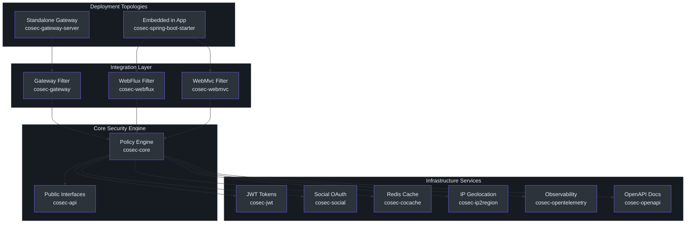
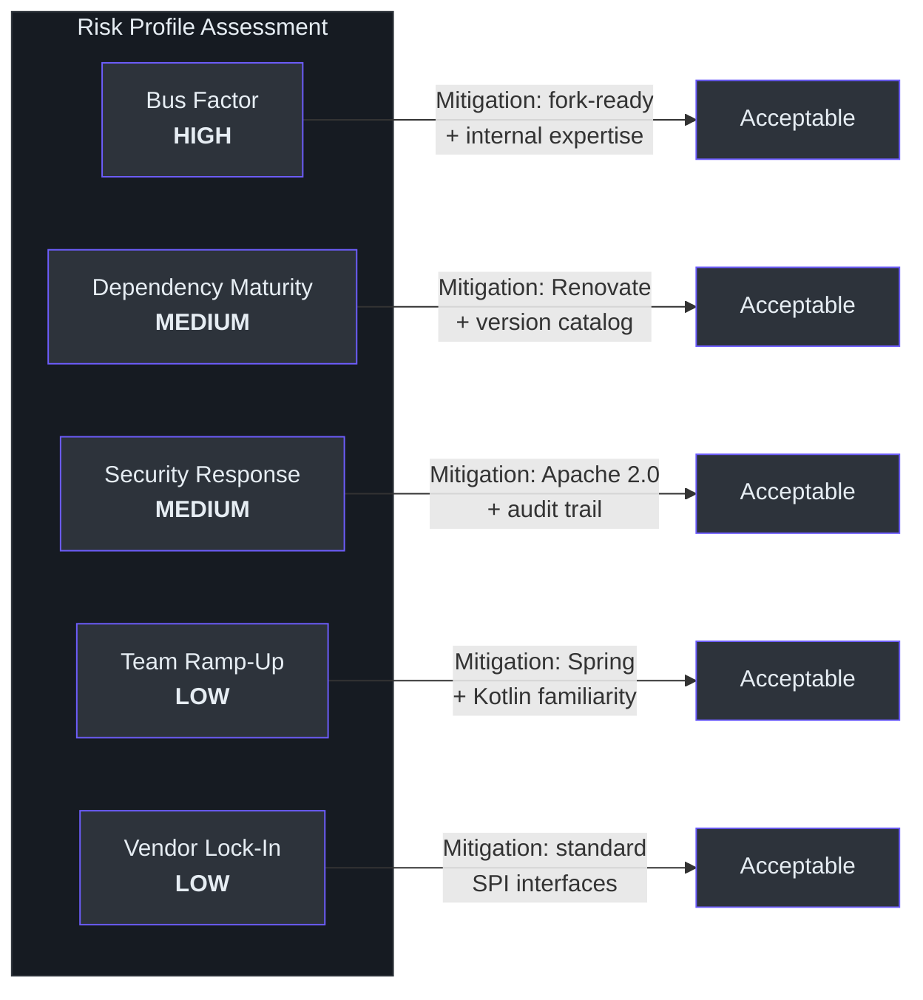
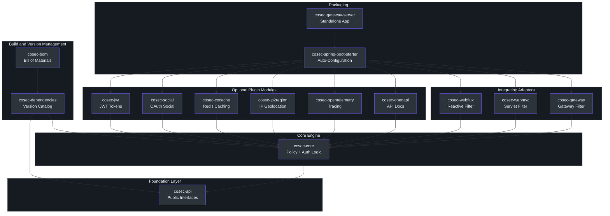

# Executive Guide

> **Audience**: CTO, VP Engineering, Security Leads, and technical decision-makers evaluating or adopting CoSec.

---

## System Overview

CoSec is an open-source, RBAC and policy-based security framework purpose-built for modern JVM applications. It delivers authentication, authorization, and multi-tenant security as embedded library components — not as a separate gateway appliance — enabling teams to bake security directly into their microservice architecture.

| Attribute | Detail |
|---|---|
| **License** | Apache 2.0 (permissive, production-friendly) |
| **Language** | Kotlin on JVM (Java 17+) |
| **Concurrency Model** | Reactive (Project Reactor) — non-blocking I/O throughout |
| **Framework Integration** | Spring Boot 4, Spring Cloud Gateway 2025.x |
| **Codebase Scale** | ~18,000 lines of Kotlin across 328 source files, 102 test files |
| **Module Count** | 15 modules (12 publishable libraries, 2 BOMs, 1 standalone server) |
| **Release Cadence** | Active — 424 commits since January 2025, latest release v4.3.5 |
| **Repository** | [github.com/Ahoo-Wang/CoSec](https://github.com/Ahoo-Wang/CoSec) |

**Why it matters**: CoSec eliminates the need for a separate security gateway infrastructure layer by embedding policy-driven authorization directly into application code. This reduces latency, simplifies deployment topology, and gives developers fine-grained control over access decisions at the service boundary.

---

## Capability Map

The following table maps CoSec capabilities to business outcomes, enabling leadership to connect technical features to organizational impact.

| Capability | Technical Mechanism | Business Impact |
|---|---|---|
| **Policy-Based Authorization** | AWS IAM-like model with Effect (ALLOW/DENY), ActionMatcher, and ConditionMatcher | Reduces time-to-implement new access rules from days to hours; auditable policy-as-code |
| **Multi-Tenant Isolation** | First-class `TenantPrincipal` and tenant-scoped policies via `TenantCapable` | Enables SaaS multi-tenancy without separate deployments per customer |
| **JWT Authentication** | Token issuance and verification via `com.auth0:java-jwt` | Stateless auth scales horizontally with no session-store dependency |
| **Social OAuth Login** | GitHub, Google, WeChat, and 30+ providers via JustAuth integration | Accelerates user onboarding by leveraging existing identity providers |
| **Rate Limiting** | `RateLimiterConditionMatcher` and `GroupedRateLimiterConditionMatcher` as policy conditions | Protects APIs from abuse without external rate-limiting infrastructure |
| **IP Geolocation** | `ip2region` integration enriches request context with geographic data | Enables geo-based access policies and compliance with data residency rules |
| **Distributed Caching** | Redis-backed policy and permission caching via CoCache | Sub-millisecond authorization lookups; eliminates repeated policy deserialization |
| **Observability** | OpenTelemetry instrumentation via `cosec-opentelemetry` | Full request-level tracing of auth decisions for audit and debugging |
| **OpenAPI Integration** | Bearer token annotations via `cosec-openapi` + springdoc | Auto-documentation of security requirements in API specs |
| **Blacklist Enforcement** | `BlacklistChecker` in the authorization pipeline | Immediate incident response capability — block compromised accounts or IPs |

---

## Architecture at a Glance

CoSec follows a layered architecture where public API contracts (`cosec-api`) are kept strictly separate from implementations (`cosec-core`), and integration modules provide thin adapters for each deployment topology.

**Key architectural decisions and their implications:**

- **Reactive throughout**: Every authorization check returns `Mono<AuthorizeResult>`, enabling non-blocking I/O. This means CoSec adds negligible latency overhead under high concurrency — critical for gateway deployments handling thousands of requests per second.
- **API/Implementation split**: `cosec-api` has zero framework dependencies, making it safe to depend on in domain modules without pulling in Spring. This enforces clean architectural boundaries.
- **SPI-based extensibility**: Custom policy matchers are registered via Java SPI (`META-INF/services`), requiring no changes to core code. New condition types (e.g., time-of-day restrictions, custom header checks) can be added without forking.
- **Single maintainer with bot assistance**: 252 commits from the primary author and 342 from Renovate bot (automated dependency updates) since 2024. The bot handles dependency freshness; the maintainer focuses on features.

---

## Team Topology

Understanding who maintains CoSec and how to engage is critical for adoption risk assessment.

| Dimension | Finding | Evidence |
|---|---|---|
| **Primary Maintainer** | Ahoo Wang (ahoowang@qq.com) | Git author analysis: 252 commits since 2024 |
| **Automation** | Renovate bot handles dependency updates | 342 bot commits for dependency version bumps |
| **CI/CD Maturity** | GitHub Actions with parallel test jobs, code coverage, signed releases | 6 workflow files in `.github/workflows/` |
| **Test Infrastructure** | JUnit 5 + MockK + FluentAssert; Redis via service containers for integration tests | CI runs 7 parallel module test jobs; Redis-dependent modules use service containers |
| **Release Process** | Automated publishing to Sonatype Central + GitHub Packages on Git tag creation | `package-deploy.yml` triggers on `release: created` |
| **Community** | Open-source Apache 2.0; issues and PRs via GitHub | POM metadata references GitHub issue tracker |

**Implication for adopters**: CoSec is a solo-maintained project with strong automation. This is common for mature, focused infrastructure libraries (similar to how many Spring ecosystem projects began), but it does mean that bus factor equals one. Organizations adopting CoSec should plan for internal capability to contribute patches if needed.

---

## Technology Investment Thesis

### Why reactive, policy-based security matters now

The industry is converging on two patterns that CoSec is already built around:

1. **Policy-as-code for authorization** (AWS IAM, Open Policy Agent, Cedar): Declarative policies are versionable, testable, and auditable — replacing hard-coded role checks scattered across services.
2. **Reactive/non-blocking I/O** (Project Reactor, virtual threads): As services scale horizontally, blocking security checks become throughput bottlenecks. CoSec's reactive core avoids this entirely.

### Strategic positioning

| Factor | Assessment |
|---|---|
| **Alignment with Spring ecosystem** | Tight — built on Spring Boot 4 and Spring Cloud 2025.x, the latest major versions |
| **Kotlin adoption trajectory** | Kotlin is the preferred language for new Spring Boot projects; CoSec's API is Kotlin-native with full Java interop |
| **Competitive alternative to** | Spring Security ACL (complex), Keycloak (heavyweight), OPA (requires sidecar/daemon) |
| **Unique value proposition** | Only framework combining IAM-style policies, multi-tenancy, and reactive authorization as an embeddable library |

---

## Risk Assessment

Every adoption decision carries risk. The table below identifies the key risks, their severity, and recommended mitigations.

| Risk | Severity | Likelihood | Impact | Mitigation |
|---|---|---|---|---|
| **Single maintainer** | High | Medium | Delayed fixes, stalled development | Fork readiness; allocate internal contributor time; monitor commit cadence (currently 1-2 commits/day) |
| **Spring Boot version lag** | Medium | Low | Breaking changes on major Spring upgrades | Dependency catalog (`cosec-dependencies`) centralizes versions; Renovate bot automates updates; Spring Boot 4 already supported |
| **Security vulnerability response** | Medium | Medium | Window of exposure before patch | Apache 2.0 license allows self-patching; SPI boundaries limit blast radius; no critical CVE history observed |
| **Kotlin ecosystem familiarity** | Low | Low | Slower onboarding for Java-only teams | Kotlin compiles to JVM bytecode; existing Spring knowledge transfers directly; API design follows standard patterns |
| **Vendor lock-in** | Low | Very Low | Migration cost if replacing CoSec | Interfaces defined in `cosec-api` (no framework deps); SPI-based matchers; standard JWT/OAuth protocols |

---

## Cost and Scaling Model

Understanding the operational cost profile helps in capacity planning and budgeting.

| Dimension | Detail | Cost Implication |
|---|---|---|
| **Licensing** | Apache 2.0 — no license fees, no usage restrictions | Zero licensing cost; no legal review burden for commercial use |
| **Runtime Overhead** | Reactive non-blocking; policy evaluation in-memory with sequence-based streaming | Minimal CPU footprint per request; no thread-per-request blocking |
| **Infrastructure Dependencies** | Redis (optional, for caching), JWT library (in-process) | Redis adds ~$50-200/month depending on cloud provider tier; not required for low-traffic deployments |
| **Deployment Topologies** | Embedded (sidecar-free) or standalone gateway | Embedded mode adds zero additional infrastructure; standalone gateway is one JVM process |
| **Scaling Behavior** | Horizontal — stateless authorization, no shared state beyond Redis cache | Linear scaling with application instances; Redis scales independently |
| **Maintenance Burden** | Renovate bot handles dependency updates; Detekt enforces code quality | Minimal manual dependency management; static analysis catches regressions before merge |

**Cost comparison against alternatives:**

| Approach | Infrastructure Cost | Ops Complexity | Latency |
|---|---|---|---|
| **CoSec Embedded** | Zero additional infra | Low | Sub-millisecond (in-process) |
| **Separate Auth Gateway** | Additional gateway instances | Medium | +1-5ms (network hop) |
| **Keycloak** | Dedicated server + DB | High | +2-10ms (token introspection) |
| **OPA Sidecar** | Sidecar per service | Medium | +1-3ms (local gRPC) |

---

## Dependency Map

CoSec's module dependency graph determines integration complexity and the blast radius of changes.

**Key dependency insights:**

| Relationship | Type | Implication |
|---|---|---|
| `cosec-core` depends on `cosec-api` | Compile | Core cannot be used without API; API is always present |
| Plugin modules depend on `cosec-core` | Compile | Any plugin pulls in the full policy engine |
| `cosec-spring-boot-starter` aggregates all plugins | Compile | Choosing the starter means accepting all plugin transitive dependencies |
| `cosec-gateway-server` depends on `cosec-spring-boot-starter` | Compile | Gateway server is the heaviest deployment artifact |
| `cosec-dependencies` is a BOM-only module | Platform | Controls all version pins; single source of truth for dependency versions |
| `cosec-gateway-server` is not published | Build | Internal-only; not distributed to Maven Central |

**Selective adoption is supported**: Teams can depend on only `cosec-api` + `cosec-core` + specific plugins (e.g., just JWT and WebFlux) without pulling in social login, OpenTelemetry, or gateway components.

---

## Key Metrics and Observability

CoSec provides built-in observability hooks that enable engineering teams to monitor security posture in production.

| Metric / Signal | Source | Business Value |
|---|---|---|
| **Authorization decision traces** | OpenTelemetry spans via `cosec-opentelemetry` | Full audit trail: who accessed what, when, and what policy allowed/denied |
| **Policy match rate** | Debug-level logging in `SimpleAuthorization` | Identify unused policies for cleanup; detect over-permissive configurations |
| **Implicit deny rate** | Authorization result monitoring | High implicit-deny rates signal missing policy coverage or overly restrictive configs |
| **Rate limiter triggers** | `RateLimiterConditionMatcher` exceptions | Detect abuse patterns; tune rate limits based on actual traffic |
| **Blacklist hits** | `BlacklistChecker` log entries | Measure effectiveness of incident response blacklisting |
| **Authentication failures** | JWT verification and social auth error paths | Detect credential stuffing or misconfigured OAuth providers |
| **Cache hit rate** | CoCache Redis operations | Optimize cache TTLs; ensure policy lookups remain performant |

**CI/CD quality gates** (evidence from `.github/workflows/`):

| Gate | Tool | Coverage |
|---|---|---|
| Unit and integration tests | JUnit 5 + Testcontainers | 7 parallel CI jobs covering core, JWT, social, cocache, webflux, webmvc, starter |
| Static analysis | Detekt 1.23.8 with auto-correct | Enforced on all source files; config at `config/detekt/detekt.yml` |
| Code coverage | JaCoCo | Report generation via `code-coverage-report` module |
| Dependency freshness | Renovate bot | Automated PRs for version bumps |
| Signed releases | PGP signing in CI | All Maven Central artifacts are GPG-signed |

---

## Roadmap Alignment

How CoSec aligns with common engineering organization priorities.

| Organizational Priority | CoSec Alignment | Notes |
|---|---|---|
| **Zero-trust architecture** | Policy-based defaults with implicit deny | Every request evaluated; no blanket access grants |
| **Multi-tenant SaaS** | First-class tenant model | `TenantPrincipal`, tenant-scoped policies, `InTenantConditionMatcher` |
| **Platform engineering** | Embeddable library model | No separate platform team needed to operate auth infrastructure |
| **API-first development** | OpenAPI integration with bearer token annotations | Security requirements visible in API contracts |
| **Observability-driven ops** | OpenTelemetry spans for auth decisions | Integrates with existing Grafana/Datadog/Honeycomb pipelines |
| **Regulatory compliance** | Audit trail via policy evaluation logging | Policy-as-code satisfies audit requirements for SOC 2, ISO 27001 |
| **Cost optimization** | No additional infrastructure for embedded mode | Eliminates gateway licensing and operational overhead |

---

## Technical Debt Summary

Transparent assessment of areas requiring attention.

| Area | Status | Evidence | Recommended Action |
|---|---|---|---|
| **Test coverage breadth** | Good | 102 test files covering 328 source files (1:3.2 ratio); all modules have test suites | Maintain current standard; add integration tests for multi-tenant scenarios |
| **Dependency currency** | Excellent | Renovate bot produces 342 automated update commits; Spring Boot 4.0.5, Kotlin 2.3.20 | No action needed — automated process handles it |
| **Code quality tooling** | Strong | Detekt static analysis with auto-correct enforced at build time | No action needed |
| **Documentation** | Growing | VitePress wiki with i18n support recently added; CLAUDE.md for AI-assisted development | Continue investing in operational runbooks for adopters |
| **Single maintainer concentration** | Acknowledged | 1 maintainer + automated bot; 424 commits in 2025 alone | Budget for internal contributor onboarding; consider sponsoring the project |
| **JMH benchmark coverage** | Present but shallow | Every module has JMH plugin configured; benchmark results not published | Publish benchmark results to track performance regressions over releases |

---

## Recommendations

The following recommendations are prioritized by impact and urgency.

### 1. Start with embedded mode for immediate value (Priority: HIGH)

Use `cosec-spring-boot-starter` to embed CoSec in your existing Spring Boot services. This requires zero additional infrastructure and gives you policy-based authorization in days rather than months of building custom role checks. The WebFlux integration is the best-documented path.

### 2. Establish an internal contributor capability (Priority: HIGH)

Given the single-maintainer model, assign one or two engineers to develop deep familiarity with the CoSec codebase. Contribute upstream patches when bugs are found. This protects against bus-factor risk and accelerates internal support. The modular architecture (especially the clean `cosec-api` / `cosec-core` separation) makes onboarding straightforward for Kotlin-proficient engineers.

### 3. Adopt policy-as-code practices from day one (Priority: HIGH)

Store CoSec policies in version control. Use the `LocalPolicyInitializer` to load policies from the classpath during startup. Treat policy changes with the same rigor as code changes — pull request reviews, automated testing, staged rollouts. This establishes the audit trail that compliance frameworks require.

### 4. Invest in observability from the start (Priority: MEDIUM)

Enable `cosec-opentelemetry` immediately. Authorization decision traces are the single most valuable signal for debugging access issues in production. Connect traces to your existing observability platform. Without this, troubleshooting "why was this request denied" becomes a manual log-scouring exercise.

### 5. Evaluate selective module adoption to minimize footprint (Priority: LOW)

If your service only needs JWT authentication and WebFlux authorization, depend on `cosec-api`, `cosec-core`, `cosec-jwt`, and `cosec-webflux` directly — skip the spring-boot-starter aggregator. This reduces transitive dependency count and classpath complexity. The dependency map in this document shows exactly which modules are needed for each capability.
