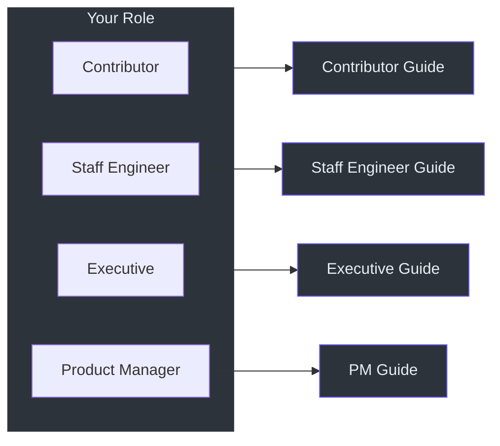

# Onboarding Guides

Choose the guide that best matches your role:

| Guide | Audience | Focus | Length |
|-------|----------|-------|--------|
| [Contributor Guide](./contributor) | New open-source contributors | Setup, codebase walkthrough, testing, PR process | Comprehensive |
| [Staff Engineer Guide](./staff-engineer) | Staff/principal engineers | Architecture, design tradeoffs, system diagrams | Dense, opinionated |
| [Executive Guide](./executive) | VP/director-level leaders | Capability map, risk assessment, investment thesis | No code |
| [Product Manager Guide](./product-manager) | PMs and stakeholders | User journeys, feature map, limitations, FAQ | Zero jargon |

## Quick Navigation

