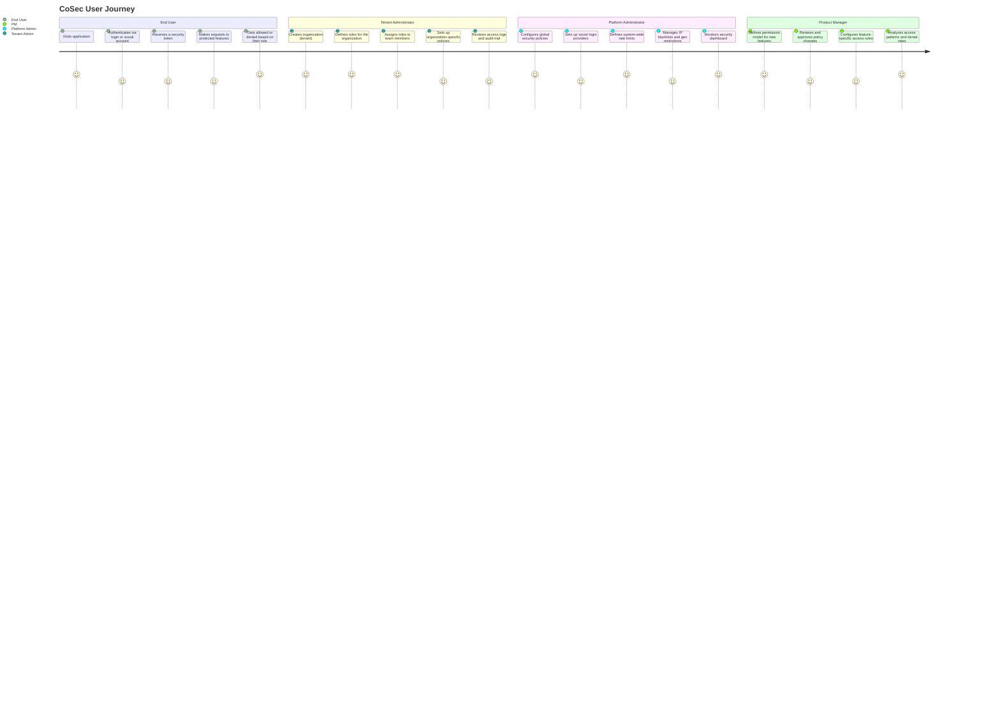
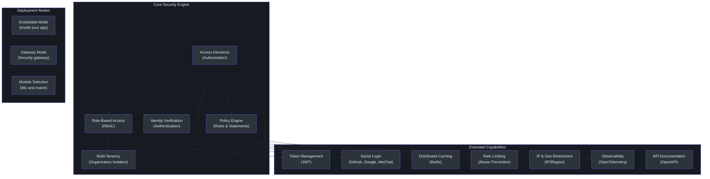
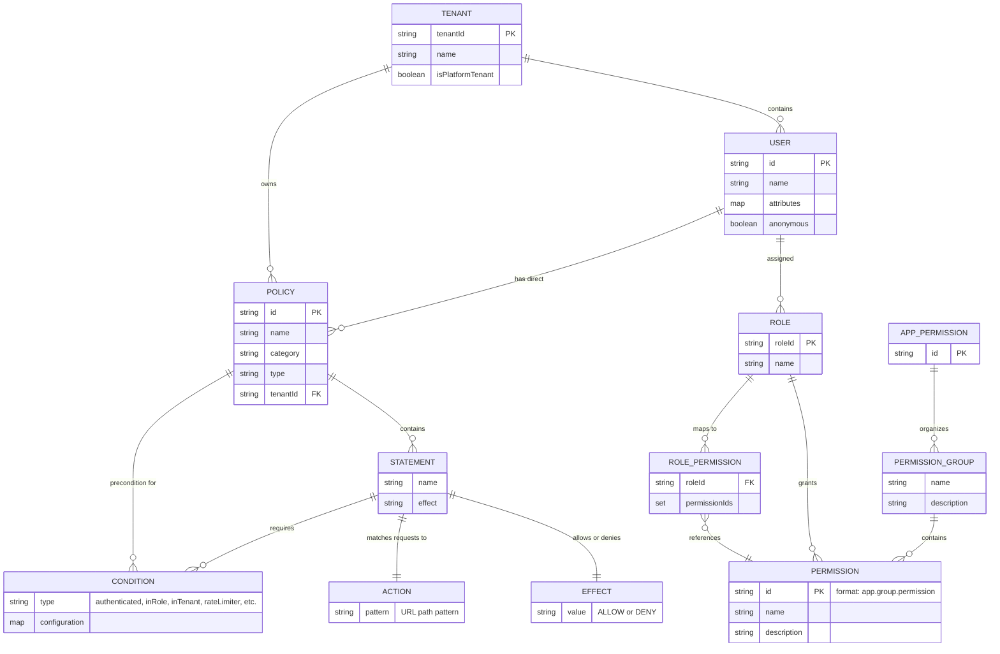
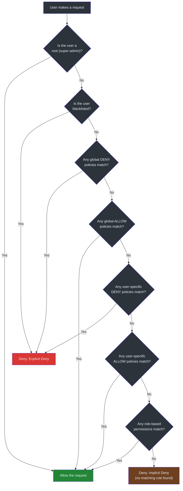

# Product Manager Guide

Welcome to CoSec. This guide explains the security framework from a product perspective — what it does, what problems it solves for users, and how its capabilities translate into product decisions. No engineering jargon required.

---

## What This System Does

CoSec is a security framework that controls **who can access what** in your application. Think of it as a programmable bouncer for your software: it verifies identities (authentication) and enforces access rules (authorization).

Three things make it stand out for product teams:

1. **Multi-tenant by design.** Each customer organization gets its own security rules, roles, and policies — out of the box.
2. **Policy-driven permissions.** Access rules are defined as human-readable JSON policies, similar to AWS IAM. Product managers and security teams can review, version-control, and audit these without touching application code.
3. **Flexible deployment.** It can run embedded inside your existing application, or as a standalone security gateway that sits in front of all your services.

| Business Problem | How CoSec Solves It |
|---|---|
| "Who can access this feature?" | Role-based and policy-based authorization evaluates every request |
| "Each customer needs their own security rules" | Built-in multi-tenancy isolates policies, roles, and permissions per organization |
| "We need to support social login" | Social authentication via GitHub, Google, WeChat, and 30+ providers |
| "We need to prevent API abuse" | Rate limiting built into the policy layer |
| "Compliance requires audit trails" | Every access decision is logged with a reason (Allow, Explicit Deny, Implicit Deny) |
| "We want to restrict access by region or IP" | Condition matchers support IP ranges, geographic regions, time windows, and custom logic |

---

## User Journey Map

The following diagram shows how different types of users interact with CoSec across their lifecycle.

---

## Feature Capability Map

CoSec is organized into modular capabilities. Each module can be used independently or combined.

### Capability Details

| Capability | What It Does | Product Impact |
|---|---|---|
| **Authentication** | Verifies who a user is by checking their credentials (username/password, social login, API keys) | Supports multiple login methods without custom code for each one |
| **Authorization** | Decides what an authenticated user is allowed to do on each request | Every feature access is checked in real time against defined rules |
| **Policy Engine** | Evaluates access rules defined as JSON policies with ALLOW/DENY effects | Security rules can be changed by editing JSON files without redeploying the app |
| **RBAC** | Assigns permissions to named roles, then assigns roles to users | Classic "admin / editor / viewer" model — easy for end users to understand |
| **Multi-Tenancy** | Isolates security rules per customer organization | One platform serves many customers, each with their own security boundaries |
| **Social Login** | Lets users sign in with existing accounts from GitHub, Google, WeChat, and 30+ providers | Reduces signup friction — no new passwords to remember |
| **JWT Tokens** | Issues time-limited tokens (10-minute access, 7-day refresh by default) | Users stay logged in without permanent sessions; tokens expire automatically |
| **Rate Limiting** | Limits how many requests a user or IP can make per second | Prevents abuse and protects service stability |
| **IP & Geo Restrictions** | Allows or denies access based on IP address ranges or geographic region | Compliance with regional data access requirements |
| **Distributed Caching** | Caches policy and permission lookups in Redis with local fallback | Authorization checks remain fast even under heavy load |
| **Observability** | Traces every authorization decision through OpenTelemetry | Operations teams can see exactly why a request was allowed or denied |
| **API Documentation** | Auto-generates Swagger/OpenAPI docs for protected endpoints | Reduces friction between product and engineering teams |

---

## Data Model (Product View)

The following diagram shows how the core security concepts relate to each other from a product perspective.

### Key Data Relationships Explained

| Relationship | What It Means for Product |
|---|---|
| **Tenant contains Users** | Each organization has its own set of users, completely isolated from others |
| **User is assigned Roles** | A user in Organization A can be "admin" while the same person in Organization B is "viewer" |
| **Role grants Permissions** | The "editor" role might include permissions like "create document" and "edit document" |
| **Policy contains Statements** | A single policy bundles multiple rules together (e.g., "all rules for the admin section") |
| **Statement has Effect** | Each rule is either ALLOW or DENY — DENY always wins when there is a conflict |
| **Statement matches Actions** | An action is a URL pattern like `/api/orders/*` that the rule applies to |
| **Statement requires Conditions** | Additional checks like "user must be authenticated" or "request must come from an allowed IP range" |
| **Tenant owns Policies** | Each organization can define its own access rules, separate from the platform-wide rules |

---

## Authorization Decision Flow

When a user tries to do something, here is how the system decides whether to allow it. This is the most important flow to understand for product decisions.

### Decision Outcomes

| Outcome | Meaning | When It Happens |
|---|---|---|
| **Allow** | The user can proceed | A matching ALLOW rule was found |
| **Explicit Deny** | The user is blocked by a specific rule | A matching DENY rule was found (takes priority over any ALLOW) |
| **Implicit Deny** | The user is blocked because no rule covers this action | No matching rule exists at all — this is the default for everything |
| **Token Expired** | The user's login session has timed out | The JWT access token has passed its expiry time |
| **Too Many Requests** | Rate limit exceeded | The user or IP has made more requests than allowed per second |

---

## Configuration & Feature Flags

CoSec uses a single configuration prefix (`cosec.*`) with feature flags that can be toggled independently. These are set in your application's configuration file (e.g., `application.yml`).

### Feature Flags

| Flag | Default | What It Controls |
|---|---|---|
| `cosec.enabled` | `true` | Master switch — turns the entire security framework on or off |
| `cosec.authentication.enabled` | `true` | Whether identity verification is active |
| `cosec.authorization.enabled` | `true` | Whether access control checks are active |
| `cosec.authorization.local-policy.enabled` | `false` | Load security policies from local JSON files instead of a remote store |
| `cosec.authorization.local-policy.force-refresh` | `false` | Force re-reading policy files on every startup |
| `cosec.authorization.gateway.enabled` | `true` | Whether the Spring Cloud Gateway integration is active |
| `cosec.jwt.enabled` | `true` | Whether JWT token support is active |
| `cosec.authorization.cache.enabled` | `true` | Whether policy and permission caching is enabled |
| `cosec.opentelemetry.enabled` | `true` | Whether security decision tracing is active |

### Token Configuration

| Setting | Default | Description |
|---|---|---|
| `cosec.jwt.algorithm` | `HMAC256` | Token signing method (HMAC256, HMAC384, or HMAC512) |
| `cosec.jwt.secret` | (required) | Secret key used to sign and verify tokens |
| `cosec.jwt.token-validity.access` | 10 minutes | How long an access token is valid before requiring a refresh |
| `cosec.jwt.token-validity.refresh` | 7 days | How long a refresh token is valid before requiring re-login |

### Cache Configuration

| Setting | Default | Description |
|---|---|---|
| `cosec.authorization.cache.enabled` | `true` | Enable caching for policy lookups |
| `cosec.authorization.cache.policy.maximum-size` | unlimited | Maximum number of cached policies |
| `cosec.authorization.cache.policy.expire-after-write` | unlimited | Time before cached policy is refreshed |
| `cosec.authorization.cache.role.maximum-size` | unlimited | Maximum number of cached role permissions |
| `cosec.authorization.cache.role.expire-after-write` | unlimited | Time before cached role permissions are refreshed |

### Policy Types

| Type | Who Manages It | Who Can Edit It | Use Case |
|---|---|---|---|
| **GLOBAL** | Platform administrators | Platform administrators only | Rules that apply to everyone, like "allow anonymous access to the login page" |
| **SYSTEM** | Platform administrators | Platform administrators only (users cannot delete) | Built-in rules that form the security baseline |
| **CUSTOM** | Tenant administrators | Tenant administrators within their organization | Customer-specific rules, like "our editors can access the reporting dashboard" |

---

## API Capabilities

CoSec exposes its functionality through well-defined interfaces that application developers integrate with. From a product perspective, here is what the system can do.

### Authentication Capabilities

| Capability | Description | User Experience |
|---|---|---|
| **Credential-based login** | Username/password verification | Standard login form |
| **Social login** | OAuth-based login via third-party providers | "Sign in with GitHub / Google / WeChat" buttons |
| **Token issuance** | Generates access and refresh tokens after successful login | User stays logged in across sessions |
| **Token refresh** | Extends a session without re-entering credentials | Seamless — user does not notice the refresh |
| **Anonymous access** | Allows unauthenticated users to reach public endpoints | Login wall only appears for protected features |

### Authorization Capabilities

| Capability | Description | Product Use Case |
|---|---|---|
| **Path-based matching** | Rules that match URL patterns like `/api/orders/*` | Protect entire feature areas with a single rule |
| **Method-based matching** | Rules that match HTTP methods (GET, POST, PUT, DELETE) | "Readers can view but not edit" |
| **Wildcard matching** | A single rule covers all endpoints | Global deny for blacklisted users |
| **Role-based permissions** | Permissions assigned to named roles | "Admin", "Editor", "Viewer" access levels |
| **User-specific policies** | Direct policy assignment to individual users | Grant a specific user temporary elevated access |
| **Composite conditions** | Combine multiple conditions with AND/OR logic | "Allow if authenticated AND (is admin OR request is from office IP)" |

### Condition Matchers Available

| Matcher | What It Checks | Example |
|---|---|---|
| **Authenticated** | Is the user logged in? | "Only logged-in users can access this" |
| **In Role** | Does the user have a specific role? | "Only admins can do this" |
| **In Tenant** | Is the user in a specific organization? | "Only Acme Corp users can see this" |
| **Rate Limiter** | Has the user exceeded the request limit? | "Max 10 requests per second" |
| **Grouped Rate Limiter** | Per-group rate limiting (e.g., per IP) | "Max 10 requests per second per IP address" |
| **Path Match** | Does a request value match a path pattern? | "Only requests from IPs starting with 192.168" |
| **Equals** | Does a value equal an expected string? | "Only requests with this exact tenant ID" |
| **Contains** | Does a value contain a substring? | "Only requests from regions containing 'Shanghai'" |
| **Starts With** | Does a value start with a prefix? | "Only requests from China" |
| **Ends With** | Does a value end with a suffix? | "Only requests ending with specific IP" |
| **In List** | Is a value in a set of allowed values? | "Only these specific user IDs" |
| **Regular Expression** | Does a value match a pattern? | "Only requests from github.com origins" |
| **Boolean (AND/OR)** | Combine multiple conditions | Complex logic gates |
| **OGNL Expression** | Evaluate custom expressions | Advanced custom logic |
| **SpEL Expression** | Evaluate Spring Expression Language | Advanced custom logic |

---

## Performance & SLAs

### Authorization Decision Speed

| Scenario | What Happens | Performance Note |
|---|---|---|
| **Root user request** | Immediate allow, no policy evaluation | Fastest path — single identity check |
| **Cache hit** | Policy and permission data served from Redis or local cache | Sub-millisecond lookups |
| **Cache miss** | Policy data loaded from storage, then cached | First request per user may be slower; subsequent requests are fast |
| **Rate limit exceeded** | Immediate deny before any policy evaluation | Fast path — prevents wasted processing |

### Caching Architecture

The system uses a two-level cache for policy and permission data:

- **Level 1 (Local):** In-memory cache within each application instance using Guava. Configurable size, expiration, and concurrency settings.
- **Level 2 (Distributed):** Redis-based shared cache across all application instances. Ensures policy changes propagate to all instances.

This two-level approach means most authorization checks never leave the application instance, while still ensuring consistency when policies change.

### Scalability Considerations

| Dimension | Behavior |
|---|---|
| **Number of tenants** | No hard limit — tenant isolation is logical (tenant ID on each request), not physical |
| **Number of policies per tenant** | Policies are indexed by ID; evaluation is linear through statements within a policy |
| **Number of users** | Each user carries their own roles and policies; no per-user blocking scalability issue |
| **Concurrent requests** | Authorization checks are stateless and independent — scales horizontally with application instances |

---

## Known Limitations & Constraints

| Limitation | Impact | Mitigation |
|---|---|---|
| **Policy changes require propagation time** | A policy update takes time to reach all cached instances | Cache expiration can be tuned; force-refresh is available |
| **Default token validity is short** | Access tokens expire in 10 minutes by default | Refresh tokens (7-day default) handle session continuity automatically |
| **DENY always takes priority** | A single DENY rule overrides any number of ALLOW rules | This is by design (security-first), but requires careful policy authoring |
| **No built-in admin UI** | Policies are authored as JSON files or stored externally | Use the provided JSON schema for IDE validation; build a management UI on top of the APIs |
| **Social login depends on third-party providers** | If GitHub / Google / WeChat is down, those login methods fail | Users can fall back to credential-based login if configured |
| **Rate limiting is per-process for local matchers** | A rate limiter within a single instance does not aggregate across instances | Use grouped rate limiter with shared storage for distributed rate limiting |
| **Root user bypasses all checks** | The root user has unrestricted access | Limit root user credentials to a small number of platform administrators |
| **No built-in user management** | CoSec does not manage user accounts, passwords, or profiles | This is handled by your application or a separate identity provider |

---

## Data & Privacy

### What Data CoSec Handles

| Data Category | Description | Sensitivity |
|---|---|---|
| **User Identity** | User ID, roles, policies, custom attributes | High — contains identity information |
| **Tenant Information** | Organization ID, tenant type | Medium — business structure data |
| **Security Tokens** | JWT access tokens and refresh tokens | High — grants access to the system |
| **Authorization Decisions** | Logs of who accessed what and whether they were allowed | Medium — audit trail data |
| **Request Metadata** | IP addresses, geographic regions, request paths | Medium — can be considered personal data |

### Privacy Considerations

| Concern | How CoSec Addresses It |
|---|---|
| **Data isolation between tenants** | Every policy, role, and permission is scoped to a tenant ID. One organization cannot see another's security rules. |
| **Token security** | Tokens are signed with HMAC (256/384/512 bit). The signing secret is never transmitted — only the token is sent over the wire. |
| **IP handling** | IP addresses are used for geo-restriction and rate limiting but are not stored by CoSec itself. Your application controls retention. |
| **Audit trail** | Every authorization decision includes a reason string. You control where these logs are stored and how long they are retained. |
| **Anonymous access** | CoSec distinguishes between anonymous and authenticated users. Public endpoints can be explicitly configured without exposing protected data. |
| **Root user** | The root user ID is configured via system property, not stored in user databases. It is a special-case bypass, not a regular user account. |

### Compliance Readiness

CoSec's policy-based design supports common compliance requirements:

- **Principle of least privilege:** Implicit deny means users only get access when explicitly granted.
- **Separation of duties:** Different roles can be assigned to enforce that no single user has unchecked power.
- **Audit logging:** Every authorization decision is traceable with a reason.
- **Data residency:** IP and geo-based conditions can restrict access to specific regions.
- **Access reviews:** Policies are defined as JSON — they can be version-controlled, reviewed, and audited like any other configuration.

---

## Glossary

| Term | Plain Language Definition |
|---|---|
| **Authentication** | The process of figuring out who the user is (like showing your ID at the door) |
| **Authorization** | The process of deciding what the user is allowed to do (like checking if your badge opens a specific door) |
| **Policy** | A collection of access rules that define what someone can or cannot do |
| **Statement** | A single rule inside a policy (e.g., "allow editing documents") |
| **Effect** | Whether a statement allows or denies access (only two options: ALLOW and DENY) |
| **Principal** | A user or automated system that is making a request |
| **Tenant** | An organization or workspace that has its own isolated set of users, roles, and security rules |
| **Role** | A named group of permissions (e.g., "admin" can do everything, "viewer" can only read) |
| **Permission** | A specific action that can be granted to a role or user (e.g., "create order", "delete user") |
| **Action Matcher** | A rule that decides which requests a policy statement applies to, based on the URL path |
| **Condition Matcher** | An extra requirement that must be true for a rule to apply (e.g., "user must be logged in") |
| **Rate Limiting** | A cap on how many requests a user or IP address can make in a given time period |
| **JWT** | A security token that proves the user has logged in. Contains encoded identity information and an expiry time. |
| **Access Token** | A short-lived JWT (10 minutes default) that proves the user is currently authenticated |
| **Refresh Token** | A longer-lived token (7 days default) used to get a new access token without re-entering credentials |
| **RBAC** | Role-Based Access Control — assigning permissions to roles, then roles to users |
| **Implicit Deny** | The default outcome when no rule matches a request — access is denied unless explicitly allowed |
| **Explicit Deny** | A specific rule that says "deny this action" — always overrides any allow rules |
| **SPI** | Service Provider Interface — a mechanism that lets developers add custom rule types without modifying the framework |
| **Gateway** | A standalone security layer that sits in front of your services and checks every incoming request |
| **OpenTelemetry** | An observability standard that lets you trace what happened during each request |
| **CoCache** | A caching library used by CoSec to store policy lookups in Redis and local memory for fast access |
| **IP2Region** | A library that maps IP addresses to geographic regions (country, province, city) |
| **OGNL / SpEL** | Expression languages that allow advanced custom conditions in policies (e.g., "check if the user's department is 'engineering'") |

---

## FAQ

### 1. What happens when a user tries to access something they are not allowed to see?

The system returns an "Explicit Deny" result. In practice, this means the application receives a signal that the request should be rejected, typically resulting in a 403 Forbidden response to the user. The decision includes a reason string for logging and debugging.

### 2. Can different customers (tenants) have completely different security rules?

Yes. Each tenant has its own policies, roles, and permissions. Tenant A's "admin" role can have different permissions than Tenant B's "admin" role. The system isolates these completely — one tenant can never see or affect another tenant's security configuration.

### 3. What happens if we add a new feature and forget to create a security rule for it?

Access is denied by default (implicit deny). If no policy explicitly allows access to the new feature, users will be blocked from it. This is a security-first design — it is safer to accidentally block a feature than to accidentally expose it.

### 4. How do we handle a user who should be temporarily promoted to admin?

Assign a user-specific policy that grants the additional permissions. User-specific policies are evaluated alongside role-based permissions. When the promotion period ends, remove the user-specific policy.

### 5. What social login providers are supported?

Through the JustAuth integration, CoSec supports 30+ social login providers including GitHub, Google, WeChat, Facebook, Twitter, LinkedIn, Apple, Microsoft, and many more. Each provider requires its own OAuth credentials (client ID and secret) to be configured.

### 6. How quickly do policy changes take effect?

Policy changes are cached for performance. The propagation delay depends on cache expiration settings. For immediate effect, you can force a cache refresh. With default settings, changes typically propagate within the cache expiration window.

### 7. Can we restrict access to certain features based on geographic location?

Yes. CoSec includes IP-to-region mapping (via IP2Region). Policies can use condition matchers to check the user's geographic location (country, province, city) and allow or deny access accordingly. For example: "Only allow access from Shanghai and Guangdong province."

### 8. How does rate limiting work?

Rate limiting is configured as a condition within a policy. You set how many requests per second are allowed. When a user exceeds the limit, the system returns "Too Many Requests" before even evaluating other rules. Rate limits can be per-user or per-group (e.g., per IP address).

### 9. What is the difference between a global policy and a custom policy?

A **global policy** applies to everyone across all organizations and is managed by platform administrators. A **custom policy** applies only to a specific tenant (organization) and is managed by that tenant's administrators. Global policies are evaluated first.

### 10. Can we use CoSec with our existing user database?

Yes. CoSec handles authentication and authorization but does not manage user accounts. Your application provides the user data (ID, roles, attributes), and CoSec uses that information to make security decisions. You integrate CoSec with your existing user store.

### 11. What happens if the Redis cache goes down?

CoSec uses a two-level cache. If Redis is unavailable, the local in-memory cache still serves requests. Cache misses will fall back to loading policies from the source. The system degrades gracefully rather than failing.

### 12. How do we audit who accessed what?

Every authorization decision is made through a single code path that produces an AuthorizeResult with a reason (Allow, Explicit Deny, Implicit Deny, Token Expired, Too Many Requests). Combined with OpenTelemetry tracing, you can see the full decision chain for any request — who requested it, what rules were evaluated, and why the decision was made.

### 13. Can a user belong to multiple organizations?

Yes. A user can be a member of multiple tenants, each with different roles. The system determines which tenant context applies based on the request. A user might be an "admin" in Organization A and a "viewer" in Organization B simultaneously.

### 14. Is CoSec only for web applications?

CoSec is designed for any application that processes HTTP requests. It integrates with reactive web frameworks (WebFlux), traditional servlet-based frameworks (WebMVC), and API gateways (Spring Cloud Gateway). It can also serve as a standalone gateway protecting any HTTP-based service.

### 15. What is the "root" user and why does it bypass all checks?

The root user is a special administrative identity configured at the platform level. It bypasses all policy checks as a safety mechanism — ensuring platform administrators can always access the system. The root user ID is configured via a system property, not through the regular user management flow. It should be restricted to a very small number of trusted administrators.

---

## Next Steps

| If You Want To... | Start Here |
|---|---|
| Understand the technical architecture | Review the [Staff Engineer Guide](./staff-engineer.md) |
| See how the project is organized | Read the [Contributor Guide](./contributor.md) |
| Evaluate CoSec for your organization | Review the [Executive Guide](./executive.md) |
| Start integrating CoSec | Visit the [Integration Guide](/getting-started/) |
| Understand the policy format | Review the [Policy Schema](https://github.com/Ahoo-Wang/CoSec/blob/main/schema/cosec-policy.schema.json) |
| See example policies | Check the policy demos in the [README](https://github.com/Ahoo-Wang/CoSec/blob/main/README.md) |

---

*This guide is part of the CoSec onboarding documentation. For the source code and full documentation, visit [github.com/Ahoo-Wang/CoSec](https://github.com/Ahoo-Wang/CoSec).*
