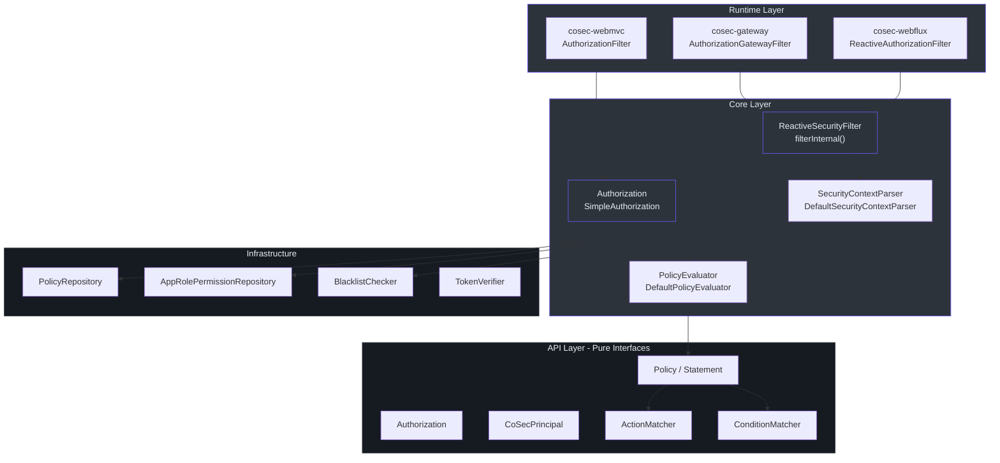
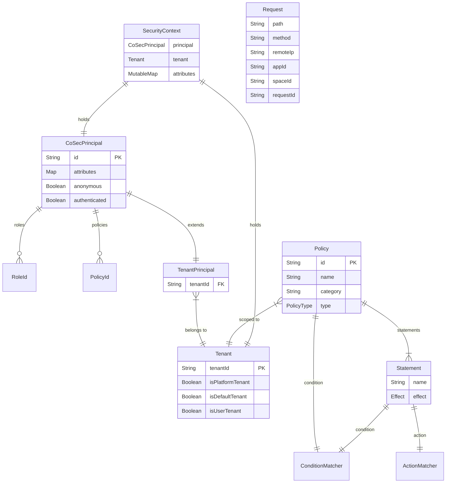
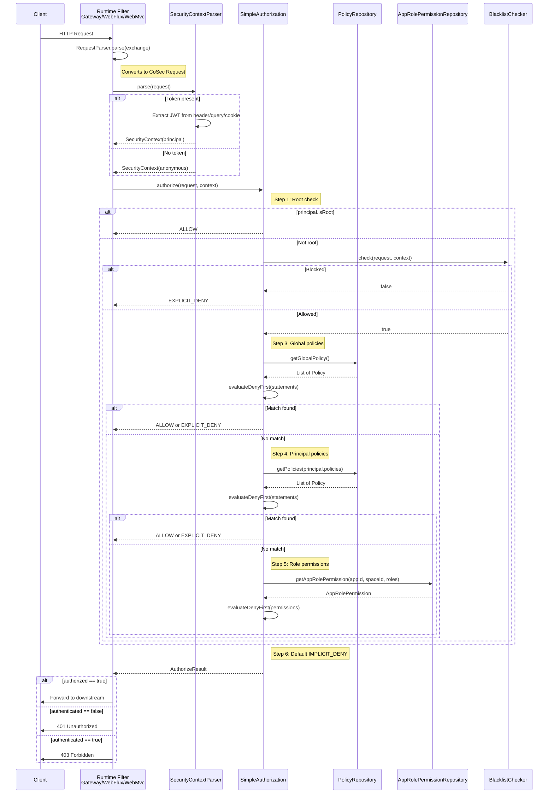
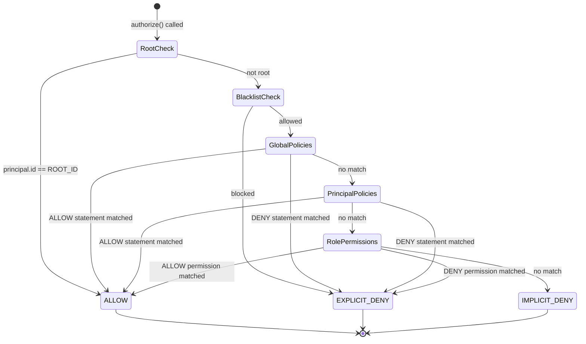
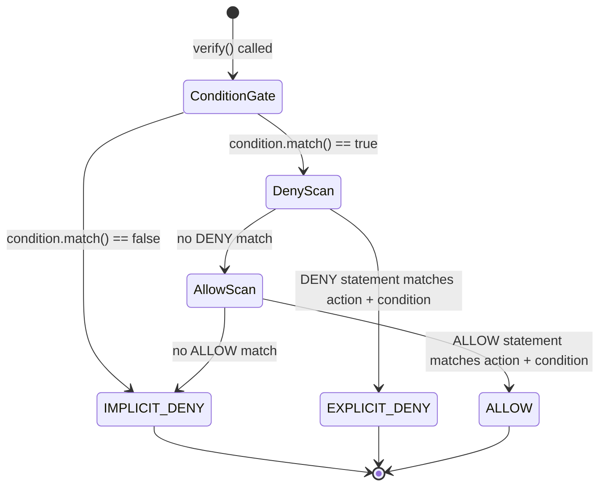
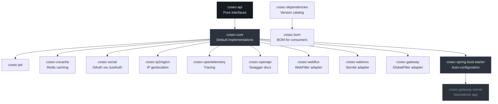
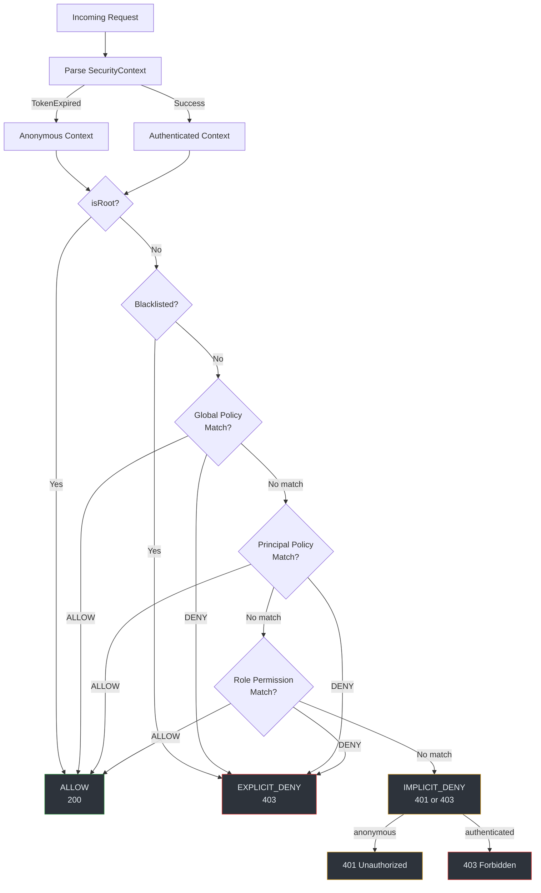
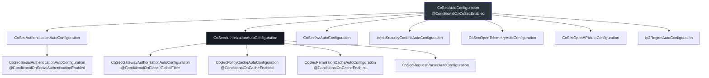

# Staff Engineer Onboarding Guide

You are not here to add a dependency. You are here because you need to reason about authorization correctness, extend the policy engine, or integrate CoSec into a runtime it has never seen. This guide gives you the architectural spine in one pass.

## Executive Summary

CoSec is a reactive, multi-tenant, policy-based authorization framework for the JVM. Its mental model is lifted directly from AWS IAM: every request is evaluated against an ordered sequence of Policy documents, each containing Statement rules with ALLOW or DENY effects. DENY always wins. The default outcome is IMPLICIT_DENY.

The framework splits cleanly into two layers:

| Layer | Module | Responsibility |
|-------|--------|----------------|
| **API** | `cosec-api` | Pure interfaces, zero framework dependencies. Defines the security model contract. |
| **Core** | `cosec-core` | Default implementations, policy evaluation, authentication orchestration. |
| **Integration** | `cosec-webflux`, `cosec-webmvc`, `cosec-gateway` | Adapters that wire the core into Spring runtimes. |
| **Auto-config** | `cosec-spring-boot-starter` | Bean assembly via `@ConditionalOn*` annotations. |

The critical invariant: `cosec-api` has **no** Spring, Reactor, or Jackson imports. Every public contract lives there. Every implementation lives in `cosec-core` or an integration module. If you are adding a Spring import to `cosec-api`, you are in the wrong module.

## Core Architectural Insight

The entire authorization decision reduces to a single recursive pattern: **condition gate, then DENY-first scan, then ALLOW scan**. This pattern appears identically at three levels: Policy, Statement, and the top-level SimpleAuthorization orchestrator.

```python
# Pseudocode for the DENY-first evaluation pattern
def evaluate_deny_first(items, get_effect, verify):
    # Phase 1: Check all DENY rules first
    for item in filter(items, lambda i: get_effect(i) == DENY):
        if verify(item) == EXPLICIT_DENY:
            return EXPLICIT_DENY  # Short-circuit on first deny

    # Phase 2: Check ALLOW rules
    for item in filter(items, lambda i: get_effect(i) == ALLOW):
        if verify(item) == ALLOW:
            return ALLOW  # Short-circuit on first allow

    # Phase 3: Default deny
    return IMPLICIT_DENY

# Policy.verify() applies this pattern to its statements
# SimpleAuthorization.authorize() applies it to the full policy chain
```

The same function `evaluateDenyFirst` in [`SimpleAuthorization`](https://github.com/Ahoo-Wang/CoSec/blob/main/cosec-core/src/main/kotlin/me/ahoo/cosec/authorization/SimpleAuthorization.kt#L61) is used for both policy statements and role permissions. The architecture is fractal: the same pattern at every level.

## System Architecture



<!-- Sources: cosec-webflux/ReactiveSecurityFilter.kt, cosec-core/authorization/SimpleAuthorization.kt, cosec-api/authorization/Authorization.kt -->

Key observation: all three runtime adapters (Gateway, WebFlux, WebMvc) funnel through the same `Authorization.authorize()` interface. The only difference is how they extract a `Request` from the HTTP exchange. This is the Strategy pattern applied at the framework boundary.

## Domain Model



<!-- Sources: cosec-api/principal/CoSecPrincipal.kt, cosec-api/policy/Policy.kt, cosec-api/context/SecurityContext.kt, cosec-api/tenant/Tenant.kt -->

### Identity Hierarchy

The identity model has three tiers, controlled by the `Tenant` interface at [`cosec-api/src/main/kotlin/me/ahoo/cosec/api/tenant/Tenant.kt`](https://github.com/Ahoo-Wang/CoSec/blob/main/cosec-api/src/main/kotlin/me/ahoo/cosec/api/tenant/Tenant.kt):

| Tier | `tenantId` Value | Meaning |
|------|-------------------|---------|
| **Platform** | `"(platform)"` | Root platform operator. Can manage all tenants. |
| **Default** | `"(0)"` | Shared/default tenant. No tenant isolation. |
| **User** | Any other string | A specific customer tenant with isolation. |

The `CoSecPrincipal.ROOT_ID` defaults to `"cosec"` but can be overridden via the system property `cosec.root` ([`CoSecPrincipal.kt:80`](https://github.com/Ahoo-Wang/CoSec/blob/main/cosec-api/src/main/kotlin/me/ahoo/cosec/api/principal/CoSecPrincipal.kt#L80)). Root principals bypass the entire authorization chain.

### Special Identity Constants

| Constant | Value | Where Defined | Purpose |
|----------|-------|---------------|---------|
| `ROOT_ID` | `"cosec"` (configurable) | [`CoSecPrincipal.kt:80`](https://github.com/Ahoo-Wang/CoSec/blob/main/cosec-api/src/main/kotlin/me/ahoo/cosec/api/principal/CoSecPrincipal.kt#L80) | Bypasses all authorization |
| `ANONYMOUS_ID` | `"(0)"` | [`CoSecPrincipal.kt:87`](https://github.com/Ahoo-Wang/CoSec/blob/main/cosec-api/src/main/kotlin/me/ahoo/cosec/api/principal/CoSecPrincipal.kt#L87) | Unauthenticated principal |
| `PLATFORM_TENANT_ID` | `"(platform)"` | [`Tenant.kt:56`](https://github.com/Ahoo-Wang/CoSec/blob/main/cosec-api/src/main/kotlin/me/ahoo/cosec/api/tenant/Tenant.kt#L56) | Platform-level tenant |
| `DEFAULT_TENANT_ID` | `"(0)"` | [`Tenant.kt:57`](https://github.com/Ahoo-Wang/CoSec/blob/main/cosec-api/src/main/kotlin/me/ahoo/cosec/api/tenant/Tenant.kt#L57) | Default shared tenant |

## Component Types

### API Contracts (`cosec-api`)

Every public contract is an interface in `cosec-api`. No implementations, no framework coupling. The module defines the security algebra:

| Interface | File | Purpose |
|-----------|------|---------|
| `CoSecPrincipal` | [`CoSecPrincipal.kt`](https://github.com/Ahoo-Wang/CoSec/blob/main/cosec-api/src/main/kotlin/me/ahoo/cosec/api/principal/CoSecPrincipal.kt) | Identity: id, roles, policies, attributes |
| `Authentication<C, P>` | [`Authentication.kt`](https://github.com/Ahoo-Wang/CoSec/blob/main/cosec-api/src/main/kotlin/me/ahoo/cosec/api/authentication/Authentication.kt) | Credential verification, returns `Mono<P>` |
| `Authorization` | [`Authorization.kt`](https://github.com/Ahoo-Wang/CoSec/blob/main/cosec-api/src/main/kotlin/me/ahoo/cosec/api/authorization/Authorization.kt) | Request evaluation, returns `Mono<AuthorizeResult>` |
| `Policy` | [`Policy.kt`](https://github.com/Ahoo-Wang/CoSec/blob/main/cosec-api/src/main/kotlin/me/ahoo/cosec/api/policy/Policy.kt) | Statement collection with condition gate |
| `Statement` | [`Statement.kt`](https://github.com/Ahoo-Wang/CoSec/blob/main/cosec-api/src/main/kotlin/me/ahoo/cosec/api/policy/Statement.kt) | Single rule: Effect + ActionMatcher + ConditionMatcher |
| `ActionMatcher` | [`ActionMatcher.kt`](https://github.com/Ahoo-Wang/CoSec/blob/main/cosec-api/src/main/kotlin/me/ahoo/cosec/api/policy/ActionMatcher.kt) | Matches request actions (HTTP method + path) |
| `ConditionMatcher` | [`ConditionMatcher.kt`](https://github.com/Ahoo-Wang/CoSec/blob/main/cosec-api/src/main/kotlin/me/ahoo/cosec/api/policy/ConditionMatcher.kt) | Matches contextual conditions |
| `SecurityContext` | [`SecurityContext.kt`](https://github.com/Ahoo-Wang/CoSec/blob/main/cosec-api/src/main/kotlin/me/ahoo/cosec/api/context/SecurityContext.kt) | Principal + tenant + mutable attributes |
| `Request` | [`Request.kt`](https://github.com/Ahoo-Wang/CoSec/blob/main/cosec-api/src/main/kotlin/me/ahoo/cosec/api/context/request/Request.kt) | HTTP request abstraction |

### Core Implementations (`cosec-core`)

| Class | Responsibility |
|-------|---------------|
| `SimpleAuthorization` | Orchestrates the full 6-step authorization flow |
| `DefaultPolicyEvaluator` | Validates policy structure at load time |
| `DefaultSecurityContextParser` | Extracts SecurityContext from JWT in request headers |
| `DefaultAuthenticationProvider` | Registry mapping credential types to Authentication instances |
| `CompositeAuthentication` | Dispatches to the correct Authentication based on credential type |
| `TokenCompositeAuthentication` | Wraps CompositeAuthentication, also converts principal to token |
| `LocalPolicyLoader` | Loads policy JSON files from classpath resources |
| `SimpleSecurityContext` | Thread-safe SecurityContext with ConcurrentHashMap attributes |

### Integration Adapters

Each adapter follows the same pattern: parse the HTTP exchange into a `Request`, invoke `Authorization.authorize()`, then either forward or reject.

| Adapter | Class | Filter Type | Order |
|---------|-------|-------------|-------|
| WebFlux | [`ReactiveAuthorizationFilter`](https://github.com/Ahoo-Wang/CoSec/blob/main/cosec-webflux/src/main/kotlin/me/ahoo/cosec/webflux/ReactiveAuthorizationFilter.kt) | `WebFilter` | 1000 |
| Gateway | [`AuthorizationGatewayFilter`](https://github.com/Ahoo-Wang/CoSec/blob/main/cosec-gateway/src/main/kotlin/me/ahoo/cosec/gateway/AuthorizationGatewayFilter.kt) | `GlobalFilter` | `HIGHEST_PRECEDENCE + 10` |
| WebMvc | [`AuthorizationFilter`](https://github.com/Ahoo-Wang/CoSec/blob/main/cosec-webmvc/src/main/kotlin/me/ahoo/cosec/servlet/AuthorizationFilter.kt) | `jakarta.servlet.Filter` | N/A |

The Gateway filter runs at `HIGHEST_PRECEDENCE + 10` ([`AuthorizationGatewayFilter.kt:42`](https://github.com/Ahoo-Wang/CoSec/blob/main/cosec-gateway/src/main/kotlin/me/ahoo/cosec/gateway/AuthorizationGatewayFilter.kt#L42)), before route-specific filters. The WebFlux filter runs at order 1000 ([`ReactiveAuthorizationFilter.kt:49`](https://github.com/Ahoo-Wang/CoSec/blob/main/cosec-webflux/src/main/kotlin/me/ahoo/cosec/webflux/ReactiveAuthorizationFilter.kt#L49)), after CORS but before application logic.

### Gateway vs WebFlux: A Critical Distinction

The Gateway filter does **not** extend `ReactiveAuthorizationFilter`. It directly implements `GlobalFilter` and extends `ReactiveSecurityFilter`. The key behavioral difference: the Gateway filter mutates the exchange to inject the `requestId` header into downstream requests ([`AuthorizationGatewayFilter.kt:47-49`](https://github.com/Ahoo-Wang/CoSec/blob/main/cosec-gateway/src/main/kotlin/me/ahoo/cosec/gateway/AuthorizationGatewayFilter.kt#L47)), whereas the WebFlux filter does not. This matters for distributed tracing.

## Request Lifecycle

This is the most important sequence diagram in the entire system. Read it top to bottom, then read the source code the same way.



<!-- Sources: cosec-core/authorization/SimpleAuthorization.kt:213-232, cosec-webflux/ReactiveSecurityFilter.kt:66-116 -->

The `ReactiveSecurityFilter.filterInternal()` method ([`ReactiveSecurityFilter.kt:66`](https://github.com/Ahoo-Wang/CoSec/blob/main/cosec-webflux/src/main/kotlin/me/ahoo/cosec/webflux/ReactiveSecurityFilter.kt#L66)) contains the error handling matrix:

```python
# Error handling matrix (pseudocode from ReactiveSecurityFilter)
if authorized:
    forward_with_principal()
elif not authenticated:
    return_401()
else:
    return_403()

# Exception handling:
TooManyRequestsException -> 429
TokenVerificationException -> use token error as reason
Generic exception -> 500 with IMPLICIT_DENY body
```

## State Transitions

### Authorization Decision State Machine



<!-- Sources: cosec-core/authorization/SimpleAuthorization.kt:194-232 -->

### Policy Evaluation State Machine

Each individual `Policy.verify()` has its own state transition:



<!-- Sources: cosec-api/policy/Policy.kt:76-103, cosec-api/policy/Statement.kt:60-74 -->

### Statement Verification

A single `Statement.verify()` ([`Statement.kt:60`](https://github.com/Ahoo-Wang/CoSec/blob/main/cosec-api/src/main/kotlin/me/ahoo/cosec/api/policy/Statement.kt#L60)) follows this logic:

```python
def statement_verify(statement, request, context):
    if not statement.action.match(request, context):
        return IMPLICIT_DENY
    if not statement.condition.match(request, context):
        return IMPLICIT_DENY
    if statement.effect == ALLOW:
        return ALLOW
    else:
        return EXPLICIT_DENY
```

Action match runs first as a fast path. If the action pattern does not match, the condition is never evaluated. This ordering matters for rate limiter conditions that have side effects.

## Decision Log

These are the architectural decisions that shape every interaction with the codebase.

| # | Decision | Rationale | Where Visible |
|---|----------|-----------|---------------|
| D1 | API module has zero framework deps | Interfaces must be implementable without Spring on classpath | [`cosec-api/build.gradle.kts`](https://github.com/Ahoo-Wang/CoSec/blob/main/cosec-api/build.gradle.kts) |
| D2 | DENY-first evaluation order | Prevents privilege escalation: a broad ALLOW cannot override a targeted DENY | [`SimpleAuthorization.kt:61`](https://github.com/Ahoo-Wang/CoSec/blob/main/cosec-core/src/main/kotlin/me/ahoo/cosec/authorization/SimpleAuthorization.kt#L61) |
| D3 | SPI-based matcher discovery | Allows third-party extensions without core changes | [`META-INF/services/me.ahoo.cosec.policy.action.ActionMatcherFactory`](https://github.com/Ahoo-Wang/CoSec/blob/main/cosec-core/src/main/resources/META-INF/services/me.ahoo.cosec.policy.action.ActionMatcherFactory) |
| D4 | Reactive throughout (`Mono<T>`) | Non-blocking authorization scales under load; consistent with Spring WebFlux | [`Authorization.kt:43`](https://github.com/Ahoo-Wang/CoSec/blob/main/cosec-api/src/main/kotlin/me/ahoo/cosec/api/authorization/Authorization.kt#L43) |
| D5 | Root bypass is identity-based, not role-based | Root check (`principal.isRoot`) happens before all other checks, including blacklist | [`SimpleAuthorization.kt:146-154`](https://github.com/Ahoo-Wang/CoSec/blob/main/cosec-core/src/main/kotlin/me/ahoo/cosec/authorization/SimpleAuthorization.kt#L146) |
| D6 | SecurityContext attributes are mutable and concurrent | Downstream components can write path variables, rate limit counters, etc. | [`SimpleSecurityContext.kt:41`](https://github.com/Ahoo-Wang/CoSec/blob/main/cosec-core/src/main/kotlin/me/ahoo/cosec/context/SimpleSecurityContext.kt#L41) |
| D7 | Token extraction from header, query, or cookie | Supports browser-based, API, and legacy clients | [`DefaultSecurityContextParser.kt:27-31`](https://github.com/Ahoo-Wang/CoSec/blob/main/cosec-core/src/main/kotlin/me/ahoo/cosec/context/DefaultSecurityContextParser.kt#L27) |
| D8 | Gateway filter order is near-max priority | Authorization must run before route filters that might modify the exchange | [`AuthorizationGatewayFilter.kt:42`](https://github.com/Ahoo-Wang/CoSec/blob/main/cosec-gateway/src/main/kotlin/me/ahoo/cosec/gateway/AuthorizationGatewayFilter.kt#L42) |

## Dependency Rationale

### Module Dependency Graph



<!-- Sources: settings.gradle.kts, build.gradle.kts root -->

### Version Strategy

All dependency versions are centralized in [`gradle/libs.versions.toml`](https://github.com/Ahoo-Wang/CoSec/blob/main/gradle/libs.versions.toml). The `cosec-dependencies` module consumes this catalog, and `cosec-bom` re-exports it as a Maven BOM for downstream consumers.

| Dependency | Version | Why |
|------------|---------|-----|
| Kotlin | 2.3.20 | Language version; `-Xjsr305=strict` for null-safety interop |
| Spring Boot | 4.0.5 | Runtime; drives WebFlux/WebMvc/Gateway API compatibility |
| Spring Cloud | 2025.1.1 | Gateway filter integration |
| auth0/java-jwt | 4.5.1 | JWT token creation and verification |
| JustAuth | 1.16.7 | Multi-provider OAuth (WeChat, GitHub, etc.) |
| OGNL | 3.4.11 | Expression-based condition matching |
| CoCache | 4.0.2 | Two-level distributed caching (local + Redis) |
| CosId | 3.0.5 | Distributed ID generation |
| Guava RateLimiter | 33.5.0-jre | Token-bucket rate limiting in conditions |

### Why OGNL and SpEL Both Exist

CoSec supports two expression languages for condition matchers: OGNL ([`OgnlConditionMatcher.kt`](https://github.com/Ahoo-Wang/CoSec/blob/main/cosec-core/src/main/kotlin/me/ahoo/cosec/policy/condition/OgnlConditionMatcher.kt)) and SpEL ([`SpelConditionMatcher.kt`](https://github.com/Ahoo-Wang/CoSec/blob/main/cosec-core/src/main/kotlin/me/ahoo/cosec/policy/condition/SpelConditionMatcher.kt)). OGNL is the default for policy expressions because it is simpler and has no Spring dependency. SpEL is available for teams already invested in the Spring ecosystem. Both are registered as SPI condition matchers.

## Storage/Data Architecture

CoSec itself does not own a database. It defines repository interfaces that you implement against your data store.

### Repository SPI

| Interface | Module | Methods | Purpose |
|-----------|--------|---------|---------|
| `PolicyRepository` | `cosec-core` | `getGlobalPolicy()`, `getPolicies(ids)`, `setPolicy()` | Stores and retrieves policy documents |
| `AppRolePermissionRepository` | `cosec-core` | `getAppRolePermission(appId, spaceId, roles)` | Maps app+role to permission sets |

Both return `Mono<T>`, meaning the backing store can be reactive (R2DBC, Redis, etc.). The `cosec-cocache` module provides Redis-backed caching implementations using the CoCache two-level cache pattern.

### Local Policy Loading

For scenarios where policies are static and file-based, `LocalPolicyLoader` ([`LocalPolicyLoader.kt`](https://github.com/Ahoo-Wang/CoSec/blob/main/cosec-core/src/main/kotlin/me/ahoo/cosec/policy/LocalPolicyLoader.kt)) reads JSON policy files from the classpath. Configured via:

```yaml
cosec:
  authorization:
    local-policy:
      enabled: true
      locations: "classpath:cosec-policy/*-policy.json"
      init-repository: true
      force-refresh: false
```

When `init-repository` is true, the `LocalPolicyInitializer` pushes loaded policies into the `PolicyRepository` at startup ([`CoSecAuthorizationAutoConfiguration.kt:71-87`](https://github.com/Ahoo-Wang/CoSec/blob/main/cosec-spring-boot-starter/src/main/kotlin/me/ahoo/cosec/spring/boot/starter/authorization/CoSecAuthorizationAutoConfiguration.kt#L71)).

### Policy JSON Format

A policy document follows this structure (as defined by the serialization layer in `cosec-core/src/main/kotlin/me/ahoo/cosec/serialization/`):

```json
{
  "id": "global-policy",
  "name": "Global Access Policy",
  "category": "system",
  "type": "GLOBAL",
  "tenantId": "(platform)",
  "condition": {},
  "statements": [
    {
      "name": "deny-admin-mutation",
      "effect": "DENY",
      "action": { "path": { "pattern": "/admin/**" } },
      "condition": { "authenticated": true }
    },
    {
      "name": "allow-public-read",
      "effect": "ALLOW",
      "action": { "path": { "pattern": ["/api/public/**", "/health"] } },
      "condition": {}
    }
  ]
}
```

The JSON is deserialized through custom Jackson serializers registered via `CoSecModule` ([`CoSecModule.kt`](https://github.com/Ahoo-Wang/CoSec/blob/main/cosec-core/src/main/kotlin/me/ahoo/cosec/serialization/CoSecModule.kt)). Each matcher type has its own serializer that delegates to the SPI factory.

## Failure Modes

Understanding failure modes is critical for production operation.

| Failure | Behavior | Source |
|---------|----------|--------|
| **JWT expired** | `TokenVerificationException` caught in `filterInternal`, context falls back to anonymous, then authorization proceeds (likely 401) | [`ReactiveSecurityFilter.kt:73-79`](https://github.com/Ahoo-Wang/CoSec/blob/main/cosec-webflux/src/main/kotlin/me/ahoo/cosec/webflux/ReactiveSecurityFilter.kt#L73) |
| **Rate limit exceeded** | `TooManyRequestsException` thrown from condition matcher, caught and returns 429 | [`ReactiveSecurityFilter.kt:106-108`](https://github.com/Ahoo-Wang/CoSec/blob/main/cosec-webflux/src/main/kotlin/me/ahoo/cosec/webflux/ReactiveSecurityFilter.kt#L106) |
| **PolicyRepository unavailable** | `Mono` propagates the error; caught by `onErrorResume` returning 500 | [`ReactiveSecurityFilter.kt:109-114`](https://github.com/Ahoo-Wang/CoSec/blob/main/cosec-webflux/src/main/kotlin/me/ahoo/cosec/webflux/ReactiveSecurityFilter.kt#L109) |
| **No matching policy** | Returns `IMPLICIT_DENY` (default deny). Authenticated user gets 403, anonymous gets 401 | [`SimpleAuthorization.kt:207-210`](https://github.com/Ahoo-Wang/CoSec/blob/main/cosec-core/src/main/kotlin/me/ahoo/cosec/authorization/SimpleAuthorization.kt#L207) |
| **Blacklist blocks request** | Immediate `EXPLICIT_DENY` before any policy evaluation | [`SimpleAuthorization.kt:221-228`](https://github.com/Ahoo-Wang/CoSec/blob/main/cosec-core/src/main/kotlin/me/ahoo/cosec/authorization/SimpleAuthorization.kt#L221) |
| **Malformed policy JSON** | `CoSecJsonSerializer.readValue` throws; caught by `LocalPolicyLoader` and logged, policy skipped | [`LocalPolicyLoader.kt:63-67`](https://github.com/Ahoo-Wang/CoSec/blob/main/cosec-core/src/main/kotlin/me/ahoo/cosec/policy/LocalPolicyLoader.kt#L63) |
| **Unknown action matcher type** | SPI lookup fails at deserialization time; policy load fails | `ActionMatcherFactoryProvider` |

### Failure Mode Decision Matrix



<!-- Sources: SimpleAuthorization.kt:213-232, ReactiveSecurityFilter.kt:86-115 -->

## API Surface

### Core Authorization API

The total public API surface of `cosec-api` is intentionally small. Here is every interface you need to know:

```python
# The complete authorization API in pseudocode
class Authorization:
    def authorize(request: Request, context: SecurityContext) -> Mono[AuthorizeResult]

class Authentication[C, P]:
    supportCredentials: Class[C]
    def authenticate(credentials: C) -> Mono[P]

class Policy:
    id, name, category, description, type, condition, statements
    def verify(request, context) -> VerifyResult  # ALLOW, EXPLICIT_DENY, IMPLICIT_DENY

class Statement:
    name, effect, action, condition
    def verify(request, context) -> VerifyResult

class ActionMatcher(RequestMatcher):
    def match(request, context) -> bool

class ConditionMatcher(RequestMatcher):
    def match(request, context) -> bool

class CoSecPrincipal(Principal):
    id, roles, policies, attributes, anonymous, authenticated

class SecurityContext(TenantCapable):
    principal, tenant, attributes
    def getAttributeValue(key) -> V
    def setAttributeValue(key, value) -> SecurityContext

class Request:
    path, method, remoteIp, appId, spaceId, deviceId, requestId
    def getHeader(key) -> str
    def getQuery(key) -> str
    def getCookieValue(key) -> str
```

### SPI Extension Points

To extend CoSec with a custom matcher, you implement two things:

1. A `ConditionMatcherFactory` (or `ActionMatcherFactory`) with a unique `type` string
2. Register it in `META-INF/services/me.ahoo.cosec.policy.condition.ConditionMatcherFactory`

The built-in registrations are visible in the SPI file at [`cosec-core/src/main/resources/META-INF/services/me.ahoo.cosec.policy.condition.ConditionMatcherFactory`](https://github.com/Ahoo-Wang/CoSec/blob/main/cosec-core/src/main/resources/META-INF/services/me.ahoo.cosec.policy.condition.ConditionMatcherFactory):

| Type | Class | Category |
|------|-------|----------|
| `authenticated` | `AuthenticatedConditionMatcherFactory` | Context |
| `inRole` | `InRoleConditionMatcherFactory` | Context |
| `inTenant` | `InTenantConditionMatcherFactory` | Context |
| `eq` | `EqConditionMatcherFactory` | Path/String |
| `contains` | `ContainsConditionMatcherFactory` | Path/String |
| `startsWith` | `StartsWithConditionMatcherFactory` | Path/String |
| `endsWith` | `EndsWithConditionMatcherFactory` | Path/String |
| `in` | `InConditionMatcherFactory` | Path/String |
| `regular` | `RegularConditionMatcherFactory` | Path/String |
| `path` | `PathConditionMatcherFactory` | Path/String |
| `spel` | `SpelConditionMatcherFactory` | Expression |
| `ognl` | `OgnlConditionMatcherFactory` | Expression |
| `rateLimiter` | `RateLimiterConditionMatcherFactory` | Rate Limiting |
| `groupedRateLimiter` | `GroupedRateLimiterConditionMatcherFactory` | Rate Limiting |
| `bool` | `BoolConditionMatcherFactory` | Logical Composition |
| `all` | `AllConditionMatcherFactory` | Match All |

For action matchers, the SPI file at [`cosec-core/src/main/resources/META-INF/services/me.ahoo.cosec.policy.action.ActionMatcherFactory`](https://github.com/Ahoo-Wang/CoSec/blob/main/cosec-core/src/main/resources/META-INF/services/me.ahoo.cosec.policy.action.ActionMatcherFactory) registers:

| Type | Class | Purpose |
|------|-------|---------|
| `path` | `PathActionMatcherFactory` | Spring `PathPattern` matching with variable extraction |
| `all` | `AllActionMatcherFactory` | Matches every action |
| (composite) | `CompositeActionMatcherFactory` | OR-composite of multiple patterns |

### Path Matching Internals

The `PathActionMatcher` ([`PathActionMatcher.kt:42`](https://github.com/Ahoo-Wang/CoSec/blob/main/cosec-core/src/main/kotlin/me/ahoo/cosec/policy/action/PathActionMatcher.kt#L42)) uses Spring's `PathPatternParser` for URL matching. When a pattern matches, extracted path variables are stored in `SecurityContext.attributes` under the key `"PATH_VARIABLES"` ([`PathActionMatcher.kt:28`](https://github.com/Ahoo-Wang/CoSec/blob/main/cosec-core/src/main/kotlin/me/ahoo/cosec/policy/action/PathActionMatcher.kt#L28)). This means downstream condition matchers can reference path variables in expressions.

The `ReplaceablePathActionMatcher` ([`PathActionMatcher.kt:61`](https://github.com/Ahoo-Wang/CoSec/blob/main/cosec-core/src/main/kotlin/me/ahoo/cosec/policy/action/PathActionMatcher.kt#L61)) supports SpEL template expressions in the pattern itself, allowing dynamic patterns like `#{request.path}` that resolve at evaluation time.

## Configuration

### Properties Reference

All properties are prefixed with `cosec.`:

| Property | Default | Module | Purpose |
|----------|---------|--------|---------|
| `cosec.enabled` | `true` | starter | Master switch via `@ConditionalOnCoSecEnabled` |
| `cosec.authorization.enabled` | `true` | starter | Authorization feature toggle |
| `cosec.authorization.local-policy.enabled` | `false` | starter | Enable classpath policy loading |
| `cosec.authorization.local-policy.locations` | `classpath:cosec-policy/*-policy.json` | starter | Resource pattern for policy files |
| `cosec.authorization.local-policy.init-repository` | `false` | starter | Push local policies to repository at startup |
| `cosec.authorization.local-policy.force-refresh` | `false` | starter | Overwrite existing policies in repository |
| `cosec.authentication.enabled` | `true` | starter | Authentication feature toggle |
| `cosec.jwt.enabled` | `true` | starter | JWT token handling toggle |
| `cosec.social.enabled` | `false` | starter | OAuth social login toggle |
| `cosec.gateway.enabled` | `true` | starter | Gateway filter toggle |

### Auto-Configuration Hierarchy



<!-- Sources: cosec-spring-boot-starter/auto-configuration classes -->

The `CoSecAutoConfiguration` runs before `JacksonAutoConfiguration` ([`CoSecAutoConfiguration.kt:35`](https://github.com/Ahoo-Wang/CoSec/blob/main/cosec-spring-boot-starter/src/main/kotlin/me/ahoo/cosec/spring/boot/starter/CoSecAutoConfiguration.kt#L35)) to ensure the `CoSecModule` Jackson serializer is registered before any JSON binding occurs.

The `MatcherFactoryRegister` bean ([`CoSecAutoConfiguration.kt:43`](https://github.com/Ahoo-Wang/CoSec/blob/main/cosec-spring-boot-starter/src/main/kotlin/me/ahoo/cosec/spring/boot/starter/CoSecAutoConfiguration.kt#L43)) scans the Spring `ApplicationContext` for `ActionMatcherFactory` and `ConditionMatcherFactory` beans and merges them with the SPI-discovered factories. This means you can override built-in matchers by registering a bean.

### Conditional Loading Strategy

The auto-configuration uses a layered conditional system:

```python
# Pseudocode for conditional loading
if on_classpath("GlobalFilter"):
    # Spring Cloud Gateway is present
    register(AuthorizationGatewayFilter)
elif on_classpath("ReactiveAuthorizationFilter"):
    # WebFlux is present but not Gateway
    register(ReactiveAuthorizationFilter)

if on_classpath("AuthorizationFilter"):
    # Servlet API is present
    register(AuthorizationFilter)
```

The key conditional is `@ConditionalOnMissingClass("org.springframework.cloud.gateway.filter.GlobalFilter")` on the WebFlux filter bean definition ([`CoSecAuthorizationAutoConfiguration.kt:131`](https://github.com/Ahoo-Wang/CoSec/blob/main/cosec-spring-boot-starter/src/main/kotlin/me/ahoo/cosec/spring/boot/starter/authorization/CoSecAuthorizationAutoConfiguration.kt#L131)). This ensures the WebFlux filter does not register when Gateway is present, because the Gateway filter already provides authorization.

## Performance

### Policy Evaluation Complexity

The authorization chain has a worst-case linear scan through all policies and their statements. For a principal with `p` policies, each containing `s` statements:

```python
# Worst-case: no match found anywhere
# Each level is O(n) where n is total statements across all matched policies
total_evaluations = global_policy_statements + principal_policy_statements + role_permissions
# Each statement: O(1) action match + O(1) condition match (for built-in matchers)
# Total: O(total_evaluations)
```

The `evaluateDenyFirst` method makes two passes over the same collection: one for DENY, one for ALLOW. This is intentional: it guarantees that every DENY statement is evaluated before any ALLOW, regardless of statement ordering in the policy JSON.

### Rate Limiter Performance

The `RateLimiterConditionMatcher` ([`RateLimiterConditionMatcher.kt`](https://github.com/Ahoo-Wang/CoSec/blob/main/cosec-core/src/main/kotlin/me/ahoo/cosec/policy/condition/limiter/RateLimiterConditionMatcher.kt)) uses Guava's `RateLimiter.create(permitsPerSecond)` which is a token-bucket algorithm. It is created once per condition matcher instance and shared across all requests matching that condition. For per-user rate limiting, `GroupedRateLimiterConditionMatcher` maintains separate rate limiters per group key.

### Caching Layer

The `cosec-cocache` module adds a two-level cache (local Caffeine + Redis) around `PolicyRepository` and `AppRolePermissionRepository`. This transforms the authorization flow from:

```
Request -> PolicyRepository (DB call) -> Evaluate
```

Into:

```
Request -> Local Cache -> (miss) -> Redis -> (miss) -> DB -> populate cache -> Evaluate
```

Cache configuration is managed via `CoSecPolicyCacheAutoConfiguration` and `CoSecPermissionCacheAutoConfiguration`, gated by `@ConditionalOnCacheEnabled`.

### JMH Benchmarks

Every module includes JMH benchmark support via the `me.champeau.jmh` Gradle plugin ([`libs.versions.toml:53`](https://github.com/Ahoo-Wang/CoSec/blob/main/gradle/libs.versions.toml)). Run benchmarks with:

```bash
./gradlew :cosec-core:jmh -PjmhIncludes=*.SomeBenchmark
```

The JMH dependency version is `1.37` ([`libs.versions.toml:21`](https://github.com/Ahoo-Wang/CoSec/blob/main/gradle/libs.versions.toml#L21)).

## Security Model

### Invariants You Must Never Violate

1. **DENY always wins.** The `evaluateDenyFirst` pattern in [`SimpleAuthorization.kt:61`](https://github.com/Ahoo-Wang/CoSec/blob/main/cosec-core/src/main/kotlin/me/ahoo/cosec/authorization/SimpleAuthorization.kt#L61) must never be changed to allow ALLOW to override DENY.

2. **Root bypass is absolute.** If `principal.isRoot` returns true, the authorization returns ALLOW immediately ([`SimpleAuthorization.kt:217-219`](https://github.com/Ahoo-Wang/CoSec/blob/main/cosec-core/src/main/kotlin/me/ahoo/cosec/authorization/SimpleAuthorization.kt#L217)). This includes bypassing the blacklist. This is by design.

3. **Default is deny.** If no policy matches, the result is always `IMPLICIT_DENY` ([`SimpleAuthorization.kt:207-210`](https://github.com/Ahoo-Wang/CoSec/blob/main/cosec-core/src/main/kotlin/me/ahoo/cosec/authorization/SimpleAuthorization.kt#L207)).

4. **Anonymous principal has no roles or policies.** The `SimpleTenantPrincipal.ANONYMOUS` ([`SimpleTenantPrincipal.kt:42`](https://github.com/Ahoo-Wang/CoSec/blob/main/cosec-core/src/main/kotlin/me/ahoo/cosec/principal/SimpleTenantPrincipal.kt#L42)) wraps `SimplePrincipal.ANONYMOUS` with the default tenant. It can only access resources where a GLOBAL policy explicitly allows anonymous access.

5. **Token extraction is multi-source.** The `DefaultSecurityContextParser` checks header, query parameter, and cookie in that order ([`DefaultSecurityContextParser.kt:27-31`](https://github.com/Ahoo-Wang/CoSec/blob/main/cosec-core/src/main/kotlin/me/ahoo/cosec/context/DefaultSecurityContextParser.kt#L27)). Any of these can carry the JWT.

6. **Rate limiter exceptions are terminal.** When a `RateLimiterConditionMatcher` fails to acquire a permit, it throws `TooManyRequestsException` ([`RateLimiterConditionMatcher.kt:49`](https://github.com/Ahoo-Wang/CoSec/blob/main/cosec-core/src/main/kotlin/me/ahoo/cosec/policy/condition/limiter/RateLimiterConditionMatcher.kt#L49)). This exception propagates out of the authorization chain and is caught by the filter layer, returning 429.

### Security Context Isolation

`SimpleSecurityContext` uses `ConcurrentHashMap` for attributes ([`SimpleSecurityContext.kt:41`](https://github.com/Ahoo-Wang/CoSec/blob/main/cosec-core/src/main/kotlin/me/ahoo/cosec/context/SimpleSecurityContext.kt#L41)). In a reactive context, the SecurityContext is created per-request and should not be shared across requests. However, the concurrent map protects against accidental sharing in async chains within a single request.

### Tenant Isolation

Policies are scoped to tenants via the `Tenant` interface. The `Policy` interface extends `Tenant`, meaning every policy document carries a `tenantId`. When `PolicyRepository.getGlobalPolicy()` returns global policies, they apply regardless of tenant. When `PolicyRepository.getPolicies(principal.policies)` returns principal-specific policies, they should be filtered by the current tenant context. The repository implementation is responsible for enforcing this isolation.

## Testing Strategy

### Test Stack

| Tool | Version | Purpose |
|------|---------|---------|
| JUnit 5 | 6.0.3 | Test framework |
| MockK | 1.14.9 | Kotlin-native mocking |
| FluentAssert | 0.2.6 | Fluent test assertions (`me.ahoo.test.asserts.assert`) |
| Hamcrest | 3.0 | Matcher library |
| Reactor Test | (from Spring Boot) | `StepVerifier` for `Mono`/`Flux` testing |
| JMH | 1.37 | Performance benchmarks |

### Running Tests

```bash
# All tests across all modules
./gradlew test

# Single module
./gradlew :cosec-core:test

# Single test class
./gradlew :cosec-core:test --tests "me.ahoo.cosec.authorization.SimpleAuthorizationTest"

# Single test method
./gradlew :cosec-core:test --tests "me.ahoo.cosec.authorization.SimpleAuthorizationTest.authorize"

# Detekt static analysis
./gradlew detekt

# Code coverage
./gradlew :code-coverage-report:codeCoverageReport
```

### Testing Conventions

- All tests use FluentAssert (`me.ahoo.test.asserts.assert`), not AssertJ's `assertThat()`
- Reactive tests use `StepVerifier` from `reactor-test`
- Mocking uses MockK, not Mockito
- Test classes follow the `<ClassUnderTest>Test` naming convention
- Detekt configuration is at [`config/detekt/detekt.yml`](https://github.com/Ahoo-Wang/CoSec/blob/main/config/detekt/detekt.yml)

### Key Test Files to Read

| Test | Tests What | Why It Matters |
|------|-----------|----------------|
| [`SimpleAuthorizationTest`](https://github.com/Ahoo-Wang/CoSec/blob/main/cosec-core/src/test/kotlin/me/ahoo/cosec/authorization/SimpleAuthorizationTest.kt) | Full authorization flow | Covers all 6 steps of the authz chain |
| [`CoSecAutoConfigurationTest`](https://github.com/Ahoo-Wang/CoSec/blob/main/cosec-spring-boot-starter/src/test/kotlin/me/ahoo/cosec/spring/boot/starter/CoSecAutoConfigurationTest.kt) | Bean assembly | Validates conditional bean creation |
| [`CoSecJsonSerializerTest`](https://github.com/Ahoo-Wang/CoSec/blob/main/cosec-core/src/test/kotlin/me/ahoo/cosec/serialization/CoSecJsonSerializerTest.kt) | Policy JSON round-trip | Validates serialization correctness |
| [`DefaultAppPermissionEvaluatorTest`](https://github.com/Ahoo-Wang/CoSec/blob/main/cosec-core/src/test/kotlin/me/ahoo/cosec/permission/DefaultAppPermissionEvaluatorTest.kt) | Permission evaluation | Tests the role-permission evaluation path |
| [`AuthorizationGatewayFilterTest`](https://github.com/Ahoo-Wang/CoSec/blob/main/cosec-gateway/src/test/kotlin/me/ahoo/cosec/gateway/AuthorizationGatewayFilterTest.kt) | Gateway integration | Tests the GlobalFilter adapter |

## Technical Debt and Known Concerns

### Explicit Technical Debt

1. **Root bypasses blacklist.** The root check ([`SimpleAuthorization.kt:217`](https://github.com/Ahoo-Wang/CoSec/blob/main/cosec-core/src/main/kotlin/me/ahoo/cosec/authorization/SimpleAuthorization.kt#L217)) returns ALLOW before the blacklist check. This is intentional but should be documented to prevent surprise. A compromised root principal has no secondary defense.

2. **Rate limiter side effects in evaluation.** The `RateLimiterConditionMatcher` throws `TooManyRequestsException` ([`RateLimiterConditionMatcher.kt:49`](https://github.com/Ahoo-Wang/CoSec/blob/main/cosec-core/src/main/kotlin/me/ahoo/cosec/policy/condition/limiter/RateLimiterConditionMatcher.kt#L49)) as control flow. This means a rate limiter in a DENY statement can prevent ALLOW statements from being evaluated, which is correct behavior but subtle.

3. **Default `BlacklistChecker` is NoOp.** The auto-configuration defaults to `BlacklistChecker.NoOp` ([`CoSecAuthorizationAutoConfiguration.kt:91`](https://github.com/Ahoo-Wang/CoSec/blob/main/cosec-spring-boot-starter/src/main/kotlin/me/ahoo/cosec/spring/boot/starter/authorization/CoSecAuthorizationAutoConfiguration.kt#L91)). Teams must provide their own implementation or live without blacklisting.

4. **Thread-safety of policy objects.** `Policy` and `Statement` interfaces do not enforce immutability. If a `PolicyRepository` returns mutable policy objects, concurrent evaluations could interfere. The `PolicyData` implementation should be a data class with `val` properties.

5. **No circuit breaker on repository calls.** If `PolicyRepository.getGlobalPolicy()` returns an error, it propagates as a 500. There is no built-in fallback to cached policies. The `cosec-cocache` module mitigates this but is optional.

### Architectural Observations

1. **The `Policy.verify()` default method does real work.** Unlike most interface default methods that are trivial, [`Policy.kt:76-103`](https://github.com/Ahoo-Wang/CoSec/blob/main/cosec-api/src/main/kotlin/me/ahoo/cosec/api/policy/Policy.kt#L76) contains the complete DENY-first evaluation logic. This means every `Policy` implementation inherits this behavior, and overriding it requires care.

2. **`Statement.verify()` is also a default method.** Same concern as `Policy.verify()`. The action-condition-effect evaluation logic is in the interface at [`Statement.kt:60-74`](https://github.com/Ahoo-Wang/CoSec/blob/main/cosec-api/src/main/kotlin/me/ahoo/cosec/api/policy/Statement.kt#L60).

3. **`DefaultPolicyEvaluator` uses a mock request.** The evaluator creates an `EvaluateRequest` with a fixed path `/policies/test` ([`DefaultPolicyEvaluator.kt:65`](https://github.com/Ahoo-Wang/CoSec/blob/main/cosec-core/src/main/kotlin/me/ahoo/cosec/policy/DefaultPolicyEvaluator.kt#L65)). This validates that matchers do not throw on construction, but does not validate semantic correctness against real requests.

## Where to Go Deep

If you need to understand a specific aspect of the system, here are the entry points ranked by impact:

| Goal | Start Here | Then Read |
|------|-----------|-----------|
| **Understand the full authz flow** | [`SimpleAuthorization.kt`](https://github.com/Ahoo-Wang/CoSec/blob/main/cosec-core/src/main/kotlin/me/ahoo/cosec/authorization/SimpleAuthorization.kt) | [`ReactiveSecurityFilter.kt`](https://github.com/Ahoo-Wang/CoSec/blob/main/cosec-webflux/src/main/kotlin/me/ahoo/cosec/webflux/ReactiveSecurityFilter.kt) |
| **Write a custom condition matcher** | [`ConditionMatcherFactory`](https://github.com/Ahoo-Wang/CoSec/blob/main/cosec-core/src/main/kotlin/me/ahoo/cosec/policy/condition/ConditionMatcherFactory.kt) | [`AuthenticatedConditionMatcher.kt`](https://github.com/Ahoo-Wang/CoSec/blob/main/cosec-core/src/main/kotlin/me/ahoo/cosec/policy/condition/context/AuthenticatedConditionMatcher.kt) (simplest example) |
| **Understand path matching** | [`PathActionMatcher.kt`](https://github.com/Ahoo-Wang/CoSec/blob/main/cosec-core/src/main/kotlin/me/ahoo/cosec/policy/action/PathActionMatcher.kt) | [`PathPatternParsers.kt`](https://github.com/Ahoo-Wang/CoSec/blob/main/cosec-core/src/main/kotlin/me/ahoo/cosec/policy/action/PathPatternParsers.kt) |
| **Integrate into a new Spring runtime** | [`CoSecAuthorizationAutoConfiguration.kt`](https://github.com/Ahoo-Wang/CoSec/blob/main/cosec-spring-boot-starter/src/main/kotlin/me/ahoo/cosec/spring/boot/starter/authorization/CoSecAuthorizationAutoConfiguration.kt) | [`ReactiveAuthorizationFilter.kt`](https://github.com/Ahoo-Wang/CoSec/blob/main/cosec-webflux/src/main/kotlin/me/ahoo/cosec/webflux/ReactiveAuthorizationFilter.kt) |
| **Debug policy JSON deserialization** | [`CoSecJsonSerializer.kt`](https://github.com/Ahoo-Wang/CoSec/blob/main/cosec-core/src/main/kotlin/me/ahoo/cosec/serialization/CoSecJsonSerializer.kt) | [`JsonPolicySerializer.kt`](https://github.com/Ahoo-Wang/CoSec/blob/main/cosec-core/src/main/kotlin/me/ahoo/cosec/serialization/JsonPolicySerializer.kt) |
| **Understand multi-tenancy** | [`Tenant.kt`](https://github.com/Ahoo-Wang/CoSec/blob/main/cosec-api/src/main/kotlin/me/ahoo/cosec/api/tenant/Tenant.kt) | [`SimpleTenantPrincipal.kt`](https://github.com/Ahoo-Wang/CoSec/blob/main/cosec-core/src/main/kotlin/me/ahoo/cosec/principal/SimpleTenantPrincipal.kt) |
| **Rate limiting internals** | [`RateLimiterConditionMatcher.kt`](https://github.com/Ahoo-Wang/CoSec/blob/main/cosec-core/src/main/kotlin/me/ahoo/cosec/policy/condition/limiter/RateLimiterConditionMatcher.kt) | [`GroupedRateLimiterConditionMatcher.kt`](https://github.com/Ahoo-Wang/CoSec/blob/main/cosec-core/src/main/kotlin/me/ahoo/cosec/policy/condition/limiter/GroupedRateLimiterConditionMatcher.kt) |
| **Expression-based conditions** | [`OgnlConditionMatcher.kt`](https://github.com/Ahoo-Wang/CoSec/blob/main/cosec-core/src/main/kotlin/me/ahoo/cosec/policy/condition/OgnlConditionMatcher.kt) | [`SpelConditionMatcher.kt`](https://github.com/Ahoo-Wang/CoSec/blob/main/cosec-core/src/main/kotlin/me/ahoo/cosec/policy/condition/SpelConditionMatcher.kt) |
| **Authentication chain** | [`DefaultAuthenticationProvider.kt`](https://github.com/Ahoo-Wang/CoSec/blob/main/cosec-core/src/main/kotlin/me/ahoo/cosec/authentication/DefaultAuthenticationProvider.kt) | [`CompositeAuthentication.kt`](https://github.com/Ahoo-Wang/CoSec/blob/main/cosec-core/src/main/kotlin/me/ahoo/cosec/authentication/CompositeAuthentication.kt) |

### Comparison to Familiar Systems

If you have experience with these systems, here is how CoSec maps:

| Concept | AWS IAM | Spring Security | CoSec |
|---------|---------|-----------------|-------|
| Policy document | IAM Policy | `SecurityConfig` chain | `Policy` (JSON) |
| Permission rule | Statement | `authorizeHttpRequests` DSL | `Statement` |
| Effect | Allow/Deny | permitAll/denyAll | `Effect.ALLOW/DENY` |
| Action | `Action: "s3:GetObject"` | `requestMatchers("/api/**")` | `ActionMatcher` (path pattern) |
| Condition | `Condition: StringEquals` | `@PreAuthorize` SpEL | `ConditionMatcher` (SPI) |
| Principal | IAM User/Role | `Authentication` | `CoSecPrincipal` |
| Default | Implicit deny | Deny by default | `IMPLICIT_DENY` |
| Root/Admin | Account root | `ROLE_ADMIN` | `ROOT_ID` bypass |
| Tenant | AWS Account | N/A (external) | `Tenant` (built-in) |
| Rate limiting | API Gateway throttling | `RateLimiter` filter | `RateLimiterConditionMatcher` |

The critical difference from Spring Security: CoSec does not use a filter chain for authorization logic. Instead, it evaluates a policy document tree. This makes authorization decisions auditable (you can serialize the policy JSON), portable (same policy works in WebFlux, WebMvc, and Gateway), and testable in isolation without starting a web server.

---

This guide covers the architectural spine of CoSec. The codebase is around 15 modules with clear separation of concerns. When in doubt, start from the `cosec-api` interfaces and trace implementations in `cosec-core`. The SPI files in `META-INF/services/` tell you every built-in extension. The auto-configuration in `cosec-spring-boot-starter` tells you how the pieces assemble.
