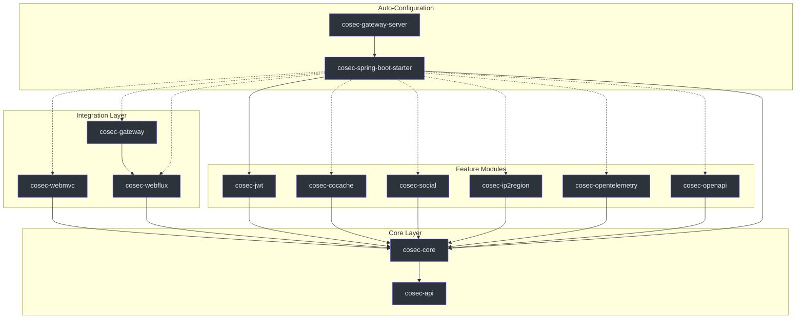
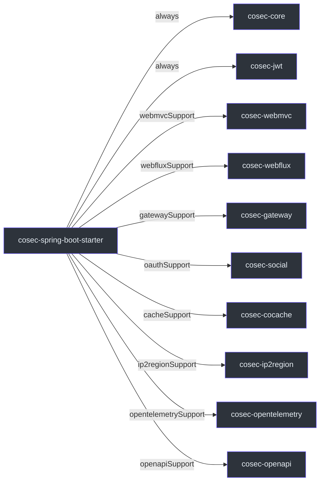
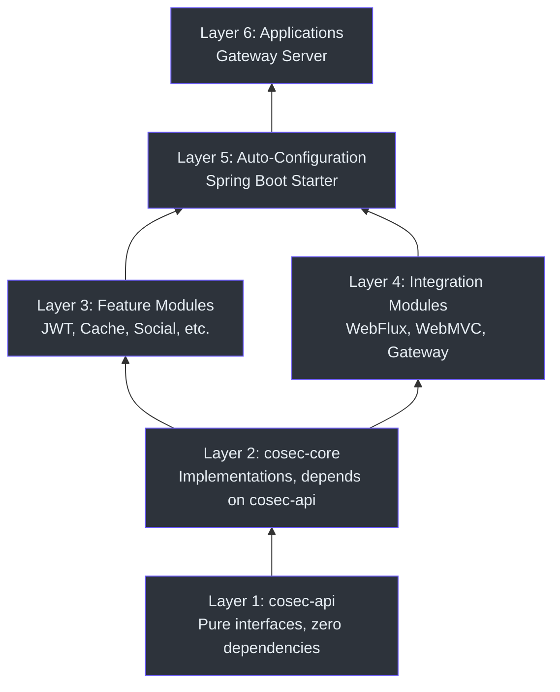

# 模块依赖关系图

CoSec 采用多模块 Gradle Kotlin DSL 项目组织，具有清晰的关注点分离。每个模块都有明确定义的职责和依赖边界，支持灵活的组合和最小的耦合。

## 高层模块架构

项目在 [settings.gradle.kts](https://github.com/Ahoo-Wang/CoSec/blob/main/settings.gradle.kts) 中声明，列出了所有 15 个包含的模块。架构采用分层方法，API 模块定义契约，核心模块提供实现，集成模块适配各种运行时环境。



## 模块参考表

| 模块 | 职责 | 关键类 | 依赖 |
|------|------|--------|------|
| `cosec-api` | 核心接口，无框架依赖 | [CoSecPrincipal](https://github.com/Ahoo-Wang/CoSec/blob/main/cosec-api/src/main/kotlin/me/ahoo/cosec/api/principal/CoSecPrincipal.kt#L35), [Authorization](https://github.com/Ahoo-Wang/CoSec/blob/main/cosec-api/src/main/kotlin/me/ahoo/cosec/api/authorization/Authorization.kt#L35), [Policy](https://github.com/Ahoo-Wang/CoSec/blob/main/cosec-api/src/main/kotlin/me/ahoo/cosec/api/policy/Policy.kt#L45), [Tenant](https://github.com/Ahoo-Wang/CoSec/blob/main/cosec-api/src/main/kotlin/me/ahoo/cosec/api/tenant/Tenant.kt#L22) | 无（纯 API） |
| `cosec-core` | 策略评估、认证、授权 | [SimpleAuthorization](https://github.com/Ahoo-Wang/CoSec/blob/main/cosec-core/src/main/kotlin/me/ahoo/cosec/authorization/SimpleAuthorization.kt#L48), PolicyRepository, BlacklistChecker | `cosec-api` |
| `cosec-jwt` | JWT 令牌创建和验证 | JwtTokenVerifier, TokenConverter | `cosec-core` |
| `cosec-cocache` | 基于 Redis 的策略/权限分布式缓存 | CachedPolicyRepository, CachedAppRolePermissionRepository | `cosec-core` |
| `cosec-social` | 通过 JustAuth 的 OAuth 社交认证 | SocialAuthentication, OAuthService | `cosec-core` |
| `cosec-ip2region` | 用于条件匹配的 IP 地理定位 | Ip2RegionConditionMatcher | `cosec-core` |
| `cosec-opentelemetry` | 安全操作的 OpenTelemetry 追踪 | SecurityTracingFilter | `cosec-core` |
| `cosec-openapi` | 安全端点的 Swagger/OpenAPI 集成 | CoSecOpenApiCustomizer | `cosec-core` |
| `cosec-webflux` | Spring WebFlux 的响应式 WebFilter | [ReactiveSecurityFilter](https://github.com/Ahoo-Wang/CoSec/blob/main/cosec-webflux/src/main/kotlin/me/ahoo/cosec/webflux/ReactiveSecurityFilter.kt#L57), [ReactiveAuthorizationFilter](https://github.com/Ahoo-Wang/CoSec/blob/main/cosec-webflux/src/main/kotlin/me/ahoo/cosec/webflux/ReactiveAuthorizationFilter.kt#L36) | `cosec-core` |
| `cosec-webmvc` | Spring WebMVC 的 Servlet 过滤器 | ServletAuthorizationFilter, ServletSecurityFilter | `cosec-core` |
| `cosec-gateway` | Spring Cloud Gateway GlobalFilter | [AuthorizationGatewayFilter](https://github.com/Ahoo-Wang/CoSec/blob/main/cosec-gateway/src/main/kotlin/me/ahoo/cosec/gateway/AuthorizationGatewayFilter.kt#L31) | `cosec-webflux` |
| `cosec-spring-boot-starter` | 自动配置，聚合所有模块 | CoSecAutoConfiguration, 条件功能 | `cosec-core`, `cosec-jwt`, 可选模块 |
| `cosec-gateway-server` | 独立网关应用（不发布） | GatewayApplication | `cosec-spring-boot-starter` |
| `cosec-dependencies` | 依赖管理的版本目录 | libs.versions.toml | 无 |
| `cosec-bom` | 用于一致版本控制的物料清单 | BOM 定义 | `cosec-dependencies` |

## Starter 中的功能能力

`cosec-spring-boot-starter` 模块使用 Gradle 功能变体来提供可选能力。如 [cosec-spring-boot-starter/build.gradle.kts](https://github.com/Ahoo-Wang/CoSec/blob/main/cosec-spring-boot-starter/build.gradle.kts#L18) 中声明，每个功能注册为单独的能力：



Starter 的使用者可以通过声明相应依赖来选择特定功能：

```kotlin
// 仅 WebFlux 支持
implementation("me.ahoo.cosec:cosec-spring-boot-starter-webflux-support")

// 仅 Gateway 支持（传递性引入 WebFlux）
implementation("me.ahoo.cosec:cosec-spring-boot-starter-gateway-support")
```

## 依赖分层原则



关键架构原则：

1. **API 隔离** —— `cosec-api` 零框架依赖。所有安全契约都是纯 Kotlin 接口，使用 Project Reactor 的 `Mono<T>`。这确保 API 层可以被任何运行时实现。

2. **核心作为唯一实现** —— `cosec-core` 是具体实现的唯一提供者。如 [SimpleAuthorization](https://github.com/Ahoo-Wang/CoSec/blob/main/cosec-core/src/main/kotlin/me/ahoo/cosec/authorization/SimpleAuthorization.kt#L48) 中所见，核心授权逻辑委托给 `PolicyRepository` 和 `AppRolePermissionRepository` 接口，这些接口由上层装配。

3. **集成无感知** —— 集成模块（`cosec-webflux`、`cosec-webmvc`、`cosec-gateway`）仅依赖 `cosec-core`，彼此之间不依赖。Gateway 模块是一个特例，它扩展了 WebFlux 过滤器，因为两者都在响应式上下文中运行。

4. **可选功能组合** —— Starter 模块使用 Gradle 的 `registerFeature` 机制（参见 [build.gradle.kts:18-49](https://github.com/Ahoo-Wang/CoSec/blob/main/cosec-spring-boot-starter/build.gradle.kts#L18)）来提供可选模块，而不会强制使用者使用传递性依赖。

5. **BOM 版本对齐** —— `cosec-dependencies` 和 `cosec-bom` 确保所有模块使用一致的外部依赖版本，通过 `gradle/libs.versions.toml` 中的 Gradle 版本目录管理。

## 参考资料

- [settings.gradle.kts](https://github.com/Ahoo-Wang/CoSec/blob/main/settings.gradle.kts#L14) —— 所有模块声明
- [cosec-spring-boot-starter/build.gradle.kts](https://github.com/Ahoo-Wang/CoSec/blob/main/cosec-spring-boot-starter/build.gradle.kts#L18) —— 功能变体注册
- [SimpleAuthorization.kt](https://github.com/Ahoo-Wang/CoSec/blob/main/cosec-core/src/main/kotlin/me/ahoo/cosec/authorization/SimpleAuthorization.kt#L48) —— 核心授权实现
- [CoSecPrincipal.kt](https://github.com/Ahoo-Wang/CoSec/blob/main/cosec-api/src/main/kotlin/me/ahoo/cosec/api/principal/CoSecPrincipal.kt#L35) —— 主体接口（API 层）
- [Authorization.kt](https://github.com/Ahoo-Wang/CoSec/blob/main/cosec-api/src/main/kotlin/me/ahoo/cosec/api/authorization/Authorization.kt#L35) —— 授权函数接口（API 层）
- [Policy.kt](https://github.com/Ahoo-Wang/CoSec/blob/main/cosec-api/src/main/kotlin/me/ahoo/cosec/api/policy/Policy.kt#L45) —— 策略接口（API 层）

## 相关页面

- [安全模型](./security-model.md) —— 详细的策略和主体模型
- [响应式设计](./reactive-design.md) —— Reactor 如何在各模块中使用
- [多租户](./multi-tenancy.md) —— 租户模型和 TenantCapable 接口
