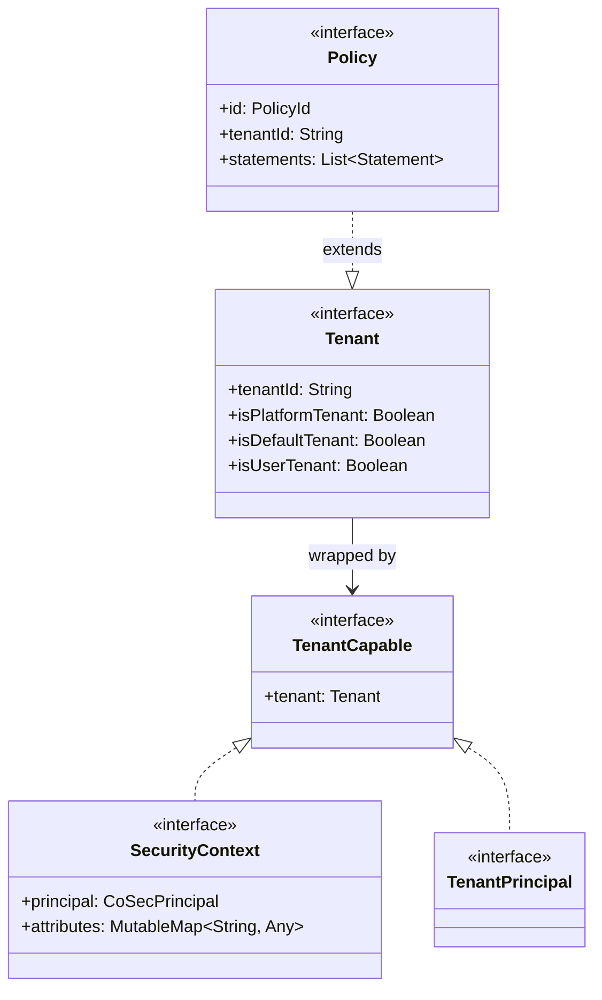
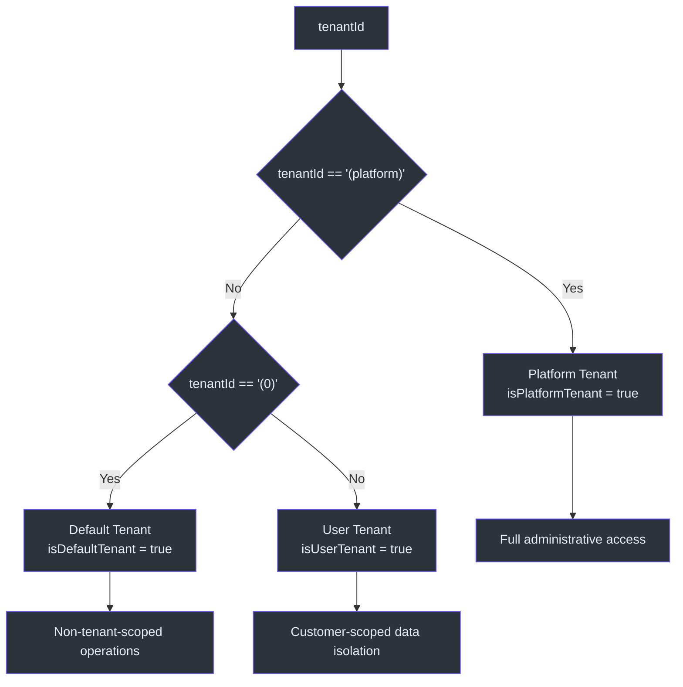
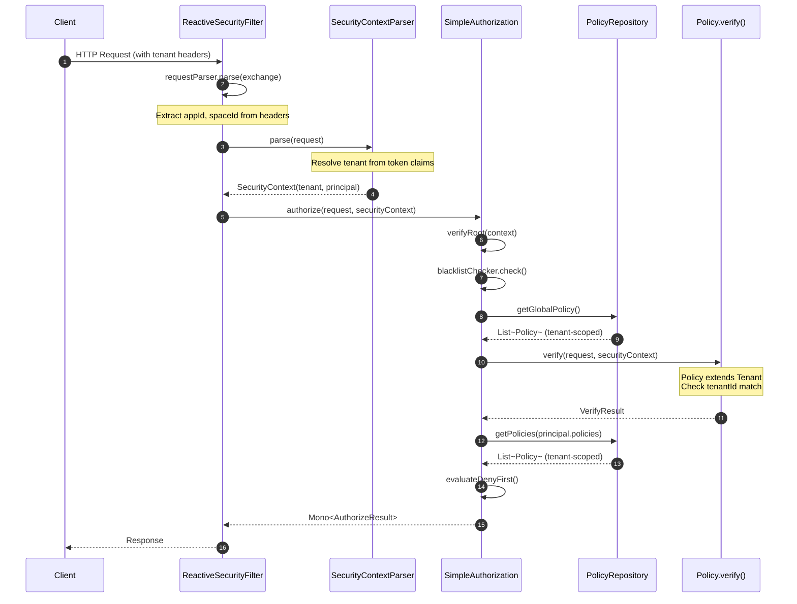
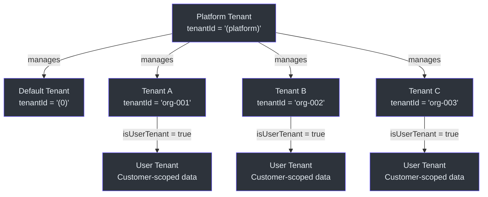

# 多租户

CoSec 将多租户作为安全模型中的一等概念。租户定义了客户之间的水平边界，每个授权决策都可以限定到特定的租户范围。本页涵盖租户模型、租户感知主体、租户范围的策略评估以及租户上下文如何在安全管道中流转。

## 租户模型

`Tenant` 接口（[Tenant.kt:22](https://github.com/Ahoo-Wang/CoSec/blob/main/cosec-api/src/main/kotlin/me/ahoo/cosec/api/tenant/Tenant.kt#L22)）使用基于 ID 的简单分类定义了三种租户类型：



### 租户类型和常量

`Tenant` 伴生对象（[Tenant.kt:50-68](https://github.com/Ahoo-Wang/CoSec/blob/main/cosec-api/src/main/kotlin/me/ahoo/cosec/api/tenant/Tenant.kt#L50)）定义了分类：

| 常量 | 值 | 含义 |
|------|-----|------|
| `PLATFORM_TENANT_ID` | `"(platform)"` | 拥有完全管理访问权限的根平台租户 |
| `DEFAULT_TENANT_ID` | `"(0)"` | 用于非租户范围操作的默认租户 |

派生的布尔属性提供了便捷的分类方式：

- **`isPlatformTenant`**（[第 35 行](https://github.com/Ahoo-Wang/CoSec/blob/main/cosec-api/src/main/kotlin/me/ahoo/cosec/api/tenant/Tenant.kt#L35)）—— 当 `tenantId` 等于 `PLATFORM_TENANT_ID` 时为 true。平台租户通常管理所有其他租户。
- **`isDefaultTenant`**（[第 41 行](https://github.com/Ahoo-Wang/CoSec/blob/main/cosec-api/src/main/kotlin/me/ahoo/cosec/api/tenant/Tenant.kt#L41)）—— 当 `tenantId` 等于 `DEFAULT_TENANT_ID` 时为 true。未指定显式租户时使用默认租户。
- **`isUserTenant`**（[第 47 行](https://github.com/Ahoo-Wang/CoSec/blob/main/cosec-api/src/main/kotlin/me/ahoo/cosec/api/tenant/Tenant.kt#L47)）—— 当租户既不是平台租户也不是默认租户时为 true。这代表实际的客户租户。



## TenantCapable 和 TenantPrincipal

`TenantCapable`（[TenantCapable.kt:23](https://github.com/Ahoo-Wang/CoSec/blob/main/cosec-api/src/main/kotlin/me/ahoo/cosec/api/tenant/TenantCapable.kt#L23)）是一个简单接口，暴露 `tenant` 属性。它由两个关键抽象实现：

1. **`SecurityContext`**（[SecurityContext.kt:34](https://github.com/Ahoo-Wang/CoSec/blob/main/cosec-api/src/main/kotlin/me/ahoo/cosec/api/context/SecurityContext.kt#L34)）—— 安全上下文扩展了 `TenantCapable`，确保授权期间租户信息可用。

2. **`TenantPrincipal`**（[TenantPrincipal.kt:26](https://github.com/Ahoo-Wang/CoSec/blob/main/cosec-api/src/main/kotlin/me/ahoo/cosec/api/principal/TenantPrincipal.kt#L26)）—— 同时扩展 `CoSecPrincipal` 和 `TenantCapable`，将租户身份与用户的主体一起携带。

这种设计意味着在授权期间可以通过两种路径访问租户上下文：
- `context.tenant.tenantId` —— 来自安全上下文
- `context.principal.tenant.tenantId` —— 来自租户感知主体（如果可用）

## 租户上下文流转

租户上下文贯穿整个安全管道，从传入请求到策略评估。



### 请求级租户识别

`Request` 接口（[Request.kt:36](https://github.com/Ahoo-Wang/CoSec/blob/main/cosec-api/src/main/kotlin/me/ahoo/cosec/api/context/request/Request.kt#L36)）携带 `appId` 和 `spaceId` 属性，用于标识请求的应用和空间（租户分区）。这些从头信息或查询参数中解析：

```kotlin
override val appId: AppId
    get() = getHeader(APP_ID_KEY).ifBlank { getQuery(APP_ID_KEY) }

override val spaceId: SpaceId
    get() = getHeader(SPACE_ID_KEY).ifBlank { getQuery(SPACE_ID_KEY) }
```

`spaceId` 通常映射到租户标识符，允许授权层将角色权限限定到正确的租户分区。

### 策略级租户范围

`Policy` 接口（[Policy.kt:45](https://github.com/Ahoo-Wang/CoSec/blob/main/cosec-api/src/main/kotlin/me/ahoo/cosec/api/policy/Policy.kt#L45)）扩展了 `Tenant`，意味着每个策略都有 `tenantId`。这允许 `PolicyRepository` 仅获取与当前租户相关的策略，并使条件匹配器能够强制执行租户边界。

在授权期间，`SimpleAuthorization`（[SimpleAuthorization.kt:82-113](https://github.com/Ahoo-Wang/CoSec/blob/main/cosec-core/src/main/kotlin/me/ahoo/cosec/authorization/SimpleAuthorization.kt#L82)）通过条件匹配器过滤策略，其中可以包括租户感知检查，如 `InTenant` 条件。

## 租户层次结构



平台租户是管理根。平台管理员可以定义适用于所有租户的全局策略，或为个别客户创建租户特定的策略。`SimpleAuthorization` 的评估顺序确保全局策略（可能是平台租户范围的）在主体特定策略之前评估（[SimpleAuthorization.kt:156-178](https://github.com/Ahoo-Wang/CoSec/blob/main/cosec-core/src/main/kotlin/me/ahoo/cosec/authorization/SimpleAuthorization.kt#L156)）。

## 租户条件的 SPI 扩展点

CoSec 提供了内置的 `ConditionMatcher` 实现来强制执行租户边界：

- **`InTenant`** —— 当当前安全上下文属于指定租户时匹配。用于应仅在特定租户范围内应用的策略。
- **`Authenticated`** —— 可以与租户检查结合使用，强制只有特定租户内的已认证用户才能访问资源。

这些条件匹配器通过 Java SPI（`META-INF/services/me.ahoo.cosec.policy.condition.ConditionMatcherFactory`）注册，允许在不修改核心框架的情况下添加自定义的租户感知条件。

## 参考资料

- [Tenant.kt](https://github.com/Ahoo-Wang/CoSec/blob/main/cosec-api/src/main/kotlin/me/ahoo/cosec/api/tenant/Tenant.kt#L22) —— 带平台/默认/用户分类的租户接口
- [TenantCapable.kt](https://github.com/Ahoo-Wang/CoSec/blob/main/cosec-api/src/main/kotlin/me/ahoo/cosec/api/tenant/TenantCapable.kt#L23) —— TenantCapable 接口
- [TenantPrincipal.kt](https://github.com/Ahoo-Wang/CoSec/blob/main/cosec-api/src/main/kotlin/me/ahoo/cosec/api/principal/TenantPrincipal.kt#L26) —— 带租户感知的主体
- [SecurityContext.kt](https://github.com/Ahoo-Wang/CoSec/blob/main/cosec-api/src/main/kotlin/me/ahoo/cosec/api/context/SecurityContext.kt#L34) —— 扩展 TenantCapable 的安全上下文
- [Policy.kt](https://github.com/Ahoo-Wang/CoSec/blob/main/cosec-api/src/main/kotlin/me/ahoo/cosec/api/policy/Policy.kt#L45) —— 扩展 Tenant 的策略
- [Request.kt](https://github.com/Ahoo-Wang/CoSec/blob/main/cosec-api/src/main/kotlin/me/ahoo/cosec/api/context/request/Request.kt#L36) —— 带 appId 和 spaceId 的请求
- [SimpleAuthorization.kt](https://github.com/Ahoo-Wang/CoSec/blob/main/cosec-core/src/main/kotlin/me/ahoo/cosec/authorization/SimpleAuthorization.kt#L48) —— 带租户范围策略评估的授权

## 相关页面

- [安全模型](./security-model.md) —— 策略和条件如何评估
- [响应式设计](./reactive-design.md) —— 租户上下文如何在响应式管道中流转
- [模块依赖关系图](./module-dependency.md) —— 模块结构概览
