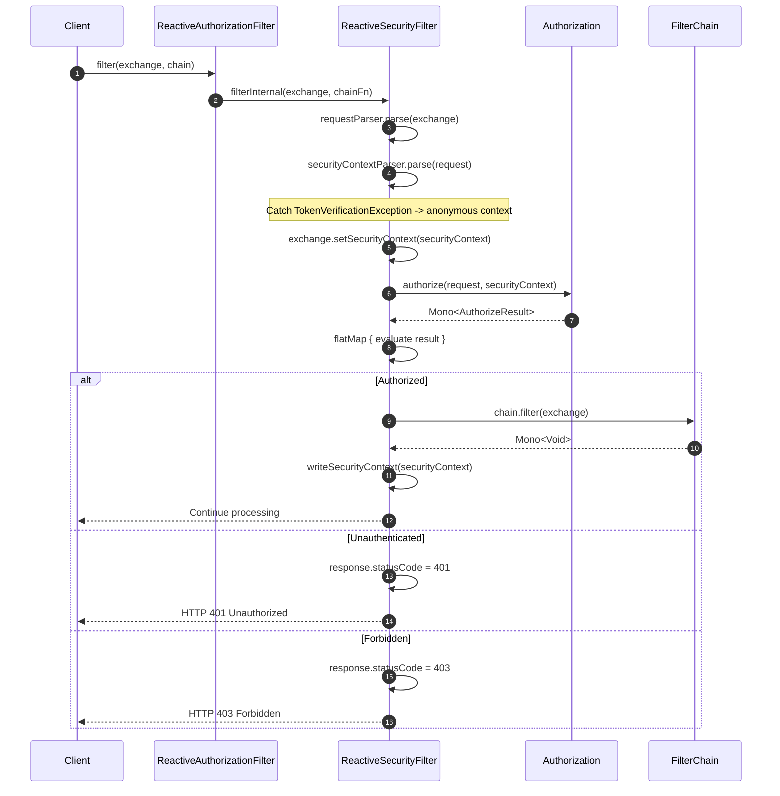
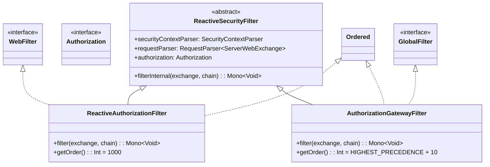
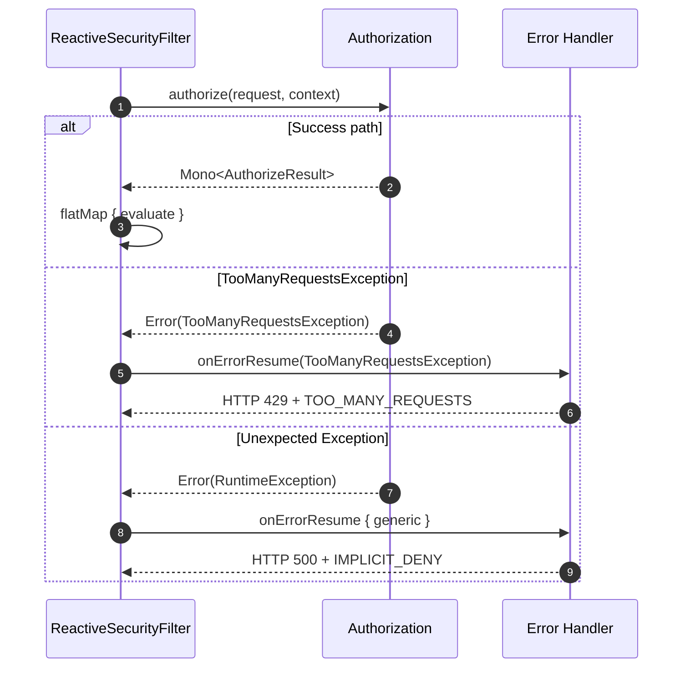

# 响应式设计

CoSec 从底层开始构建在 Project Reactor 之上。每个授权和认证操作都返回 `Mono<T>`，实现完全非阻塞的安全评估。本页追踪从传入 HTTP 请求经过过滤器链、授权管道到错误处理的响应式数据流。

## 核心响应式契约

CoSec 响应式设计的基础是 `Authorization` 函数接口（[Authorization.kt:35](https://github.com/Ahoo-Wang/CoSec/blob/main/cosec-api/src/main/kotlin/me/ahoo/cosec/api/authorization/Authorization.kt#L35)），它返回 `Mono<AuthorizeResult>`：

```kotlin
fun interface Authorization {
    fun authorize(
        request: Request,
        context: SecurityContext
    ): Mono<AuthorizeResult>
}
```

类似地，`Authentication` 接口（[Authentication.kt:32](https://github.com/Ahoo-Wang/CoSec/blob/main/cosec-api/src/main/kotlin/me/ahoo/cosec/api/authentication/Authentication.kt#L32)）返回 `Mono<out P>`：

```kotlin
interface Authentication<C : Credentials, out P : CoSecPrincipal> {
    fun authenticate(credentials: C): Mono<out P>
}
```

这两个契约确保调用者永远不会阻塞。响应式类型贯穿整个过滤器链，从 Spring 的 `WebFilter` 或 `GlobalFilter` 一直到仓库查找。

## 响应式过滤器链

核心的响应式集成点是 `ReactiveSecurityFilter`（[ReactiveSecurityFilter.kt:57](https://github.com/Ahoo-Wang/CoSec/blob/main/cosec-webflux/src/main/kotlin/me/ahoo/cosec/webflux/ReactiveSecurityFilter.kt#L57)），它被 `ReactiveAuthorizationFilter`（WebFlux）和 `AuthorizationGatewayFilter`（Spring Cloud Gateway）扩展。



### filterInternal 方法

`filterInternal` 方法（[ReactiveSecurityFilter.kt:66-116](https://github.com/Ahoo-Wang/CoSec/blob/main/cosec-webflux/src/main/kotlin/me/ahoo/cosec/webflux/ReactiveSecurityFilter.kt#L66)）是响应式管道的入口点。其结构如下：

1. **解析请求** —— 使用注入的 `RequestParser` 从 `ServerWebExchange` 解析（[第 70 行](https://github.com/Ahoo-Wang/CoSec/blob/main/cosec-webflux/src/main/kotlin/me/ahoo/cosec/webflux/ReactiveSecurityFilter.kt#L70)）。
2. **解析安全上下文** —— 使用注入的 `SecurityContextParser` 解析。如果发生 `TokenVerificationException`，捕获并回退到匿名上下文（[第 73-81 行](https://github.com/Ahoo-Wang/CoSec/blob/main/cosec-webflux/src/main/kotlin/me/ahoo/cosec/webflux/ReactiveSecurityFilter.kt#L73)）。
3. **授权** —— 调用 `authorization.authorize(request, securityContext)`（[第 85 行](https://github.com/Ahoo-Wang/CoSec/blob/main/cosec-webflux/src/main/kotlin/me/ahoo/cosec/webflux/ReactiveSecurityFilter.kt#L85)）。
4. **FlatMap** 结果：如果已授权，修改 exchange 中的主体并调用过滤器链；否则设置 401 或 403（[第 87-105 行](https://github.com/Ahoo-Wang/CoSec/blob/main/cosec-webflux/src/main/kotlin/me/ahoo/cosec/webflux/ReactiveSecurityFilter.kt#L87)）。
5. **onErrorResume** 处理 `TooManyRequestsException` 返回 HTTP 429（[第 106 行](https://github.com/Ahoo-Wang/CoSec/blob/main/cosec-webflux/src/main/kotlin/me/ahoo/cosec/webflux/ReactiveSecurityFilter.kt#L106)）。
6. **onErrorResume** 处理意外错误返回 HTTP 500 和 `IMPLICIT_DENY`（[第 109 行](https://github.com/Ahoo-Wang/CoSec/blob/main/cosec-webflux/src/main/kotlin/me/ahoo/cosec/webflux/ReactiveSecurityFilter.kt#L109)）。

## 授权中的 Mono 链

`SimpleAuthorization` 类（[SimpleAuthorization.kt:48](https://github.com/Ahoo-Wang/CoSec/blob/main/cosec-core/src/main/kotlin/me/ahoo/cosec/authorization/SimpleAuthorization.kt#L48)）使用 `Mono.switchIfEmpty` 构建响应式链，级联通过各授权阶段：

```mermaid
flowchart LR
    VERIFY["verify(request, context)"]
    GLOBAL["verifyGlobalPolicies()"]
    PRINCIPAL["verifyPrincipalPolicies()"]
    ROLE["verifyAppRolePermission()"]
    MAP["map to AuthorizeResult"]
    DENY["IMPLICIT_DENY"]

    VERIFY --> GLOBAL
    GLOBAL -->|"switchIfEmpty"| PRINCIPAL
    PRINCIPAL -->|"switchIfEmpty"| ROLE
    ROLE --> MAP
    MAP -->|"switchIfEmpty"| DENY

    style VERIFY fill:#2d333b,stroke:#6d5dfc,color:#e6edf3
    style GLOBAL fill:#2d333b,stroke:#6d5dfc,color:#e6edf3
    style PRINCIPAL fill:#2d333b,stroke:#6d5dfc,color:#e6edf3
    style ROLE fill:#2d333b,stroke:#6d5dfc,color:#e6edf3
    style MAP fill:#2d333b,stroke:#6d5dfc,color:#e6edf3
    style DENY fill:#2d333b,stroke:#6d5dfc,color:#e6edf3

```



`verify` 方法（[SimpleAuthorization.kt:194-211](https://github.com/Ahoo-Wang/CoSec/blob/main/cosec-core/src/main/kotlin/me/ahoo/cosec/authorization/SimpleAuthorization.kt#L194)）构建此链：

```kotlin
verifyGlobalPolicies(request, context)
    .switchIfEmpty { verifyPrincipalPolicies(request, context) }
    .switchIfEmpty { verifyAppRolePermission(request, context) }
    .map { context.setVerifyContext(it); it.result.toAuthorizeResult() }
    .switchIfEmpty { AuthorizeResult.IMPLICIT_DENY.toMono() }
```

每个 `verifyXxx` 方法返回 `Mono<VerifyContext>`。如果方法产生空的 `Mono`（无匹配策略），`switchIfEmpty` 触发下一阶段。这在语义上等同于一系列 `orElse` 调用，但以非阻塞的响应式风格实现。

外层的 `authorize` 方法（[SimpleAuthorization.kt:213-232](https://github.com/Ahoo-Wang/CoSec/blob/main/cosec-core/src/main/kotlin/me/ahoo/cosec/authorization/SimpleAuthorization.kt#L213)）将 verify 链包装在同步根用户检查和异步黑名单检查中：

```kotlin
override fun authorize(request: Request, context: SecurityContext): Mono<AuthorizeResult> {
    val verifyResult = verifyRoot(context)          // synchronous
    if (verifyResult == VerifyResult.ALLOW) {
        return AuthorizeResult.ALLOW.toMono()       // short-circuit
    }
    return blacklistChecker.check(request, context)  // Mono<Boolean>
        .flatMap { allowed ->
            if (!allowed) return@flatMap AuthorizeResult.EXPLICIT_DENY.toMono()
            verify(request, context)                // cascade chain
        }
}
```

## 集成变体

三个集成模块消费响应式授权管道，每个适配不同的 Spring 运行时。



### ReactiveAuthorizationFilter（WebFlux）

WebFlux 变体（[ReactiveAuthorizationFilter.kt:36](https://github.com/Ahoo-Wang/CoSec/blob/main/cosec-webflux/src/main/kotlin/me/ahoo/cosec/webflux/ReactiveAuthorizationFilter.kt#L36)）实现 `WebFilter` 并委托给 `filterInternal`。它以 `1000` 的顺序运行，在框架过滤器（CORS 等）之后、应用过滤器之前执行。

### AuthorizationGatewayFilter（Spring Cloud Gateway）

Gateway 变体（[AuthorizationGatewayFilter.kt:31](https://github.com/Ahoo-Wang/CoSec/blob/main/cosec-gateway/src/main/kotlin/me/ahoo/cosec/gateway/AuthorizationGatewayFilter.kt#L31)）实现 Spring Cloud Gateway 的 `GlobalFilter`。它以 `HIGHEST_PRECEDENCE + 10` 运行，以便在网关过滤器链中非常早地进行授权。授权成功后，它会修改请求以向下游传播 `requestId` 头（[第 47-50 行](https://github.com/Ahoo-Wang/CoSec/blob/main/cosec-gateway/src/main/kotlin/me/ahoo/cosec/gateway/AuthorizationGatewayFilter.kt#L47)）。

## 错误处理策略

响应式管道在两个级别使用 `onErrorResume` 操作符以确保优雅降级：



错误处理在 `filterInternal` 中分层（[ReactiveSecurityFilter.kt:106-114](https://github.com/Ahoo-Wang/CoSec/blob/main/cosec-webflux/src/main/kotlin/me/ahoo/cosec/webflux/ReactiveSecurityFilter.kt#L106)）：

1. **TokenVerificationException** —— 在上下文解析期间同步捕获（[第 75 行](https://github.com/Ahoo-Wang/CoSec/blob/main/cosec-webflux/src/main/kotlin/me/ahoo/cosec/webflux/ReactiveSecurityFilter.kt#L75)）。请求以匿名用户身份继续。如果匿名用户稍后被拒绝，响应为 401（而非 403）。

2. **TooManyRequestsException** —— 通过 `onErrorResume(TooManyRequestsException::class.java)` 捕获（[第 106 行](https://github.com/Ahoo-Wang/CoSec/blob/main/cosec-webflux/src/main/kotlin/me/ahoo/cosec/webflux/ReactiveSecurityFilter.kt#L106)）。返回 HTTP 429 和 `TOO_MANY_REQUESTS` 结果体。这通常由速率限制 `ConditionMatcher` 实现触发。

3. **通用异常** —— 由最终的 `onErrorResume` 块捕获（[第 109 行](https://github.com/Ahoo-Wang/CoSec/blob/main/cosec-webflux/src/main/kotlin/me/ahoo/cosec/webflux/ReactiveSecurityFilter.kt#L109)）。以 ERROR 级别记录日志并返回 HTTP 500 和 `IMPLICIT_DENY`。这确保安全框架永远不会使应用崩溃；在意外失败时默认拒绝访问。

所有错误响应都使用 `CoSecJsonSerializer` 序列化为 JSON，并通过 `writeWithAuthorizeResult` 写入 `Mono<Void>`（[第 118 行](https://github.com/Ahoo-Wang/CoSec/blob/main/cosec-webflux/src/main/kotlin/me/ahoo/cosec/webflux/ReactiveSecurityFilter.kt#L118)）。

## 参考资料

- [Authorization.kt](https://github.com/Ahoo-Wang/CoSec/blob/main/cosec-api/src/main/kotlin/me/ahoo/cosec/api/authorization/Authorization.kt#L35) —— `Mono<AuthorizeResult>` 契约
- [Authentication.kt](https://github.com/Ahoo-Wang/CoSec/blob/main/cosec-api/src/main/kotlin/me/ahoo/cosec/api/authentication/Authentication.kt#L32) —— `Mono<out P>` 契约
- [ReactiveSecurityFilter.kt](https://github.com/Ahoo-Wang/CoSec/blob/main/cosec-webflux/src/main/kotlin/me/ahoo/cosec/webflux/ReactiveSecurityFilter.kt#L57) —— 带错误处理的基础响应式过滤器
- [ReactiveAuthorizationFilter.kt](https://github.com/Ahoo-Wang/CoSec/blob/main/cosec-webflux/src/main/kotlin/me/ahoo/cosec/webflux/ReactiveAuthorizationFilter.kt#L36) —— WebFlux WebFilter 适配器
- [AuthorizationGatewayFilter.kt](https://github.com/Ahoo-Wang/CoSec/blob/main/cosec-gateway/src/main/kotlin/me/ahoo/cosec/gateway/AuthorizationGatewayFilter.kt#L31) —— Gateway GlobalFilter 适配器
- [SimpleAuthorization.kt](https://github.com/Ahoo-Wang/CoSec/blob/main/cosec-core/src/main/kotlin/me/ahoo/cosec/authorization/SimpleAuthorization.kt#L48) —— `Mono.switchIfEmpty` 授权级联

## 相关页面

- [安全模型](./security-model.md) —— 响应式链背后的策略评估算法
- [模块依赖关系图](./module-dependency.md) —— WebFlux、Gateway 和 WebMVC 模块的结构
- [多租户](./multi-tenancy.md) —— 租户上下文如何在响应式管道中流转
