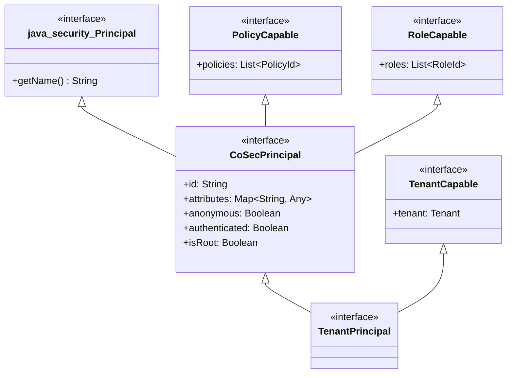
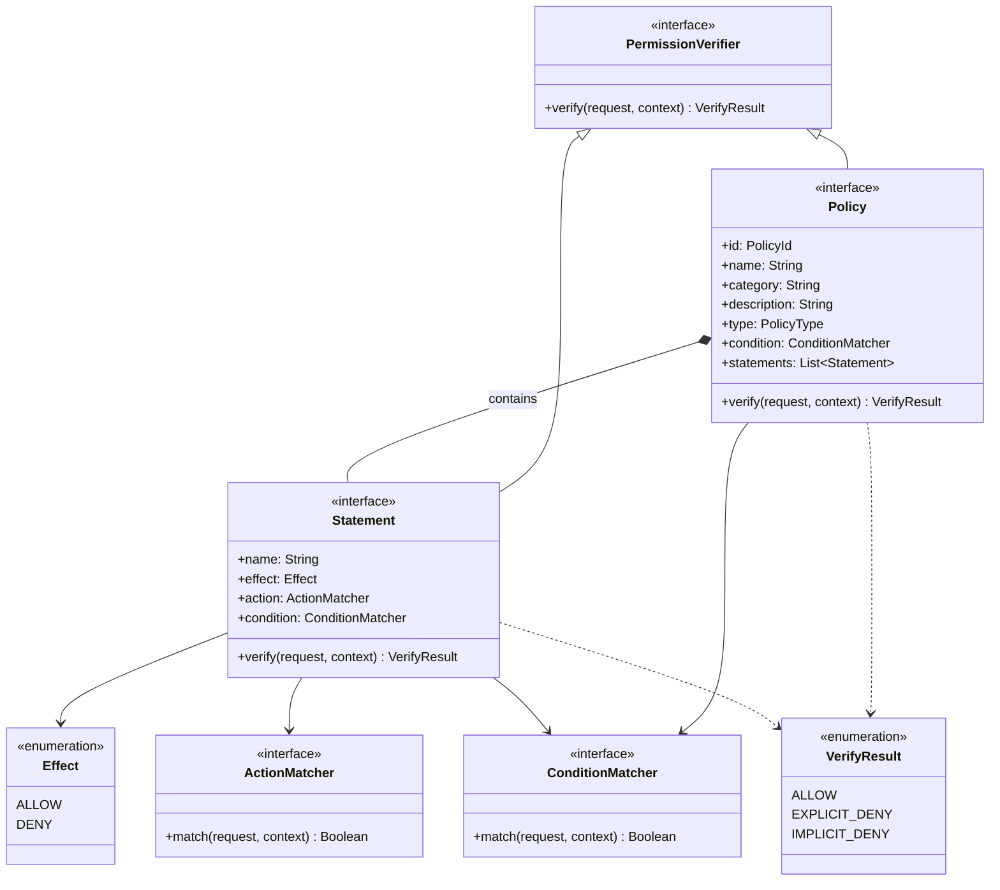
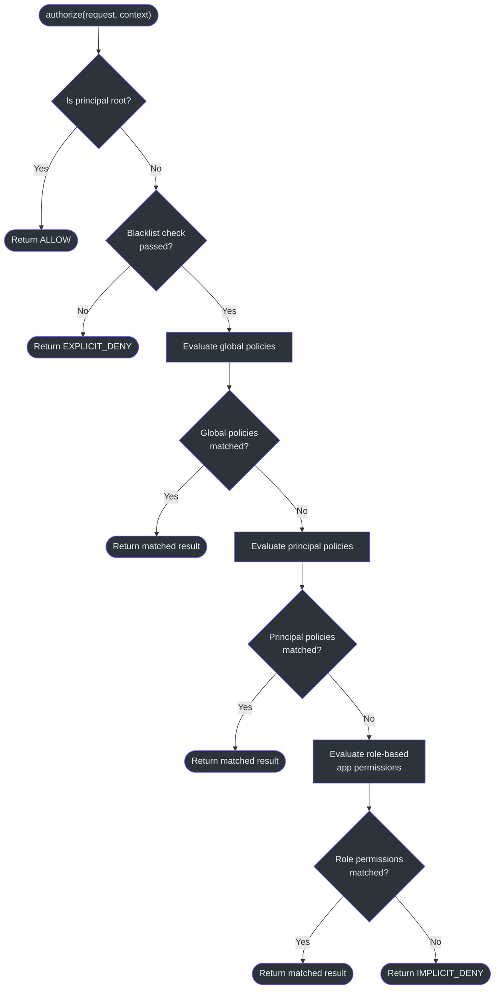

# 安全模型

CoSec 实现了一个受 AWS IAM 启发的安全模型，将基于角色的访问控制（RBAC）与基于策略的授权相结合。该模型通过拒绝优先算法评估请求，确保访问是被显式授予而非隐式允许的。

## 主体层次结构

主体系统定义了身份层。所有主体通过 `CoSecPrincipal` 接口扩展 `java.security.Principal`，获得 id、角色、策略和属性。特化的主体添加了租户和令牌感知能力。



如 [CoSecPrincipal.kt:35](https://github.com/Ahoo-Wang/CoSec/blob/main/cosec-api/src/main/kotlin/me/ahoo/cosec/api/principal/CoSecPrincipal.kt#L35) 中定义，每个主体携带：

- **id** —— 唯一标识符；根用户 id 默认为 `"cosec"`（可通过系统属性 `cosec.root` 配置）
- **roles** —— 用于 RBAC 权限查找的角色标识符列表
- **policies** —— 直接附加到主体的策略标识符列表
- **attributes** —— 用于自定义用户元数据的任意键值对

`isRoot` 扩展属性（[第 94 行](https://github.com/Ahoo-Wang/CoSec/blob/main/cosec-api/src/main/kotlin/me/ahoo/cosec/api/principal/CoSecPrincipal.kt#L94)）检查主体的 id 是否匹配 `ROOT_ID`。根用户完全绕过所有授权检查。

`TenantPrincipal`（[TenantPrincipal.kt:26](https://github.com/Ahoo-Wang/CoSec/blob/main/cosec-api/src/main/kotlin/me/ahoo/cosec/api/principal/TenantPrincipal.kt#L26)）扩展了 `CoSecPrincipal` 和 `TenantCapable`，添加了 `tenant` 属性，通过安全上下文携带租户身份。

## 策略模型

策略系统反映了 AWS IAM 的结构：一个 **Policy** 包含多个 **Statement**，每个具有 **Effect**（ALLOW 或 DENY）、**ActionMatcher** 和 **ConditionMatcher**。



### 语句评估

每个 `Statement`（[Statement.kt:37](https://github.com/Ahoo-Wang/CoSec/blob/main/cosec-api/src/main/kotlin/me/ahoo/cosec/api/policy/Statement.kt#L37)）通过两个步骤评估请求：

1. **动作匹配** —— `ActionMatcher` 确定语句是否适用于请求的路径、方法或其他属性。
2. **条件匹配** —— `ConditionMatcher` 评估上下文谓词（认证状态、租户成员资格、速率限制等）。

如果两者都匹配，语句返回 `ALLOW`（对于 `Effect.ALLOW`）或 `EXPLICIT_DENY`（对于 `Effect.DENY`）。如果任一失败，返回 `IMPLICIT_DENY`。

### 策略级拒绝优先算法

`Policy.verify()` 默认实现（[Policy.kt:76-103](https://github.com/Ahoo-Wang/CoSec/blob/main/cosec-api/src/main/kotlin/me/ahoo/cosec/api/policy/Policy.kt#L76)）强制执行严格的评估顺序：

1. 检查策略级别的 `condition` 是否匹配请求。如果不匹配，返回 `IMPLICIT_DENY`。
2. 首先迭代所有 **DENY** 语句。如果有任何返回 `EXPLICIT_DENY`，立即短路返回 `EXPLICIT_DENY`。
3. 迭代所有 **ALLOW** 语句。如果有任何返回 `ALLOW`，立即短路返回 `ALLOW`。
4. 默认返回 `IMPLICIT_DENY`。

这种拒绝优先的方法确保显式拒绝始终优先于允许，与 AWS IAM 评估逻辑一致。

## 授权流程

`SimpleAuthorization`（[SimpleAuthorization.kt:48](https://github.com/Ahoo-Wang/CoSec/blob/main/cosec-core/src/main/kotlin/me/ahoo/cosec/authorization/SimpleAuthorization.kt#L48)）编排完整的授权管道。它按定义的优先级顺序评估多个权限来源。



`authorize` 方法（[SimpleAuthorization.kt:213-232](https://github.com/Ahoo-Wang/CoSec/blob/main/cosec-core/src/main/kotlin/me/ahoo/cosec/authorization/SimpleAuthorization.kt#L213)）遵循以下序列：

1. **根用户绕过**（[第 146 行](https://github.com/Ahoo-Wang/CoSec/blob/main/cosec-core/src/main/kotlin/me/ahoo/cosec/authorization/SimpleAuthorization.kt#L146)）—— 如果 `context.principal.isRoot` 为 true，立即返回 `ALLOW`。
2. **黑名单检查**（[第 221 行](https://github.com/Ahoo-Wang/CoSec/blob/main/cosec-core/src/main/kotlin/me/ahoo/cosec/authorization/SimpleAuthorization.kt#L221)）—— `BlacklistChecker` 验证请求未被阻止。如果被阻止，返回 `EXPLICIT_DENY`。
3. **全局策略**（[第 156 行](https://github.com/Ahoo-Wang/CoSec/blob/main/cosec-core/src/main/kotlin/me/ahoo/cosec/authorization/SimpleAuthorization.kt#L156)）—— 通过 `PolicyRepository.getGlobalPolicy()` 获取并评估全局策略。
4. **主体策略**（[第 166 行](https://github.com/Ahoo-Wang/CoSec/blob/main/cosec-core/src/main/kotlin/me/ahoo/cosec/authorization/SimpleAuthorization.kt#L166)）—— 通过 `PolicyRepository.getPolicies()` 获取并评估附加到主体的策略。
5. **角色权限**（[第 180 行](https://github.com/Ahoo-Wang/CoSec/blob/main/cosec-core/src/main/kotlin/me/ahoo/cosec/authorization/SimpleAuthorization.kt#L180)）—— 通过 `AppRolePermissionRepository.getAppRolePermission()` 获取并评估应用特定的角色权限。
6. **隐式拒绝**（[第 206 行](https://github.com/Ahoo-Wang/CoSec/blob/main/cosec-core/src/main/kotlin/me/ahoo/cosec/authorization/SimpleAuthorization.kt#L206)）—— 如果没有策略匹配，返回 `IMPLICIT_DENY`。

每个阶段使用 `Mono.switchIfEmpty` 来级联到下一阶段，形成响应式链。

## 大规模拒绝优先评估

`evaluateDenyFirst` 方法（[SimpleAuthorization.kt:61-80](https://github.com/Ahoo-Wang/CoSec/blob/main/cosec-core/src/main/kotlin/me/ahoo/cosec/authorization/SimpleAuthorization.kt#L61)）是一个通用辅助方法，用于策略语句和角色权限。它将项目作为 `Sequence` 处理以实现惰性评估，先按 `Effect.DENY` 过滤，再按 `Effect.ALLOW` 过滤：

```
1. 过滤所有 effect == DENY 的项目
2. 对每个 DENY 项目调用 verifyItem()
3. 如果有任何返回 EXPLICIT_DENY，短路返回
4. 过滤所有 effect == ALLOW 的项目
5. 对每个 ALLOW 项目调用 verifyItem()
6. 如果有任何返回 ALLOW，短路返回
7. 返回 null（无匹配）
```

此算法同时应用于 `PolicyStatementEntry` 对象（全局和主体策略）和 `RolePermissionEntry` 对象（基于角色的应用权限），确保所有授权来源具有一致的拒绝优先语义。

## AWS IAM 设计来源

CoSec 的设计与 AWS IAM 有直接的对应关系：

| AWS IAM 概念 | CoSec 等价物 |
|-------------|-------------|
| IAM Policy | `Policy` 接口 |
| Statement | `Statement` 接口 |
| Effect (Allow/Deny) | `Effect` 枚举 |
| Action | `ActionMatcher`（通过 SPI 工厂） |
| Resource | `ConditionMatcher`（基于路径的匹配器） |
| Condition | `ConditionMatcher`（基于上下文的匹配器） |
| Explicit Deny > Allow | `evaluateDenyFirst` 中的拒绝优先 |
| Implicit Deny | `IMPLICIT_DENY` 默认值 |
| Root user | `CoSecPrincipal.isRoot` 绕过 |
| Service Control Policy | 通过 `PolicyRepository.getGlobalPolicy()` 的全局策略 |
| Identity Policy | 通过 `principal.policies` 的主体特定策略 |

## 参考资料

- [CoSecPrincipal.kt](https://github.com/Ahoo-Wang/CoSec/blob/main/cosec-api/src/main/kotlin/me/ahoo/cosec/api/principal/CoSecPrincipal.kt#L35) —— 主体接口定义
- [TenantPrincipal.kt](https://github.com/Ahoo-Wang/CoSec/blob/main/cosec-api/src/main/kotlin/me/ahoo/cosec/api/principal/TenantPrincipal.kt#L26) —— 租户感知主体
- [Policy.kt](https://github.com/Ahoo-Wang/CoSec/blob/main/cosec-api/src/main/kotlin/me/ahoo/cosec/api/policy/Policy.kt#L45) —— 带拒绝优先 verify() 的策略接口
- [Statement.kt](https://github.com/Ahoo-Wang/CoSec/blob/main/cosec-api/src/main/kotlin/me/ahoo/cosec/api/policy/Statement.kt#L37) —— 包含 effect、action、condition 的语句
- [SimpleAuthorization.kt](https://github.com/Ahoo-Wang/CoSec/blob/main/cosec-core/src/main/kotlin/me/ahoo/cosec/authorization/SimpleAuthorization.kt#L48) —— 完整的授权管道
- [Authorization.kt](https://github.com/Ahoo-Wang/CoSec/blob/main/cosec-api/src/main/kotlin/me/ahoo/cosec/api/authorization/Authorization.kt#L35) —— 授权函数接口
- [SecurityContext.kt](https://github.com/Ahoo-Wang/CoSec/blob/main/cosec-api/src/main/kotlin/me/ahoo/cosec/api/context/SecurityContext.kt#L34) —— 持有主体和租户的安全上下文

## 相关页面

- [模块依赖关系图](./module-dependency.md) —— 安全模块的结构
- [响应式设计](./reactive-design.md) —— 授权如何与 Project Reactor 集成
- [多租户](./multi-tenancy.md) —— 租户范围的策略评估
