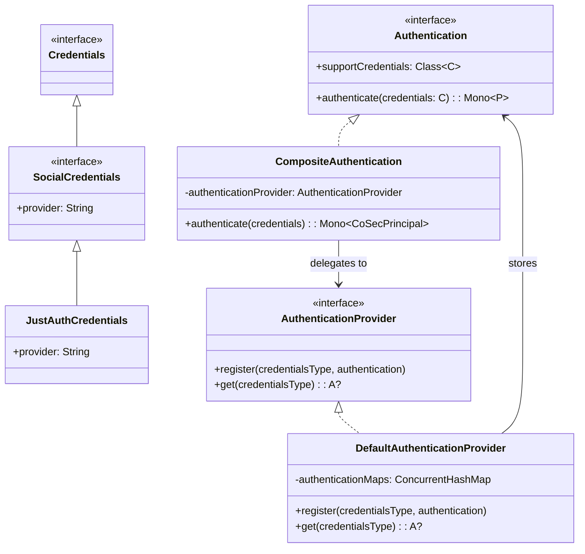
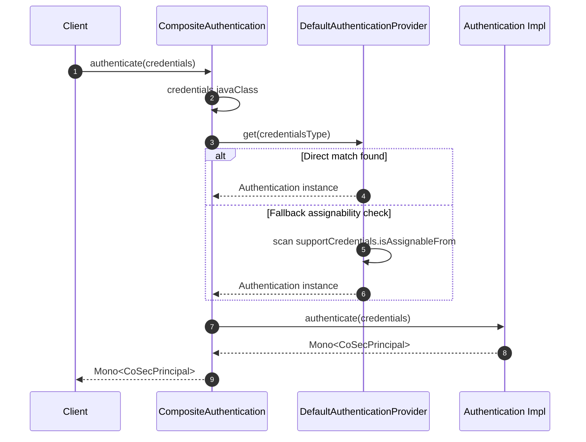
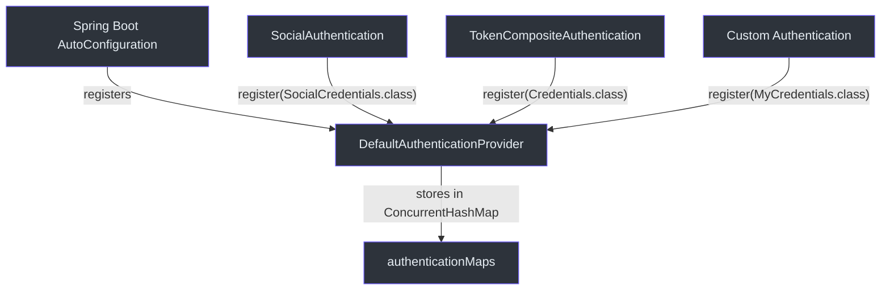

# 认证系统

CoSec 的认证层遵循基于 Project Reactor 构建的 **提供者/注册表** 模式。每种认证机制（令牌、社交 OAuth、用户名/密码）都插入到相同的通用接口中，组合分发器在运行时将凭据路由到正确的处理器。

## 核心接口

### Authentication<C, P>

顶层契约是 [Authentication<C, P>](../../../../cosec-api/src/main/kotlin/me/ahoo/cosec/api/authentication/Authentication.kt)，一个泛型响应式接口：

```kotlin
interface Authentication<C : Credentials, out P : CoSecPrincipal> {
    val supportCredentials: Class<C>
    fun authenticate(credentials: C): Mono<out P>
}
```

每个实现通过 `supportCredentials` 声明其处理的具体 `Credentials` 子类。`authenticate` 方法返回一个 `Mono`，使整个流程保持非阻塞。

### 凭据层次结构

[Credentials](../../../../cosec-api/src/main/kotlin/me/ahoo/cosec/api/authentication/Credentials.kt) 是类型层次结构根部的标记接口。具体实现包括 `SocialCredentials`、`JustAuthCredentials`、`RefreshTokenCredentials` 等。分发器使用 `credentials.javaClass` 查找正确的 `Authentication` 实例。

### AuthenticationProvider 注册表

[AuthenticationProvider](../../../../cosec-api/src/main/kotlin/me/ahoo/cosec/api/authentication/AuthenticationProvider.kt) 是一个类型安全的注册表，将凭据类映射到 `Authentication` 实例：

```kotlin
interface AuthenticationProvider {
    fun <C : Credentials, P : CoSecPrincipal, A : Authentication<C, P>> register(
        credentialsType: Class<C>, authentication: A)
    operator fun <C : Credentials, P : CoSecPrincipal, A : Authentication<C, P>> get(
        credentialsType: Class<out Credentials>): A?
}
```

### CompositeAuthentication 分发器

[CompositeAuthentication](../../../../cosec-core/src/main/kotlin/me/ahoo/cosec/authentication/CompositeAuthentication.kt) 实现了 `Authentication<Credentials, CoSecPrincipal>`，充当前端控制器。每次调用 `authenticate` 时，它会解析运行时凭据类型并委托给提供者：

```kotlin
override fun authenticate(credentials: Credentials): Mono<out CoSecPrincipal> {
    val credentialsType = credentials.javaClass
    return authenticate(credentialsType, credentials)
}
```

### DefaultAuthenticationProvider

[DefaultAuthenticationProvider](../../../../cosec-core/src/main/kotlin/me/ahoo/cosec/authentication/DefaultAuthenticationProvider.kt) 是一个由 `ConcurrentHashMap` 支持的单例对象。当直接查找失败时，它会回退到可赋值性检查 -- 扫描所有已注册的认证实现，找到 `supportCredentials.isAssignableFrom(credentialsType)` 返回 true 的那个。

## 架构图

### 类层次结构



### 组合认证序列图



### 提供者注册流程



## 关键设计决策

1. **类型安全分发**: 注册表以 `Class<C>` 为键，运行时不存在基于字符串的路由或类型转换歧义。
2. **可赋值性回退**: `DefaultAuthenticationProvider.get()` 首先尝试精确匹配，然后遍历所有条目检查 `isAssignableFrom`。这使得单个 `Authentication` 可以处理凭据超类型。
3. **全程响应式**: 每个 `authenticate` 调用都返回 `Mono`，支持与下游的策略评估和令牌转换进行非阻塞组合。
4. **单例提供者**: `DefaultAuthenticationProvider` 是一个 Kotlin `object`（单例），确保认证注册表只有一个真理来源。

## 参考文献

- [Authentication.kt:32](https://github.com/Ahoo-Wang/CoSec/blob/main/cosec-api/src/main/kotlin/me/ahoo/cosec/api/authentication/Authentication.kt#L32) - 核心 `Authentication<C, P>` 接口
- [AuthenticationProvider.kt:27](https://github.com/Ahoo-Wang/CoSec/blob/main/cosec-api/src/main/kotlin/me/ahoo/cosec/api/authentication/AuthenticationProvider.kt#L27) - 提供者注册表接口
- [Credentials.kt:24](https://github.com/Ahoo-Wang/CoSec/blob/main/cosec-api/src/main/kotlin/me/ahoo/cosec/api/authentication/Credentials.kt#L24) - 基础凭据标记接口
- [CompositeAuthentication.kt:24](https://github.com/Ahoo-Wang/CoSec/blob/main/cosec-core/src/main/kotlin/me/ahoo/cosec/authentication/CompositeAuthentication.kt#L24) - 前端控制器分发器
- [DefaultAuthenticationProvider.kt:27](https://github.com/Ahoo-Wang/CoSec/blob/main/cosec-core/src/main/kotlin/me/ahoo/cosec/authentication/DefaultAuthenticationProvider.kt#L27) - 基于 ConcurrentHashMap 的注册表

## 相关页面

- [JWT 集成](./jwt-integration.md) - JWT 令牌如何接入认证系统
- [社交认证](./social-authentication.md) - 通过 JustAuth 进行 OAuth 社交登录
- [令牌管理](./token-management.md) - 令牌层次结构和生命周期
- [授权流程](../authorization/authorization-flow.md) - 认证成功后会发生什么
